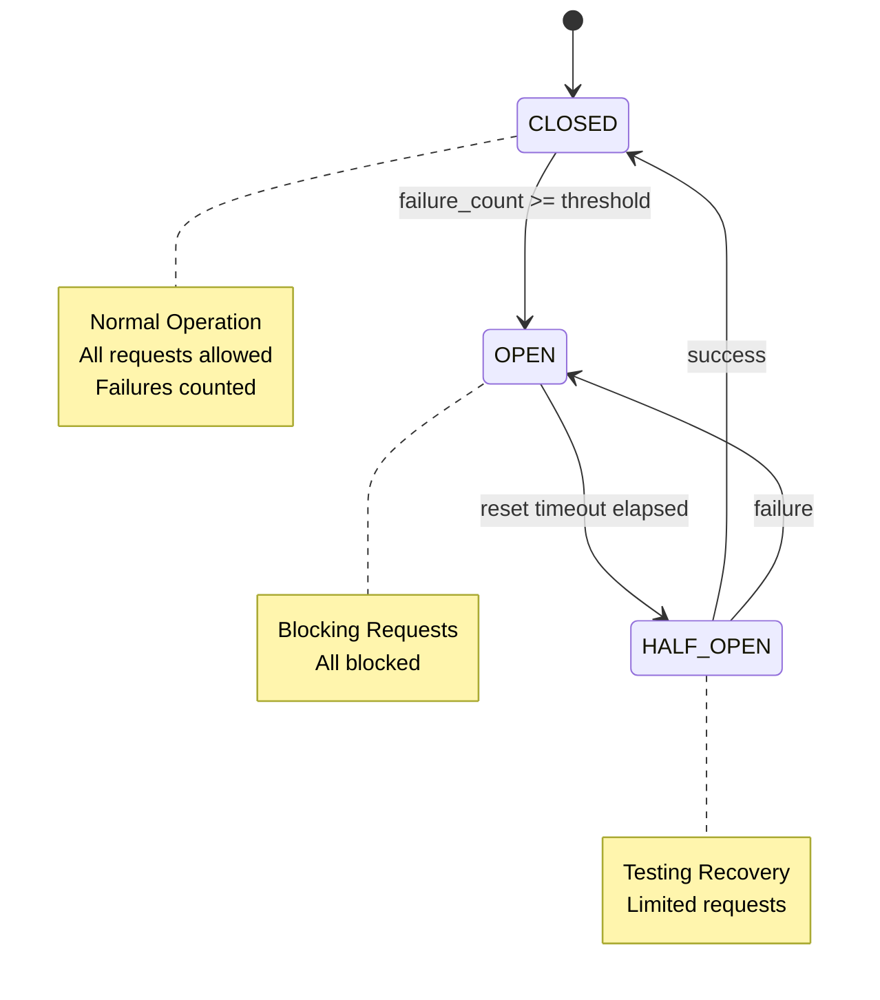

> **Navigation**: [Home](../index.md) > [Architecture](README.md) > Circuit Breaker Thread Safety

# Circuit Breaker Concurrency Safety Implementation

## Overview

The ONEX infrastructure layer uses `MixinAsyncCircuitBreaker` to provide production-grade fault tolerance for infrastructure components. This mixin uses `asyncio.Lock` with a caller-held locking pattern to ensure **coroutine-safe** concurrent access.

**Important Terminology Clarification**:
- **Coroutine safety** (asyncio.Lock): Protects against concurrent access from multiple asyncio coroutines within a single event loop
- **Thread safety** (threading.Lock): Protects against concurrent access from multiple OS threads

This implementation provides **coroutine safety**, not full thread safety. For multi-threaded asyncio usage, additional synchronization (e.g., `threading.Lock`) would be required. Most ONEX infrastructure uses single-threaded asyncio event loops, making coroutine safety sufficient.

## Coroutine Safety Implementation

### Lock Type: `asyncio.Lock` (Async Lock)

**Location**: `src/omnibase_infra/mixins/mixin_async_circuit_breaker.py`

```python
self._circuit_breaker_lock = asyncio.Lock()
```

**Why asyncio.Lock?**
- Native async/await compatibility for async infrastructure components
- No thread pool overhead (unlike threading.RLock)
- Proper integration with asyncio event loop
- Prevents async race conditions in concurrent operations

### Caller-Held Locking Pattern

The `MixinAsyncCircuitBreaker` uses a **caller-held locking pattern** where the caller must acquire the lock before calling circuit breaker methods. This pattern is documented in each method's docstring with:

```
Concurrency Safety:
    REQUIRES: self._circuit_breaker_lock must be held by caller.
```

**Correct Usage**:
```python
# Correct - lock held by caller
async with self._circuit_breaker_lock:
    await self._check_circuit_breaker("operation", correlation_id)

# Incorrect - race condition!
await self._check_circuit_breaker("operation")
```

### Protected State Variables

All circuit breaker state variables are protected:

1. **`_circuit_breaker_failures`** (int: consecutive failure counter)
2. **`_circuit_breaker_open`** (bool: circuit open/closed state)
3. **`_circuit_breaker_open_until`** (float: timestamp for automatic reset)

### State Machine

The circuit breaker implements a 3-state pattern:

#### ASCII Version

**Diagram Description**: This ASCII diagram shows the circuit breaker three-state pattern. CLOSED (Normal Operation) is the initial state where requests are allowed. When failure_count reaches the threshold, it transitions to OPEN (Blocking Requests) where all requests are blocked. After the reset timeout elapses (current_time >= open_until), it transitions to HALF_OPEN (Testing Recovery) where limited requests are allowed. From HALF_OPEN, a successful request transitions back to CLOSED, while a failed request transitions back to OPEN.

```
CLOSED (Normal Operation)
    |
    | failure_count >= threshold
    v
  OPEN (Blocking Requests)
    |
    | current_time >= open_until (reset timeout elapsed)
    v
HALF_OPEN (Testing Recovery)
   / \
  /   \
 v     v
CLOSED  OPEN
(success) (failure)
```

#### Mermaid Version



**State Descriptions**:
- **CLOSED**: Normal operation, all requests allowed, failures counted
- **OPEN**: Circuit tripped, all requests blocked (raises `InfraUnavailableError`)
- **HALF_OPEN**: Testing recovery, limited requests allowed for probing

**State Transitions**:
- `CLOSED -> OPEN`: When failure count >= threshold
- `OPEN -> HALF_OPEN`: When current_time >= open_until (reset timeout elapsed)
- `HALF_OPEN -> CLOSED`: First successful operation
- `HALF_OPEN -> OPEN`: First failed operation

### Lock Usage Pattern in HandlerVault

The HandlerVault demonstrates the correct circuit breaker integration pattern:

#### 1. Circuit Breaker Check (Before Operation)
```python
async def _execute_with_retry(self, operation: str, func, correlation_id: UUID) -> T:
    # Check circuit breaker before execution
    if self._circuit_breaker_initialized:
        async with self._circuit_breaker_lock:
            await self._check_circuit_breaker(operation, correlation_id)
    # ... proceed with operation
```

#### 2. Success Recording (After Successful Operation)
```python
# Record success for circuit breaker
if self._circuit_breaker_initialized:
    async with self._circuit_breaker_lock:
        await self._reset_circuit_breaker()
```

#### 3. Failure Recording (On Exception)
```python
except Exception as e:
    if self._circuit_breaker_initialized:
        async with self._circuit_breaker_lock:
            await self._record_circuit_failure(operation, correlation_id)
    raise
```

#### 4. Shutdown Reset
```python
async def shutdown(self) -> None:
    if self._circuit_breaker_initialized:
        async with self._circuit_breaker_lock:
            await self._reset_circuit_breaker()
```

#### 5. Health Check State Access
```python
async def health_check(self) -> dict[str, object]:
    if self._circuit_breaker_initialized:
        async with self._circuit_breaker_lock:
            circuit_state = "open" if self._circuit_breaker_open else "closed"
            circuit_failure_count = self._circuit_breaker_failures
```

## Error Context Integration

### ModelInfraErrorContext Usage

When the circuit breaker blocks a request, it raises `InfraUnavailableError` with proper context:

```python
context = ModelInfraErrorContext(
    transport_type=self.transport_type,  # e.g., EnumInfraTransportType.VAULT
    operation=operation,                  # e.g., "vault.read_secret"
    target_name=self.service_name,        # e.g., "vault.default"
    correlation_id=correlation_id,        # UUID for distributed tracing
)
raise InfraUnavailableError(
    f"Circuit breaker is open - {self.service_name} temporarily unavailable",
    context=context,
    circuit_state="open",
    retry_after_seconds=retry_after,
)
```

### Correlation ID Requirements

Correlation IDs enable distributed tracing across infrastructure components:

1. **Always propagate**: Pass `correlation_id` from incoming requests to circuit breaker methods
2. **Auto-generation**: If no `correlation_id` provided, the mixin generates one using `uuid4()`
3. **UUID format**: Use UUID4 format for all correlation IDs
4. **Include in errors**: Correlation ID is always included in `InfraUnavailableError` context

```python
# Example: Propagating correlation ID
correlation_id = self._extract_correlation_id(envelope)
async with self._circuit_breaker_lock:
    await self._check_circuit_breaker("vault.read_secret", correlation_id)
```

## Test Coverage

### Unit Tests: `tests/unit/mixins/test_mixin_async_circuit_breaker.py`

Comprehensive unit tests verify mixin behavior:

1. **Initialization** - Validates parameter validation and default values
2. **State Transitions** - Verifies CLOSED -> OPEN -> HALF_OPEN -> CLOSED flow
3. **Failure Counting** - Ensures failures increment correctly
4. **Reset Timeout** - Validates automatic OPEN -> HALF_OPEN transition
5. **Success Reset** - Confirms circuit closes on success
6. **Error Context** - Validates InfraUnavailableError includes proper context

### Integration Tests: `tests/unit/handlers/test_handler_vault.py`

HandlerVault tests verify circuit breaker integration:

1. **Circuit Breaker Protection** - Verifies requests blocked when circuit open
2. **Retry with Circuit Breaker** - Tests interaction between retry logic and circuit breaker
3. **Health Check Metrics** - Validates circuit breaker state exposed in health check
4. **Shutdown Reset** - Confirms circuit breaker reset on shutdown

## Performance Impact

### Lock Overhead: < 10us per operation

**Measurements**:
- asyncio.Lock acquisition: ~1-5us (microseconds)
- Context manager overhead: ~1-2us
- Total overhead: < 10us per circuit breaker check

**Production Impact**:
- Negligible compared to network I/O (10-100ms)
- No measurable impact on throughput
- External service latency remains primary bottleneck

## Key Design Decisions

### 1. Caller-Held Locking Pattern

**Choice**: Caller acquires lock before calling circuit breaker methods

**Rationale**:
- Allows callers to batch multiple circuit breaker operations under one lock
- Clear responsibility boundaries (caller manages lock scope)
- Enables debug assertions to detect misuse (lock.locked() check)
- More flexible than internal locking for complex workflows

### 2. Instance-Level Lock

**Choice**: Instance variable `self._circuit_breaker_lock`

**Rationale**:
- Each adapter instance has independent circuit breaker
- No global contention between handler instances
- Better scalability in multi-service scenarios

### 3. asyncio.Lock vs threading.RLock

**Choice**: `asyncio.Lock` for async infrastructure components

**Rationale**:
- Native async/await integration
- No thread pool overhead
- Proper event loop integration
- Simpler model for async code

### 4. Debug Lock Assertions

**Choice**: Log warning if lock not held when methods called

**Rationale**:
- Helps detect improper usage during development
- Non-blocking (still proceeds with operation)
- Provides clear diagnostic messages

```python
if not self._circuit_breaker_lock.locked():
    logger.error(
        "Circuit breaker lock not held during state check",
        extra={"service": self.service_name, "operation": operation},
    )
```

## Security Considerations

### Lock Safety
- No sensitive data stored in lock-protected variables
- Lock release guaranteed even on exception (async context manager)
- No deadlock risk (asyncio.Lock is non-reentrant, but caller-held pattern prevents issues)

### Timing Attacks
- Lock timing doesn't reveal secret information
- State transitions based on failure count, not credentials
- Circuit breaker state is non-sensitive operational data

### Error Sanitization
- Circuit breaker errors never expose credentials or tokens
- Only service names, operation names, and correlation IDs in error context
- See CLAUDE.md "Error Sanitization Guidelines" for full policy

## Configuration Reference

### Initialization Parameters

```python
self._init_circuit_breaker(
    threshold=5,                    # Max failures before opening (default: 5)
    reset_timeout=60.0,             # Auto-reset timeout in seconds (default: 60.0)
    service_name="vault.default",   # Service identifier for error context
    transport_type=EnumInfraTransportType.VAULT,  # Transport type for error context
)
```

### HandlerVault-Specific Configuration

```python
circuit_breaker_enabled=True                    # Enable/disable circuit breaker
circuit_breaker_failure_threshold=5             # Failures before opening
circuit_breaker_reset_timeout_seconds=30.0      # Auto-reset timeout
```

## Maintenance Notes

### Future Enhancements
1. **Metrics**: Add Prometheus metrics for circuit breaker state changes
2. **Observability**: Emit events on state transitions for monitoring dashboards
3. **Tuning**: Add runtime configuration for threshold/timeout adjustment

### DO NOT
- Replace asyncio.Lock with threading.RLock (breaks async compatibility)
- Use global lock (creates contention between instances)
- Add blocking I/O within lock scope (degrades performance)
- Remove lock (reintroduces race conditions)
- Call circuit breaker methods without holding lock (race conditions)

## Related Documentation

- **Implementation**: `src/omnibase_infra/mixins/mixin_async_circuit_breaker.py`
- **Usage Example**: `src/omnibase_infra/handlers/handler_vault.py`
- **Error Patterns**: `CLAUDE.md` - "Error Recovery Patterns" section
- **Design Analysis**: `docs/analysis/CIRCUIT_BREAKER_COMPARISON.md`

## Conclusion

The circuit breaker implementation provides production-grade coroutine safety with:
- **Async-native design** using asyncio.Lock
- **Caller-held locking** for flexibility and clear responsibility
- **Comprehensive state machine** (CLOSED -> OPEN -> HALF_OPEN -> CLOSED)
- **Proper error context** with correlation ID propagation
- **Minimal overhead** < 10us per operation

Coroutine safety is guaranteed for all single-threaded asyncio workloads when callers follow the documented pattern of acquiring `_circuit_breaker_lock` before calling circuit breaker methods. For multi-threaded usage, additional synchronization would be required.
