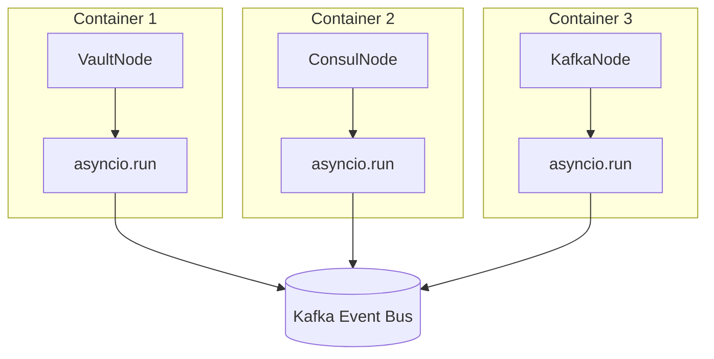
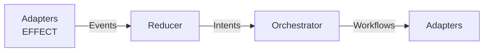

> **Navigation**: [Home](../index.md) > [Architecture](overview.md) > Current Node Architecture

# ONEX Current Node Architecture (Pre-Runtime Host Migration)

This document describes the current ONEX node architecture that uses a **1-container-per-node** deployment model. This is the "before" state that will be migrated to the new Runtime Host model.

---

## 1. Overview

### Current Architecture: 1 Container Per Node

In the current ONEX architecture, each node runs as an **independent container** with its own:

- Python runtime environment
- Entry point (`node.py` with `if __name__ == "__main__"`)
- Container injection setup
- Kafka consumer/producer connections
- Health check endpoint

**Deployment Model (ASCII):**
```
┌─────────────────┐  ┌─────────────────┐  ┌─────────────────┐
│   Container 1   │  │   Container 2   │  │   Container 3   │
│  ┌───────────┐  │  │  ┌───────────┐  │  │  ┌───────────┐  │
│  │ VaultNode │  │  │  │ConsulNode │  │  │  │ KafkaNode │  │
│  └───────────┘  │  │  └───────────┘  │  │  └───────────┘  │
│   asyncio.run   │  │   asyncio.run   │  │   asyncio.run   │
└─────────────────┘  └─────────────────┘  └─────────────────┘
         │                   │                     │
         └───────────────────┼─────────────────────┘
                             │
                      ┌──────▼──────┐
                      │    Kafka    │
                      │ Event Bus   │
                      └─────────────┘
```

**Deployment Model (Mermaid):**


### The 4 Node Types

ONEX follows a strict **4-node architecture** pattern:

| Node Type | Contract `node_type` | Base Class | Purpose | I/O Operations |
|-----------|---------------------|------------|---------|----------------|
| **EFFECT** | `EFFECT_GENERIC` | `NodeEffectService` | External I/O (APIs, DB, files) | Yes (`io_operations`) |
| **COMPUTE** | `COMPUTE_GENERIC` | `NodeComputeService` | Pure transforms/algorithms | No |
| **REDUCER** | `REDUCER_GENERIC` | `NodeReducerService` | Aggregation/persistence | No (DB via adapters) |
| **ORCHESTRATOR** | `ORCHESTRATOR_GENERIC` | `NodeOrchestratorService` | Workflow coordination | No |

**Note**: In `contract.yaml` files, use the `_GENERIC` suffix variants (e.g., `EFFECT_GENERIC`). In Python code, use `EnumNodeKind` values (e.g., `EnumNodeKind.EFFECT`).

**Communication Pattern (ASCII):**
```
Adapters (EFFECT) → Events → Reducer → Intents → Orchestrator → Workflows → Adapters
```

**Communication Pattern (Mermaid):**


---

## 2. Node Directory Structure

### Standard Node Structure

```
nodes/<node_name>/v1_0_0/
├── __init__.py              # Package initialization
├── node.py                  # Main node implementation with entry point
├── contract.yaml            # Node contract definition
├── models/                  # Node-specific models
│   ├── __init__.py
│   ├── model_<name>_input.py
│   └── model_<name>_output.py
└── registry/                # Dependency injection registry (optional)
    └── __init__.py
```

### Naming Conventions

- **Directory Name**: `node_<name>_<type>` (e.g., `node_vault_adapter_effect`)
- **Node Class**: `Node<Name><Type>` in CamelCase (e.g., `NodeVaultAdapterEffect`)
- **Models**: `Model<Name>Input`, `Model<Name>Output`
- **Files**: All snake_case (`model_vault_adapter_input.py`)

---

## 3. Full Example: Effect Node (Vault Adapter)

### File Tree

```
nodes/node_vault_adapter_effect/v1_0_0/
├── __init__.py
├── node.py                           # 706 lines - Main implementation
├── contract.yaml                     # 177 lines - Contract definition
├── models/
│   ├── __init__.py
│   ├── model_vault_adapter_input.py  # Input model for envelope payloads
│   └── model_vault_adapter_output.py # Output model for results
└── registry/
    └── __init__.py
```

### node.py - Key Sections

**Imports and Base Class:**
```python
#!/usr/bin/env python3

import asyncio
import logging
import os
from typing import Any

from omnibase_core.core.errors.onex_error import CoreErrorCode, OnexError
from omnibase_core.core.node_effect_service import NodeEffectService
from omnibase_core.core.onex_container import ModelONEXContainer
from omnibase_core.enums.enum_health_status import EnumHealthStatus
from omnibase_core.models.core.model_health_status import ModelHealthStatus

from omnibase_infra.models.vault import (
    ModelVaultSecretRequest,
    ModelVaultSecretResponse,
    ModelVaultTokenRequest,
)
```

**Node Class Definition:**
```python
class NodeVaultAdapterEffect(NodeEffectService):
    """
    Vault Adapter - Event-Driven Secret Management Effect

    NodeEffect that processes event envelopes to perform Vault operations.
    Integrates with event bus for secret management, token lifecycle,
    and encryption services. Provides health check HTTP endpoint for monitoring.
    """

    def __init__(self, container: ModelONEXContainer):
        # Use proper base class - no more boilerplate!
        super().__init__(container)

        self.node_type = "effect"
        self.domain = "infrastructure"

        # ONEX logger initialization with fallback
        try:
            self.logger = getattr(container, "get_tool", lambda x: None)(
                "LOGGER",
            ) or logging.getLogger(__name__)
        except (AttributeError, Exception):
            self.logger = logging.getLogger(__name__)

        # Vault client configuration - all environment variables required
        vault_addr = os.getenv("VAULT_ADDR")
        vault_token = os.getenv("VAULT_TOKEN")
        vault_namespace = os.getenv("VAULT_NAMESPACE", "")

        if not vault_addr:
            raise OnexError(
                message="VAULT_ADDR environment variable is required but not set",
                error_code=CoreErrorCode.MISSING_REQUIRED_PARAMETER,
            )
        # ... configuration continues
```

**Resource Lifecycle Methods:**
```python
    async def _initialize_node_resources(self) -> None:
        """Override to initialize vault client."""
        await super()._initialize_node_resources()
        await self.initialize_vault_client()

    async def _cleanup_node_resources(self) -> None:
        """Override to cleanup vault connection pool resources."""
        if self.vault_connection_pool:
            await self.vault_connection_pool.close_all()
        await super()._cleanup_node_resources()
```

**Health Check Method:**
```python
    def health_check(self) -> ModelHealthStatus:
        """Check Vault service health and connectivity."""
        try:
            client = self._get_vault_client()

            if client is None:
                return ModelHealthStatus(
                    status=EnumHealthStatus.UNREACHABLE,
                    message="Vault client is not initialized",
                )

            health = client.sys.read_health_status(method="GET")

            if not health.get("initialized", False):
                return ModelHealthStatus(
                    status=EnumHealthStatus.UNHEALTHY,
                    message="Vault is not initialized",
                    details=health,
                )

            if health.get("sealed", True):
                return ModelHealthStatus(
                    status=EnumHealthStatus.UNHEALTHY,
                    message="Vault is sealed",
                    details=health,
                )

            return ModelHealthStatus(
                status=EnumHealthStatus.HEALTHY,
                message=f"Vault is healthy (version: {health.get('version', 'unknown')})",
                details={...},
            )
        except Exception as e:
            return ModelHealthStatus(
                status=EnumHealthStatus.UNREACHABLE,
                message=f"Vault health check failed: {str(e)}",
            )
```

**Entry Point (1-Container-Per-Node Pattern):**
```python
# Entry point for running the node
if __name__ == "__main__":
    import sys

    # Create container (simplified for standalone operation)
    container = ModelONEXContainer()

    # Create and run the node
    node = NodeVaultAdapterEffect(container)

    # Run the node with asyncio
    try:
        asyncio.run(node.run())
    except KeyboardInterrupt:
        print("\nVault adapter shutting down...")
        sys.exit(0)
```

### contract.yaml - Full Structure

```yaml
name: "vault_adapter"
contract_name: "vault_adapter"
node_name: "vault_adapter"
version:
  major: 1
  minor: 0
  patch: 0
contract_version: "1.0.0"
node_version: "1.0.0"

node_type: "EFFECT_GENERIC"  # Use _GENERIC variants in contract.yaml

description: >
  HashiCorp Vault secret management adapter for secure credential storage and retrieval.
  Message bus bridge pattern for Vault operations including secret management,
  token operations, and encryption services.

capabilities:
  - name: "secret_management"
    description: "Read, write, delete, and list secrets in Vault"
  - name: "token_management"
    description: "Create, renew, revoke, and lookup Vault tokens"
  - name: "encryption_services"
    description: "Encrypt and decrypt data using Vault transit engine"
  - name: "lease_management"
    description: "Manage secret leases and renewals"
  - name: "health_monitoring"
    description: "Monitor Vault health and seal status"

input_model: "ModelVaultAdapterInput"
output_model: "ModelVaultAdapterOutput"

io_operations:
  - operation: "get_secret"
    description: "Retrieve secret from Vault"
    input_fields:
      - path
      - version
      - mount_path
    output_fields:
      - data
      - metadata
      - version

  - operation: "set_secret"
    description: "Store secret in Vault"
    input_fields:
      - path
      - data
      - mount_path
    output_fields:
      - version
      - created_time

  - operation: "delete_secret"
    description: "Delete secret from Vault"
    input_fields:
      - path
      - mount_path
    output_fields:
      - success

  - operation: "health_check"
    description: "Check Vault health and seal status"
    input_fields: []
    output_fields:
      - initialized
      - sealed
      - standby
      - version

dependencies:
  - name: "protocol_event_bus"
    type: "protocol"
    class_name: "ProtocolEventBus"
    module: "omnibase_spi.protocols.event_bus"

  - name: "model_vault_secret_request"
    type: "model"
    class_name: "ModelVaultSecretRequest"
    module: "omnibase_infra.models.vault.model_vault_secret_request"

  - name: "model_vault_secret_response"
    type: "model"
    class_name: "ModelVaultSecretResponse"
    module: "omnibase_infra.models.vault.model_vault_secret_response"

definitions:
  ModelVaultAdapterInput:
    type: object
    description: "Input model for Vault adapter operations"
    properties:
      operation:
        type: string
        description: "Operation to perform (get_secret, set_secret, etc.)"
      path:
        type: string
        description: "Vault secret path"
      data:
        type: object
        description: "Secret data for write operations"
      correlation_id:
        type: string
        description: "Request correlation ID"
    required:
      - operation
      - correlation_id

  ModelVaultAdapterOutput:
    type: object
    description: "Output model for Vault adapter operations"
    properties:
      success:
        type: boolean
        description: "Whether operation succeeded"
      data:
        type: object
        description: "Response data"
      error:
        type: string
        description: "Error message if failed"
      correlation_id:
        type: string
        description: "Request correlation ID"
    required:
      - success
      - correlation_id

metadata:
  author: "ONEX Infrastructure Team"
  created: "2025-11-14"
  tags:
    - vault
    - secrets
    - security
    - adapter
    - effect
```

### Model Files

**model_vault_adapter_input.py:**
```python
#!/usr/bin/env python3

from typing import Literal
from pydantic import BaseModel, Field


class ModelVaultAdapterInput(BaseModel):
    """Input model for Vault adapter operations from event envelopes.

    Node-specific model for processing event envelope payloads into Vault operations.
    """

    action: Literal[
        "vault_get_secret",
        "vault_set_secret",
        "vault_delete_secret",
        "vault_list_secrets",
        "vault_create_token",
        "vault_renew_token",
        "vault_revoke_token",
        "vault_health_check",
    ] = Field(description="Vault operation to perform")

    # Secret operation parameters
    path: str | None = Field(default=None, description="Secret path in Vault")
    mount_path: str = Field(default="secret", description="Vault mount path")
    secret_data: dict | None = Field(default=None, description="Secret data for write operations")
    version: int | None = Field(default=None, description="Secret version to retrieve")

    # Token operation parameters
    token: str | None = Field(default=None, description="Token for renew/revoke operations")
    policies: list[str] | None = Field(default=None, description="Policies for token creation")
    ttl: str | None = Field(default=None, description="Token TTL (e.g., '768h')")
    renewable: bool = Field(default=True, description="Whether token is renewable")

    # Common fields
    correlation_id: str = Field(description="Correlation ID for request tracking")
```

**model_vault_adapter_output.py:**
```python
#!/usr/bin/env python3

from pydantic import BaseModel, Field
from omnibase_infra.models.vault.model_vault_secret_response import (
    ModelVaultSecretResponse,
)


class ModelVaultAdapterOutput(BaseModel):
    """Output model for Vault adapter operation results.

    Node-specific model for returning Vault operation results through effect outputs.
    """

    vault_operation_result: (
        ModelVaultSecretResponse
        | dict[str, str | int | bool | list | None]
        | str
        | bool
    ) = Field(description="Result of Vault operation")

    success: bool = Field(description="Whether the operation succeeded")
    operation_type: str = Field(description="Type of Vault operation performed")
    correlation_id: str = Field(description="Correlation ID from request")
```

---

## 4. Full Example: Effect Node (Consul Projector)

### File Tree

```
nodes/node_consul_projector_effect/v1_0_0/
├── __init__.py
├── node.py                                    # Main implementation
├── contract.yaml                              # 342 lines - Contract definition
├── models/
│   ├── __init__.py
│   ├── model_consul_cache_entry.py
│   ├── model_consul_health_projection.py
│   ├── model_consul_kv_details.py
│   ├── model_consul_kv_projection.py
│   ├── model_consul_kv_summary.py
│   ├── model_consul_projection_type.py
│   ├── model_consul_projections.py
│   ├── model_consul_projector_input.py
│   ├── model_consul_projector_output.py
│   ├── model_consul_service_projection.py
│   ├── model_consul_topology_graph.py
│   ├── model_consul_topology_metrics.py
│   └── model_consul_topology_projection.py
└── registry/
    └── __init__.py
```

### node.py - Key Sections

```python
#!/usr/bin/env python3

import asyncio
import logging
from datetime import UTC, datetime

from omnibase_core.core.errors.onex_error import CoreErrorCode, OnexError
from omnibase_core.core.node_effect_service import NodeEffectService
from omnibase_core.core.onex_container import ModelONEXContainer
from omnibase_core.enums.enum_health_status import EnumHealthStatus
from omnibase_core.models.core.model_health_status import ModelHealthStatus

# Import node-specific models
from .models import (
    ModelConsulHealthCacheEntry,
    ModelConsulHealthProjection,
    ModelConsulKVCacheEntry,
    ModelConsulKVProjection,
    ModelConsulProjectorInput,
    ModelConsulProjectorOutput,
    ModelConsulServiceCacheEntry,
    ModelConsulServiceProjection,
    ModelConsulTopologyProjection,
)


class NodeConsulProjectorEffect(NodeEffectService):
    """
    Consul Projector - Event-Driven Infrastructure State Projector

    NodeEffect that processes Consul state data to create projected views and aggregations.
    Integrates with event bus for event-driven state projection and monitoring.
    Provides comprehensive state views for service discovery, health monitoring, and topology analysis.
    """

    def __init__(self, container: ModelONEXContainer):
        super().__init__(container)

        self.node_type = "effect"
        self.domain = "infrastructure"

        # ONEX logger initialization with fallback
        try:
            self.logger = getattr(container, "get_tool", lambda x: None)(
                "LOGGER",
            ) or logging.getLogger(__name__)
        except (AttributeError, Exception):
            self.logger = logging.getLogger(__name__)

        # State cache for projection optimization with strong typing
        self._service_cache: dict[str, ModelConsulServiceCacheEntry] = {}
        self._health_cache: dict[str, ModelConsulHealthCacheEntry] = {}
        self._kv_cache: dict[str, ModelConsulKVCacheEntry] = {}
        self._cache_ttl: int = 300  # 5 minutes

        self._initialized = False

    async def project_service_state(self, input_data: ModelConsulProjectorInput) -> ModelConsulServiceProjection:
        """Project current service state from Consul data."""
        # ... projection logic

    async def project_health_state(self, input_data: ModelConsulProjectorInput) -> ModelConsulHealthProjection:
        """Project health state aggregation from Consul data."""
        # ... projection logic

    async def project_kv_state(self, input_data: ModelConsulProjectorInput) -> ModelConsulKVProjection:
        """Project KV store state changes from Consul data."""
        # ... projection logic

    async def project_topology(self, input_data: ModelConsulProjectorInput) -> ModelConsulTopologyProjection:
        """Project service topology view from Consul data."""
        # ... topology generation logic

    def health_check(self) -> ModelHealthStatus:
        """Single comprehensive health check for Consul projector."""
        try:
            if not self._initialized:
                return ModelHealthStatus(
                    status=EnumHealthStatus.UNHEALTHY,
                    message="Consul projector not initialized",
                )

            cache_health = len(self._service_cache) + len(self._health_cache) + len(self._kv_cache)

            if cache_health == 0:
                return ModelHealthStatus(
                    status=EnumHealthStatus.DEGRADED,
                    message="Consul projector operational but caches empty",
                )

            return ModelHealthStatus(
                status=EnumHealthStatus.HEALTHY,
                message=f"Consul projector healthy - cache entries: {cache_health}",
            )
        except Exception as e:
            return ModelHealthStatus(
                status=EnumHealthStatus.UNREACHABLE,
                message=f"Consul projector health check failed: {e!s}",
            )


# Entry point for running the node
if __name__ == "__main__":
    import sys

    container = ModelONEXContainer()
    node = NodeConsulProjectorEffect(container)

    try:
        asyncio.run(node.run())
    except KeyboardInterrupt:
        print("\nConsul projector shutting down...")
        sys.exit(0)
```

---

## 5. Contract YAML Structure

### Required Fields

| Field | Type | Description |
|-------|------|-------------|
| `name` | string | Short identifier for the node |
| `contract_name` | string | Full contract identifier |
| `node_name` | string | Node identifier |
| `version` | object | Semantic version `{major, minor, patch}` |
| `contract_version` | string | Contract version string |
| `node_version` | string | Node implementation version |
| `node_type` | enum | One of: `EFFECT_GENERIC`, `COMPUTE_GENERIC`, `REDUCER_GENERIC`, `ORCHESTRATOR_GENERIC` |
| `description` | string | Human-readable description |
| `input_model` | string | Name of input model class |
| `output_model` | string | Name of output model class |
| `dependencies` | array | List of required protocols and models |
| `definitions` | object | Model definitions for input/output |

### Effect Node Specific Fields

```yaml
io_operations:
  - operation: "operation_name"
    description: "What this operation does"
    input_fields:
      - field1
      - field2
    output_fields:
      - result_field
```

### Orchestrator Specific Fields

```yaml
workflows:
  workflow_name:
    name: "WorkflowClassName"
    description: "What this workflow does"
    trigger: "event_type_that_triggers"
    steps:
      - step: "step_name"
        action: "action_to_perform"
        depends_on: ["previous_step"]
        output: "output_variable"

intent_consumption:
  subscribed_intents:
    - "intent_type_1"
    - "intent_type_2"
  intent_routing_table:
    intent_type_1: "workflow_to_trigger"
```

### Reducer Specific Fields

```yaml
event_consumption:
  subscribed_topics:
    - "topic-name-1"
    - "topic-name-2"
  consumer_group: "reducer_consumer_group"
  consumed_event_types:
    - "EVENT_TYPE_1"
    - "EVENT_TYPE_2"

intent_emission:
  published_intents:
    - "intent_type_1"
    - "intent_type_2"
  intent_routing: "orchestrator_name"

state_schema:
  tables:
    - name: "table_name"
      columns:
        - name: "column_name"
          type: "uuid"
          primary_key: true
```

---

## 6. Node Base Classes

### Import Patterns

All nodes import from `omnibase_core`:

```python
# Base classes (pick one based on node type)
from omnibase_core.core.node_effect_service import NodeEffectService
from omnibase_core.base.node_compute_service import NodeComputeService
from omnibase_core.core.node_reducer_service import NodeReducerService
from omnibase_core.core.node_orchestrator_service import NodeOrchestratorService

# Common imports
from omnibase_core.core.errors.onex_error import CoreErrorCode, OnexError
from omnibase_core.core.onex_container import ModelONEXContainer
from omnibase_core.enums.enum_health_status import EnumHealthStatus
from omnibase_core.models.core.model_health_status import ModelHealthStatus
```

### Base Class Methods

**NodeEffectService:**
```python
class NodeEffectService:
    def __init__(self, container: ModelONEXContainer): ...
    async def _initialize_node_resources(self) -> None: ...
    async def _cleanup_node_resources(self) -> None: ...
    async def run(self) -> None: ...  # Main event loop
    def health_check(self) -> ModelHealthStatus: ...
```

**NodeComputeService[TInput, TOutput]:**
```python
class NodeComputeService(Generic[TInput, TOutput]):
    def __init__(self, container: ModelONEXContainer): ...
    async def initialize(self) -> None: ...
    async def compute(self, input_data: TInput) -> TOutput: ...  # Pure transformation
```

**NodeReducerService:**
```python
class NodeReducerService:
    def __init__(self, container: ModelONEXContainer): ...
    async def reduce(self, input_data: TInput) -> TOutput: ...  # Aggregation
    async def initialize(self) -> None: ...
    async def cleanup(self) -> None: ...
```

**NodeOrchestratorService:**
```python
class NodeOrchestratorService:
    def __init__(self, container: ModelONEXContainer): ...
    async def orchestrate(self, input_data: TInput) -> TOutput: ...  # Workflow coordination
    async def initialize(self) -> None: ...
    async def cleanup(self) -> None: ...
    async def health_check(self) -> dict: ...
```

---

## 7. Deployment Model

### Current: 1 Container Per Node

Each node is deployed as an independent Docker container:

```dockerfile
# Example Dockerfile for a node
FROM python:3.12-slim

WORKDIR /app
COPY . .
RUN pip install -e .

# Each node has its own entry point
CMD ["python", "-m", "omnibase_infra.nodes.node_vault_adapter_effect.v1_0_0.node"]
```

**Docker Compose Example:**
```yaml
services:
  vault-adapter:
    build: .
    command: python -m omnibase_infra.nodes.node_vault_adapter_effect.v1_0_0.node
    environment:
      - VAULT_ADDR=http://vault:8200
      - VAULT_TOKEN=${VAULT_TOKEN}
      - KAFKA_BOOTSTRAP_SERVERS=kafka:9092
    depends_on:
      - kafka
      - vault

  consul-projector:
    build: .
    command: python -m omnibase_infra.nodes.node_consul_projector_effect.v1_0_0.node
    environment:
      - CONSUL_ADDR=http://consul:8500
      - KAFKA_BOOTSTRAP_SERVERS=kafka:9092
    depends_on:
      - kafka
      - consul

  kafka-adapter:
    build: .
    command: python -m omnibase_infra.nodes.kafka_adapter.v1_0_0.node
    environment:
      - KAFKA_BOOTSTRAP_SERVERS=kafka:9092
    depends_on:
      - kafka
```

### Node Communication

Nodes communicate exclusively via **Kafka topics**:

```
┌─────────────────┐      publish       ┌─────────────────┐
│  Effect Node    │ ─────────────────► │     Kafka       │
│ (vault_adapter) │                    │   Event Bus     │
└─────────────────┘                    └────────┬────────┘
                                                │
                                                │ subscribe
                                                ▼
                                       ┌─────────────────┐
                                       │  Reducer Node   │
                                       │ (omni_reducer)  │
                                       └────────┬────────┘
                                                │
                                                │ emit intent
                                                ▼
                                       ┌─────────────────┐
                                       │ Orchestrator    │
                                       │ (omni_orchestr) │
                                       └─────────────────┘
```

### Entry Point Pattern

Every node has the same entry point pattern:

```python
# Entry point for running the node
if __name__ == "__main__":
    import sys

    # Create container (simplified for standalone operation)
    container = ModelONEXContainer()

    # Create and run the node
    node = NodeClassName(container)

    # Run the node with asyncio
    try:
        asyncio.run(node.run())
    except KeyboardInterrupt:
        print("\nNode shutting down...")
        sys.exit(0)
```

---

## 8. Limitations (Why We're Migrating)

### Resource Overhead

**Problem:** Each node requires its own container with:
- Full Python runtime (~150MB base image)
- Separate Kafka consumer connections
- Independent health check endpoints
- Duplicate dependency installations

**Impact:** With 15+ nodes, this results in significant resource waste:
```
15 nodes × 150MB = 2.25GB+ for container images alone
15 nodes × 1 Kafka connection = 15 Kafka connections
```

### Complex Deployment

**Problem:** Each node needs separate:
- Docker image builds
- Kubernetes deployments/pods
- Service definitions
- ConfigMaps/Secrets
- Health check probes

**Impact:** Managing 15+ separate deployments becomes unwieldy:
- Difficult to coordinate rolling updates
- Complex dependency management
- Increased Kubernetes resource definitions

### No Shared Handler Infrastructure

**Problem:** Common functionality is duplicated:
- Kafka consumer setup in every node
- Health check endpoints repeated
- Error handling patterns duplicated
- Logging configuration repeated

**Impact:**
- Code duplication across nodes
- Inconsistent error handling
- Difficult to add cross-cutting concerns

### Scaling Limitations

**Problem:** Cannot scale node types independently:
- Must scale entire container for one node
- Cannot collocate related nodes efficiently
- Memory-intensive nodes affect all

### Migration Path: Runtime Host Model

The new **Runtime Host** model addresses these limitations by:
- Running multiple nodes in a single container
- Sharing Kafka connections and infrastructure
- Providing unified health check endpoints
- Enabling efficient resource sharing
- Simplifying deployment to a single host

```
┌─────────────────────────────────────────────────┐
│                 Runtime Host                     │
│  ┌───────────┐ ┌───────────┐ ┌───────────────┐  │
│  │VaultNode  │ │ConsulNode │ │OrchestratorNd │  │
│  └───────────┘ └───────────┘ └───────────────┘  │
│                                                  │
│  Shared: Kafka, Health, Logging, Error Handling │
└─────────────────────────────────────────────────┘
```

---

## Summary

This document captures the current ONEX node architecture with:

1. **1-container-per-node deployment** - Each node runs independently
2. **4 node types** - EFFECT_GENERIC, COMPUTE_GENERIC, REDUCER_GENERIC, ORCHESTRATOR_GENERIC
3. **Standard directory structure** - `nodes/<name>/v1_0_0/`
4. **Contract-driven configuration** - `contract.yaml` defines everything
5. **Base classes from omnibase_core** - Consistent inheritance patterns
6. **Kafka-based communication** - Event bus for all inter-node messaging

The migration to Runtime Host will preserve the node contracts and logic while fundamentally changing the deployment model for improved efficiency.
