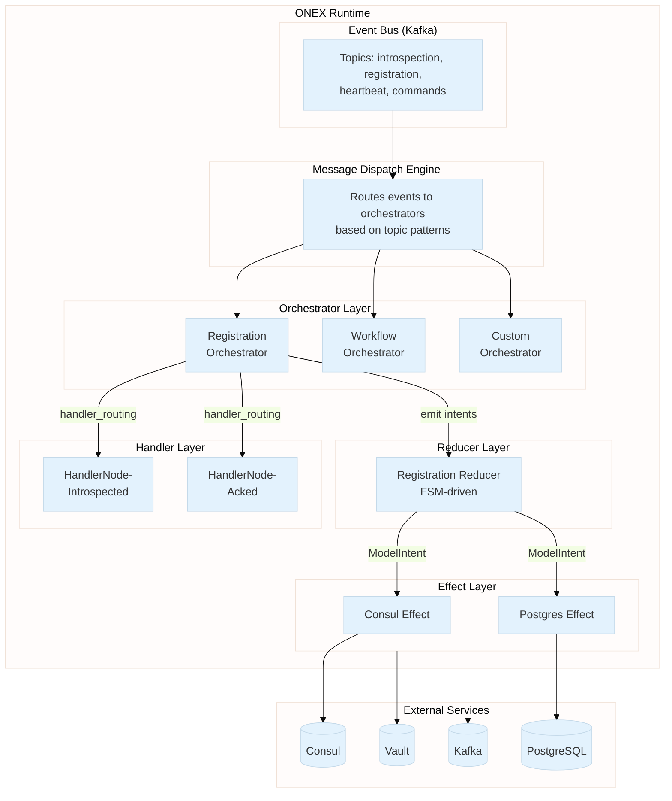
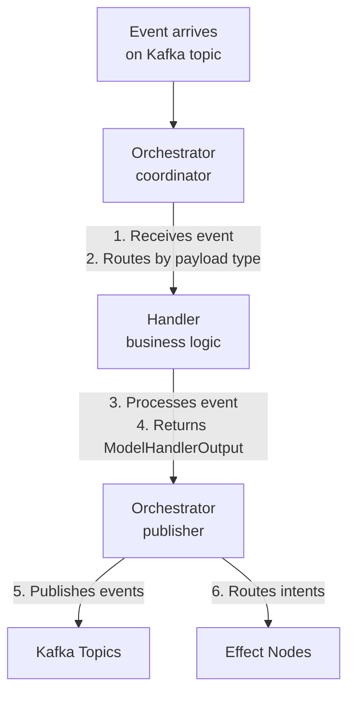
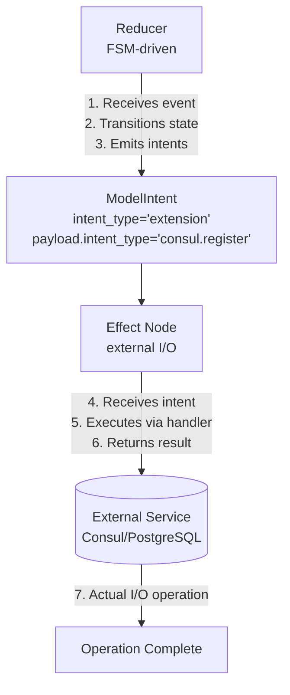
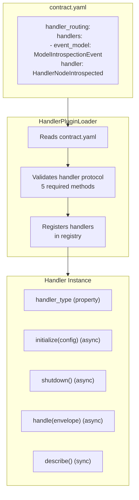
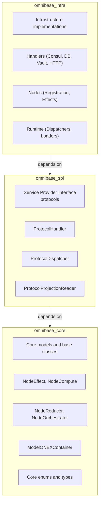

> **Navigation**: [Home](../index.md) > Architecture > Overview

# ONEX Architecture Overview

This document provides a high-level overview of the ONEX (OmniNode Execution) architecture used in `omnibase_infra`.

## Design Philosophy

ONEX is built on three core principles:

1. **Contract-Driven**: All behavior is declared in YAML contracts, not hardcoded in Python
2. **Declarative Nodes**: Node classes contain zero custom logic - they extend base classes
3. **Separation of Concerns**: Each node archetype has a single, well-defined responsibility

## System Architecture

### ASCII Diagram

The following diagram shows the complete ONEX runtime architecture:

```
┌─────────────────────────────────────────────────────────────────────────────┐
│                              ONEX RUNTIME                                    │
├─────────────────────────────────────────────────────────────────────────────┤
│                                                                              │
│  ┌─────────────────────────────────────────────────────────────────────┐    │
│  │                         EVENT BUS (Kafka)                            │    │
│  │    Topics: introspection, registration, heartbeat, commands          │    │
│  └─────────────────────────────────────────────────────────────────────┘    │
│            │                    │                    │                       │
│            ▼                    ▼                    ▼                       │
│  ┌──────────────────────────────────────────────────────────────────────┐   │
│  │                      MESSAGE DISPATCH ENGINE                          │   │
│  │    Routes events to orchestrators based on topic patterns             │   │
│  └──────────────────────────────────────────────────────────────────────┘   │
│            │                                                                 │
│            ▼                                                                 │
│  ┌──────────────────────────────────────────────────────────────────────┐   │
│  │                         ORCHESTRATOR LAYER                            │   │
│  │  ┌────────────────────┐  ┌────────────────────┐  ┌────────────────┐  │   │
│  │  │  Registration      │  │   Workflow         │  │   Custom       │  │   │
│  │  │  Orchestrator      │  │   Orchestrator     │  │   Orchestrator │  │   │
│  │  └────────────────────┘  └────────────────────┘  └────────────────┘  │   │
│  └──────────────────────────────────────────────────────────────────────┘   │
│            │                         │                                       │
│            │ handler_routing         │ emit intents                          │
│            ▼                         ▼                                       │
│  ┌─────────────────────┐   ┌─────────────────────┐                          │
│  │    HANDLER LAYER    │   │    REDUCER LAYER    │                          │
│  │  ┌───────────────┐  │   │  ┌───────────────┐  │                          │
│  │  │ HandlerNode-  │  │   │  │ Registration  │  │                          │
│  │  │ Introspected  │  │   │  │ Reducer       │  │                          │
│  │  └───────────────┘  │   │  │ (FSM-driven)  │  │                          │
│  │  ┌───────────────┐  │   │  └───────────────┘  │                          │
│  │  │ HandlerNode-  │  │   └─────────────────────┘                          │
│  │  │ Acked         │  │             │                                       │
│  │  └───────────────┘  │             │ ModelIntent                           │
│  └─────────────────────┘             ▼                                       │
│                            ┌─────────────────────┐                          │
│                            │    EFFECT LAYER     │                          │
│                            │  ┌───────────────┐  │                          │
│                            │  │ Consul Effect │  │                          │
│                            │  └───────────────┘  │                          │
│                            │  ┌───────────────┐  │                          │
│                            │  │ Postgres      │  │                          │
│                            │  │ Effect        │  │                          │
│                            │  └───────────────┘  │                          │
│                            └─────────────────────┘                          │
│                                      │                                       │
└──────────────────────────────────────│───────────────────────────────────────┘
                                       ▼
                      ┌─────────────────────────────────┐
                      │      EXTERNAL SERVICES          │
                      │  ┌─────────┐  ┌─────────────┐   │
                      │  │ Consul  │  │ PostgreSQL  │   │
                      │  └─────────┘  └─────────────┘   │
                      │  ┌─────────┐  ┌─────────────┐   │
                      │  │  Vault  │  │    Kafka    │   │
                      │  └─────────┘  └─────────────┘   │
                      └─────────────────────────────────┘
```

### Mermaid Diagram



## The Four Node Archetypes

ONEX organizes all processing into four node types, each with a specific role:

### 1. ORCHESTRATOR (Workflow Coordination)

**Purpose**: Coordinates workflows by routing events to handlers and managing execution flow.

**Key Characteristics**:
- ONLY node type that can **publish events**
- Routes events to handlers via `handler_routing` in contract
- Coordinates multi-step workflows via `execution_graph`
- Owns no FSM logic (delegates to reducers)

**Example Use Cases**:
- Node registration workflow
- Multi-service transactions
- Saga pattern implementations

```yaml
# contract.yaml for orchestrator
node_type: "ORCHESTRATOR_GENERIC"
handler_routing:
  routing_strategy: "payload_type_match"
  handlers:
    - event_model: { name: "ModelNodeIntrospectionEvent" }
      handler: { name: "HandlerNodeIntrospected" }
```

### 2. REDUCER (State + FSM)

**Purpose**: Manages state transitions via FSM and emits intents for effects.

**Key Characteristics**:
- Pure function: `reduce(state, event) → (new_state, intents)`
- No side effects
- FSM transitions defined in contract
- Emits intents for Effect layer to execute

**Example Use Cases**:
- Registration state machine
- Order fulfillment state
- Approval workflows

```yaml
# contract.yaml for reducer
node_type: "REDUCER_GENERIC"
state_machine:
  initial_state: "idle"
  transitions:
    - from_state: "idle"
      to_state: "pending"
      trigger: "request_received"
```

### 3. COMPUTE (Pure Transformations)

**Purpose**: Performs deterministic computations with no side effects.

**Key Characteristics**:
- Pure functions (referentially transparent)
- Same input always produces same output
- No I/O operations

**Example Use Cases**:
- Data validation
- Format conversion
- Business rule evaluation

```yaml
# contract.yaml for compute
node_type: "COMPUTE_GENERIC"
validation_rules:
  - rule_id: "ARCH-001"
    detection_strategy: { type: "ast_pattern" }
```

### 4. EFFECT (External I/O)

**Purpose**: Handles all interactions with external systems.

**Key Characteristics**:
- Named by **capability**, not by technology
- Executes intents emitted by reducers
- May have side effects (database writes, API calls)
- Pluggable handler implementations

**Example Use Cases**:
- Database operations
- Service discovery (Consul)
- Secret management (Vault)
- HTTP API calls

```yaml
# contract.yaml for effect
node_type: "EFFECT_GENERIC"
capabilities:
  - name: "registration.storage"
io_operations:
  - operation: "upsert_record"
```

## Data Flow Patterns

### Event-Driven Flow

#### ASCII Version

```
Event arrives on Kafka topic
         │
         ▼
┌─────────────────────┐
│   Orchestrator      │  1. Receives event via message dispatch
│   (coordinator)     │  2. Routes to handler based on payload type
└─────────────────────┘
         │
         ▼
┌─────────────────────┐
│   Handler           │  3. Processes event
│   (business logic)  │  4. Returns ModelHandlerOutput with events/intents
└─────────────────────┘
         │
         ▼
┌─────────────────────┐
│   Orchestrator      │  5. Publishes returned events
│   (publisher)       │  6. Routes intents to effects
└─────────────────────┘
```

#### Mermaid Version



### Intent Flow (Reducer -> Effect)

#### ASCII Version

```
┌─────────────────────┐
│   Reducer           │  1. Receives event
│   (FSM-driven)      │  2. Transitions state
└─────────────────────┘  3. Emits intent(s)
         │
         │ ModelIntent(intent_type="extension",
         │             payload.intent_type="consul.register")
         ▼
┌─────────────────────┐
│   Effect Node       │  4. Receives intent
│   (external I/O)    │  5. Executes via handler
└─────────────────────┘  6. Returns result
         │
         ▼
┌─────────────────────┐
│   External Service  │  7. Actual I/O operation
│   (Consul/Postgres) │
└─────────────────────┘
```

#### Mermaid Version



## Contract-Driven Architecture

### What Goes in `contract.yaml`

| Section | Purpose | Used By |
|---------|---------|---------|
| `node_type` | Declares archetype | All nodes |
| `input_model` / `output_model` | Typed I/O | All nodes |
| `handler_routing` | Event → Handler mapping | Orchestrators, Effects |
| `state_machine` | FSM definition | Reducers |
| `execution_graph` | Workflow DAG | Orchestrators |
| `io_operations` | External operations | Effects |
| `capabilities` | What the node provides | Effects, Computes |

### What Goes in `node.py`

**Almost nothing!** Node classes are declarative:

```python
class MyNode(NodeArchetype):
    """Docstring describing the capability."""

    def __init__(self, container: ModelONEXContainer) -> None:
        super().__init__(container)

__all__ = ["MyNode"]
```

All logic is driven by the contract. The runtime reads the contract and wires everything.

## Handler Architecture

Handlers implement business logic and are wired via contracts.

### ASCII Version

```
┌───────────────────────────────────────────────────────────────┐
│                    HANDLER PLUGIN SYSTEM                       │
├───────────────────────────────────────────────────────────────┤
│                                                                │
│  contract.yaml                                                 │
│  ┌─────────────────────────────────────────────────────────┐  │
│  │ handler_routing:                                         │  │
│  │   handlers:                                              │  │
│  │     - event_model: "ModelIntrospectionEvent"            │  │
│  │       handler: "HandlerNodeIntrospected"                │  │
│  └─────────────────────────────────────────────────────────┘  │
│                          │                                     │
│                          ▼                                     │
│  ┌─────────────────────────────────────────────────────────┐  │
│  │            HandlerPluginLoader                           │  │
│  │   - Reads contract.yaml                                  │  │
│  │   - Validates handler protocol (5 methods)               │  │
│  │   - Registers handlers in registry                       │  │
│  └─────────────────────────────────────────────────────────┘  │
│                          │                                     │
│                          ▼                                     │
│  ┌─────────────────────────────────────────────────────────┐  │
│  │                 Handler Instance                         │  │
│  │   Required methods:                                      │  │
│  │   - handler_type (property)                              │  │
│  │   - initialize(config) (async)                           │  │
│  │   - shutdown() (async)                                   │  │
│  │   - handle(envelope) (async)                             │  │
│  │   - describe() (sync)                                    │  │
│  └─────────────────────────────────────────────────────────┘  │
│                                                                │
└───────────────────────────────────────────────────────────────┘
```

### Mermaid Version



## Key Design Constraints

| Constraint | Reason |
|------------|--------|
| **Handlers cannot publish events** | Only orchestrators have bus access |
| **Orchestrators have no FSM logic** | Reducers own state transitions |
| **No `Any` types** | Type safety, enforced by CI |
| **Effects named by capability** | "registration.storage" not "postgres" ([naming guide](../reference/contracts.md#capability-naming-convention)) |
| **Immutable state models** | Use `with_*` methods for transitions |

## Package Layering

### ASCII Version

```
┌─────────────────────────────────────────────────┐
│              omnibase_infra                      │
│   Infrastructure implementations                 │
│   - Handlers (Consul, DB, Vault, HTTP)          │
│   - Nodes (Registration, Effects)                │
│   - Runtime (Dispatchers, Loaders)              │
└─────────────────────────────────────────────────┘
                      │
                      │ depends on
                      ▼
┌─────────────────────────────────────────────────┐
│               omnibase_spi                       │
│   Service Provider Interface (protocols)         │
│   - ProtocolHandler                              │
│   - ProtocolDispatcher                           │
│   - ProtocolProjectionReader                     │
└─────────────────────────────────────────────────┘
                      │
                      │ depends on
                      ▼
┌─────────────────────────────────────────────────┐
│              omnibase_core                       │
│   Core models and base classes                   │
│   - NodeEffect, NodeCompute, NodeReducer        │
│   - NodeOrchestrator                             │
│   - ModelONEXContainer                           │
│   - Core enums and types                         │
└─────────────────────────────────────────────────┘
```

### Mermaid Version



## Related Documentation

| Topic | Document |
|-------|----------|
| **Coding standards** | [CLAUDE.md](../../CLAUDE.md) - **authoritative source** for all rules |
| Quick start | [Getting Started](../getting-started/quickstart.md) |
| Node archetypes | [Node Archetypes Reference](../reference/node-archetypes.md) |
| Contract format | [Contract.yaml Reference](../reference/contracts.md) |
| Registration example | [2-Way Registration Walkthrough](../guides/registration-example.md) |
| Implementation patterns | [Pattern Documentation](../patterns/README.md) |
| Handler protocol | [Handler Plugin Loader](../patterns/handler_plugin_loader.md) |

> **Note**: Documentation in `docs/` provides explanations, examples, and tutorials. For authoritative coding rules and standards, always refer to [CLAUDE.md](../../CLAUDE.md).
