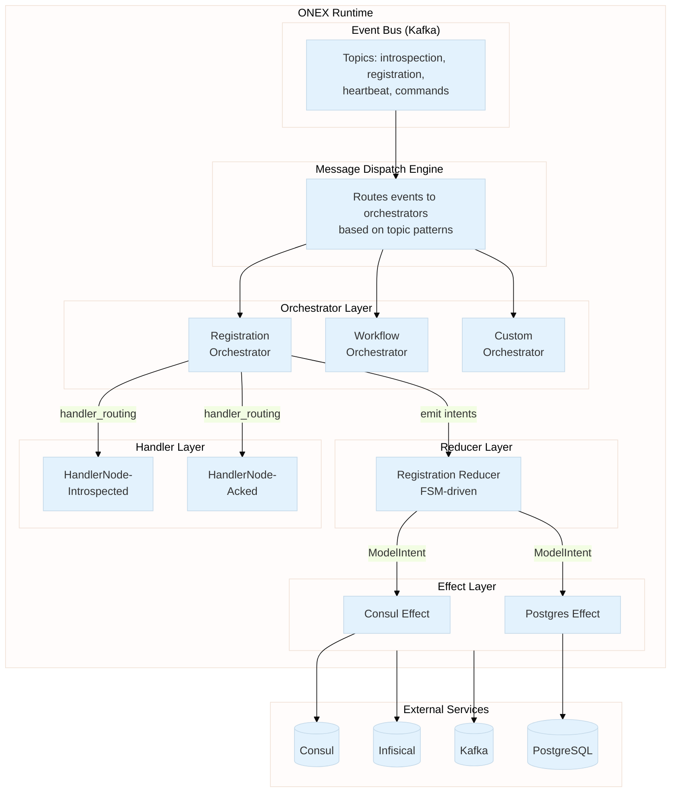
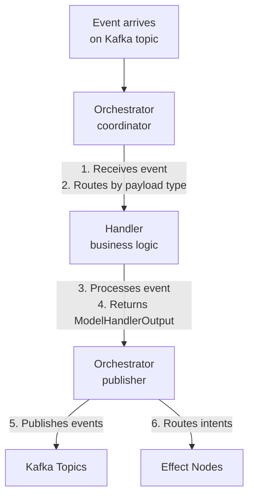
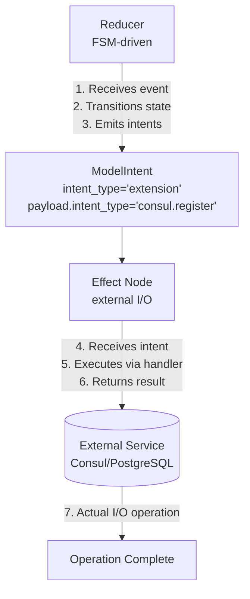
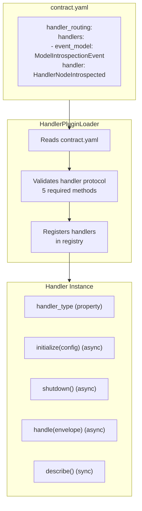
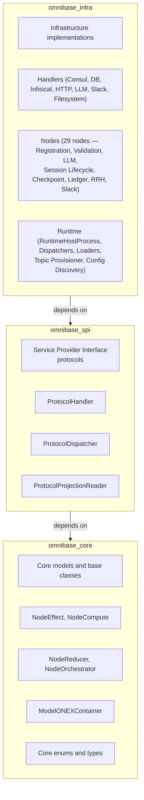

> **Navigation**: [Home](../index.md) > [Architecture](README.md) > Overview

# ONEX Architecture Overview

This document provides a high-level overview of the ONEX (OmniNode Execution) architecture used in `omnibase_infra`.

## Design Philosophy

ONEX is built on three core principles:

1. **Contract-Driven**: All behavior is declared in YAML contracts, not hardcoded in Python
2. **Declarative Nodes**: Node classes contain zero custom logic - they extend base classes
3. **Separation of Concerns**: Each node archetype has a single, well-defined responsibility

## System Architecture

### ASCII Diagram

The following diagram shows the complete ONEX runtime architecture:

**Diagram Description**: This ASCII diagram illustrates the complete ONEX runtime system. At the top, the Event Bus (Kafka) receives events on topics like introspection, registration, heartbeat, and commands. Events flow down to the Message Dispatch Engine, which routes them to orchestrators based on topic patterns. The Orchestrator Layer contains Registration, Workflow, and Custom orchestrators. Orchestrators route to the Handler Layer (containing HandlerNodeIntrospected and HandlerNodeAcked) and emit intents to the Reducer Layer (containing the Registration Reducer with FSM). The Reducer emits ModelIntents to the Effect Layer (Consul Effect and Postgres Effect), which interacts with external services: Consul, PostgreSQL, Infisical, and Kafka.

```
┌─────────────────────────────────────────────────────────────────────────────┐
│                              ONEX RUNTIME                                    │
├─────────────────────────────────────────────────────────────────────────────┤
│                                                                              │
│  ┌─────────────────────────────────────────────────────────────────────┐    │
│  │                         EVENT BUS (Kafka)                            │    │
│  │    Topics: introspection, registration, heartbeat, commands          │    │
│  └─────────────────────────────────────────────────────────────────────┘    │
│            │                    │                    │                       │
│            ▼                    ▼                    ▼                       │
│  ┌──────────────────────────────────────────────────────────────────────┐   │
│  │                      MESSAGE DISPATCH ENGINE                          │   │
│  │    Routes events to orchestrators based on topic patterns             │   │
│  └──────────────────────────────────────────────────────────────────────┘   │
│            │                                                                 │
│            ▼                                                                 │
│  ┌──────────────────────────────────────────────────────────────────────┐   │
│  │                         ORCHESTRATOR LAYER                            │   │
│  │  ┌────────────────────┐  ┌────────────────────┐  ┌────────────────┐  │   │
│  │  │  Registration      │  │   Workflow         │  │   Custom       │  │   │
│  │  │  Orchestrator      │  │   Orchestrator     │  │   Orchestrator │  │   │
│  │  └────────────────────┘  └────────────────────┘  └────────────────┘  │   │
│  └──────────────────────────────────────────────────────────────────────┘   │
│            │                         │                                       │
│            │ handler_routing         │ emit intents                          │
│            ▼                         ▼                                       │
│  ┌─────────────────────┐   ┌─────────────────────┐                          │
│  │    HANDLER LAYER    │   │    REDUCER LAYER    │                          │
│  │  ┌───────────────┐  │   │  ┌───────────────┐  │                          │
│  │  │ HandlerNode-  │  │   │  │ Registration  │  │                          │
│  │  │ Introspected  │  │   │  │ Reducer       │  │                          │
│  │  └───────────────┘  │   │  │ (FSM-driven)  │  │                          │
│  │  ┌───────────────┐  │   │  └───────────────┘  │                          │
│  │  │ HandlerNode-  │  │   └─────────────────────┘                          │
│  │  │ Acked         │  │             │                                       │
│  │  └───────────────┘  │             │ ModelIntent                           │
│  └─────────────────────┘             ▼                                       │
│                            ┌─────────────────────┐                          │
│                            │    EFFECT LAYER     │                          │
│                            │  ┌───────────────┐  │                          │
│                            │  │ Consul Effect │  │                          │
│                            │  └───────────────┘  │                          │
│                            │  ┌───────────────┐  │                          │
│                            │  │ Postgres      │  │                          │
│                            │  │ Effect        │  │                          │
│                            │  └───────────────┘  │                          │
│                            └─────────────────────┘                          │
│                                      │                                       │
└──────────────────────────────────────│───────────────────────────────────────┘
                                       ▼
                      ┌─────────────────────────────────┐
                      │      EXTERNAL SERVICES          │
                      │  ┌─────────┐  ┌─────────────┐   │
                      │  │ Consul  │  │ PostgreSQL  │   │
                      │  └─────────┘  └─────────────┘   │
                      │  ┌──────────┐  ┌─────────────┐   │
                      │  │Infisical │  │    Kafka    │   │
                      │  └──────────┘  └─────────────┘   │
                      └─────────────────────────────────┘
```

### Mermaid Diagram



## The Four Node Archetypes

ONEX organizes all processing into four node types, each with a specific role:

### 1. ORCHESTRATOR (Workflow Coordination)

**Purpose**: Coordinates workflows by routing events to handlers and managing execution flow.

**Key Characteristics**:
- ONLY node type that can **publish events**
- Routes events to handlers via `handler_routing` in contract
- Coordinates multi-step workflows via `execution_graph`
- Owns no FSM logic (delegates to reducers)

**Example Use Cases**:
- Node registration workflow
- Multi-service transactions
- Saga pattern implementations

```yaml
# contract.yaml for orchestrator
node_type: "ORCHESTRATOR_GENERIC"
handler_routing:
  routing_strategy: "payload_type_match"
  handlers:
    - event_model: { name: "ModelNodeIntrospectionEvent" }
      handler: { name: "HandlerNodeIntrospected" }
```

### 2. REDUCER (State + FSM)

**Purpose**: Manages state transitions via FSM and emits intents for effects.

**Key Characteristics**:
- Pure function: `reduce(state, event) → (new_state, intents)`
- No side effects
- FSM transitions defined in contract
- Emits intents for Effect layer to execute

**Example Use Cases**:
- Registration state machine
- Order fulfillment state
- Approval workflows

```yaml
# contract.yaml for reducer
node_type: "REDUCER_GENERIC"
state_machine:
  initial_state: "idle"
  transitions:
    - from_state: "idle"
      to_state: "pending"
      trigger: "request_received"
```

### 3. COMPUTE (Pure Transformations)

**Purpose**: Performs deterministic computations with no side effects.

**Key Characteristics**:
- Pure functions (referentially transparent)
- Same input always produces same output
- No I/O operations

**Example Use Cases**:
- Data validation
- Format conversion
- Business rule evaluation

```yaml
# contract.yaml for compute
node_type: "COMPUTE_GENERIC"
validation_rules:
  - rule_id: "ARCH-001"
    detection_strategy: { type: "ast_pattern" }
```

### 4. EFFECT (External I/O)

**Purpose**: Handles all interactions with external systems.

**Key Characteristics**:
- Named by **capability**, not by technology
- Executes intents emitted by reducers
- May have side effects (database writes, API calls)
- Pluggable handler implementations

**Example Use Cases**:
- Database operations
- Service discovery (Consul)
- Secret management (Infisical)
- HTTP API calls

```yaml
# contract.yaml for effect
node_type: "EFFECT_GENERIC"
capabilities:
  - name: "registration.storage"
io_operations:
  - operation: "upsert_record"
```

## Runtime Processing Phases

ONEX processes events through four distinct phases. Understanding these phases is essential for implementing and debugging ONEX workflows.

### Phase Overview

| Phase | Name | Responsibility | Node Types Involved |
|-------|------|----------------|---------------------|
| **Phase 1** | Message Dispatch | Route incoming events to appropriate orchestrators | Message Dispatch Engine, Orchestrator |
| **Phase 2** | Handler/Reducer Processing | Process events, compute state transitions, emit intents | Orchestrator, Handler, Reducer |
| **Phase 3** | Effect Execution | Execute external I/O operations in parallel | Effect, External Services |
| **Phase 4** | Ack Flow | Complete handshake, establish liveness tracking | Orchestrator, Handler |

### Phase 1: Message Dispatch

Events enter the system through the Event Bus (Kafka) and are routed to the appropriate orchestrator by the Message Dispatch Engine.

**Diagram Description**: This ASCII diagram shows Phase 1 Message Dispatch. An event arrives on a Kafka topic (e.g., node-introspection.v1). The Message Dispatch Engine parses the topic to determine the message category, validates the envelope, and matches the topic pattern to registered dispatchers. The matched Orchestrator receives the event and routes it to the appropriate handler based on payload type.

```
┌─────────────────────────────────────────────────────────────────┐
│                    PHASE 1: MESSAGE DISPATCH                     │
├─────────────────────────────────────────────────────────────────┤
│                                                                  │
│  ┌─────────────────┐    event    ┌─────────────────────────┐   │
│  │   Event Bus     │ ──────────► │  Message Dispatch       │   │
│  │   (Kafka)       │             │  Engine                 │   │
│  └─────────────────┘             └─────────────────────────┘   │
│                                            │                     │
│                                  1. Parse topic category         │
│                                  2. Validate envelope            │
│                                  3. Match dispatchers            │
│                                            │                     │
│                                            ▼                     │
│                                  ┌─────────────────────────┐    │
│                                  │   Orchestrator          │    │
│                                  │   (coordinator)         │    │
│                                  └─────────────────────────┘    │
│                                            │                     │
│                                  4. Route to handler             │
│                                     based on payload type        │
│                                                                  │
└─────────────────────────────────────────────────────────────────┘
```

**Key Points**:
- Topics use realm-agnostic 5-segment ONEX format: `onex.<kind>.<producer>.<event-name>.v<version>`
- The dispatch engine uses topic patterns to match registered dispatchers
- Kind is one of: `evt` (event), `cmd` (command), `intent`, `snapshot`, `dlq`
- Multiple dispatchers can receive the same event (fan-out pattern)

### Phase 2: Handler/Reducer Processing

The orchestrator routes events to handlers for business logic processing. Handlers return events and intents, while reducers manage state transitions.

**Diagram Description**: This ASCII diagram shows Phase 2 Handler/Reducer Processing. The Orchestrator receives an event and routes it to a Handler based on contract-defined routing rules. The Handler processes the event, may query projections for current state, and returns a ModelHandlerOutput containing events and intents. If state transitions are needed, events flow to the Reducer which applies FSM logic and emits intents for the Effect layer.

```
┌─────────────────────────────────────────────────────────────────┐
│               PHASE 2: HANDLER/REDUCER PROCESSING                │
├─────────────────────────────────────────────────────────────────┤
│                                                                  │
│  ┌─────────────────────┐                                        │
│  │   Orchestrator      │ ◄─── receives event from Phase 1       │
│  │   (coordinator)     │                                        │
│  └─────────────────────┘                                        │
│           │                                                      │
│           │ routes to handler (contract.yaml handler_routing)   │
│           ▼                                                      │
│  ┌─────────────────────┐                                        │
│  │   Handler           │  1. Process event                      │
│  │   (business logic)  │  2. Query projections for state        │
│  └─────────────────────┘  3. Return ModelHandlerOutput          │
│           │                                                      │
│           │ events + intents                                    │
│           ▼                                                      │
│  ┌─────────────────────┐                                        │
│  │   Reducer           │  4. Receive events                     │
│  │   (FSM-driven)      │  5. Transition state (pure function)   │
│  └─────────────────────┘  6. Emit intents for Effect layer      │
│           │                                                      │
│           │ ModelIntent(intent_type="extension",                │
│           │             payload.intent_type="...")               │
│           ▼                                                      │
│       [To Phase 3: Effect Execution]                            │
│                                                                  │
└─────────────────────────────────────────────────────────────────┘
```

**Key Points**:
- Handlers cannot publish events directly - they return `ModelHandlerOutput`
- Reducers are pure functions: `reduce(state, event) → (new_state, intents)`
- State models are immutable (use `with_*` methods for transitions)
- Intents use a two-layer structure: outer `intent_type="extension"`, inner `payload.intent_type` for routing

### Phase 3: Effect Execution

Effect nodes execute intents by performing external I/O operations. Multiple effects can execute in parallel, with resilience patterns protecting against failures.

**Diagram Description**: This ASCII diagram shows Phase 3 Effect Execution in detail. The Orchestrator receives intents from Phase 2 and dispatches them in parallel to Effect handlers. Each Effect handler checks its circuit breaker state, executes with retry logic, and performs the actual I/O operation against external services. On success, each handler returns a confirmation event. The Orchestrator aggregates all results to determine the next state: both succeeded leads to acceptance, partial failure leads to retry or compensation, and both failed leads to DLQ routing.

```
┌─────────────────────────────────────────────────────────────────┐
│               PHASE 3: EFFECT EXECUTION (PARALLEL)               │
├─────────────────────────────────────────────────────────────────┤
│                                                                  │
│  ORCHESTRATOR receives intents from Phase 2:                    │
│  ┌─────────────────────────────────────────────────────────┐   │
│  │ intents = (consul_intent, postgres_intent, ...)          │   │
│  └─────────────────────────────────────────────────────────┘   │
│                           │                                      │
│                           │ parallel dispatch                    │
│           ┌───────────────┴───────────────┐                     │
│           ▼                               ▼                      │
│  ┌──────────────────┐          ┌──────────────────┐             │
│  │ Effect Handler 1 │          │ Effect Handler 2 │             │
│  │ (e.g., Consul)   │          │ (e.g., Postgres) │             │
│  └──────────────────┘          └──────────────────┘             │
│           │                               │                      │
│  ┌────────┴────────┐          ┌───────────┴────────┐            │
│  │ 1. Check circuit│          │ 1. Check circuit   │            │
│  │    breaker      │          │    breaker         │            │
│  │ 2. Execute with │          │ 2. Execute with    │            │
│  │    retry logic  │          │    retry logic     │            │
│  │ 3. Track        │          │ 3. Track           │            │
│  │    correlation  │          │    correlation     │            │
│  └────────┬────────┘          └───────────┬────────┘            │
│           │                               │                      │
│           ▼                               ▼                      │
│  ┌──────────────────┐          ┌──────────────────┐             │
│  │ External Service │          │ External Service │             │
│  │ (Consul API)     │          │ (PostgreSQL)     │             │
│  └──────────────────┘          └──────────────────┘             │
│           │                               │                      │
│           │ success                       │ success              │
│           ▼                               ▼                      │
│  ┌──────────────────┐          ┌──────────────────┐             │
│  │ Confirmation     │          │ Confirmation     │             │
│  │ Event            │          │ Event            │             │
│  └──────────────────┘          └──────────────────┘             │
│           │                               │                      │
│           └───────────────┬───────────────┘                     │
│                           │                                      │
│                           ▼                                      │
│  ┌─────────────────────────────────────────────────────────┐   │
│  │ ORCHESTRATOR aggregates results:                         │   │
│  │ • Both succeeded → publish acceptance, proceed to Ack    │   │
│  │ • Partial failure → partial state (retry or compensate)  │   │
│  │ • Both failed → failure state (DLQ routing)              │   │
│  └─────────────────────────────────────────────────────────┘   │
│                                                                  │
└─────────────────────────────────────────────────────────────────┘
```

**Resilience Patterns**:

| Pattern | Purpose | Implementation |
|---------|---------|----------------|
| **Circuit Breaker** | Prevent cascading failures | `MixinAsyncCircuitBreaker` with configurable threshold |
| **Retry with Backoff** | Handle transient failures | Exponential backoff (2^n seconds, max 3 retries) |
| **Correlation Tracking** | Trace requests across services | `correlation_id` propagated through all operations |
| **Partial Failure Handling** | Continue when one backend fails | Aggregate results, track partial state |
| **DLQ Routing** | Handle persistent failures | Route failed intents to dead letter queue |

**Error Scenarios**:

| Backend 1 | Backend 2 | Result State | Next Action |
|-----------|-----------|--------------|-------------|
| OK | OK | `complete` | Publish acceptance, proceed to ACK |
| FAIL | OK | `partial` | Retry or compensate |
| OK | FAIL | `partial` | Retry or compensate |
| FAIL | FAIL | `failed` | Route to DLQ, alert operators |
| SKIP (circuit open) | SKIP | `pending` | Wait for circuit reset |

### Phase 4: Ack Flow

The ACK flow completes the handshake between the registering node and the infrastructure. This phase establishes liveness tracking to ensure nodes remain healthy.

**Diagram Description**: This ASCII diagram shows Phase 4 ACK Flow in detail. Step 1: The node receives the acceptance event from Phase 3. Step 2: The node sends an ACK command to the orchestrator. Step 3: The orchestrator routes to the ACK handler. Step 4: The handler verifies the current state is valid for ACK. Step 5: The handler calculates the liveness deadline. Step 6: The orchestrator publishes activation events. Step 7: The node is now ACTIVE and must send periodic heartbeats before the liveness deadline.

```
┌─────────────────────────────────────────────────────────────────┐
│               PHASE 4: ACK FLOW (2-WAY HANDSHAKE)                │
├─────────────────────────────────────────────────────────────────┤
│                                                                  │
│  STEP 1: Node receives acceptance event from Phase 3            │
│  ┌──────────────────┐         ┌────────────────────────┐       │
│  │   ONEX Node      │ ◄────── │ Kafka: registration-   │       │
│  │   (awaiting ack) │         │        accepted.v1     │       │
│  └──────────────────┘         └────────────────────────┘       │
│                                                                  │
│  STEP 2: Node sends ACK command                                 │
│  ┌──────────────────┐         ┌────────────────────────┐       │
│  │   ONEX Node      │ ──────► │ Kafka: registration-   │       │
│  │   (sending ack)  │         │        acked.v1        │       │
│  └──────────────────┘         └────────────────────────┘       │
│                                           │                     │
│  STEP 3: Orchestrator processes ACK       │                     │
│                                           ▼                     │
│  ┌─────────────────────────────────────────────────────────┐   │
│  │  Orchestrator → Handler (HandlerNodeRegistrationAcked)   │   │
│  └─────────────────────────────────────────────────────────┘   │
│                           │                                      │
│  STEP 4: State verification                                     │
│  ┌─────────────────────────────────────────────────────────┐   │
│  │  Query projection: current_state in (ACCEPTED,          │   │
│  │                                       AWAITING_ACK)?     │   │
│  │  YES → Continue to Step 5                                │   │
│  │  NO  → Return empty (no-op)                              │   │
│  └─────────────────────────────────────────────────────────┘   │
│                           │                                      │
│  STEP 5: Calculate liveness deadline                            │
│  ┌─────────────────────────────────────────────────────────┐   │
│  │  liveness_deadline = timestamp + LIVENESS_WINDOW (30s)   │   │
│  │  Node must send heartbeat before deadline                │   │
│  └─────────────────────────────────────────────────────────┘   │
│                           │                                      │
│  STEP 6: Publish activation events                              │
│  ┌─────────────────────────────────────────────────────────┐   │
│  │  Orchestrator publishes:                                 │   │
│  │  • ModelNodeRegistrationAckReceived                      │   │
│  │  • ModelNodeBecameActive (with liveness_deadline)        │   │
│  └─────────────────────────────────────────────────────────┘   │
│                           │                                      │
│  STEP 7: Node is ACTIVE                                         │
│  ┌─────────────────────────────────────────────────────────┐   │
│  │  Node can receive work                                   │   │
│  │  Node must send heartbeats before liveness_deadline      │   │
│  │  Missing deadline → LIVENESS_EXPIRED (terminal)          │   │
│  └─────────────────────────────────────────────────────────┘   │
│                                                                  │
└─────────────────────────────────────────────────────────────────┘
```

**Liveness Tracking Timeline**:

```
T+0s         T+10s        T+20s        T+30s        T+40s
  │            │            │            │            │
  ▼            ▼            ▼            ▼            ▼
┌───┐       ┌───┐       ┌───┐       ┌───┐       ┌───┐
│ACK│       │ HB│       │ HB│       │ HB│       │ HB│
└───┘       └───┘       └───┘       └───┘       └───┘
  │                                   │
  │◄──────────────────────────────────┤ liveness_deadline
          30 second window

If no heartbeat by T+30s → LIVENESS_EXPIRED (terminal state)
```

**ACK Timeout Handling**:

| Scenario | Timeout | Next Action |
|----------|---------|-------------|
| ACK received on time | N/A | Node becomes ACTIVE |
| ACK not received within 30s | ACK_TIMED_OUT | Retry ACK request or re-register |
| Multiple ACK timeouts | After 3 retries | Mark as FAILED, alert operators |

**Error Handling in ACK Flow**:

| Error Condition | Handler Response | System Recovery |
|-----------------|------------------|-----------------|
| Invalid state for ACK | Return empty `ModelHandlerOutput` | No state change, log warning |
| Projection query fails | Raise error, retry | Automatic retry with backoff |
| Duplicate ACK | Idempotent no-op | Return existing active state |
| ACK after liveness expired | Reject ACK | Node must re-register |

## Data Flow Patterns

### Event-Driven Flow

#### ASCII Version

**Diagram Description**: This ASCII diagram shows the event-driven processing flow. An event arrives on a Kafka topic and is received by the Orchestrator (coordinator), which routes it to the appropriate Handler based on payload type. The Handler processes the event and returns a ModelHandlerOutput containing events and intents. The Orchestrator (publisher) then publishes the returned events and routes intents to Effect nodes.

```
Event arrives on Kafka topic
         │
         ▼
┌─────────────────────┐
│   Orchestrator      │  1. Receives event via message dispatch
│   (coordinator)     │  2. Routes to handler based on payload type
└─────────────────────┘
         │
         ▼
┌─────────────────────┐
│   Handler           │  3. Processes event
│   (business logic)  │  4. Returns ModelHandlerOutput with events/intents
└─────────────────────┘
         │
         ▼
┌─────────────────────┐
│   Orchestrator      │  5. Publishes returned events
│   (publisher)       │  6. Routes intents to effects
└─────────────────────┘
```

#### Mermaid Version



### Intent Flow (Reducer -> Effect)

#### ASCII Version

**Diagram Description**: This ASCII diagram shows how intents flow from Reducers to Effect nodes. The Reducer receives an event, transitions its FSM state, and emits intents. Each intent is wrapped in a ModelIntent with intent_type="extension" and contains a payload with a specific routing key like "consul.register". The Effect Node receives the intent, executes via its handler, and returns a result. Finally, the External Service (Consul or PostgreSQL) performs the actual I/O operation.

```
┌─────────────────────┐
│   Reducer           │  1. Receives event
│   (FSM-driven)      │  2. Transitions state
└─────────────────────┘  3. Emits intent(s)
         │
         │ ModelIntent(intent_type="extension",
         │             payload.intent_type="consul.register")
         ▼
┌─────────────────────┐
│   Effect Node       │  4. Receives intent
│   (external I/O)    │  5. Executes via handler
└─────────────────────┘  6. Returns result
         │
         ▼
┌─────────────────────┐
│   External Service  │  7. Actual I/O operation
│   (Consul/Postgres) │
└─────────────────────┘
```

#### Mermaid Version



## Contract-Driven Architecture

### What Goes in `contract.yaml`

| Section | Purpose | Used By |
|---------|---------|---------|
| `node_type` | Declares archetype | All nodes |
| `input_model` / `output_model` | Typed I/O | All nodes |
| `handler_routing` | Event → Handler mapping | Orchestrators, Effects |
| `state_machine` | FSM definition | Reducers |
| `execution_graph` | Workflow DAG | Orchestrators |
| `io_operations` | External operations | Effects |
| `capabilities` | What the node provides | Effects, Computes |

### What Goes in `node.py`

**Almost nothing!** Node classes are declarative:

```python
class MyNode(NodeArchetype):
    """Docstring describing the capability."""

    def __init__(self, container: ModelONEXContainer) -> None:
        super().__init__(container)

__all__ = ["MyNode"]
```

All logic is driven by the contract. The runtime reads the contract and wires everything.

## Handler Architecture

Handlers implement business logic and are wired via contracts.

### ASCII Version

**Diagram Description**: This ASCII diagram shows the Handler Plugin System architecture. A contract.yaml file declares handler routing rules that map event models to handler classes. The HandlerPluginLoader reads the contract, validates that handlers implement the required 5-method protocol (handler_type property, initialize, shutdown, handle, and describe), and registers them in a registry. The Handler Instance then provides these five required methods for runtime use.

```
┌───────────────────────────────────────────────────────────────┐
│                    HANDLER PLUGIN SYSTEM                       │
├───────────────────────────────────────────────────────────────┤
│                                                                │
│  contract.yaml                                                 │
│  ┌─────────────────────────────────────────────────────────┐  │
│  │ handler_routing:                                         │  │
│  │   handlers:                                              │  │
│  │     - event_model: "ModelIntrospectionEvent"            │  │
│  │       handler: "HandlerNodeIntrospected"                │  │
│  └─────────────────────────────────────────────────────────┘  │
│                          │                                     │
│                          ▼                                     │
│  ┌─────────────────────────────────────────────────────────┐  │
│  │            HandlerPluginLoader                           │  │
│  │   - Reads contract.yaml                                  │  │
│  │   - Validates handler protocol (5 methods)               │  │
│  │   - Registers handlers in registry                       │  │
│  └─────────────────────────────────────────────────────────┘  │
│                          │                                     │
│                          ▼                                     │
│  ┌─────────────────────────────────────────────────────────┐  │
│  │                 Handler Instance                         │  │
│  │   Required methods:                                      │  │
│  │   - handler_type (property)                              │  │
│  │   - initialize(config) (async)                           │  │
│  │   - shutdown() (async)                                   │  │
│  │   - handle(envelope) (async)                             │  │
│  │   - describe() (sync)                                    │  │
│  └─────────────────────────────────────────────────────────┘  │
│                                                                │
└───────────────────────────────────────────────────────────────┘
```

### Mermaid Version



## Key Design Constraints

| Constraint | Reason |
|------------|--------|
| **Handlers cannot publish events** | Only orchestrators have bus access |
| **Orchestrators have no FSM logic** | Reducers own state transitions |
| **No `Any` types** | Type safety, enforced by CI |
| **Effects named by capability** | "registration.storage" not "postgres" ([naming guide](../reference/contracts.md#capability-naming-convention)) |
| **Immutable state models** | Use `with_*` methods for transitions |

## Node Families

The 29 nodes in `omnibase_infra` are organized into 8 functional families. Each family follows the EFFECT → COMPUTE → REDUCER → ORCHESTRATOR flow where applicable.

| Family | Node Count | Purpose |
|--------|-----------|---------|
| **Registration** | 7 | Node lifecycle: introspection, FSM state, Consul + PostgreSQL backends, contract registry |
| **Validation Pipeline** | 5 | Pattern candidate validation: plan, execute, adjudicate, tier promotion, audit ledger |
| **LLM** | 3 | Provider-agnostic inference, batch embeddings, A/B baseline comparison |
| **Session Lifecycle** | 4 | Pipeline run FSM, filesystem state, authorization gate, intent graph storage |
| **Checkpoint** | 2 | Resumable pipeline state: filesystem persistence, structural validation |
| **Event Ledger** | 2 | Platform-wide immutable audit trail: projection compute + idempotent PostgreSQL write |
| **RRH** | 3 | Release readiness: environment collection, 13-rule validation, artifact persistence |
| **Auxiliary** | 1 | Slack alerting for infrastructure events |

See [CURRENT_NODE_ARCHITECTURE.md](CURRENT_NODE_ARCHITECTURE.md) for the full per-node inventory with input/output models.

## `src/omnibase_infra/` Package Structure

The top-level package directories and their roles:

```
src/omnibase_infra/
├── adapters/           # Protocol adapter implementations (Kafka, Consul, Infisical, HTTP)
├── capabilities/       # Capability registry and lookup
├── cli/                # CLI entry points and commands
├── clients/            # HTTP/gRPC client wrappers
├── configs/            # Configuration models and loaders
├── contracts/          # Contract loading, validation, and registry
├── decorators/         # Reusable function/class decorators
├── diagnostics/        # Diagnostic tools and health reporters
├── dlq/                # Dead-letter queue handling
├── enums/              # Shared enumeration types
├── errors/             # Error hierarchy (RuntimeHostError and subclasses)
├── event_bus/          # EventBusKafka, EventBusInmemory implementations
├── gateway/            # API gateway and routing
├── handlers/           # Shared handler implementations (DB, HTTP, Consul, Infisical, etc.)
├── idempotency/        # Idempotency key management
├── infrastructure/     # Infrastructure service adapters
├── migrations/         # Database schema migrations
├── mixins/             # MixinAsyncCircuitBreaker and other reusable mixins
├── models/             # Shared Pydantic models (not node-specific)
├── nodes/              # All 29 ONEX nodes (see CURRENT_NODE_ARCHITECTURE.md)
├── observability/      # Metrics, tracing, structured logging
├── plugins/            # Plugin loader system (HandlerPluginLoader)
├── projectors/         # Projection reader/writer implementations
├── protocols/          # Protocol definitions (ProtocolHandler, etc.)
├── runtime/            # RuntimeHostProcess, config discovery, topic provisioning
├── schemas/            # JSON schema definitions
├── services/           # Service layer (ServiceHealth, etc.)
├── shared/             # Cross-cutting shared utilities
├── sinks/              # Event sink implementations
├── testing/            # Test fixtures and helpers
├── topics/             # Topic naming, pattern matching, provisioning
├── types/              # Shared type aliases
├── utils/              # Utility functions (error sanitization, etc.)
└── validation/         # Validation engine components
```

## Package Layering

### ASCII Version

**Diagram Description**: This ASCII diagram shows the three-layer package dependency structure. At the top, omnibase_infra contains infrastructure implementations including handlers (Consul, DB, Infisical, HTTP, LLM, Slack), nodes (29 nodes across 8 families), and runtime (RuntimeHostProcess, Dispatchers, Loaders). It depends on omnibase_spi (middle layer), which provides Service Provider Interface protocols like ProtocolHandler, ProtocolDispatcher, and ProtocolProjectionReader. Both depend on omnibase_core (bottom layer), which provides core models and base classes including NodeEffect, NodeCompute, NodeReducer, NodeOrchestrator, ModelONEXContainer, and core enums.

```
┌─────────────────────────────────────────────────┐
│              omnibase_infra                      │
│   Infrastructure implementations                 │
│   - Handlers (Consul, DB, Infisical, HTTP,      │
│               LLM, Slack, Filesystem)           │
│   - Nodes (29 nodes across 8 families)          │
│   - Runtime (RuntimeHostProcess, Dispatchers,   │
│              Topic Provisioner, Config Discovery)│
└─────────────────────────────────────────────────┘
                      │
                      │ depends on
                      ▼
┌─────────────────────────────────────────────────┐
│               omnibase_spi                       │
│   Service Provider Interface (protocols)         │
│   - ProtocolHandler                              │
│   - ProtocolDispatcher                           │
│   - ProtocolProjectionReader                     │
└─────────────────────────────────────────────────┘
                      │
                      │ depends on
                      ▼
┌─────────────────────────────────────────────────┐
│              omnibase_core                       │
│   Core models and base classes                   │
│   - NodeEffect, NodeCompute, NodeReducer        │
│   - NodeOrchestrator                             │
│   - ModelONEXContainer                           │
│   - Core enums and types                         │
└─────────────────────────────────────────────────┘
```

### Mermaid Version



## Related Documentation

| Topic | Document |
|-------|----------|
| **Coding standards** | [CLAUDE.md](../../CLAUDE.md) - **authoritative source** for all rules |
| **Current node inventory** | [CURRENT_NODE_ARCHITECTURE.md](CURRENT_NODE_ARCHITECTURE.md) - all 29 nodes with types, models, and functional groups |
| Quick start | [Getting Started](../getting-started/quickstart.md) |
| Node archetypes | [Node Archetypes Reference](../reference/node-archetypes.md) |
| Contract format | [Contract.yaml Reference](../reference/contracts.md) |
| **Runtime phases (detailed)** | [2-Way Registration Walkthrough](../guides/registration-example.md) - complete code examples for all 4 phases |
| Message dispatch | [Message Dispatch Engine](MESSAGE_DISPATCH_ENGINE.md) |
| Registration orchestrator | [Registration Workflow](REGISTRATION_WORKFLOW.md) |
| Implementation patterns | [Pattern Documentation](../patterns/README.md) |
| Handler protocol | [Handler Plugin Loader](../patterns/handler_plugin_loader.md) |

> **Note**: Documentation in `docs/` provides explanations, examples, and tutorials. For authoritative coding rules and standards, always refer to [CLAUDE.md](../../CLAUDE.md).
