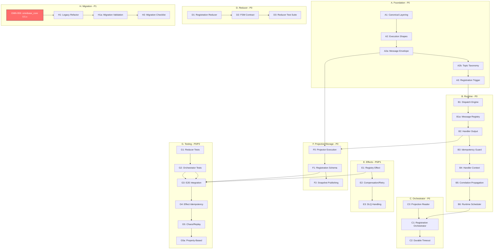

# ONEX Runtime & Two-Way Registration — Canonical Ticket Plan

    Status: Canonical
    Audience: Internal + Public
    Document Version: 1.1.0
    Purpose:
        This ticket set defines the authoritative execution, orchestration, reducer, handler,
        projector, and effect model for ONEX. All future workflows MUST conform.

    Versioning Policy:
        This document follows semantic versioning (MAJOR.MINOR.PATCH):
        - MAJOR: Breaking changes to ticket structure or global constraints
        - MINOR: New tickets, additional acceptance criteria, or clarifications
        - PATCH: Typo fixes, formatting, non-functional updates

        Version history should be tracked in git commit messages.
        When making changes:
        - Update Document Version field above
        - Include version bump rationale in commit message
        - Reference related ticket IDs (e.g., OMN-XXX) in changes

---

> **BLOCKER**: This plan requires omnibase_core >= 0.5.0
> See OMN-959 for dependency update tracking.

---

## Global Architectural Constraints (Apply to ALL Tickets)

    1. Reducers fold EVENTS only
        - Reducers never fold commands
        - Reducers never read clocks
        - Reducers use event.emitted_at only

    2. Orchestrators own workflow and time
        - Orchestrators emit EVENTS only
        - Orchestrators receive now: datetime injected by runtime
        - Orchestrators NEVER perform I/O

    3. Handlers return outputs; runtime publishes
        - Handlers do not publish
        - Runtime is the only publisher

    4. Effects execute I/O only
        - No business logic
        - Idempotent by default
        - Retry-safe

    5. Deterministic ordering
        - Per-entity ordering uses partition offsets or monotonic sequence
        - Wall-clock timestamps are audit-only

    6. No versioned directories
        - No v1_0_0, v2, etc.
        - Versioning is logical, not structural

        Clarification:
            - This constraint applies to NEW components created under this plan
            - Existing v1_0_0 directories (e.g., nodes/<name>/v1_0_0/) are legacy patterns
              from earlier architectural decisions that will be migrated
            - Versioning approach: Semantic versioning (MAJOR.MINOR.PATCH) through
              contract_version field in contract.yaml, not directory hierarchy
            - Version field semantics:
                - MAJOR: Breaking changes to contract (incompatible with previous versions)
                - MINOR: Backward-compatible new features or enhancements
                - PATCH: Backward-compatible bug fixes and documentation updates
            - See ticket H1 (Legacy Component Refactor Plan) for migration of existing
              versioned directories to the new pattern

    7. Handler vs Node terminology
        - Handlers are execution units within a node
        - Nodes host handlers; handlers do not own lifecycle or messaging

        Terminology mapping:
            - Node: The deployable/addressable unit that hosts one or more handlers
            - Handler: A pure function that processes a specific message type within a node
            - Runtime: Infrastructure that dispatches messages to handlers and publishes outputs

        Usage rules:
            - Use "handler" when referring to message processing logic
            - Use "node" when referring to deployment, lifecycle, or identity
            - Never say "handler publishes" (only runtime publishes)
            - Never say "node processes messages" (handlers process, nodes host)

---

## A. Foundation (P0)

> **Execution Prerequisites**:
> - Decision owners MUST be assigned to each ticket before Wave 1 execution begins
> - Target dates for blocking decisions (A3, B6 configuration) SHOULD be set before execution
> - All A-section tickets share a single decision owner for architectural consistency

### A1. Canonical Layering and Terminology
    Priority: P0
    Description:
        Establish authoritative definitions for:
            - Event
            - Command
            - Intent
            - Reducer
            - Orchestrator
            - Effect
            - Handler
            - Projector
            - Runtime
    Acceptance:
        - Single document referenced by all workflow docs
        - No conflicting definitions remain

### A2. Canonical Execution Shapes
    Priority: P0
    Description:
        Define the only allowed execution shapes and forbid everything else.

        Allowed:
            - Event -> Orchestrator
            - Command -> Orchestrator (gated flows only)
            - Event -> Reducer
            - Reducer -> Projections + Intents
            - Intent -> Effect
            - Handler -> Output -> Runtime (publish happens here)

        Forbidden examples:
            - Command -> Reducer
            - Reducer -> I/O
            - Orchestrator -> I/O
            - Effect -> workflow decisions
            - Runtime -> domain decisions
    Acceptance:
        - Shapes are explicit, diagrammed, and referenced by all components
        - Implement "Execution Shape Validator" (CI gate) that fails if:
            - reducer handler returns events
            - orchestrator handler returns intents or projections
            - effect handler returns projections
            - any handler publishes directly (publishing must be runtime-only)
            - any reducer references injected time or system time
        - Execution Shape Validator fails if message category and topic category disagree:
            - events must only be read from <domain>.events topics
            - commands must only be read from <domain>.commands topics
            - intents must only be read from <domain>.intents topics
        - Add routing coverage check: all message types must be registered in B1a, startup fails fast if unmapped
        - Runtime MUST reject handler output that violates declared handler type
          (orchestrator, reducer, effect), even if the code compiles

        Pattern Validator Test Requirements:
            - Pattern validator catches reducer returning events
            - Pattern validator catches orchestrator performing I/O
            - Pattern validator catches effect returning projections
            - At least one "known bad" test case per violation type:
                - test_reducer_returning_events_rejected
                - test_orchestrator_performing_io_rejected
                - test_effect_returning_projections_rejected
                - test_reducer_accessing_system_time_rejected
                - test_handler_direct_publish_rejected
            - All "known bad" test cases MUST:
                - Construct a handler that violates the shape constraint
                - Invoke the validator against it
                - Assert the validator raises or returns failure
            - Include positive test cases demonstrating valid execution shapes:
                - test_reducer_returning_projections_and_intents_accepted
                - test_orchestrator_returning_events_only_accepted
                - test_effect_returning_optional_events_accepted
            - Validator test coverage required before CI gate is enabled

### A2a. Canonical Message Envelope
    Priority: P0
    Description:
        Define and enforce a single envelope model for commands, events, and intents.

        Canonical envelope principle:
            - ONE ModelEnvelope applies to ALL message categories (commands, events, intents)
            - ONE ModelEnvelope applies to ALL architectural planes (no plane-specific envelopes)
            - The envelope is transport-agnostic and plane-agnostic
            - Payload differs by message type; envelope structure is invariant

        Single envelope per architectural plane:
            - Ingestion Plane: Uses ModelEnvelope for all incoming messages
            - Decision Plane: Uses ModelEnvelope for orchestrator context propagation
            - State Plane: Uses ModelEnvelope for reducer/projector message handling
            - Execution Plane: Uses ModelEnvelope for effect intent processing

            IMPORTANT: "Single envelope per architectural plane" means the SAME ModelEnvelope
            structure is used in each plane - NOT that each plane has its own envelope type.
            The phrase describes consistent usage across planes, not envelope specialization.

            There is NO separate envelope type per plane. The same ModelEnvelope
            structure is used everywhere; only the payload contents differ.

        Required fields:
            - message_id
            - correlation_id
            - causation_id (nullable)
            - emitted_at
            - entity_id

        Rules:
            - causation_id references the immediate parent message_id
            - entity_id is the partition key and identity anchor for ordering
            - For registration domain: entity_id = node_id
              (removes partition-key ambiguity for registration workflows)

        Envelope usage per architectural plane:

            Ingestion Plane:
                - Envelope wraps incoming messages from external sources
                - message_id assigned at ingestion boundary
                - correlation_id inherited from caller or generated if absent
                - emitted_at set by ingress runtime

            Decision Plane (Orchestrators):
                - Envelope fields propagated to orchestrator context
                - correlation_id maintained across workflow decisions
                - causation_id links decision events to triggering event
                - emitted_at used for timeout calculations (via injected now)

            State Plane (Reducers, Projectors):
                - entity_id determines partition affinity and ordering
                - message_id used for idempotency (last_applied_event_id)
                - emitted_at is the only time field reducers may reference
                - Ordering enforced by (partition, offset) or sequence number

            Execution Plane (Effects):
                - correlation_id and causation_id propagated for distributed tracing
                - message_id (as intent_id) used for effect idempotency
                - entity_id identifies the target of I/O operations

    Deliverables:
        - omnibase_core/models/common/model_envelope.py
        - validation helpers (schema-level)
    Acceptance:
        - All registration messages compile with strict models
        - Unit tests reject missing or extra fields
        - Envelope structure is identical for commands, events, and intents
        - Per-plane usage documented and enforced by runtime
        - Contract schema validation tests verify envelope field requirements
          (See G1-G4 for test structure; envelope validation is part of reducer and effect tests)
        - Document envelope usage rules and migration path for dict-based envelopes
    Implementation Note:
        - Implementation sequencing: A2 and A2a can be built in parallel after A1
        - A2 enforcement can require envelope presence once A2a lands
    Cross-Reference:
        - See Global Constraint #7 for handler vs node terminology used in plane descriptions
        - See CLAUDE.md "Correlation ID Assignment Rules" for propagation patterns

### A2b. Canonical Topic Taxonomy
    Priority: P0
    Description:
        Standardize topic naming and semantics across all domains.

        Required topics:
            - onex.<domain>.commands
            - onex.<domain>.events
            - onex.<domain>.intents
            - onex.<domain>.snapshots (optional)

        Rules:
            - Partition key MUST be entity_id
            - events topics are immutable logs (delete-only, no compaction)
            - snapshots topics may be compacted
    Deliverables:
        - docs/standards/onex_topic_taxonomy.md
        - initial topic manifest for registration
    Acceptance:
        - Registration workflow fully conforms
        - Runtime routing uses topic taxonomy, not ad hoc strings
        - Default configs documented and enforced:
            - events topics: cleanup.policy=delete only
            - snapshots topics: cleanup.policy=compact,delete
            - commands topics: retention defaults documented
            - intents topics: retention defaults documented
        - Topic creation scripts enforce defaults
        - Registration domain topics created with defaults verified in tests
        - Partition key must be envelope.entity_id, validated by routing

### A3. Canonical Registration Trigger Decision
    Priority: P0
    Decision:
        Canonical trigger:
            - NodeIntrospected (EVENT)
        Optional trigger (non-canonical, gated):
            - RegisterNodeRequested (COMMAND)

        Rationale:
            - Canonical path stays aligned with event-driven registration
            - Command path is reserved for administrative or exceptional flows
    Acceptance:
        - Canonical path documented as default
        - Optional path clearly labeled and isolated

---

## B. Runtime (P0)

### B1. Runtime Dispatch Engine
    Priority: P0
    Description:
        Route messages to handlers based on:
            - topic category (commands/events/intents)
            - message type
    Acceptance:
        - Deterministic routing
        - Runtime performs publishing of handler outputs only
        - Runtime does not infer workflow meaning

### B1a. Message Type Registry
    Priority: P0
    Description:
        Central registry mapping:
            - message type -> handler implementation(s)
            - topic category constraints (what message types can appear where)

        Domain ownership enforcement:
            - registration.* messages cannot be handled by non-registration handlers
            - cross-domain consumption requires explicit opt-in

        Cross-domain subscription configuration:
            - Default: handlers can only consume messages from their own domain
            - Explicit opt-in required via configuration to consume cross-domain messages
            - Configuration format (in handler registration):
                allowed_cross_domain_sources:
                    - discovery.*     # Allow consuming all discovery domain messages
                    - health.events.* # Allow consuming health domain events only
            - Runtime validates cross-domain configuration at startup
            - Unauthorized cross-domain consumption is rejected with explicit error

            - Domain ownership is derived from:
                - topic name (onex.<domain>.*) AND
                - message type registry entry domain
            - Runtime rejects mismatches between topic domain and message type domain

        Domain derivation rule:
            - Domain is derived from the message type's module path prefix
            - The first segment of the fully-qualified message type path is the domain
            - Format: <domain>.<category>.<MessageName> where:
                - domain: first segment (e.g., "registration", "discovery", "health")
                - category: message category ("events", "commands", "intents")
                - MessageName: the specific message type name

            Valid examples:
                - registration.events.NodeRegistrationAccepted -> domain = "registration"
                - registration.events.NodeRegistrationRejected -> domain = "registration"
                - registration.commands.RegisterNodeRequested -> domain = "registration"
                - registration.intents.ConsulRegisterIntent -> domain = "registration"
                - registration.intents.PostgresUpsertRegistrationIntent -> domain = "registration"
                - discovery.events.NodeDiscovered -> domain = "discovery"
                - discovery.events.NodeLost -> domain = "discovery"
                - discovery.intents.ScanNetworkIntent -> domain = "discovery"
                - discovery.commands.TriggerDiscovery -> domain = "discovery"
                - health.commands.CheckNodeHealth -> domain = "health"
                - health.events.HealthCheckCompleted -> domain = "health"
                - health.events.HealthCheckFailed -> domain = "health"
                - health.intents.PingNodeIntent -> domain = "health"
                - health.intents.ProbeServiceIntent -> domain = "health"
                - provisioning.intents.ProvisionResourceIntent -> domain = "provisioning"
                - provisioning.events.ResourceProvisioned -> domain = "provisioning"
                - provisioning.events.ResourceProvisioningFailed -> domain = "provisioning"
                - provisioning.commands.RequestResourceProvisioning -> domain = "provisioning"
                - provisioning.commands.DecommissionResource -> domain = "provisioning"
                - runtime.events.RuntimeTick -> domain = "runtime"
                - runtime.events.RuntimeStarted -> domain = "runtime"
                - runtime.events.RuntimeShutdown -> domain = "runtime"
                - runtime.commands.ShutdownRuntime -> domain = "runtime"
                - runtime.intents.ScheduleTask -> domain = "runtime"

            Invalid examples (rejected by validation):
                - NodeRegistrationAccepted (missing domain and category prefix)
                - events.NodeRegistrationAccepted (missing domain prefix)
                - registration.NodeRegistrationAccepted (missing category segment)
                - registration.invalid.NodeRegistrationAccepted (invalid category, must be events/commands/intents)
                - Registration.events.NodeRegistrationAccepted (domain must be lowercase)
                - registration.Events.NodeRegistrationAccepted (category must be lowercase)
                - registration.events.node_registration_accepted (message name must be PascalCase)
                - my-domain.events.MyEvent (domain cannot contain hyphens, use underscores)

            - Topic domain MUST match message type domain prefix
            - Validation occurs at:
                1. Registration time (configuration validation)
                2. Publish time (runtime validation)
    Acceptance:
        - Startup-time validation that fails fast before consumers start processing messages
        - Missing handler mappings fail fast
        - Runtime rejects mismatches between topic domain and message type domain
        - Domain derivation from module path prefix is documented and enforced

### B2. Handler Output Model
    Priority: P0
    Description:
        Standardize handler outputs.

        Output fields:
            - events[]
            - intents[]
            - projections[]
            - metrics
            - logs

        Rules:
            - Orchestrator handlers output events only
            - Reducer handlers output projections + intents only
            - Effect handlers output optional result events only
            - Runtime publishes outputs in deterministic order:
                1) projections
                2) intents
                3) events
            - Within each category, preserve handler-returned order

        Batching considerations:
            - Runtime MAY batch multiple outputs for throughput optimization
            - Batching MUST preserve ordering guarantees (projections before intents before events)
            - Batch size is configurable per output type
            - Transaction boundaries: projection persist + intent/event publish may be atomic
    Acceptance:
        - Runtime publishes all outputs
        - Handlers do not publish directly

### B3. Idempotency Guard
    Priority: P0
    Description:
        Enforce idempotent processing at the runtime boundary.

        Implementation:
            - Primary: Postgres (durable)
            - Optional: Valkey cache layer (P2, if throughput demands)
    Acceptance:
        - Duplicate message_id is safely ignored
        - Verified under at-least-once delivery
        - Replay-safe behavior demonstrated
        - Idempotency key strategy:
            - key: (domain, message_id) OR message_id if globally unique
            - store enforces uniqueness at key level

### B4. Handler Context (Time Injection)
    Priority: P0
    Description:
        Add now: datetime to handler context.

        Rules:
            - Orchestrators MAY use now for deadlines and timeouts
            - Effects MAY use now for retries/metrics
            - Reducers MUST ignore now and never depend on it
    Acceptance:
        - No handler reads system clock
        - Tests enforce no direct time reads
        - Define distinct context models:
            - ModelOrchestratorContext(now: datetime, ...)
            - ModelEffectContext(now: datetime, ...)
            - ModelReducerContext(...) # does not include now
        - Runtime dispatch enforces context type: reducers never receive now, orchestrators/effects do
        - Add tests proving reducers cannot access now via typing and runtime dispatch

### B5. Correlation and Causation Propagation Enforcement
    Priority: P0
    Description:
        Enforce workflow traceability by validating correlation and causation chains.

        Rules:
            - All messages within a workflow share correlation_id
            - Every produced message has causation_id = parent.message_id
            - causation chains are local (no skipping ancestors)
    Acceptance:
        - Validation rejects broken propagation
        - Integration test verifies full chain for registration

### B6. Runtime Scheduler
    Priority: P0
    Description:
        Emit RuntimeTick events on configurable cadence for timeout evaluation.

        Responsibilities:
            - Emit RuntimeTick(now) to internal topic or schedule hook
            - Own time injection for the system
            - Single source of truth for "now" across orchestrators

        Naming note:
            - Runtime emits RuntimeTick (infrastructure concern)
            - Orchestrators derive timeout decisions (domain concern)

        Configuration:
            - RuntimeTick interval is configurable (default: 1000ms / 1 second)
            - Configuration source: environment variable ONEX_RUNTIME_TICK_INTERVAL_MS
            - Minimum value: 100ms (prevents excessive CPU usage)
            - Maximum value: 60000ms (1 minute, ensures timely timeout detection)
            - Out-of-range values are clamped with warning log

        Configuration validation:
            - Runtime logs warning if interval < 100ms (clamped to 100ms)
            - Runtime logs warning if interval > 60000ms (clamped to 60000ms)
            - Invalid (non-numeric) values fall back to default with error log

        RuntimeTick message structure:
            - now: datetime (UTC, timezone-aware)
            - tick_sequence: int (monotonically increasing per runtime instance)
            - runtime_id: str (identifies the runtime instance emitting ticks)

        Operational considerations:
            - In multi-runtime deployments, each runtime emits its own ticks
            - Orchestrators MUST handle tick deduplication or use a single tick source
            - Tick emission is best-effort; clock skew between instances is expected
            - For timeout precision, use tick_sequence rather than wall-clock comparison
    Dependencies: B4
    Acceptance:
        - RuntimeTick emitted on configurable interval
        - Orchestrators consume RuntimeTick for timeout evaluation
        - now field in RuntimeTick matches handler context injection
        - Interval configurable via ONEX_RUNTIME_TICK_INTERVAL_MS environment variable
        - Interval bounds enforced: 100ms <= interval <= 60000ms

---

## C. Orchestrator (P0)

### C0. Projection Reader Interface
    Priority: P0
    Description:
        Orchestrators read current state using projections only.

        Deliverables:
            - ProtocolProjectionReader
            - Registration-specific query methods
    Acceptance:
        - No topic scanning for state
        - All orchestration decisions are projection-backed

### C1. Registration Orchestrator (Event-Driven)
    Priority: P0
    Dependencies: B6
    Description:
        Orchestrate registration using EVENTS (canonical) and COMMANDS (gated), emitting EVENTS only.

        Consumes:
            - NodeIntrospected (EVENT)  [canonical trigger]
            - NodeRegistrationAcked (COMMAND)
            - RuntimeTick (internal runtime schedule event or trigger)

        Emits (decision events):
            - NodeRegistrationInitiated
            - NodeRegistrationAccepted
            - NodeRegistrationRejected
            - NodeRegistrationAckTimedOut
            - NodeRegistrationAckReceived
            - NodeBecameActive
            - NodeLivenessExpired

        Note on naming:
            - NodeRegistrationInitiated is emitted from NodeIntrospected to represent
              the start of a registration attempt without implying command-driven semantics.
    Acceptance:
        - Emits events only
        - Performs no I/O
        - Uses projection reader for state decisions
        - Uses injected now for deadlines

### C2. Durable Timeout Handling
    Priority: P0
    Description:
        Ack and liveness timeouts must survive restarts.

        Requirements:
            - Deadlines stored in projections for restart safety
            - Orchestrator periodically queries for overdue entities
            - Orchestrator emits timeout decision events
    Acceptance:
        - Restart-safe behavior verified via integration test
        - No in-memory-only deadlines
        - Runtime scheduler emits RuntimeTick on configurable cadence
        - Orchestrator uses injected now from RuntimeTick for timeout evaluation
        - Canonical approach: emitted_at markers for timeout dedupe
        - Projections store per-timeout-type emission markers:
            - ack_timeout_emitted_at (nullable)
            - liveness_timeout_emitted_at (nullable)
        - Orchestrator emits timeout events only if marker is absent
        - Integration test: restart orchestrator after deadline passed, verify exactly one timeout event emitted

### C3. Optional Command-Based Registration (Gated)
    Priority: P2
    Description:
        Support RegisterNodeRequested for non-canonical flows (admin, manual, external nodes).

        Rules:
            - Must be explicitly enabled
            - Must not replace canonical NodeIntrospected flow
    Acceptance:
        - Clearly documented as non-default

---

## D. Reducer (P0)

### D1. Registration Reducer (Event-Only, Emits Intents and Projections)
    Priority: P0
    Description:
        Pure FSM reducer that folds decision events and deterministically emits:
            - Updated state
            - Registration projections
            - I/O intents for effects

        Folds:
            - NodeRegistrationInitiated
            - NodeRegistrationAccepted
            - NodeRegistrationRejected
            - NodeRegistrationAckTimedOut
            - NodeRegistrationAckReceived
            - NodeBecameActive
            - NodeLivenessExpired

        Emits:
            - ConsulRegisterIntent
            - PostgresUpsertRegistrationIntent
            - RegistrationProjection
    Acceptance:
        - Event-only folding enforced (commands rejected or ignored)
        - Deterministic intent emission
        - No time reads (uses event.emitted_at)
        - Reducer output ordering is deterministic:
            - projections are emitted before intents
            - intents are ordered deterministically within a single event fold

### D2. FSM Contract
    Priority: P0
    Description:
        Formal definition of registration state machine.
    Acceptance:
        - Reducer transitions match contract exactly

### D3. Reducer Test Suite
    Priority: P0
    Acceptance:
        - Same input event sequence produces same outputs
        - Command folding is forbidden and tested

---

## E. Effects (P0/P1)

### E1. Registry Effect (I/O Only)
    Priority: P0
    Description:
        Consume intents and execute external I/O.

        Consumes:
            - ConsulRegisterIntent
            - PostgresUpsertRegistrationIntent

        Rules:
            - No workflow decisions
            - Idempotent
            - Retry-safe
    Acceptance:
        - Duplicate intents cause no harmful side effects
        - Circuit breaker behavior verified
        - All intents include: intent_id (alias message_id), entity_id, registration_id where relevant
        - Effect idempotency key strategy documented:
            - primary: intent_id
            - secondary (natural key): (entity_id, intent_type, registration_id)
        - Tests prove executing same intent twice yields no additional side effects
        - Natural key conflict handling:
            - If intent_id differs but natural key matches, effect treats as duplicate
            - Exception: payload differs in a way requiring explicit conflict handling
        - Error sanitization requirements:
            - Effects MUST sanitize errors before logging (no secrets, credentials, PII)
            - Reference CLAUDE.md "Error Sanitization Guidelines" for allowed/forbidden content
            - Use transport-aware error codes from EnumCoreErrorCode (see CLAUDE.md mapping)
            - Safe to include: service names, operation names, correlation IDs, error codes,
              sanitized hostnames, port numbers, retry counts, timeout values
            - NEVER include: passwords, API keys, tokens, connection strings with credentials,
              PII, private keys, session tokens
        - Correlation ID requirements:
            - Propagate correlation_id from intent envelope to all error contexts
            - Use UUID4 format for any new correlation IDs (uuid4())
            - Auto-generate correlation_id if not present in incoming intent
            - Include correlation_id in all ModelInfraErrorContext instances
            - Correlation chain: intent.correlation_id -> effect error context -> logs

        Circuit Breaker Requirements (see CLAUDE.md "Circuit Breaker Pattern" section):
            - Effect handlers use MixinAsyncCircuitBreaker for fault tolerance
            - Thread safety verified: all circuit breaker calls hold _circuit_breaker_lock
            - Thread safety verification test required:
                - Test must verify _check_circuit_breaker is only called while holding lock
                - Test must verify _record_circuit_failure is only called while holding lock
                - Test must verify _reset_circuit_breaker is only called while holding lock
                - Test must verify concurrent access does not cause race conditions
            - Circuit breaker state (CLOSED/OPEN/HALF_OPEN) is monitored and logged
            - Configuration: threshold and reset_timeout tuned per external service
            - InfraUnavailableError raised when circuit is OPEN (fail-fast behavior)
            - Tests verify circuit breaker transitions under failure conditions

        Cross-Reference:
            - See CLAUDE.md "Error Sanitization Guidelines" for allowed/forbidden error content
            - See CLAUDE.md "Correlation ID Assignment Rules" for propagation patterns
            - See CLAUDE.md "Circuit Breaker Pattern (MixinAsyncCircuitBreaker)" for implementation

### E2. Compensation and Retry Policy
    Priority: P1
    Description:
        Define retry, backoff, and compensation strategy for partial failures.

        Note:
            - Promote to P0 only if correctness requires compensation before proceeding

        Non-goal:
            - Compensation does NOT imply rollback of emitted domain events
            - Compensation applies only to external side effects (I/O operations)
    Acceptance:
        - Written policy and tests for failure cases exist

### E3. Dead Letter Queue Handling
    Priority: P1
    Description:
        Define DLQ behavior for permanently failing intents.
    Acceptance:
        - DLQ topic configured
        - Alerting integrated
        - No silent drops

---

## F. Projection and Storage (P0)

### F0. Projector Execution Model
    Priority: P0
    Dependencies: B2, A2a
    Note: Moved earlier because orchestrator correctness depends on projection semantics
    Description:
        Define who persists projections and how ordering is enforced.

        Decision:
            - Reducer returns projections
            - Runtime invokes projector to persist projections
            - Projector enforces ordering and idempotency

        Relationship to B2 (Handler Output Model):
            B2 defines WHAT handlers return and the output ordering contract:
                - Orchestrator handlers: events only
                - Reducer handlers: projections + intents only
                - Effect handlers: optional result events only
                - Runtime publishes in order: projections -> intents -> events

            F0 defines HOW the runtime processes reducer outputs specifically:
                - Projections are persisted synchronously via Projector (not published to Kafka)
                - Intents and events are published to Kafka after projection persistence
                - This ensures read models are consistent before downstream processing

        F0 ↔ B2 Interaction Sequence (Reducer Output Processing):

            This diagram shows the critical synchronization between B2 (Handler Output Model)
            and F0 (Projector Execution). The Runtime processes reducer outputs in a specific
            order to ensure consistency:

            ┌─────────┐     ┌─────────┐     ┌───────────┐     ┌───────────┐
            │ Reducer │     │ Runtime │     │ Projector │     │   Kafka   │
            └────┬────┘     └────┬────┘     └─────┬─────┘     └─────┬─────┘
                 │               │                │                 │
                 │ returns       │                │                 │
                 │ projections   │                │                 │
                 │ + intents     │                │                 │
                 │ (per B2)      │                │                 │
                 │──────────────>│                │                 │
                 │               │                │                 │
                 │               │ ┌────────────────────────────────┐
                 │               │ │ SYNCHRONOUS: projection first  │
                 │               │ └────────────────────────────────┘
                 │               │                │                 │
                 │               │  1. persist()  │                 │
                 │               │───────────────>│                 │
                 │               │                │                 │
                 │               │     ack        │                 │
                 │               │<───────────────│                 │
                 │               │                │                 │
                 │               │ ┌────────────────────────────────┐
                 │               │ │ AFTER persist ack: publish     │
                 │               │ └────────────────────────────────┘
                 │               │                │                 │
                 │               │  2. publish intents              │
                 │               │─────────────────────────────────>│
                 │               │                │                 │
                 │               │                │     ack         │
                 │               │<─────────────────────────────────│
                 │               │                │                 │

            Guarantee: Projection is DURABLE before any intent reaches Kafka.
            This prevents race conditions where an Effect executes before the
            projection state is visible to queries.

        End-to-End Flow Sequence Diagram (Orchestrator -> Reducer -> Effect):

            This is the canonical flow for all ONEX workflows. The diagram shows how
            an event flows through the complete orchestrator -> reducer -> effect
            pipeline. The runtime coordinates handler invocation and output publishing
            per B2 ordering rules.

            ┌─────────────┐     ┌─────────────┐     ┌───────────┐     ┌───────────┐
            │ Event Log   │     │   Runtime   │     │ Projector │     │  Storage  │
            │ (Kafka)     │     │             │     │           │     │ (Postgres)│
            └──────┬──────┘     └──────┬──────┘     └─────┬─────┘     └─────┬─────┘
                   │                   │                  │                 │
            ═══════════════════════════════════════════════════════════════════════
            PHASE 1: Orchestrator Processing (emits decision events)
            ═══════════════════════════════════════════════════════════════════════
                   │                   │                  │                 │
                   │  NodeIntrospected │                  │                 │
                   │──────────────────>│                  │                 │
                   │                   │                  │                 │
                   │                   │ invoke Orchestrator Handler        │
                   │                   │────────────────────────────────────>
                   │                   │         (reads projections)        │
                   │                   │<────────────────────────────────────
                   │                   │                  │                 │
                   │                   │ Orchestrator returns:              │
                   │                   │   events: [NodeRegistrationAccepted]
                   │                   │                  │                 │
                   │ publish events    │                  │                 │
                   │<──────────────────│                  │                 │
                   │                   │                  │                 │
            ═══════════════════════════════════════════════════════════════════════
            PHASE 2: Reducer Processing (per B2: projections -> intents -> events)
            ═══════════════════════════════════════════════════════════════════════
                   │                   │                  │                 │
                   │ NodeRegistration- │                  │                 │
                   │ Accepted          │                  │                 │
                   │──────────────────>│                  │                 │
                   │                   │                  │                 │
                   │                   │ invoke Reducer Handler             │
                   │                   │─────────────────────────────────────>
                   │                   │                  │                 │
                   │                   │ Reducer returns (B2 output model): │
                   │                   │   projections: [RegistrationProj]  │
                   │                   │   intents: [ConsulRegisterIntent,  │
                   │                   │             PostgresUpsertIntent]  │
                   │                   │                  │                 │
                   │                   │ 1. persist projections (sync, F0)  │
                   │                   │─────────────────>│                 │
                   │                   │                  │ write projection│
                   │                   │                  │────────────────>│
                   │                   │                  │      ack        │
                   │                   │                  │<────────────────│
                   │                   │       ack        │                 │
                   │                   │<─────────────────│                 │
                   │                   │                  │                 │
                   │ 2. publish intents│                  │                 │
                   │<──────────────────│                  │                 │
                   │                   │                  │                 │
            ═══════════════════════════════════════════════════════════════════════
            PHASE 3: Effect Processing (executes I/O from intents)
            ═══════════════════════════════════════════════════════════════════════
                   │                   │                  │                 │
                   │ ConsulRegister-   │                  │                 │
                   │ Intent            │                  │                 │
                   │──────────────────>│                  │                 │
                   │                   │                  │                 │
                   │                   │ invoke Effect Handler              │
                   │                   │─────────────────────────────────────>
                   │                   │   (executes Consul API call)       │
                   │                   │                  │                 │
                   │                   │ Effect returns:                    │
                   │                   │   events: [optional result event]  │
                   │                   │                  │                 │
                   │ 3. publish events │                  │                 │
                   │ (if any)          │                  │                 │
                   │<──────────────────│                  │                 │
                   │                   │                  │                 │

            Key synchronization point (F0 guarantee):
                Projector.persist() completes BEFORE intents are published.
                This ensures the projection (read model) is updated before
                any downstream consumer receives the intent, preventing
                race conditions where effects execute before state is visible.

        F0 Failure Handling:

            Projection persistence is a critical synchronization point. Failure
            handling follows these rules:

            1. If Projector.persist() fails, Runtime MUST NOT publish intents
               - The message remains uncommitted and will be retried
               - No partial state visible to downstream consumers

            2. Projection failure is a fatal error for the message
               - After configured retries (see E2 for retry policy), send to DLQ
               - DLQ message includes: original event, projection data, error context

            3. Consistency guarantee: no intent is processed before its projection is durable
               - Effects can safely assume projection state is current when they execute
               - Orchestrators can safely read projections without stale data concerns

            Failure Sequence Diagram:

            ┌─────────┐     ┌─────────┐     ┌───────────┐     ┌───────────┐
            │ Reducer │     │ Runtime │     │ Projector │     │    DLQ    │
            └────┬────┘     └────┬────┘     └─────┬─────┘     └─────┬─────┘
                 │ returns      │                │                 │
                 │ projections  │                │                 │
                 │ + intents    │                │                 │
                 │─────────────>│                │                 │
                 │              │  1. persist()  │                 │
                 │              │───────────────>│                 │
                 │              │     FAIL       │                 │
                 │              │<───────────────│                 │
                 │              │                │                 │
                 │              │  2. retry (N times)              │
                 │              │───────────────>│                 │
                 │              │     FAIL       │                 │
                 │              │<───────────────│                 │
                 │              │                │                 │
                 │              │  3. send to DLQ (intents NOT published)
                 │              │─────────────────────────────────>│
                 │              │                │                 │

        Important: "Publish" means different things for different output types:
            - Projections: "persist to storage" (PostgreSQL, Redis, etc.)
              NOT "publish to Kafka topic"
            - Intents: publish to Kafka intent topic
            - Events: publish to Kafka event topic

        Terminology clarification (Persistence vs Publishing):
            - Projection PERSISTENCE: Synchronous write to durable storage (PostgreSQL, Redis)
              This is NOT publishing. Projections are never written to Kafka topics.
              The Projector.persist() method writes to storage and returns an ack.

            - Event/Intent PUBLISHING: Asynchronous write to Kafka topics for downstream
              consumption. This happens AFTER projection persistence completes.
              The Runtime.publish() method sends to Kafka and awaits broker ack.

            This distinction is critical for understanding F0's ordering guarantees:
            projections are PERSISTED (to storage) before events/intents are PUBLISHED (to Kafka).

        Ordering rules:
            - Per-entity monotonic application based on (partition, offset) or sequence
            - Reject stale updates

        Idempotency layers (both required):
            - Runtime idempotency (B3): prevents duplicate handler execution
            - Projector idempotency (F0): prevents stale/out-of-order projection writes
    Acceptance:
        - Offset-aware idempotent writes implemented
        - Restart-safe projection rebuild process defined
        - Projector is invoked synchronously by runtime before topic publications
        - Projector.persist() writes to storage, not Kafka
        - Sequence diagram accurately reflects B2 output ordering contract

### F1. Registration Projection Schema
    Priority: P0
    Acceptance:
        - Stores:
            - current state
            - deadlines (ack_deadline, liveness_deadline)
            - last_applied_event_id (message_id)
            - last_applied_offset (canonical)
            - last_applied_sequence (optional, only if using non-Kafka transports)
        - Supports orchestration queries efficiently
        - Makes idempotency and replay correctness auditable

### F2. Snapshot Publishing
    Priority: P1
    Description:
        Optional compacted snapshots for read optimization.
    Acceptance:
        - Snapshots do not replace immutable event logs

---

## G. Testing (P0/P2)

### G1. Reducer Tests
    Priority: P0
    Acceptance:
        - Same input event sequence produces same outputs
        - Deterministic output order verified (projections before intents)
        - Event.emitted_at used correctly (no system clock access)

    Test Examples:
        - test_same_event_sequence_produces_identical_outputs:
            Given identical NodeRegistrationAccepted events,
            When reducer processes them in sequence,
            Then outputs (projections, intents) are byte-for-byte identical

        - test_projection_output_precedes_intent_output:
            Given a reducer processing NodeRegistrationAccepted,
            When reducer returns output with both projections and intents,
            Then output.projections list is ordered before output.intents
            And runtime processes projections first per B2 ordering contract

    Test Directory Structure (per project conventions):
        tests/
        └── unit/
            └── registration/
                └── reducer/
                    ├── __init__.py
                    ├── test_registration_reducer_determinism.py
                    ├── test_registration_reducer_ordering.py
                    └── test_registration_reducer_fsm.py

        Example test file structure:
            # tests/unit/registration/reducer/test_registration_reducer_determinism.py
            import pytest
            from omnibase_infra.nodes.reducers.node_dual_registration_reducer import NodeDualRegistrationReducer

            def test_same_event_sequence_produces_identical_outputs():
                '''Given identical event sequences, reducer produces byte-for-byte identical outputs.'''
                reducer = NodeDualRegistrationReducer()
                events = [NodeRegistrationAccepted(...), NodeRegistrationAckReceived(...)]

                # First run
                output1 = reducer.fold_events(events)

                # Second run with same events
                output2 = reducer.fold_events(events)

                # Assert identical outputs
                assert output1.projections == output2.projections
                assert output1.intents == output2.intents

        Note: Project uses tests/unit/ for unit tests and tests/integration/ for
        integration tests. Do not use tests/domain/ as a top-level directory.

### G2. Orchestrator Tests
    Priority: P0
    Acceptance:
        - Emits events only
        - No I/O
        - Uses injected now, not system clock

    Test Examples:
        - test_orchestrator_emits_events_only_no_io:
            Given orchestrator handler with mock projection reader,
            When processing NodeIntrospected event with injected now,
            Then output contains only events (no intents, no projections)
            And no I/O operations are performed (verified via mock)
            And all datetime comparisons use injected now, not system clock

        - test_orchestrator_uses_injected_now_not_system_clock:
            Given orchestrator handler with mocked projection reader,
            And injected now = datetime(2024, 1, 15, 12, 0, 0, tzinfo=UTC),
            When processing RuntimeTick event,
            Then all timeout calculations use injected now
            And datetime.now() is never called (verified via mock.patch)
            And context.now is the only time source used

    Test Directory Structure (per project conventions):
        tests/
        └── unit/
            └── registration/
                └── orchestrator/
                    ├── __init__.py
                    ├── test_registration_orchestrator_events.py
                    ├── test_registration_orchestrator_time.py
                    └── test_registration_orchestrator_timeout.py

        Note: Orchestrator tests are unit tests (pure, no I/O) and belong in tests/unit/.

### G3. End-to-End Integration Tests
    Priority: P0
    Dependencies: G2, E1, F1
    Note: E2E tests require effects and projections to be implemented
    Acceptance:
        - Full handshake happy path
        - Restart mid-flight with pending deadlines
        - Duplicate delivery behavior
        - System behavior verified when:
            - orchestrator crashes after emitting acceptance
            - reducer and effect restart independently
            - no duplicate activation occurs

    Test Examples:
        - test_full_registration_handshake_happy_path:
            Given a new node emitting NodeIntrospected event,
            When the full orchestrator -> reducer -> effect pipeline executes,
            Then node transitions through states: PENDING -> ACCEPTED -> ACTIVE
            And Consul registration is persisted
            And PostgreSQL projection is updated

        - test_restart_preserves_pending_deadlines:
            Given a node in PENDING state with ack_deadline set,
            When orchestrator restarts and RuntimeTick is emitted,
            Then orchestrator reads deadline from projection
            And emits NodeRegistrationAckTimedOut if deadline passed

    Test Directory Structure (per project conventions):
        tests/
        └── integration/
            └── registration/
                ├── __init__.py
                ├── test_registration_e2e_happy_path.py
                ├── test_registration_e2e_restart.py
                └── test_registration_e2e_duplicate_delivery.py

        Note: E2E tests involve multiple components and external services, so they
        belong in tests/integration/. These tests require Docker containers for
        Kafka, Consul, and PostgreSQL.

### G4. Effect Idempotency and Retry Tests
    Priority: P0
    Acceptance:
        - Duplicate intent safe
        - Circuit breaker verified
        - Backoff policy validated

    Test Examples:
        - test_duplicate_intent_causes_no_additional_side_effects:
            Given an intent that was previously executed successfully,
            When the same intent is delivered again (same intent_id),
            Then no additional external I/O is performed
            And the effect returns success (idempotent response)

        - test_natural_key_conflict_treated_as_duplicate:
            Given an intent with intent_id="abc-123" previously executed,
            When a new intent with intent_id="xyz-456" arrives,
            And the natural key (entity_id, intent_type, registration_id) matches,
            Then effect treats as duplicate (no additional I/O)
            And returns idempotent success response

        - test_circuit_breaker_transitions_under_failure:
            Given effect with circuit breaker threshold=3,
            When 3 consecutive failures occur,
            Then circuit breaker transitions to OPEN state
            And subsequent calls raise InfraUnavailableError (fail-fast)
            When reset_timeout elapses,
            Then circuit breaker transitions to HALF_OPEN
            And next successful call transitions to CLOSED

        - test_circuit_breaker_lock_held_during_state_check:
            Given effect with MixinAsyncCircuitBreaker,
            When _check_circuit_breaker is called,
            Then _circuit_breaker_lock MUST be held by caller
            And concurrent state modifications are prevented

        - test_backoff_policy_applied_on_transient_failure:
            Given effect with exponential backoff policy,
            When a transient failure occurs,
            Then retry is attempted after configured backoff delay
            And delay increases exponentially on subsequent failures

        - test_error_context_includes_correlation_id:
            Given effect processing an intent with correlation_id="corr-123",
            When an InfraConnectionError is raised,
            Then error context includes correlation_id="corr-123"
            And error message is sanitized (no secrets/credentials)

    Test Directory Structure (per project conventions):
        tests/
        └── unit/
            └── registration/
                └── effect/
                    ├── __init__.py
                    ├── test_effect_idempotency.py
                    ├── test_effect_circuit_breaker.py
                    ├── test_effect_retry_backoff.py
                    └── test_effect_error_handling.py

        Note: Effect unit tests (with mocked external services) belong in tests/unit/.
        Integration tests that require actual Kafka/Consul/PostgreSQL belong in
        tests/integration/registration/.

### G5. Chaos and Replay Tests
    Priority: P2

### G5a. Property-Based Testing
    Priority: P2
    Description:
        Add property-based tests for reducer determinism
        and orchestrator idempotency using Hypothesis.
    Acceptance:
        - Reducer outputs identical results for identical input sequences
        - Orchestrator decisions are deterministic under replay

---

## H. Migration (P1)

### H1. Legacy Component Refactor Plan
    Priority: P1

    > **BLOCKER**: This ticket is blocked by OMN-959 (omnibase_core 0.5.x adoption).
    > H1 CANNOT begin until OMN-959 is complete.

    Dependencies:
        - OMN-959 (omnibase_core 0.5.x adoption) - BLOCKING DEPENDENCY
          This ticket CANNOT begin until OMN-959 is complete. The new node base
          classes (NodeOrchestrator, NodeReducer, NodeEffect) are required for
          the refactor target architecture.
        - All P0 tickets in sections A-F must be complete
    Cross-Reference:
        - See `docs/handoffs/HANDOFF_TWO_WAY_REGISTRATION_REFACTOR.md` Section 6 for
          detailed Phase 0-4 migration steps and contingency plans
    Pre-Refactor Requirements:
        - Baseline performance metrics captured before any refactoring begins
        - Metrics include: latency p50/p95/p99, throughput (events/sec), error rates
        - Baseline serves as regression detection reference during and after migration
    Description:
        Identify legacy code paths and refactor into:
            - orchestrator handlers
            - reducer handlers
            - effect handlers
            - projector persistence
    Acceptance:
        - No big-bang rewrite required
        - Explicit cutover points defined
        - No dual-write paths allowed:
            - legacy and canonical systems must not both emit authoritative events
            - cutover is event-boundary based, not code-path based
        - Existing v1_0_0 directories identified and migration path documented:
            - complete inventory of all nodes/<name>/v1_0_0/ directories
            - per-directory migration plan with target flat structure
            - dependency analysis for each directory (what imports from it)
        - New components do not use versioned directories per Global Constraint #6
        - Cutover strategy for each legacy v1_0_0 directory defined:
            - contract.yaml versioning via contract_version field (not directory hierarchy)
            - import path migration plan (old versioned paths -> new flat paths)
            - backwards compatibility shim period (if needed) with explicit end date
            - deprecation warnings added before removal
            - final removal milestone and verification criteria

    Documentation Deliverables:
        - Developer migration guide: `docs/guides/v1_0_0-migration-guide.md`
            Content requirements:
            - Import path changes (versioned to flat structure)
            - Contract.yaml version field usage patterns
            - Testing migration completeness checklist
            - Common migration errors and solutions

    Feature Flags and Rollback Strategy:
        - Feature flag: `ONEX_LEGACY_IMPORT_PATHS_ENABLED` (default: true during migration)
            - When true: both legacy and new import paths work
            - When false: only new flat import paths work
            - Deprecation warning logged when legacy paths used
        - Rollback strategy:
            - Set `ONEX_LEGACY_IMPORT_PATHS_ENABLED=true` to restore legacy behavior
            - No data migration needed (import paths only)
            - Documented in operator runbook: `docs/runbooks/registration-workflow.md`
        - Canary deployment considerations:
            - Deploy to staging with `ONEX_LEGACY_IMPORT_PATHS_ENABLED=false`
            - Monitor for import errors in logs
            - Promote to production only after 24h stability in staging

### H1a. Migration Validation Gate
    Priority: P1
    Dependencies: H1
    Description:
        Validate that legacy v1_0_0 migration is complete and safe before proceeding.

        Validation checklist (pre-migration):
            - [ ] Complete inventory of all v1_0_0 directories documented
            - [ ] Dependency analysis complete (what imports from each v1_0_0 path)
            - [ ] Target flat structure defined for each component
            - [ ] Rollback plan documented and tested

        Validation checklist (during migration):
            - [ ] All legacy imports updated to flat structure
            - [ ] Deprecation warnings added for legacy paths
            - [ ] Feature flag ONEX_LEGACY_IMPORT_PATHS_ENABLED tested in both states
            - [ ] No import errors in CI with new paths

        Validation checklist (post-migration):
            - [ ] Integration tests pass with new structure
            - [ ] Documentation updated with new paths
            - [ ] Performance baseline comparison complete (no regression)
            - [ ] Canary deployment stable for 24h in staging
            - [ ] Legacy paths can be disabled without errors

        DLQ verification (cross-reference F0, E3):
            - [ ] DLQ topic exists and is configured
            - [ ] Failed projection persistence routes to DLQ correctly
            - [ ] DLQ messages include required context (original event, error, correlation_id)
    Acceptance:
        - CI green with migrated paths
        - No runtime import errors
        - No deprecated path warnings in logs (after migration complete)
        - Performance metrics within baseline thresholds (see H1 Pre-Refactor Requirements)

### H2. Migration Checklist
    Priority: P1
    Acceptance:
        - Explicit ticket ordering
        - Partial migration hazards documented

---

## Dependency Order (Authoritative)



**Text Reference (canonical)**:

    A1 -> A2 -> A2a -> A2b -> A3
        ↓
    B1 -> B1a -> B2 -> B3 -> B4 -> B5 -> B6
        ↓
    C0 -> C1 (depends on B6) -> C2
        ↓
    D1 -> D2 -> D3
        ↓
    E1 -> E2 -> E3
        ↓
    F0 (depends on B2, A2a) -> F1 -> F2
        ↓
    G1 -> G2 -> G3 (depends on G2, E1, F1) -> G4 -> G5 -> G5a
        ↓
    OMN-959 (omnibase_core 0.5.x) -> H1 -> H1a -> H2

    Migration dependency chain:
        - H1 (Legacy Component Refactor) depends on OMN-959 (BLOCKING)
        - H1a (Migration Validation Gate) depends on H1 completion
        - H2 (Migration Checklist) depends on H1a validation passing

---

    Tickets at the same dependency level may be executed in parallel if they
    do not introduce contradictory contracts or shared-interface churn.

    This document is the canonical baseline for all future workflows.

---

## Parallel Execution Plan

The following waves define parallelizable execution groups. Each wave can begin
once all blocking dependencies from previous waves are complete.

### Wave 1: Foundation (Days 1-3)
    Parallel:
        - A1 (Canonical Layering)
    Then:
        - A2 (Execution Shapes) + A2a (Message Envelope) - can run in parallel after A1

### Wave 2: Taxonomy & Trigger (Days 3-5)
    Sequential after A2a:
        - A2b (Topic Taxonomy)
        - A3 (Registration Trigger Decision)

### Wave 3: Runtime Core (Days 5-10)
    Parallel after A3:
        - B1 (Dispatch Engine)
        - B1a (Message Registry) - after B1
        - B2 (Handler Output) - after B1a
    Then:
        - B3, B4, B5, B6 (sequential chain)

### Wave 4: Domain Components (Days 10-15)
    Parallel after B6:
        - C0, C1, C2 (Orchestrator chain)
        - D1, D2, D3 (Reducer chain)
        - F0, F1 (Projection chain) - after B2, A2a

### Wave 5: Effects & Testing (Days 15-20)
    Parallel after Wave 4:
        - E1 (Registry Effect)
        - G1, G2 (Unit tests)
    Then:
        - G3 (E2E Integration) - after G2, E1, F1
        - G4 (Effect Idempotency)
        - E2, E3 (Compensation, DLQ)

### Wave 6: Migration (Post-MVP)
    Blocked by: OMN-959 (omnibase_core 0.5.x adoption)
    Sequential:
        - H1 (Legacy Component Refactor) - includes v1_0_0 directory migration
        - H1a (Migration Validation Gate)
        - H2 (Migration Checklist)

    Note: Wave 6 cannot begin until OMN-959 is complete. This is a hard blocker.
    All P0 tickets in Waves 1-5 should be complete before starting H1.

---

### Timeline Assumptions

    The timelines in this plan assume:
        - OMN-959 (omnibase_core 0.5.x) is resolved before P0 implementation begins
        - All blocking architectural decisions (A3, B6, C2) are resolved before Wave 1 starts
        - Decision owners are assigned and acknowledged per RACI matrix before Wave 1
        - Team capacity is available for parallel execution where indicated
        - CI/CD infrastructure supports the testing requirements

    If blocking dependencies are NOT resolved, timelines will slip accordingly.

    Escalation path for decision delays:
        - If blocking decisions are not resolved by their target dates, see
          HANDOFF_TWO_WAY_REGISTRATION_REFACTOR.md Section 9.1 "Escalation Path
          for Decision Blockers" for mitigation steps
        - Escalation timeline: 1-2 days (reminder), 3-4 days (dedicated meeting),
          5+ days (Engineering Manager escalation with default decisions)

    Track blockers in Linear and update this plan when resolution dates are known.

### Visualization Notes

    The mermaid diagram above should render correctly in:
        - GitHub markdown preview
        - Linear ticket descriptions
        - VS Code with mermaid extension
        - Most modern documentation systems

    If the diagram does not render:
        - Use the "Text Reference (canonical)" section below the diagram
        - Report rendering issues to the documentation team
        - Consider static image generation as fallback

    Dependency visualization tips:
        - Critical path highlighted: A1 -> A2 -> ... -> H2
        - Blocking dependency (OMN-959) shown in red via `style OMN959 fill:#ff6b6b,stroke:#333,color:#fff`
          This visually distinguishes it as a hard blocker that gates Wave 6 execution
        - Parallel execution opportunities visible at same vertical level
        - Cross-section dependencies shown with dashed lines where applicable
        - Use `graph TD` for top-down flow; `graph LR` for left-right if preferred

    Ticket dependency visualization tools:
        - Linear: Use the built-in "Dependencies" tab in ticket view to visualize blocking/blocked-by relationships
        - Mermaid diagram: Copy the mermaid code above into Linear ticket description for embedded rendering
        - GitHub: Markdown preview renders mermaid diagrams automatically
        - VS Code: Install "Markdown Preview Mermaid Support" extension for local rendering
        - Export options: Use `mermaid-cli` to generate PNG/SVG for presentations

    Recommended visualization workflow:
        1. Create Linear tickets from this plan (one ticket per section/subsection)
        2. Add ticket IDs to dependency graph nodes (e.g., A1 -> OMN-941, B1 -> OMN-942)
        3. Use Linear's "Add blocking" feature to link tickets per dependency graph
        4. Update mermaid diagram with actual ticket IDs for tracking
        5. Embed mermaid diagram in project README or wiki for team visibility

---

## Future Work Recommendations

The following items are out of scope for this plan but should be tracked for future iterations.

### Contract Generation Tooling

All new contracts should use `agent-contract-driven-generator` per CLAUDE.md guidelines.

Recommended validation tasks:
    - Verify generator supports new envelope model (A2a)
      Specific checks:
        - Generator produces ModelEnvelope-compatible message types
        - Generated code includes all required envelope fields (message_id, correlation_id, etc.)
        - Dict-based legacy patterns are migrated to typed envelope
    - Ensure FSM contract generation compatibility (D2)
    - Validate projector contract patterns (F0, F1)

### Performance Benchmarking

Recommended metrics to establish:
    - Baseline performance metrics before H1 refactor (REQUIRED - see H1 Pre-Refactor Requirements)
    - Target latency for orchestrator -> reducer -> effect flow (<100ms p99)
    - Throughput requirements for event processing (events/second)
    - Projection write latency targets (F0 concern)

Target Performance Requirements (recommended thresholds):
    - End-to-end latency (orchestrator -> reducer -> effect): <100ms p99
    - Orchestrator decision latency: <20ms p99
    - Reducer fold latency: <10ms p99
    - Effect execution latency: <50ms p99 (excluding external service time)
    - Projection persistence latency: <30ms p99
    - Event throughput: >1000 events/second per partition
    - Intent throughput: >500 intents/second per effect handler

    These targets apply to steady-state operation. Burst handling and backpressure
    behavior should be characterized separately.

### Documentation Verification

Ensure documentation renders correctly:
    - GitHub markdown preview (included in test plan)
    - Linear ticket links (included in test plan)
    - Mermaid diagrams (if added, verify rendering)

### Additional Testing Patterns

Consider adding:
    - Chaos testing for runtime scheduler (B6)
    - Load testing for high-volume event processing
    - Fault injection for circuit breaker validation

---

These recommendations do not block the current plan but should be considered
for post-MVP iterations or as parallel workstreams.

---

## Target Import Paths

> **Important**: These are POST-0.5.x target paths. They are NOT available in the current
> 0.4.x codebase. See the migration path below for how to transition.

The following import paths are the **target** paths once `omnibase_core >= 0.5.0` is available:

```python
# Base Classes (available in omnibase_core >= 0.5.0)
from omnibase_core.nodes import NodeOrchestrator, NodeEffect, NodeReducer

# Intent Models (available in omnibase_core >= 0.5.0)
from omnibase_core.models.intent import ModelIntent
from omnibase_core.models.intents import (
    ModelConsulRegisterIntent,
    ModelPostgresUpsertRegistrationIntent,
)

# Runtime (available in omnibase_core >= 0.5.0)
from omnibase_core.runtime import NodeRuntime

# Protocols (from SPI, available in omnibase_spi >= 0.4.0)
from omnibase_spi.protocols import ProtocolIntentHandler, ProtocolNodeRuntime
```

### Current 0.4.x Legacy Classes

In the current 0.4.x codebase, legacy node classes exist with different names:

    Legacy Classes (0.4.x):
        - NodeEffectLegacy       -> becomes NodeEffect in 0.5.x
        - NodeReducerLegacy      -> becomes NodeReducer in 0.5.x
        - NodeOrchestratorLegacy -> becomes NodeOrchestrator in 0.5.x

    Migration Path:
        1. Do NOT build new components on legacy classes
        2. Wait for omnibase_core 0.5.x release (tracked by OMN-959)
        3. Update imports to target paths after 0.5.x is available
        4. See docs/architecture/DECLARATIVE_EFFECT_NODES_PLAN.md for full migration details

> **Warning**: Building on `NodeEffectLegacy`, `NodeReducerLegacy`, or other legacy classes
> will require migration when 0.5.x is released. Plan for this transition.

---

## Appendix: Coding Conventions

### Type Annotation Style

Per CLAUDE.md conventions, use PEP 604 union syntax for nullable types:

    Preferred:
        - Use `X | None` over `Optional[X]`
        - This applies to all model fields, function parameters, and return types

    Examples:
        # PREFERRED
        def get_user(id: str) -> User | None: ...
        deadline: datetime | None = None

        # NOT PREFERRED
        from typing import Optional
        def get_user(id: str) -> Optional[User]: ...

    Rationale:
        - Visually clearer and more explicit
        - Reduces import clutter
        - Consistent with modern Python type annotation patterns

### File and Class Naming

See CLAUDE.md "File & Class Naming Conventions" for complete patterns:

    Models:     model_<name>.py     -> Model<Name>
    Enums:      enum_<name>.py      -> Enum<Name>
    Protocols:  protocol_<name>.py  -> Protocol<Name>
    Services:   service_<name>.py   -> Service<Name>
    Nodes:      node.py             -> Node<Name><Type>

### Registry Naming Conventions

Per CLAUDE.md "Registry Naming Conventions":

    Node-Specific Registries (in nodes/<name>/registry/):
        File:  registry_infra_<node_name>.py
        Class: RegistryInfra<NodeName>

        Examples:
            - registry_infra_postgres_adapter.py -> RegistryInfraPostgresAdapter
            - registry_infra_kafka_adapter.py   -> RegistryInfraKafkaAdapter

        Note: Legacy paths nodes/<name>/v1_0_0/registry/ will be migrated per H1

    Standalone Registries (in domain directories):
        File:  registry_<purpose>.py
        Class: Registry<Purpose>

        Examples:
            - registry_handler.py  -> RegistryHandler
            - registry_policy.py   -> RegistryPolicy
            - registry_compute.py  -> RegistryCompute

---

## Appendix: Why This Model

    Why reducers are pure:
        - Deterministic replay guarantees identical state reconstruction
        - Testable without mocking external systems
        - Enables event sourcing and temporal queries

    Why orchestrators own time:
        - Timeouts become explicit domain decisions, not infrastructure magic
        - Restart-safe: deadlines persist in projections, not memory
        - Testable: inject time, verify decisions

    Why runtime publishes:
        - Single point of delivery guarantee enforcement
        - Handlers remain pure functions returning data
        - Enables batching, ordering, and transactional semantics

    Why events are immutable:
        - Audit trail is complete and trustworthy
        - Replay is deterministic
        - No "undo" semantics prevent corruption

    This model optimizes for correctness under failure,
    not convenience under success.

    Convenience features must be layered without weakening invariants.

---

## Appendix: Documentation Deliverables

The following documentation artifacts are required as part of this plan.

### Architecture Decision Records (ADRs)

Key architectural decisions require ADRs before implementation begins.

| ADR | This Plan Reference | HANDOFF Reference | Description |
|-----|---------------------|-------------------|-------------|
| `docs/adr/ADR-XXX-command-source.md` | A3 (OMN-943) | Section 9.1 | Command Source decision (API/Introspection/Both) |
| `docs/adr/ADR-XXX-intent-topic-naming.md` | A2b (OMN-939) | Section 9.1 | Intent topic naming convention |
| `docs/adr/ADR-XXX-reducer-invocation-pattern.md` | D1 (OMN-889) | Section 9.1 | Reducer invocation (direct vs event-based) |

> **Note**: ADR numbers (XXX) will be assigned during the pre-implementation meeting.
> See `docs/handoffs/HANDOFF_TWO_WAY_REGISTRATION_REFACTOR.md` Section 9.1 for decision
> requirements, RACI matrix, and escalation paths.

### Operational Documentation

| Document | Status | Description |
|----------|--------|-------------|
| `docs/runbooks/registration-workflow.md` | To be created | Operator runbook for registration workflow |

**Runbook content requirements**:
    - Troubleshooting registration failures
    - Circuit breaker state recovery procedures
    - Kafka topic health verification
    - Consul/PostgreSQL registration state inspection
    - Common failure scenarios and resolution steps
    - Monitoring dashboards and alert response
    - Feature flag rollback procedures (H1)

### Developer Documentation

| Document | Status | Description |
|----------|--------|-------------|
| `docs/guides/v1_0_0-migration-guide.md` | To be created | Migration guide for v1_0_0 directory structure (H1) |
| `docs/architecture/RUNTIME_EXECUTION_MODEL.md` | To be created | Runtime execution model documentation (B1, B2, F0) |
| `docs/standards/onex_topic_taxonomy.md` | To be created | Topic naming standards (A2b) |

### Cross-Reference Documents

This plan references and should be read alongside:
    - `docs/handoffs/HANDOFF_TWO_WAY_REGISTRATION_REFACTOR.md` - Implementation handoff
      (Contains: Phase 0-4 migration steps, PR #52 disposition, stakeholder communication)
    - `docs/design/DESIGN_TWO_WAY_REGISTRATION_ARCHITECTURE.md` (Version 2.1.2) - Workflow patterns
      (Contains: Logical planes, data flow, handler contracts, Linear ticket mapping)
    - `docs/architecture/DECLARATIVE_EFFECT_NODES_PLAN.md` - Node architecture
    - `docs/architecture/CURRENT_NODE_ARCHITECTURE.md` - Current state reference
    - `src/omnibase_infra/nodes/reducers/registration_reducer.py` - Pure reducer implementation
    - `src/omnibase_infra/nodes/reducers/models/model_registration_state.py` - State model

### Documentation Checklist

- [ ] ADR: Command Source Decision
- [ ] ADR: Intent Topic Naming
- [ ] ADR: Reducer Invocation Pattern
- [ ] Operator Runbook: Registration Workflow
- [ ] Developer Guide: v1_0_0 Migration
- [ ] Architecture Doc: Runtime Execution Model
- [ ] Standards Doc: Topic Taxonomy
