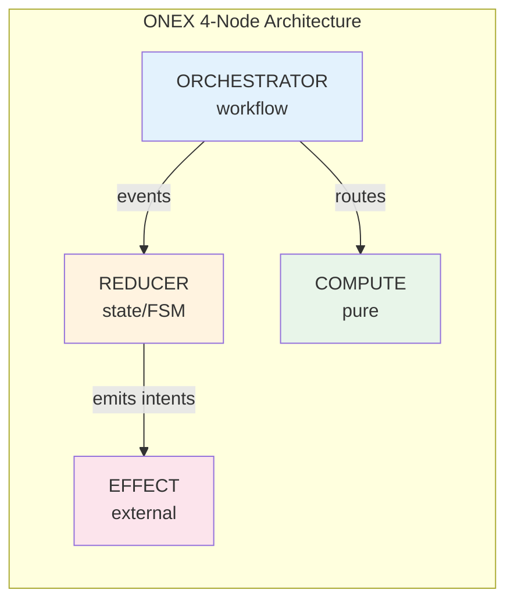

> **Navigation**: [Home](../index.md) > [Getting Started](README.md) > Quick Start

# Quick Start Guide

Get ONEX Infrastructure running in 5 minutes.

## 30-Second Quick Win

After installation (`poetry install`), verify ONEX works with this one-liner:

```bash
poetry run python -c "
from omnibase_core.nodes import NodeEffect, NodeCompute, NodeReducer, NodeOrchestrator
print('ONEX node archetypes available:')
print('  - NodeEffect (external I/O)')
print('  - NodeCompute (pure transforms)')
print('  - NodeReducer (state/FSM)')
print('  - NodeOrchestrator (workflows)')
print('Ready to build contract-driven nodes!')
"
```

**Expected output:**
```
ONEX node archetypes available:
  - NodeEffect (external I/O)
  - NodeCompute (pure transforms)
  - NodeReducer (state/FSM)
  - NodeOrchestrator (workflows)
Ready to build contract-driven nodes!
```

ONEX is installed. Now see the 2-minute example below, or jump to [Understanding ONEX in 60 Seconds](#understanding-onex-in-60-seconds).

---

## TL;DR - Minimal Working Example

Copy-paste this to create your first ONEX node in under 2 minutes:

```bash
# 1. Setup (one-time)
git clone <repo-url> omnibase_infra && cd omnibase_infra
poetry install

# 2. Create a minimal node
mkdir -p src/omnibase_infra/nodes/node_hello_effect/models
```

```python
# src/omnibase_infra/nodes/node_hello_effect/models/__init__.py
from pydantic import BaseModel

class ModelHelloRequest(BaseModel):
    name: str

class ModelHelloResponse(BaseModel):
    greeting: str
```

```yaml
# src/omnibase_infra/nodes/node_hello_effect/contract.yaml
contract_version: { major: 1, minor: 0, patch: 0 }
node_version: "1.0.0"
name: "node_hello_effect"
node_type: "EFFECT_GENERIC"
description: "Minimal effect node example."
input_model: { name: "ModelHelloRequest", module: "omnibase_infra.nodes.node_hello_effect.models" }
output_model: { name: "ModelHelloResponse", module: "omnibase_infra.nodes.node_hello_effect.models" }
```

```python
# src/omnibase_infra/nodes/node_hello_effect/node.py
from omnibase_core.nodes.node_effect import NodeEffect

class NodeHelloEffect(NodeEffect):
    """Declarative - all behavior from contract.yaml."""
    pass  # Yes, really. The node is empty!
```

```bash
# 3. Verify it works
poetry run python -c "from omnibase_infra.nodes.node_hello_effect.node import NodeHelloEffect; print('Node loads!')"
```

**That's it!** The node class is intentionally empty - all behavior is contract-driven.

---

## Prerequisites

- Python 3.12+
- Poetry
- Docker (optional, for infrastructure services)

## Installation

```bash
# Clone and install
git clone <repo-url> omnibase_infra
cd omnibase_infra
poetry install

# Verify installation
poetry run python -c "import omnibase_infra; print('Ready!')"
```

## Understanding ONEX in 60 Seconds

ONEX uses **contract-driven nodes** organized into four archetypes:

### ASCII Diagram

**Diagram Description**: The following ASCII diagram shows the four ONEX node archetypes and their relationships. The ORCHESTRATOR coordinates workflows and sends events to the REDUCER, which manages state via FSM. The ORCHESTRATOR also routes work to COMPUTE nodes for pure transformations. The REDUCER emits intents that are executed by EFFECT nodes, which handle external I/O like databases and APIs.

```
┌─────────────────────────────────────────────────────────────────┐
│                     ONEX 4-Node Architecture                     │
├─────────────────────────────────────────────────────────────────┤
│                                                                  │
│   ┌──────────────┐    events     ┌──────────────┐               │
│   │ ORCHESTRATOR │ ────────────► │   REDUCER    │               │
│   │  (workflow)  │               │  (state/FSM) │               │
│   └──────────────┘               └──────────────┘               │
│          │                              │                        │
│          │ routes                       │ emits intents          │
│          ▼                              ▼                        │
│   ┌──────────────┐               ┌──────────────┐               │
│   │   COMPUTE    │               │    EFFECT    │               │
│   │    (pure)    │               │  (external)  │               │
│   └──────────────┘               └──────────────┘               │
│                                                                  │
└─────────────────────────────────────────────────────────────────┘
```

### Mermaid Diagram



| Archetype | Purpose | Side Effects |
|-----------|---------|--------------|
| **ORCHESTRATOR** | Coordinates workflows, routes events to handlers | Publishes events |
| **REDUCER** | Manages state via FSM, emits intents | None (pure) |
| **COMPUTE** | Pure transformations and validation | None (pure) |
| **EFFECT** | External I/O (databases, APIs, services) | Yes |

## Your First Node

Every ONEX node has three parts:

1. **`models/`** - Pydantic models for typed input/output
2. **`contract.yaml`** - Declares what the node does (the "what")
3. **`node.py`** - Extends base class, contains no logic (declarative)

### Example: A Minimal Effect Node

```bash
# Create node directory with models
mkdir -p src/omnibase_infra/nodes/node_hello_effect/models
```

**`models/__init__.py`** - Define typed input/output models:
```python
from pydantic import BaseModel


class ModelHelloRequest(BaseModel):
    """Input model for hello effect."""

    name: str


class ModelHelloResponse(BaseModel):
    """Output model for hello effect."""

    greeting: str
```

**`contract.yaml`** - Declare node behavior:
```yaml
contract_version:
  major: 1
  minor: 0
  patch: 0
node_version: "1.0.0"
name: "node_hello_effect"
node_type: "EFFECT_GENERIC"
description: "Simple effect node example."

input_model:
  name: "ModelHelloRequest"
  module: "omnibase_infra.nodes.node_hello_effect.models"

output_model:
  name: "ModelHelloResponse"
  module: "omnibase_infra.nodes.node_hello_effect.models"
```

**`node.py`**:
```python
from __future__ import annotations
from typing import TYPE_CHECKING
from omnibase_core.nodes.node_effect import NodeEffect

if TYPE_CHECKING:
    from omnibase_core.models.container import ModelONEXContainer

class NodeHelloEffect(NodeEffect):
    """Declarative effect node - all behavior from contract.yaml."""

    def __init__(self, container: ModelONEXContainer) -> None:
        super().__init__(container)

__all__ = ["NodeHelloEffect"]
```

**Verify it works:**
```bash
poetry run python -c "
from omnibase_infra.nodes.node_hello_effect.node import NodeHelloEffect
from omnibase_infra.nodes.node_hello_effect.models import ModelHelloRequest, ModelHelloResponse
print('Node class:', NodeHelloEffect.__name__)
print('Input model:', ModelHelloRequest.__name__)
print('Output model:', ModelHelloResponse.__name__)
print('Node loads successfully!')
"
```

**Key principle**: The node class is empty! All behavior is driven by the contract.

## Running Tests

```bash
# Run all tests
poetry run pytest

# Run unit tests only
poetry run pytest tests/unit/

# Run with coverage
poetry run pytest --cov=omnibase_infra
```

## Running ONEX Validators

ONEX enforces coding standards via validators:

```bash
# Run all validators
poetry run python scripts/validate.py all

# Check for forbidden Any types
poetry run python scripts/validate.py any_types

# Validate architecture patterns
poetry run python scripts/validate.py architecture
```

## Docker Deployment (Optional)

For running with full infrastructure:

```bash
cd docker
cp .env.example .env
# Edit .env with your settings

# Start core runtime
docker compose -f docker-compose.runtime.yml --profile main up -d

# Check health
curl http://localhost:8085/health
```

## Project Structure

```
src/omnibase_infra/
├── nodes/              # ONEX nodes (Effect, Compute, Reducer, Orchestrator)
│   ├── node_*/         # Each node has contract.yaml + node.py
│   └── reducers/       # Reducer implementations
├── handlers/           # Infrastructure handlers (Consul, DB, Vault, HTTP)
├── models/             # Pydantic models
├── enums/              # Centralized enums
├── adapters/           # External service adapters
└── runtime/            # Runtime kernel and dispatchers
```

## Key Concepts

### Contract-Driven Development

Everything is declared in YAML contracts:
- Handler routing → `handler_routing:` section
- State machines → `state_machine:` section
- Workflow graphs → `execution_graph:` section

### Capability Naming

Nodes and capabilities are named by **what they do**, not what they are. This is the "capability-oriented" design principle.

**Good naming (capability-oriented):**
```yaml
capabilities:
  - name: "service.discovery"        # What it does: discovers services
    description: "Discover services by name, tags, or health status"
  - name: "registration.storage"     # What it does: stores registrations
    description: "Store and query node registration records"
  - name: "node.validate"            # What it does: validates nodes
    description: "Validate node contracts and architecture"
  - name: "event.process"            # What it does: processes events
    description: "Process and route events to handlers"
```

**Bad naming (vendor/implementation-oriented):**
```yaml
capabilities:
  - name: "consulHandler"      # Exposes vendor (Consul) - what if you switch to Kubernetes?
  - name: "postgresAdapter"    # Exposes implementation - not what it does
  - name: "doThing"            # Vague - what thing?
  - name: "myHandler"          # Meaningless - whose handler? for what?
  - name: "processData"        # Too generic - what kind of data? what processing?
```

**Why this matters:**
- Capability names appear in service discovery and routing
- Good names are self-documenting: `service.discovery` tells you exactly what to expect
- Bad names force you to read documentation or source code
- Vendor-agnostic names allow backend swaps without interface changes

**Naming pattern:** `domain.action` or `domain.subdomain.action`
- `service.discovery` - domain: service, action: discovery
- `registration.storage.query` - domain: registration, subdomain: storage, action: query

### Dependency Injection

All nodes use container-based DI:
```python
def __init__(self, container: ModelONEXContainer) -> None:
    super().__init__(container)
```

### No `Any` Types

ONEX forbids `Any` - use `object` for generic payloads. This is enforced by CI.

### Handlers Cannot Publish Events

Only ORCHESTRATOR nodes may publish events. Handlers return `ModelHandlerOutput` with events, and the orchestrator publishes them.

## Next Steps

| Goal | Documentation |
|------|---------------|
| Understand the architecture | [Architecture Overview](../architecture/overview.md) |
| Learn the 4 node types | [Node Archetypes Reference](../reference/node-archetypes.md) |
| See a real example | [2-Way Registration Walkthrough](../guides/registration-example.md) |
| Write contracts | [Contract.yaml Reference](../reference/contracts.md) |
| Implement patterns | [Pattern Documentation](../patterns/README.md) |

## Common Commands

```bash
# Development
poetry install                          # Install dependencies
poetry run pytest                       # Run tests
poetry run ruff format .               # Format code
poetry run ruff check --fix .          # Lint and fix

# Validation
poetry run python scripts/validate.py all      # All validators
poetry run pre-commit run --all-files          # Pre-commit hooks

# Docker
docker compose -f docker-compose.runtime.yml --profile main up -d
docker compose -f docker-compose.runtime.yml logs -f
docker compose -f docker-compose.runtime.yml down
```

## Common Mistakes

New users often encounter these pitfalls. Here's how to avoid them:

### 1. Adding Logic to Node Classes

**Wrong:**
```python
class NodeHelloEffect(NodeEffect):
    def process(self, request):  # Don't do this!
        return {"greeting": f"Hello, {request.name}"}
```

**Right:**
```python
class NodeHelloEffect(NodeEffect):
    """All behavior from contract.yaml."""
    pass  # Node is declarative - no custom logic
```

Nodes are declarative. Business logic belongs in handlers, which are declared in the contract.

### 2. Using `Any` Type

**Wrong:**
```python
def process_data(payload: Any) -> Any:  # CI will reject this
    return payload
```

**Right:**
```python
def process_data(payload: object) -> object:  # Use object for generic payloads
    return payload
```

ONEX forbids `Any` types. Use `object` for generic payloads, or better yet, use specific Pydantic models.

### 3. Publishing Events from Handlers

**Wrong:**
```python
class MyHandler:
    def __init__(self, event_bus):  # Handlers cannot have bus access
        self._bus = event_bus

    async def handle(self, event):
        await self._bus.publish(response)  # Not allowed!
```

**Right:**
```python
class MyHandler:
    async def handle(self, envelope) -> ModelHandlerOutput:
        return ModelHandlerOutput(events=[response_event])  # Return events
```

Only ORCHESTRATOR nodes may publish events. Handlers return events in their output, and the orchestrator publishes them.

### 4. Wrong Node Type in Contract

**Wrong:**
```yaml
node_type: "EFFECT"  # Missing _GENERIC suffix
```

**Right:**
```yaml
node_type: "EFFECT_GENERIC"  # Always use _GENERIC variants
```

Contract files must use the `_GENERIC` suffix: `EFFECT_GENERIC`, `COMPUTE_GENERIC`, `REDUCER_GENERIC`, `ORCHESTRATOR_GENERIC`.

### 5. Forgetting Container Injection

**Wrong:**
```python
class NodeHelloEffect(NodeEffect):
    def __init__(self):  # Missing container parameter
        super().__init__()
```

**Right:**
```python
class NodeHelloEffect(NodeEffect):
    def __init__(self, container: ModelONEXContainer) -> None:
        super().__init__(container)
```

All nodes receive dependencies via `ModelONEXContainer`. For simple declarative nodes, you can omit `__init__` entirely and just use `pass`.

### 6. Importing Types Outside TYPE_CHECKING

**Wrong:**
```python
from omnibase_core.models.container import ModelONEXContainer  # Always imported

class MyNode(NodeEffect):
    def __init__(self, container: ModelONEXContainer) -> None: ...
```

**Right:**
```python
from __future__ import annotations
from typing import TYPE_CHECKING

if TYPE_CHECKING:
    from omnibase_core.models.container import ModelONEXContainer

class MyNode(NodeEffect):
    def __init__(self, container: ModelONEXContainer) -> None: ...
```

Use `TYPE_CHECKING` blocks to avoid circular imports. The `from __future__ import annotations` enables forward references.

### 7. Incorrect File Naming

**Wrong:**
```
myModel.py           # camelCase
HelloAdapter.py      # PascalCase
my-model.py          # kebab-case
modelHello.py        # Wrong prefix position
```

**Right:**
```
model_hello.py       # model_<name>.py
adapter_hello.py     # adapter_<name>.py
handler_hello.py     # handler_<name>.py
enum_status.py       # enum_<name>.py
```

ONEX uses strict naming conventions: `<type>_<name>.py` with snake_case. See CLAUDE.md for the complete list.

### 8. Wrong Class Naming

**Wrong:**
```python
class HelloModel(BaseModel): ...     # Suffix instead of prefix
class model_hello(BaseModel): ...    # snake_case class name
class Hello(BaseModel): ...          # Missing type prefix
```

**Right:**
```python
class ModelHello(BaseModel): ...     # Model<Name>
class AdapterConsul: ...             # Adapter<Name>
class HandlerAuth: ...               # Handler<Name>
class EnumStatus(Enum): ...          # Enum<Name>
```

Class names use PascalCase with type prefix: `Model<Name>`, `Adapter<Name>`, `Handler<Name>`, etc.

### 9. Using Optional Instead of Union Syntax

**Wrong:**
```python
from typing import Optional

def get_user(id: str) -> Optional[User]:  # Old syntax
    ...
```

**Right:**
```python
def get_user(id: str) -> User | None:  # PEP 604 union syntax
    ...
```

ONEX uses PEP 604 union syntax (`X | None`) instead of `Optional[X]`.

### 10. Not Extending the Correct Base Class

**Wrong:**
```python
class NodeHelloEffect:  # No base class
    pass

class NodeHelloEffect(BaseModel):  # Wrong base class
    pass
```

**Right:**
```python
from omnibase_core.nodes.node_effect import NodeEffect

class NodeHelloEffect(NodeEffect):  # Correct base class
    pass
```

Each node archetype has a specific base class in `omnibase_core.nodes`: `NodeEffect`, `NodeCompute`, `NodeReducer`, `NodeOrchestrator`.

### 11. Creating Versioned Directories

**Wrong:**
```
nodes/
├── v1/
│   └── node_hello/
├── v2/
│   └── node_hello/
```

**Right:**
```
nodes/
└── node_hello/
    └── contract.yaml  # Version declared here
```

```yaml
# contract.yaml
contract_version:
  major: 2
  minor: 0
  patch: 0
node_version: "2.0.0"
```

Never create `v1/`, `v2/`, or `v1_0_0/` directories. Version through `contract.yaml` fields only.

### 12. Hardcoding Service Configuration

**Wrong:**
```python
class MyAdapter:
    def __init__(self):
        self.host = "192.168.86.200"  # Hardcoded
        self.port = 5436              # Hardcoded
```

**Right:**
```python
class MyAdapter:
    def __init__(self, container: ModelONEXContainer) -> None:
        config = container.config
        self.host = config.postgres_host
        self.port = config.postgres_port
```

All configuration comes from the container. Never hardcode hosts, ports, or credentials.

---

## Getting Help

- **Code standards**: See [CLAUDE.md](../../CLAUDE.md) - the **authoritative source** for all coding rules and standards. Documentation in `docs/` provides explanations and examples, but CLAUDE.md defines the rules.
- **Patterns**: See [docs/patterns/](../patterns/README.md) for implementation guides
- **Issues**: Open an issue on GitHub
