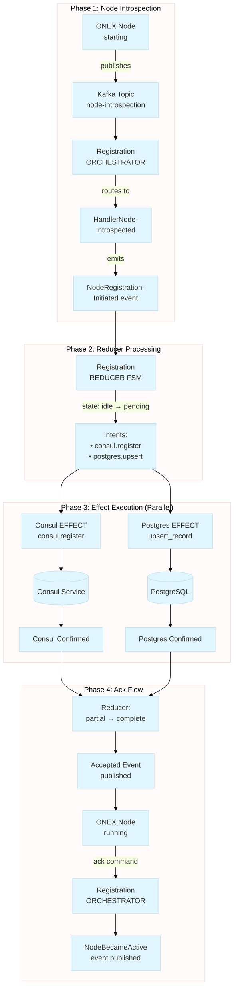
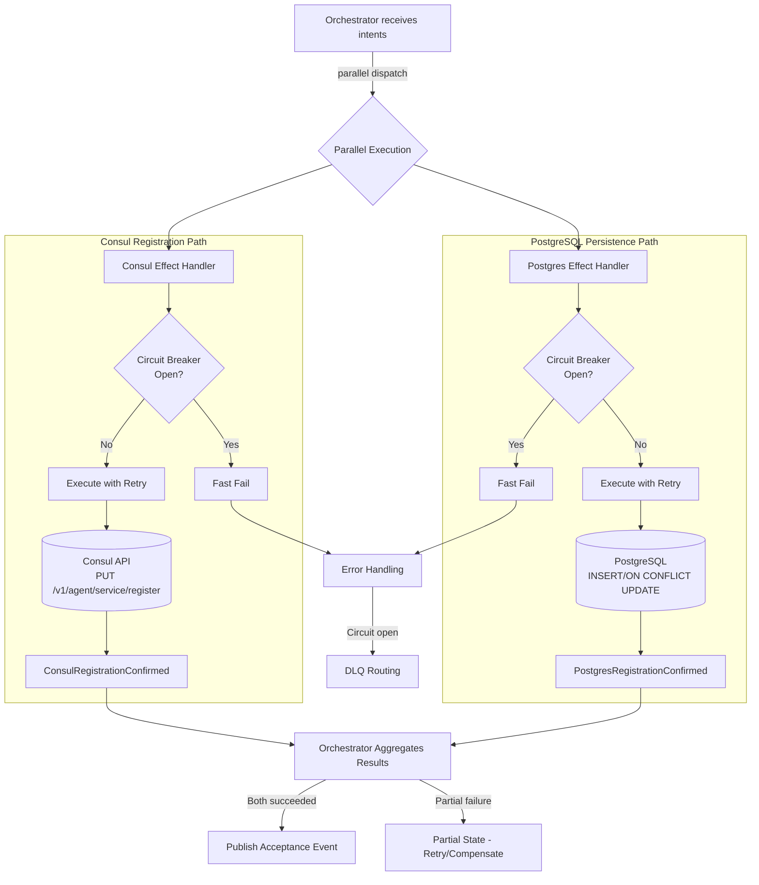
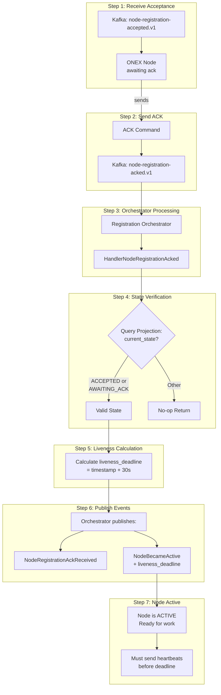
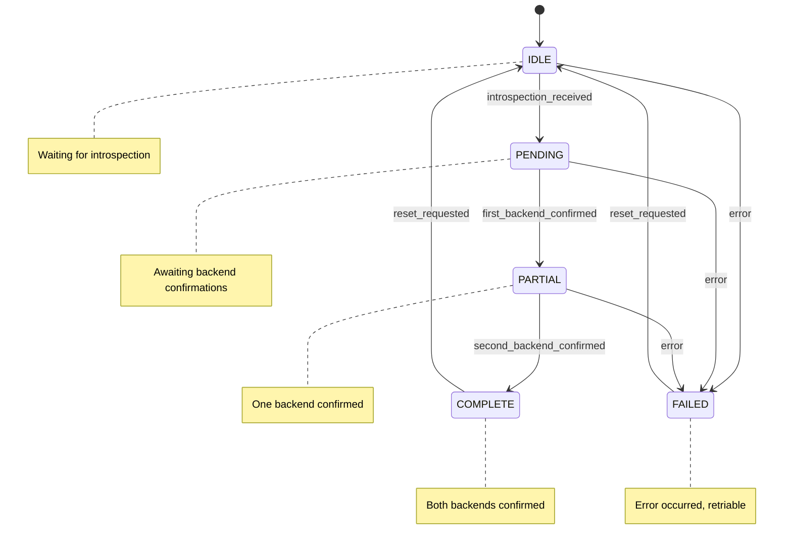
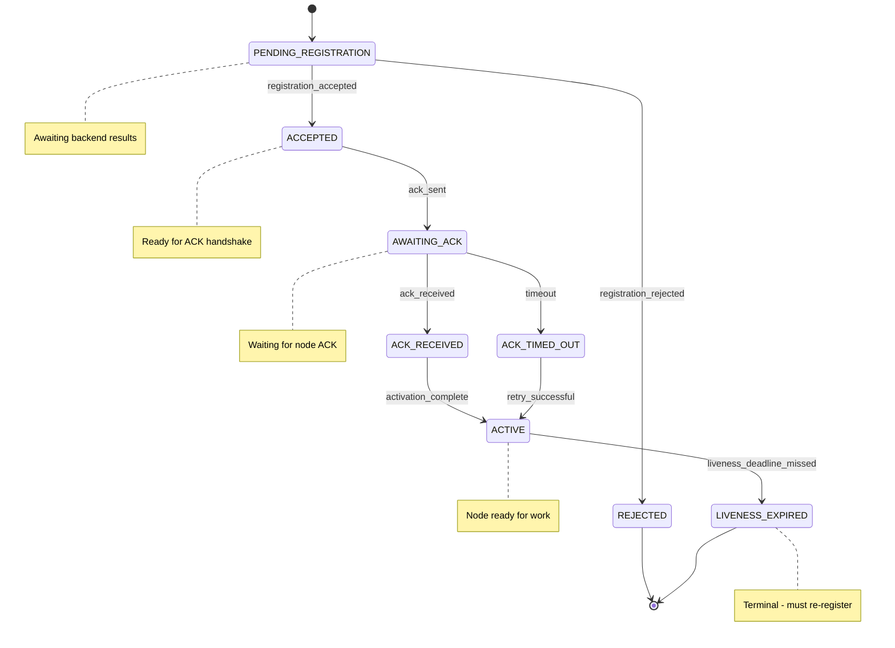

> **Navigation**: [Home](../index.md) > Guides > 2-Way Registration

# 2-Way Registration: A Complete ONEX Example

This guide walks through the **2-way node registration flow** - a real-world example of ONEX contract-driven architecture. Understanding this flow demonstrates how all four node archetypes work together.

## What is 2-Way Registration?

When an ONEX node starts up, it must:

1. **Register** with the ONEX infrastructure (tell the system "I exist")
2. **Acknowledge** the registration (confirm "I'm ready to work")

This two-phase handshake ensures nodes are properly tracked and healthy before receiving work.

The "2-way" refers to **dual-backend registration** - nodes register simultaneously with:
- **Consul** - For service discovery (other nodes can find me)
- **PostgreSQL** - For persistence (my registration survives restarts)

## Architecture Overview

### ASCII Diagram

The following diagram shows the complete 2-way registration flow through all four phases:

```
┌─────────────────────────────────────────────────────────────────────────────┐
│                      2-WAY REGISTRATION FLOW                                 │
├─────────────────────────────────────────────────────────────────────────────┤
│                                                                              │
│  PHASE 1: NODE INTROSPECTION                                                 │
│  ───────────────────────────                                                 │
│                                                                              │
│  ┌──────────────┐    publishes    ┌─────────────────────┐                   │
│  │  ONEX Node   │ ──────────────► │  Kafka Topic        │                   │
│  │  (starting)  │                 │  node-introspection │                   │
│  └──────────────┘                 └─────────────────────┘                   │
│                                            │                                 │
│                                            ▼                                 │
│                                   ┌─────────────────────┐                   │
│                                   │ Registration        │                   │
│                                   │ ORCHESTRATOR        │                   │
│                                   └─────────────────────┘                   │
│                                            │                                 │
│                                            │ routes to handler              │
│                                            ▼                                 │
│                                   ┌─────────────────────┐                   │
│                                   │ HandlerNode-        │                   │
│                                   │ Introspected        │                   │
│                                   └─────────────────────┘                   │
│                                            │                                 │
│                                            │ emits                           │
│                                            ▼                                 │
│                                   ┌─────────────────────┐                   │
│                                   │ NodeRegistration-   │                   │
│                                   │ Initiated (event)   │                   │
│                                   └─────────────────────┘                   │
│                                                                              │
│  PHASE 2: REDUCER PROCESSING                                                 │
│  ──────────────────────────────                                              │
│                                                                              │
│  ┌─────────────────────┐                                                    │
│  │ Registration        │  reduce(state, event) → (new_state, intents)       │
│  │ REDUCER (FSM)       │                                                    │
│  └─────────────────────┘                                                    │
│          │                                                                   │
│          │ state: idle → pending                                            │
│          │ emits intents                                                    │
│          ▼                                                                   │
│  ┌───────────────────────────────────────────────────────┐                  │
│  │ Intents:                                              │                  │
│  │  • consul.register → Consul Effect                    │                  │
│  │  • postgres.upsert_registration → Postgres Effect     │                  │
│  └───────────────────────────────────────────────────────┘                  │
│                                                                              │
│  PHASE 3: EFFECT EXECUTION (PARALLEL)                                        │
│  ────────────────────────────────────                                        │
│                                                                              │
│  ┌─────────────────────┐         ┌─────────────────────┐                   │
│  │ Consul EFFECT       │         │ Postgres EFFECT     │                   │
│  │                     │         │                     │                   │
│  │ consul.register()   │         │ upsert_record()     │                   │
│  └─────────────────────┘         └─────────────────────┘                   │
│          │                               │                                   │
│          ▼                               ▼                                   │
│  ┌─────────────────────┐         ┌─────────────────────┐                   │
│  │ Consul Service      │         │ PostgreSQL          │                   │
│  │ (external)          │         │ (external)          │                   │
│  └─────────────────────┘         └─────────────────────┘                   │
│                                                                              │
│  PHASE 4: ACK FLOW (2-WAY HANDSHAKE)                                         │
│  ───────────────────────────────────                                         │
│                                                                              │
│  ┌──────────────┐    ack command   ┌─────────────────────┐                  │
│  │  ONEX Node   │ ───────────────► │ Registration        │                  │
│  │  (running)   │                  │ ORCHESTRATOR        │                  │
│  └──────────────┘                  └─────────────────────┘                  │
│                                            │                                 │
│                                            ▼                                 │
│                                   ┌─────────────────────┐                   │
│                                   │ NodeBecameActive    │                   │
│                                   │ (event published)   │                   │
│                                   └─────────────────────┘                   │
│                                                                              │
└─────────────────────────────────────────────────────────────────────────────┘
```

### Mermaid Diagram



## Key Files

| Layer | File | Purpose |
|-------|------|---------|
| **Orchestrator** | `nodes/node_registration_orchestrator/contract.yaml` | Workflow definition, handler routing |
| **Orchestrator** | `nodes/node_registration_orchestrator/node.py` | Declarative orchestrator class |
| **Orchestrator** | `nodes/node_registration_orchestrator/handlers/handler_node_introspected.py` | Processes introspection events |
| **Reducer** | `nodes/node_registration_reducer/contract.yaml` | FSM state machine definition |
| **Reducer** | `nodes/node_registration_reducer/node.py` | Declarative reducer class |
| **Reducer** | `nodes/reducers/registration_reducer.py` | Pure reduce function |
| **Reducer** | `nodes/reducers/models/model_registration_state.py` | Immutable state model |
| **Effect** | `nodes/node_registry_effect/contract.yaml` | Dual-backend handler routing |
| **Effect** | `nodes/node_registry_effect/handlers/handler_consul_register.py` | Consul registration |
| **Effect** | `nodes/node_registry_effect/handlers/handler_postgres_upsert.py` | PostgreSQL persistence |

## Phase 1: Node Introspection

### What Happens

When any ONEX node starts up, it publishes an introspection event to Kafka:

```python
# Somewhere in node startup
event = ModelNodeIntrospectionEvent(
    node_id="abc-123",
    node_type=EnumNodeKind.EFFECT,
    capabilities=["registration.storage"],
    health_endpoint="/health",
    endpoints=["http://localhost:8080"],
)
# Publish to: dev.onex.evt.node-introspection.v1
```

### Orchestrator Receives Event

The Registration Orchestrator subscribes to introspection events:

```yaml
# contract.yaml (orchestrator)
consumed_events:
  - topic: "{env}.{namespace}.onex.evt.node-introspection.v1"
    event_type: "NodeIntrospectionEvent"
```

### Handler Routing

The orchestrator routes the event to a handler based on payload type:

```yaml
# contract.yaml (orchestrator)
handler_routing:
  routing_strategy: "payload_type_match"
  handlers:
    - event_model:
        name: "ModelNodeIntrospectionEvent"
      handler:
        name: "HandlerNodeIntrospected"
      state_decision_matrix:
        - current_state: null
          action: "emit_registration_initiated"
        - current_state: "ACTIVE"
          action: "no_op"
```

### Handler Logic

The handler (`handler_node_introspected.py`) makes decisions based on current state:

```python
async def handle(
    self,
    envelope: ModelEventEnvelope[ModelNodeIntrospectionEvent],
) -> ModelHandlerOutput[object]:
    event = envelope.payload
    correlation_id = envelope.correlation_id or uuid4()

    # Query current projection state
    projection = await self._projection_reader.get_entity_state(
        entity_id=event.node_id,
        domain="registration",
    )

    # Decision based on state
    if projection is None or projection.current_state in _RETRIABLE_STATES:
        # New or expired node - initiate registration
        initiated_event = ModelNodeRegistrationInitiated(
            entity_id=event.node_id,
            correlation_id=correlation_id,
        )
        return ModelHandlerOutput(events=(initiated_event,))

    # Already active - no-op
    return ModelHandlerOutput(events=())
```

**Key Point**: The handler returns events in `ModelHandlerOutput`. The **orchestrator** publishes them - handlers never publish directly.

## Phase 2: Reducer Processing

### FSM State Machine

The reducer's FSM is defined entirely in contract.yaml:

```yaml
# contract.yaml (reducer)
state_machine:
  state_machine_name: "registration_fsm"
  initial_state: "idle"

  states:
    - state_name: "idle"
    - state_name: "pending"
      entry_actions:
        - "emit_consul_intent"
        - "emit_postgres_intent"
    - state_name: "partial"
    - state_name: "complete"
    - state_name: "failed"

  transitions:
    - from_state: "idle"
      to_state: "pending"
      trigger: "introspection_received"
      conditions:
        - expression: "node_id is_present"
```

### Pure Reduce Function

The reducer implementation is a pure function with no side effects:

```python
# registration_reducer.py
def reduce(
    self,
    state: ModelRegistrationState,
    event: ModelNodeIntrospectionEvent,
) -> ModelReducerOutput[ModelRegistrationState]:
    # Idempotency check
    event_id = event.correlation_id or self._derive_event_id(event)
    if state.is_duplicate_event(event_id):
        return self._build_output(state=state, intents=())

    # Build intents for Effect layer
    consul_intent = self._build_consul_intent(event, event_id)
    postgres_intent = self._build_postgres_intent(event, event_id)

    # State transition: idle → pending
    new_state = state.with_pending_registration(event.node_id, event_id)

    return self._build_output(
        state=new_state,
        intents=(consul_intent, postgres_intent),
    )
```

### Immutable State

State models use `frozen=True` and `with_*` methods:

```python
# model_registration_state.py
class ModelRegistrationState(BaseModel):
    model_config = ConfigDict(frozen=True)

    status: str = "idle"
    consul_confirmed: bool = False
    postgres_confirmed: bool = False

    def with_pending_registration(self, node_id: str, event_id: UUID):
        """Return NEW instance in pending state."""
        return ModelRegistrationState(
            status="pending",
            node_id=node_id,
            last_processed_event_id=event_id,
        )
```

### Intent Emission

The reducer emits **intents** - requests for the Effect layer to execute:

```python
# Building a Consul intent
consul_intent = ModelIntent(
    intent_type="extension",
    target="consul://service/onex-effect-abc123",
    payload=ModelPayloadConsulRegister(
        intent_type="consul.register",  # Routing key in payload
        correlation_id=correlation_id,
        service_id="onex-effect-abc123",
        service_name="onex-effect",
        tags=["node_type:effect"],
    ),
)
```

**Two-Layer Intent Structure**:
- Outer `ModelIntent.intent_type = "extension"` (standard envelope)
- Inner `payload.intent_type = "consul.register"` (routing key)

## Phase 3: Effect Execution

Phase 3 is where the actual work happens - EFFECT nodes interact with external systems to persist the registration. This phase demonstrates ONEX's parallel execution capabilities and resilience patterns.

### What Happens During Effect Execution

1. **Intent Routing**: The orchestrator receives intents from the reducer and routes them to appropriate effect nodes
2. **Parallel Dispatch**: Both Consul and PostgreSQL effects execute simultaneously (not sequentially)
3. **External I/O**: Each effect handler performs actual I/O operations against external services
4. **Confirmation Events**: Each handler returns confirmation events upon success
5. **Error Handling**: Failures trigger retry logic, circuit breakers, and potentially DLQ routing

### ASCII Diagram: Effect Execution Detail

```
┌─────────────────────────────────────────────────────────────────────────────┐
│                    PHASE 3: EFFECT EXECUTION (DETAILED)                      │
├─────────────────────────────────────────────────────────────────────────────┤
│                                                                              │
│  ORCHESTRATOR receives intents from reducer:                                 │
│  ┌─────────────────────────────────────────────────────────────────────┐    │
│  │ intents = (consul_intent, postgres_intent)                           │    │
│  └─────────────────────────────────────────────────────────────────────┘    │
│                              │                                               │
│                              │ parallel dispatch                             │
│           ┌──────────────────┴──────────────────┐                           │
│           ▼                                      ▼                           │
│  ┌──────────────────────┐            ┌──────────────────────┐               │
│  │   CONSUL EFFECT      │            │  POSTGRES EFFECT     │               │
│  │   (node_registry_    │            │  (node_registry_     │               │
│  │    effect)           │            │   effect)            │               │
│  └──────────────────────┘            └──────────────────────┘               │
│           │                                      │                           │
│           │ intent_type=                         │ intent_type=              │
│           │ "consul.register"                    │ "postgres.upsert"         │
│           ▼                                      ▼                           │
│  ┌──────────────────────┐            ┌──────────────────────┐               │
│  │ HandlerConsulRegister│            │ HandlerPostgresUpsert│               │
│  │                      │            │                      │               │
│  │ • Check circuit      │            │ • Check circuit      │               │
│  │   breaker state      │            │   breaker state      │               │
│  │ • Execute with       │            │ • Execute with       │               │
│  │   retry logic        │            │   retry logic        │               │
│  │ • Track correlation  │            │ • Track correlation  │               │
│  └──────────────────────┘            └──────────────────────┘               │
│           │                                      │                           │
│           │                                      │                           │
│           ▼                                      ▼                           │
│  ┌──────────────────────┐            ┌──────────────────────┐               │
│  │    CONSUL API        │            │    POSTGRESQL        │               │
│  │    (external)        │            │    (external)        │               │
│  │                      │            │                      │               │
│  │ PUT /v1/agent/       │            │ INSERT INTO          │               │
│  │   service/register   │            │   node_registrations │               │
│  └──────────────────────┘            └──────────────────────┘               │
│           │                                      │                           │
│           │ success                              │ success                   │
│           ▼                                      ▼                           │
│  ┌──────────────────────┐            ┌──────────────────────┐               │
│  │ ModelConsulRegistra- │            │ ModelPostgresRegis-  │               │
│  │ tionConfirmed        │            │ trationConfirmed     │               │
│  │ (event)              │            │ (event)              │               │
│  └──────────────────────┘            └──────────────────────┘               │
│           │                                      │                           │
│           └──────────────────┬───────────────────┘                           │
│                              │                                               │
│                              ▼                                               │
│  ┌─────────────────────────────────────────────────────────────────────┐    │
│  │ ORCHESTRATOR aggregates results:                                     │    │
│  │ • Both succeeded → publish acceptance event                          │    │
│  │ • One failed → partial state (retry or compensate)                   │    │
│  │ • Both failed → failure state (DLQ routing)                          │    │
│  └─────────────────────────────────────────────────────────────────────┘    │
│                                                                              │
└─────────────────────────────────────────────────────────────────────────────┘
```

### Mermaid Diagram: Effect Execution



### Parallel Execution Configuration

The orchestrator routes intents to effects in parallel:

```yaml
# contract.yaml (effect node)
handler_routing:
  execution_mode: "parallel"
  partial_failure_handling: true
  handlers:
    - operation: "register_node"
      handler: { name: "HandlerConsulRegister" }
      backend: "consul"
    - operation: "register_node"
      handler: { name: "HandlerPostgresUpsert" }
      backend: "postgres"
```

### Consul Effect Handler

The Consul handler registers the node as a service with service discovery:

```python
# handler_consul_register.py
async def handle(self, intent: ModelIntent) -> ModelHandlerOutput:
    payload = intent.payload  # ModelPayloadConsulRegister

    # Execute Consul registration
    await self._consul_client.register_service(
        service_id=payload.service_id,
        service_name=payload.service_name,
        tags=payload.tags,
    )

    return ModelHandlerOutput(
        events=(
            ModelConsulRegistrationConfirmed(
                service_id=payload.service_id,
                correlation_id=payload.correlation_id,
            ),
        ),
    )
```

### PostgreSQL Effect Handler

The PostgreSQL handler persists the registration record with upsert semantics:

```python
# handler_postgres_upsert.py
async def handle(self, intent: ModelIntent) -> ModelHandlerOutput:
    payload = intent.payload  # ModelPayloadPostgresUpsertRegistration

    # Execute PostgreSQL upsert
    await self._db.execute(
        """
        INSERT INTO node_registrations (node_id, node_type, endpoints)
        VALUES ($1, $2, $3)
        ON CONFLICT (node_id) DO UPDATE SET
            node_type = EXCLUDED.node_type,
            endpoints = EXCLUDED.endpoints,
            updated_at = NOW()
        """,
        payload.node_id,
        payload.node_type,
        payload.endpoints,
    )

    return ModelHandlerOutput(
        events=(
            ModelPostgresRegistrationConfirmed(
                node_id=payload.node_id,
                correlation_id=payload.correlation_id,
            ),
        ),
    )
```

### Resilience Patterns in Effect Execution

Effect handlers implement several resilience patterns:

| Pattern | Purpose | Implementation |
|---------|---------|----------------|
| **Circuit Breaker** | Prevent cascading failures when external service is down | `MixinAsyncCircuitBreaker` with configurable threshold |
| **Retry with Backoff** | Handle transient failures | Exponential backoff (2^n seconds) with max 3 retries |
| **Correlation Tracking** | Trace requests across services | `correlation_id` propagated through all operations |
| **Partial Failure Handling** | Continue when one backend fails | Aggregate results, track partial state |
| **DLQ Routing** | Handle persistent failures | Route failed intents to dead letter queue |

### Error Scenarios

| Scenario | Consul | PostgreSQL | Result State | Next Action |
|----------|--------|------------|--------------|-------------|
| Both succeed | OK | OK | `complete` | Publish acceptance event |
| Consul fails | FAIL | OK | `partial` | Retry Consul or compensate |
| PostgreSQL fails | OK | FAIL | `partial` | Retry PostgreSQL or compensate |
| Both fail | FAIL | FAIL | `failed` | Route to DLQ, alert operators |
| Circuit open | SKIP | SKIP | `pending` | Wait for circuit reset |

### Capability Naming in Effect Nodes

Effect nodes are named by **capability** (what they do), not by **technology** (how they do it). This enables backend swaps without contract changes.

**Good Capability Names** (used in this example):

| Capability | Purpose | Why Good |
|------------|---------|----------|
| `consul.register` | Register service for discovery | Domain-scoped action |
| `postgres.upsert_registration` | Persist registration record | Action-oriented with context |
| `registration.storage` | Storage operations for registrations | Hierarchical, technology-agnostic |

**Bad Capability Names** (avoid these):

| Bad Name | Problem | Better Alternative |
|----------|---------|-------------------|
| `doStuff` | Meaningless, non-descriptive | `node.registration.create` |
| `handler1` | Numbered handlers indicate poor design | `node.introspection.query` |
| `process` | Too generic, no domain context | `registration.storage.upsert` |
| `run` | Ambiguous without operation type | `workflow.state.checkpoint` |

**Pattern**: `{domain}.{subdomain}.{action}` - e.g., `service.discovery.register`

For the complete capability naming convention, see [Contract.yaml Reference - Capability Naming](../reference/contracts.md#capability-naming-convention).

## Phase 4: ACK Flow

Phase 4 completes the 2-way handshake. The registering node acknowledges that it received the acceptance, confirming it's ready to receive work. This phase also establishes liveness tracking to ensure nodes remain healthy.

### What Happens During ACK Flow

1. **Acceptance Event Received**: The registering node receives the acceptance event from Phase 3
2. **ACK Command Sent**: The node sends an acknowledgment command back to the orchestrator
3. **State Verification**: The handler verifies the node is in a valid state for ACK
4. **Liveness Deadline Calculation**: A deadline is set for the node's first heartbeat
5. **Activation Events Published**: The orchestrator publishes `NodeBecameActive` event
6. **Node is ACTIVE**: The node can now receive and process work

### ASCII Diagram: ACK Flow Detail

```
┌─────────────────────────────────────────────────────────────────────────────┐
│                      PHASE 4: ACK FLOW (DETAILED)                            │
├─────────────────────────────────────────────────────────────────────────────┤
│                                                                              │
│  STEP 1: Node receives acceptance event                                      │
│  ┌──────────────────────┐         ┌─────────────────────────────────┐       │
│  │   ONEX Node          │ ◄────── │ Kafka: node-registration-       │       │
│  │   (awaiting ack)     │         │        accepted.v1              │       │
│  └──────────────────────┘         └─────────────────────────────────┘       │
│                                                                              │
│  STEP 2: Node sends ACK command                                              │
│  ┌──────────────────────┐         ┌─────────────────────────────────┐       │
│  │   ONEX Node          │ ──────► │ Kafka: node-registration-       │       │
│  │   (sending ack)      │         │        acked.v1                 │       │
│  └──────────────────────┘         └─────────────────────────────────┘       │
│           │                                       │                          │
│           │                                       ▼                          │
│           │                        ┌─────────────────────────────────┐       │
│           │                        │ Registration ORCHESTRATOR       │       │
│           │                        │ • Consumes ACK command          │       │
│           │                        │ • Routes to handler             │       │
│           │                        └─────────────────────────────────┘       │
│           │                                       │                          │
│           │                                       ▼                          │
│  STEP 3: State verification                                                  │
│  ┌─────────────────────────────────────────────────────────────────────┐    │
│  │  HandlerNodeRegistrationAcked                                        │    │
│  │  ┌─────────────────────────────────────────────────────────────┐    │    │
│  │  │ Query projection: entity_id=node_id                          │    │    │
│  │  │   ┌───────────────────────────────────────────┐              │    │    │
│  │  │   │ current_state in ("ACCEPTED", "AWAITING_ACK")?           │    │    │
│  │  │   │   YES → Continue to Step 4                               │    │    │
│  │  │   │   NO  → Return empty (no-op)                             │    │    │
│  │  │   └───────────────────────────────────────────┘              │    │    │
│  │  └─────────────────────────────────────────────────────────────┘    │    │
│  └─────────────────────────────────────────────────────────────────────┘    │
│                                       │                                      │
│                                       ▼                                      │
│  STEP 4: Calculate liveness deadline                                         │
│  ┌─────────────────────────────────────────────────────────────────────┐    │
│  │  liveness_deadline = envelope_timestamp + LIVENESS_WINDOW (30s)      │    │
│  │  • Node must send heartbeat before deadline                          │    │
│  │  • Missed deadline → LIVENESS_EXPIRED state                          │    │
│  └─────────────────────────────────────────────────────────────────────┘    │
│                                       │                                      │
│                                       ▼                                      │
│  STEP 5: Publish activation events                                           │
│  ┌─────────────────────────────────────────────────────────────────────┐    │
│  │  ORCHESTRATOR publishes:                                             │    │
│  │  ┌─────────────────────────┐  ┌────────────────────────────┐        │    │
│  │  │ ModelNodeRegistration-  │  │ ModelNodeBecameActive      │        │    │
│  │  │ AckReceived             │  │ • node_id                  │        │    │
│  │  │ • Confirms ACK received │  │ • liveness_deadline        │        │    │
│  │  └─────────────────────────┘  │ • activated_at             │        │    │
│  │                               └────────────────────────────┘        │    │
│  └─────────────────────────────────────────────────────────────────────┘    │
│                                       │                                      │
│                                       ▼                                      │
│  STEP 6: Node is ACTIVE                                                      │
│  ┌─────────────────────────────────────────────────────────────────────┐    │
│  │  ┌───────────────────────────────────────────────────────────┐      │    │
│  │  │   ONEX Node (ACTIVE)                                      │      │    │
│  │  │   • Can receive work                                      │      │    │
│  │  │   • Must send heartbeats every HEARTBEAT_INTERVAL         │      │    │
│  │  │   • Visible in service discovery (Consul)                 │      │    │
│  │  │   • Persisted in database (PostgreSQL)                    │      │    │
│  │  └───────────────────────────────────────────────────────────┘      │    │
│  └─────────────────────────────────────────────────────────────────────┘    │
│                                                                              │
└─────────────────────────────────────────────────────────────────────────────┘
```

### Mermaid Diagram: ACK Flow



### Node Sends Acknowledgment

Once the node receives its registration acceptance, it sends an ACK command:

```python
# Node sends ACK
ack_command = ModelNodeRegistrationAcked(
    node_id="abc-123",
    correlation_id=original_correlation_id,
)
# Publish to: dev.onex.cmd.node-registration-acked.v1
```

### Handler Processes ACK

```yaml
# contract.yaml (orchestrator)
handler_routing:
  handlers:
    - event_model: { name: "ModelNodeRegistrationAcked" }
      handler: { name: "HandlerNodeRegistrationAcked" }
      output_events:
        - "ModelNodeRegistrationAckReceived"
        - "ModelNodeBecameActive"
```

The handler verifies state and emits activation events:

```python
# handler_node_registration_acked.py
async def handle(self, envelope: ModelEventEnvelope) -> ModelHandlerOutput:
    # Verify current state allows ACK
    projection = await self._projection_reader.get_entity_state(
        entity_id=envelope.payload.node_id,
    )

    if projection.current_state not in ("ACCEPTED", "AWAITING_ACK"):
        return ModelHandlerOutput(events=())  # Invalid state - no-op

    # Calculate liveness deadline
    liveness_deadline = envelope.envelope_timestamp + timedelta(seconds=30)

    # Return activation events
    return ModelHandlerOutput(
        events=(
            ModelNodeRegistrationAckReceived(...),
            ModelNodeBecameActive(
                node_id=envelope.payload.node_id,
                liveness_deadline=liveness_deadline,
            ),
        ),
    )
```

### ACK Timeout Handling

If the node fails to send an ACK within the expected window, the system handles it gracefully:

| Scenario | Timeout | Next Action |
|----------|---------|-------------|
| ACK received on time | N/A | Node becomes ACTIVE |
| ACK not received within 30s | ACK_TIMED_OUT | Retry ACK request or re-register |
| Multiple ACK timeouts | After 3 retries | Mark as FAILED, alert operators |

### Liveness Tracking After ACK

Once a node is ACTIVE, it must maintain liveness through heartbeats:

```
┌─────────────────────────────────────────────────────────────────┐
│                    LIVENESS TRACKING                             │
├─────────────────────────────────────────────────────────────────┤
│                                                                  │
│  Timeline (starting from ACK):                                   │
│                                                                  │
│  T+0s         T+10s        T+20s        T+30s        T+40s      │
│    │            │            │            │            │         │
│    ▼            ▼            ▼            ▼            ▼         │
│  ┌───┐       ┌───┐       ┌───┐       ┌───┐       ┌───┐         │
│  │ACK│       │ HB│       │ HB│       │ HB│       │ HB│         │
│  └───┘       └───┘       └───┘       └───┘       └───┘         │
│    │                                   │                         │
│    │                                   │ liveness_deadline       │
│    │                                   │                         │
│    │◄──────────────────────────────────┤                         │
│            30 second window                                      │
│                                                                  │
│  If no heartbeat by T+30s → LIVENESS_EXPIRED (terminal state)    │
│                                                                  │
└─────────────────────────────────────────────────────────────────┘
```

### Error Handling in ACK Flow

| Error Condition | Handler Response | System Recovery |
|-----------------|------------------|-----------------|
| Invalid state for ACK | Return empty `ModelHandlerOutput` | No state change, log warning |
| Projection query fails | Raise error, retry | Automatic retry with backoff |
| ACK duplicate | Idempotent no-op | Return existing active state |
| ACK after liveness expired | Reject ACK | Node must re-register |

## FSM State Diagram

The registration flow involves two cooperating finite state machines:

### Registration FSM (Reducer)

Manages the backend registration state tracking whether Consul and PostgreSQL have confirmed.

#### ASCII Version

```
                    REGISTRATION FSM
═══════════════════════════════════════════════════════

                     RETRIABLE STATES
          ┌────────────────────────────────────┐
          │                                    │
          ▼                                    │
  ┌───────┐  introspection  ┌─────────┐       │
  │ IDLE  │ ──────────────► │ PENDING │       │
  └───────┘                 └─────────┘       │
      ▲                          │            │
      │                          │            │
      │                    first │            │
      │                 backend  │            │
      │                          ▼            │
      │                    ┌─────────┐        │
      │                    │ PARTIAL │        │
      │                    └─────────┘        │
      │                          │            │
      │                   second │            │
      │                 backend  │            │
      │                          ▼            │
      │    reset          ┌──────────┐        │
      └───────────────────│ COMPLETE │        │
      │                   └──────────┘        │
      │                                       │
      │                    ┌────────┐         │
      └────────────────────│ FAILED │─────────┘
                           └────────┘
                          error from *
```

#### Mermaid Version



### Orchestrator FSM

Manages the overall registration workflow state including the ACK handshake.

#### ASCII Version

```
                    ORCHESTRATOR FSM
═══════════════════════════════════════════════════════

  ┌──────────────┐  accepted  ┌──────────┐
  │ PENDING_     │ ─────────► │ ACCEPTED │
  │ REGISTRATION │            └──────────┘
  └──────────────┘                 │
         │                         │ ack sent
         │ rejected                ▼
         ▼                   ┌──────────────┐
    ┌──────────┐             │ AWAITING_ACK │
    │ REJECTED │             └──────────────┘
    │(terminal)│                   │
    └──────────┘         ack recv  │  timeout
                                   ▼      ▼
                            ┌────────────┐ ┌────────────┐
                            │ACK_RECEIVED│ │ACK_TIMED_  │
                            └────────────┘ │OUT         │
                                   │       └────────────┘
                             active│            │
                                   ▼            │ retry
                              ┌────────┐        │
                              │ ACTIVE │◄───────┘
                              └────────┘
                                   │
                          liveness │
                          expired  ▼
                            ┌─────────────┐
                            │ LIVENESS_   │
                            │ EXPIRED     │
                            │ (terminal)  │
                            └─────────────┘
```

#### Mermaid Version



## Event Timeline

```
TIME    EVENT/ACTION                           KAFKA TOPIC
────────────────────────────────────────────────────────────────────
T+0     Node starts, publishes introspection   node-introspection.v1
T+1     Orchestrator receives event            (consumed)
T+2     Handler queries projection             (internal)
T+3     Handler returns initiated event        (internal)
T+4     Orchestrator publishes initiated       node-registration-initiated.v1
T+5     Reducer receives initiated event       (consumed)
T+6     Reducer transitions: idle → pending    (state change)
T+7     Reducer emits intents                  (internal)
T+8     Effect executes Consul registration    (external I/O) ─┐
T+8     Effect executes Postgres upsert        (external I/O) ─┴─ parallel
T+9     Effects return confirmation events     (internal)
T+10    Reducer receives confirmations         (consumed)
T+11    Reducer transitions: pending → complete (state change)
T+12    Orchestrator publishes accepted        node-registration-accepted.v1
T+13    Node receives accepted event           (consumed by node)
T+14    Node publishes ACK command             node-registration-acked.v1
T+15    Orchestrator receives ACK              (consumed)
T+16    Handler processes ACK                  (internal)
T+17    Orchestrator publishes active          node-became-active.v1
T+18    Node is now ACTIVE                     (ready for work)
```

## Key Design Patterns Demonstrated

### 1. Contract-Driven Architecture

All behavior is declared in YAML contracts:
- FSM transitions in reducer contract
- Handler routing in orchestrator contract
- Parallel execution in effect contract

### 2. Declarative Nodes

Node classes contain zero logic:
```python
class NodeRegistrationOrchestrator(NodeOrchestrator):
    def __init__(self, container: ModelONEXContainer) -> None:
        super().__init__(container)  # That's it!
```

### 3. Pure Reducers

Reducers are pure functions with no side effects:
```python
reduce(state, event) → (new_state, intents)
```

### 4. Intent-Based Effects

Reducers don't call effects directly - they emit intents that the orchestrator routes:
```python
intents = (consul_intent, postgres_intent)  # Reducer returns
# Orchestrator routes to: node_registry_effect
```

### 5. Handler Isolation

Handlers cannot publish events - only return them:
```python
return ModelHandlerOutput(events=(event1, event2))
# Orchestrator does the actual publishing
```

### 6. Parallel Execution

Effects execute in parallel with partial failure handling:
```yaml
execution_mode: "parallel"
partial_failure_handling: true
```

### 7. Immutable State

State transitions create new instances:
```python
new_state = state.with_consul_confirmed(event_id)  # Returns NEW instance
```

### 8. Idempotency

Duplicate events are detected and skipped:
```python
if state.is_duplicate_event(event_id):
    return self._build_output(state=state, intents=())  # No-op
```

## Summary

The 2-way registration flow demonstrates ONEX's key principles:

| Principle | Implementation |
|-----------|----------------|
| Contract-driven | All routing, FSM, workflows in YAML |
| Declarative nodes | Node classes extend base, no custom logic |
| Separation of concerns | Each archetype has one job |
| Pure reducers | No side effects in state management |
| Intent-based I/O | Effects execute what reducers request |
| Parallel execution | Backends registered simultaneously |
| Handler isolation | No direct event bus access |

## Related Documentation

| Topic | Document |
|-------|----------|
| Quick start | [Quick Start Guide](../getting-started/quickstart.md) |
| Node archetypes | [Node Archetypes Reference](../reference/node-archetypes.md) |
| Contract format | [Contract.yaml Reference](../reference/contracts.md) |
| Capability naming | [Capability Naming Convention](../reference/contracts.md#capability-naming-convention) |
| Architecture | [Architecture Overview](../architecture/overview.md) |
| All patterns | [Pattern Documentation](../patterns/README.md) |
