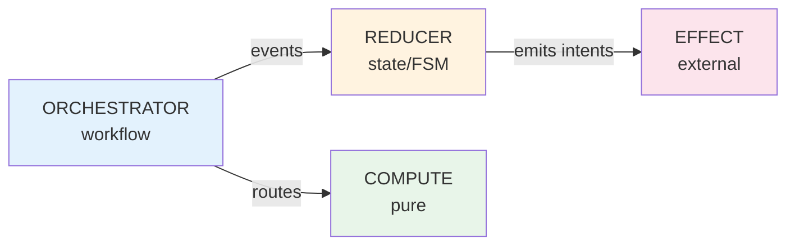

> **Navigation**: Home (You are here)

# ONEX Infrastructure Documentation

Welcome to the ONEX Infrastructure (`omnibase_infra`) documentation.

## Documentation Authority Model

| Source | Purpose | Authority |
|--------|---------|-----------|
| **[CLAUDE.md](../CLAUDE.md)** | Coding standards, rules, conventions | **Authoritative** - definitive rules for agents and developers |
| **docs/** | Explanations, examples, tutorials, runbooks | Supplementary - context and how-to guidance |

**When in conflict, CLAUDE.md takes precedence.** This separation ensures:
- Rules are concise and enforceable in CLAUDE.md
- Documentation provides depth without bloating the rules file
- Agents and developers have a single source of truth for coding standards

**Quick Reference:**
- Need a rule? Check [CLAUDE.md](../CLAUDE.md)
- Need an explanation? Check [docs/](.)
- Need an example? Check [docs/patterns/](patterns/README.md) or [docs/guides/](guides/registration-example.md)

---

## How to Use These Docs

**New here?** Start with the [Quick Start Guide](getting-started/quickstart.md). It gets you running in 5 minutes.

**Building something?** The docs are organized by intent:
- **Getting Started** - Installation, first steps
- **Architecture** - How ONEX works (read when you need context)
- **Reference** - Look up syntax, fields, types (use as needed)
- **Guides** - Step-by-step examples (follow along)
- **Patterns** - Battle-tested solutions (copy-paste encouraged)
- **Decisions** - Why things work this way (read when confused)

**Found a gap?** File an issue. These docs grow from real usage, not speculation.

---

## Quick Navigation

| I want to... | Go to... |
|--------------|----------|
| Get started quickly | [Quick Start Guide](getting-started/quickstart.md) |
| Understand the architecture | [Architecture Overview](architecture/overview.md) |
| Learn about node types | [Node Archetypes Reference](reference/node-archetypes.md) |
| See a complete example | [2-Way Registration Walkthrough](guides/registration-example.md) |
| Write a contract | [Contract.yaml Reference](reference/contracts.md) |
| Find implementation patterns | [Pattern Documentation](patterns/README.md) |

---

## Documentation Structure

### Getting Started

New to ONEX? Start here.

| Document | Description |
|----------|-------------|
| [Quick Start](getting-started/quickstart.md) | Get running in 5 minutes |
| [README](../README.md) | Project overview and setup |
| [CONTRIBUTING](../CONTRIBUTING.md) | How to contribute |

### Architecture

Understand how ONEX works.

| Document | Description |
|----------|-------------|
| [Architecture Overview](architecture/overview.md) | High-level architecture with diagrams |
| [Current Node Architecture](architecture/CURRENT_NODE_ARCHITECTURE.md) | Detailed node architecture |
| [Event Bus Integration](architecture/EVENT_BUS_INTEGRATION_GUIDE.md) | Kafka event streaming |
| [Handler Protocol Architecture](architecture/HANDLER_PROTOCOL_DRIVEN_ARCHITECTURE.md) | Handler system design |
| [Message Dispatch Engine](architecture/MESSAGE_DISPATCH_ENGINE.md) | Event routing internals |

### Reference

Comprehensive reference documentation.

| Document | Description |
|----------|-------------|
| [Node Archetypes](reference/node-archetypes.md) | EFFECT, COMPUTE, REDUCER, ORCHESTRATOR |
| [Contract.yaml Reference](reference/contracts.md) | Complete contract format |
| [CLAUDE.md](../CLAUDE.md) | Coding standards and rules |

### Guides

Step-by-step tutorials and examples.

| Document | Description |
|----------|-------------|
| [2-Way Registration](guides/registration-example.md) | Complete ONEX example walkthrough |

### Patterns

Implementation patterns and best practices.

| Document | Description |
|----------|-------------|
| [Pattern Index](patterns/README.md) | All patterns overview |
| [Container DI](patterns/container_dependency_injection.md) | Dependency injection patterns |
| [Error Handling](patterns/error_handling_patterns.md) | Error hierarchy and usage |
| [Error Recovery](patterns/error_recovery_patterns.md) | Backoff, circuit breakers |
| [Circuit Breaker](patterns/circuit_breaker_implementation.md) | Circuit breaker details |
| [Handler Plugin Loader](patterns/handler_plugin_loader.md) | Plugin-based handler loading |
| [Protocol Patterns](patterns/protocol_patterns.md) | Protocol design patterns |
| [Security Patterns](patterns/security_patterns.md) | Security implementation |
| [Testing Patterns](patterns/testing_patterns.md) | Testing best practices |

### Decisions (ADRs)

Architecture Decision Records explaining why things work the way they do. [Full index](decisions/README.md) (17 ADRs).

| Document | Description |
|----------|-------------|
| [ADR Index](decisions/README.md) | All 17 ADRs with categories |
| [Any Type Workaround](decisions/adr-any-type-pydantic-workaround.md) | When Any is allowed |
| [Custom Bool Results](decisions/adr-custom-bool-result-models.md) | Why result models override `__bool__` |
| [Error Context Factory](decisions/adr-error-context-factory-pattern.md) | Error context creation |
| [Handler Plugin Security](decisions/adr-handler-plugin-loader-security.md) | Plugin security model |
| [Protocol Design](decisions/adr-protocol-design-guidelines.md) | Protocol design guidelines |
| [Enum Separation](decisions/adr-enum-message-category-vs-node-output-type.md) | Message vs output enums |

### Operations

Runbooks for operating ONEX in production.

| Document | Description |
|----------|-------------|
| [Operations Index](operations/README.md) | All runbooks |
| [Database Index Monitoring](operations/DATABASE_INDEX_MONITORING_RUNBOOK.md) | DB performance |
| [DLQ Replay](operations/DLQ_REPLAY_RUNBOOK.md) | Dead letter queue handling |
| [Event Bus Operations](operations/EVENT_BUS_OPERATIONS_RUNBOOK.md) | Kafka operations |
| [Thread Pool Tuning](operations/THREAD_POOL_TUNING_RUNBOOK.md) | Performance tuning |

### Validation

Validation framework documentation.

| Document | Description |
|----------|-------------|
| [Validation Index](validation/README.md) | Validator overview |
| [Validator Reference](validation/validator_reference.md) | All validators |
| [Troubleshooting](validation/troubleshooting.md) | Fixing validation errors |

### Project Planning

Development planning and milestones.

| Document | Description |
|----------|-------------|
| [MVP v0.1.0](milestones/MVP_v0.1.0_CORE.md) | Core milestone plan |
| [Beta v0.2.0](milestones/BETA_v0.2.0_HARDENING.md) | Hardening milestone |
| [Production v0.3.0](milestones/PRODUCTION_v0.3.0.md) | Production milestone |

---

## Core Concepts

### The Four Node Archetypes

#### ASCII Diagram

**Diagram Description**: This ASCII diagram shows the four ONEX node archetypes and their interactions. ORCHESTRATOR (workflow coordinator) sends events to REDUCER (state/FSM manager) and routes work to COMPUTE (pure transformations). REDUCER emits intents that are executed by EFFECT (external I/O operations like databases and APIs).

```
┌──────────────┐    events     ┌──────────────┐
│ ORCHESTRATOR │ ────────────► │   REDUCER    │
│  (workflow)  │               │  (state/FSM) │
└──────────────┘               └──────────────┘
       │                              │
       │ routes                       │ emits intents
       ▼                              ▼
┌──────────────┐               ┌──────────────┐
│   COMPUTE    │               │    EFFECT    │
│    (pure)    │               │  (external)  │
└──────────────┘               └──────────────┘
```

#### Mermaid Diagram



| Archetype | Purpose | Side Effects |
|-----------|---------|--------------|
| **ORCHESTRATOR** | Coordinates workflows, routes events | Publishes events |
| **REDUCER** | Manages state via FSM, emits intents | None (pure) |
| **COMPUTE** | Pure transformations and validation | None (pure) |
| **EFFECT** | External I/O (databases, APIs) | Yes |

### Contract-Driven Development

All behavior is declared in YAML contracts:
- Handler routing: Which handler processes which event
- State machines: FSM transitions and actions
- Workflows: Execution graphs with dependencies
- I/O operations: External service interactions

### Key Design Rules

| Rule | Reason |
|------|--------|
| Handlers cannot publish events | Only orchestrators have bus access |
| Orchestrators have no FSM logic | Reducers own state transitions |
| No `Any` types allowed | Type safety, enforced by CI |
| Effects named by capability | "registration.storage" not "postgres" |
| Nodes are declarative | Zero custom logic in node.py |

---

## Package Structure

```
src/omnibase_infra/
├── nodes/              # ONEX nodes
│   ├── node_*/         # Each node: contract.yaml + node.py
│   ├── reducers/       # Reducer implementations
│   └── effects/        # Effect implementations
├── handlers/           # Infrastructure handlers
│   ├── handler_*.py    # Consul, DB, Vault, HTTP, etc.
│   ├── mixins/         # Handler composition
│   └── models/         # Handler-specific models
├── models/             # Shared Pydantic models
├── enums/              # Centralized enums
├── adapters/           # External service adapters
├── runtime/            # Runtime kernel and dispatchers
└── errors/             # Error classes
```

---

## Getting Help

- **Code standards**: See [CLAUDE.md](../CLAUDE.md)
- **Patterns**: See [docs/patterns/](patterns/README.md)
- **Issues**: Open an issue on GitHub

---

## Document Status

| Section | Status | Notes |
|---------|--------|-------|
| Getting Started | Complete | Quick start guide available |
| Architecture | Complete | Overview with diagrams |
| Reference | Complete | Node archetypes, contracts |
| Guides | Complete | Registration example |
| Patterns | Existing | 22 pattern documents |
| Operations | Existing | 4 runbooks |
| Decisions | Existing | 17 ADRs |
