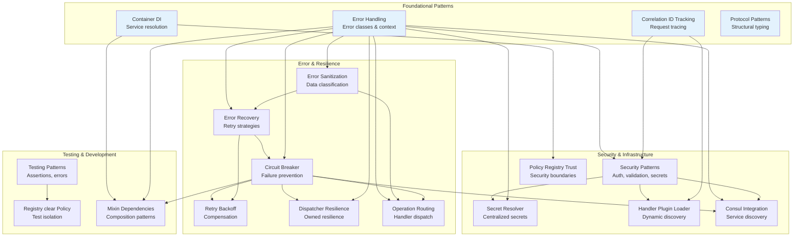

> **Navigation**: [Home](../index.md) > Patterns

# ONEX Infrastructure Patterns

This directory contains detailed implementation guides and best practices for ONEX infrastructure development.

> **Note**: For authoritative coding rules and standards, see [CLAUDE.md](../../CLAUDE.md). This documentation provides explanations, examples, and detailed implementation guides that supplement the rules defined there.

## Pattern Categories

### Error Handling & Resilience
- **[Error Handling Patterns](./error_handling_patterns.md)** - Error classification, context, and hierarchy
- **[Error Sanitization Patterns](./error_sanitization_patterns.md)** - Data classification, sanitization rules, and secure error reporting
- **[Error Recovery Patterns](./error_recovery_patterns.md)** - Exponential backoff, circuit breakers, graceful degradation, credential refresh
- **[Retry, Backoff, and Compensation Strategy](./retry_backoff_compensation_strategy.md)** - Formal retry policies, backoff formulas, compensation for partial failures
- **[Circuit Breaker Implementation](./circuit_breaker_implementation.md)** - Complete production-ready circuit breaker with state machine
- **[Dispatcher Resilience](./dispatcher_resilience.md)** - Dispatcher-owned resilience pattern for message dispatch engine
- **[Operation Routing](./operation_routing.md)** - Contract-driven operation dispatch with parallel execution and partial failure handling

### Observability
- **[Correlation ID Tracking](./correlation_id_tracking.md)** - Request tracing, envelope pattern, distributed logging
- **[Event Streaming Topics](../architecture/EVENT_STREAMING_TOPICS.md)** - Kafka/Redpanda topic catalog, schemas, and usage patterns

### Architecture
- **[Container Dependency Injection](./container_dependency_injection.md)** - Service registration, resolution, and testing patterns
- **[Protocol Patterns](./protocol_patterns.md)** - Protocol vs ABC vs concrete base, mixin composition, plugin interfaces
- **[Utility Directory Structure](./utility_directory_structure.md)** - Distinction between `utils/` and `shared/utils/` directories
- **[Registry clear() Policy](./registry_clear_policy.md)** - When and how to implement clear() methods for test isolation vs production safety
- **[Mixin Dependencies](./mixin_dependencies.md)** - Mixin composition patterns, dependency requirements, and inheritance order

### Infrastructure Integration
- **[Consul Integration](./consul_integration.md)** - HashiCorp Consul connection, health checks, service registration, security patterns

### Security
- **[Security Patterns](./security_patterns.md)** - Comprehensive security guide covering error sanitization, input validation, authentication, authorization, secret management, network security, and production checklists
- **[Secret Resolver](./secret_resolver.md)** - Centralized secret resolution with caching, multiple sources (env, file, Vault), convention fallback, and migration guide
- **[Handler Config Resolver](./binding_config_resolver.md)** - Multi-source handler configuration resolution with environment overrides, caching, and Vault integration
- **[Policy Registry Trust Model](./policy_registry_trust_model.md)** - Trust assumptions, validation boundaries, and security mitigations for policy registration
- **[Handler Plugin Loader](./handler_plugin_loader.md)** - Contract-driven handler discovery with comprehensive security documentation for dynamic imports, threat model, and deployment checklist

### Migration
- **[wire_default_handlers() Migration](../migration/MIGRATION_WIRE_DEFAULT_HANDLERS.md)** - Migration from legacy hardcoded handler wiring to contract-driven discovery

### Testing
- **[Testing Patterns](./testing_patterns.md)** - Assertion patterns, "HOW TO FIX" error messages, and test best practices

## Quick Reference

### Error Scenarios

| Scenario | Pattern Document | Key Classes |
|----------|-----------------|-------------|
| Connection failed | [Error Handling](./error_handling_patterns.md#error-class-selection) | `InfraConnectionError` |
| Service unavailable | [Circuit Breaker](./circuit_breaker_implementation.md) | `CircuitBreaker` |
| Timeout | [Error Recovery](./error_recovery_patterns.md#exponential-backoff-pattern) | `InfraTimeoutError` |
| Auth failed | [Error Recovery](./error_recovery_patterns.md#credential-refresh-pattern) | `InfraAuthenticationError` |
| Secret not found | [Error Handling](./error_handling_patterns.md#vault-secret-retrieval-error) | `SecretResolutionError` |
| Partial failure | [Retry/Compensation](./retry_backoff_compensation_strategy.md#compensation-strategy-for-partial-failures) | Saga, Outbox Pattern |
| Operation dispatch | [Operation Routing](./operation_routing.md) | `NodeRegistryEffect` |
| Multi-backend registration | [Operation Routing](./operation_routing.md#parallel-execution-detail) | `ModelRegistryResponse` |

### Common Tasks

| Task | Pattern Document | Section |
|------|-----------------|---------|
| Understand retry ownership | [Retry/Compensation](./retry_backoff_compensation_strategy.md#architectural-responsibility-orchestrator-owned-retries) | Orchestrator-Owned Retries |
| Add retry logic | [Retry/Compensation](./retry_backoff_compensation_strategy.md) | Retry Policy, Backoff Strategy |
| Configure per-effect retries | [Retry/Compensation](./retry_backoff_compensation_strategy.md#per-effect-type-configuration) | Effect-Specific Config |
| Handle partial failures | [Retry/Compensation](./retry_backoff_compensation_strategy.md#compensation-strategy-for-partial-failures) | Compensation Patterns |
| Route operations to handlers | [Operation Routing](./operation_routing.md#handler-selection-logic) | Handler Selection |
| Configure parallel execution | [Operation Routing](./operation_routing.md#configuration-reference) | Contract Configuration |
| Retry failed backends | [Operation Routing](./operation_routing.md#targeted-retry-flow) | Targeted Retry |
| Prevent cascading failures | [Circuit Breaker](./circuit_breaker_implementation.md) | Complete Implementation |
| Implement resilient dispatchers | [Dispatcher Resilience](./dispatcher_resilience.md) | Dispatcher Implementation Pattern |
| Track requests across services | [Correlation ID](./correlation_id_tracking.md) | Correlation ID Flow |
| Inject dependencies | [Container DI](./container_dependency_injection.md) | Constructor Injection |
| Choose Protocol vs ABC | [Protocol Patterns](./protocol_patterns.md) | Decision Matrix |
| Define mixin interfaces | [Protocol Patterns](./protocol_patterns.md) | Exemplar: ProtocolCircuitBreakerAware |
| Create plugin contracts | [Protocol Patterns](./protocol_patterns.md) | Mini-Exemplars |
| Choose utility location | [Utility Directory Structure](./utility_directory_structure.md) | Decision Matrix |
| Handle cache fallback | [Error Recovery](./error_recovery_patterns.md) | Graceful Degradation |
| Refresh expired tokens | [Error Recovery](./error_recovery_patterns.md) | Credential Refresh |
| Sanitize error messages | [Error Sanitization](./error_sanitization_patterns.md) | Implementation Patterns |
| Secure connection strings | [Error Sanitization](./error_sanitization_patterns.md) | Connection String Sanitization |
| Understand policy security | [Policy Registry Trust Model](./policy_registry_trust_model.md) | Trust Assumptions |
| Implement policy allowlist | [Policy Registry Trust Model](./policy_registry_trust_model.md) | Security Mitigations |
| Validate user input | [Security Patterns](./security_patterns.md) | Input Validation |
| Configure TLS/SSL | [Security Patterns](./security_patterns.md) | Network Security |
| Manage secrets with Vault | [Security Patterns](./security_patterns.md) | Secret Management |
| Centralized secret resolution | [Secret Resolver](./secret_resolver.md) | Quick Start |
| Migrate from os.getenv | [Secret Resolver](./secret_resolver.md) | Migration Guide |
| Configure secret caching | [Secret Resolver](./secret_resolver.md) | Caching |
| Resolve handler configs | [Handler Config Resolver](./binding_config_resolver.md) | Quick Start |
| Environment config overrides | [Handler Config Resolver](./binding_config_resolver.md) | Environment Variable Overrides |
| Configure handler caching | [Handler Config Resolver](./binding_config_resolver.md) | Caching |
| Connect to Consul | [Consul Integration](./consul_integration.md) | Connection Patterns |
| Register service with Consul | [Consul Integration](./consul_integration.md) | Service Registration |
| Consul health checks | [Consul Integration](./consul_integration.md) | Health Checks |
| Implement authentication | [Security Patterns](./security_patterns.md) | Authentication and Authorization |
| Review production security | [Security Patterns](./security_patterns.md) | Production Security Checklist |
| Secure handler loading | [Handler Plugin Loader](./handler_plugin_loader.md) | Security Considerations |
| Dynamic import security | [Handler Plugin Loader](./handler_plugin_loader.md) | Threat Model |
| Handler deployment security | [Handler Plugin Loader](./handler_plugin_loader.md) | Secure Deployment Checklist |
| Migrate from wire_default_handlers() | [Migration Guide](../migration/MIGRATION_WIRE_DEFAULT_HANDLERS.md) | Migration Steps |
| Write actionable assertions | [Testing Patterns](./testing_patterns.md) | The "HOW TO FIX" Pattern |
| Improve test error messages | [Testing Patterns](./testing_patterns.md) | Writing Effective Messages |
| Add registry clear() method | [Registry clear() Policy](./registry_clear_policy.md) | Implementation Patterns |
| Decide if registry needs clear() | [Registry clear() Policy](./registry_clear_policy.md) | When to/NOT to Implement |
| Compose multiple mixins | [Mixin Dependencies](./mixin_dependencies.md) | Mixin Composition Patterns |
| Understand mixin requirements | [Mixin Dependencies](./mixin_dependencies.md) | Quick Reference Table |
| Check mixin inheritance order | [Mixin Dependencies](./mixin_dependencies.md) | Correct Inheritance Order |

### Transport Types

| Transport | Error Code | Pattern Documents |
|-----------|-----------|------------------|
| DATABASE | `DATABASE_CONNECTION_ERROR` | [Error Handling](./error_handling_patterns.md#transport-aware-error-codes) |
| HTTP/GRPC | `NETWORK_ERROR` | [Error Handling](./error_handling_patterns.md#transport-aware-error-codes) |
| KAFKA | `SERVICE_UNAVAILABLE` | [Circuit Breaker](./circuit_breaker_implementation.md#kafka-publisher-protection) |
| CONSUL | `SERVICE_UNAVAILABLE` | [Error Handling](./error_handling_patterns.md#transport-type-mapping) |
| VAULT | `SERVICE_UNAVAILABLE` | [Error Recovery](./error_recovery_patterns.md#credential-refresh-pattern) |
| VALKEY | `SERVICE_UNAVAILABLE` | [Error Recovery](./error_recovery_patterns.md#graceful-degradation-pattern) |

## Pattern Relationships

### ASCII Diagram

**Diagram Description**: This ASCII diagram shows how ONEX infrastructure patterns relate to each other through dependencies. Error Handling Patterns is foundational, defining error classes and context used by all other patterns. Error Sanitization depends on Error Handling. Error Recovery depends on both Error Handling and Error Sanitization. Retry/Backoff/Compensation and Circuit Breaker Implementation depend on Error Handling and Error Recovery. Dispatcher Resilience depends on Circuit Breaker. Correlation ID Tracking is used by all patterns. Container DI is used by all infrastructure services. Protocol Patterns is foundational for structural typing. Security Patterns depends on error patterns and Correlation ID Tracking. Secret Resolver, Handler Plugin Loader, and Consul Integration depend on Security Patterns. Testing Patterns and Registry clear() Policy support test isolation. Mixin Dependencies documents composition patterns for all mixin classes.

```
Error Handling Patterns
    ├── Defines error classes and context
    ├── Used by: All other patterns
    └── References: Transport types, correlation IDs

Error Sanitization Patterns
    ├── Data classification and sanitization rules
    ├── Depends on: Error Handling Patterns
    └── References: All error classes, logging integration

Error Recovery Patterns
    ├── Implements resilience strategies
    ├── Depends on: Error Handling, Error Sanitization
    └── References: Circuit Breaker, Correlation ID

Retry, Backoff, and Compensation Strategy
    ├── Formal specification for retry behavior
    ├── Depends on: Error Handling, Error Recovery
    ├── References: Circuit Breaker, Per-Effect Configs
    └── Defines: Retryable errors, backoff formulas, compensation patterns

Circuit Breaker Implementation
    ├── Detailed state machine implementation
    ├── Depends on: Error Handling, Error Recovery
    └── References: Correlation ID, Metrics

Dispatcher Resilience
    ├── Pattern for dispatcher-owned resilience
    ├── Depends on: Circuit Breaker, Error Handling
    └── References: MixinAsyncCircuitBreaker, MessageDispatchEngine

Operation Routing
    ├── Contract-driven operation dispatch to handlers
    ├── Depends on: Error Handling, Error Sanitization, Circuit Breaker
    ├── Features: Parallel execution, partial failure handling, targeted retry
    └── References: NodeRegistryEffect, ModelRegistryRequest/Response

Correlation ID Tracking
    ├── Request tracing infrastructure
    ├── Used by: All patterns
    └── References: Error context, logging

Container Dependency Injection
    ├── Service management and resolution
    ├── Used by: All infrastructure services
    └── References: Bootstrap, testing patterns

Protocol Patterns
    ├── Structural typing via typing.Protocol (PEP 544)
    ├── Enables cross-mixin method access without inheritance
    ├── Depends on: None (foundational pattern)
    └── References: ProtocolCircuitBreakerAware, ProtocolPluginCompute, ProtocolArchitectureRule

Utility Directory Structure
    ├── Documents utils/ vs shared/utils/ distinction
    ├── Provides decision matrix for utility placement
    └── References: Error Sanitization, Correlation ID

Consul Integration
    ├── HashiCorp Consul connection and service discovery
    ├── Depends on: Circuit Breaker, Error Handling, Security Patterns
    └── References: HandlerConsul, Registration Orchestrator

Policy Registry Trust Model
    ├── Documents security boundaries for policy registration
    ├── Depends on: Container DI (for registry resolution)
    └── References: PolicyRegistry, ProtocolPolicy

Security Patterns
    ├── Comprehensive security guide for ONEX infrastructure
    ├── Includes: Error sanitization, input validation, auth, secrets, network security
    ├── Depends on: All error patterns, Correlation ID Tracking
    └── References: Vault, Kafka, PostgreSQL, TLS configuration

Secret Resolver
    ├── Centralized secret resolution with caching
    ├── Sources: Environment variables, file-based, Vault
    ├── Depends on: Security Patterns, Error Handling
    └── References: SecretResolver, ModelSecretResolverConfig, HandlerVault

Handler Config Resolver
    ├── Multi-source handler configuration resolution
    ├── Sources: Inline config, files, environment overrides, Vault
    ├── Depends on: Secret Resolver, Security Patterns, Error Handling
    └── References: BindingConfigResolver, ModelHandlerBindingConfig

Handler Plugin Loader
    ├── Contract-driven handler discovery with dynamic imports
    ├── Security: Threat model, trust boundaries, deployment checklist
    ├── Depends on: Security Patterns, Correlation ID Tracking
    └── References: importlib, yaml.safe_load, ProtocolHandler

wire_default_handlers() Migration (../migration/)
    ├── Migration from legacy hardcoded wiring to contract-driven discovery
    ├── Depends on: Handler Plugin Loader
    ├── Replaces: wire_default_handlers(), wire_handlers_from_contract()
    └── References: RuntimeHostProcess, ContractHandlerDiscovery

Testing Patterns
    ├── Assertion patterns and "HOW TO FIX" error messages
    ├── Used by: All test modules
    ├── References: pytest, architectural tests
    └── Enhances: Developer experience during test failures

Registry clear() Policy
    ├── Guidelines for implementing clear() methods
    ├── Depends on: Testing Patterns (test isolation)
    ├── References: Async Thread Safety (lock patterns)
    └── Used by: PolicyRegistry, RegistryCompute, payload registries

Mixin Dependencies
    ├── Mixin composition patterns and dependency documentation
    ├── Depends on: Container DI (for understanding composition)
    ├── References: Circuit Breaker, Error Handling, all mixin classes
    └── Used by: All classes composing multiple mixins
```

### Mermaid Diagram



## Usage Examples

### Complete Error Handling Flow

```python
from omnibase_core.container import ModelONEXContainer
from omnibase_infra.runtime.container_wiring import wire_infrastructure_services
from omnibase_infra.errors import InfraConnectionError, ModelInfraErrorContext
from omnibase_infra.enums import EnumInfraTransportType
from uuid import uuid4

# 1. Bootstrap container (Container DI pattern)
container = ModelONEXContainer()
wire_infrastructure_services(container)

# 2. Generate correlation ID (Correlation ID pattern)
correlation_id = uuid4()

# 3. Execute with retry and circuit breaker (Error Recovery patterns)
async def resilient_query(query: str):
    # Circuit breaker protects against cascading failures
    async def _query():
        # Exponential backoff for transient failures
        return await retry_with_exponential_backoff(
            operation=lambda: execute_query(query, correlation_id),
            correlation_id=correlation_id,
        )

    return await db_circuit_breaker.call(_query)

# 4. Handle errors with proper context (Error Handling pattern)
try:
    result = await resilient_query("SELECT * FROM users")
except InfraConnectionError as e:
    # Error includes correlation ID, transport type, operation
    logger.error("Query failed", extra={"correlation_id": e.context.correlation_id})
```

## Contributing Patterns

When adding new patterns:

1. Create focused document for single pattern/concept
2. Include complete code examples
3. Provide usage examples with context
4. Cross-reference related patterns
5. Update this README with pattern summary
6. Add to Quick Reference tables

## Document Standards

Each pattern document should include:

- **Overview** - Purpose and scope
- **Implementation** - Complete, production-ready code
- **Usage Examples** - Real-world scenarios
- **Best Practices** - DO/DON'T guidelines
- **Related Patterns** - Cross-references

## See Also

- [CLAUDE.md](../../CLAUDE.md) - Quick reference rules (references these patterns)
- [ONEX Principles](../../CLAUDE.md#core-onex-principles) - Architectural principles
