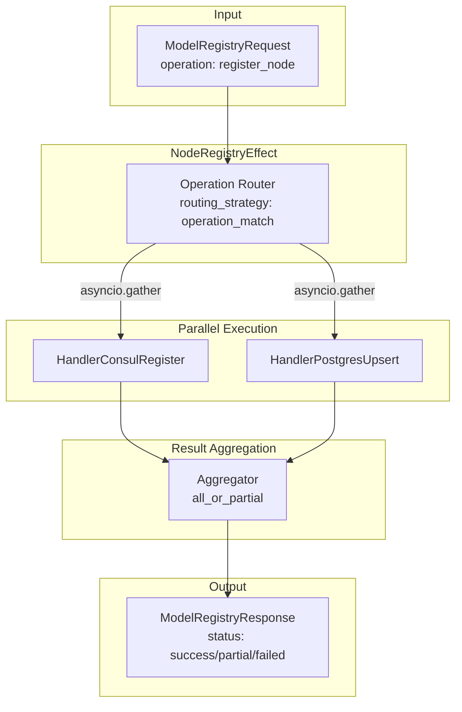

> **Navigation**: [Home](../index.md) > [Patterns](README.md) > Operation Routing

# Operation Routing Pattern

## Overview

This document describes the **operation routing pattern** implemented in the `NodeRegistryEffect` node. Operation routing provides contract-driven dispatch of requests to backend-specific handlers, supporting parallel execution, partial failure handling, and targeted retries.

The pattern is designed for **dual-backend registration** where a node must be registered with both Consul (service discovery) and PostgreSQL (persistence), but the architecture generalizes to any multi-backend operation.

## Design Rationale

| Principle | Explanation |
|-----------|-------------|
| **Contract-Driven** | All routing configuration is defined in `contract.yaml`, not Python code |
| **Parallel Execution** | Independent backend operations execute concurrently via `asyncio.gather()` |
| **Partial Failure Handling** | One backend can succeed while another fails; status reflects this |
| **Targeted Retry** | Failed backends can be retried independently without re-executing successful ones |
| **Handler Isolation** | Each handler manages a single backend, owns its own retry logic |
| **Error Sanitization** | All errors are sanitized before returning to prevent credential exposure |

## Architecture

### Mermaid Diagram (GitHub/GitLab Renderable)



### High-Level Request Flow

```
                        ┌─────────────────────────────────────────────────────────┐
                        │                  ModelRegistryRequest                    │
                        │  Fields: node_id, node_type, correlation_id, ...        │
                        └────────────────────────┬────────────────────────────────┘
                                                 │
                                                 ▼
                        ┌────────────────────────────────────────────────────────┐
                        │                  NodeRegistryEffect                     │
                        │              execute_operation(request, op)             │
                        └────────────────────────┬───────────────────────────────┘
                                                 │
                                                 ▼
                        ┌────────────────────────────────────────────────────────┐
                        │              Load Operation Routing Config              │
                        │              (from contract.yaml)                       │
                        │                                                         │
                        │  routing_strategy: "operation_match"                    │
                        │  execution_mode: "parallel"                             │
                        │  partial_failure_handling: true                         │
                        └────────────────────────┬───────────────────────────────┘
                                                 │
                         ┌───────────────────────┼───────────────────────┐
                         │                       │                       │
                         ▼                       ▼                       ▼
                 "register_node"        "deregister_node"     "retry_partial_failure"
                         │                       │                       │
                         │                       │                       │
        ┌────────────────┴────────────────┐     │     ┌─────────────────┴─────────────────┐
        │         PARALLEL EXECUTION       │     │     │          SINGLE BACKEND           │
        └──────────────┬──────────────────┘     │     └──────────────┬────────────────────┘
                       │                        │                    │
              ┌────────┴────────┐        ┌──────┴──────┐             │
              ▼                 ▼        ▼             ▼             ▼
        ┌──────────┐      ┌──────────┐ ┌──────────┐ ┌──────────┐ ┌──────────┐
        │  Handler │      │  Handler │ │  Handler │ │  Handler │ │  Handler │
        │  Consul  │      │ Postgres │ │  Consul  │ │ Postgres │ │  Partial │
        │ Register │      │  Upsert  │ │ Deregist │ │ Deactiv. │ │  Retry   │
        └────┬─────┘      └────┬─────┘ └────┬─────┘ └────┬─────┘ └────┬─────┘
             │                 │            │            │            │
             ▼                 ▼            ▼            ▼            ▼
        ┌──────────────────────────────────────────────────────────────────┐
        │                         Backend Execution                        │
        │  Consul: Service registration/deregistration via consul client   │
        │  PostgreSQL: Record upsert/deactivation via postgres adapter     │
        └──────────────────────────┬───────────────────────────────────────┘
                                   │
                                   ▼
        ┌──────────────────────────────────────────────────────────────────┐
        │                      Result Aggregation                          │
        │  aggregation_strategy: "all_or_partial"                          │
        │                                                                  │
        │  Status determination:                                           │
        │    - "success"  : Both backends succeeded                        │
        │    - "partial"  : One backend succeeded, one failed              │
        │    - "failed"   : Both backends failed                           │
        └──────────────────────────┬───────────────────────────────────────┘
                                   │
                                   ▼
                        ┌─────────────────────────────────────────────────────────┐
                        │                  ModelRegistryResponse                   │
                        │  status: "success" | "partial" | "failed"               │
                        │  consul_result: ModelBackendResult                       │
                        │  postgres_result: ModelBackendResult                     │
                        │  processing_time_ms: float                               │
                        │  error_summary: str | None                               │
                        └─────────────────────────────────────────────────────────┘
```

### Parallel Execution Detail

For `register_node` and `deregister_node` operations, handlers execute in parallel:

```
                     ┌─────────────────────────────────────────────────┐
                     │            asyncio.gather()                     │
                     │       return_exceptions=True                    │
                     └────────────────────┬────────────────────────────┘
                                          │
                     ┌────────────────────┴────────────────────┐
                     │                                         │
                     ▼                                         ▼
        ┌───────────────────────────┐           ┌───────────────────────────┐
        │    Consul Handler         │           │    PostgreSQL Handler     │
        │  ┌─────────────────────┐  │           │  ┌─────────────────────┐  │
        │  │ consul_client.      │  │           │  │ postgres_adapter.   │  │
        │  │   register()        │  │           │  │   upsert()          │  │
        │  └─────────────────────┘  │           │  └─────────────────────┘  │
        │                           │           │                           │
        │  Time: ~20ms              │           │  Time: ~15ms              │
        └───────────┬───────────────┘           └───────────┬───────────────┘
                    │                                       │
                    │                                       │
                    ▼                                       ▼
        ┌───────────────────────────┐           ┌───────────────────────────┐
        │   ModelBackendResult      │           │   ModelBackendResult      │
        │   success: true/false     │           │   success: true/false     │
        │   error_code: str | None  │           │   error_code: str | None  │
        │   duration_ms: float      │           │   duration_ms: float      │
        └───────────────────────────┘           └───────────────────────────┘

                     │                                         │
                     └────────────────────┬────────────────────┘
                                          │
                     Total time: max(consul_time, postgres_time) = ~20ms
                     (NOT consul_time + postgres_time = ~35ms)
```

### Targeted Retry Flow

After a partial failure, callers can retry only the failed backend:

```
Initial Request: register_node
─────────────────────────────────────────────────────────────────────────────
    ┌─────────────────────────────────────────────────────────────────────┐
    │  Result: status="partial"                                           │
    │  consul_result.success = true       (Consul registration OK)        │
    │  postgres_result.success = false    (PostgreSQL failed)             │
    │  postgres_result.error_code = "POSTGRES_CONNECTION_ERROR"           │
    └─────────────────────────────────────────────────────────────────────┘

Retry Request: retry_partial_failure, target_backend="postgres"
─────────────────────────────────────────────────────────────────────────────
    ┌─────────────────────────────────────────────────────────────────────┐
    │  HandlerPartialRetry                                                │
    │    - target_backend: "postgres"                                     │
    │    - Executes ONLY postgres upsert                                  │
    │    - Does NOT re-execute Consul (already succeeded)                 │
    └─────────────────────────────────────────────────────────────────────┘
                                    │
                                    ▼
    ┌─────────────────────────────────────────────────────────────────────┐
    │  Result: status="success" (if postgres retry succeeded)             │
    │  postgres_result.success = true                                     │
    │  consul_result = (previous success, unchanged)                      │
    └─────────────────────────────────────────────────────────────────────┘
```

## Handler Selection Logic

Handler selection is driven by the `operation_routing.operations` section of `contract.yaml`:

```yaml
operation_routing:
  routing_strategy: "operation_match"
  operations:
    # Multiple handlers can match the same operation
    - operation: "register_node"
      handler:
        name: "HandlerConsulRegister"
        module: "omnibase_infra.nodes.node_registry_effect.handlers.handler_consul_register"
      backend: "consul"

    - operation: "register_node"
      handler:
        name: "HandlerPostgresUpsert"
        module: "omnibase_infra.nodes.node_registry_effect.handlers.handler_postgres_upsert"
      backend: "postgres"
```

### Handler Resolution Flow

```
┌─────────────────────────────────────────────────────────────────────────────┐
│                        _get_handlers_for_operation()                        │
├─────────────────────────────────────────────────────────────────────────────┤
│                                                                             │
│  1. Load contract.yaml (cached after first load)                            │
│                                                                             │
│  2. Filter operations list by operation name                                │
│     operation == "register_node"                                            │
│         │                                                                   │
│         ├── { handler: HandlerConsulRegister, backend: "consul" }           │
│         └── { handler: HandlerPostgresUpsert, backend: "postgres" }         │
│                                                                             │
│  3. Return list of matching handler configurations                          │
│                                                                             │
└─────────────────────────────────────────────────────────────────────────────┘
                                      │
                                      ▼
┌─────────────────────────────────────────────────────────────────────────────┐
│                      Inline Handler Instantiation                           │
│                        (in execute_operation)                               │
├─────────────────────────────────────────────────────────────────────────────┤
│                                                                             │
│  For each handler_config in handler_configs:                                │
│    Extract: backend, handler.name                                           │
│                                                                             │
│  Match backend + handler.name:                                              │
│    consul + "HandlerConsulRegister"   -> HandlerConsulRegister(consul)      │
│    consul + "HandlerConsulDeregister" -> HandlerConsulDeregister(consul)    │
│    postgres + "HandlerPostgresUpsert" -> HandlerPostgresUpsert(postgres)    │
│    postgres + "HandlerPostgresDeactivate" -> HandlerPostgresDeactivate(pg)  │
│                                                                             │
│  For retry_partial_failure:                                                 │
│    HandlerPartialRetry(consul, postgres)                                    │
│                                                                             │
└─────────────────────────────────────────────────────────────────────────────┘
```

## Error Code Mapping

Error codes are defined in `contract.yaml` under `error_handling.error_codes`:

| Error Code | Backend | Retriable | Description |
|------------|---------|-----------|-------------|
| `CONSUL_CONNECTION_ERROR` | consul | Yes | Connection to Consul server failed |
| `CONSUL_TIMEOUT_ERROR` | consul | Yes | Consul operation exceeded timeout |
| `CONSUL_AUTH_ERROR` | consul | No | Authentication with Consul failed |
| `CONSUL_REGISTRATION_ERROR` | consul | No | Registration failed (non-connection) |
| `CONSUL_UNKNOWN_ERROR` | consul | No | Unknown Consul error |
| `POSTGRES_CONNECTION_ERROR` | postgres | Yes | Connection to PostgreSQL failed |
| `POSTGRES_TIMEOUT_ERROR` | postgres | Yes | PostgreSQL operation exceeded timeout |
| `POSTGRES_AUTH_ERROR` | postgres | No | Authentication with PostgreSQL failed |
| `POSTGRES_UPSERT_ERROR` | postgres | No | Upsert operation failed |
| `POSTGRES_UNKNOWN_ERROR` | postgres | No | Unknown PostgreSQL error |
| `HANDLER_NOT_EXECUTED` | any | Yes | Default state before dispatch |
| `CONSUL_EXCEPTION` | consul | No | Unhandled exception during dispatch |
| `POSTGRES_EXCEPTION` | postgres | No | Unhandled exception during dispatch |
| `INVALID_TARGET_BACKEND` | dynamic | No | Invalid target for retry |

### Error Classification in Response

```
┌──────────────────────────────────────────────────────────────────────────┐
│                       Exception Handling Flow                            │
├──────────────────────────────────────────────────────────────────────────┤
│                                                                          │
│  asyncio.gather(consul_handler.handle(), postgres_handler.handle(),      │
│                 return_exceptions=True)                                  │
│                                                                          │
│  Results: [consul_raw, postgres_raw]                                     │
│                                                                          │
│  For each result:                                                        │
│    if isinstance(result, BaseException):                                 │
│        # Convert to ModelBackendResult with error                        │
│        backend_result = ModelBackendResult(                              │
│            success=False,                                                │
│            error=sanitize_error_message(exception),  # Remove secrets    │
│            error_code="CONSUL_EXCEPTION" or "POSTGRES_EXCEPTION",        │
│            duration_ms=0.0,                                              │
│            backend_id=backend_name,                                      │
│            correlation_id=correlation_id,                                │
│        )                                                                 │
│    else:                                                                 │
│        # Handler returned normally - use returned ModelBackendResult     │
│        backend_result = result                                           │
│                                                                          │
└──────────────────────────────────────────────────────────────────────────┘
```

## Retry Behavior at Effect Layer

**IMPORTANT**: The effect node layer has **zero retries** at the orchestration level.

```
┌──────────────────────────────────────────────────────────────────────────┐
│                      Retry Responsibility Separation                     │
├──────────────────────────────────────────────────────────────────────────┤
│                                                                          │
│  ┌────────────────────────────────────────────────────────────────────┐  │
│  │ Effect Node (NodeRegistryEffect)                                   │  │
│  │ ─────────────────────────────────────────────────────────────────  │  │
│  │ - Dispatches to handlers ONCE per operation                        │  │
│  │ - Does NOT implement retry loops                                   │  │
│  │ - Aggregates results with partial failure handling                 │  │
│  │ - Returns immediately after handler execution                      │  │
│  └────────────────────────────────────────────────────────────────────┘  │
│                               │                                          │
│                               ▼                                          │
│  ┌────────────────────────────────────────────────────────────────────┐  │
│  │ Handlers (HandlerConsulRegister, HandlerPostgresUpsert, etc.)      │  │
│  │ ─────────────────────────────────────────────────────────────────  │  │
│  │ - OWN their retry logic                                            │  │
│  │ - Use retry_policy from contract.yaml:                             │  │
│  │     max_retries: 3                                                 │  │
│  │     initial_delay_ms: 100                                          │  │
│  │     max_delay_ms: 5000                                             │  │
│  │     exponential_base: 2                                            │  │
│  │ - Implement exponential backoff for retriable errors               │  │
│  │ - Return final result after all retries exhausted                  │  │
│  └────────────────────────────────────────────────────────────────────┘  │
│                                                                          │
│  Why this separation?                                                    │
│  - Clear separation of concerns (orchestrator routes, handlers retry)    │
│  - Per-backend retry isolation (Consul retries don't affect Postgres)    │
│  - Consistent retry behavior across handler implementations              │
│                                                                          │
└──────────────────────────────────────────────────────────────────────────┘
```

## Configuration Reference

### Contract Operation Routing Section

```yaml
operation_routing:
  # Strategy for matching operations to handlers
  routing_strategy: "operation_match"

  # List of operation-handler mappings
  operations:
    - operation: "register_node"
      handler:
        name: "HandlerConsulRegister"
        module: "omnibase_infra.nodes.node_registry_effect.handlers.handler_consul_register"
      backend: "consul"
      description: "Register node with Consul service discovery"
      output_fields:
        - consul_registered
        - consul_service_id

    # ... additional handlers ...

  # Execution mode for multi-handler operations
  execution_mode: "parallel"  # or "sequential"

  # Allow partial success
  partial_failure_handling: true

  # How to combine handler results
  aggregation_strategy: "all_or_partial"  # status = success/partial/failed
```

### Error Handling Section

```yaml
error_handling:
  # Circuit breaker (per-backend)
  circuit_breaker:
    enabled: true
    failure_threshold: 5
    reset_timeout_ms: 60000
    per_backend: true

  # Retry policy (consumed by handlers)
  retry_policy:
    max_retries: 3
    initial_delay_ms: 100
    max_delay_ms: 5000
    exponential_base: 2
    retry_on:
      - "InfraConnectionError"
      - "InfraTimeoutError"
      - "InfraUnavailableError"

  # Error sanitization
  error_sanitization:
    enabled: true
    sanitize_patterns:
      - "password"
      - "secret"
      - "token"
      - "api_key"
```

## Usage Examples

### Basic Registration

```python
from omnibase_core.models.container import ModelONEXContainer
from omnibase_infra.nodes.node_registry_effect import NodeRegistryEffect
from omnibase_infra.nodes.node_registry_effect.models import ModelRegistryRequest
from datetime import datetime, UTC
from uuid import uuid4

# Create effect node with container injection
container = ModelONEXContainer()
effect = NodeRegistryEffect(container)

# Set backend adapters (or configure in container)
effect.set_consul_client(consul_client)
effect.set_postgres_adapter(postgres_adapter)

# Create request
request = ModelRegistryRequest(
    node_id=uuid4(),
    node_type="effect",
    node_version="1.0.0",
    correlation_id=uuid4(),
    service_name="my-service",
    tags=["production", "v1"],
    endpoints={"health": "http://localhost:8080/health"},
    timestamp=datetime.now(UTC),
)

# Execute registration
response = await effect.execute_operation(request, "register_node")

# Check result
if response.status == "success":
    print("Both backends registered successfully")
elif response.status == "partial":
    # Handle partial failure
    for backend in ["consul", "postgres"]:
        result = getattr(response, f"{backend}_result")
        if not result.success:
            print(f"{backend} failed: {result.error_code}")
```

### Handling Partial Failures

```python
# Initial registration
response = await effect.execute_operation(request, "register_node")

if response.status == "partial":
    # Identify failed backends
    failed_backends = []
    if not response.consul_result.success:
        failed_backends.append("consul")
    if not response.postgres_result.success:
        failed_backends.append("postgres")

    # Retry each failed backend
    for backend in failed_backends:
        retry_response = await effect.execute_operation(
            request,
            "retry_partial_failure",
            target_backend=backend,
        )

        if retry_response.status == "success":
            print(f"Retry succeeded for {backend}")
        else:
            result = getattr(retry_response, f"{backend}_result")
            print(f"Retry failed for {backend}: {result.error_code}")
```

## Testing

### Unit Test Structure

```python
import pytest
from unittest.mock import AsyncMock, MagicMock
from omnibase_infra.nodes.node_registry_effect import NodeRegistryEffect

@pytest.mark.asyncio
async def test_parallel_execution_both_succeed():
    """Test that both backends succeed in parallel execution."""
    container = MagicMock()
    effect = NodeRegistryEffect(container)

    # Mock successful handlers
    mock_consul = AsyncMock()
    mock_postgres = AsyncMock()
    effect.set_consul_client(mock_consul)
    effect.set_postgres_adapter(mock_postgres)

    response = await effect.execute_operation(request, "register_node")

    assert response.status == "success"
    assert response.consul_result.success
    assert response.postgres_result.success


@pytest.mark.asyncio
async def test_partial_failure_consul_fails():
    """Test partial failure when Consul fails but PostgreSQL succeeds."""
    # ... setup with failing consul mock ...

    response = await effect.execute_operation(request, "register_node")

    assert response.status == "partial"
    assert not response.consul_result.success
    assert response.postgres_result.success
    assert response.consul_result.error_code == "CONSUL_CONNECTION_ERROR"
```

## Related Patterns

- [Dispatcher Resilience](./dispatcher_resilience.md) - Pattern for dispatcher-owned resilience
- [Circuit Breaker Implementation](./circuit_breaker_implementation.md) - Circuit breaker state machine details
- [Error Handling Patterns](./error_handling_patterns.md) - Error classification and context
- [Error Sanitization Patterns](./error_sanitization_patterns.md) - Preventing credential exposure
- [Retry, Backoff, and Compensation](./retry_backoff_compensation_strategy.md) - Formal retry policies

## See Also

- `src/omnibase_infra/nodes/node_registry_effect/node.py` - Effect node implementation
- `src/omnibase_infra/nodes/node_registry_effect/contract.yaml` - Contract configuration
- `src/omnibase_infra/nodes/node_registry_effect/handlers/` - Handler implementations
- `src/omnibase_infra/nodes/node_registry_effect/models/` - Request/response models
