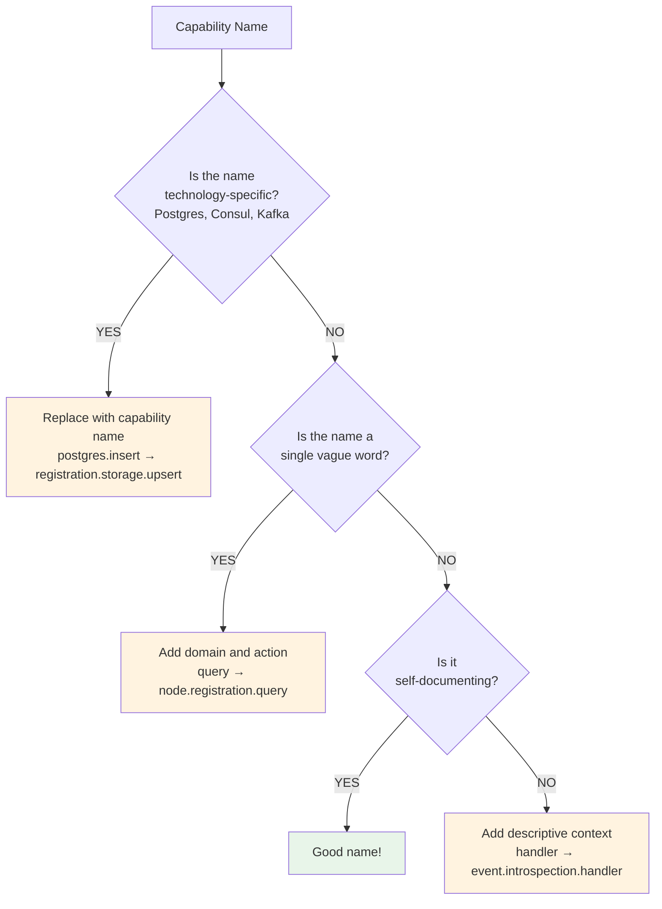

> **Navigation**: [Home](../index.md) > [Reference](README.md) > Contract.yaml

# Contract.yaml Reference

This reference documents the complete structure of ONEX contract files.

## Overview

ONEX contracts are YAML files that declare node behavior. There are two types:

| File | Purpose | Location |
|------|---------|----------|
| `contract.yaml` | Node contract | `nodes/<node_name>/contract.yaml` |
| `handler_contract.yaml` | Handler contract | `contracts/handlers/<handler>/handler_contract.yaml` |

**Key Principle**: Contracts define WHAT a node does. Python code defines HOW (but should be minimal).

## Minimal Contract

Every node contract requires these fields:

```yaml
# Required fields
contract_version:
  major: 1
  minor: 0
  patch: 0
node_version: "1.0.0"
name: "node_example"
node_type: "EFFECT_GENERIC"  # See node types below
description: "What this node does."

input_model:
  name: "ModelExampleInput"
  module: "omnibase_infra.nodes.node_example.models"

output_model:
  name: "ModelExampleOutput"
  module: "omnibase_infra.nodes.node_example.models"
```

## Node Types

Use `_GENERIC` suffix in contracts:

| Contract Value | EnumNodeKind | Purpose |
|----------------|--------------|---------|
| `EFFECT_GENERIC` | `EFFECT` | External I/O operations |
| `COMPUTE_GENERIC` | `COMPUTE` | Pure transformations |
| `REDUCER_GENERIC` | `REDUCER` | State + FSM + intents |
| `ORCHESTRATOR_GENERIC` | `ORCHESTRATOR` | Workflow coordination |

---

## Subcontracts

> **Note**: Subcontracts are an **optional** modularity pattern. Most nodes work perfectly fine with a single `contract.yaml` file. Only consider extracting subcontracts when contract files become unwieldy (>100 lines in a section) or when sharing configurations across multiple nodes.

### Subcontract Concepts vs Implementation

ONEX contracts reference 6 conceptual subcontract categories that appear in contract.yaml comments as **architectural guidance for future extraction**:

| Conceptual Category | Purpose | Implementation Status |
|---------------------|---------|----------------------|
| FSM subcontract | FSM state machine definitions | **Inline only** - `state_machine:` section |
| Event subcontract | Event type definitions and routing | **Inline only** - `consumed_events:`/`published_events:` sections |
| Aggregation subcontract | Aggregation/projection rules | **Inline only** - within `step_config:` |
| State subcontract | State management configuration | **Inline only** - `coordination_rules:` section |
| Routing subcontract | Message routing rules | **Implemented** - `ModelRoutingSubcontract` with loader |
| Caching subcontract | Caching strategy definitions | **Inline only** - not yet typed |

**Currently Implemented**: Only `handler_routing` has a fully typed Pydantic model (`ModelRoutingSubcontract`) with a dedicated loader function (`load_handler_routing_subcontract()`). Other sections exist as inline YAML without separate typed models.

### When to Use Subcontracts (vs. Single Contract)

**Default: Use a single `contract.yaml`** for most nodes. A single contract is simpler, easier to understand, and sufficient for the majority of use cases.

**Consider section extraction** only when:
- A section exceeds ~100 lines and obscures the contract's main purpose
- The same configuration is genuinely reusable across multiple nodes
- The section has independent versioning needs (rare)
- Multiple team members need to work on different sections simultaneously

**Keep everything in one contract** when:
- The contract is under 200 lines total
- The node is self-contained without shared configurations
- You're unsure whether to split (when in doubt, don't)

**Source of Truth**: The main `contract.yaml` is always the authoritative source. Subcontracts are inline YAML sections within this file. Currently, only `handler_routing` sections are parsed into typed Pydantic models by the runtime.

### Subcontract Implementation Pattern

**Current Implementation**: Subcontracts are defined as **inline sections** within the main `contract.yaml` file. The `handler_routing` section is the only section with a typed Pydantic model (`ModelRoutingSubcontract`) and dedicated loader.

```yaml
# contract.yaml - handler_routing section (the only typed subcontract)
contract_version:
  major: 1
  minor: 0
  patch: 0
name: "node_registration_orchestrator"
node_type: "ORCHESTRATOR_GENERIC"

# handler_routing is parsed into ModelRoutingSubcontract
handler_routing:
  routing_strategy: "payload_type_match"
  handlers:
    - event_model:
        name: "ModelNodeIntrospectionEvent"
        module: "omnibase_infra.models.registration.model_node_introspection_event"
      handler:
        name: "HandlerNodeIntrospected"
        module: "omnibase_infra.nodes.node_registration_orchestrator.handlers.handler_node_introspected"
```

**How Handler Routing Is Loaded**:

```python
from pathlib import Path
from omnibase_infra.runtime.contract_loaders import load_handler_routing_subcontract

# Load handler_routing section from contract.yaml
# Returns a typed ModelRoutingSubcontract with ModelRoutingEntry list
contract_path = Path(__file__).parent / "contract.yaml"
routing = load_handler_routing_subcontract(contract_path)

# Access routing entries
for entry in routing.handlers:
    print(f"Route {entry.routing_key} -> {entry.handler_key}")
```

**Directory Structure** (current pattern):
```
nodes/node_registration_orchestrator/
├── contract.yaml              # Main contract with inline sections
├── node.py                    # Declarative node class
└── handlers/                  # Handler implementations
```

**Note on `!include` Directive**: Some contract.yaml files contain comments suggesting a future `!include` pattern (e.g., `routing_subcontract: !include subcontracts/routing.yaml`). This is **aspirational documentation only** - the runtime uses `yaml.safe_load()` which does not support custom YAML tags. All sections must be inline in the current implementation.

### Type Safety Requirements

All contracts (and subcontracts) must adhere to ONEX type safety standards:

| Requirement | Description |
|-------------|-------------|
| **No `Any` types** | Use `object` for generic payloads; see `CLAUDE.md` for exceptions |
| **Pydantic models** | All I/O types must be proper Pydantic models |
| **Module paths** | All `module` fields must resolve to valid Python modules |
| **Semantic versioning** | `contract_version` uses semver (major.minor.patch) |

### Subcontracts vs External References

**Key Distinction**: ONEX contracts use a **self-contained model** where all configuration lives within the contract file itself.

| Concept | Definition | Status |
|---------|------------|--------|
| **Subcontract (inline)** | An inline YAML section within `contract.yaml`. Only `handler_routing` has a typed Pydantic model (`ModelRoutingSubcontract`). | Partially implemented |
| **Linked-doc** | External Markdown documentation referenced for human consumption (e.g., ADRs, design docs). Not parsed by runtime. | Documentation pattern |
| **`!include` directive** | YAML tag for external file inclusion (mentioned in contract comments as future pattern) | **Not implemented** |

**Linked-Doc Pattern**:

Contracts may reference external documentation for human readers without affecting runtime behavior:

```yaml
# contract.yaml
metadata:
  documentation:
    - title: "Registration FSM Design"
      path: "docs/decisions/adr-registration-fsm.md"
    - title: "Handler Routing Pattern"
      path: "docs/patterns/handler_plugin_loader.md"
```

These references are **not parsed or validated** by the runtime - they serve as navigation aids for developers reading the contract.

**Why Self-Contained Contracts**:
- **Single source of truth**: All configuration in one file prevents configuration drift
- **Validation**: The runtime validates the entire contract atomically
- **Simplicity**: No dependency resolution or include ordering issues
- **Security**: No risk of malicious include paths (see `CLAUDE.md` Handler Plugin Loader security)

**If a section becomes too large** (>100 lines), consider:
1. Refactoring to reduce complexity
2. Splitting into multiple nodes (each with its own contract)
3. Using capabilities and dependencies to compose behavior

**Relationship to CLAUDE.md**: The contract patterns documented here are consistent with `CLAUDE.md` contract standards. When in doubt, `CLAUDE.md` is authoritative for coding standards.

---

## Common Fields

These fields apply to all node types:

### Version Information

```yaml
contract_version:
  major: 1       # Breaking changes
  minor: 0       # New features (backward compatible)
  patch: 0       # Bug fixes

node_version: "1.0.0"  # Implementation version
```

### Basic Identity

```yaml
name: "node_example"            # Unique identifier (snake_case)
node_type: "EFFECT_GENERIC"     # One of the four archetypes
description: "Human-readable description of what this node does."
```

### Input/Output Models

```yaml
input_model:
  name: "ModelExampleInput"
  module: "omnibase_infra.nodes.node_example.models"
  description: "Optional description of input model."

output_model:
  name: "ModelExampleOutput"
  module: "omnibase_infra.nodes.node_example.models"
  description: "Optional description of output model."
```

### Capabilities

Capabilities declare what a node can do, enabling discovery and routing.

```yaml
capabilities:
  - name: "registration.storage"
    description: "Store and query registration records"
  - name: "registration.storage.query"
  - name: "registration.storage.upsert"
  - name: "registration.storage.delete"
```

#### Capability Naming Convention

**Use capability-oriented names** (what it does), **not technology names** (how it does it).

| Aspect | Good Examples | Bad Examples |
|--------|--------------|--------------|
| **Domain-scoped** | `registration.storage` | `postgres` |
| **Action-oriented** | `service.discovery.register` | `consul` |
| **Hierarchical** | `node.lifecycle.introspection` | `introspect` |
| **Descriptive** | `workflow.coordination.parallel` | `parallel_exec` |

**Good Naming Patterns**:

```yaml
# Pattern: {domain}.{subdomain}.{action}
capabilities:
  # Service discovery capabilities
  - name: "service.discovery.register"
    description: "Register a service for discovery"
  - name: "service.discovery.deregister"
    description: "Remove a service from discovery"
  - name: "service.discovery.lookup"
    description: "Find services by criteria"

  # Data persistence capabilities
  - name: "registration.storage.upsert"
    description: "Insert or update registration records"
  - name: "registration.storage.query"
    description: "Query registration records"
  - name: "registration.storage.delete"
    description: "Remove registration records"

  # Workflow capabilities
  - name: "workflow.coordination.parallel"
    description: "Execute workflow steps in parallel"
  - name: "workflow.coordination.checkpoint"
    description: "Create workflow state checkpoints"
```

**Bad Naming (Avoid These)**:

```yaml
# WRONG: Technology-specific names
capabilities:
  - name: "postgres"           # Too vague, ties to implementation
  - name: "consul"             # Technology, not capability
  - name: "kafka.publish"      # Exposes transport detail

# WRONG: Non-hierarchical names
capabilities:
  - name: "store"              # Too generic, no context
  - name: "query"              # Ambiguous - query what?
  - name: "process"            # Meaningless without domain

# WRONG: Implementation-leaking names
capabilities:
  - name: "sql.execute"        # Exposes SQL as implementation
  - name: "http.post"          # Transport detail, not capability
  - name: "async_handler"      # Implementation pattern, not business capability

# WRONG: Non-descriptive or lazy names
capabilities:
  - name: "doStuff"            # Meaningless - what stuff?
  - name: "handler1"           # Numbered handlers indicate poor design
  - name: "run"                # Too generic, no domain context
  - name: "execute"            # Ambiguous without operation type
  - name: "data"               # What data? For what purpose?
```

#### Capability Naming Quick Reference

| Pattern | Good | Bad | Why |
|---------|------|-----|-----|
| Domain-scoped | `node.registration.create` | `create` | Context makes purpose clear |
| Action-oriented | `node.introspection.query` | `query` | Domain prefix prevents ambiguity |
| Hierarchical | `service.discovery.register` | `register` | Hierarchy enables routing |
| Descriptive | `workflow.state.checkpoint` | `doStuff` | Names should be self-documenting |
| Technology-agnostic | `registration.storage.upsert` | `postgres.insert` | Allows backend swaps |

**Why This Matters**: Capability names are used for service discovery, routing, and dependency resolution. Technology-agnostic names allow backend swaps without contract changes.

#### Capability Naming Examples: Good vs Bad

This section provides detailed side-by-side comparisons to help you choose appropriate capability names.

**Example 1: Service Discovery**

| Aspect | Good | Bad |
|--------|------|-----|
| **Name** | `service.discovery.register` | `consul` |
| **Why good/bad** | Describes the action (register for discovery) | Names the technology, not the capability |
| **What happens if you change backends** | No change needed - swap Consul for Kubernetes service discovery | Must rename capability and update all consumers |
| **Self-documenting?** | Yes - you know it registers something for discovery | No - what does "consul" do? Register? Query? Health check? |

```yaml
# GOOD: Describes the capability
capabilities:
  - name: "service.discovery.register"
    description: "Register a service instance for discovery by other services"
  - name: "service.discovery.lookup"
    description: "Find services by name, tags, or health status"
  - name: "service.discovery.health"
    description: "Report and query service health status"

# BAD: Names the technology
capabilities:
  - name: "consul"              # Vague - what operation?
  - name: "consul.agent"        # Still technology-coupled
  - name: "k8s.service"         # What if you're not on Kubernetes?
```

**Example 2: Data Storage**

| Aspect | Good | Bad |
|--------|------|-----|
| **Name** | `registration.storage.upsert` | `postgres.insert` |
| **Why good/bad** | Describes domain (registration) and action (upsert) | Exposes database technology in the interface |
| **Reusability** | Works with any backend: Postgres, MySQL, DynamoDB | Tied to PostgreSQL specifically |
| **API stability** | Stable - backend changes don't affect consumers | Breaks if you migrate databases |

```yaml
# GOOD: Domain + action pattern
capabilities:
  - name: "registration.storage.upsert"
    description: "Insert or update a registration record"
  - name: "registration.storage.query"
    description: "Query registrations by criteria"
  - name: "registration.storage.delete"
    description: "Remove a registration record"

# BAD: Technology-specific names
capabilities:
  - name: "postgres.insert"     # Database engine in name
  - name: "sql.execute"         # Exposes query language
  - name: "dynamodb.putItem"    # AWS-specific naming
```

**Example 3: Event Processing**

| Aspect | Good | Bad |
|--------|------|-----|
| **Name** | `event.process.validate` | `kafka.consume` |
| **Why good/bad** | Describes the logical action | Exposes transport mechanism |
| **Flexibility** | Works with Kafka, RabbitMQ, or in-memory queues | Only makes sense for Kafka |
| **Clarity** | Clear what the capability does | What does "consume" mean? Validate? Transform? Route? |

```yaml
# GOOD: Logical capability names
capabilities:
  - name: "event.process.validate"
    description: "Validate incoming events against schema"
  - name: "event.process.transform"
    description: "Transform events between formats"
  - name: "event.process.route"
    description: "Route events to appropriate handlers"

# BAD: Transport-specific names
capabilities:
  - name: "kafka.consume"       # Transport detail, not capability
  - name: "kafka.publish"       # What is being published?
  - name: "rabbitmq.queue"      # Technology in name
```

**Example 4: Generic vs Specific**

| Aspect | Good | Bad |
|--------|------|-----|
| **Name** | `node.lifecycle.introspection` | `doStuff` |
| **Why good/bad** | Hierarchical, specific, self-documenting | Meaningless - provides no information |
| **Discoverability** | Easy to find via `node.*` prefix | Impossible to categorize or discover |
| **Maintenance** | Clear scope and purpose | What is "stuff"? Who maintains this? |

```yaml
# GOOD: Specific, hierarchical names
capabilities:
  - name: "node.lifecycle.introspection"
    description: "Query node capabilities and configuration"
  - name: "node.lifecycle.healthcheck"
    description: "Verify node operational status"
  - name: "workflow.state.checkpoint"
    description: "Create workflow recovery checkpoint"

# BAD: Vague or meaningless names
capabilities:
  - name: "doStuff"             # What stuff?
  - name: "handler1"            # Numbered handlers = poor design
  - name: "process"             # Process what? How?
  - name: "run"                 # Run what?
  - name: "execute"             # Execute what operation?
  - name: "data"                # What data? For what purpose?
  - name: "util"                # Utility for what?
```

#### Capability Naming Checklist

Before finalizing a capability name, verify it passes these checks:

| Check | Question | If No... |
|-------|----------|----------|
| **Domain-scoped** | Does it start with a domain prefix? | Add domain: `storage` -> `registration.storage` |
| **Action-oriented** | Does it describe an action? | Add verb: `registration` -> `registration.query` |
| **Technology-agnostic** | Could a different backend implement it? | Remove tech: `postgres.insert` -> `storage.upsert` |
| **Self-documenting** | Can someone understand it without reading docs? | Be specific: `process` -> `event.process.validate` |
| **Hierarchical** | Does it fit into a logical hierarchy? | Add structure: `query` -> `node.registration.query` |

#### Naming Decision Tree

##### ASCII Version

**Diagram Description**: This ASCII decision tree guides capability naming choices. First, check if the name is technology-specific (like Postgres or Consul) - if yes, replace it with a capability name. If not, check if it's a single vague word - if yes, add domain and action context. Finally, verify the name is self-documenting; if not, add descriptive context.

```
Is the name specific to a technology (Postgres, Consul, Kafka)?
├── YES → Replace with capability name
│         "postgres.insert" → "registration.storage.upsert"
│
└── NO → Is the name a single vague word?
         ├── YES → Add domain and action
         │         "query" → "node.registration.query"
         │
         └── NO → Is it self-documenting?
                  ├── YES → Good name!
                  └── NO → Add descriptive context
                           "handler" → "event.introspection.handler"
```

##### Mermaid Version



### Dependencies

```yaml
dependencies:
  protocols:
    - name: "ProtocolPostgresAdapter"
      module: "omnibase_spi.protocols"
      required: true
    - name: "ProtocolProjectionReader"
      module: "omnibase_spi.protocols"
      required: false

  nodes:
    - name: "node_registry_effect"
      required: true

  services:
    - name: "postgresql"
      version: ">=15.0"
      required: true
```

### Error Handling

```yaml
error_handling:
  retry_policy:
    max_retries: 3
    exponential_base: 2
    max_delay_seconds: 60
    retry_on:
      - "InfraConnectionError"
      - "InfraTimeoutError"
    do_not_retry_on:
      - "InfraAuthenticationError"

  circuit_breaker:
    enabled: true
    failure_threshold: 5
    reset_timeout_seconds: 60
    half_open_max_calls: 3
    per_backend: true  # Separate circuit per backend

  error_codes:
    - code: "REGISTRATION_001"
      description: "Node ID not found"
      severity: "ERROR"
```

### Health Check

```yaml
health_check:
  enabled: true
  endpoint: "/health"
  interval_seconds: 30
  timeout_seconds: 5
  failure_threshold: 3
```

### Metadata

```yaml
metadata:
  author: "ONEX Team"
  created_at: "2025-01-15"
  updated_at: "2025-01-18"
  tags:
    - "infrastructure"
    - "registration"
  license: "MIT"
```

---

## EFFECT-Specific Fields

### IO Operations

```yaml
io_operations:
  - operation: "store_registration"
    description: "Persist a registration record"
    input_fields:
      - record: "ModelRegistrationRecord"
      - correlation_id: "UUID | None"
    output_fields:
      - result: "ModelUpsertResult"
    idempotent: true
    timeout_ms: 5000

  - operation: "query_registration"
    description: "Query registration by node_id"
    input_fields:
      - node_id: "str"
    output_fields:
      - record: "ModelRegistrationRecord | None"
    idempotent: true
    read_only: true
```

### Handler Routing (Effect)

```yaml
handler_routing:
  routing_strategy: "handler_type_match"
  default_handler: "postgresql"
  execution_mode: "parallel"          # parallel | sequential
  partial_failure_handling: true
  aggregation_strategy: "all_or_partial"

  handlers:
    - handler_type: "postgresql"
      handler:
        name: "HandlerRegistrationStoragePostgres"
        module: "omnibase_infra.handlers.registration_storage"
      backend: "postgres"

    - handler_type: "mock"
      handler:
        name: "HandlerRegistrationStorageMock"
        module: "omnibase_infra.handlers.registration_storage"
      backend: "mock"
```

### Database Schema (Optional)

```yaml
database_schema:
  tables:
    - name: "node_registrations"
      columns:
        - name: "node_id"
          type: "UUID"
          primary_key: true
        - name: "node_type"
          type: "VARCHAR(50)"
          not_null: true
        - name: "endpoints"
          type: "JSONB"
        - name: "created_at"
          type: "TIMESTAMP"
          default: "NOW()"
      indexes:
        - columns: ["node_type"]
          name: "idx_node_type"
```

---

## COMPUTE-Specific Fields

### Validation Rules

```yaml
validation_rules:
  - rule_id: "ARCH-001"
    name: "No Direct Handler Dispatch"
    severity: "WARNING"
    description: "Handlers must be routed through RuntimeHost"
    detection_strategy:
      type: "ast_pattern"
      patterns:
        - "direct_handler_call"
        - "handler.handle("
    suggested_fix: "Route through RuntimeHost.process_event()"

  - rule_id: "ARCH-002"
    name: "No Handler Publishing Events"
    severity: "ERROR"
    detection_strategy:
      type: "signature_analysis"
      checks:
        - no_bus_in_init_params
        - no_bus_instance_attributes
```

### Transformation Rules

```yaml
transformations:
  - name: "normalize_endpoint"
    input_type: "str"
    output_type: "str"
    description: "Normalize endpoint URL format"

  - name: "aggregate_capabilities"
    input_type: "list[str]"
    output_type: "set[str]"
    description: "Deduplicate capabilities"
```

---

## REDUCER-Specific Fields

### State Machine

```yaml
state_machine:
  state_machine_name: "registration_fsm"
  initial_state: "idle"

  states:
    - state_name: "idle"
      description: "Waiting for events"
      entry_actions: []
      exit_actions: []

    - state_name: "pending"
      description: "Processing registration"
      entry_actions:
        - "emit_consul_intent"
        - "emit_postgres_intent"
      timeout_seconds: 30

    - state_name: "partial"
      description: "Partial completion"

    - state_name: "complete"
      description: "Successfully completed"
      terminal: false

    - state_name: "failed"
      description: "Failed state"
      terminal: false

  transitions:
    - from_state: "idle"
      to_state: "pending"
      trigger: "introspection_received"
      conditions:
        - expression: "node_id is_present"
          required: true
        - expression: "node_type is_valid"
          required: true
      actions:
        - action_name: "build_consul_intent"
          action_type: "intent_emission"
        - action_name: "build_postgres_intent"
          action_type: "intent_emission"
      guard: "not is_duplicate_event"

    - from_state: "pending"
      to_state: "partial"
      trigger: "consul_confirmed"

    - from_state: "partial"
      to_state: "complete"
      trigger: "postgres_confirmed"
      conditions:
        - expression: "consul_confirmed is_true"

    - from_state: "*"           # Wildcard: any state
      to_state: "failed"
      trigger: "error_received"

    - from_state: "failed"
      to_state: "idle"
      trigger: "reset_requested"
```

### Intent Emission

```yaml
intent_emission:
  enabled: true
  intents:
    - intent_type: "consul.register"
      target_pattern: "consul://service/{service_name}"
      payload_model: "ModelPayloadConsulRegister"
      payload_module: "omnibase_infra.nodes.reducers.models"

    - intent_type: "postgres.upsert_registration"
      target_pattern: "postgres://node_registrations/{node_id}"
      payload_model: "ModelPayloadPostgresUpsertRegistration"
      payload_module: "omnibase_infra.nodes.reducers.models"
```

### Idempotency

```yaml
idempotency:
  enabled: true
  strategy: "event_id_tracking"
  description: "Track processed event_ids to prevent duplicates"
  storage: "in_state"           # in_state | external
```

### Validation

```yaml
validation:
  event_validation:
    - field: "node_id"
      required: true
      type: "str"
      min_length: 1
    - field: "node_type"
      required: true
      type: "EnumNodeKind"
      allowed_values: ["EFFECT", "COMPUTE", "REDUCER", "ORCHESTRATOR"]
```

---

## ORCHESTRATOR-Specific Fields

### Workflow Coordination

```yaml
workflow_coordination:
  workflow_definition:
    workflow_metadata:
      workflow_name: "node_registration_workflow"
      workflow_version:
        major: 1
        minor: 0
        patch: 0
      description: "Two-way registration with Consul and PostgreSQL"

    execution_graph:
      nodes:
        - node_id: "receive_event"
          node_type: EFFECT_GENERIC
          description: "Receive incoming event"
          step_config:
            event_pattern: ["node-introspection.*"]

        - node_id: "read_projection"
          node_type: EFFECT_GENERIC
          depends_on: ["receive_event"]
          description: "Query current state"
          step_config:
            protocol: "ProtocolProjectionReader"

        - node_id: "compute_intents"
          node_type: REDUCER_GENERIC
          depends_on: ["read_projection"]
          description: "FSM transition and intent computation"

        - node_id: "execute_consul"
          node_type: EFFECT_GENERIC
          depends_on: ["compute_intents"]
          step_config:
            intent_filter: "consul.*"

        - node_id: "execute_postgres"
          node_type: EFFECT_GENERIC
          depends_on: ["compute_intents"]
          step_config:
            intent_filter: "postgres.*"

        - node_id: "aggregate_results"
          node_type: COMPUTE_GENERIC
          depends_on: ["execute_consul", "execute_postgres"]

    coordination_rules:
      execution_mode: parallel
      parallel_execution_allowed: true
      max_parallel_branches: 2
      failure_recovery_strategy: retry
      max_retries: 3
      timeout_ms: 30000
      checkpointing:
        enabled: true
        checkpoint_after_steps: ["compute_intents"]
```

### Handler Routing (Orchestrator)

```yaml
handler_routing:
  routing_strategy: "payload_type_match"

  handlers:
    - event_model:
        name: "ModelNodeIntrospectionEvent"
        module: "omnibase_infra.models.registration"
      handler:
        name: "HandlerNodeIntrospected"
        module: "omnibase_infra.nodes.node_registration_orchestrator.handlers"
      output_events:
        - "ModelNodeRegistrationInitiated"
      state_decision_matrix:
        - current_state: null
          action: "emit_registration_initiated"
          description: "New node - initiate registration"
        - current_state: "LIVENESS_EXPIRED"
          action: "emit_registration_initiated"
          description: "Expired node - re-register"
        - current_state: "ACTIVE"
          action: "no_op"
          description: "Already active - skip"

    - event_model:
        name: "ModelRuntimeTick"
        module: "omnibase_infra.runtime.models"
      handler:
        name: "HandlerRuntimeTick"
        module: "omnibase_infra.nodes.node_registration_orchestrator.handlers"
      timeout_evaluation:
        uses_injected_now: true
        queries_pending_entities: true

  handler_dependencies:
    projection_reader:
      protocol: "ProtocolProjectionReader"
      implementation: "ProjectionReaderRegistration"
      shared: true
```

### Consumed Events

```yaml
consumed_events:
  - topic: "{env}.{namespace}.onex.evt.node-introspection.v1"
    event_type: "NodeIntrospectionEvent"
    description: "Node startup introspection"
    consumer_group: "registration-orchestrator"

  - topic: "{env}.{namespace}.onex.cmd.node-registration-acked.v1"
    event_type: "NodeRegistrationAcked"
    description: "Node acknowledges registration"

  - topic: "{env}.{namespace}.onex.internal.runtime-tick.v1"
    event_type: "RuntimeTick"
    description: "Periodic tick for timeout evaluation"
```

### Published Events

```yaml
published_events:
  - topic: "{env}.{namespace}.onex.evt.node-registration-initiated.v1"
    event_type: "NodeRegistrationInitiated"
    description: "Registration workflow started"

  - topic: "{env}.{namespace}.onex.evt.node-became-active.v1"
    event_type: "NodeBecameActive"
    description: "Node transitioned to ACTIVE"

  - topic: "{env}.{namespace}.onex.evt.node-liveness-expired.v1"
    event_type: "NodeLivenessExpired"
    description: "Heartbeat deadline passed"
```

### Intent Consumption

```yaml
intent_consumption:
  intent_routing_table:
    "consul.register": "node_registry_effect"
    "consul.deregister": "node_registry_effect"
    "postgres.upsert_registration": "node_registry_effect"
    "postgres.deactivate_registration": "node_registry_effect"
```

---

## Handler Contract

Handler contracts define standalone handlers:

```yaml
# contracts/handlers/consul/handler_contract.yaml

name: handler-consul
handler_class: omnibase_infra.handlers.handler_consul.HandlerConsul
handler_type: effect

description: "HashiCorp Consul integration for service discovery and KV store"

tags:
  - infrastructure
  - service-discovery
  - effect

operations:
  - name: "consul.kv_get"
    description: "Get value from Consul KV store"
  - name: "consul.kv_put"
    description: "Put value to Consul KV store"
  - name: "consul.register"
    description: "Register service with Consul"
  - name: "consul.deregister"
    description: "Deregister service from Consul"

dependencies:
  - protocol: "ProtocolConsulClient"
    required: true

security:
  trusted_namespace: omnibase_infra.handlers
  audit_logging: true
  allowed_operations:
    - "consul.kv_get"
    - "consul.kv_put"
    - "consul.register"
    - "consul.deregister"

error_handling:
  circuit_breaker:
    enabled: true
    failure_threshold: 5
```

---

## Contract Validation

Contracts are validated at runtime. Common errors:

| Error | Cause | Fix |
|-------|-------|-----|
| Missing required field | `name`, `node_type`, or I/O models missing | Add required fields |
| Invalid node_type | Not one of the four archetypes | Use `*_GENERIC` suffix |
| Module not found | `module` path doesn't resolve | Check import path |
| Invalid transition | FSM transition references unknown state | Define all states first |
| Ambiguous contracts | Both `contract.yaml` and `handler_contract.yaml` exist | Use only one per directory |

## Best Practices

1. **Use capabilities, not technologies**: Name by what it does, not what it uses (see [Capability Naming Convention](#capability-naming-convention))
2. **Keep contracts focused**: One node = one responsibility
3. **Define error handling**: Always include retry and circuit breaker config
4. **Version intentionally**: Bump major for breaking changes
5. **Document thoroughly**: Use description fields liberally
6. **Validate early**: Run `onex validate` in CI
7. **Extract subcontracts when needed**: Keep main contract readable (see [Subcontracts](#subcontracts))

## Common Mistakes

Avoid these frequently encountered contract issues:

### 1. Technology-Leaking Capability Names

```yaml
# WRONG
capabilities:
  - name: "postgres"
  - name: "consul.register"

# CORRECT
capabilities:
  - name: "registration.storage"
  - name: "service.discovery.register"
```

### 2. Missing Module Paths

```yaml
# WRONG - module path missing
input_model:
  name: "ModelExampleInput"

# CORRECT - full module path
input_model:
  name: "ModelExampleInput"
  module: "omnibase_infra.nodes.node_example.models"
```

### 3. Incorrect Node Type Suffix

```yaml
# WRONG - missing _GENERIC suffix
node_type: "EFFECT"

# CORRECT - use _GENERIC suffix in contracts
node_type: "EFFECT_GENERIC"
```

### 4. Ambiguous Contract Files

```
# WRONG - both files in same directory
nodes/my_node/
├── contract.yaml
└── handler_contract.yaml  # Causes AMBIGUOUS_CONTRACT_CONFIGURATION error

# CORRECT - one contract per directory
nodes/my_node/
└── contract.yaml          # Single source of truth
```

### 5. Any Types in Contracts

```yaml
# WRONG - Any type not allowed
input_model:
  name: "dict[str, Any]"  # Violates type safety

# CORRECT - use object or specific types
input_model:
  name: "ModelSpecificInput"
  module: "omnibase_infra.models"
```

### 6. Inline Coordination Settings (Deprecated)

```yaml
# WRONG - coordination settings at top level
workflow_coordination:
  parallel_execution: true  # Don't put here
  workflow_definition:
    coordination_rules:
      # ...

# CORRECT - all coordination in coordination_rules
workflow_coordination:
  workflow_definition:
    coordination_rules:
      parallel_execution_allowed: true  # Single source of truth
```

**Note**: `CLAUDE.md` is the authoritative source for ONEX coding standards. When in doubt about contract requirements, consult `CLAUDE.md`.

## Related Documentation

| Topic | Document |
|-------|----------|
| Coding standards | [CLAUDE.md](../../CLAUDE.md) (authoritative source) |
| Quick start | [Quick Start Guide](../getting-started/quickstart.md) |
| Node archetypes | [Node Archetypes Reference](node-archetypes.md) |
| Architecture | [Architecture Overview](../architecture/overview.md) |
| Registration example | [2-Way Registration](../guides/registration-example.md) (complete 4-phase walkthrough) |
| All patterns | [Pattern Documentation](../patterns/README.md) |
| Handler patterns | [Handler Plugin Loader](../patterns/handler_plugin_loader.md) |
