# Omnibase Core Mixin Catalog
## Comprehensive Guide to All 35+ Available Mixins

**Last Updated**: 2025-11-05
**Source**: omnibase_core v0.2.0+
**Purpose**: Complete reference for code generation and node development

---

## Table of Contents

1. [Core Mixins (Universal)](#core-mixins-universal)
2. [Node Type Specific Mixins](#node-type-specific-mixins)
3. [Event & Messaging Mixins](#event--messaging-mixins)
4. [Lifecycle & Registration Mixins](#lifecycle--registration-mixins)
5. [Serialization & Hashing Mixins](#serialization--hashing-mixins)
6. [Validation & Error Handling](#validation--error-handling)
7. [Observability & Health Checks](#observability--health-checks)
8. [Discovery & Introspection](#discovery--introspection)
9. [CLI & Tooling Mixins](#cli--tooling-mixins)
10. [Execution & Workflow Mixins](#execution--workflow-mixins)
11. [Data & State Management](#data--state-management)
12. [Mixin Dependency Graph](#mixin-dependency-graph)
13. [Quick Reference Matrix](#quick-reference-matrix)

---

## Core Mixins (Universal)

### 1. MixinHealthCheck
**Import**: `from omnibase_core.mixins import MixinHealthCheck`

**Purpose**: Standardized health check implementation for all nodes with comprehensive dependency monitoring and async support.

**Applicable Node Types**: ALL (Effect, Compute, Reducer, Orchestrator)

**Key Capabilities**:
- Synchronous health checks via `health_check()`
- Asynchronous health checks via `health_check_async()`
- Dependency health aggregation
- Custom health check hooks
- Status aggregation (healthy/degraded/unhealthy)

**Key Methods**:
- `health_check() -> ModelHealthStatus`
- `health_check_async() -> ModelHealthStatus`
- `get_health_checks() -> List[Callable]` (override)
- `check_dependency_health(name, func) -> ModelHealthStatus`
- `get_health_status() -> Dict[str, Any]`

**Dependencies**: None (core mixin)

**Usage Example**:
```python
class MyNode(MixinHealthCheck, NodeCompute):
    def get_health_checks(self) -> List[Callable]:
        return [
            self._check_database,
            self._check_cache
        ]

    def _check_database(self) -> ModelHealthStatus:
        return ModelHealthStatus(
            status=EnumNodeHealthStatus.HEALTHY,
            message="Database OK"
        )
```

---

### 2. MixinNodeSetup
**Import**: `from omnibase_core.mixins import MixinNodeSetup`

**Purpose**: Node initialization and setup lifecycle management.

**Applicable Node Types**: ALL

**Key Capabilities**:
- Node initialization lifecycle
- Configuration loading
- Resource setup/teardown
- Environment validation

**Key Methods**:
- `setup()` - Initialize node resources
- `teardown()` - Clean up resources
- `validate_configuration()` - Validate node configuration

**Dependencies**: None

**Usage Notes**: Typically used internally by base node classes.

---

### 3. MixinServiceRegistry
**Import**: `from omnibase_core.mixins import MixinServiceRegistry`

**Purpose**: Service discovery and registry integration.

**Applicable Node Types**: ALL

**Key Capabilities**:
- Service registration
- Service discovery
- Health status reporting
- Registry communication

**Key Methods**:
- `register_service(name, endpoint)`
- `discover_service(name) -> Optional[str]`
- `update_health_status(status)`

**Dependencies**: None

**Usage Example**:
```python
class MyNode(MixinServiceRegistry):
    def __init__(self):
        self.register_service("my-node", "http://localhost:8080")
```

---

## Event & Messaging Mixins

### 4. MixinEventBus
**Import**: `from omnibase_core.mixins import MixinEventBus`

**Purpose**: Unified event bus integration providing publishing, subscription, and completion event capabilities.

**Applicable Node Types**: ALL (especially Effect, Orchestrator)

**Key Capabilities**:
- Event publishing (sync/async)
- Completion event publishing
- Event subscription management
- Automatic event listening
- Protocol-based polymorphism
- Error handling and logging

**Key Methods**:
- `publish_event(event_type, payload, correlation_id)`
- `publish_completion_event(event_type, data)`
- `apublish_completion_event(event_type, data)`
- `start_event_listener()`
- `stop_event_listener()`
- `get_event_patterns() -> List[str]`
- `get_completion_event_type(input_type) -> str`

**Dependencies**:
- `MixinCompletionData` (for completion payloads)
- `MixinLogData` (for structured logging)

**Usage Example**:
```python
class MyNode(MixinEventBus[InputStateT, OutputStateT]):
    def process(self, input_state):
        result = self._do_work(input_state)

        # Publish completion event
        completion_data = MixinCompletionData(
            message="Processing complete",
            success=True
        )
        await self.apublish_completion_event(
            "processing.complete",
            completion_data
        )
        return result
```

---

### 5. MixinEventListener
**Import**: `from omnibase_core.mixins import MixinEventListener`

**Purpose**: Event-driven execution capabilities for tool nodes - subscribes to events, processes them, and publishes completion events.

**Applicable Node Types**: ALL (especially Effect, Orchestrator)

**Key Capabilities**:
- Automatic event subscription based on contract
- Event-to-input-state conversion
- Background thread event listening
- Completion event publishing
- Error event publishing
- Specific handler routing (e.g., `handle_ast_batch_event`)

**Key Methods**:
- `start_event_listener()`
- `stop_event_listener()`
- `get_event_patterns() -> List[str]` (contract-driven or override)
- `get_completion_event_type(input_type) -> str`
- `process(input_state) -> output_state` (must implement)

**Dependencies**: Event bus available as `self.event_bus`

**Usage Example**:
```python
class MyTool(MixinEventListener[InputState, OutputState]):
    def __init__(self, event_bus=None, **kwargs):
        super().__init__(**kwargs)
        self.event_bus = event_bus
        if event_bus:
            self.start_event_listener()

    def process(self, input_state: InputState) -> OutputState:
        # Process logic here
        return OutputState(result=...)
```

**Auto-Start**: Automatically starts listening if event_bus is available (0.1s delayed timer).

---

### 6. MixinEventHandler
**Import**: `from omnibase_core.mixins import MixinEventHandler`

**Purpose**: Event handler setup for introspection and discovery requests.

**Applicable Node Types**: ALL

**Key Capabilities**:
- Setup handlers for NODE_INTROSPECTION_REQUEST
- Setup handlers for NODE_DISCOVERY_REQUEST
- Request filtering by node ID/name
- Async and sync event bus support

**Key Methods**:
- `_setup_event_handlers()` - Setup subscription handlers
- `start_async_event_handlers()` - Async setup
- `cleanup_event_handlers()` - Cleanup subscriptions

**Dependencies**:
- `event_bus` attribute
- Introspection/discovery response capabilities

**Usage Notes**: Typically used by `MixinEventDrivenNode`. Not usually directly inherited.

---

### 7. MixinEventDrivenNode
**Import**: `from omnibase_core.mixins import MixinEventDrivenNode`

**Purpose**: Composed mixin providing complete event-driven node capabilities.

**Applicable Node Types**: ALL

**Key Capabilities**:
- Combines MixinEventHandler, MixinNodeLifecycle, MixinIntrospectionPublisher, MixinRequestResponseIntrospection
- Automatic node registration
- Event handler setup
- Introspection publishing
- Complete event-driven lifecycle

**Key Methods**:
- Inherits from: `MixinEventHandler`, `MixinNodeLifecycle`, `MixinIntrospectionPublisher`, `MixinRequestResponseIntrospection`
- `get_node_name() -> str`
- `get_node_version() -> str`
- `get_capabilities() -> List[str]`
- `get_introspection_data() -> Dict`
- `cleanup_event_handlers()`

**Dependencies**:
- `node_id: UUID` (required)
- `event_bus: ProtocolEventBus` (required)
- `metadata_loader: ProtocolSchemaLoader` (required)

**Usage Example**:
```python
class MyNode(MixinEventDrivenNode):
    def __init__(self, node_id, event_bus, metadata_loader):
        super().__init__(
            node_id=node_id,
            event_bus=event_bus,
            metadata_loader=metadata_loader
        )
```

**Usage Notes**: High-level composed mixin - use this for complete event-driven functionality.

---

### 8. MixinCompletionData
**Import**: `from omnibase_core.mixins import MixinCompletionData`

**Purpose**: Canonical payload model for completion events.

**Applicable Node Types**: ALL (data model, not behavior mixin)

**Key Capabilities**:
- Immutable completion data structure
- Strict type validation (no silent coercion)
- Conversion to event kwargs

**Key Fields**:
- `message: Optional[str]` - Human-readable message
- `success: Optional[bool]` - Operation success status
- `code: Optional[int]` - Numeric status/error code
- `tags: Optional[List[str]]` - Labels for filtering

**Key Methods**:
- `to_event_kwargs() -> Dict[str, object]` - Convert to event creation kwargs

**Usage Example**:
```python
completion_data = MixinCompletionData(
    message="Processing completed successfully",
    success=True,
    code=200,
    tags=["processed", "validated"]
)

# Use with event bus
await node.apublish_completion_event(
    "processing.complete",
    completion_data
)
```

---

### 9. MixinLogData
**Import**: `from omnibase_core.mixins import MixinLogData`

**Purpose**: Structured logging data model for consistent log context.

**Applicable Node Types**: ALL (data model)

**Key Capabilities**:
- Standardized log context
- Node identification in logs
- Immutable log data

**Key Fields**:
- `node_name: str` - Name of the node
- Additional context fields (implementation-specific)

**Usage Example**:
```python
emit_log_event(
    LogLevel.INFO,
    "Node initialized",
    MixinLogData(node_name=self.node_name)
)
```

---

### 10. MixinIntentPublisher
**Import**: `from omnibase_core.mixins import MixinIntentPublisher`

**Purpose**: Publish intent events for node actions and state changes.

**Applicable Node Types**: ALL

**Key Capabilities**:
- Intent event publishing
- Action declaration
- State change notification

**Key Methods**:
- `publish_intent(intent_type, data)`

**Dependencies**: Event bus integration

**Usage Notes**: Used for declarative action patterns in event-driven architectures.

---

## Lifecycle & Registration Mixins

### 11. MixinNodeLifecycle
**Import**: `from omnibase_core.mixins import MixinNodeLifecycle`

**Purpose**: Node registration and lifecycle management.

**Applicable Node Types**: ALL

**Key Capabilities**:
- Node registration with registry
- Lifecycle event handling
- Shutdown hook registration
- Resource cleanup

**Key Methods**:
- `_register_node()` - Register with service registry
- `_register_shutdown_hook()` - Setup cleanup on shutdown
- `cleanup_lifecycle_resources()` - Manual cleanup

**Dependencies**:
- `event_bus` attribute
- `node_id` attribute

**Usage Notes**: Typically used via `MixinEventDrivenNode`, not directly.

---

## Discovery & Introspection

### 12. MixinDiscoveryResponder
**Import**: `from omnibase_core.mixins import MixinDiscoveryResponder`

**Purpose**: Respond to discovery broadcasts with node capabilities and health.

**Applicable Node Types**: ALL

**Key Capabilities**:
- Listen to `onex.discovery.broadcast` channel
- Respond to DISCOVERY_REQUEST events
- Rate limiting (throttling)
- Request filtering by node type/capabilities
- Publish DISCOVERY_RESPONSE events

**Key Methods**:
- `start_discovery_responder(event_bus, throttle=1.0)`
- `stop_discovery_responder()`
- `get_discovery_capabilities() -> List[str]` (override)
- `get_health_status() -> str` (override)
- `get_discovery_stats() -> Dict`
- `reset_discovery_stats()`

**Dependencies**:
- `node_id: UUID` attribute (required)
- `get_introspection_response()` method (required)
- `get_event_channels()` method (required)
- `version` or `node_version: ModelSemVer` attribute (required)

**Thread Safety**: ⚠️ NOT thread-safe by default. Use external locks for concurrent access.

**Usage Example**:
```python
class MyNode(MixinDiscoveryResponder):
    def get_discovery_capabilities(self) -> List[str]:
        return ["processing", "validation", "caching"]

    def get_health_status(self) -> str:
        return "healthy" if self._check_health() else "unhealthy"

# Start discovery
await node.start_discovery_responder(event_bus, response_throttle=2.0)
```

---

### 13. MixinIntrospectionPublisher
**Import**: `from omnibase_core.mixins import MixinIntrospectionPublisher`

**Purpose**: Auto-publishing of introspection events for service discovery.

**Applicable Node Types**: ALL

**Key Capabilities**:
- Automatic introspection event publishing
- Gather node metadata and capabilities
- Publish to event bus for discovery

**Key Methods**:
- `_publish_introspection_event()` - Publish introspection data
- `_gather_introspection_data() -> Dict` - Collect node information

**Dependencies**:
- `event_bus` attribute
- `metadata_loader` attribute

**Usage Notes**: Typically used via `MixinEventDrivenNode`.

---

### 14. MixinRequestResponseIntrospection
**Import**: `from omnibase_core.mixins import MixinRequestResponseIntrospection`

**Purpose**: Request-response pattern for real-time introspection.

**Applicable Node Types**: ALL

**Key Capabilities**:
- Handle introspection requests
- Provide real-time node information
- Request-response communication pattern

**Key Methods**:
- `_setup_request_response_introspection()` - Setup handlers
- `_teardown_request_response_introspection()` - Cleanup

**Dependencies**:
- `event_bus` attribute

**Usage Notes**: Part of `MixinEventDrivenNode` composition.

---

### 15. MixinNodeIntrospection
**Import**: `from omnibase_core.mixins import MixinNodeIntrospection`

**Purpose**: Core introspection capabilities for nodes.

**Applicable Node Types**: ALL

**Key Capabilities**:
- Node metadata introspection
- Capability reporting
- Contract introspection

**Key Methods**:
- `introspect() -> Dict` - Get node introspection data

**Dependencies**: None

**Usage Notes**: Low-level introspection mixin.

---

### 16. MixinDebugDiscoveryLogging
**Import**: `from omnibase_core.mixins import MixinDebugDiscoveryLogging`

**Purpose**: Debug logging for service discovery interactions.

**Applicable Node Types**: ALL

**Key Capabilities**:
- Standardized debug logging for discovery events
- Introspection request tracking
- Event envelope inspection

**Key Methods**:
- `setup_discovery_debug_logging(node_name, context)`

**Dependencies**: None

**Usage Example**:
```python
class MyNode(MixinDebugDiscoveryLogging):
    def __init__(self):
        self.setup_discovery_debug_logging(
            node_name="my-node",
            additional_context={"version": "1.0.0"}
        )
```

---

## Serialization & Hashing Mixins

### 17. MixinCanonicalYAMLSerializer
**Import**: `from omnibase_core.mixins import MixinCanonicalYAMLSerializer`

**Purpose**: Protocol-compliant, deterministic YAML serialization for stamping, hashing, and idempotency.

**Applicable Node Types**: ALL (especially nodes handling metadata)

**Key Capabilities**:
- Deterministic metadata block canonicalization
- Volatile field placeholder replacement
- Nested collection sorting
- Field normalization (booleans, numbers, strings)
- Body normalization (line endings, trailing whitespace)
- Hash computation preparation

**Key Methods**:
- `canonicalize_metadata_block(metadata_block, volatile_fields, placeholder, **kwargs) -> str`
- `normalize_body(body) -> str`
- `canonicalize_for_hash(block, body, volatile_fields, placeholder) -> str`

**Key Functions** (module-level):
- `extract_metadata_block_and_body(content, open_delim, close_delim) -> Tuple[Optional[str], str]`
- `strip_block_delimiters_and_assert(lines, delimiters, context) -> str`

**Dependencies**: None (pure serialization)

**Usage Example**:
```python
serializer = MixinCanonicalYAMLSerializer()

# Canonicalize for hashing
canonical = serializer.canonicalize_for_hash(
    block=metadata_dict,
    body=file_content,
    volatile_fields=("hash", "last_modified_at")
)

hash_value = hashlib.sha256(canonical.encode()).hexdigest()
```

**Important Notes**:
- Field order is ALWAYS as declared in `NodeMetadataBlock.model_fields`
- All nested collections sorted by stable key
- Protocol-compliant placeholder values
- No hardcoded field names (schema-driven)

---

### 18. MixinHashComputation
**Import**: `from omnibase_core.mixins import MixinHashComputation`

**Purpose**: Protocol-compliant hash computation for node metadata blocks.

**Applicable Node Types**: ALL (especially metadata-handling nodes)

**Key Capabilities**:
- Compute SHA256 hash of canonicalized content
- Volatile field replacement
- Schema-driven field access

**Key Methods**:
- `compute_hash(body, volatile_fields, placeholder, comment_prefix) -> str`

**Dependencies**:
- `MixinCanonicalYAMLSerializer` (uses internally)

**Usage Example**:
```python
class NodeMetadataBlock(MixinHashComputation, BaseModel):
    name: str
    version: str
    hash: str = ""
    # ... other fields

    def update_hash(self, body: str):
        self.hash = self.compute_hash(
            body=body,
            volatile_fields=(
                EnumNodeMetadataField.HASH,
                EnumNodeMetadataField.LAST_MODIFIED_AT
            )
        )
```

**Important Notes**:
- Requires `self` to be a `NodeMetadataBlock` (Pydantic model)
- All field access is schema-driven via `model_fields`
- No hardcoded field names

---

### 19. MixinYAMLSerialization
**Import**: `from omnibase_core.mixins import MixinYAMLSerialization`

**Purpose**: Standard YAML serialization capabilities.

**Applicable Node Types**: ALL

**Key Capabilities**:
- YAML serialization/deserialization
- Safe YAML loading
- Model-to-YAML conversion

**Key Methods**:
- `to_yaml() -> str`
- `from_yaml(yaml_str) -> Self`

**Dependencies**: None

**Usage Example**:
```python
class MyConfig(MixinYAMLSerialization, BaseModel):
    setting1: str
    setting2: int

config = MyConfig(setting1="value", setting2=42)
yaml_str = config.to_yaml()
loaded = MyConfig.from_yaml(yaml_str)
```

---

### 20. SerializableMixin
**Import**: `from omnibase_core.mixins import SerializableMixin`

**Purpose**: Generic serialization capabilities for models.

**Applicable Node Types**: ALL (data models)

**Key Capabilities**:
- JSON serialization
- Model conversion
- Serialization protocol compliance

**Key Methods**:
- `to_dict() -> Dict`
- `to_json() -> str`
- `from_dict(data) -> Self`

**Dependencies**: None

---

### 21. MixinSensitiveFieldRedaction
**Import**: `from omnibase_core.mixins import MixinSensitiveFieldRedaction`

**Purpose**: Redact sensitive fields from logs and serialization.

**Applicable Node Types**: ALL

**Key Capabilities**:
- Automatic sensitive field detection
- Configurable redaction patterns
- Safe logging of models with secrets

**Key Methods**:
- `redact_sensitive(data) -> Dict`
- `get_sensitive_fields() -> List[str]` (override)

**Usage Example**:
```python
class MyModel(MixinSensitiveFieldRedaction, BaseModel):
    api_key: str
    password: str
    username: str

    def get_sensitive_fields(self) -> List[str]:
        return ["api_key", "password"]

model = MyModel(api_key="secret", password="pass123", username="user")
safe_data = model.redact_sensitive(model.model_dump())
# {"api_key": "***REDACTED***", "password": "***REDACTED***", "username": "user"}
```

---

## Validation & Error Handling

### 22. MixinFailFast
**Import**: `from omnibase_core.mixins import MixinFailFast`

**Purpose**: Consistent error handling patterns and fail-fast behavior for critical errors.

**Applicable Node Types**: ALL

**Key Capabilities**:
- Fail-fast decorator for critical methods
- Field validation helpers
- Contract enforcement
- Dependency checking
- Automatic crash on critical errors

**Key Methods**:
- `@self.fail_fast` - Decorator for critical operations
- `validate_required(value, field_name) -> T`
- `validate_not_empty(value, field_name) -> Any`
- `validate_type(value, expected_type, field_name) -> object`
- `validate_enum(value, allowed_values, field_name) -> str`
- `require_dependency(name, check_func)`
- `enforce_contract(condition, message, contract_field)`
- `handle_error(error, context)`

**Dependencies**: None

**Usage Example**:
```python
class MyTool(MixinFailFast, ProtocolReducer):
    def process(self, input_state):
        # Validate required fields
        self.validate_required(input_state.config, "config")
        self.validate_not_empty(input_state.data, "data")

        # Check dependencies
        self.require_dependency("database", lambda: self.db.is_connected())

        # Fail-fast critical operation
        @self.fail_fast
        def critical_operation():
            # Any exception here crashes the tool
            result = self._do_critical_work()
            return result

        return critical_operation()
```

**Important Notes**:
- Uses `sys.exit(1)` for critical errors
- Logs structured error information before exit
- Supports duck-typing for type validation

---

### 23. MixinIntrospectFromContract
**Import**: `from omnibase_core.mixins import MixinIntrospectFromContract`

**Purpose**: Extract introspection data from contract files.

**Applicable Node Types**: ALL

**Key Capabilities**:
- Load contract metadata
- Extract capabilities from contracts
- Contract-driven introspection

**Key Methods**:
- `introspect_from_contract() -> Dict`

**Dependencies**: Contract file access

---

### 24. MixinNodeIdFromContract
**Import**: `from omnibase_core.mixins import MixinNodeIdFromContract`

**Purpose**: Generate node ID from contract metadata.

**Applicable Node Types**: ALL

**Key Capabilities**:
- Deterministic node ID generation
- Contract-based identification

**Key Methods**:
- `get_node_id_from_contract() -> UUID`

**Dependencies**: Contract metadata

---

## CLI & Tooling Mixins

### 25. MixinCLIHandler
**Import**: `from omnibase_core.mixins import MixinCLIHandler`

**Purpose**: Standardized CLI argument parsing and main() function implementation for tool nodes.

**Applicable Node Types**: ALL (especially tools)

**Key Capabilities**:
- Standard argument parsing with common flags
- Input/output handling (JSON, YAML, files, stdin)
- Error handling and exit codes
- Introspection flag support
- Validation-only mode

**Key Methods**:
- `main(argv=None) -> int` - CLI entry point
- `create_parser() -> ArgumentParser`
- `add_custom_arguments(parser)` (override)
- `get_cli_description() -> str` (override)
- `parse_input(args) -> Optional[Dict]`
- `format_output(output, format) -> str`
- `process(input_state) -> output_state` (must implement)

**Standard Arguments**:
- `--input` - JSON string or file path
- `--input-file` - Input JSON/YAML file
- `--output` - Output file path
- `--format` - Output format (json/yaml)
- `--introspect` - Run introspection
- `--validate-only` - Validate without processing
- `--verbose / -v` - Verbose logging
- `--quiet / -q` - Suppress non-error output

**Dependencies**: None

**Usage Example**:
```python
class MyTool(MixinCLIHandler, ProtocolReducer):
    def get_cli_description(self) -> str:
        return "My Tool - Processes data"

    def add_custom_arguments(self, parser):
        parser.add_argument('--mode', choices=['fast', 'thorough'])

    def process(self, input_state):
        # Tool logic
        return output_state

if __name__ == "__main__":
    tool = MyTool()
    sys.exit(tool.main())
```

**Exit Codes**:
- `0` - Success
- `1` - Error
- `130` - Interrupted (Ctrl+C)

---

### 26. MixinContractMetadata
**Import**: `from omnibase_core.mixins import MixinContractMetadata`

**Purpose**: Automatic loading and validation of contract metadata for tool nodes.

**Applicable Node Types**: ALL (especially tools)

**Key Capabilities**:
- Auto-load `node.onex.yaml` metadata
- Load tool contract YAML
- Extract metadata fields
- Automatic discovery of contract files

**Key Properties**:
- `node_name: str` - Name from metadata/contract
- `node_version: str` - Version from metadata/contract
- `description: str` - Description from contract
- `tool_type: str` - Tool type from contract
- `contract_data: Optional[Dict]` - Full contract data
- `node_metadata: Optional[ModelNodeMetadata]` - Node metadata model
- `contract_path: Optional[Path]` - Path to contract file

**Dependencies**: None (automatically loads from filesystem)

**Usage Example**:
```python
class MyTool(MixinContractMetadata, ProtocolReducer):
    def __init__(self, **kwargs):
        super().__init__(**kwargs)
        # Metadata automatically loaded
        print(f"Tool: {self.node_name} v{self.node_version}")
        print(f"Description: {self.description}")
```

**File Discovery**:
- Searches parent directories for `node.onex.yaml`
- Searches for `contracts/*.yaml` files
- Stops at `tools/` directory boundary

---

### 27. MixinContractStateReducer
**Import**: `from omnibase_core.mixins import MixinContractStateReducer`

**Purpose**: Contract-driven state management capability - interprets state_transitions from contract subcontracts.

**Applicable Node Types**: ALL (especially Reducer)

**Key Capabilities**:
- Load state transitions from `contracts/contract_state_transitions.yaml`
- Apply transitions based on action triggers
- Support for simple, tool-based, and conditional transitions
- Data-driven state machine (no hardcoded logic)

**Key Methods**:
- `process_action_with_transitions(input_state) -> output_state`
- `get_state_transitions() -> List[ModelStateTransition]`
- `has_state_transitions() -> bool`
- `_apply_transition(transition, input_state)`

**Transition Types**:
- **Simple**: Direct field updates
- **Tool-Based**: Delegate to another tool
- **Conditional**: Conditional logic evaluation

**Dependencies**:
- `node_name` attribute
- Contract file with `state_transitions` section

**Usage Example**:
```python
class ToolMyNode(MixinContractStateReducer, ProtocolReducer):
    def process(self, input_state):
        # Process action with contract-driven transitions
        return self.process_action_with_transitions(input_state)
```

**Contract Format**:
```yaml
# contracts/contract_state_transitions.yaml
state_transitions:
  - name: "initialize_workflow"
    transition_type: "simple"
    triggers: ["workflow.start"]
    simple_config:
      updates:
        status: "initialized"

  - name: "delegate_to_validator"
    transition_type: "tool_based"
    triggers: ["validation.requested"]
    tool_config:
      tool_name: "validator_tool"
      tool_params:
        strict_mode: true
```

---

### 28. MixinToolExecution
**Import**: `from omnibase_core.mixins import MixinToolExecution`

**Purpose**: Tool execution capabilities for orchestrator nodes.

**Applicable Node Types**: Orchestrator

**Key Capabilities**:
- Execute tools from contracts
- Tool parameter binding
- Result aggregation

**Key Methods**:
- `execute_tool(tool_name, params) -> result`

**Dependencies**: Tool registry

---

## Execution & Workflow Mixins

### 29. MixinHybridExecution
**Import**: `from omnibase_core.mixins import MixinHybridExecution`

**Purpose**: Automatic selection between direct execution and workflow modes based on complexity.

**Applicable Node Types**: ALL (especially complex tools)

**Key Capabilities**:
- Automatic mode selection (direct, workflow, orchestrated)
- Complexity-based routing
- LlamaIndex workflow integration
- Performance metrics tracking

**Execution Modes**:
- **DIRECT**: Simple direct execution via `process()`
- **WORKFLOW**: LlamaIndex workflow orchestration
- **ORCHESTRATED**: Hub-orchestrated execution (future)
- **AUTO**: Automatic mode selection

**Key Methods**:
- `execute(input_state, mode=None) -> output_state`
- `determine_execution_mode(input_state) -> str` (override)
- `create_workflow(input_state) -> Workflow` (override)
- `supports_mode(mode) -> bool`
- `_calculate_complexity(input_state) -> float` (override)

**Properties**:
- `execution_mode: Optional[str]` - Current execution mode
- `workflow_metrics: Optional[ModelWorkflowMetrics]` - Workflow metrics

**Dependencies**:
- `llama_index.core.workflow` (optional, for workflow mode)
- Contract with `execution_modes` field

**Usage Example**:
```python
class MyTool(MixinHybridExecution, ProtocolReducer):
    def determine_execution_mode(self, input_state):
        if input_state.operation_count > 10:
            return ExecutionMode.WORKFLOW
        return ExecutionMode.DIRECT

    def process(self, input_state):
        # Direct execution
        return simple_result

    def create_workflow(self, input_state):
        # Create LlamaIndex workflow for complex operations
        return MyComplexWorkflow(input_state)

# Execute with auto mode selection
result = tool.execute(input_state)

# Or override mode
result = tool.execute(input_state, mode=ExecutionMode.WORKFLOW)
```

**Complexity Scoring** (default):
- Data size > 10KB: +0.3
- Data size > 1KB: +0.2
- Operations > 5: +0.3
- Has dependencies: +0.2
- Iterations > 1: +0.2

**Fallback**: Always falls back to direct execution on errors.

---

### 30. MixinDagSupport (MixinWorkflowSupport)
**Import**: `from omnibase_core.mixins import MixinDagSupport`

**Purpose**: DAG (Directed Acyclic Graph) workflow support.

**Applicable Node Types**: Orchestrator

**Key Capabilities**:
- DAG workflow definition
- Step dependency management
- Workflow execution

**Key Methods**:
- `define_workflow() -> DAG`
- `execute_workflow(dag) -> result`

**Dependencies**: Workflow engine

---

### 31. MixinNodeExecutor
**Import**: `from omnibase_core.mixins import MixinNodeExecutor`

**Purpose**: Node execution orchestration.

**Applicable Node Types**: Orchestrator

**Key Capabilities**:
- Execute child nodes
- Result aggregation
- Parallel execution

**Key Methods**:
- `execute_node(node, input) -> result`
- `execute_parallel(nodes, inputs) -> results`

---

### 32. MixinLazyEvaluation
**Import**: `from omnibase_core.mixins import MixinLazyEvaluation`

**Purpose**: Lazy evaluation patterns for expensive operations.

**Applicable Node Types**: ALL

**Key Capabilities**:
- Deferred computation
- Caching expensive operations
- On-demand evaluation

**Key Methods**:
- `lazy_compute(func) -> LazyValue`

**Dependencies**: None

---

## Additional Utility Mixins

### 33-37. Supporting Mixins

These mixins provide additional specialized functionality:

- **MixinCaching** - Caching layer integration (not exported in main `__init__.py`)
- **MixinMetrics** - Performance metrics collection (not exported)
- **MixinLazyValue** - Lazy value computation (not exported)
- **MixinUtils** - Utility functions (not exported)
- **MixinNodeService** - Service wrapper patterns (not exported)

**Note**: These mixins exist in the codebase but are not currently exported in the main `__init__.py`. They may be internal-use only or under development.

---

## Mixin Dependency Graph

```mermaid
graph TD
    A[MixinEventDrivenNode] --> B[MixinEventHandler]
    A --> C[MixinNodeLifecycle]
    A --> D[MixinIntrospectionPublisher]
    A --> E[MixinRequestResponseIntrospection]

    F[MixinEventBus] --> G[MixinCompletionData]
    F --> H[MixinLogData]

    I[MixinHashComputation] --> J[MixinCanonicalYAMLSerializer]

    K[MixinDiscoveryResponder] -.requires.-> L[node_id: UUID]
    K -.requires.-> M[version: ModelSemVer]
    K -.requires.-> N[get_introspection_response]

    O[MixinHybridExecution] -.optional.-> P[llama_index]

    Q[MixinEventListener] -.requires.-> R[event_bus]

    S[MixinCLIHandler] --> T[MixinContractMetadata]
```



**Legend**:
- Solid arrows (→): Direct composition/inheritance
- Dashed arrows (-.→): Runtime dependencies/requirements

**Key Dependency Patterns**:

1. **Event-Driven Composition**: `MixinEventDrivenNode` composes four focused mixins
2. **Event Bus Hierarchy**: `MixinEventBus` depends on data models for payloads
3. **Serialization Chain**: `MixinHashComputation` uses `MixinCanonicalYAMLSerializer`
4. **Discovery Requirements**: `MixinDiscoveryResponder` requires specific attributes/methods
5. **Optional Dependencies**: `MixinHybridExecution` gracefully handles missing LlamaIndex

---

## Quick Reference Matrix

### By Node Type Applicability

| Mixin | Effect | Compute | Reducer | Orchestrator | Notes |
|-------|--------|---------|---------|--------------|-------|
| **Core (Universal)** |
| MixinHealthCheck | ✅ | ✅ | ✅ | ✅ | All nodes |
| MixinNodeSetup | ✅ | ✅ | ✅ | ✅ | All nodes |
| MixinServiceRegistry | ✅ | ✅ | ✅ | ✅ | All nodes |
| **Event & Messaging** |
| MixinEventBus | ✅ | ⚠️ | ✅ | ✅ | Especially Effect/Orchestrator |
| MixinEventListener | ✅ | ⚠️ | ✅ | ✅ | Especially Effect/Orchestrator |
| MixinEventHandler | ✅ | ✅ | ✅ | ✅ | All nodes |
| MixinEventDrivenNode | ✅ | ✅ | ✅ | ✅ | All nodes |
| MixinCompletionData | ✅ | ✅ | ✅ | ✅ | Data model |
| MixinLogData | ✅ | ✅ | ✅ | ✅ | Data model |
| MixinIntentPublisher | ✅ | ✅ | ✅ | ✅ | All nodes |
| **Lifecycle & Registration** |
| MixinNodeLifecycle | ✅ | ✅ | ✅ | ✅ | All nodes |
| **Discovery & Introspection** |
| MixinDiscoveryResponder | ✅ | ✅ | ✅ | ✅ | All nodes |
| MixinIntrospectionPublisher | ✅ | ✅ | ✅ | ✅ | All nodes |
| MixinRequestResponseIntrospection | ✅ | ✅ | ✅ | ✅ | All nodes |
| MixinNodeIntrospection | ✅ | ✅ | ✅ | ✅ | All nodes |
| MixinDebugDiscoveryLogging | ✅ | ✅ | ✅ | ✅ | All nodes |
| **Serialization & Hashing** |
| MixinCanonicalYAMLSerializer | ✅ | ✅ | ✅ | ✅ | All nodes |
| MixinHashComputation | ✅ | ✅ | ✅ | ✅ | All nodes |
| MixinYAMLSerialization | ✅ | ✅ | ✅ | ✅ | All nodes |
| SerializableMixin | ✅ | ✅ | ✅ | ✅ | Data models |
| MixinSensitiveFieldRedaction | ✅ | ✅ | ✅ | ✅ | All nodes |
| **Validation & Error Handling** |
| MixinFailFast | ✅ | ✅ | ✅ | ✅ | All nodes |
| MixinIntrospectFromContract | ✅ | ✅ | ✅ | ✅ | All nodes |
| MixinNodeIdFromContract | ✅ | ✅ | ✅ | ✅ | All nodes |
| **CLI & Tooling** |
| MixinCLIHandler | ✅ | ✅ | ✅ | ✅ | Especially tools |
| MixinContractMetadata | ✅ | ✅ | ✅ | ✅ | Especially tools |
| MixinContractStateReducer | ⚠️ | ⚠️ | ✅ | ⚠️ | Especially Reducer |
| MixinToolExecution | ❌ | ❌ | ❌ | ✅ | Orchestrator only |
| **Execution & Workflow** |
| MixinHybridExecution | ✅ | ✅ | ✅ | ✅ | All nodes |
| MixinDagSupport | ❌ | ❌ | ❌ | ✅ | Orchestrator only |
| MixinNodeExecutor | ❌ | ❌ | ❌ | ✅ | Orchestrator only |
| MixinLazyEvaluation | ✅ | ✅ | ✅ | ✅ | All nodes |

**Legend**:
- ✅ = Fully applicable and recommended
- ⚠️ = Applicable but use case specific
- ❌ = Not applicable for this node type

### By Common Use Case

| Use Case | Recommended Mixins |
|----------|-------------------|
| **Basic Node** | MixinHealthCheck, MixinNodeSetup, MixinServiceRegistry |
| **Event-Driven Node** | MixinEventDrivenNode (includes 4 mixins), MixinEventBus |
| **CLI Tool** | MixinCLIHandler, MixinContractMetadata, MixinFailFast, MixinHealthCheck |
| **Discoverable Service** | MixinDiscoveryResponder, MixinIntrospectionPublisher, MixinHealthCheck |
| **Event Processor** | MixinEventListener, MixinEventBus, MixinCompletionData |
| **State Machine** | MixinContractStateReducer, MixinHealthCheck |
| **Complex Workflow** | MixinHybridExecution, MixinDagSupport (orchestrator) |
| **Metadata Handler** | MixinCanonicalYAMLSerializer, MixinHashComputation, MixinSensitiveFieldRedaction |
| **Secure Tool** | MixinFailFast, MixinSensitiveFieldRedaction, MixinHealthCheck |

---

## Import Patterns

### Individual Imports
```python
from omnibase_core.mixins import MixinHealthCheck
from omnibase_core.mixins import MixinEventBus
from omnibase_core.mixins import MixinCLIHandler
```

### Group Imports
```python
from omnibase_core.mixins import (
    MixinHealthCheck,
    MixinEventBus,
    MixinEventListener,
    MixinFailFast,
)
```

### Composed Pattern (Recommended for Event-Driven)
```python
# Instead of importing 4 mixins separately:
from omnibase_core.mixins import MixinEventDrivenNode

# This provides: MixinEventHandler, MixinNodeLifecycle,
#                MixinIntrospectionPublisher, MixinRequestResponseIntrospection
```

---

## Code Generation Recommendations

### Minimal Node
```python
from omnibase_core.mixins import (
    MixinHealthCheck,
    MixinNodeSetup,
)
from omnibase_core.nodes import NodeCompute

class MinimalComputeNode(
    MixinHealthCheck,
    MixinNodeSetup,
    NodeCompute
):
    pass
```

### CLI Tool
```python
from omnibase_core.mixins import (
    MixinCLIHandler,
    MixinContractMetadata,
    MixinFailFast,
    MixinHealthCheck,
)
from omnibase_spi.protocols import ProtocolReducer

class ToolMyProcessor(
    MixinCLIHandler,
    MixinContractMetadata,
    MixinFailFast,
    MixinHealthCheck,
    ProtocolReducer
):
    def process(self, input_state):
        self.validate_required(input_state.data, "data")
        # ... processing logic
        return output_state

    if __name__ == "__main__":
        import sys
        tool = ToolMyProcessor()
        sys.exit(tool.main())
```

### Event-Driven Service
```python
from uuid import UUID
from omnibase_core.mixins import (
    MixinEventDrivenNode,
    MixinEventBus,
    MixinHealthCheck,
)
from omnibase_core.nodes import NodeEffect
from omnibase_spi.protocols import ProtocolEventBus, ProtocolSchemaLoader

class EventDrivenEffect(
    MixinEventDrivenNode,
    MixinEventBus,
    MixinHealthCheck,
    NodeEffect
):
    def __init__(
        self,
        node_id: UUID,
        event_bus: ProtocolEventBus,
        metadata_loader: ProtocolSchemaLoader
    ):
        super().__init__(
            node_id=node_id,
            event_bus=event_bus,
            metadata_loader=metadata_loader
        )

    async def execute_effect(self, contract):
        # Effect logic here
        result = await self._do_effect_work()

        # Publish completion
        await self.apublish_completion_event(
            "effect.complete",
            MixinCompletionData(
                message="Effect completed",
                success=True
            )
        )
        return result
```

### State Machine Reducer
```python
from omnibase_core.mixins import (
    MixinContractStateReducer,
    MixinHealthCheck,
    MixinEventListener,
)
from omnibase_core.nodes import NodeReducer

class StateMachineReducer(
    MixinContractStateReducer,
    MixinEventListener,
    MixinHealthCheck,
    NodeReducer
):
    def __init__(self, event_bus=None):
        super().__init__()
        self.event_bus = event_bus
        if event_bus:
            self.start_event_listener()

    def process(self, input_state):
        # Use contract-driven state transitions
        return self.process_action_with_transitions(input_state)
```

---

## Migration Guide

### From Old Patterns to New Mixins

**Before** (manual event handling):
```python
class MyNode:
    def __init__(self):
        self.event_bus = ...
        self.setup_handlers()

    def setup_handlers(self):
        self.event_bus.subscribe(self.handle_event)

    def handle_event(self, event):
        # Manual handling
        pass
```

**After** (using MixinEventListener):
```python
class MyNode(MixinEventListener):
    def __init__(self, event_bus):
        super().__init__()
        self.event_bus = event_bus
        # Auto-starts listener

    def process(self, input_state):
        # Processing logic
        return output_state
```

### Upgrading to Event-Driven Composition

**Before** (manual composition):
```python
class MyNode(
    MixinEventHandler,
    MixinNodeLifecycle,
    MixinIntrospectionPublisher,
    MixinRequestResponseIntrospection
):
    pass
```

**After** (use composition):
```python
class MyNode(MixinEventDrivenNode):
    pass  # Same capabilities, cleaner
```

---

## Best Practices

### 1. Mixin Ordering (MRO)
Always place mixins **before** base node classes:
```python
✅ CORRECT:
class MyNode(MixinHealthCheck, MixinEventBus, NodeCompute):
    pass

❌ WRONG:
class MyNode(NodeCompute, MixinHealthCheck, MixinEventBus):
    pass
```

### 2. Use Composed Mixins When Available
```python
✅ PREFER:
from omnibase_core.mixins import MixinEventDrivenNode

❌ AVOID:
from omnibase_core.mixins import (
    MixinEventHandler,
    MixinNodeLifecycle,
    MixinIntrospectionPublisher,
    MixinRequestResponseIntrospection,
)
```

### 3. Always Call super().__init__()
```python
class MyNode(MixinHealthCheck):
    def __init__(self, **kwargs):
        super().__init__(**kwargs)  # CRITICAL!
        self.my_field = "value"
```

### 4. Check Mixin Requirements
```python
# MixinDiscoveryResponder requires:
class MyNode(MixinDiscoveryResponder):
    def __init__(self):
        self.node_id = UUID(...)  # Required!
        self.version = ModelSemVer(...)  # Required!
        super().__init__()

    def get_introspection_response(self):  # Required!
        return response

    def get_event_channels(self):  # Required!
        return channels
```

### 5. Override Methods Properly
```python
class MyNode(MixinHealthCheck):
    # Override to provide custom health checks
    def get_health_checks(self) -> List[Callable]:
        return [
            self._check_database,
            self._check_cache
        ]

    def _check_database(self) -> ModelHealthStatus:
        # Custom check implementation
        return ModelHealthStatus(...)
```

---

## Common Pitfalls

### 1. Missing super().__init__() Call
```python
❌ WRONG:
class MyNode(MixinEventBus):
    def __init__(self):
        self.field = "value"  # Mixin not initialized!

✅ CORRECT:
class MyNode(MixinEventBus):
    def __init__(self):
        super().__init__()  # Initialize mixins
        self.field = "value"
```

### 2. Incorrect MRO
```python
❌ WRONG (mixins after base class):
class MyNode(NodeCompute, MixinHealthCheck):
    pass

✅ CORRECT (mixins before base class):
class MyNode(MixinHealthCheck, NodeCompute):
    pass
```

### 3. Missing Required Attributes
```python
❌ WRONG:
class MyNode(MixinDiscoveryResponder):
    pass  # Missing node_id, version, methods!

✅ CORRECT:
class MyNode(MixinDiscoveryResponder):
    def __init__(self):
        self.node_id = UUID(...)
        self.version = ModelSemVer(...)
        super().__init__()

    def get_introspection_response(self):
        return response
```

### 4. Not Handling Async/Sync Properly
```python
❌ WRONG (async method in sync context):
class MyNode(MixinHealthCheck):
    def process(self):
        # MixinEventBus.apublish_completion_event is async!
        self.apublish_completion_event(...)  # Missing await!

✅ CORRECT:
class MyNode(MixinHealthCheck):
    async def process(self):
        await self.apublish_completion_event(...)
```

### 5. Using Internal Mixins
```python
❌ AVOID (not exported):
from omnibase_core.mixins.mixin_caching import MixinCaching

✅ USE (exported mixins only):
from omnibase_core.mixins import MixinHealthCheck
```

---

## Performance Considerations

### Mixin Overhead

| Mixin | Initialization Overhead | Runtime Overhead | Memory Impact |
|-------|------------------------|------------------|---------------|
| MixinHealthCheck | Low | Low | Minimal |
| MixinEventBus | Low | Low (buffered) | Moderate (event queue) |
| MixinEventListener | Low | Low (threaded) | Low (single thread) |
| MixinDiscoveryResponder | Low | Very Low (throttled) | Low |
| MixinCanonicalYAMLSerializer | None | Low | None |
| MixinHashComputation | None | Low | None |
| MixinHybridExecution | Low | Variable | Variable (workflow-dependent) |
| MixinCLIHandler | Low | None (CLI entry) | Low |

### Optimization Tips

1. **Lazy Initialization**: Many mixins auto-initialize only when needed
2. **Throttling**: Discovery responder uses rate limiting
3. **Threading**: Event listener runs in background daemon thread
4. **Caching**: Introspection data is gathered once and reused

---

## Troubleshooting

### Common Issues and Solutions

#### "AttributeError: 'MyNode' object has no attribute 'node_id'"
**Cause**: MixinDiscoveryResponder requires `node_id` attribute
**Solution**: Add `self.node_id = UUID(...)` in `__init__`

#### "TypeError: __init__() missing required positional argument"
**Cause**: Missing super().__init__() or wrong argument passing
**Solution**: Always call `super().__init__(**kwargs)`

#### "Event listener not starting"
**Cause**: Missing event_bus attribute or delayed initialization
**Solution**: Set `self.event_bus = ...` before calling super().__init__()

#### "Validation errors when loading contract"
**Cause**: Contract file format issues
**Solution**: Use MixinContractMetadata for automatic loading

#### "Async event handler called in sync context"
**Cause**: Mixing async and sync event bus methods
**Solution**: Use `apublish_completion_event` in async contexts, `publish_completion_event` in sync

---

## Additional Resources

- **Official Documentation**: See `omnibase_core/docs/` for detailed guides
- **Mixin Development Guide**: `/docs/guides/mixin-development/README.md`
- **Architecture Guide**: `/docs/architecture/MIXIN_ARCHITECTURE.md`
- **Node Building Guide**: `/docs/guides/node-building/README.md`

---

## Version Information

**Catalog Version**: 1.0.0
**omnibase_core Version**: 0.2.0+
**Date**: 2025-11-05
**Total Mixins Cataloged**: 35+

**Changes from Previous Versions**:
- Complete catalog of all 35+ mixins
- Detailed usage examples for each mixin
- Dependency graph and compatibility matrix
- Migration guide and best practices
- Performance considerations

---

## Feedback and Contributions

This catalog is a living document. For corrections, additions, or improvements:
1. Review existing mixins in `omnibase_core/src/omnibase_core/mixins/`
2. Check official documentation for latest patterns
3. Test mixin combinations thoroughly
4. Document discovered patterns and anti-patterns

---

**End of Catalog**
