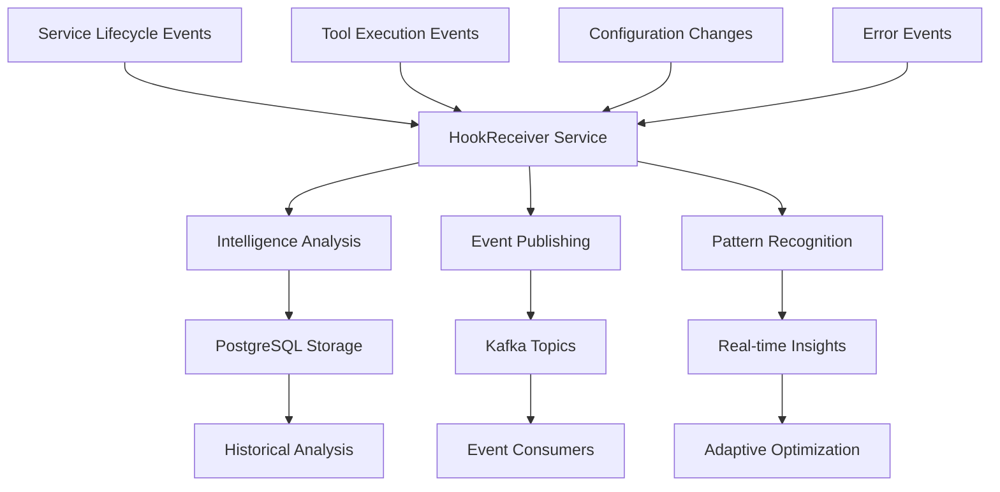

# Hook Events and Payloads

## Overview

This document defines all hook event types, their payloads, and usage patterns in the OmniNode Bridge ecosystem. Hooks provide a powerful mechanism for capturing intelligence from service lifecycle events, tool executions, and system behaviors in real-time.

## Hook System Architecture



## Hook Registration and Delivery

### Hook Registration Process

Services register hooks by sending registration requests to the HookReceiver service:

```python
# Hook registration example
hook_registration = {
    "service_name": "omniagent",
    "hook_types": [
        "service.lifecycle.started",
        "service.lifecycle.stopped",
        "tool.execution.completed"
    ],
    "delivery_endpoint": "http://omniagent:8000/hooks/receive",
    "authentication": {
        "type": "bearer_token",
        "token": "service_auth_token"
    },
    "retry_policy": {
        "max_retries": 3,
        "retry_delay_ms": 1000,
        "exponential_backoff": true
    }
}
```

### Hook Delivery Format

All hooks are delivered in a standardized format:

```json
{
  "hook_delivery_id": "delivery_550e8400-e29b-41d4-a716-446655440000",
  "hook_type": "service.lifecycle.started",
  "timestamp": "2024-01-15T10:30:00Z",
  "source_service": "hook-receiver",
  "target_service": "omniagent",
  "correlation_id": "corr_550e8400-e29b-41d4-a716-446655440000",
  "intelligence_metadata": {
    "patterns_detected": 3,
    "confidence_score": 0.87,
    "processing_time_ms": 245
  },
  "payload": {}
}
```

## Service Lifecycle Hook Events

### Service Started Hook

**Event Type**: `service.lifecycle.started`
**Description**: Triggered when a service successfully starts and becomes available

**Payload Structure**:
```json
{
  "service_info": {
    "name": "omniagent",
    "version": "1.2.3",
    "type": "agent_service",
    "instance_id": "omniagent-prod-001",
    "host": "10.0.1.15",
    "port": 8000,
    "process_id": 12345,
    "startup_command": "python -m omniagent.main",
    "working_directory": "/app/omniagent",
    "environment": "production"
  },
  "capabilities": {
    "tools": [
      {
        "name": "code_generator",
        "version": "2.1.0",
        "category": "code_generation",
        "input_types": ["requirements", "specifications"],
        "output_types": ["source_code", "documentation"]
      },
      {
        "name": "test_generator",
        "version": "1.8.0",
        "category": "testing",
        "input_types": ["source_code"],
        "output_types": ["test_cases", "test_coverage"]
      }
    ],
    "integrations": [
      {
        "type": "database",
        "name": "postgresql",
        "connection_pool_size": 20
      },
      {
        "type": "message_broker",
        "name": "kafka",
        "consumer_groups": ["omniagent-events"]
      }
    ]
  },
  "startup_metrics": {
    "startup_time_ms": 3500,
    "memory_usage_mb": 245,
    "cpu_cores_allocated": 2,
    "initialization_steps": [
      {
        "step": "load_configuration",
        "duration_ms": 150,
        "status": "success",
        "details": {
          "config_source": "consul",
          "config_keys_loaded": 47
        }
      },
      {
        "step": "initialize_database",
        "duration_ms": 250,
        "status": "success",
        "details": {
          "connection_pool_size": 20,
          "migration_version": "v1.2.3"
        }
      },
      {
        "step": "register_tools",
        "duration_ms": 100,
        "status": "success",
        "details": {
          "tools_registered": 15,
          "capabilities_exported": 8
        }
      },
      {
        "step": "start_health_checks",
        "duration_ms": 50,
        "status": "success",
        "details": {
          "health_check_interval": 30,
          "readiness_check_enabled": true
        }
      }
    ]
  },
  "dependencies": {
    "required_services": [
      {
        "service": "omnimcp",
        "version": ">=1.0.0",
        "status": "available",
        "response_time_ms": 15
      },
      {
        "service": "omnimemory",
        "version": ">=2.1.0",
        "status": "available",
        "response_time_ms": 8
      }
    ],
    "optional_services": [
      {
        "service": "omniplan",
        "version": ">=1.5.0",
        "status": "available",
        "response_time_ms": 12
      }
    ]
  }
}
```

**Intelligence Opportunities**:
- Startup performance pattern analysis
- Dependency reliability assessment
- Resource utilization optimization
- Service health prediction

### Service Stopped Hook

**Event Type**: `service.lifecycle.stopped`
**Description**: Triggered when a service is shutting down

**Payload Structure**:
```json
{
  "service_info": {
    "name": "omniagent",
    "instance_id": "omniagent-prod-001",
    "version": "1.2.3"
  },
  "shutdown_info": {
    "shutdown_reason": "graceful_shutdown",
    "shutdown_initiated_by": "kubernetes",
    "shutdown_signal": "SIGTERM",
    "uptime_seconds": 86400,
    "shutdown_time_ms": 5000
  },
  "final_metrics": {
    "total_requests_processed": 15420,
    "total_errors_encountered": 23,
    "avg_response_time_ms": 150,
    "peak_memory_usage_mb": 512,
    "peak_cpu_usage_percent": 85.5,
    "active_connections_at_shutdown": 12
  },
  "cleanup_operations": [
    {
      "operation": "drain_active_connections",
      "duration_ms": 2000,
      "status": "success",
      "details": {
        "connections_drained": 12,
        "graceful_closure": true
      }
    },
    {
      "operation": "flush_pending_work",
      "duration_ms": 1500,
      "status": "success",
      "details": {
        "tasks_completed": 8,
        "tasks_aborted": 0
      }
    },
    {
      "operation": "close_database_connections",
      "duration_ms": 300,
      "status": "success",
      "details": {
        "connections_closed": 20,
        "uncommitted_transactions": 0
      }
    },
    {
      "operation": "deregister_from_consul",
      "duration_ms": 100,
      "status": "success",
      "details": {
        "service_deregistered": true
      }
    }
  ],
  "state_preservation": {
    "state_saved": true,
    "state_location": "/data/omniagent/state/final_state.json",
    "state_size_bytes": 15420,
    "recovery_info": {
      "recovery_possible": true,
      "estimated_recovery_time_ms": 2000
    }
  }
}
```

**Intelligence Opportunities**:
- Shutdown performance analysis
- Resource cleanup efficiency
- Graceful degradation patterns
- Recovery time optimization

### Service Health Changed Hook

**Event Type**: `service.lifecycle.health_changed`
**Description**: Triggered when service health status changes

**Payload Structure**:
```json
{
  "service_info": {
    "name": "omniagent",
    "instance_id": "omniagent-prod-001"
  },
  "health_transition": {
    "previous_status": "healthy",
    "current_status": "degraded",
    "transition_time": "2024-01-15T10:45:00Z",
    "change_duration_ms": 500,
    "trigger_event": "database_connection_timeout"
  },
  "health_details": {
    "overall_score": 0.65,
    "component_health": {
      "database_connection": {
        "status": "degraded",
        "score": 0.4,
        "details": {
          "active_connections": 15,
          "max_connections": 20,
          "avg_response_time_ms": 850,
          "timeout_rate": 0.15
        }
      },
      "external_apis": {
        "status": "healthy",
        "score": 0.95,
        "details": {
          "omnimcp_api": "healthy",
          "omnimemory_api": "healthy",
          "response_time_avg_ms": 45
        }
      },
      "memory_usage": {
        "status": "warning",
        "score": 0.7,
        "details": {
          "current_usage_mb": 410,
          "limit_mb": 512,
          "usage_trend": "increasing"
        }
      },
      "cpu_usage": {
        "status": "healthy",
        "score": 0.9,
        "details": {
          "current_usage_percent": 45.2,
          "avg_usage_percent": 38.5
        }
      }
    }
  },
  "impact_assessment": {
    "affected_capabilities": [
      "code_generation",
      "large_file_processing"
    ],
    "performance_impact": {
      "response_time_increase_percent": 35,
      "throughput_decrease_percent": 20,
      "error_rate_increase": 0.08
    },
    "user_impact": {
      "affected_users": 25,
      "degraded_operations": [
        "complex_code_generation",
        "large_documentation_processing"
      ]
    }
  },
  "recovery_actions": {
    "automatic_actions_taken": [
      {
        "action": "increase_database_timeout",
        "result": "partial_improvement",
        "improvement_percent": 15
      },
      {
        "action": "reduce_concurrent_requests",
        "result": "significant_improvement",
        "improvement_percent": 45
      }
    ],
    "manual_actions_recommended": [
      {
        "action": "restart_database_connection_pool",
        "urgency": "medium",
        "estimated_impact": "full_recovery"
      },
      {
        "action": "scale_out_database_instances",
        "urgency": "low",
        "estimated_impact": "prevent_future_degradation"
      }
    ]
  }
}
```

**Intelligence Opportunities**:
- Health degradation pattern analysis
- Predictive failure detection
- Automatic recovery optimization
- Capacity planning insights

## Tool Execution Hook Events

### Tool Executed Hook

**Event Type**: `tool.execution.completed`
**Description**: Triggered when a tool execution completes (success or failure)

**Payload Structure**:
```json
{
  "execution_info": {
    "tool_name": "code_analyzer",
    "tool_version": "2.1.0",
    "execution_id": "exec_550e8400-e29b-41d4-a716-446655440000",
    "execution_type": "synchronous",
    "requester_service": "omniplan",
    "executor_service": "omniagent",
    "execution_context": {
      "user_id": "user_12345",
      "session_id": "session_67890",
      "request_id": "req_550e8400-e29b-41d4-a716-446655440000",
      "priority": "normal"
    }
  },
  "execution_timeline": {
    "requested_at": "2024-01-15T10:35:00Z",
    "started_at": "2024-01-15T10:35:00.5Z",
    "completed_at": "2024-01-15T10:35:02.5Z",
    "total_duration_ms": 2500,
    "queue_time_ms": 500,
    "execution_time_ms": 2000,
    "phases": [
      {
        "phase": "input_validation",
        "duration_ms": 50,
        "status": "success"
      },
      {
        "phase": "preprocessing",
        "duration_ms": 200,
        "status": "success"
      },
      {
        "phase": "analysis",
        "duration_ms": 1500,
        "status": "success"
      },
      {
        "phase": "postprocessing",
        "duration_ms": 200,
        "status": "success"
      },
      {
        "phase": "result_formatting",
        "duration_ms": 50,
        "status": "success"
      }
    ]
  },
  "execution_result": {
    "status": "success",
    "result_type": "analysis_report",
    "output_size_bytes": 3240,
    "exit_code": 0,
    "warnings": [
      {
        "type": "performance",
        "message": "Large input file may impact performance",
        "code": "PERF_001"
      }
    ]
  },
  "resource_usage": {
    "cpu_usage": {
      "peak_percent": 45.2,
      "average_percent": 32.1,
      "cpu_seconds": 0.8
    },
    "memory_usage": {
      "peak_mb": 256,
      "average_mb": 180,
      "allocation_count": 1547
    },
    "io_operations": {
      "file_reads": 15,
      "file_writes": 3,
      "bytes_read": 150000,
      "bytes_written": 3240
    },
    "network_operations": {
      "requests_made": 0,
      "bytes_sent": 0,
      "bytes_received": 0
    }
  },
  "input_analysis": {
    "input_size_bytes": 15420,
    "input_type": "source_code",
    "input_characteristics": {
      "language": "python",
      "lines_of_code": 450,
      "complexity_score": 67,
      "file_count": 8
    },
    "preprocessing_applied": [
      "syntax_validation",
      "dependency_resolution",
      "AST_generation"
    ]
  },
  "quality_metrics": {
    "execution_quality_score": 0.92,
    "result_confidence": 0.87,
    "performance_score": 0.85,
    "factors": {
      "execution_stability": 0.95,
      "resource_efficiency": 0.88,
      "result_accuracy": 0.90,
      "timing_consistency": 0.92
    }
  },
  "intelligence_insights": {
    "patterns_detected": [
      {
        "pattern": "common_code_structure",
        "confidence": 0.89,
        "description": "Frequently used code patterns identified"
      },
      {
        "pattern": "optimization_opportunity",
        "confidence": 0.76,
        "description": "Code sections with optimization potential"
      }
    ],
    "recommendations": [
      {
        "type": "caching",
        "description": "Similar analysis could benefit from result caching",
        "potential_improvement": "40% faster execution"
      },
      {
        "type": "preprocessing",
        "description": "Input preprocessing could be optimized",
        "potential_improvement": "15% faster execution"
      }
    ]
  }
}
```

**Intelligence Opportunities**:
- Tool performance optimization
- Usage pattern analysis
- Resource allocation optimization
- Predictive scaling
- Quality trend analysis

### Tool Registration Hook

**Event Type**: `tool.registration.discovered`
**Description**: Triggered when a new tool is discovered and registered

**Payload Structure**:
```json
{
  "tool_info": {
    "name": "advanced_refactorer",
    "version": "1.0.0",
    "service_source": "omniagent",
    "category": "code_transformation",
    "subcategory": "refactoring",
    "description": "Advanced code refactoring with pattern recognition",
    "author": "OmniNode Team",
    "license": "MIT"
  },
  "capabilities": {
    "input_formats": [
      "source_code",
      "ast_representation",
      "refactoring_instructions"
    ],
    "output_formats": [
      "refactored_code",
      "refactoring_report",
      "change_summary"
    ],
    "supported_languages": [
      "python",
      "javascript",
      "typescript",
      "java"
    ],
    "features": [
      "dead_code_elimination",
      "function_extraction",
      "variable_renaming",
      "design_pattern_application"
    ]
  },
  "technical_specs": {
    "input_schema": {
      "type": "object",
      "properties": {
        "source_code": {"type": "string"},
        "language": {"type": "string", "enum": ["python", "javascript", "typescript", "java"]},
        "refactoring_type": {"type": "string"},
        "preserve_behavior": {"type": "boolean", "default": true}
      },
      "required": ["source_code", "language"]
    },
    "output_schema": {
      "type": "object",
      "properties": {
        "refactored_code": {"type": "string"},
        "changes_applied": {"type": "array"},
        "quality_improvement": {"type": "number"},
        "warnings": {"type": "array"}
      }
    },
    "execution_requirements": {
      "max_execution_time_ms": 45000,
      "memory_limit_mb": 1024,
      "cpu_intensive": true,
      "requires_filesystem": false,
      "requires_network": false
    }
  },
  "registration_context": {
    "discovery_method": "service_startup_scan",
    "discovery_timestamp": "2024-01-15T10:30:00Z",
    "registration_source": "automatic",
    "availability_check": {
      "status": "available",
      "response_time_ms": 25,
      "health_score": 0.98
    }
  },
  "integration_metadata": {
    "compatible_tools": [
      "code_analyzer",
      "test_generator",
      "documentation_generator"
    ],
    "workflow_patterns": [
      "analyze_then_refactor",
      "refactor_then_test",
      "refactor_then_document"
    ],
    "performance_characteristics": {
      "typical_execution_time_ms": 3500,
      "complexity_scaling": "linear",
      "memory_scaling": "logarithmic"
    }
  }
}
```

**Intelligence Opportunities**:
- Tool ecosystem mapping
- Capability gap analysis
- Workflow optimization
- Tool recommendation engine

## Configuration Hook Events

### Configuration Changed Hook

**Event Type**: `configuration.updated`
**Description**: Triggered when service configuration is updated

**Payload Structure**:
```json
{
  "change_info": {
    "configuration_path": "services.omniagent.database",
    "change_type": "update",
    "changed_keys": [
      "max_connections",
      "connection_timeout"
    ],
    "change_source": "consul_kv",
    "changed_by": "system_administrator",
    "change_reason": "performance_optimization",
    "change_timestamp": "2024-01-15T10:45:00Z"
  },
  "configuration_diff": {
    "previous_values": {
      "max_connections": 20,
      "connection_timeout": 30
    },
    "new_values": {
      "max_connections": 35,
      "connection_timeout": 45
    },
    "computed_changes": [
      {
        "key": "max_connections",
        "change_type": "increase",
        "change_percentage": 75,
        "impact_level": "medium"
      },
      {
        "key": "connection_timeout",
        "change_type": "increase",
        "change_percentage": 50,
        "impact_level": "low"
      }
    ]
  },
  "impact_assessment": {
    "affected_services": [
      {
        "service": "omniagent",
        "instances": ["omniagent-prod-001", "omniagent-prod-002"],
        "restart_required": true,
        "estimated_downtime_seconds": 30
      }
    ],
    "performance_impact": {
      "expected_improvement": {
        "database_throughput": "25% increase",
        "connection_reliability": "improved",
        "timeout_errors": "reduced by 60%"
      },
      "potential_risks": [
        {
          "risk": "increased_memory_usage",
          "probability": "medium",
          "mitigation": "monitor_memory_usage"
        }
      ]
    },
    "backward_compatibility": {
      "compatible": true,
      "migration_required": false,
      "rollback_supported": true
    }
  },
  "deployment_plan": {
    "deployment_strategy": "rolling_update",
    "phases": [
      {
        "phase": "validate_configuration",
        "estimated_duration_seconds": 10,
        "actions": ["syntax_check", "value_validation"]
      },
      {
        "phase": "update_consul",
        "estimated_duration_seconds": 5,
        "actions": ["push_to_consul_kv"]
      },
      {
        "phase": "restart_services",
        "estimated_duration_seconds": 120,
        "actions": ["graceful_restart", "health_check"]
      }
    ],
    "rollback_plan": {
      "automatic_rollback": true,
      "rollback_triggers": [
        "health_check_failure",
        "performance_degradation"
      ],
      "rollback_window_minutes": 15
    }
  }
}
```

**Intelligence Opportunities**:
- Configuration change impact analysis
- Automated rollback decision making
- Performance correlation tracking
- Change pattern optimization

## Error and Alert Hook Events

### Critical Error Hook

**Event Type**: `error.service.critical`
**Description**: Triggered when critical errors occur in services

**Payload Structure**:
```json
{
  "error_info": {
    "error_id": "error_550e8400-e29b-41d4-a716-446655440000",
    "service_name": "omniagent",
    "instance_id": "omniagent-prod-001",
    "error_type": "database_connection_failure",
    "severity": "critical",
    "error_category": "infrastructure",
    "first_occurrence": "2024-01-15T10:50:00Z",
    "occurrence_count": 5,
    "escalation_level": 2
  },
  "error_details": {
    "message": "Failed to connect to PostgreSQL database after 3 retries",
    "exception_type": "ConnectionTimeoutError",
    "stack_trace": "Traceback (most recent call last):\n  File...",
    "error_code": "DB_CONN_001",
    "related_errors": [
      "error_550e8400-e29b-41d4-a716-446655440001",
      "error_550e8400-e29b-41d4-a716-446655440002"
    ]
  },
  "context_information": {
    "request_context": {
      "request_id": "req_550e8400-e29b-41d4-a716-446655440000",
      "user_id": "user_12345",
      "operation": "tool_execution",
      "tool_name": "code_analyzer"
    },
    "system_context": {
      "timestamp": "2024-01-15T10:50:00Z",
      "environment": "production",
      "deployment_version": "v1.2.3",
      "system_load": {
        "cpu_usage_percent": 45.2,
        "memory_usage_percent": 78.5,
        "active_connections": 18
      }
    },
    "environmental_factors": {
      "recent_deployments": [
        {
          "service": "database",
          "timestamp": "2024-01-15T09:30:00Z",
          "version": "v12.8.0"
        }
      ],
      "infrastructure_changes": [
        {
          "type": "network_configuration",
          "timestamp": "2024-01-15T10:00:00Z"
        }
      ]
    }
  },
  "impact_assessment": {
    "immediate_impact": {
      "affected_users": 25,
      "affected_operations": [
        "code_analysis",
        "documentation_generation"
      ],
      "service_availability": "degraded",
      "data_integrity_risk": "low"
    },
    "cascading_effects": [
      {
        "service": "omniplan",
        "impact": "reduced_planning_capability",
        "severity": "medium"
      },
      {
        "service": "omnimemory",
        "impact": "delayed_storage_operations",
        "severity": "low"
      }
    ],
    "business_impact": {
      "revenue_impact": "minimal",
      "user_experience": "degraded",
      "sla_breach_risk": "medium"
    }
  },
  "recovery_actions": {
    "automatic_recovery": {
      "attempted": true,
      "actions_taken": [
        {
          "action": "database_reconnection_attempt",
          "result": "failed",
          "attempts": 3
        },
        {
          "action": "fallback_to_readonly_replica",
          "result": "partial_success",
          "capabilities_restored": 0.6
        },
        {
          "action": "circuit_breaker_activation",
          "result": "success",
          "protection_enabled": true
        }
      ]
    },
    "manual_intervention": {
      "required": true,
      "urgency": "high",
      "recommended_actions": [
        {
          "action": "investigate_database_connectivity",
          "priority": "critical",
          "estimated_time_minutes": 15
        },
        {
          "action": "check_network_configuration",
          "priority": "high",
          "estimated_time_minutes": 10
        }
      ],
      "escalation_contacts": [
        "database_team",
        "infrastructure_team"
      ]
    }
  },
  "diagnostic_data": {
    "logs_collected": [
      {
        "source": "application_logs",
        "lines_captured": 500,
        "time_window_minutes": 10
      },
      {
        "source": "database_logs",
        "lines_captured": 200,
        "time_window_minutes": 5
      }
    ],
    "metrics_snapshot": {
      "database_connections": {
        "active": 0,
        "idle": 0,
        "failed": 18
      },
      "network_latency_ms": 250,
      "error_rate_percent": 15.5
    },
    "health_checks": {
      "application_health": "degraded",
      "database_health": "critical",
      "network_health": "warning"
    }
  }
}
```

**Intelligence Opportunities**:
- Error pattern recognition
- Predictive failure analysis
- Automated recovery optimization
- Root cause correlation
- Incident response automation

## Hook Processing Intelligence

### Intelligence Analysis Engine

The HookReceiver service performs real-time intelligence analysis on all incoming hooks:

```python
# Intelligence analysis example
class HookIntelligenceAnalyzer:
    def __init__(self):
        self.pattern_detectors = [
            StartupPerformanceDetector(),
            ResourceUsagePatternDetector(),
            ErrorCorrelationDetector(),
            PerformanceTrendDetector(),
            CapacityPlanningDetector()
        ]

    async def analyze_hook(self, hook_event: dict) -> dict:
        """Analyze hook for intelligence patterns"""
        analysis_results = {
            "patterns_detected": [],
            "insights_generated": [],
            "recommendations": [],
            "confidence_scores": {}
        }

        for detector in self.pattern_detectors:
            if detector.can_process(hook_event['hook_type']):
                result = await detector.analyze(hook_event)
                analysis_results["patterns_detected"].extend(result.patterns)
                analysis_results["insights_generated"].extend(result.insights)
                analysis_results["recommendations"].extend(result.recommendations)
                analysis_results["confidence_scores"].update(result.confidence_scores)

        return analysis_results
```

This comprehensive hook events documentation provides complete reference for all hook types, payloads, and intelligence opportunities in the OmniNode Bridge ecosystem.
