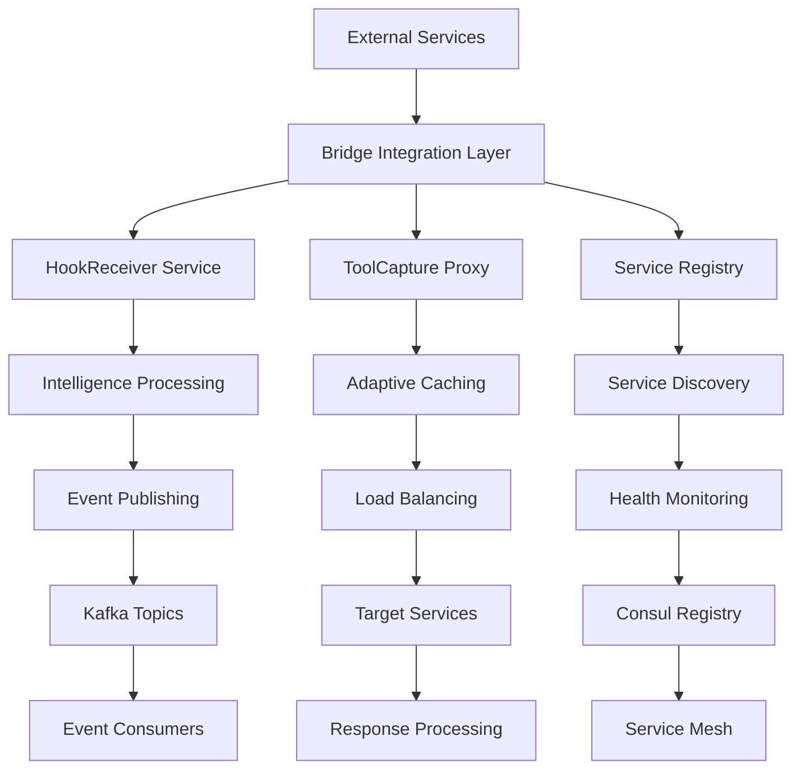

# Service Integration Patterns and Examples

## Overview

This document provides comprehensive integration patterns, examples, and best practices for integrating services with the OmniNode Bridge. It covers both service-to-bridge integration and bridge-to-service communication patterns.

## Integration Architecture



## Service Registration Integration

### Automatic Service Registration

Services can automatically register with the bridge during startup:

```python
# service_integration/auto_registration.py
import asyncio
import aiohttp
import consul
from typing import Dict, List, Optional

class BridgeServiceRegistration:
    def __init__(self, bridge_registry_url: str, consul_host: str):
        self.bridge_registry_url = bridge_registry_url
        self.consul_client = consul.aio.Consul(host=consul_host)
        self.registration_id = None

    async def register_service(self, service_config: Dict) -> str:
        """Register service with OmniNode Bridge"""

        registration_data = {
            "service_name": service_config["name"],
            "version": service_config["version"],
            "instance_id": service_config["instance_id"],
            "host": service_config["host"],
            "port": service_config["port"],
            "health_check_url": f"http://{service_config['host']}:{service_config['port']}/health",
            "capabilities": service_config.get("capabilities", []),
            "metadata": {
                "environment": service_config.get("environment", "development"),
                "region": service_config.get("region", "unknown"),
                "deployment_id": service_config.get("deployment_id"),
                "startup_time": datetime.utcnow().isoformat()
            },
            "ttl_seconds": 60
        }

        async with aiohttp.ClientSession() as session:
            async with session.post(
                f"{self.bridge_registry_url}/registry/services",
                json=registration_data,
                headers={"Content-Type": "application/json"}
            ) as response:
                if response.status == 200:
                    result = await response.json()
                    self.registration_id = result["data"]["registration_id"]

                    # Start heartbeat process
                    asyncio.create_task(self._heartbeat_loop())

                    return self.registration_id
                else:
                    raise Exception(f"Registration failed: {response.status}")

    async def _heartbeat_loop(self):
        """Maintain service registration with periodic updates"""
        while self.registration_id:
            try:
                await asyncio.sleep(30)  # Heartbeat every 30 seconds

                # Update registration with current status
                update_data = {
                    "health_status": await self._get_health_status(),
                    "load_factor": await self._get_load_factor(),
                    "metadata": {
                        "last_heartbeat": datetime.utcnow().isoformat(),
                        "active_connections": await self._get_active_connections(),
                        "memory_usage_mb": await self._get_memory_usage()
                    }
                }

                async with aiohttp.ClientSession() as session:
                    async with session.put(
                        f"{self.bridge_registry_url}/registry/services/{self.registration_id}",
                        json=update_data
                    ) as response:
                        if response.status != 200:
                            print(f"Heartbeat failed: {response.status}")

            except Exception as e:
                print(f"Heartbeat error: {e}")

    async def deregister_service(self):
        """Deregister service from bridge"""
        if self.registration_id:
            async with aiohttp.ClientSession() as session:
                async with session.delete(
                    f"{self.bridge_registry_url}/registry/services/{self.registration_id}"
                ) as response:
                    self.registration_id = None
                    return response.status == 200

# Usage example
class OmniAgentService:
    def __init__(self):
        self.bridge_registration = BridgeServiceRegistration(
            bridge_registry_url="http://service-registry:8000",
            consul_host="consul"
        )

    async def startup(self):
        """Service startup with bridge registration"""
        service_config = {
            "name": "omniagent",
            "version": "1.2.3",
            "instance_id": f"omniagent-{socket.gethostname()}-{os.getpid()}",
            "host": await self._get_local_ip(),
            "port": 8000,
            "capabilities": [
                "code_generation",
                "documentation",
                "testing",
                "refactoring"
            ],
            "environment": os.getenv("ENVIRONMENT", "development"),
            "region": os.getenv("AWS_REGION", "us-west-2")
        }

        registration_id = await self.bridge_registration.register_service(service_config)
        print(f"Registered with bridge: {registration_id}")

        # Register shutdown handler
        atexit.register(self._shutdown_handler)

    def _shutdown_handler(self):
        """Clean shutdown with deregistration"""
        asyncio.run(self.bridge_registration.deregister_service())
```

### Tool Registration Integration

Services can register their tools for discovery and routing:

```python
# service_integration/tool_registration.py
from typing import Dict, Any, List
import json

class ToolRegistrationClient:
    def __init__(self, bridge_registry_url: str):
        self.bridge_registry_url = bridge_registry_url

    async def register_tool(self, tool_definition: Dict[str, Any]) -> str:
        """Register a tool with the bridge"""

        registration_data = {
            "tool_name": tool_definition["name"],
            "version": tool_definition["version"],
            "service_source": tool_definition["service_source"],
            "category": tool_definition["category"],
            "description": tool_definition["description"],
            "input_schema": tool_definition["input_schema"],
            "output_schema": tool_definition["output_schema"],
            "execution_requirements": tool_definition.get("execution_requirements", {}),
            "metadata": {
                "author": tool_definition.get("author", "Unknown"),
                "license": tool_definition.get("license", "MIT"),
                "documentation_url": tool_definition.get("documentation_url"),
                "source_code_url": tool_definition.get("source_code_url")
            }
        }

        async with aiohttp.ClientSession() as session:
            async with session.post(
                f"{self.bridge_registry_url}/registry/tools",
                json=registration_data
            ) as response:
                if response.status == 200:
                    result = await response.json()
                    return result["data"]["tool_id"]
                else:
                    raise Exception(f"Tool registration failed: {response.status}")

    async def register_multiple_tools(self, tools: List[Dict[str, Any]]) -> List[str]:
        """Register multiple tools in batch"""
        tool_ids = []

        for tool in tools:
            try:
                tool_id = await self.register_tool(tool)
                tool_ids.append(tool_id)
                print(f"Registered tool {tool['name']}: {tool_id}")
            except Exception as e:
                print(f"Failed to register tool {tool['name']}: {e}")

        return tool_ids

# Tool definition examples
OMNIAGENT_TOOLS = [
    {
        "name": "code_generator",
        "version": "2.1.0",
        "service_source": "omniagent",
        "category": "code_generation",
        "description": "Generate high-quality code from specifications",
        "input_schema": {
            "type": "object",
            "properties": {
                "requirements": {"type": "string", "description": "Code requirements"},
                "language": {"type": "string", "enum": ["python", "javascript", "typescript", "java"]},
                "style_guide": {"type": "string", "description": "Coding style preferences"},
                "include_tests": {"type": "boolean", "default": False},
                "include_docs": {"type": "boolean", "default": True}
            },
            "required": ["requirements", "language"]
        },
        "output_schema": {
            "type": "object",
            "properties": {
                "generated_code": {"type": "string"},
                "test_code": {"type": "string"},
                "documentation": {"type": "string"},
                "quality_score": {"type": "number", "minimum": 0, "maximum": 100},
                "recommendations": {"type": "array", "items": {"type": "string"}}
            }
        },
        "execution_requirements": {
            "max_execution_time_ms": 30000,
            "memory_limit_mb": 512,
            "cpu_intensive": True,
            "requires_filesystem": False,
            "requires_network": False
        }
    },
    {
        "name": "code_analyzer",
        "version": "2.0.0",
        "service_source": "omniagent",
        "category": "code_analysis",
        "description": "Analyze code quality, security, and performance",
        "input_schema": {
            "type": "object",
            "properties": {
                "source_code": {"type": "string"},
                "language": {"type": "string"},
                "analysis_types": {
                    "type": "array",
                    "items": {"type": "string", "enum": ["quality", "security", "performance", "complexity"]},
                    "default": ["quality"]
                },
                "severity_threshold": {"type": "string", "enum": ["low", "medium", "high"], "default": "medium"}
            },
            "required": ["source_code", "language"]
        },
        "output_schema": {
            "type": "object",
            "properties": {
                "overall_score": {"type": "number", "minimum": 0, "maximum": 100},
                "issues": {
                    "type": "array",
                    "items": {
                        "type": "object",
                        "properties": {
                            "type": {"type": "string"},
                            "severity": {"type": "string"},
                            "line": {"type": "integer"},
                            "message": {"type": "string"},
                            "suggestion": {"type": "string"}
                        }
                    }
                },
                "metrics": {"type": "object"},
                "recommendations": {"type": "array", "items": {"type": "string"}}
            }
        },
        "execution_requirements": {
            "max_execution_time_ms": 20000,
            "memory_limit_mb": 256,
            "cpu_intensive": False,
            "requires_filesystem": False,
            "requires_network": False
        }
    }
]

# Usage in service startup
async def register_service_tools():
    tool_client = ToolRegistrationClient("http://service-registry:8000")
    tool_ids = await tool_client.register_multiple_tools(OMNIAGENT_TOOLS)
    print(f"Registered {len(tool_ids)} tools with bridge")
```

## Hook Integration Patterns

### Service Lifecycle Hooks

Services can send lifecycle events to capture intelligence:

```python
# service_integration/lifecycle_hooks.py
import aiohttp
from datetime import datetime
from typing import Dict, List

class LifecycleHookSender:
    def __init__(self, hook_receiver_url: str, service_info: Dict):
        self.hook_receiver_url = hook_receiver_url
        self.service_info = service_info

    async def send_startup_hook(self, startup_metrics: Dict):
        """Send service startup hook"""
        hook_data = {
            "hook_type": "service_started",
            "service_info": {
                "name": self.service_info["name"],
                "version": self.service_info["version"],
                "type": self.service_info.get("type", "service"),
                "instance_id": self.service_info["instance_id"],
                "host": self.service_info["host"],
                "port": self.service_info["port"],
                "process_id": os.getpid(),
                "startup_command": " ".join(sys.argv),
                "working_directory": os.getcwd(),
                "environment": os.getenv("ENVIRONMENT", "development")
            },
            "capabilities": self.service_info.get("capabilities", {}),
            "startup_metrics": startup_metrics,
            "dependencies": self.service_info.get("dependencies", {})
        }

        await self._send_hook("service/lifecycle", hook_data)

    async def send_shutdown_hook(self, shutdown_info: Dict):
        """Send service shutdown hook"""
        hook_data = {
            "hook_type": "service_stopped",
            "service_info": {
                "name": self.service_info["name"],
                "instance_id": self.service_info["instance_id"],
                "version": self.service_info["version"]
            },
            "shutdown_info": shutdown_info
        }

        await self._send_hook("service/lifecycle", hook_data)

    async def send_health_change_hook(self, health_change: Dict):
        """Send health status change hook"""
        hook_data = {
            "hook_type": "health_changed",
            "service_info": {
                "name": self.service_info["name"],
                "instance_id": self.service_info["instance_id"]
            },
            "health_change": health_change
        }

        await self._send_hook("service/lifecycle", hook_data)

    async def _send_hook(self, endpoint: str, hook_data: Dict):
        """Send hook to bridge"""
        try:
            async with aiohttp.ClientSession() as session:
                async with session.post(
                    f"{self.hook_receiver_url}/hooks/{endpoint}",
                    json=hook_data,
                    headers={
                        "Content-Type": "application/json",
                        "X-Service-Auth": os.getenv("SERVICE_AUTH_TOKEN")
                    }
                ) as response:
                    if response.status == 200:
                        result = await response.json()
                        print(f"Hook sent successfully: {result['data']['hook_id']}")
                    else:
                        print(f"Hook failed: {response.status}")
        except Exception as e:
            print(f"Hook sending error: {e}")

# Usage example with startup metrics collection
class ServiceWithHooks:
    def __init__(self):
        self.startup_time = datetime.utcnow()
        self.hook_sender = LifecycleHookSender(
            hook_receiver_url="http://hook-receiver:8000",
            service_info={
                "name": "omniagent",
                "version": "1.2.3",
                "instance_id": f"omniagent-{socket.gethostname()}-{os.getpid()}",
                "host": "10.0.1.15",
                "port": 8000,
                "capabilities": {
                    "tools": ["code_generator", "code_analyzer"],
                    "integrations": ["database", "kafka"]
                }
            }
        )

    async def startup(self):
        """Service startup with metrics collection"""
        initialization_steps = []

        # Step 1: Load configuration
        step_start = datetime.utcnow()
        await self._load_configuration()
        step_duration = (datetime.utcnow() - step_start).total_seconds() * 1000
        initialization_steps.append({
            "step": "load_configuration",
            "duration_ms": step_duration,
            "status": "success",
            "details": {"config_source": "consul", "config_keys_loaded": 47}
        })

        # Step 2: Initialize database
        step_start = datetime.utcnow()
        await self._initialize_database()
        step_duration = (datetime.utcnow() - step_start).total_seconds() * 1000
        initialization_steps.append({
            "step": "initialize_database",
            "duration_ms": step_duration,
            "status": "success",
            "details": {"connection_pool_size": 20}
        })

        # Calculate total startup time
        total_startup_time = (datetime.utcnow() - self.startup_time).total_seconds() * 1000

        startup_metrics = {
            "startup_time_ms": total_startup_time,
            "memory_usage_mb": self._get_memory_usage(),
            "cpu_cores_allocated": os.cpu_count(),
            "initialization_steps": initialization_steps
        }

        # Send startup hook
        await self.hook_sender.send_startup_hook(startup_metrics)

    async def shutdown(self):
        """Service shutdown with metrics collection"""
        shutdown_start = datetime.utcnow()
        uptime = (shutdown_start - self.startup_time).total_seconds()

        # Collect final metrics
        final_metrics = {
            "total_requests_processed": await self._get_request_count(),
            "total_errors_encountered": await self._get_error_count(),
            "avg_response_time_ms": await self._get_avg_response_time(),
            "peak_memory_usage_mb": await self._get_peak_memory_usage(),
            "active_connections_at_shutdown": await self._get_active_connections()
        }

        # Perform cleanup operations
        cleanup_operations = []

        # Drain connections
        step_start = datetime.utcnow()
        await self._drain_connections()
        step_duration = (datetime.utcnow() - step_start).total_seconds() * 1000
        cleanup_operations.append({
            "operation": "drain_active_connections",
            "duration_ms": step_duration,
            "status": "success",
            "details": {"connections_drained": 12}
        })

        # Save state
        step_start = datetime.utcnow()
        await self._save_state()
        step_duration = (datetime.utcnow() - step_start).total_seconds() * 1000
        cleanup_operations.append({
            "operation": "save_state",
            "duration_ms": step_duration,
            "status": "success",
            "details": {"state_saved": True}
        })

        shutdown_time = (datetime.utcnow() - shutdown_start).total_seconds() * 1000

        shutdown_info = {
            "shutdown_reason": "graceful_shutdown",
            "shutdown_initiated_by": "kubernetes",
            "uptime_seconds": uptime,
            "shutdown_time_ms": shutdown_time,
            "final_metrics": final_metrics,
            "cleanup_operations": cleanup_operations
        }

        # Send shutdown hook
        await self.hook_sender.send_shutdown_hook(shutdown_info)
```

### Tool Execution Hooks

Services can send tool execution events for intelligence gathering:

```python
# service_integration/tool_execution_hooks.py
import time
import psutil
from typing import Dict, Any

class ToolExecutionHookSender:
    def __init__(self, hook_receiver_url: str):
        self.hook_receiver_url = hook_receiver_url

    async def send_tool_execution_hook(self, execution_data: Dict[str, Any]):
        """Send tool execution completion hook"""
        hook_data = {
            "hook_type": "tool_executed",
            "execution_info": execution_data["execution_info"],
            "execution_timeline": execution_data["execution_timeline"],
            "execution_result": execution_data["execution_result"],
            "resource_usage": execution_data["resource_usage"],
            "input_analysis": execution_data.get("input_analysis", {}),
            "quality_metrics": execution_data.get("quality_metrics", {}),
            "intelligence_insights": execution_data.get("intelligence_insights", {})
        }

        await self._send_hook("tool/execution", hook_data)

    async def _send_hook(self, endpoint: str, hook_data: Dict):
        """Send hook to bridge"""
        async with aiohttp.ClientSession() as session:
            async with session.post(
                f"{self.hook_receiver_url}/hooks/{endpoint}",
                json=hook_data
            ) as response:
                return response.status == 200

# Tool execution wrapper with hooks
class InstrumentedToolExecutor:
    def __init__(self, hook_sender: ToolExecutionHookSender):
        self.hook_sender = hook_sender

    async def execute_tool_with_hooks(self, tool_name: str, tool_function, input_data: Dict, context: Dict):
        """Execute tool with comprehensive hook generation"""
        execution_id = str(uuid.uuid4())
        start_time = time.time()

        # Initialize metrics collection
        process = psutil.Process()
        initial_memory = process.memory_info().rss / 1024 / 1024  # MB
        initial_cpu_time = process.cpu_times()

        execution_info = {
            "tool_name": tool_name,
            "tool_version": context.get("tool_version", "unknown"),
            "execution_id": execution_id,
            "execution_type": "synchronous",
            "requester_service": context.get("requester_service"),
            "executor_service": context.get("executor_service"),
            "execution_context": {
                "user_id": context.get("user_id"),
                "session_id": context.get("session_id"),
                "request_id": context.get("request_id"),
                "priority": context.get("priority", "normal")
            }
        }

        phases = []
        execution_result = None
        error = None

        try:
            # Phase 1: Input validation
            phase_start = time.time()
            validated_input = await self._validate_input(input_data)
            phase_duration = (time.time() - phase_start) * 1000
            phases.append({
                "phase": "input_validation",
                "duration_ms": phase_duration,
                "status": "success"
            })

            # Phase 2: Preprocessing
            phase_start = time.time()
            preprocessed_input = await self._preprocess_input(validated_input)
            phase_duration = (time.time() - phase_start) * 1000
            phases.append({
                "phase": "preprocessing",
                "duration_ms": phase_duration,
                "status": "success"
            })

            # Phase 3: Tool execution
            phase_start = time.time()
            result = await tool_function(preprocessed_input)
            phase_duration = (time.time() - phase_start) * 1000
            phases.append({
                "phase": "execution",
                "duration_ms": phase_duration,
                "status": "success"
            })

            # Phase 4: Postprocessing
            phase_start = time.time()
            execution_result = await self._postprocess_result(result)
            phase_duration = (time.time() - phase_start) * 1000
            phases.append({
                "phase": "postprocessing",
                "duration_ms": phase_duration,
                "status": "success"
            })

        except Exception as e:
            error = e
            phases.append({
                "phase": "error_handling",
                "duration_ms": 0,
                "status": "failed",
                "error": str(e)
            })

        end_time = time.time()
        total_duration = (end_time - start_time) * 1000

        # Collect resource usage metrics
        final_memory = process.memory_info().rss / 1024 / 1024  # MB
        final_cpu_time = process.cpu_times()

        cpu_usage = {
            "peak_percent": 0,  # Would need more sophisticated monitoring
            "average_percent": 0,
            "cpu_seconds": (final_cpu_time.user - initial_cpu_time.user) +
                          (final_cpu_time.system - initial_cpu_time.system)
        }

        memory_usage = {
            "peak_mb": max(initial_memory, final_memory),
            "average_mb": (initial_memory + final_memory) / 2,
            "allocation_count": 0  # Would need memory profiling
        }

        # Prepare execution data for hook
        execution_data = {
            "execution_info": execution_info,
            "execution_timeline": {
                "requested_at": datetime.fromtimestamp(start_time).isoformat(),
                "started_at": datetime.fromtimestamp(start_time).isoformat(),
                "completed_at": datetime.fromtimestamp(end_time).isoformat(),
                "total_duration_ms": total_duration,
                "queue_time_ms": 0,  # Would need queue monitoring
                "execution_time_ms": total_duration,
                "phases": phases
            },
            "execution_result": {
                "status": "success" if not error else "failed",
                "result_type": type(execution_result).__name__ if execution_result else "error",
                "output_size_bytes": len(str(execution_result)) if execution_result else 0,
                "exit_code": 0 if not error else 1,
                "error": str(error) if error else None
            },
            "resource_usage": {
                "cpu_usage": cpu_usage,
                "memory_usage": memory_usage,
                "io_operations": {
                    "file_reads": 0,  # Would need IO monitoring
                    "file_writes": 0,
                    "bytes_read": 0,
                    "bytes_written": 0
                },
                "network_operations": {
                    "requests_made": 0,
                    "bytes_sent": 0,
                    "bytes_received": 0
                }
            }
        }

        # Send hook
        await self.hook_sender.send_tool_execution_hook(execution_data)

        if error:
            raise error

        return execution_result
```

## Proxy Integration Patterns

### Intelligent Proxy Usage

Services can route requests through the bridge proxy for adaptive caching and load balancing:

```python
# service_integration/proxy_client.py
import aiohttp
from typing import Dict, Any, Optional

class BridgeProxyClient:
    def __init__(self, proxy_url: str):
        self.proxy_url = proxy_url

    async def execute_tool_via_proxy(
        self,
        tool_name: str,
        target_service: str,
        input_data: Dict[str, Any],
        execution_options: Optional[Dict[str, Any]] = None
    ) -> Dict[str, Any]:
        """Execute tool through the bridge proxy"""

        if execution_options is None:
            execution_options = {}

        request_data = {
            "target_service": target_service,
            "input_data": input_data,
            "execution_options": {
                "timeout_seconds": execution_options.get("timeout_seconds", 30),
                "priority": execution_options.get("priority", "normal"),
                "cache_policy": execution_options.get("cache_policy", "adaptive"),
                "retry_policy": execution_options.get("retry_policy", "default")
            }
        }

        async with aiohttp.ClientSession() as session:
            async with session.post(
                f"{self.proxy_url}/proxy/tool/{tool_name}",
                json=request_data,
                headers={
                    "Content-Type": "application/json",
                    "X-Request-ID": str(uuid.uuid4()),
                    "X-Correlation-ID": execution_options.get("correlation_id", str(uuid.uuid4())),
                    "X-Service-Auth": os.getenv("SERVICE_AUTH_TOKEN")
                }
            ) as response:
                if response.status == 200:
                    result = await response.json()
                    return result["data"]
                else:
                    error_data = await response.json()
                    raise Exception(f"Proxy execution failed: {error_data}")

    async def get_service_health_via_proxy(self, service_name: str) -> Dict[str, Any]:
        """Get service health through proxy"""
        async with aiohttp.ClientSession() as session:
            async with session.get(
                f"{self.proxy_url}/proxy/health/{service_name}"
            ) as response:
                if response.status == 200:
                    result = await response.json()
                    return result["data"]
                else:
                    raise Exception(f"Health check failed: {response.status}")

    async def invalidate_cache(self, cache_pattern: str = None):
        """Invalidate proxy cache entries"""
        params = {"pattern": cache_pattern} if cache_pattern else {}

        async with aiohttp.ClientSession() as session:
            async with session.delete(
                f"{self.proxy_url}/cache/clear",
                params=params
            ) as response:
                if response.status == 200:
                    result = await response.json()
                    return result["data"]
                else:
                    raise Exception(f"Cache invalidation failed: {response.status}")

# Usage example in OmniPlan service
class OmniPlanService:
    def __init__(self):
        self.proxy_client = BridgeProxyClient("http://tool-capture-proxy:8000")

    async def analyze_code_for_planning(self, source_code: str, language: str) -> Dict[str, Any]:
        """Analyze code through bridge proxy for intelligent caching"""

        analysis_result = await self.proxy_client.execute_tool_via_proxy(
            tool_name="code_analyzer",
            target_service="omniagent",
            input_data={
                "source_code": source_code,
                "language": language,
                "analysis_types": ["quality", "complexity"],
                "severity_threshold": "medium"
            },
            execution_options={
                "timeout_seconds": 45,
                "priority": "high",
                "cache_policy": "adaptive",  # Use intelligent caching
                "correlation_id": str(uuid.uuid4())
            }
        )

        # Process analysis result for planning
        planning_insights = {
            "code_quality_score": analysis_result["result"]["overall_score"],
            "complexity_issues": [
                issue for issue in analysis_result["result"]["issues"]
                if issue["type"] == "complexity"
            ],
            "refactoring_recommendations": analysis_result["result"]["recommendations"],
            "estimated_refactoring_effort": self._estimate_refactoring_effort(analysis_result)
        }

        return planning_insights

    async def generate_code_with_fallback(self, requirements: str, language: str) -> str:
        """Generate code with intelligent routing and fallback"""

        try:
            # Try primary service through proxy
            generation_result = await self.proxy_client.execute_tool_via_proxy(
                tool_name="code_generator",
                target_service="omniagent",
                input_data={
                    "requirements": requirements,
                    "language": language,
                    "include_tests": True,
                    "include_docs": True
                },
                execution_options={
                    "timeout_seconds": 60,
                    "priority": "normal",
                    "cache_policy": "adaptive"
                }
            )

            return generation_result["result"]["generated_code"]

        except Exception as e:
            print(f"Primary code generation failed: {e}")

            # Check service health and potentially retry
            health_status = await self.proxy_client.get_service_health_via_proxy("omniagent")

            if health_status["overall_health"] == "degraded":
                # Service is degraded, use fallback strategy
                return await self._fallback_code_generation(requirements, language)
            else:
                # Service is healthy, error might be transient
                raise e

    async def _fallback_code_generation(self, requirements: str, language: str) -> str:
        """Fallback code generation strategy"""
        # Implement fallback logic (e.g., simpler generation, cached templates)
        return f"# Fallback implementation for: {requirements}\n# Language: {language}\npass"
```

## Event Consumer Integration

### Bridge Event Consumption

Services can consume events from the bridge for real-time intelligence:

```python
# service_integration/event_consumer.py
import asyncio
from aiokafka import AIOKafkaConsumer
import json
from typing import Dict, Callable, List

class BridgeEventConsumer:
    def __init__(self, kafka_bootstrap_servers: str, consumer_group: str):
        self.kafka_servers = kafka_bootstrap_servers
        self.consumer_group = consumer_group
        self.event_handlers: Dict[str, List[Callable]] = {}
        self.consumer = None

    def register_handler(self, event_type: str, handler_func: Callable):
        """Register event handler for specific event type"""
        if event_type not in self.event_handlers:
            self.event_handlers[event_type] = []
        self.event_handlers[event_type].append(handler_func)

    async def start_consuming(self, topics: List[str]):
        """Start consuming events from specified topics"""
        self.consumer = AIOKafkaConsumer(
            *topics,
            bootstrap_servers=self.kafka_servers,
            group_id=self.consumer_group,
            value_deserializer=lambda x: json.loads(x.decode('utf-8'))
        )

        await self.consumer.start()

        try:
            async for message in self.consumer:
                await self._process_event(message.value)
        finally:
            await self.consumer.stop()

    async def _process_event(self, event_data: Dict):
        """Process incoming event"""
        event_type = event_data.get("event_type")

        if event_type in self.event_handlers:
            for handler in self.event_handlers[event_type]:
                try:
                    await handler(event_data)
                except Exception as e:
                    print(f"Event handler error for {event_type}: {e}")

# Usage example in OmniMemory service
class OmniMemoryService:
    def __init__(self):
        self.event_consumer = BridgeEventConsumer(
            kafka_bootstrap_servers="redpanda:9092",
            consumer_group="omnimemory-intelligence"
        )

        # Register event handlers
        self.event_consumer.register_handler(
            "intelligence.pattern.discovered",
            self.handle_pattern_discovery
        )
        self.event_consumer.register_handler(
            "tool.execution.completed",
            self.handle_tool_execution
        )
        self.event_consumer.register_handler(
            "service.lifecycle.health_changed",
            self.handle_health_change
        )

    async def start_intelligence_monitoring(self):
        """Start monitoring bridge intelligence events"""
        topics = [
            "intelligence.patterns",
            "intelligence.performance",
            "hooks.tool_execution",
            "hooks.service_lifecycle"
        ]

        await self.event_consumer.start_consuming(topics)

    async def handle_pattern_discovery(self, event_data: Dict):
        """Handle intelligence pattern discovery events"""
        pattern_info = event_data["payload"]["pattern_info"]

        # Store pattern in memory system
        memory_entry = {
            "type": "intelligence_pattern",
            "pattern_id": pattern_info["pattern_id"],
            "pattern_type": pattern_info["pattern_type"],
            "confidence_score": pattern_info["confidence_score"],
            "discovery_time": event_data["timestamp"],
            "pattern_data": pattern_info["pattern_data"],
            "actionable_insights": event_data["payload"]["actionable_insights"]
        }

        await self._store_memory_entry(memory_entry)

        # Trigger adaptive learning
        await self._update_learning_models(pattern_info)

    async def handle_tool_execution(self, event_data: Dict):
        """Handle tool execution completion events"""
        execution_info = event_data["payload"]["execution_info"]
        execution_result = event_data["payload"]["execution_result"]

        # Store execution history for learning
        execution_memory = {
            "type": "tool_execution_history",
            "tool_name": execution_info["tool_name"],
            "execution_id": execution_info["execution_id"],
            "timestamp": event_data["timestamp"],
            "success": execution_result["status"] == "success",
            "performance_metrics": event_data["payload"]["resource_usage"],
            "quality_metrics": event_data["payload"].get("quality_metrics", {})
        }

        await self._store_execution_history(execution_memory)

    async def handle_health_change(self, event_data: Dict):
        """Handle service health change events"""
        health_change = event_data["payload"]["health_transition"]
        service_info = event_data["payload"]["service_info"]

        # Update service health tracking
        health_record = {
            "type": "service_health_record",
            "service_name": service_info["name"],
            "instance_id": service_info["instance_id"],
            "timestamp": event_data["timestamp"],
            "previous_status": health_change["previous_status"],
            "current_status": health_change["current_status"],
            "change_reason": health_change["trigger_event"],
            "impact_assessment": event_data["payload"]["impact_assessment"]
        }

        await self._update_service_health_history(health_record)

        # Trigger predictive analysis if health is degrading
        if health_change["current_status"] in ["degraded", "unhealthy"]:
            await self._trigger_health_prediction_analysis(service_info, health_change)
```

## Configuration Integration

### Dynamic Configuration Updates

Services can integrate with the bridge's configuration management:

```python
# service_integration/config_integration.py
import consul.aio
from typing import Dict, Any, Callable

class BridgeConfigurationClient:
    def __init__(self, consul_host: str, service_name: str):
        self.consul = consul.aio.Consul(host=consul_host)
        self.service_name = service_name
        self.config_prefix = f"omninode-bridge/services/{service_name}"
        self.config_watchers: Dict[str, Callable] = {}

    async def get_configuration(self) -> Dict[str, Any]:
        """Get current service configuration"""
        _, data = await self.consul.kv.get(self.config_prefix, recurse=True)

        config = {}
        if data:
            for item in data:
                key = item['Key'].replace(f"{self.config_prefix}/", "")
                value = item['Value'].decode('utf-8')

                # Try to parse as JSON
                try:
                    value = json.loads(value)
                except:
                    pass

                # Build nested configuration
                keys = key.split('/')
                current = config
                for k in keys[:-1]:
                    current = current.setdefault(k, {})
                current[keys[-1]] = value

        return config

    async def update_configuration(self, key: str, value: Any):
        """Update configuration value"""
        full_key = f"{self.config_prefix}/{key}"

        if isinstance(value, (dict, list)):
            value = json.dumps(value)

        await self.consul.kv.put(full_key, str(value))

    def register_config_watcher(self, config_key: str, callback: Callable):
        """Register callback for configuration changes"""
        self.config_watchers[config_key] = callback

    async def start_config_watching(self):
        """Start watching for configuration changes"""
        index = None
        while True:
            try:
                index, data = await self.consul.kv.get(
                    self.config_prefix,
                    recurse=True,
                    index=index,
                    wait='30s'
                )

                if data:
                    # Process configuration changes
                    for item in data:
                        key = item['Key'].replace(f"{self.config_prefix}/", "")
                        if key in self.config_watchers:
                            value = item['Value'].decode('utf-8')
                            try:
                                value = json.loads(value)
                            except:
                                pass

                            await self.config_watchers[key](key, value)

            except Exception as e:
                print(f"Config watching error: {e}")
                await asyncio.sleep(5)

# Usage example
class ConfigurableService:
    def __init__(self):
        self.config_client = BridgeConfigurationClient(
            consul_host="consul",
            service_name="omniagent"
        )

        # Register configuration change handlers
        self.config_client.register_config_watcher(
            "database/max_connections",
            self.handle_database_config_change
        )
        self.config_client.register_config_watcher(
            "worker_pool_size",
            self.handle_worker_pool_change
        )

    async def handle_database_config_change(self, key: str, new_value: Any):
        """Handle database configuration changes"""
        print(f"Database config changed: {key} = {new_value}")

        # Update database connection pool
        await self._update_database_pool(new_value)

        # Send configuration change hook
        await self._send_config_change_hook(key, new_value)

    async def handle_worker_pool_change(self, key: str, new_value: Any):
        """Handle worker pool size changes"""
        print(f"Worker pool config changed: {key} = {new_value}")

        # Resize worker pool
        await self._resize_worker_pool(new_value)

        # Send configuration change hook
        await self._send_config_change_hook(key, new_value)
```

This comprehensive integration guide provides all the patterns and examples needed for services to effectively integrate with the OmniNode Bridge ecosystem, enabling intelligent coordination, adaptive optimization, and seamless service communication.
