# Comprehensive Architecture Guide

## Overview

This document provides detailed architectural documentation for the OmniNode Bridge system, including system diagrams, component interactions, data flows, and architectural decision records.

## Table of Contents

1. [System Architecture Overview](#system-architecture-overview)
2. [Component Architecture](#component-architecture)
3. [Data Flow Architecture](#data-flow-architecture)
4. [Security Architecture](#security-architecture)
5. [Deployment Architecture](#deployment-architecture)
6. [Architecture Decision Records](#architecture-decision-records)

## System Architecture Overview

### High-Level System Architecture

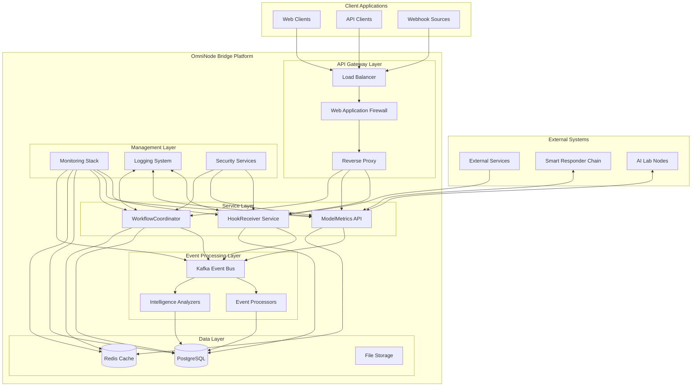

### Core Architectural Principles

1. **Microservices Architecture**: Loosely coupled, independently deployable services
2. **Event-Driven Architecture**: Asynchronous communication via Kafka event streaming
3. **API-First Design**: RESTful APIs with comprehensive OpenAPI specifications
4. **Security by Design**: Multi-layered security with authentication, authorization, and encryption
5. **Observability**: Comprehensive monitoring, logging, and tracing
6. **Scalability**: Horizontal scaling capabilities with load balancing
7. **Resilience**: Circuit breakers, retry mechanisms, and graceful degradation

## Component Architecture

### 1. HookReceiver Service Architecture

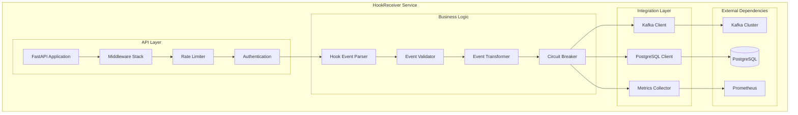

**Key Components:**
- **FastAPI Application**: Web framework providing REST API endpoints
- **Middleware Stack**: CORS, security headers, request logging
- **Rate Limiter**: IP-based rate limiting using slowapi
- **Authentication**: API key validation with dual header support
- **Event Parser**: Converts webhook payloads to internal event format
- **Event Validator**: Validates event structure and content
- **Event Transformer**: Transforms events based on source and type
- **Circuit Breaker**: Protects against downstream service failures

### 2. ModelMetrics API Architecture

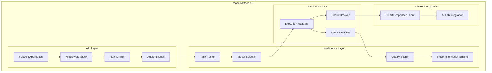

**Key Components:**
- **Task Router**: Routes requests to appropriate model execution paths
- **Model Selector**: Intelligent model selection based on task requirements
- **Quality Scorer**: Evaluates response quality using configurable metrics
- **Recommendation Engine**: Generates model recommendations based on historical data
- **Execution Manager**: Manages task execution with timeout and retry logic
- **Metrics Tracker**: Collects and stores execution metrics for analysis

### 3. WorkflowCoordinator Architecture

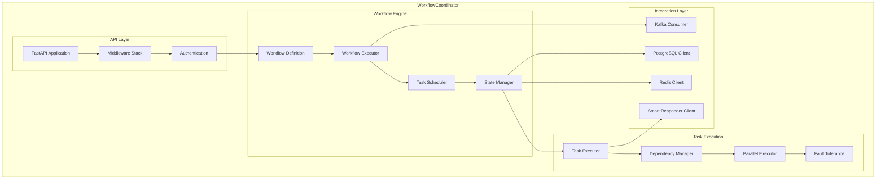

**Key Components:**
- **Workflow Definition**: Defines workflow structure, tasks, and dependencies
- **Workflow Executor**: Orchestrates workflow execution lifecycle
- **Task Scheduler**: Schedules tasks based on dependencies and resources
- **State Manager**: Manages workflow and task state persistence
- **Dependency Manager**: Resolves task dependencies and execution order
- **Parallel Executor**: Executes independent tasks in parallel
- **Fault Tolerance**: Handles failures with retry, compensation, and recovery

## Data Flow Architecture

### 1. Hook Processing Data Flow

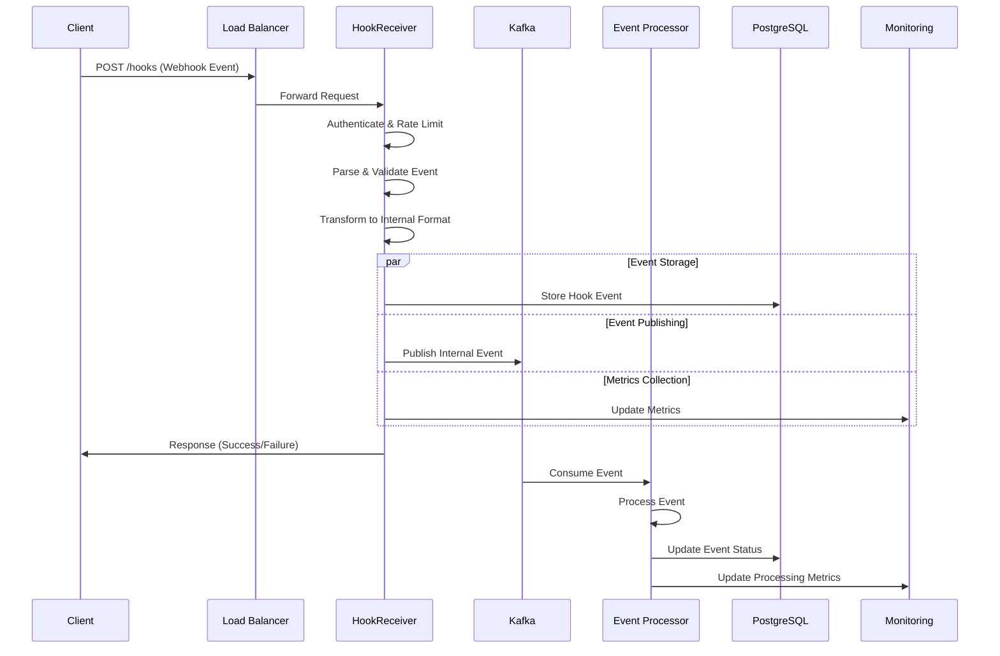

### 2. Model Execution Data Flow

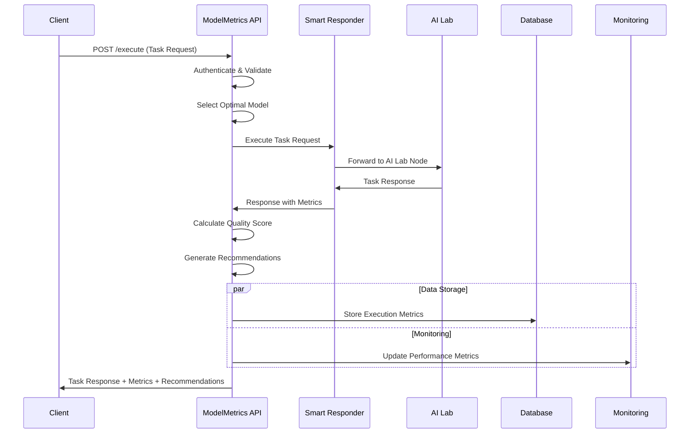

### 3. Workflow Execution Data Flow

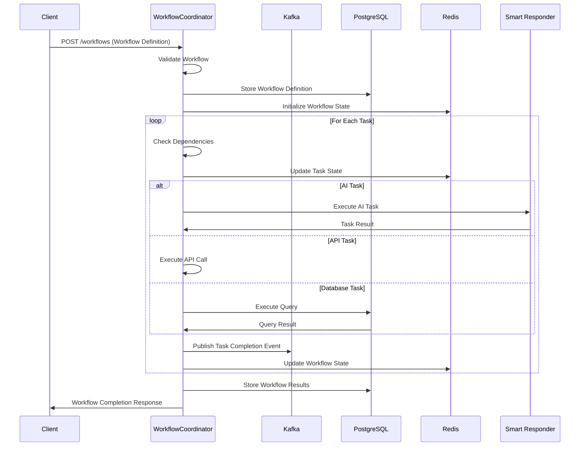

## Security Architecture

### 1. Multi-Layer Security Model

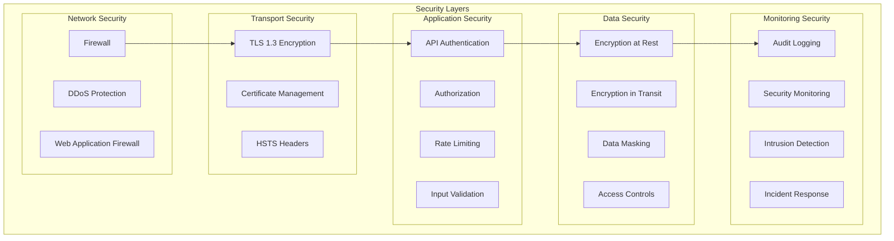

### 2. Authentication and Authorization Flow

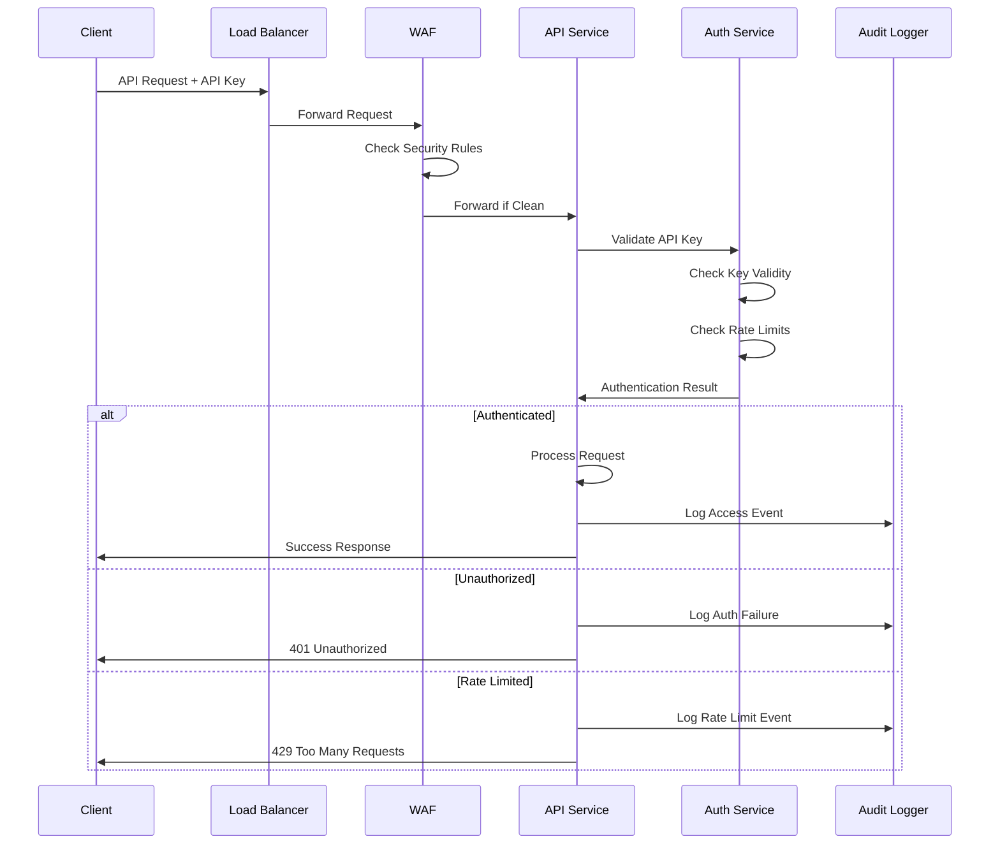

## Deployment Architecture

### 1. Container Orchestration Architecture

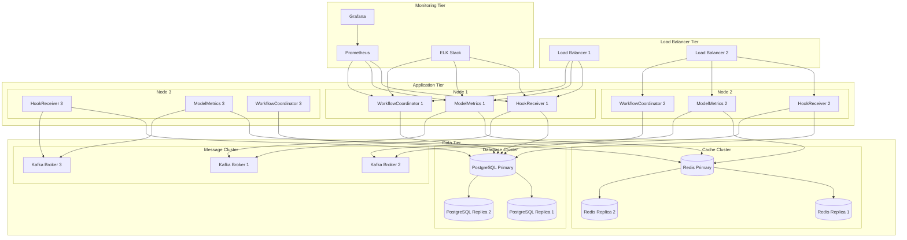

### 2. Network Architecture

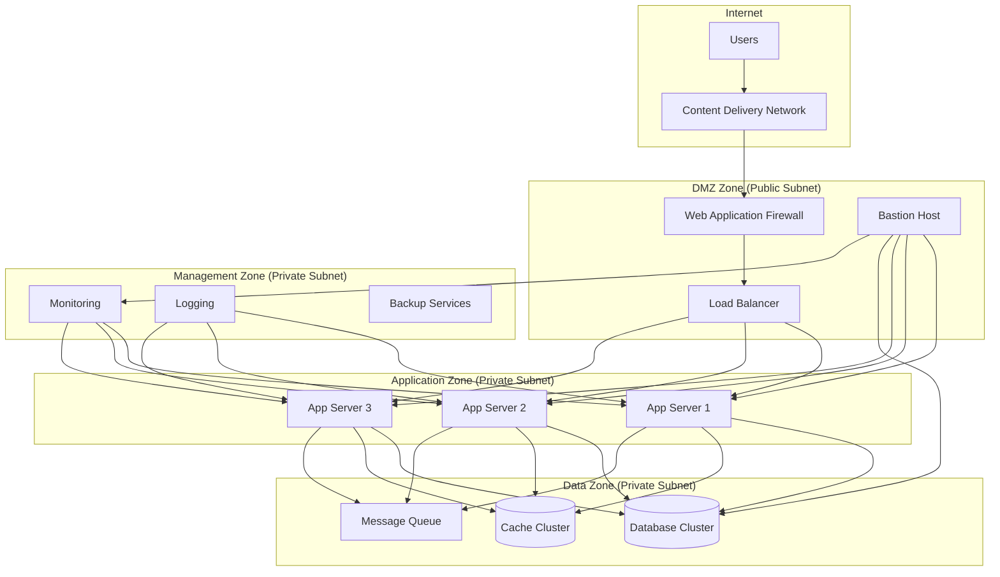

## Architecture Decision Records

### ADR-001: Microservices Architecture

**Status**: Accepted
**Date**: 2024-01-15
**Deciders**: Architecture Team

#### Context
OmniNode Bridge needs to support multiple distinct functional areas (webhook processing, model metrics, workflow coordination) with different scaling requirements and development cycles.

#### Decision
Adopt a microservices architecture with separate services for:
- HookReceiver: Webhook processing and event management
- ModelMetrics: AI model performance tracking and routing
- WorkflowCoordinator: Complex workflow orchestration

#### Consequences
**Positive:**
- Independent deployment and scaling of services
- Technology diversity (different optimization for each service)
- Team autonomy and parallel development
- Fault isolation and resilience

**Negative:**
- Increased operational complexity
- Network latency between services
- Distributed system challenges (consistency, monitoring)
- Additional infrastructure overhead

#### Compliance
This decision aligns with ONEX standards for distributed system architecture and supports the goal of building loosely coupled, independently deployable services.

---

### ADR-002: Event-Driven Architecture with Kafka

**Status**: Accepted
**Date**: 2024-01-16
**Deciders**: Architecture Team, Data Engineering Team

#### Context
The system needs to handle high-volume webhook events, coordinate between services, and support real-time analytics and monitoring. Traditional synchronous communication would create tight coupling and limit scalability.

#### Decision
Implement event-driven architecture using Apache Kafka as the central event streaming platform:
- All inter-service communication via events
- Event sourcing for audit trails
- Support for both real-time and batch processing

#### Consequences
**Positive:**
- Loose coupling between services
- High throughput and low latency
- Built-in durability and replay capability
- Support for complex event processing
- Horizontal scalability

**Negative:**
- Eventually consistent data model
- Increased complexity in debugging
- Additional infrastructure component
- Learning curve for development team

#### Implementation Details
- Kafka cluster with 3 brokers for high availability
- Topic partitioning strategy based on service and event type
- Schema registry for event schema evolution
- Consumer groups for parallel processing

---

### ADR-003: API-First Design with OpenAPI

**Status**: Accepted
**Date**: 2024-01-17
**Deciders**: API Team, Frontend Team

#### Context
Multiple client types will consume OmniNode Bridge APIs (web applications, mobile apps, external integrations). Clear API contracts and documentation are essential for developer experience and system integration.

#### Decision
Adopt API-first design approach with:
- OpenAPI 3.0 specifications for all endpoints
- Code generation from specifications
- Comprehensive API documentation
- Contract testing and validation

#### Consequences
**Positive:**
- Clear API contracts before implementation
- Automated documentation generation
- Better client SDK generation
- Improved testing and validation
- Enhanced developer experience

**Negative:**
- Additional upfront specification work
- Potential schema evolution challenges
- Tool chain complexity

#### Implementation Details
- OpenAPI specifications in YAML format
- FastAPI framework with automatic OpenAPI generation
- Swagger UI and ReDoc for documentation
- API versioning strategy for backward compatibility

---

### ADR-004: Multi-Layer Security Architecture

**Status**: Accepted
**Date**: 2024-01-18
**Deciders**: Security Team, Architecture Team

#### Context
OmniNode Bridge handles sensitive data and provides external APIs that require robust security controls. Security must be implemented at multiple layers to provide defense in depth.

#### Decision
Implement multi-layer security architecture:
- Network layer: Firewall, DDoS protection, WAF
- Transport layer: TLS 1.3, certificate management
- Application layer: API authentication, rate limiting, input validation
- Data layer: Encryption at rest and in transit
- Monitoring layer: Audit logging, intrusion detection

#### Consequences
**Positive:**
- Defense in depth security posture
- Compliance with security standards
- Reduced attack surface
- Comprehensive audit trails

**Negative:**
- Increased complexity
- Performance overhead
- Additional operational burden
- Higher infrastructure costs

#### Implementation Details
- API key authentication with rotation capability
- Rate limiting with sliding window algorithms
- Structured audit logging with JSON format
- SSL/TLS with modern cipher suites
- Regular security scanning and updates

---

### ADR-005: PostgreSQL for Primary Data Storage

**Status**: Accepted
**Date**: 2024-01-19
**Deciders**: Data Engineering Team, Architecture Team

#### Context
The system requires a reliable, ACID-compliant database for storing critical data including hook events, workflow state, and execution metrics. The data model includes both transactional and analytical workloads.

#### Decision
Use PostgreSQL as the primary database with:
- JSONB columns for flexible schema evolution
- Read replicas for analytical workloads
- Connection pooling for performance
- Backup and point-in-time recovery

#### Consequences
**Positive:**
- ACID compliance and data consistency
- Rich feature set (JSONB, full-text search, analytics)
- Mature ecosystem and tooling
- Excellent performance characteristics
- Strong community support

**Negative:**
- Single point of failure without clustering
- Potential scaling limitations for very high write volumes
- Memory and storage requirements

#### Implementation Details
- PostgreSQL 15+ with performance optimizations
- Connection pooling with PgBouncer
- Automated backups with retention policies
- Monitoring with pg_stat_statements
- SSL connections for security

---

### ADR-006: Redis for Caching and Session Storage

**Status**: Accepted
**Date**: 2024-01-20
**Deciders**: Performance Team, Architecture Team

#### Context
The system needs high-performance caching for:
- API response caching
- Session state storage
- Rate limiting counters
- Temporary workflow data

#### Decision
Use Redis as the caching layer with:
- Redis Cluster for high availability
- TTL-based expiration policies
- Pub/Sub for real-time notifications
- Data persistence for critical cache data

#### Consequences
**Positive:**
- Sub-millisecond latency
- Rich data structures
- Built-in clustering and replication
- Memory efficiency
- Active community and ecosystem

**Negative:**
- Memory-based storage limitations
- Data volatility without persistence
- Additional infrastructure component

#### Implementation Details
- Redis 7+ with clustering enabled
- Memory optimization with appropriate data structures
- Monitoring with Redis insights
- SSL/TLS for secure connections
- Backup strategies for persistent data

---

### ADR-007: Container-First Deployment Strategy

**Status**: Accepted
**Date**: 2024-01-21
**Deciders**: DevOps Team, Architecture Team

#### Context
The system needs to be deployable across different environments (development, staging, production) with consistent behavior and easy scaling capabilities.

#### Decision
Adopt container-first deployment strategy with:
- Docker containers for all services
- Docker Compose for local development
- Kubernetes for production orchestration
- Container security best practices

#### Consequences
**Positive:**
- Environment consistency
- Easy scaling and orchestration
- Efficient resource utilization
- Simplified deployment process
- Better development/production parity

**Negative:**
- Container overhead
- Complexity in debugging
- Security considerations
- Learning curve for operations team

#### Implementation Details
- Multi-stage Dockerfiles for optimization
- Non-root containers for security
- Health checks and readiness probes
- Resource limits and requests
- Secrets management integration

---

### ADR-008: Structured Logging with JSON Format

**Status**: Accepted
**Date**: 2024-01-22
**Deciders**: Operations Team, Architecture Team

#### Context
The distributed system requires comprehensive logging for debugging, monitoring, and compliance. Logs need to be machine-readable and easily searchable across multiple services.

#### Decision
Implement structured logging with:
- JSON format for all log messages
- Structured log library (structlog)
- Centralized log aggregation
- Log correlation with trace IDs

#### Consequences
**Positive:**
- Machine-readable logs
- Easy searching and filtering
- Better analytics capabilities
- Consistent log format across services
- Integration with log analysis tools

**Negative:**
- Larger log size compared to plain text
- Learning curve for development team
- Additional tooling requirements

#### Implementation Details
- structlog library for Python services
- JSON formatter with timestamp and correlation IDs
- Log levels: DEBUG, INFO, WARNING, ERROR, CRITICAL
- ELK stack for log aggregation and analysis
- Log retention policies for compliance

---

### ADR-009: Circuit Breaker Pattern for Resilience

**Status**: Accepted
**Date**: 2024-01-23
**Deciders**: Reliability Team, Architecture Team

#### Context
The system integrates with external services (Smart Responder, AI Lab) that may experience failures or degraded performance. The system needs to be resilient to downstream failures and avoid cascade failures.

#### Decision
Implement circuit breaker pattern for:
- External service calls
- Database connections
- Inter-service communication
- Critical system operations

#### Consequences
**Positive:**
- Improved system resilience
- Faster failure detection
- Graceful degradation capabilities
- Reduced resource consumption during failures
- Better user experience during outages

**Negative:**
- Additional complexity in code
- Potential false positives
- Configuration and tuning requirements
- Monitoring overhead

#### Implementation Details
- Python circuitbreaker library
- Configurable failure thresholds and recovery timeouts
- Metrics collection for circuit breaker states
- Fallback mechanisms for critical operations
- Health check integration

---

### ADR-010: Prometheus and Grafana for Monitoring

**Status**: Accepted
**Date**: 2024-01-24
**Deciders**: Operations Team, Architecture Team

#### Context
The system requires comprehensive monitoring for performance, availability, and business metrics. The monitoring solution needs to support alerting, visualization, and integration with existing tools.

#### Decision
Use Prometheus and Grafana for monitoring with:
- Prometheus for metrics collection and alerting
- Grafana for visualization and dashboards
- Custom metrics for business logic
- Integration with PagerDuty for alerting

#### Consequences
**Positive:**
- Industry-standard monitoring solution
- Powerful query language (PromQL)
- Flexible alerting capabilities
- Rich visualization options
- Large ecosystem of exporters

**Negative:**
- Learning curve for PromQL
- Storage limitations for long-term retention
- Configuration complexity
- Resource overhead

#### Implementation Details
- Prometheus with service discovery
- Custom Python metrics with prometheus_client
- Grafana dashboards for different stakeholders
- Alert rules for critical system metrics
- Integration with existing alerting infrastructure

This comprehensive architecture guide provides detailed documentation of system design, component interactions, data flows, security considerations, and key architectural decisions that shape the OmniNode Bridge platform.
