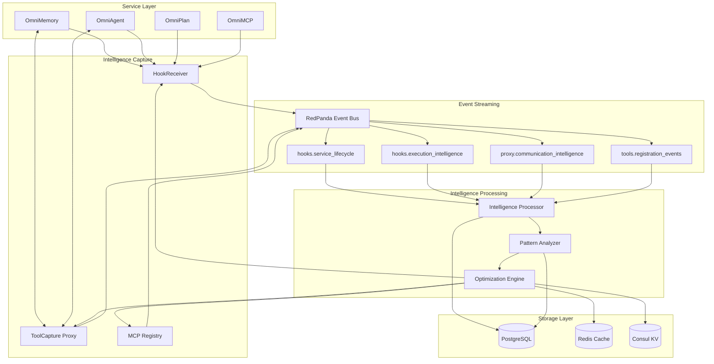

# Data Flow Architecture

## Overview

The OmniNode Bridge implements sophisticated data flow patterns that combine event-driven communication, intelligent caching, and real-time learning to create a self-optimizing service ecosystem. Data flows through multiple intelligence layers, with each interaction contributing to system-wide optimization.

## Core Data Flow Patterns



## Event-Driven Data Flow

### Primary Event Streams

#### Service Lifecycle Events
```yaml
Topic: hooks.service_lifecycle
Schema:
  event_type: "service_started|service_stopped|service_health_change"
  timestamp: ISO8601
  service_info:
    name: string
    version: string
    capabilities: array
    endpoints: array
    dependencies: array
  intelligence_metadata:
    discovery_method: string
    registration_automatic: boolean
    capability_extraction: string
```

#### Execution Intelligence Events
```yaml
Topic: hooks.execution_intelligence
Schema:
  event_type: "execution_completed"
  correlation_id: uuid
  pre_context:
    session_id: string
    service_name: string
    operation: string
    parameters: object
    timestamp: ISO8601
  results:
    success: boolean
    output: object
    error: string
    execution_time_ms: number
  intelligence_insights:
    operation_success_rate: number
    performance_trend: string
    failure_patterns: array
```

#### Communication Intelligence Events
```yaml
Topic: proxy.communication_intelligence
Schema:
  event_type: "request_analysis|response_analysis"
  correlation_id: uuid
  request_context:
    method: string
    path: string
    payload_size: number
    headers: object
    user_context: string
  performance_metrics:
    response_time_ms: number
    response_size: number
    status_code: number
    target_service: string
    success: boolean
  intelligence_analysis:
    pattern_analysis: object
    optimization_opportunities: array
    user_experience_impact: object
```

#### Tool Registration Events
```yaml
Topic: tools.registration_events
Schema:
  event_type: "tool_registered|tool_updated|tool_discovered"
  tool_info:
    name: string
    service_source: string
    capabilities: array
    signature: object
    metadata: object
  registration_method: "automatic|manual|discovery"
  intelligence_metadata:
    usage_predictions: array
    integration_opportunities: array
```

## Intelligence Processing Pipeline

### Event Processing Flow
```python
class IntelligenceProcessor:
    """
    Process incoming events through intelligence pipeline.
    """

    def __init__(self):
        self.kafka_consumer = KafkaConsumer([
            'hooks.service_lifecycle',
            'hooks.execution_intelligence',
            'proxy.communication_intelligence',
            'tools.registration_events'
        ])
        self.pattern_analyzer = PatternAnalyzer()
        self.optimization_engine = OptimizationEngine()
        self.storage_manager = StorageManager()

    async def process_event_stream(self):
        """
        Main event processing loop with intelligent routing.
        """
        async for message in self.kafka_consumer:
            try:
                event = json.loads(message.value)

                # Route to appropriate processor
                processor = self.get_event_processor(event['event_type'])

                # Process with intelligence extraction
                intelligence_data = await processor.process(event)

                # Store intelligence patterns
                await self.storage_manager.store_intelligence(intelligence_data)

                # Generate optimization recommendations
                optimizations = await self.optimization_engine.analyze_optimization_opportunities(
                    intelligence_data
                )

                # Apply real-time optimizations
                if optimizations:
                    await self.apply_optimizations(optimizations)

            except Exception as e:
                await self.handle_processing_error(e, message)

    def get_event_processor(self, event_type: str):
        """
        Route events to specialized processors.
        """
        processors = {
            'service_started': ServiceLifecycleProcessor(),
            'service_stopped': ServiceLifecycleProcessor(),
            'execution_completed': ExecutionIntelligenceProcessor(),
            'request_analysis': CommunicationIntelligenceProcessor(),
            'response_analysis': CommunicationIntelligenceProcessor(),
            'tool_registered': ToolRegistrationProcessor()
        }

        return processors.get(event_type, GenericEventProcessor())
```

### Service Lifecycle Processing
```python
class ServiceLifecycleProcessor:
    """
    Process service lifecycle events for ecosystem intelligence.
    """

    async def process(self, event):
        """
        Extract intelligence from service lifecycle events.
        """
        service_info = event['service_info']

        # Ecosystem impact analysis
        ecosystem_impact = await self.analyze_ecosystem_impact(service_info)

        # Capability mapping
        capability_map = await self.map_service_capabilities(service_info)

        # Integration opportunity detection
        integration_opportunities = await self.detect_integration_opportunities(
            service_info,
            ecosystem_impact
        )

        # Dependency analysis
        dependency_analysis = await self.analyze_dependencies(service_info)

        intelligence_data = {
            'intelligence_type': 'service_lifecycle',
            'service_id': service_info['name'],
            'ecosystem_impact': ecosystem_impact,
            'capability_map': capability_map,
            'integration_opportunities': integration_opportunities,
            'dependency_analysis': dependency_analysis,
            'timestamp': event['timestamp']
        }

        return intelligence_data

    async def analyze_ecosystem_impact(self, service_info):
        """
        Analyze how service affects overall ecosystem.
        """
        # Get current ecosystem state
        current_services = await self.get_current_services()

        # Calculate impact metrics
        impact_metrics = {
            'capability_expansion': self.calculate_capability_expansion(
                service_info['capabilities'],
                current_services
            ),
            'dependency_complexity': self.assess_dependency_complexity(
                service_info['dependencies'],
                current_services
            ),
            'redundancy_analysis': self.analyze_capability_redundancy(
                service_info['capabilities'],
                current_services
            ),
            'load_distribution_impact': await self.assess_load_distribution_impact(
                service_info,
                current_services
            )
        }

        return impact_metrics
```

### Execution Intelligence Processing
```python
class ExecutionIntelligenceProcessor:
    """
    Process execution events for performance and pattern intelligence.
    """

    async def process(self, event):
        """
        Extract intelligence from execution events.
        """
        # Performance analysis
        performance_intelligence = await self.analyze_performance_patterns(event)

        # Failure pattern detection
        failure_patterns = await self.detect_failure_patterns(event)

        # User behavior analysis
        user_behavior = await self.analyze_user_behavior_patterns(event)

        # Optimization opportunity identification
        optimization_opportunities = await self.identify_optimization_opportunities(event)

        intelligence_data = {
            'intelligence_type': 'execution_analysis',
            'correlation_id': event['correlation_id'],
            'service_name': event['pre_context']['service_name'],
            'operation': event['pre_context']['operation'],
            'performance_intelligence': performance_intelligence,
            'failure_patterns': failure_patterns,
            'user_behavior': user_behavior,
            'optimization_opportunities': optimization_opportunities,
            'timestamp': event['pre_context']['timestamp']
        }

        return intelligence_data

    async def analyze_performance_patterns(self, event):
        """
        Analyze performance patterns for optimization insights.
        """
        execution_time = event['results']['execution_time_ms']
        operation = event['pre_context']['operation']

        # Historical performance comparison
        historical_performance = await self.get_historical_performance(operation)

        # Performance trend analysis
        performance_trend = self.calculate_performance_trend(
            execution_time,
            historical_performance
        )

        # Bottleneck identification
        bottlenecks = await self.identify_bottlenecks(
            event['pre_context'],
            event['results']
        )

        # Resource utilization analysis
        resource_utilization = await self.analyze_resource_utilization(event)

        return {
            'execution_time_ms': execution_time,
            'performance_trend': performance_trend,
            'vs_historical_avg': execution_time / historical_performance['avg'] if historical_performance['avg'] else 1.0,
            'bottlenecks': bottlenecks,
            'resource_utilization': resource_utilization,
            'optimization_potential': await self.assess_optimization_potential(
                performance_trend,
                bottlenecks,
                resource_utilization
            )
        }
```

## Data Storage Patterns

### PostgreSQL Schema Design
```sql
-- Intelligence patterns storage
CREATE TABLE intelligence_patterns (
    pattern_id UUID PRIMARY KEY DEFAULT gen_random_uuid(),
    pattern_type VARCHAR(100) NOT NULL,
    pattern_data JSONB NOT NULL,
    confidence DECIMAL(3,2) NOT NULL,
    frequency INTEGER DEFAULT 1,
    first_seen TIMESTAMP DEFAULT NOW(),
    last_seen TIMESTAMP DEFAULT NOW(),
    success_rate DECIMAL(3,2) DEFAULT 0.0,
    created_at TIMESTAMP DEFAULT NOW(),
    updated_at TIMESTAMP DEFAULT NOW()
);

-- Service execution intelligence
CREATE TABLE execution_intelligence (
    execution_id UUID PRIMARY KEY DEFAULT gen_random_uuid(),
    correlation_id UUID NOT NULL,
    service_name VARCHAR(255) NOT NULL,
    operation VARCHAR(255) NOT NULL,
    execution_time_ms INTEGER NOT NULL,
    success BOOLEAN NOT NULL,
    intelligence_data JSONB NOT NULL,
    created_at TIMESTAMP DEFAULT NOW()
);

-- Communication intelligence
CREATE TABLE communication_intelligence (
    communication_id UUID PRIMARY KEY DEFAULT gen_random_uuid(),
    correlation_id UUID NOT NULL,
    source_service VARCHAR(255),
    target_service VARCHAR(255),
    request_data JSONB NOT NULL,
    response_data JSONB NOT NULL,
    performance_metrics JSONB NOT NULL,
    intelligence_insights JSONB NOT NULL,
    created_at TIMESTAMP DEFAULT NOW()
);

-- Service ecosystem state
CREATE TABLE service_ecosystem (
    ecosystem_id UUID PRIMARY KEY DEFAULT gen_random_uuid(),
    services_active JSONB NOT NULL,
    capability_matrix JSONB NOT NULL,
    dependency_graph JSONB NOT NULL,
    performance_metrics JSONB NOT NULL,
    snapshot_timestamp TIMESTAMP DEFAULT NOW()
);

-- Optimization recommendations
CREATE TABLE optimization_recommendations (
    recommendation_id UUID PRIMARY KEY DEFAULT gen_random_uuid(),
    recommendation_type VARCHAR(100) NOT NULL,
    target_service VARCHAR(255),
    recommendation_data JSONB NOT NULL,
    expected_impact JSONB NOT NULL,
    confidence DECIMAL(3,2) NOT NULL,
    applied BOOLEAN DEFAULT FALSE,
    applied_at TIMESTAMP,
    effectiveness_score DECIMAL(3,2),
    created_at TIMESTAMP DEFAULT NOW()
);

-- Indexes for performance
CREATE INDEX idx_intelligence_patterns_type ON intelligence_patterns(pattern_type);
CREATE INDEX idx_intelligence_patterns_confidence ON intelligence_patterns(confidence DESC);
CREATE INDEX idx_execution_intelligence_service ON execution_intelligence(service_name, operation);
CREATE INDEX idx_execution_intelligence_time ON execution_intelligence(created_at DESC);
CREATE INDEX idx_communication_intelligence_correlation ON communication_intelligence(correlation_id);
CREATE INDEX idx_optimization_recommendations_service ON optimization_recommendations(target_service);
```

### Redis Caching Strategy
```python
class IntelligentCacheManager:
    """
    Manage intelligent caching across the data flow pipeline.
    """

    def __init__(self):
        self.redis_client = RedisClient()
        self.cache_patterns = {
            'service_metadata': {'ttl': 300, 'pattern': 'service:meta:{service_id}'},
            'performance_metrics': {'ttl': 60, 'pattern': 'perf:{service_id}:{operation}'},
            'intelligence_patterns': {'ttl': 3600, 'pattern': 'intel:{pattern_type}'},
            'optimization_cache': {'ttl': 1800, 'pattern': 'opt:{service_id}'}
        }

    async def cache_service_metadata(self, service_id: str, metadata: dict):
        """
        Cache service metadata with intelligent TTL.
        """
        cache_key = self.cache_patterns['service_metadata']['pattern'].format(
            service_id=service_id
        )

        # Intelligent TTL based on service stability
        base_ttl = self.cache_patterns['service_metadata']['ttl']
        stability_score = await self.assess_service_stability(service_id)
        intelligent_ttl = int(base_ttl * (1 + stability_score))

        await self.redis_client.setex(
            cache_key,
            intelligent_ttl,
            json.dumps(metadata)
        )

    async def cache_performance_metrics(self, service_id: str, operation: str, metrics: dict):
        """
        Cache performance metrics with adaptive TTL.
        """
        cache_key = self.cache_patterns['performance_metrics']['pattern'].format(
            service_id=service_id,
            operation=operation
        )

        # Adaptive TTL based on performance volatility
        volatility_score = await self.assess_performance_volatility(service_id, operation)
        base_ttl = self.cache_patterns['performance_metrics']['ttl']
        adaptive_ttl = max(30, int(base_ttl * (1 - volatility_score)))

        await self.redis_client.setex(
            cache_key,
            adaptive_ttl,
            json.dumps({
                'metrics': metrics,
                'cached_at': datetime.utcnow().isoformat(),
                'volatility_score': volatility_score
            })
        )

    async def get_cached_intelligence_patterns(self, pattern_type: str):
        """
        Retrieve cached intelligence patterns with freshness validation.
        """
        cache_key = self.cache_patterns['intelligence_patterns']['pattern'].format(
            pattern_type=pattern_type
        )

        cached_data = await self.redis_client.get(cache_key)

        if cached_data:
            data = json.loads(cached_data)

            # Validate freshness
            cached_at = datetime.fromisoformat(data['cached_at'])
            age_minutes = (datetime.utcnow() - cached_at).total_seconds() / 60

            # Intelligence patterns become stale based on update frequency
            max_age = await self.get_pattern_max_age(pattern_type)

            if age_minutes <= max_age:
                return data['patterns']

        return None
```

## Real-time Data Synchronization

### Event Correlation
```python
class EventCorrelationEngine:
    """
    Correlate related events across the data flow pipeline.
    """

    def __init__(self):
        self.correlation_cache = TTLCache(maxsize=10000, ttl=3600)
        self.correlation_patterns = CorrelationPatternMatcher()

    async def correlate_events(self, event):
        """
        Find and correlate related events for enhanced intelligence.
        """
        correlation_id = event.get('correlation_id')

        if correlation_id:
            # Direct correlation via correlation ID
            related_events = await self.find_events_by_correlation_id(correlation_id)
        else:
            # Pattern-based correlation
            related_events = await self.find_events_by_patterns(event)

        # Build correlation graph
        correlation_graph = await self.build_correlation_graph(event, related_events)

        # Extract cross-event intelligence
        cross_event_intelligence = await self.extract_cross_event_intelligence(
            correlation_graph
        )

        return {
            'primary_event': event,
            'related_events': related_events,
            'correlation_graph': correlation_graph,
            'cross_event_intelligence': cross_event_intelligence
        }

    async def extract_cross_event_intelligence(self, correlation_graph):
        """
        Extract intelligence from correlated events.
        """
        # Temporal pattern analysis
        temporal_patterns = self.analyze_temporal_patterns(correlation_graph)

        # Causal relationship detection
        causal_relationships = await self.detect_causal_relationships(correlation_graph)

        # Performance correlation analysis
        performance_correlations = self.analyze_performance_correlations(correlation_graph)

        # User journey reconstruction
        user_journey = await self.reconstruct_user_journey(correlation_graph)

        return {
            'temporal_patterns': temporal_patterns,
            'causal_relationships': causal_relationships,
            'performance_correlations': performance_correlations,
            'user_journey': user_journey,
            'intelligence_confidence': await self.calculate_correlation_confidence(
                correlation_graph
            )
        }
```

## Data Flow Optimization

### Adaptive Data Routing
```python
class AdaptiveDataRouter:
    """
    Intelligently route data through the processing pipeline based on patterns.
    """

    async def route_intelligence_data(self, intelligence_data):
        """
        Route intelligence data to appropriate processors and storage.
        """
        # Classify intelligence data
        classification = await self.classify_intelligence_data(intelligence_data)

        # Determine processing priority
        priority = await self.calculate_processing_priority(intelligence_data, classification)

        # Select optimal processing path
        processing_path = await self.select_processing_path(classification, priority)

        # Route to processors
        results = await self.execute_processing_path(intelligence_data, processing_path)

        return results

    async def select_processing_path(self, classification, priority):
        """
        Select optimal processing path based on intelligence classification.
        """
        if classification['type'] == 'critical_performance':
            # Fast path for critical performance data
            return ['real_time_processor', 'performance_optimizer', 'immediate_cache']

        elif classification['type'] == 'pattern_discovery':
            # Deep analysis path for pattern discovery
            return ['pattern_analyzer', 'correlation_engine', 'ml_processor', 'persistent_storage']

        elif classification['type'] == 'routine_metrics':
            # Efficient path for routine metrics
            return ['metrics_aggregator', 'trend_analyzer', 'batch_storage']

        else:
            # Default comprehensive path
            return ['intelligence_processor', 'pattern_analyzer', 'storage_manager']
```

## Performance Characteristics

### Data Flow Performance Metrics
```yaml
Event Processing:
  - Event ingestion rate: 50,000 events/second
  - Processing latency: <100ms for standard events, <10ms for critical events
  - Pattern analysis: <200ms for complex pattern detection
  - Storage latency: <50ms for PostgreSQL, <5ms for Redis

Intelligence Generation:
  - Real-time insights: <500ms from event to actionable intelligence
  - Pattern correlation: <1s for complex multi-event correlation
  - Optimization recommendations: <2s for comprehensive analysis
  - Learning cycle: 5-minute batch processing for pattern updates

Data Storage:
  - PostgreSQL write throughput: 10,000 writes/second
  - Redis cache hit ratio: >95% for frequently accessed data
  - Data retention: 90 days for detailed events, 1 year for patterns
  - Backup frequency: Real-time replication + daily snapshots
```

### Scalability Characteristics
```yaml
Horizontal Scaling:
  - Event processors: Linear scaling with additional instances
  - Intelligence processors: 80% efficiency with parallel processing
  - Storage scaling: Read replicas for query performance
  - Cache scaling: Redis clustering for high availability

Vertical Optimization:
  - Memory usage: Intelligent caching reduces memory footprint by 40%
  - CPU optimization: Asynchronous processing improves CPU utilization by 60%
  - I/O optimization: Batch writing reduces I/O by 50%
  - Network optimization: Event compression reduces bandwidth by 30%
```

This data flow architecture ensures that every interaction in the OmniNode Bridge ecosystem contributes to system-wide intelligence and optimization, creating a continuously improving service coordination platform.
