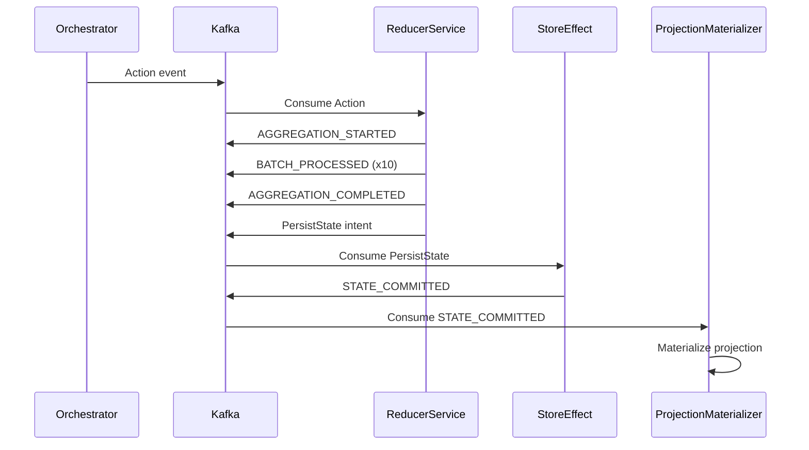
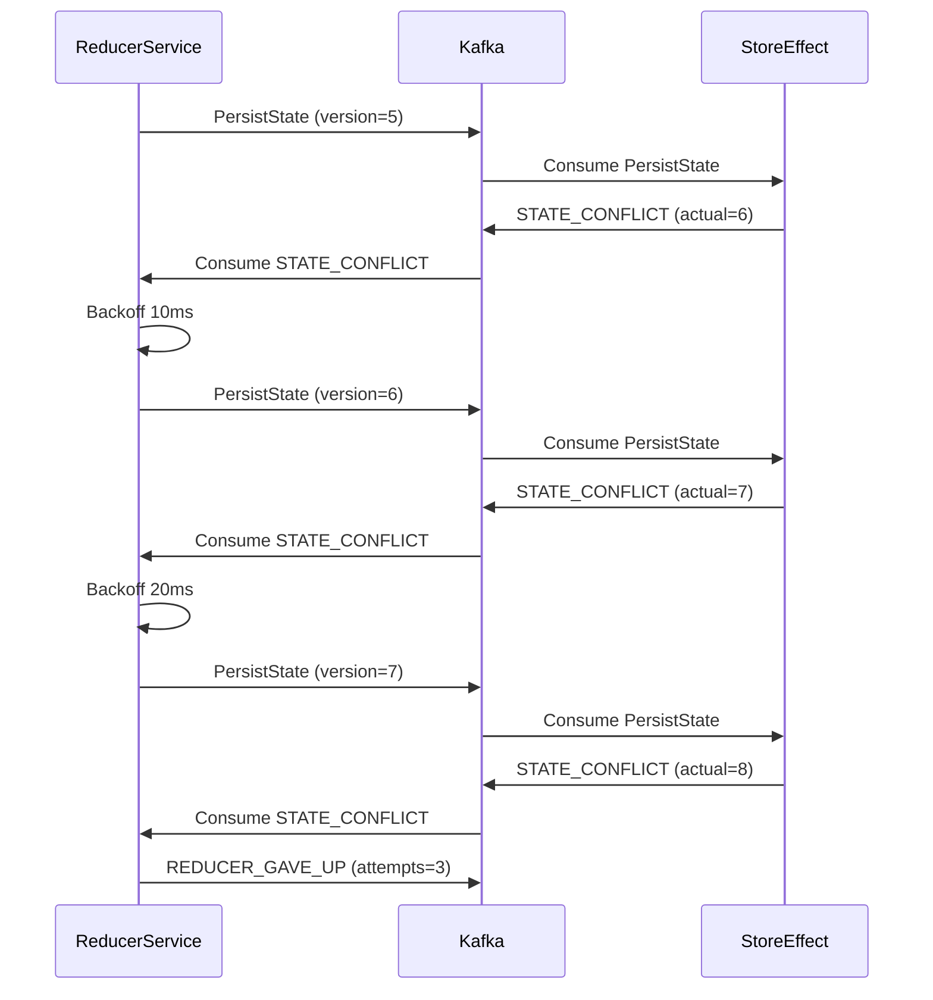

# Event Contracts - Pure Reducer Architecture

**Status**: Production Ready (Wave 7 - Documentation Phase)
**Last Updated**: October 21, 2025
**Architecture Version**: ONEX v2.0

## Table of Contents

- [Overview](#overview)
- [Event Schema Standards](#event-schema-standards)
- [Reducer Events](#reducer-events)
- [State Management Events](#state-management-events)
- [FSM Events](#fsm-events)
- [Control Events](#control-events)
- [Kafka Topic Mapping](#kafka-topic-mapping)
- [Event Flow Diagrams](#event-flow-diagrams)
- [Best Practices](#best-practices)

---

## Overview

The Pure Reducer architecture uses **event-driven coordination** via Kafka to decouple components and enable scalable, resilient workflows. This document defines all event schemas, payloads, and topic mappings.

### Event Categories

1. **Reducer Events** - Published by Reducer Service during aggregation
2. **State Management Events** - Published by Store Effect for persistence
3. **FSM Events** - Published for workflow state transitions
4. **Control Events** - System control and error handling events

### Event Format

All events follow the **OnexEnvelopeV1** format:

```json
{
  "envelope_version": "v1",
  "event_id": "uuid",
  "event_type": "AGGREGATION_STARTED",
  "correlation_id": "uuid",
  "timestamp": "2025-10-21T12:00:00.000Z",
  "source_service": "reducer_service",
  "payload": {
    // Event-specific data
  },
  "metadata": {
    "partition_key": "workflow-123",
    "priority": 0
  }
}
```

---

## Event Schema Standards

### Common Fields

All events include these common fields in the envelope:

| Field | Type | Required | Description |
|-------|------|----------|-------------|
| `envelope_version` | string | Yes | Envelope format version (always "v1") |
| `event_id` | UUID | Yes | Unique event identifier |
| `event_type` | string | Yes | Event type (from EnumReducerEvent) |
| `correlation_id` | UUID | Yes | Workflow correlation ID for tracing |
| `timestamp` | ISO8601 | Yes | Event creation timestamp (UTC) |
| `source_service` | string | Yes | Service that published the event |
| `payload` | object | Yes | Event-specific payload data |
| `metadata` | object | No | Optional metadata (partition_key, priority, etc.) |

### Payload Standards

Event payloads follow these conventions:

- **Timestamps**: ISO8601 format in UTC (`2025-10-21T12:00:00.000Z`)
- **IDs**: UUID v4 format (`550e8400-e29b-41d4-a716-446655440000`)
- **Durations**: Milliseconds as float (`85.3`)
- **Counts**: Integer values
- **States**: Uppercase enum values (`PENDING`, `PROCESSING`, `COMPLETED`)

---

## Reducer Events

### 1. AGGREGATION_STARTED

**Description**: Published when aggregation workflow begins

**Publisher**: Reducer Service

**Kafka Topic**: `{namespace}.omninode_bridge.onex.evt.aggregation-started.v1`

**Payload Schema**:
```json
{
  "aggregation_id": "550e8400-e29b-41d4-a716-446655440000",
  "aggregation_type": "NAMESPACE_GROUPING",
  "batch_size": 100,
  "window_size_ms": 5000,
  "timestamp": "2025-10-21T12:00:00.000Z"
}
```

**Example Event**:
```json
{
  "envelope_version": "v1",
  "event_id": "7c9e6679-7425-40de-944b-e07fc1f90ae7",
  "event_type": "AGGREGATION_STARTED",
  "correlation_id": "550e8400-e29b-41d4-a716-446655440000",
  "timestamp": "2025-10-21T12:00:00.000Z",
  "source_service": "reducer_service",
  "payload": {
    "aggregation_id": "550e8400-e29b-41d4-a716-446655440000",
    "aggregation_type": "NAMESPACE_GROUPING",
    "batch_size": 100,
    "window_size_ms": 5000,
    "timestamp": "2025-10-21T12:00:00.000Z"
  },
  "metadata": {
    "partition_key": "workflow-123",
    "priority": 0
  }
}
```

### 2. BATCH_PROCESSED

**Description**: Published after each batch of metadata is aggregated

**Publisher**: Reducer Service

**Kafka Topic**: `{namespace}.omninode_bridge.onex.evt.batch-processed.v1`

**Payload Schema**:
```json
{
  "aggregation_id": "550e8400-e29b-41d4-a716-446655440000",
  "batch_number": 1,
  "batch_size": 100,
  "total_items_processed": 100,
  "timestamp": "2025-10-21T12:00:01.000Z"
}
```

**Example Event**:
```json
{
  "envelope_version": "v1",
  "event_id": "8d7f5680-8526-51ef-a055-f18gd2g01bf8",
  "event_type": "BATCH_PROCESSED",
  "correlation_id": "550e8400-e29b-41d4-a716-446655440000",
  "timestamp": "2025-10-21T12:00:01.000Z",
  "source_service": "reducer_service",
  "payload": {
    "aggregation_id": "550e8400-e29b-41d4-a716-446655440000",
    "batch_number": 1,
    "batch_size": 100,
    "total_items_processed": 100,
    "timestamp": "2025-10-21T12:00:01.000Z"
  },
  "metadata": {
    "partition_key": "workflow-123",
    "priority": 0
  }
}
```

### 3. AGGREGATION_COMPLETED

**Description**: Published when aggregation completes successfully

**Publisher**: Reducer Service

**Kafka Topic**: `{namespace}.omninode_bridge.onex.evt.aggregation-completed.v1`

**Payload Schema**:
```json
{
  "aggregation_id": "550e8400-e29b-41d4-a716-446655440000",
  "total_items": 1000,
  "batches_processed": 10,
  "total_size_bytes": 1048576,
  "duration_ms": 85.3,
  "items_per_second": 1171.8,
  "namespaces_count": 3,
  "timestamp": "2025-10-21T12:00:01.085Z"
}
```

**Example Event**:
```json
{
  "envelope_version": "v1",
  "event_id": "9e8g6790-9637-62fg-b166-g29he3h12cg9",
  "event_type": "AGGREGATION_COMPLETED",
  "correlation_id": "550e8400-e29b-41d4-a716-446655440000",
  "timestamp": "2025-10-21T12:00:01.085Z",
  "source_service": "reducer_service",
  "payload": {
    "aggregation_id": "550e8400-e29b-41d4-a716-446655440000",
    "total_items": 1000,
    "batches_processed": 10,
    "total_size_bytes": 1048576,
    "duration_ms": 85.3,
    "items_per_second": 1171.8,
    "namespaces_count": 3,
    "timestamp": "2025-10-21T12:00:01.085Z"
  },
  "metadata": {
    "partition_key": "workflow-123",
    "priority": 0
  }
}
```

### 4. AGGREGATION_FAILED

**Description**: Published when aggregation fails

**Publisher**: Reducer Service

**Kafka Topic**: `{namespace}.omninode_bridge.onex.evt.aggregation-failed.v1`

**Payload Schema**:
```json
{
  "aggregation_id": "550e8400-e29b-41d4-a716-446655440000",
  "error_type": "ValidationError",
  "error_message": "Invalid metadata format in batch 5",
  "stack_trace": "...",
  "total_items_processed": 450,
  "failed_batch_number": 5,
  "timestamp": "2025-10-21T12:00:00.500Z"
}
```

**Example Event**:
```json
{
  "envelope_version": "v1",
  "event_id": "af9h7801-a748-73gh-c277-h3aif4i23dha",
  "event_type": "AGGREGATION_FAILED",
  "correlation_id": "550e8400-e29b-41d4-a716-446655440000",
  "timestamp": "2025-10-21T12:00:00.500Z",
  "source_service": "reducer_service",
  "payload": {
    "aggregation_id": "550e8400-e29b-41d4-a716-446655440000",
    "error_type": "ValidationError",
    "error_message": "Invalid metadata format in batch 5",
    "stack_trace": "Traceback (most recent call last):\n  File ...",
    "total_items_processed": 450,
    "failed_batch_number": 5,
    "timestamp": "2025-10-21T12:00:00.500Z"
  },
  "metadata": {
    "partition_key": "workflow-123",
    "priority": 1
  }
}
```

---

## State Management Events

### 5. STATE_PERSISTED

**Description**: Published when aggregated state is persisted to PostgreSQL

**Publisher**: Store Effect Node

**Kafka Topic**: `{namespace}.omninode_bridge.onex.evt.state-persisted.v1`

**Payload Schema**:
```json
{
  "aggregation_id": "550e8400-e29b-41d4-a716-446655440000",
  "namespaces_count": 3,
  "workflows_count": 15,
  "timestamp": "2025-10-21T12:00:01.100Z"
}
```

**Example Event**:
```json
{
  "envelope_version": "v1",
  "event_id": "bga8901-b859-84hi-d388-i4bkg5j34eib",
  "event_type": "STATE_PERSISTED",
  "correlation_id": "550e8400-e29b-41d4-a716-446655440000",
  "timestamp": "2025-10-21T12:00:01.100Z",
  "source_service": "store_effect",
  "payload": {
    "aggregation_id": "550e8400-e29b-41d4-a716-446655440000",
    "namespaces_count": 3,
    "workflows_count": 15,
    "timestamp": "2025-10-21T12:00:01.100Z"
  },
  "metadata": {
    "partition_key": "workflow-123",
    "priority": 1
  }
}
```

### 6. STATE_COMMITTED

**Description**: Published when state commit succeeds (triggers projection)

**Publisher**: Store Effect Node

**Kafka Topic**: `{namespace}.omninode_bridge.onex.evt.state-committed.v1`

**Payload Schema**:
```json
{
  "workflow_key": "workflow-123",
  "version": 6,
  "commit_offset": 12345,
  "provenance": {
    "effect_id": "550e8400-e29b-41d4-a716-446655440000",
    "timestamp": "2025-10-21T12:00:01.110Z",
    "action_id": "7c9e6679-7425-40de-944b-e07fc1f90ae7"
  },
  "timestamp": "2025-10-21T12:00:01.110Z"
}
```

**Example Event**:
```json
{
  "envelope_version": "v1",
  "event_id": "chb9a12-c96a-95ij-e499-j5clh6k45fjc",
  "event_type": "STATE_COMMITTED",
  "correlation_id": "550e8400-e29b-41d4-a716-446655440000",
  "timestamp": "2025-10-21T12:00:01.110Z",
  "source_service": "store_effect",
  "payload": {
    "workflow_key": "workflow-123",
    "version": 6,
    "commit_offset": 12345,
    "provenance": {
      "effect_id": "550e8400-e29b-41d4-a716-446655440000",
      "timestamp": "2025-10-21T12:00:01.110Z",
      "action_id": "7c9e6679-7425-40de-944b-e07fc1f90ae7"
    },
    "timestamp": "2025-10-21T12:00:01.110Z"
  },
  "metadata": {
    "partition_key": "workflow-123",
    "priority": 1
  }
}
```

### 7. STATE_CONFLICT

**Description**: Published when version conflict is detected (triggers retry)

**Publisher**: Store Effect Node

**Kafka Topic**: `{namespace}.omninode_bridge.onex.evt.state-conflict.v1`

**Payload Schema**:
```json
{
  "workflow_key": "workflow-123",
  "expected_version": 5,
  "actual_version": 6,
  "timestamp": "2025-10-21T12:00:01.050Z"
}
```

**Example Event**:
```json
{
  "envelope_version": "v1",
  "event_id": "dicab23-da7b-a6jk-f5aa-k6dmm7l56gkd",
  "event_type": "STATE_CONFLICT",
  "correlation_id": "550e8400-e29b-41d4-a716-446655440000",
  "timestamp": "2025-10-21T12:00:01.050Z",
  "source_service": "store_effect",
  "payload": {
    "workflow_key": "workflow-123",
    "expected_version": 5,
    "actual_version": 6,
    "timestamp": "2025-10-21T12:00:01.050Z"
  },
  "metadata": {
    "partition_key": "workflow-123",
    "priority": 1
  }
}
```

---

## FSM Events

### 8. FSM_STATE_INITIALIZED

**Description**: Published when workflow is initialized in FSM

**Publisher**: Reducer Service (via FSM Manager)

**Kafka Topic**: `{namespace}.omninode_bridge.onex.evt.fsm-state-initialized.v1`

**Payload Schema**:
```json
{
  "workflow_id": "workflow-123",
  "initial_state": "PENDING",
  "namespace": "omninode.services.metadata",
  "metadata": {
    "created_by": "orchestrator",
    "workflow_type": "metadata_stamping"
  },
  "timestamp": "2025-10-21T12:00:00.000Z"
}
```

**Example Event**:
```json
{
  "envelope_version": "v1",
  "event_id": "ejdbc34-eb8c-b7kl-g6bb-l7enn8m67hle",
  "event_type": "FSM_STATE_INITIALIZED",
  "correlation_id": "550e8400-e29b-41d4-a716-446655440000",
  "timestamp": "2025-10-21T12:00:00.000Z",
  "source_service": "reducer_service",
  "payload": {
    "workflow_id": "workflow-123",
    "initial_state": "PENDING",
    "namespace": "omninode.services.metadata",
    "metadata": {
      "created_by": "orchestrator",
      "workflow_type": "metadata_stamping"
    },
    "timestamp": "2025-10-21T12:00:00.000Z"
  },
  "metadata": {
    "partition_key": "workflow-123",
    "priority": 0
  }
}
```

### 9. FSM_STATE_TRANSITIONED

**Description**: Published when workflow transitions between FSM states

**Publisher**: Reducer Service (via FSM Manager)

**Kafka Topic**: `{namespace}.omninode_bridge.onex.evt.fsm-state-transitioned.v1`

**Payload Schema**:
```json
{
  "workflow_id": "workflow-123",
  "from_state": "PENDING",
  "to_state": "PROCESSING",
  "trigger": "aggregation_update",
  "transition_metadata": {
    "namespace": "omninode.services.metadata",
    "batch_number": 1
  },
  "timestamp": "2025-10-21T12:00:00.100Z"
}
```

**Example Event**:
```json
{
  "envelope_version": "v1",
  "event_id": "fkecd45-fc9d-c8lm-h7cc-m8foo9n78imf",
  "event_type": "FSM_STATE_TRANSITIONED",
  "correlation_id": "550e8400-e29b-41d4-a716-446655440000",
  "timestamp": "2025-10-21T12:00:00.100Z",
  "source_service": "reducer_service",
  "payload": {
    "workflow_id": "workflow-123",
    "from_state": "PENDING",
    "to_state": "PROCESSING",
    "trigger": "aggregation_update",
    "transition_metadata": {
      "namespace": "omninode.services.metadata",
      "batch_number": 1
    },
    "timestamp": "2025-10-21T12:00:00.100Z"
  },
  "metadata": {
    "partition_key": "workflow-123",
    "priority": 0
  }
}
```

---

## Control Events

### 10. REDUCER_GAVE_UP

**Description**: Published when max retries exceeded (escalation)

**Publisher**: Reducer Service

**Kafka Topic**: `{namespace}.omninode_bridge.onex.evt.reducer-gave-up.v1`

**Payload Schema**:
```json
{
  "workflow_key": "workflow-123",
  "action_id": "7c9e6679-7425-40de-944b-e07fc1f90ae7",
  "attempts": 3,
  "last_error": "StateConflict",
  "last_expected_version": 5,
  "last_actual_version": 8,
  "timestamp": "2025-10-21T12:00:02.500Z"
}
```

**Example Event**:
```json
{
  "envelope_version": "v1",
  "event_id": "glfde56-gd0e-d9mn-i8dd-n9gpp0o89jng",
  "event_type": "REDUCER_GAVE_UP",
  "correlation_id": "550e8400-e29b-41d4-a716-446655440000",
  "timestamp": "2025-10-21T12:00:02.500Z",
  "source_service": "reducer_service",
  "payload": {
    "workflow_key": "workflow-123",
    "action_id": "7c9e6679-7425-40de-944b-e07fc1f90ae7",
    "attempts": 3,
    "last_error": "StateConflict",
    "last_expected_version": 5,
    "last_actual_version": 8,
    "timestamp": "2025-10-21T12:00:02.500Z"
  },
  "metadata": {
    "partition_key": "workflow-123",
    "priority": 2
  }
}
```

---

## Kafka Topic Mapping

### Topic Naming Convention

All topics follow the ONEX v0.1 standard:

```
{namespace}.{service}.onex.evt.{event-slug}.{version}
```

**Example**: `dev.omninode_bridge.onex.evt.aggregation-started.v1`

### Topic Configuration

| Event Type | Topic Name | Partitions | Retention | Cleanup Policy |
|------------|-----------|-----------|-----------|----------------|
| `AGGREGATION_STARTED` | `dev.omninode_bridge.onex.evt.aggregation-started.v1` | 3 | 7 days | Delete |
| `BATCH_PROCESSED` | `dev.omninode_bridge.onex.evt.batch-processed.v1` | 3 | 3 days | Delete |
| `AGGREGATION_COMPLETED` | `dev.omninode_bridge.onex.evt.aggregation-completed.v1` | 3 | 7 days | Delete |
| `AGGREGATION_FAILED` | `dev.omninode_bridge.onex.evt.aggregation-failed.v1` | 3 | 30 days | Delete |
| `STATE_PERSISTED` | `dev.omninode_bridge.onex.evt.state-persisted.v1` | 3 | 7 days | Delete |
| `STATE_COMMITTED` | `dev.omninode_bridge.onex.evt.state-committed.v1` | 6 | 30 days | Compact |
| `STATE_CONFLICT` | `dev.omninode_bridge.onex.evt.state-conflict.v1` | 3 | 7 days | Delete |
| `FSM_STATE_INITIALIZED` | `dev.omninode_bridge.onex.evt.fsm-state-initialized.v1` | 3 | 7 days | Delete |
| `FSM_STATE_TRANSITIONED` | `dev.omninode_bridge.onex.evt.fsm-state-transitioned.v1` | 3 | 7 days | Delete |
| `REDUCER_GAVE_UP` | `dev.omninode_bridge.onex.evt.reducer-gave-up.v1` | 3 | 30 days | Delete |

### Partitioning Strategy

**Partition Key**: `workflow_key` (ensures ordering per workflow)

**Partition Count**:
- **State Events**: 6 partitions (high throughput)
- **Reducer Events**: 3 partitions (moderate throughput)
- **Control Events**: 3 partitions (low throughput)

---

## Event Flow Diagrams

### Happy Path Event Flow



### Conflict Retry Event Flow



---

## Best Practices

### Event Publishing

1. **Always include correlation_id** - For distributed tracing
2. **Use partition_key = workflow_key** - Ensures ordering per workflow
3. **Set appropriate priority** - Higher for critical events
4. **Include timestamps in UTC** - Consistent timezone handling
5. **Validate payload before publishing** - Catch errors early

### Event Consumption

1. **Implement idempotence** - Handle duplicate events gracefully
2. **Check watermarks for STATE_COMMITTED** - Prevent duplicate processing
3. **Use correlation_id for tracing** - Link related events
4. **Handle missing events** - Eventual consistency patterns
5. **Monitor consumer lag** - Detect slow consumers

### Error Handling

1. **Publish failure events** - Don't silently drop errors
2. **Include stack traces** - Aid debugging
3. **Set high priority for error events** - Process failures quickly
4. **Use DLQ for poison messages** - Prevent consumer blocking
5. **Alert on REDUCER_GAVE_UP** - Escalate critical failures

### Performance

1. **Batch events when possible** - Reduce Kafka overhead
2. **Use async publishing** - Non-blocking event emission
3. **Monitor topic lag** - Scale consumers as needed
4. **Optimize partition count** - Balance throughput and overhead
5. **Use compression** - Reduce network bandwidth

---

## References

- **Pure Reducer Architecture**: [PURE_REDUCER_ARCHITECTURE.md](./PURE_REDUCER_ARCHITECTURE.md)
- **Troubleshooting Guide**: [TROUBLESHOOTING.md](./TROUBLESHOOTING.md)
- **EnumReducerEvent**: `src/omninode_bridge/nodes/reducer/v1_0_0/models/enum_reducer_event.py`
- **ModelIntent**: `src/omninode_bridge/nodes/reducer/v1_0_0/models/model_intent.py`
- **Kafka Topics**: See deployment configuration

---

**Document Version**: 1.0.0
**Last Review**: October 21, 2025
**Next Review**: Post Wave 6 completion
