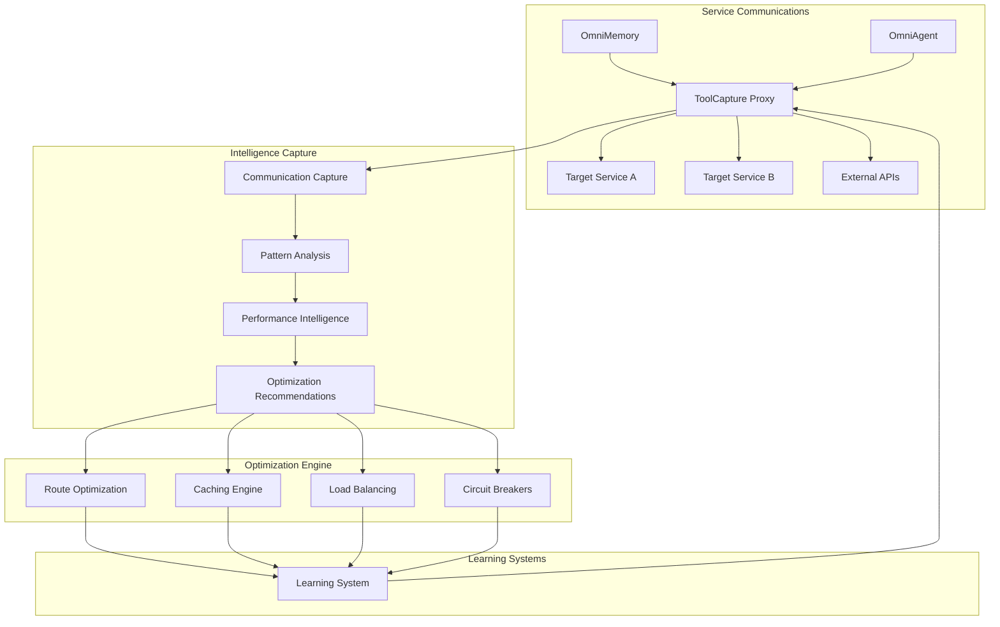

# Proxy Communication Intelligence

## Overview

The Proxy Communication Intelligence system provides intelligent service-to-service communication monitoring and optimization through the ToolCaptureProxy. This system captures every service interaction, analyzes communication patterns, and automatically optimizes routing and performance.

## Architecture



## ToolCaptureProxy Service

### Purpose
Intelligent proxy for service-to-service communication with automatic intelligence capture and optimization.

### Source Implementation
`omnibase_3/src/omnibase/services/tool_capture_proxy.py`

### Core Architecture

```python
class ToolCaptureProxy:
    """
    Intelligent proxy service that captures communication patterns
    and applies real-time optimizations.
    """

    def __init__(self):
        self.fastapi_app = FastAPI()
        self.kafka_producer = KafkaProducer()
        self.route_optimizer = RouteOptimizer()
        self.cache_engine = IntelligentCacheEngine()
        self.circuit_breakers = CircuitBreakerManager()
        self.performance_monitor = PerformanceMonitor()

    async def proxy_request(self, request: ProxyRequest):
        """
        Main proxy handler with intelligence capture.
        """
        # Generate correlation ID for tracking
        correlation_id = str(uuid.uuid4())

        # Pre-request intelligence
        pre_context = await self.capture_pre_request_context(request, correlation_id)

        # Apply intelligent routing
        target_service = await self.route_optimizer.select_optimal_target(
            service_type=request.target_service,
            request_characteristics=pre_context["request_profile"]
        )

        # Check intelligent cache
        cached_response = await self.cache_engine.check_cache(
            request_hash=pre_context["request_hash"],
            service=target_service
        )

        if cached_response:
            # Cache hit - still capture intelligence
            await self.capture_cache_hit_intelligence(request, cached_response, correlation_id)
            return cached_response

        # Execute request with circuit breaker protection
        try:
            response = await self.circuit_breakers.execute_with_protection(
                target_service,
                lambda: self.forward_request(target_service, request)
            )

            # Capture post-request intelligence
            await self.capture_post_request_context(
                request, response, target_service, correlation_id
            )

            # Update cache intelligence
            await self.cache_engine.consider_caching(
                request_hash=pre_context["request_hash"],
                response=response,
                performance_metrics=response.performance_metrics
            )

            return response

        except CircuitBreakerOpenException:
            # Handle circuit breaker scenarios
            fallback_response = await self.handle_circuit_breaker_fallback(request)
            await self.capture_circuit_breaker_intelligence(request, correlation_id)
            return fallback_response

    async def capture_pre_request_context(self, request: ProxyRequest, correlation_id: str):
        """
        Capture comprehensive pre-request context for intelligence.
        """
        request_profile = {
            "method": request.method,
            "path": request.path,
            "payload_size": len(request.body) if request.body else 0,
            "headers": dict(request.headers),
            "user_context": request.headers.get("X-User-Context"),
            "session_id": request.headers.get("X-Session-ID"),
            "timestamp": datetime.utcnow().isoformat()
        }

        request_hash = hashlib.sha256(
            f"{request.method}:{request.path}:{request.body or ''}".encode()
        ).hexdigest()

        # Analyze request patterns
        pattern_analysis = await self.analyze_request_patterns(request_profile)

        context = {
            "correlation_id": correlation_id,
            "request_profile": request_profile,
            "request_hash": request_hash,
            "pattern_analysis": pattern_analysis,
            "predicted_performance": await self.predict_performance(request_profile),
            "optimization_opportunities": await self.identify_optimization_opportunities(request_profile)
        }

        # Publish to intelligence pipeline
        await self.kafka_producer.send('proxy.request_intelligence', {
            "event_type": "pre_request_analysis",
            "correlation_id": correlation_id,
            "context": context
        })

        return context

    async def capture_post_request_context(self, request, response, target_service, correlation_id):
        """
        Capture post-request intelligence for learning and optimization.
        """
        performance_metrics = {
            "response_time_ms": response.performance_metrics.get("duration_ms", 0),
            "response_size": len(response.body) if response.body else 0,
            "status_code": response.status_code,
            "target_service": target_service,
            "success": 200 <= response.status_code < 300
        }

        # Analyze response patterns
        response_analysis = {
            "content_type": response.headers.get("content-type"),
            "cache_headers": self.extract_cache_headers(response.headers),
            "error_patterns": await self.analyze_error_patterns(response) if not performance_metrics["success"] else None
        }

        # Performance intelligence
        performance_intelligence = {
            "vs_prediction": await self.compare_actual_vs_predicted_performance(correlation_id, performance_metrics),
            "bottleneck_analysis": await self.analyze_bottlenecks(performance_metrics),
            "optimization_impact": await self.assess_optimization_effectiveness(correlation_id, performance_metrics)
        }

        intelligence_payload = {
            "event_type": "post_request_analysis",
            "correlation_id": correlation_id,
            "performance_metrics": performance_metrics,
            "response_analysis": response_analysis,
            "performance_intelligence": performance_intelligence,
            "learning_data": {
                "request_response_correlation": await self.correlate_request_response_patterns(request, response),
                "user_experience_impact": await self.assess_user_experience_impact(performance_metrics),
                "system_health_impact": await self.assess_system_health_impact(performance_metrics)
            }
        }

        await self.kafka_producer.send('proxy.response_intelligence', intelligence_payload)
```

## Intelligent Routing

### Route Optimization
```python
class RouteOptimizer:
    """
    Intelligent routing based on performance patterns and service health.
    """

    def __init__(self):
        self.service_registry = ConsulServiceRegistry()
        self.performance_db = PerformanceDatabase()
        self.health_monitor = ServiceHealthMonitor()

    async def select_optimal_target(self, service_type: str, request_characteristics: dict):
        """
        Select optimal target service based on intelligence.
        """
        # Get available service instances
        available_services = await self.service_registry.get_healthy_services(service_type)

        if not available_services:
            raise NoHealthyServicesException(f"No healthy services for {service_type}")

        # Analyze historical performance for each service
        service_performance = {}
        for service in available_services:
            perf_data = await self.performance_db.get_service_performance(
                service_id=service["id"],
                time_window=timedelta(hours=1)
            )

            service_performance[service["id"]] = {
                "avg_response_time": perf_data["avg_response_time"],
                "success_rate": perf_data["success_rate"],
                "current_load": perf_data["current_load"],
                "capacity_utilization": perf_data["capacity_utilization"]
            }

        # Apply intelligent selection algorithm
        optimal_service = await self.apply_selection_algorithm(
            available_services,
            service_performance,
            request_characteristics
        )

        return optimal_service

    async def apply_selection_algorithm(self, services, performance_data, request_characteristics):
        """
        Apply multi-factor selection algorithm for optimal routing.
        """
        scores = {}

        for service in services:
            service_id = service["id"]
            perf = performance_data[service_id]

            # Performance score (lower response time = higher score)
            performance_score = 1.0 / (1.0 + perf["avg_response_time"] / 1000.0)

            # Reliability score
            reliability_score = perf["success_rate"]

            # Load balancing score (lower load = higher score)
            load_score = 1.0 - perf["capacity_utilization"]

            # Request compatibility score
            compatibility_score = await self.calculate_compatibility_score(
                service, request_characteristics
            )

            # Weighted total score
            total_score = (
                performance_score * 0.3 +
                reliability_score * 0.3 +
                load_score * 0.2 +
                compatibility_score * 0.2
            )

            scores[service_id] = {
                "service": service,
                "total_score": total_score,
                "breakdown": {
                    "performance": performance_score,
                    "reliability": reliability_score,
                    "load": load_score,
                    "compatibility": compatibility_score
                }
            }

        # Select service with highest score
        best_service = max(scores.values(), key=lambda x: x["total_score"])

        # Log routing decision for intelligence
        await self.log_routing_decision(scores, best_service, request_characteristics)

        return best_service["service"]
```

## Intelligent Caching

### Cache Engine
```python
class IntelligentCacheEngine:
    """
    Intelligent caching with automatic cache key generation and TTL optimization.
    """

    def __init__(self):
        self.redis_client = RedisClient()
        self.cache_analyzer = CachePatternAnalyzer()
        self.ttl_optimizer = TTLOptimizer()

    async def check_cache(self, request_hash: str, service: dict):
        """
        Check cache with intelligent key generation.
        """
        # Generate intelligent cache key
        cache_key = await self.generate_intelligent_cache_key(request_hash, service)

        # Check cache
        cached_data = await self.redis_client.get(cache_key)

        if cached_data:
            # Analyze cache hit patterns
            await self.cache_analyzer.record_cache_hit(cache_key, service)

            return json.loads(cached_data)

        # Record cache miss for analysis
        await self.cache_analyzer.record_cache_miss(cache_key, service)
        return None

    async def consider_caching(self, request_hash: str, response, performance_metrics: dict):
        """
        Intelligently decide whether to cache response and for how long.
        """
        # Analyze caching viability
        cache_analysis = await self.analyze_cache_viability(response, performance_metrics)

        if cache_analysis["should_cache"]:
            cache_key = await self.generate_intelligent_cache_key(request_hash, response.service)

            # Determine optimal TTL
            optimal_ttl = await self.ttl_optimizer.calculate_optimal_ttl(
                request_pattern=cache_analysis["request_pattern"],
                response_characteristics=cache_analysis["response_characteristics"],
                historical_patterns=cache_analysis["historical_patterns"]
            )

            # Cache with intelligent TTL
            await self.redis_client.setex(
                cache_key,
                optimal_ttl,
                json.dumps({
                    "response": response.to_dict(),
                    "cached_at": datetime.utcnow().isoformat(),
                    "ttl": optimal_ttl,
                    "cache_score": cache_analysis["cache_score"]
                })
            )

            # Record caching decision for learning
            await self.cache_analyzer.record_caching_decision(
                cache_key,
                cache_analysis,
                optimal_ttl
            )

    async def analyze_cache_viability(self, response, performance_metrics):
        """
        Analyze whether response should be cached and with what characteristics.
        """
        # Response analysis
        response_characteristics = {
            "size": len(response.body) if response.body else 0,
            "content_type": response.headers.get("content-type"),
            "has_cache_headers": bool(response.headers.get("cache-control")),
            "status_code": response.status_code,
            "computation_cost": performance_metrics.get("duration_ms", 0)
        }

        # Historical pattern analysis
        historical_patterns = await self.cache_analyzer.get_historical_patterns(
            response.service,
            response_characteristics
        )

        # Caching score calculation
        cache_score = self.calculate_cache_score(
            response_characteristics,
            historical_patterns,
            performance_metrics
        )

        return {
            "should_cache": cache_score > 0.7,
            "cache_score": cache_score,
            "response_characteristics": response_characteristics,
            "historical_patterns": historical_patterns,
            "request_pattern": await self.extract_request_pattern(response.request)
        }
```

## Circuit Breaker Management

### Intelligent Circuit Breakers
```python
class CircuitBreakerManager:
    """
    Manage circuit breakers with intelligent failure detection and recovery.
    """

    def __init__(self):
        self.circuit_breakers = {}
        self.failure_analyzer = FailurePatternAnalyzer()
        self.recovery_predictor = RecoveryPredictor()

    async def execute_with_protection(self, service: dict, operation: callable):
        """
        Execute operation with circuit breaker protection.
        """
        service_id = service["id"]

        # Get or create circuit breaker for service
        circuit_breaker = await self.get_circuit_breaker(service_id)

        # Check circuit breaker state
        if circuit_breaker.state == "OPEN":
            # Intelligent recovery assessment
            recovery_probability = await self.recovery_predictor.assess_recovery_probability(service_id)

            if recovery_probability > 0.8:
                # High probability of recovery - attempt half-open
                circuit_breaker.transition_to_half_open()
            else:
                raise CircuitBreakerOpenException(f"Circuit breaker open for {service_id}")

        try:
            # Execute operation with monitoring
            start_time = time.time()
            result = await operation()
            execution_time = (time.time() - start_time) * 1000

            # Record success
            await circuit_breaker.record_success(execution_time)

            # Analyze success patterns for intelligence
            await self.failure_analyzer.record_success(service_id, {
                "execution_time": execution_time,
                "service_state": await self.assess_service_state(service)
            })

            return result

        except Exception as e:
            # Record failure
            await circuit_breaker.record_failure(e)

            # Analyze failure patterns
            failure_analysis = await self.failure_analyzer.analyze_failure(service_id, e)

            # Intelligent circuit breaker decision
            should_open = await self.should_open_circuit_breaker(
                service_id,
                failure_analysis,
                circuit_breaker.recent_failures
            )

            if should_open:
                circuit_breaker.open_circuit()

                # Predict recovery time
                predicted_recovery = await self.recovery_predictor.predict_recovery_time(
                    service_id,
                    failure_analysis
                )

                circuit_breaker.set_predicted_recovery_time(predicted_recovery)

            raise

class IntelligentCircuitBreaker:
    """
    Circuit breaker with intelligent failure detection and adaptive thresholds.
    """

    def __init__(self, service_id: str):
        self.service_id = service_id
        self.state = "CLOSED"  # CLOSED, OPEN, HALF_OPEN
        self.failure_count = 0
        self.success_count = 0
        self.last_failure_time = None
        self.adaptive_threshold = AdaptiveThreshold()
        self.failure_patterns = []

    async def record_failure(self, exception: Exception):
        """
        Record failure with intelligent pattern analysis.
        """
        failure_info = {
            "timestamp": datetime.utcnow(),
            "exception_type": type(exception).__name__,
            "exception_message": str(exception),
            "service_id": self.service_id
        }

        self.failure_patterns.append(failure_info)
        self.failure_count += 1
        self.last_failure_time = datetime.utcnow()

        # Keep only recent failures for pattern analysis
        cutoff_time = datetime.utcnow() - timedelta(minutes=10)
        self.failure_patterns = [
            f for f in self.failure_patterns
            if f["timestamp"] > cutoff_time
        ]

    async def should_open_circuit(self):
        """
        Intelligent decision on whether to open circuit breaker.
        """
        # Adaptive threshold based on historical patterns
        current_threshold = await self.adaptive_threshold.get_current_threshold(self.service_id)

        # Pattern-based analysis
        failure_rate = len(self.failure_patterns) / max(1, self.success_count + len(self.failure_patterns))

        # Failure severity analysis
        severity_score = await self.calculate_failure_severity()

        # Make intelligent decision
        return (
            failure_rate > current_threshold or
            severity_score > 0.8 or
            len(self.failure_patterns) >= 5  # Hard limit
        )
```

## Performance Monitoring

### Real-time Performance Intelligence
```python
class PerformanceMonitor:
    """
    Real-time performance monitoring with predictive analytics.
    """

    def __init__(self):
        self.metrics_collector = MetricsCollector()
        self.anomaly_detector = AnomalyDetector()
        self.performance_predictor = PerformancePredictor()

    async def monitor_request_performance(self, correlation_id: str, performance_metrics: dict):
        """
        Monitor and analyze request performance in real-time.
        """
        # Record metrics
        await self.metrics_collector.record_metrics(correlation_id, performance_metrics)

        # Detect anomalies
        anomalies = await self.anomaly_detector.detect_anomalies(performance_metrics)

        if anomalies:
            # Analyze anomaly patterns
            anomaly_analysis = await self.analyze_anomaly_patterns(anomalies, performance_metrics)

            # Trigger intelligent responses
            await self.handle_performance_anomalies(anomaly_analysis)

        # Predict future performance
        performance_prediction = await self.performance_predictor.predict_performance_trend(
            service_id=performance_metrics["service_id"],
            current_metrics=performance_metrics
        )

        # Proactive optimization recommendations
        if performance_prediction["degradation_risk"] > 0.7:
            optimization_recommendations = await self.generate_optimization_recommendations(
                performance_metrics,
                performance_prediction
            )

            await self.apply_proactive_optimizations(optimization_recommendations)

    async def generate_optimization_recommendations(self, current_metrics, prediction):
        """
        Generate intelligent optimization recommendations.
        """
        recommendations = []

        # Cache optimization
        if current_metrics["cache_miss_rate"] > 0.3:
            recommendations.append({
                "type": "cache_optimization",
                "priority": "high",
                "action": "increase_cache_size",
                "expected_impact": "20-30% response time improvement"
            })

        # Load balancing optimization
        if current_metrics["load_imbalance_score"] > 0.4:
            recommendations.append({
                "type": "load_balancing",
                "priority": "medium",
                "action": "rebalance_traffic",
                "expected_impact": "15-25% load distribution improvement"
            })

        # Circuit breaker tuning
        if prediction["failure_risk"] > 0.6:
            recommendations.append({
                "type": "circuit_breaker_tuning",
                "priority": "high",
                "action": "lower_failure_threshold",
                "expected_impact": "Prevent cascade failures"
            })

        return recommendations
```

## Deployment Configuration

### Docker Configuration
```yaml
# ToolCapture Proxy
tool-capture-proxy:
  build:
    context: .
    dockerfile: services/tool-capture-proxy/Dockerfile
  environment:
    - KAFKA_BROKERS=redpanda:9092
    - REDIS_URL=redis://redis:6379
    - CONSUL_URL=http://consul:8500
    - SERVICE_PORT=8090
  ports:
    - "8090:8090"
  depends_on:
    - redpanda
    - redis
    - consul
  volumes:
    - ./config/proxy:/app/config
  restart: unless-stopped
```

### Service Registration
```python
# Register proxy service with intelligent capabilities
async def register_proxy_service():
    """
    Register ToolCapture Proxy with intelligent routing capabilities.
    """
    service_metadata = {
        "name": "tool-capture-proxy",
        "address": "tool-capture-proxy",
        "port": 8090,
        "tags": ["proxy", "intelligence", "routing", "caching"],
        "meta": {
            "capabilities": json.dumps([
                "intelligent_routing",
                "performance_monitoring",
                "cache_optimization",
                "circuit_breaker_management",
                "pattern_analysis"
            ]),
            "intelligence_features": json.dumps([
                "request_pattern_analysis",
                "performance_prediction",
                "automatic_optimization",
                "failure_prediction"
            ])
        },
        "check": {
            "http": "http://tool-capture-proxy:8090/health",
            "interval": "10s",
            "timeout": "3s"
        }
    }

    await consul_client.register_service(service_metadata)
```

## Performance Characteristics

### Expected Performance
- **Proxy Overhead**: <5ms additional latency
- **Intelligence Processing**: <100ms for pattern analysis
- **Cache Hit Ratio**: >80% for eligible requests
- **Circuit Breaker Response**: <1ms decision time

### Scalability
- **Request Throughput**: 50,000 requests/second per instance
- **Intelligence Processing**: Real-time analysis with <10ms delay
- **Pattern Storage**: 10M+ patterns with sub-50ms retrieval
- **Horizontal Scaling**: Load balancer aware with automatic registration

This Proxy Communication Intelligence system transforms every service interaction into learning opportunities, continuously improving routing, caching, and failure handling through captured intelligence.
