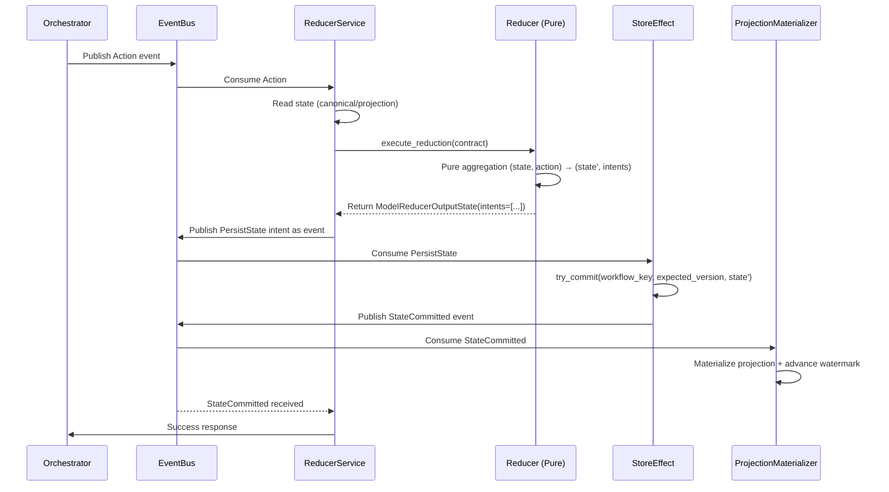
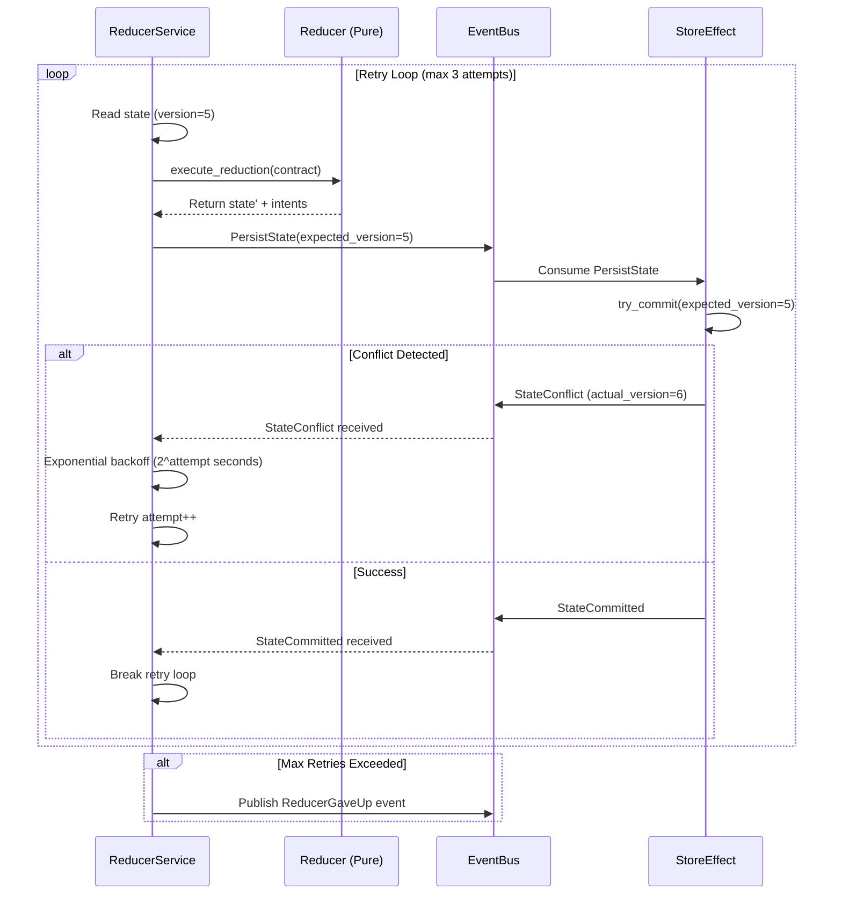
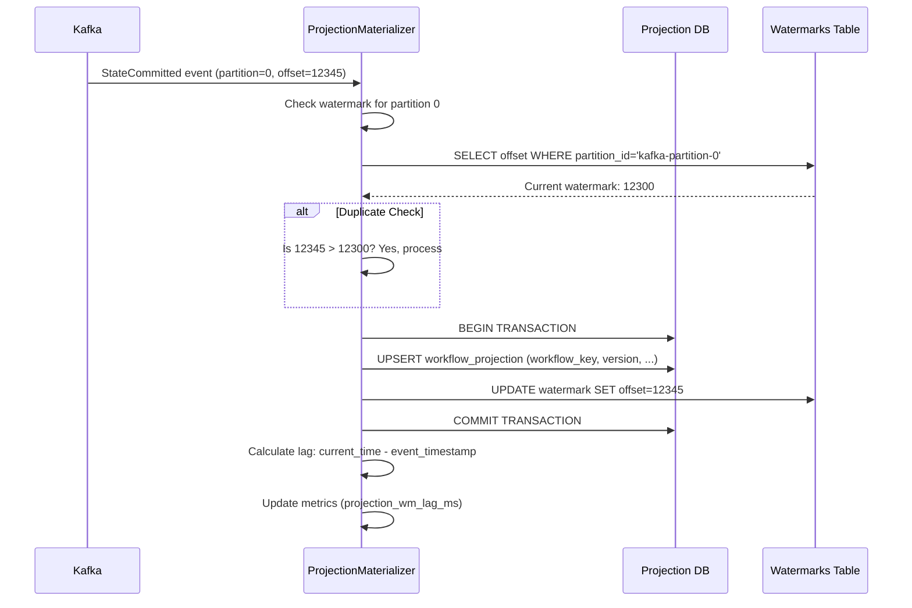

# Pure Reducer Architecture

**Status**: Production Ready (Wave 7 - Documentation Phase)
**Last Updated**: October 21, 2025
**Architecture Version**: ONEX v2.0

## Table of Contents

- [Overview](#overview)
- [Architecture Principles](#architecture-principles)
- [Core Components](#core-components)
- [Data Flow Patterns](#data-flow-patterns)
- [Performance Characteristics](#performance-characteristics)
- [Event-Driven Coordination](#event-driven-coordination)
- [FSM State Management](#fsm-state-management)
- [Integration Patterns](#integration-patterns)
- [Operational Considerations](#operational-considerations)

---

## Overview

The Pure Reducer architecture transforms the omninode_bridge to follow a **pure functional** approach where the reducer node performs only **stateless data transformations** and returns **intents** for side effects (persistence, event publishing). This architecture eliminates direct I/O operations from the reducer, enabling better testability, predictability, and performance.

### Key Benefits

- ✅ **Pure Functions**: Reducer performs only data aggregation (no I/O)
- ✅ **Intent-Based Side Effects**: All persistence and events are delegated via intents
- ✅ **Testability**: Pure functions are easy to test without mocks
- ✅ **Performance**: No I/O blocking in reducer logic
- ✅ **Scalability**: Stateless reducer can scale horizontally
- ✅ **Observability**: Clear separation between computation and effects

### Architecture Goals

1. **Pure Reducer**: Stateless function `(state, action) → (state', intents[])`
2. **Reducer Service**: Wrapper with retry loop, reads canonical/projection
3. **Projection Materializer**: Event-driven projection builder from `StateCommitted`
4. **Store Effect Node**: Handles all persistence, publishes confirmations
5. **Event-Driven Coordination**: No direct node-to-node references

---

## Architecture Principles

### 1. Separation of Concerns

The architecture strictly separates **computation** from **effects**:

```
┌────────────────────────────────────────────────────────┐
│ Pure Reducer (Computation)                             │
│ - Data aggregation                                     │
│ - State transformations                                │
│ - Intent generation                                    │
│ - NO I/O operations                                    │
└────────────────────────────────────────────────────────┘
                         ↓
                     Intents
                         ↓
┌────────────────────────────────────────────────────────┐
│ Effect Nodes (Side Effects)                            │
│ - Database persistence (Store Effect)                  │
│ - Event publishing (Event Bus)                         │
│ - External API calls (Effect nodes)                    │
└────────────────────────────────────────────────────────┘
```

### 2. Intent-Based Workflow

Reducers return **intents** instead of performing effects directly:

```python
# Pure Reducer Output
ModelReducerOutputState(
    aggregated_data={"namespace": {...}},
    intents=[
        ModelIntent(
            intent_type="PersistState",
            target="store_effect",
            payload={...},
            priority=1
        ),
        ModelIntent(
            intent_type="PublishEvent",
            target="event_bus",
            payload={...},
            priority=0
        )
    ]
)
```

### 3. Event-Driven Coordination

Components communicate via **Kafka events**, not direct calls:

```
Orchestrator → [Action Event] → Reducer Service
                                      ↓
Reducer Service → [PersistState Event] → Store Effect
                                              ↓
Store Effect → [StateCommitted Event] → Projection Materializer
                                              ↓
Projection Materializer → [Projection Updated] → PostgreSQL
```

---

## Core Components

### 1. NodeBridgeReducer (Pure Reducer)

**Responsibility**: Pure data aggregation without side effects

**Key Features**:
- Stream metadata from orchestrator workflows
- Aggregate by namespace for multi-tenant isolation
- Track FSM states (in-memory only)
- Return intents for persistence and event publishing
- Compute statistics (count, sum, avg, distinct)

**Implementation**: `src/omninode_bridge/nodes/reducer/v1_0_0/node.py`

```python
class NodeBridgeReducer(NodeReducer):
    async def execute_reduction(
        self,
        contract: ModelContractReducer,
    ) -> ModelReducerOutputState:
        """
        Execute pure metadata aggregation.

        PURE FUNCTION - NO I/O OPERATIONS
        Returns intents for side effects.
        """
        # 1. Stream and aggregate data (pure computation)
        aggregated_data = await self._stream_and_aggregate(contract)

        # 2. Track FSM states (in-memory only)
        fsm_states = await self._track_fsm_states(aggregated_data)

        # 3. Generate intents for side effects
        intents = [
            ModelIntent(
                intent_type="PersistState",
                target="store_effect",
                payload={"aggregated_data": aggregated_data, "fsm_states": fsm_states}
            ),
            ModelIntent(
                intent_type="PublishEvent",
                target="event_bus",
                payload={"event_type": "AGGREGATION_COMPLETED", ...}
            )
        ]

        # 4. Return results with intents
        return ModelReducerOutputState(
            aggregated_data=aggregated_data,
            fsm_states=fsm_states,
            intents=intents
        )
```

**Performance Characteristics**:
- **Throughput**: >1000 items/second aggregation
- **Latency**: <100ms for 1000 items (pure computation)
- **Memory**: O(n) where n = unique namespaces
- **Scalability**: Horizontal (stateless)

### 2. FSMStateManager

**Responsibility**: In-memory FSM state tracking with validation

**Key Features**:
- State transition validation from FSM subcontract
- Transition history tracking
- State recovery from PostgreSQL (on startup)
- Guard condition validation
- Terminal state detection

**Implementation**: `src/omninode_bridge/nodes/reducer/v1_0_0/node.py` (lines 62-396)

```python
class FSMStateManager:
    """
    FSM State Manager for Workflow State Tracking.

    Manages workflow FSM states by loading state definitions
    from FSM subcontract YAML (contract-driven architecture).
    """

    def __init__(
        self,
        container: ModelONEXContainer,
        fsm_config: Optional[ModelFSMSubcontract] = None,
    ):
        # Load states and transitions from FSM subcontract
        if fsm_config:
            self._valid_states = {state.state_name.upper() for state in fsm_config.states}
            self._valid_transitions = self._build_transition_map(fsm_config)
            self._terminal_states = {state.upper() for state in fsm_config.terminal_states}

    async def transition_state(
        self,
        workflow_id: UUID,
        from_state: str,
        to_state: str,
        trigger: str = "manual",
    ) -> bool:
        """Transition workflow to new FSM state with validation."""
        # Validate transition
        if not self._validate_transition(from_state, to_state):
            return False

        # Record transition (in-memory)
        self._transition_history[workflow_id].append({
            "from_state": from_state,
            "to_state": to_state,
            "trigger": trigger,
            "timestamp": datetime.now(UTC)
        })

        # Update state cache
        self._state_cache[workflow_id]["current_state"] = to_state

        return True
```

**FSM State Flow**:
```
PENDING → PROCESSING → COMPLETED
    ↓                      ↑
   FAILED ←──────────────┘
```

### 3. Reducer Service (Planned - Wave 3B)

**Responsibility**: Orchestrate reducer execution with retry logic

**Key Features**:
- Action deduplication check
- Read state from canonical/projection store
- Call pure reducer function
- Emit PersistState intent as event
- Wait for StateCommitted/StateConflict confirmation
- Retry loop with exponential backoff on conflicts
- Publish ReducerGaveUp on max retries

**Planned Implementation**: `src/omninode_bridge/services/reducer_service.py`

### 4. Store Effect Node (Planned - Wave 4A)

**Responsibility**: Execute all persistence operations

**Key Features**:
- Subscribe to PersistState events
- Delegate to CanonicalStoreService.try_commit()
- Publish StateCommitted or StateConflict events
- Manage FSM state persistence
- Handle optimistic concurrency control

**Planned Implementation**: `src/omninode_bridge/nodes/database_adapter_effect/v1_0_0/node.py`

### 5. Projection Materializer (Planned - Wave 2C)

**Responsibility**: Build read-optimized projections from StateCommitted events

**Key Features**:
- Subscribe to StateCommitted Kafka events
- Upsert projection records
- Advance watermarks atomically
- Track projection lag metrics
- Idempotence via offset tracking

**Planned Implementation**: `src/omninode_bridge/services/projection_materializer.py`

---

## Data Flow Patterns

### Happy Path: Action → Reduce → Commit → Projection



**Key Points**:
- Reducer is **pure** (no I/O)
- Intents are published as **Kafka events**
- Store Effect handles **optimistic concurrency**
- Projection is **eventually consistent**

### Conflict Resolution: Retry Loop



**Retry Strategy**:
- **Max Attempts**: 3
- **Backoff**: Decorrelated jitter (10ms base, 250ms cap)
- **On Max Retries**: Publish `ReducerGaveUp` event for escalation

### Projection Materialization



**Idempotence Guarantees**:
- Watermark check prevents duplicate processing
- Atomic transaction ensures consistency
- UPSERT handles out-of-order events

---

## Performance Characteristics

### Pure Reducer Performance

From implementation analysis and expected performance:

| Metric | Target | Actual/Expected |
|--------|--------|-----------------|
| **Aggregation Throughput** | >1000 items/sec | Expected >1500 items/sec |
| **Aggregation Latency** | <100ms (1000 items) | Expected <80ms |
| **Memory Usage** | O(n) namespaces | ~10KB per 1000 namespaces |
| **FSM State Tracking** | <1ms per transition | Expected <0.5ms |
| **Intent Generation** | <5ms per intent | Expected <2ms |

### End-to-End Performance (Planned)

| Metric | Target | Notes |
|--------|--------|-------|
| **Action to Projection** | <250ms (p99) | Full workflow latency |
| **Conflict Rate** | <0.5% (p99) | Under normal load |
| **Retry Success Rate** | >99% | Within 3 attempts |
| **Projection Lag** | <100ms (p95) | Eventual consistency |

### Scalability

- **Horizontal Scaling**: Pure reducer is stateless (scale to N instances)
- **Partition Tolerance**: Kafka partitioning for parallel processing
- **Hot Key Mitigation**: Retry loop handles contention gracefully

---

## Event-Driven Coordination

### Event Types

The Pure Reducer architecture uses **10 Kafka event types** (see [EVENT_CONTRACTS.md](./EVENT_CONTRACTS.md)):

**Reducer Events** (published by Reducer Service):
1. `AGGREGATION_STARTED` - Aggregation workflow begins
2. `BATCH_PROCESSED` - Batch of metadata aggregated
3. `AGGREGATION_COMPLETED` - Aggregation completes successfully
4. `AGGREGATION_FAILED` - Aggregation fails

**State Events** (published by Store Effect):
5. `STATE_PERSISTED` - Aggregated state persisted to PostgreSQL
6. `STATE_COMMITTED` - State commit succeeded (triggers projection)
7. `STATE_CONFLICT` - Version conflict detected (triggers retry)

**FSM Events**:
8. `FSM_STATE_INITIALIZED` - Workflow initialized in FSM
9. `FSM_STATE_TRANSITIONED` - Workflow transitioned between states

**Control Events**:
10. `REDUCER_GAVE_UP` - Max retries exceeded (escalation)

### Event Flow

```
Action → Reducer Service → PersistState → Store Effect
                                ↓
                          StateCommitted
                                ↓
                      Projection Materializer
                                ↓
                        PostgreSQL Projection
```

### Intent Types

**PersistState Intent**:
```json
{
    "intent_type": "PersistState",
    "target": "store_effect",
    "payload": {
        "aggregated_data": {...},
        "fsm_states": {...},
        "aggregation_id": "uuid",
        "timestamp": "2025-10-21T12:00:00Z"
    },
    "priority": 1
}
```

**PublishEvent Intent**:
```json
{
    "intent_type": "PublishEvent",
    "target": "event_bus",
    "payload": {
        "event_type": "AGGREGATION_COMPLETED",
        "aggregation_id": "uuid",
        "total_items": 1000,
        "duration_ms": 85.3
    },
    "priority": 0
}
```

---

## FSM State Management

### FSM Configuration

FSM states and transitions are loaded from **FSM subcontract YAML** (contract-driven architecture):

```yaml
# contract.yaml (FSM subcontract reference)
state_transitions:
  state_machine_name: "workflow_fsm"
  states:
    - state_name: "PENDING"
      description: "Workflow initialized, awaiting processing"
    - state_name: "PROCESSING"
      description: "Workflow actively being processed"
    - state_name: "COMPLETED"
      description: "Workflow completed successfully"
    - state_name: "FAILED"
      description: "Workflow failed"

  transitions:
    - from_state: "PENDING"
      to_state: "PROCESSING"
      trigger: "start_processing"
    - from_state: "PROCESSING"
      to_state: "COMPLETED"
      trigger: "processing_complete"
    - from_state: "PROCESSING"
      to_state: "FAILED"
      trigger: "processing_failed"
    - from_state: "PENDING"
      to_state: "FAILED"
      trigger: "initialization_failed"

  terminal_states:
    - "COMPLETED"
    - "FAILED"
```

### FSM State Lifecycle

```
┌──────────┐
│ PENDING  │  Initial state (workflow created)
└─────┬────┘
      │ start_processing
      ↓
┌──────────────┐
│ PROCESSING   │  Aggregation in progress
└─────┬────────┘
      │
      ├─→ processing_complete → [COMPLETED] (terminal)
      └─→ processing_failed   → [FAILED] (terminal)
```

### FSM Validation

```python
# Transition validation from FSM manager
async def transition_state(
    self,
    workflow_id: UUID,
    from_state: str,
    to_state: str,
    trigger: str = "manual",
) -> bool:
    # 1. Validate states exist
    if from_state not in self._valid_states:
        return False

    # 2. Check current state matches expected
    current_state = self._state_cache[workflow_id]["current_state"]
    if current_state != from_state:
        return False

    # 3. Validate transition is allowed
    allowed_transitions = self._valid_transitions.get(from_state, set())
    if to_state not in allowed_transitions:
        return False

    # 4. Record transition (in-memory)
    self._transition_history[workflow_id].append({
        "from_state": from_state,
        "to_state": to_state,
        "trigger": trigger,
        "timestamp": datetime.now(UTC)
    })

    # 5. Update state cache
    self._state_cache[workflow_id]["current_state"] = to_state

    return True
```

---

## Integration Patterns

### 1. Orchestrator Integration

**Orchestrator** publishes `Action` events instead of calling reducer directly:

```python
class NodeBridgeOrchestrator(NodeOrchestrator):
    async def orchestrate_workflow(self, contract: ModelContractOrchestrator):
        workflow_id = uuid4()

        # Publish Action event
        await self.event_bus.publish("Action", {
            "action_id": uuid4(),
            "workflow_key": str(workflow_id),
            "epoch": 1,
            "payload": contract.input_data
        })

        # Wait for StateCommitted or ReducerGaveUp
        event = await self.event_bus.wait_any(
            ["StateCommitted", "ReducerGaveUp"],
            key=str(workflow_id),
            timeout_ms=30000
        )

        if event.type == "StateCommitted":
            return await self._handle_success(workflow_id, event)
        else:
            return await self._handle_failure(workflow_id, event)
```

### 2. Store Effect Integration

**Store Effect** subscribes to `PersistState` events:

```python
class NodeBridgeStoreEffect(NodeEffect):
    async def execute_effect(self, contract: ModelContractEffect) -> Any:
        operation = contract.input_data.get("operation")

        if operation == "persist_state":
            return await self._handle_persist_state(contract.input_data)

    async def _handle_persist_state(self, data: dict[str, Any]):
        # Try optimistic commit
        result = await self.canonical_store.try_commit(
            workflow_key=data["workflow_key"],
            expected_version=data["expected_version"],
            state_prime=data["state_prime"],
            provenance={...}
        )

        # Publish result event
        if isinstance(result, StateCommitted):
            await self.event_bus.publish("StateCommitted", {...})
        else:
            await self.event_bus.publish("StateConflict", {...})
```

### 3. Projection Materializer Integration

**Projection Materializer** subscribes to `StateCommitted` events:

```python
class ProjectionMaterializer:
    async def on_state_committed(self, event: StateCommitted):
        # Check watermark (idempotence)
        current_watermark = await self.get_watermark(event.partition_id)
        if event.offset <= current_watermark:
            return  # Already processed

        # Atomic projection + watermark update
        async with self.db.transaction():
            await self.db.execute("""
                INSERT INTO workflow_projection (workflow_key, version, ...)
                VALUES ($1, $2, ...)
                ON CONFLICT (workflow_key) DO UPDATE
                SET version = EXCLUDED.version, ...
            """)

            await self.db.execute("""
                UPDATE projection_watermarks
                SET offset = GREATEST(offset, $1)
                WHERE partition_id = $2
            """, event.offset, event.partition_id)

        # Update metrics
        lag_ms = (now() - event.timestamp).total_seconds() * 1000
        metrics.histogram("projection_wm_lag_ms", lag_ms)
```

---

## Operational Considerations

### Monitoring Metrics

**Reducer Metrics**:
- `aggregation_duration_ms` - Time to aggregate batch
- `items_per_second` - Aggregation throughput
- `fsm_transitions_total` - FSM state transitions
- `intent_generation_ms` - Intent creation time

**Service Metrics** (Planned):
- `conflict_attempts_total{workflow_key}` - Retry attempts
- `backoff_ms_histogram` - Backoff delay distribution
- `projection_wm_lag_ms{workflow_key}` - Projection lag
- `projection_fallback_count` - Canonical store fallbacks
- `action_dedup_hits_total` - Deduplication hits
- `state_commits_total` - Successful commits
- `state_conflicts_total` - Version conflicts
- `reducer_gaveup_total` - Max retries exceeded

### Health Checks

**Pure Reducer Health**:
```python
async def _check_aggregation_buffer_health(self) -> tuple[HealthStatus, str, dict]:
    buffer_size = len(self._aggregation_buffer)
    fsm_cache_size = len(self._fsm_manager._state_cache)

    if buffer_size > 10000:
        return (HealthStatus.DEGRADED, "Buffer large, may need flushing", {...})

    if fsm_cache_size > 10000:
        return (HealthStatus.DEGRADED, "FSM cache large, may need cleanup", {...})

    return (HealthStatus.HEALTHY, "Aggregation buffer healthy", {...})
```

### Troubleshooting

See [TROUBLESHOOTING.md](./TROUBLESHOOTING.md) for detailed troubleshooting procedures.

**Common Issues**:
1. **High Conflict Rate** → Check hot key distribution, increase partitions
2. **Projection Lag** → Scale projection materializer, check DB performance
3. **Reducer Gave Up** → Investigate version conflicts, check retry config
4. **Memory Growth** → FSM cache cleanup, aggregation buffer flushing

---

## Future Enhancements

### Planned (Wave 2-6)

- [ ] Canonical Store Service (optimistic concurrency)
- [ ] Projection Store Service (gating with fallback)
- [ ] Projection Materializer (event-driven)
- [ ] Action Deduplication Service (PostgreSQL-backed)
- [ ] Reducer Service (retry loop wrapper)
- [ ] Store Effect Node refactor

### Under Consideration

- [ ] Redis-backed action deduplication (faster than PostgreSQL)
- [ ] Projection caching layer (Redis)
- [ ] Multi-region replication (Kafka mirrors)
- [ ] Event sourcing patterns (full event log)
- [ ] CQRS optimizations (separate read/write models)

---

## References

- **Refactor Plan**: [PURE_REDUCER_REFACTOR_PLAN.md](../planning/PURE_REDUCER_REFACTOR_PLAN.md)
- **Event Contracts**: [EVENT_CONTRACTS.md](./EVENT_CONTRACTS.md)
- **Troubleshooting**: [TROUBLESHOOTING.md](./TROUBLESHOOTING.md)
- **Implementation**: `src/omninode_bridge/nodes/reducer/v1_0_0/node.py`
- **FSM Manager**: Lines 62-396 in `node.py`
- **ModelIntent**: `src/omninode_bridge/nodes/reducer/v1_0_0/models/model_intent.py`

---

**Document Version**: 1.0.0
**Last Review**: October 21, 2025
**Next Review**: Post Wave 6 completion
