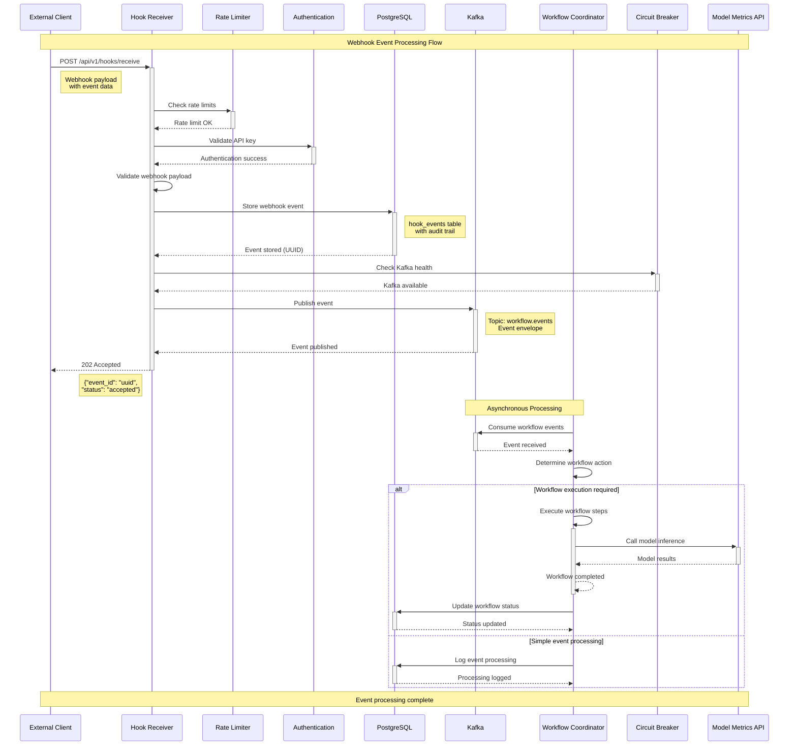
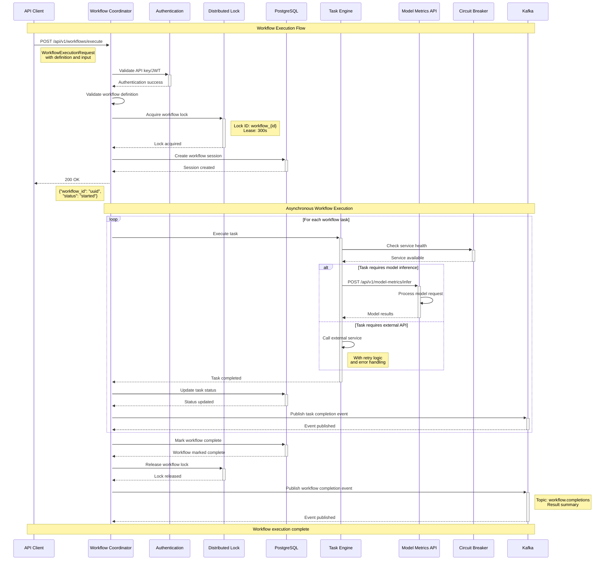

# Sequence Diagrams - OmniNode Bridge

This document contains sequence diagrams illustrating key workflow flows within the OmniNode Bridge multi-service architecture.

## 1. Webhook Event Processing Flow

This diagram shows the complete flow from webhook receipt to event processing and workflow coordination.



## 2. Workflow Execution Flow

This diagram illustrates the complete workflow execution process including distributed locking and parallel task execution.



## 3. Cross-Service Authentication Flow

This diagram shows the authentication flow across all three services with API key validation and JWT handling.

```mermaid
sequenceDiagram
    participant Client as API Client
    participant Gateway as API Gateway
    participant HookReceiver as Hook Receiver
    participant ModelMetrics as Model Metrics API
    participant WorkflowCoord as Workflow Coordinator
    participant AuthService as Auth Service
    participant AuditLog as Audit Logger
    participant RateLimit as Rate Limiter

    Note over Client, RateLimit: Cross-Service Authentication Flow

    Client->>+Gateway: API Request
    Note right of Client: Authorization: Bearer <token><br/>or X-API-Key: <key>

    Gateway->>+RateLimit: Check IP-based limits
    RateLimit-->>-Gateway: Rate limit OK

    Gateway->>Gateway: Route to appropriate service

    alt Route to Hook Receiver
        Gateway->>+HookReceiver: Forward request with auth headers

        HookReceiver->>+AuthService: Validate API key
        AuthService->>AuthService: Check key validity & expiration
        AuthService-->>-HookReceiver: Authentication result

        alt Authentication successful
            HookReceiver->>+RateLimit: Check API-key-based limits
            RateLimit-->>-HookReceiver: Rate limit OK

            HookReceiver->>+AuditLog: Log successful auth
            AuditLog-->>-HookReceiver: Logged

            HookReceiver->>HookReceiver: Process business logic
            HookReceiver-->>-Gateway: Business response

        else Authentication failed
            HookReceiver->>+AuditLog: Log failed authentication
            AuditLog-->>-HookReceiver: Logged

            HookReceiver-->>-Gateway: 401 Unauthorized
        end

    else Route to Model Metrics
        Gateway->>+ModelMetrics: Forward request with auth headers

        ModelMetrics->>+AuthService: Validate API key/JWT

        alt JWT token provided
            AuthService->>AuthService: Verify JWT signature & claims
            AuthService->>AuthService: Check token expiration
            AuthService->>AuthService: Validate audience & issuer
        else API key provided
            AuthService->>AuthService: Validate API key
        end

        AuthService-->>-ModelMetrics: Authentication result

        alt Authentication successful
            ModelMetrics->>+AuditLog: Log successful auth
            AuditLog-->>-ModelMetrics: Logged

            ModelMetrics->>ModelMetrics: Check authorization scopes
            ModelMetrics->>ModelMetrics: Process business logic
            ModelMetrics-->>-Gateway: Business response

        else Authentication failed
            ModelMetrics->>+AuditLog: Log failed authentication
            AuditLog-->>-ModelMetrics: Logged

            ModelMetrics-->>-Gateway: 401 Unauthorized
        end

    else Route to Workflow Coordinator
        Gateway->>+WorkflowCoord: Forward request with auth headers

        WorkflowCoord->>+AuthService: Validate credentials
        AuthService-->>-WorkflowCoord: Authentication result

        alt Authentication successful
            WorkflowCoord->>+RateLimit: Check endpoint-specific limits
            Note right of RateLimit: Different limits for<br/>execute vs status endpoints
            RateLimit-->>-WorkflowCoord: Rate limit OK

            WorkflowCoord->>+AuditLog: Log successful auth with workflow context
            AuditLog-->>-WorkflowCoord: Logged

            WorkflowCoord->>WorkflowCoord: Process workflow request
            WorkflowCoord-->>-Gateway: Business response

        else Authentication failed
            WorkflowCoord->>+AuditLog: Log failed authentication
            AuditLog-->>-WorkflowCoord: Logged

            WorkflowCoord-->>-Gateway: 401 Unauthorized
        end
    end

    Gateway-->>Client: Final response

    Note over Client, RateLimit: Authentication flow complete
```

## 4. Error Handling and Circuit Breaker Flow

This diagram demonstrates error handling, circuit breaker activation, and graceful degradation across services.

```mermaid
sequenceDiagram
    participant Client as API Client
    participant WorkflowCoord as Workflow Coordinator
    participant CircuitBreaker as Circuit Breaker
    participant ModelMetrics as Model Metrics API
    participant HealthCheck as Health Monitor
    participant DegradationSvc as Degradation Service
    participant FallbackSvc as Fallback Service
    participant AlertManager as Alert Manager

    Note over Client, AlertManager: Error Handling and Circuit Breaker Flow

    Client->>+WorkflowCoord: POST /api/v1/workflows/execute

    WorkflowCoord->>+CircuitBreaker: Check ModelMetrics service health
    CircuitBreaker-->>-WorkflowCoord: Circuit CLOSED (service healthy)

    WorkflowCoord->>+ModelMetrics: POST /api/v1/model-metrics/infer

    Note right of ModelMetrics: Service experiencing issues
    ModelMetrics-->>-WorkflowCoord: 500 Internal Server Error

    WorkflowCoord->>+CircuitBreaker: Record failure
    CircuitBreaker->>CircuitBreaker: Increment failure count (1/5)
    CircuitBreaker-->>-WorkflowCoord: Circuit still CLOSED

    loop Retry attempts (with exponential backoff)
        WorkflowCoord->>+ModelMetrics: Retry request
        ModelMetrics-->>-WorkflowCoord: 500 Internal Server Error

        WorkflowCoord->>+CircuitBreaker: Record failure
        CircuitBreaker->>CircuitBreaker: Increment failure count
        CircuitBreaker-->>-WorkflowCoord: Failure recorded
    end

    Note over CircuitBreaker: Failure threshold (5) exceeded

    WorkflowCoord->>+CircuitBreaker: Record failure (5th)
    CircuitBreaker->>CircuitBreaker: Open circuit breaker
    CircuitBreaker->>+AlertManager: Send circuit breaker alert
    AlertManager->>AlertManager: Process critical alert
    AlertManager-->>-CircuitBreaker: Alert sent
    CircuitBreaker-->>-WorkflowCoord: Circuit OPEN

    WorkflowCoord->>+DegradationSvc: Check degradation mode
    DegradationSvc-->>-WorkflowCoord: GRACEFUL mode enabled

    WorkflowCoord->>+DegradationSvc: Execute with fallback

    DegradationSvc->>+FallbackSvc: Use fallback implementation
    Note right of FallbackSvc: Cached results or<br/>simplified processing
    FallbackSvc-->>-DegradationSvc: Fallback response

    DegradationSvc-->>-WorkflowCoord: Graceful fallback result

    WorkflowCoord-->>Client: 200 OK (degraded service)
    Note left of WorkflowCoord: {"status": "completed",<br/>"degraded": true,<br/>"message": "Service degraded"}

    Note over HealthCheck, AlertManager: Background Recovery Process

    loop Health check attempts (every 30s)
        HealthCheck->>+ModelMetrics: GET /health

        alt Service still unhealthy
            ModelMetrics-->>-HealthCheck: 500 Internal Server Error
            HealthCheck->>+CircuitBreaker: Service still down
            CircuitBreaker-->>-HealthCheck: Circuit remains OPEN

        else Service recovered
            ModelMetrics-->>-HealthCheck: 200 OK

            HealthCheck->>+CircuitBreaker: Service recovered
            CircuitBreaker->>CircuitBreaker: Transition to HALF-OPEN
            CircuitBreaker-->>-HealthCheck: Circuit HALF-OPEN

            Note over CircuitBreaker: Allow limited test requests

            HealthCheck->>+ModelMetrics: Test request
            ModelMetrics-->>-HealthCheck: 200 OK

            HealthCheck->>+CircuitBreaker: Test successful
            CircuitBreaker->>CircuitBreaker: Close circuit breaker
            CircuitBreaker->>+AlertManager: Send recovery alert
            AlertManager-->>-CircuitBreaker: Recovery alert sent
            CircuitBreaker-->>-HealthCheck: Circuit CLOSED
        end
    end

    Note over Client, AlertManager: Service fully recovered

    Client->>+WorkflowCoord: POST /api/v1/workflows/execute (new request)

    WorkflowCoord->>+CircuitBreaker: Check ModelMetrics service health
    CircuitBreaker-->>-WorkflowCoord: Circuit CLOSED (service recovered)

    WorkflowCoord->>+ModelMetrics: POST /api/v1/model-metrics/infer
    ModelMetrics-->>-WorkflowCoord: 200 OK (normal operation)

    WorkflowCoord-->>Client: 200 OK (full service)

    Note over Client, AlertManager: Normal operation restored
```

## 5. Database Connection Pool Management Flow

This diagram shows advanced database connection pool management with leak detection and performance optimization.

```mermaid
sequenceDiagram
    participant App as Application
    participant ConnMgr as Connection Manager
    participant Pool as Connection Pool
    participant Postgres as PostgreSQL
    participant Monitor as Pool Monitor
    participant AlertSvc as Alert Service
    participant HealthCheck as Health Check

    Note over App, HealthCheck: Database Connection Pool Management Flow

    App->>+ConnMgr: Request database operation

    ConnMgr->>+Pool: Acquire connection

    alt Pool has available connections
        Pool->>Pool: Get idle connection
        Pool-->>-ConnMgr: Connection acquired

    else Pool is at capacity
        Pool->>Pool: Check for expired connections

        alt Found expired connections
            Pool->>Pool: Close expired connections
            Pool->>Pool: Create new connection
            Pool-->>-ConnMgr: New connection acquired

        else Pool exhausted
            Pool->>+Monitor: Record pool exhaustion
            Monitor->>+AlertSvc: Send pool exhaustion alert
            AlertSvc-->>-Monitor: Alert sent
            Monitor-->>-Pool: Exhaustion recorded

            Pool-->>-ConnMgr: PoolExhaustedException
        end
    end

    alt Connection acquired successfully
        ConnMgr->>+Postgres: Execute query
        Note right of Postgres: SELECT/INSERT/UPDATE<br/>with prepared statements
        Postgres-->>-ConnMgr: Query result

        ConnMgr->>ConnMgr: Process result

        ConnMgr->>+Pool: Release connection
        Pool->>Pool: Mark connection as idle
        Pool->>Pool: Update connection metrics
        Pool-->>-ConnMgr: Connection released

        ConnMgr-->>-App: Operation result

    else Connection acquisition failed
        ConnMgr->>+Monitor: Record connection failure
        Monitor-->>-ConnMgr: Failure recorded

        ConnMgr-->>-App: DatabaseConnectionException
    end

    Note over Monitor, HealthCheck: Background Monitoring

    loop Every 30 seconds
        Monitor->>+Pool: Collect pool statistics
        Pool-->>-Monitor: Pool metrics
        Note right of Pool: Active: 15, Idle: 5<br/>Total queries: 1000<br/>Avg response: 45ms

        Monitor->>Monitor: Analyze pool health

        alt Pool utilization > 90%
            Monitor->>+AlertSvc: Send high utilization alert
            AlertSvc-->>-Monitor: Alert sent

        else Pool utilization < 20%
            Monitor->>+Pool: Consider shrinking pool
            Pool->>Pool: Close excess idle connections
            Pool-->>-Monitor: Pool optimized

        else Normal utilization
            Monitor->>Monitor: Log normal metrics
        end

        Monitor->>+HealthCheck: Update pool health status
        HealthCheck-->>-Monitor: Health status updated
    end

    Note over App, HealthCheck: Continuous pool optimization
```

## 6. Kafka Event Streaming Flow

This diagram illustrates event streaming between services using Kafka with error handling and retry mechanisms.

```mermaid
sequenceDiagram
    participant HookReceiver as Hook Receiver
    participant KafkaProducer as Kafka Producer
    participant KafkaBroker as Kafka Broker
    participant KafkaConsumer as Kafka Consumer
    participant WorkflowCoord as Workflow Coordinator
    participant DeadLetter as Dead Letter Queue
    participant RetryHandler as Retry Handler
    participant Monitor as Kafka Monitor

    Note over HookReceiver, Monitor: Kafka Event Streaming Flow

    HookReceiver->>HookReceiver: Process webhook event

    HookReceiver->>+KafkaProducer: Publish event
    Note right of HookReceiver: Topic: workflow.events<br/>Event envelope with metadata

    KafkaProducer->>KafkaProducer: Serialize event to JSON
    KafkaProducer->>KafkaProducer: Add correlation ID and timestamp

    KafkaProducer->>+KafkaBroker: Send message to topic

    alt Message published successfully
        KafkaBroker->>KafkaBroker: Store message in partition
        KafkaBroker-->>-KafkaProducer: Ack received

        KafkaProducer-->>-HookReceiver: Publish successful

        Note over KafkaBroker, WorkflowCoord: Asynchronous consumption

        KafkaConsumer->>+KafkaBroker: Poll for messages
        KafkaBroker-->>-KafkaConsumer: Return batch of messages

        loop For each message in batch
            KafkaConsumer->>+WorkflowCoord: Deliver event

            alt Message processed successfully
                WorkflowCoord->>WorkflowCoord: Process workflow event
                WorkflowCoord-->>-KafkaConsumer: Processing complete

                KafkaConsumer->>+KafkaBroker: Commit offset
                KafkaBroker-->>-KafkaConsumer: Offset committed

                KafkaConsumer->>+Monitor: Record successful processing
                Monitor-->>-KafkaConsumer: Metrics updated

            else Message processing failed
                WorkflowCoord-->>-KafkaConsumer: Processing failed

                KafkaConsumer->>+RetryHandler: Handle retry logic

                alt Retry count < max retries
                    RetryHandler->>RetryHandler: Increment retry count
                    RetryHandler->>RetryHandler: Apply exponential backoff
                    RetryHandler-->>-KafkaConsumer: Schedule retry

                    Note over KafkaConsumer: Wait for backoff period

                    KafkaConsumer->>+WorkflowCoord: Retry processing
                    WorkflowCoord-->>-KafkaConsumer: Retry result

                else Max retries exceeded
                    RetryHandler->>+DeadLetter: Send to dead letter queue
                    Note right of DeadLetter: Topic: workflow.events.dlq<br/>Original message + error info
                    DeadLetter-->>-RetryHandler: Message sent to DLQ

                    RetryHandler-->>-KafkaConsumer: Move to dead letter

                    KafkaConsumer->>+KafkaBroker: Commit offset (skip message)
                    KafkaBroker-->>-KafkaConsumer: Offset committed

                    KafkaConsumer->>+Monitor: Record DLQ message
                    Monitor-->>-KafkaConsumer: DLQ metrics updated
                end
            end
        end

    else Message publish failed
        KafkaBroker-->>-KafkaProducer: Publish error

        KafkaProducer->>+RetryHandler: Handle producer retry

        alt Retry count < max retries
            RetryHandler->>RetryHandler: Apply producer retry logic
            RetryHandler->>+KafkaProducer: Retry publish
            KafkaProducer->>+KafkaBroker: Retry send message
            KafkaBroker-->>-KafkaProducer: Retry result
            KafkaProducer-->>-RetryHandler: Retry outcome
            RetryHandler-->>-KafkaProducer: Retry handled

        else Producer retries exhausted
            RetryHandler-->>-KafkaProducer: Publish failed permanently
        end

        KafkaProducer-->>-HookReceiver: Publish failed

        HookReceiver->>+Monitor: Record publish failure
        Monitor-->>-HookReceiver: Failure recorded
    end

    Note over HookReceiver, Monitor: Event streaming complete
```

## 7. API Rate Limiting Flow

This diagram shows the multi-tier rate limiting implementation with adaptive limits and reputation tracking.

```mermaid
sequenceDiagram
    participant Client as API Client
    participant Gateway as API Gateway
    participant RateLimiter as Rate Limiter
    participant ReputationSvc as Reputation Service
    participant RedisCache as Redis Cache
    participant AlertSvc as Alert Service
    participant AuditLog as Audit Logger
    participant BackendSvc as Backend Service

    Note over Client, BackendSvc: Multi-Tier Rate Limiting Flow

    Client->>+Gateway: API Request
    Note right of Client: Multiple requests from<br/>same client/IP

    Gateway->>+RateLimiter: Check rate limits

    RateLimiter->>+RedisCache: Check IP-based counter
    RedisCache-->>-RateLimiter: Current IP request count

    RateLimiter->>RateLimiter: Evaluate IP-based limit (100/min)

    alt IP limit exceeded
        RateLimiter->>+AuditLog: Log rate limit violation
        AuditLog-->>-RateLimiter: Violation logged

        RateLimiter->>+AlertSvc: Send rate limit alert
        AlertSvc-->>-RateLimiter: Alert sent

        RateLimiter-->>-Gateway: Rate limit exceeded (IP)
        Gateway-->>Client: 429 Too Many Requests
        Note left of Gateway: X-RateLimit-Limit: 100<br/>X-RateLimit-Remaining: 0<br/>Retry-After: 60

    else IP limit OK
        RateLimiter->>RateLimiter: Check API key (if provided)

        alt API key provided
            RateLimiter->>+RedisCache: Check API key counter
            RedisCache-->>-RateLimiter: Current API key request count

            RateLimiter->>+ReputationSvc: Get user reputation
            ReputationSvc-->>-RateLimiter: Reputation score (0.0-1.0)

            RateLimiter->>RateLimiter: Calculate adaptive limit
            Note right of RateLimiter: Base: 1000/min<br/>Reputation: 0.8<br/>Adaptive: 1500/min

            alt API key limit exceeded
                RateLimiter->>+ReputationSvc: Update reputation (penalty)
                ReputationSvc->>ReputationSvc: Decrease reputation score
                ReputationSvc-->>-RateLimiter: Reputation updated

                RateLimiter->>+AuditLog: Log API key rate limit
                AuditLog-->>-RateLimiter: Violation logged

                RateLimiter-->>-Gateway: Rate limit exceeded (API key)
                Gateway-->>Client: 429 Too Many Requests

            else API key limit OK
                RateLimiter->>+RedisCache: Increment API key counter
                RedisCache-->>-RateLimiter: Counter updated

                RateLimiter-->>-Gateway: Rate limit OK
            end

        else No API key
            RateLimiter->>+RedisCache: Increment IP counter
            RedisCache-->>-RateLimiter: Counter updated

            RateLimiter-->>-Gateway: Rate limit OK (IP only)
        end

        Gateway->>Gateway: Route to appropriate service
        Gateway->>+BackendSvc: Forward request

        BackendSvc->>+RateLimiter: Check endpoint-specific limits
        Note right of BackendSvc: Different limits per endpoint:<br/>/workflows/execute: 50/min<br/>/workflows/status: 300/min

        RateLimiter->>+RedisCache: Check endpoint counter
        RedisCache-->>-RateLimiter: Current endpoint count

        alt Endpoint limit exceeded
            RateLimiter->>+AuditLog: Log endpoint rate limit
            AuditLog-->>-RateLimiter: Violation logged

            RateLimiter-->>-BackendSvc: Endpoint rate limit exceeded
            BackendSvc-->>Gateway: 429 Too Many Requests

        else Endpoint limit OK
            RateLimiter->>+RedisCache: Increment endpoint counter
            RedisCache-->>-RateLimiter: Counter updated

            RateLimiter-->>-BackendSvc: All limits OK

            BackendSvc->>BackendSvc: Process business logic
            BackendSvc-->>Gateway: Business response

            alt Request successful
                Gateway->>+ReputationSvc: Update reputation (positive)
                ReputationSvc->>ReputationSvc: Slight reputation increase
                ReputationSvc-->>-Gateway: Reputation updated

            else Request failed (4xx/5xx)
                Gateway->>+ReputationSvc: Update reputation (negative)
                ReputationSvc->>ReputationSvc: Reputation decrease
                ReputationSvc-->>-Gateway: Reputation updated
            end
        end

        Gateway-->>Client: Final response
        Note left of Gateway: X-RateLimit-Limit: current_limit<br/>X-RateLimit-Remaining: remaining<br/>X-RateLimit-Reset: reset_time
    end

    Note over Client, BackendSvc: Rate limiting complete
```

## Summary

These sequence diagrams provide comprehensive visual documentation of the key workflows within the OmniNode Bridge multi-service architecture:

1. **Webhook Event Processing**: End-to-end flow from external webhook to event processing
2. **Workflow Execution**: Complete workflow orchestration with distributed locking
3. **Cross-Service Authentication**: Authentication flow across all three services
4. **Error Handling and Circuit Breakers**: Resilience patterns and graceful degradation
5. **Database Connection Pool Management**: Advanced connection management with monitoring
6. **Kafka Event Streaming**: Asynchronous event processing with retry mechanisms
7. **API Rate Limiting**: Multi-tier rate limiting with adaptive and reputation-based controls

These diagrams serve as:
- **Developer Reference**: Understanding system behavior and integration points
- **Troubleshooting Guide**: Visualizing failure points and error handling paths
- **Architecture Documentation**: Clear communication of system design decisions
- **Onboarding Material**: Helping new team members understand system flows
- **Operations Guide**: Supporting incident response and system monitoring

Each diagram includes error scenarios, monitoring integration, and compliance with the architectural decisions documented in the ADRs.
