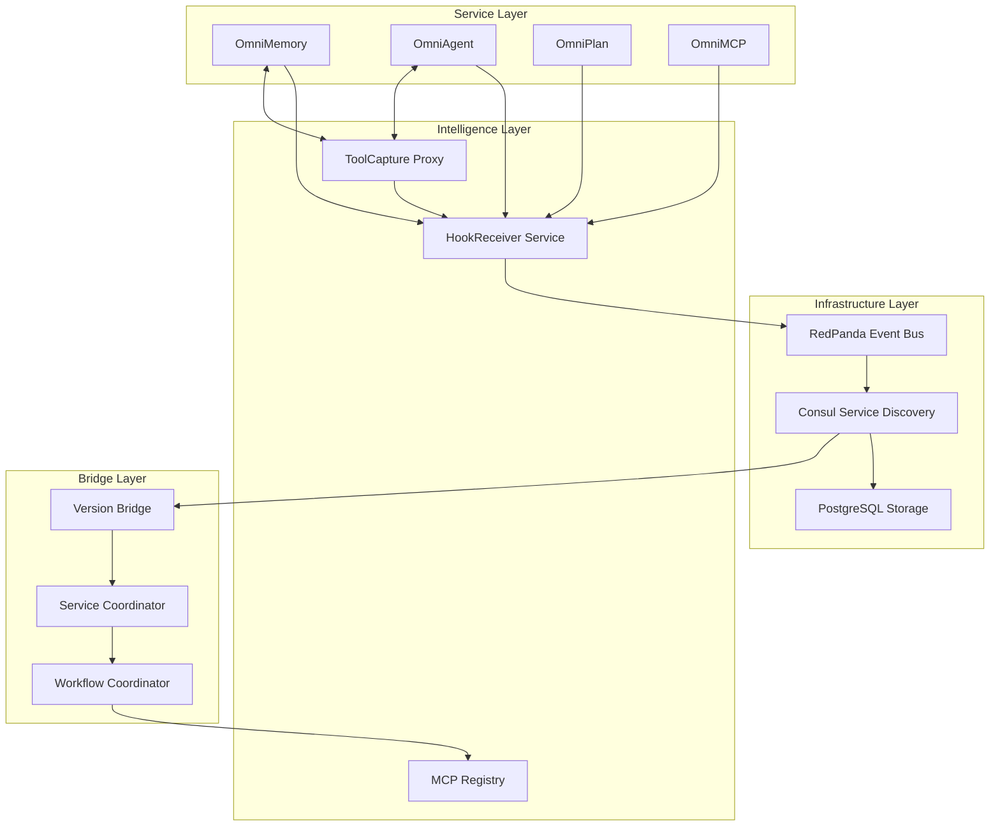

# Service Architecture

## Overview

The OmniNode Bridge implements an intelligent service coordination architecture that combines traditional microservices patterns with advanced hook and proxy intelligence systems for automatic learning and optimization.

## Core Architecture



## Component Responsibilities

### Infrastructure Layer

#### RedPanda Event Bus
- **Purpose**: High-performance event streaming for service coordination
- **Role**: Central nervous system for all service communication
- **Intelligence**: Every event captured for pattern learning
- **Topics**: `hooks.*`, `services.*`, `tools.*`, `coordination.*`

#### Consul Service Discovery
- **Purpose**: Dynamic service registration and health monitoring
- **Role**: Service registry with capability metadata
- **Intelligence**: Automatic service discovery and tool registration
- **Features**: Health checks, KV store, service mesh preparation

#### PostgreSQL Storage
- **Purpose**: Persistent storage for state and intelligence
- **Role**: Session management, conversation tracking, pattern storage
- **Intelligence**: Correlation IDs, execution history, learned patterns
- **Schemas**: Sessions, events, metrics, patterns

### Intelligence Layer

#### HookReceiver Service
**Source**: `omnibase_3/src/omnibase/services/hook_receiver_service.py`

- **Purpose**: Automatic intelligence capture from all service interactions
- **Capabilities**:
  - Pre/post execution hook processing
  - Service lifecycle event capture
  - Session correlation and tracking
  - Metrics collection and analysis
- **Integration**: FastAPI + Kafka + PostgreSQL
- **Intelligence**: Every service interaction becomes learning data

#### ToolCapture Proxy
**Source**: `omnibase_3/src/omnibase/services/tool_capture_proxy.py`

- **Purpose**: Intelligent proxy for service-to-service communication
- **Capabilities**:
  - Request/response capture and correlation
  - User interaction intelligence
  - Tool usage pattern analysis
  - Performance monitoring
- **Integration**: FastAPI proxy + Kafka event publishing
- **Intelligence**: Communication patterns drive optimization

#### MCP Registry
**Source**: `omnibase_3/src/omnibase/model/mcp/model_mcp_hooks_registry.py`

- **Purpose**: Dynamic MCP tool registration and hook management
- **Capabilities**:
  - Tool discovery from service metadata
  - Dynamic hook installation
  - Function interception and monitoring
  - Registry management and validation
- **Integration**: Consul metadata → Tool registration
- **Intelligence**: Tool usage drives capability discovery

### Service Layer

#### OmniMemory
- **Purpose**: Unified memory and intelligence system
- **Integration**: Event-driven cache invalidation, intelligence hooks
- **Intelligence**: Memory access patterns → Optimization strategies
- **Coordination**: LRU caching with circuit breaker patterns

#### OmniAgent
- **Purpose**: Agent orchestration and workflow execution
- **Integration**: Parallel execution with coordination events
- **Intelligence**: Agent performance → Workflow optimization
- **Coordination**: Multi-agent workflows with dependency management

#### OmniPlan
- **Purpose**: Resource, Schedule, and Dependency (RSD) planning
- **Integration**: Planning events → Coordination optimization
- **Intelligence**: Planning patterns → Predictive scheduling
- **Coordination**: Resource allocation and conflict resolution

#### OmniMCP
- **Purpose**: Distributed tool registration and management
- **Integration**: Tool metadata → Dynamic registration
- **Intelligence**: Tool usage → Capability expansion
- **Coordination**: Tool routing and load balancing

### Bridge Layer

#### Version Bridge
- **Purpose**: Version compatibility and transformation
- **Pattern**: Simple routing initially, evolving to intelligent routing
- **Implementation**:
  ```python
  class SimpleVersionBridge:
      async def route_by_version(self, request, target_version):
          services = await self.consul.find_services(version=target_version)
          return await self.forward_request(services[0], request)
  ```

#### Service Coordinator
- **Purpose**: Orchestrated service startup and dependency management
- **Pattern**: Dependency-driven startup sequence
- **Implementation**:
  ```python
  class ServiceCoordinator:
      async def start_services(self):
          await self.start_infrastructure()  # RedPanda, Consul, PostgreSQL
          await self.start_intelligence()    # Hooks, Proxy, Registry
          await self.start_services()        # OmniMemory, OmniAgent, etc.
          await self.start_coordination()    # Bridge layer
  ```

#### Workflow Coordinator
- **Purpose**: Multi-agent workflow orchestration
- **Pattern**: Parallel execution with dependency resolution
- **Implementation**: Based on Archon coordination patterns

## Intelligence Flow

### Event-Driven Intelligence Capture
```
Service Event → Hook Receiver → Kafka Topic → Intelligence Processing → Pattern Storage → System Optimization
```

### Proxy-Based Communication Intelligence
```
Service Request → Tool Capture Proxy → Intelligence Capture → Target Service → Response Analysis → Pattern Learning
```

### Dynamic Discovery and Registration
```
Service Startup → Capability Metadata → Consul Registration → Tool Discovery → MCP Registration → Hook Installation
```

## Scalability Patterns

### Horizontal Scaling
- **Services**: Independent scaling based on load
- **Intelligence**: Kafka partitioning for parallel processing
- **Storage**: PostgreSQL read replicas for intelligence queries

### Vertical Optimization
- **Caching**: LRU caching with circuit breakers
- **Connection Pooling**: Optimized database connections
- **Event Batching**: Efficient Kafka producer batching

### Circuit Breaker Integration
```python
class EventBusCircuitBreaker:
    def __init__(self):
        self.failure_threshold = 5
        self.timeout = 30
        self.state = "CLOSED"

    async def call_with_breaker(self, operation):
        if self.state == "OPEN":
            if time.time() - self.last_failure > self.timeout:
                self.state = "HALF_OPEN"
            else:
                raise CircuitBreakerOpenException()

        try:
            result = await operation()
            if self.state == "HALF_OPEN":
                self.state = "CLOSED"
            return result
        except Exception as e:
            self.failure_count += 1
            if self.failure_count >= self.failure_threshold:
                self.state = "OPEN"
                self.last_failure = time.time()
            raise
```

## Security Architecture

### Authentication Flow
- **Service-to-Service**: mTLS for internal communication
- **User Authentication**: JWT tokens with service validation
- **Hook Authentication**: Secure endpoints with API key validation

### Authorization Patterns
- **RBAC**: Role-based access control for service capabilities
- **Service Mesh**: Consul Connect for secure service communication
- **Intelligence Privacy**: Sensitive data filtering in hook capture

## Performance Characteristics

### Expected Performance
- **Event Latency**: <50ms for hook event processing
- **Service Discovery**: <10ms for Consul lookups
- **Proxy Overhead**: <5ms additional latency
- **Intelligence Processing**: <100ms for pattern analysis

### Monitoring Points
- **Service Health**: Consul health checks every 10s
- **Event Processing**: Kafka lag monitoring
- **Intelligence Quality**: Pattern confidence scoring
- **System Performance**: Response time percentiles

## Deployment Architecture

### Container Organization
```yaml
services:
  # Infrastructure
  redpanda: # Event streaming
  consul: # Service discovery
  postgres: # Storage

  # Intelligence
  hook-receiver: # Event capture
  tool-proxy: # Communication intelligence
  mcp-registry: # Tool management

  # Services
  omnimemory: # Memory and intelligence
  omniagent: # Agent orchestration
  omniplan: # Planning and RSD
  omnimcp: # Tool distribution

  # Bridge
  version-bridge: # Version coordination
  service-coordinator: # Service management
```

This architecture enables the transition from basic service coordination to intelligent, self-improving orchestration that accelerates standardization through captured intelligence.
