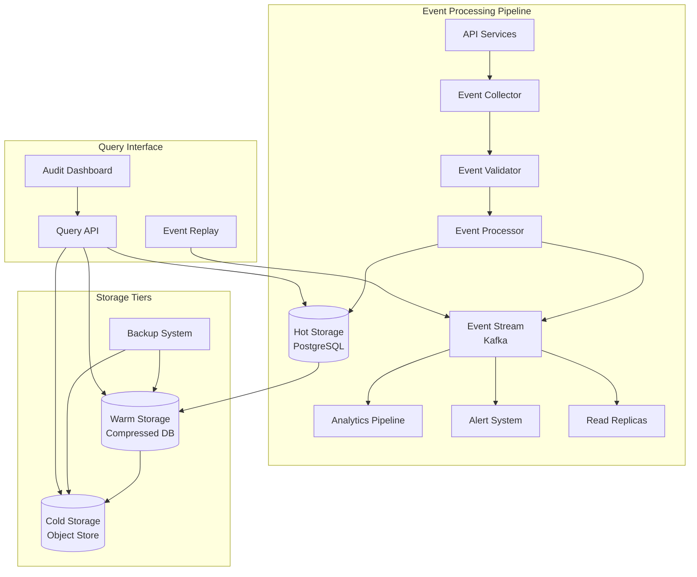

# ADR-012: Event Sourcing and Audit Strategy

**Status**: Accepted
**Date**: 2024-01-26
**Deciders**: Data Engineering Team, Compliance Team, Security Team
**Technical Story**: Comprehensive Audit Trail and System State Reconstruction

## Context

OmniNode Bridge requires comprehensive audit trails for:
- **Compliance Requirements**: Financial and healthcare industry compliance (SOX, HIPAA, GDPR)
- **Security Auditing**: Detailed forensic capabilities for security incidents
- **System Debugging**: Ability to reconstruct system state for troubleshooting
- **Business Analytics**: Understanding system usage patterns and optimization
- **Legal Requirements**: Immutable audit logs for legal proceedings

The system processes high-volume events (webhook processing, model executions, workflow orchestration) and needs to maintain complete traceability without impacting performance.

Current challenges:
- High-frequency events (1000+ events/second peak)
- Multiple event sources and types
- Requirement for immutable audit trails
- Need for efficient querying and analysis
- Long-term retention requirements (7+ years)

## Decision

Implement a hybrid event sourcing and audit strategy with:

### 1. Event Sourcing for Critical Business Events
- Store all state-changing events as immutable sequence
- Derive current state from event stream when needed
- Enable point-in-time state reconstruction
- Support event replay for system recovery

### 2. Comprehensive Audit Logging
- Structured logging for all API calls and system actions
- Correlation IDs for distributed request tracing
- Immutable audit trail storage
- Automated compliance reporting

### 3. Multi-Tier Storage Strategy
- Hot storage: Recent events (30 days) in PostgreSQL
- Warm storage: Medium-term events (1 year) in compressed format
- Cold storage: Long-term events (7+ years) in object storage

## Event Categories

### Business Events (Event Sourcing)
```python
class BusinessEvent(BaseModel):
    event_id: UUID
    event_type: str
    aggregate_id: UUID
    aggregate_type: str
    event_version: int
    timestamp: datetime
    correlation_id: UUID
    causation_id: Optional[UUID]
    user_id: Optional[str]
    payload: Dict[str, Any]
    metadata: Dict[str, Any]

# Examples:
# - HookEventReceived
# - WorkflowCreated
# - TaskExecuted
# - ModelMetricsRecorded
```

### Audit Events (Logging)
```python
class AuditEvent(BaseModel):
    audit_id: UUID
    timestamp: datetime
    event_type: AuditEventType
    user_id: Optional[str]
    ip_address: str
    user_agent: str
    resource: str
    action: str
    outcome: AuditOutcome
    details: Dict[str, Any]
    risk_score: int
    correlation_id: UUID

# Examples:
# - AuthenticationAttempt
# - APIAccess
# - DataAccess
# - ConfigurationChange
# - SecurityViolation
```

## Implementation Architecture



## Event Schema Design

### Event Store Schema
```sql
CREATE TABLE event_store (
    event_id UUID PRIMARY KEY,
    event_type VARCHAR(100) NOT NULL,
    aggregate_id UUID NOT NULL,
    aggregate_type VARCHAR(50) NOT NULL,
    event_version INTEGER NOT NULL,
    timestamp TIMESTAMPTZ NOT NULL DEFAULT NOW(),
    correlation_id UUID NOT NULL,
    causation_id UUID,
    user_id VARCHAR(100),
    payload JSONB NOT NULL,
    metadata JSONB NOT NULL DEFAULT '{}',

    -- Indexing for performance
    CONSTRAINT unique_aggregate_version UNIQUE (aggregate_id, event_version)
);

-- Indexes for efficient querying
CREATE INDEX idx_event_store_aggregate ON event_store (aggregate_id, event_version);
CREATE INDEX idx_event_store_type_time ON event_store (event_type, timestamp);
CREATE INDEX idx_event_store_correlation ON event_store (correlation_id);
CREATE INDEX idx_event_store_timestamp ON event_store (timestamp);
```

### Audit Log Schema
```sql
CREATE TABLE audit_log (
    audit_id UUID PRIMARY KEY,
    timestamp TIMESTAMPTZ NOT NULL DEFAULT NOW(),
    event_type VARCHAR(50) NOT NULL,
    user_id VARCHAR(100),
    ip_address INET NOT NULL,
    user_agent TEXT,
    resource VARCHAR(200) NOT NULL,
    action VARCHAR(50) NOT NULL,
    outcome VARCHAR(20) NOT NULL,
    details JSONB NOT NULL DEFAULT '{}',
    risk_score INTEGER NOT NULL DEFAULT 0,
    correlation_id UUID NOT NULL,

    -- Partition by month for performance
    PARTITION OF audit_log_partitioned FOR VALUES FROM ('2024-01-01') TO ('2024-02-01')
);

-- Indexes for audit queries
CREATE INDEX idx_audit_user_time ON audit_log (user_id, timestamp);
CREATE INDEX idx_audit_resource_action ON audit_log (resource, action);
CREATE INDEX idx_audit_risk_score ON audit_log (risk_score DESC, timestamp);
```

## Data Lifecycle Management

### 1. Retention Policies
```yaml
retention_policies:
  hot_storage:
    duration: 30_days
    performance: high
    cost: high

  warm_storage:
    duration: 1_year
    compression: gzip
    performance: medium
    cost: medium

  cold_storage:
    duration: 7_years
    compression: lz4
    performance: low
    cost: low

  compliance_archive:
    duration: permanent
    encryption: aes_256
    immutable: true
    cost: minimal
```

### 2. Data Migration Pipeline
```python
class DataLifecycleManager:
    async def migrate_to_warm_storage(self):
        """Migrate events older than 30 days to warm storage."""
        cutoff_date = datetime.utcnow() - timedelta(days=30)

        # Compress and move events
        events = await self.get_events_before(cutoff_date)
        compressed_events = await self.compress_events(events)
        await self.store_in_warm_storage(compressed_events)
        await self.delete_from_hot_storage(events)

    async def migrate_to_cold_storage(self):
        """Migrate events older than 1 year to cold storage."""
        cutoff_date = datetime.utcnow() - timedelta(days=365)

        # Archive to object storage
        events = await self.get_warm_events_before(cutoff_date)
        archived_events = await self.create_archive(events)
        await self.store_in_cold_storage(archived_events)
        await self.delete_from_warm_storage(events)
```

## Query and Replay Capabilities

### 1. Event Replay System
```python
class EventReplayService:
    async def replay_events(
        self,
        aggregate_id: UUID,
        from_version: int = 0,
        to_version: Optional[int] = None
    ) -> List[BusinessEvent]:
        """Replay events for aggregate state reconstruction."""

        events = await self.event_store.get_events(
            aggregate_id=aggregate_id,
            from_version=from_version,
            to_version=to_version
        )

        return events

    async def reconstruct_state_at_time(
        self,
        aggregate_id: UUID,
        timestamp: datetime
    ) -> Dict[str, Any]:
        """Reconstruct aggregate state at specific point in time."""

        events = await self.event_store.get_events_before(
            aggregate_id=aggregate_id,
            timestamp=timestamp
        )

        aggregate = self.aggregate_factory.create(aggregate_id)
        for event in events:
            aggregate.apply_event(event)

        return aggregate.get_state()
```

### 2. Audit Query API
```python
class AuditQueryService:
    async def get_user_activity(
        self,
        user_id: str,
        from_time: datetime,
        to_time: datetime
    ) -> List[AuditEvent]:
        """Get all activity for a specific user."""

    async def get_resource_access(
        self,
        resource: str,
        from_time: datetime,
        to_time: datetime
    ) -> List[AuditEvent]:
        """Get all access attempts for a resource."""

    async def detect_anomalies(
        self,
        lookback_hours: int = 24
    ) -> List[SecurityAnomaly]:
        """Detect suspicious patterns in audit logs."""
```

## Security and Compliance Features

### 1. Immutability Guarantees
- Write-only event store with append-only operations
- Digital signatures for critical events
- Merkle tree verification for data integrity
- Tamper detection and alerting

### 2. Data Privacy Controls
```python
class PrivacyManager:
    async def anonymize_user_data(self, user_id: str):
        """Anonymize user data while preserving audit trail."""
        # Replace PII with anonymized identifiers
        # Maintain referential integrity
        # Log anonymization action

    async def handle_data_deletion_request(self, user_id: str):
        """Handle GDPR right to be forgotten requests."""
        # Mark data for deletion (soft delete)
        # Maintain compliance audit trail
        # Schedule secure data destruction
```

### 3. Compliance Reporting
```python
class ComplianceReporter:
    async def generate_sox_report(
        self,
        period_start: datetime,
        period_end: datetime
    ) -> ComplianceReport:
        """Generate SOX compliance report."""

    async def generate_gdpr_report(
        self,
        data_subject_id: str
    ) -> GDPRReport:
        """Generate GDPR data processing report."""

    async def generate_audit_summary(
        self,
        period: str
    ) -> AuditSummary:
        """Generate executive audit summary."""
```

## Performance Considerations

### 1. Write Performance Optimization
- Batch event processing for high-throughput scenarios
- Asynchronous event persistence with confirmation
- Connection pooling and prepared statements
- Write-through caching for hot aggregates

### 2. Read Performance Optimization
- Read replicas for audit queries
- Materialized views for common queries
- Caching of frequently accessed events
- Query result pagination and streaming

### 3. Storage Optimization
- JSONB compression for payload data
- Partition tables by time for efficient queries
- Regular VACUUM and ANALYZE operations
- Archive old data to reduce active dataset size

## Monitoring and Alerting

### 1. Event Processing Metrics
```python
# Prometheus metrics for event processing
EVENT_STORE_WRITES = Counter(
    "event_store_writes_total",
    "Total events written to store",
    ["event_type", "aggregate_type"]
)

EVENT_PROCESSING_TIME = Histogram(
    "event_processing_seconds",
    "Time to process and store event",
    ["event_type"]
)

AUDIT_LOG_ENTRIES = Counter(
    "audit_log_entries_total",
    "Total audit log entries",
    ["event_type", "outcome"]
)
```

### 2. Compliance Monitoring
- Real-time anomaly detection
- Automated compliance violation alerts
- Data retention policy enforcement monitoring
- Security incident escalation triggers

## Consequences

### Positive Consequences
- **Complete Audit Trail**: Immutable record of all system activities
- **Point-in-Time Recovery**: Ability to reconstruct system state at any point
- **Compliance Ready**: Built-in support for major compliance frameworks
- **Forensic Capabilities**: Detailed investigation capabilities for security incidents
- **Business Intelligence**: Rich data for analytics and optimization
- **System Resilience**: Event replay capabilities for disaster recovery

### Negative Consequences
- **Storage Overhead**: Significant storage requirements for complete event history
- **Query Complexity**: Complex queries for event sourcing and audit data
- **Performance Impact**: Additional latency for event persistence
- **Operational Complexity**: Complex data lifecycle management
- **Development Overhead**: Additional code for event sourcing patterns

## Compliance

This decision ensures compliance with:
- **SOX (Sarbanes-Oxley)**: Immutable audit trails and financial data integrity
- **HIPAA**: Secure audit logging for healthcare data access
- **GDPR**: Data processing transparency and right to be forgotten
- **PCI DSS**: Detailed logging for payment data handling
- **SOC 2**: Comprehensive security and availability monitoring

## Related Decisions

- ADR-002: Event-Driven Architecture with Kafka (event streaming)
- ADR-005: PostgreSQL for Primary Data Storage (event store)
- ADR-008: Structured Logging with JSON Format (audit logging)
- ADR-010: Prometheus and Grafana for Monitoring (metrics collection)

## References

- [Event Sourcing Patterns](https://martinfowler.com/eaaDev/EventSourcing.html)
- [GDPR Compliance Guidelines](https://gdpr.eu/compliance/)
- [SOX Audit Requirements](https://www.sox-online.com/sox_overview.html)
- [NIST Cybersecurity Framework](https://www.nist.gov/cyberframework)
