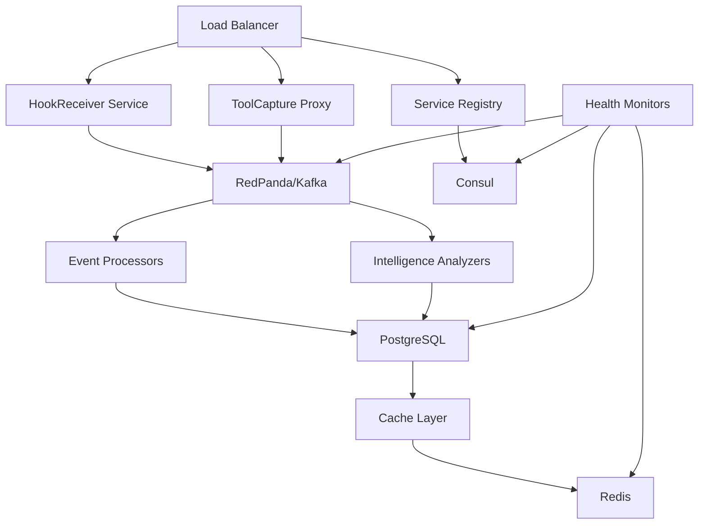
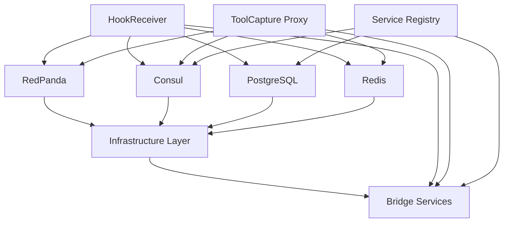

# Docker Deployment Guide

## Overview

This guide covers Docker containerization, orchestration, and deployment strategies for OmniNode Bridge services. The bridge uses a microservices architecture with event-driven communication through RedPanda/Kafka.

## Service Architecture



## Core Services

### 1. HookReceiver Service

**Purpose**: Intelligent service lifecycle monitoring and event capture

```dockerfile
# hookReceiver/Dockerfile
FROM python:3.11-slim

WORKDIR /app

# Install system dependencies
RUN apt-get update && apt-get install -y \
    gcc \
    && rm -rf /var/lib/apt/lists/*

# Copy requirements and install Python dependencies
COPY requirements.txt .
RUN pip install --no-cache-dir -r requirements.txt

# Copy application code
COPY src/ ./src/
COPY config/ ./config/

# Health check
HEALTHCHECK --interval=30s --timeout=10s --start-period=40s --retries=3 \
    CMD python -c "import requests; requests.get('http://localhost:8000/health')"

# Run the service
CMD ["python", "-m", "src.main"]
```

**Docker Compose Configuration**:
```yaml
hook-receiver:
  build:
    context: ./services/hookReceiver
    dockerfile: Dockerfile
  ports:
    - "8001:8000"
  environment:
    - KAFKA_BOOTSTRAP_SERVERS=redpanda:9092
    - CONSUL_HOST=consul
    - CONSUL_PORT=8500
    - POSTGRES_HOST=postgres
    - POSTGRES_DB=omninode_bridge
    - POSTGRES_USER=bridge_user
    - POSTGRES_PASSWORD=${POSTGRES_PASSWORD}
    - REDIS_HOST=redis
    - REDIS_PORT=6379
    - LOG_LEVEL=INFO
  depends_on:
    - redpanda
    - consul
    - postgres
    - redis
  networks:
    - omninode-network
  volumes:
    - ./services/hookReceiver/config:/app/config:ro
    - hook-logs:/app/logs
  restart: unless-stopped
  healthcheck:
    test: ["CMD", "curl", "-f", "http://localhost:8000/health"]
    interval: 30s
    timeout: 10s
    retries: 3
    start_period: 40s
```

### 2. ToolCapture Proxy

**Purpose**: Intelligent service-to-service communication with adaptive caching

```dockerfile
# toolCaptureProxy/Dockerfile
FROM python:3.11-slim

WORKDIR /app

# Install system dependencies
RUN apt-get update && apt-get install -y \
    curl \
    && rm -rf /var/lib/apt/lists/*

# Copy requirements and install dependencies
COPY requirements.txt .
RUN pip install --no-cache-dir -r requirements.txt

# Copy application code
COPY src/ ./src/
COPY config/ ./config/

# Create non-root user
RUN useradd -m -u 1000 proxy && chown -R proxy:proxy /app
USER proxy

# Health check
HEALTHCHECK --interval=30s --timeout=10s --start-period=40s --retries=3 \
    CMD curl -f http://localhost:8000/health || exit 1

# Run the service
CMD ["python", "-m", "src.main"]
```

**Docker Compose Configuration**:
```yaml
tool-capture-proxy:
  build:
    context: ./services/toolCaptureProxy
    dockerfile: Dockerfile
  ports:
    - "8002:8000"
  environment:
    - KAFKA_BOOTSTRAP_SERVERS=redpanda:9092
    - CONSUL_HOST=consul
    - CONSUL_PORT=8500
    - REDIS_HOST=redis
    - REDIS_PORT=6379
    - CIRCUIT_BREAKER_FAILURE_THRESHOLD=5
    - CIRCUIT_BREAKER_TIMEOUT=30
    - ADAPTIVE_CACHING_ENABLED=true
    - LOG_LEVEL=INFO
  depends_on:
    - redpanda
    - consul
    - redis
  networks:
    - omninode-network
  volumes:
    - ./services/toolCaptureProxy/config:/app/config:ro
    - proxy-logs:/app/logs
  restart: unless-stopped
  healthcheck:
    test: ["CMD", "curl", "-f", "http://localhost:8000/health"]
    interval: 30s
    timeout: 10s
    retries: 3
    start_period: 40s
```

### 3. Service Registry

**Purpose**: Dynamic service discovery and health monitoring

```dockerfile
# serviceRegistry/Dockerfile
FROM python:3.11-slim

WORKDIR /app

# Install system dependencies
RUN apt-get update && apt-get install -y \
    curl \
    && rm -rf /var/lib/apt/lists/*

# Copy requirements and install dependencies
COPY requirements.txt .
RUN pip install --no-cache-dir -r requirements.txt

# Copy application code
COPY src/ ./src/
COPY config/ ./config/

# Create non-root user
RUN useradd -m -u 1000 registry && chown -R registry:registry /app
USER registry

# Health check
HEALTHCHECK --interval=30s --timeout=10s --start-period=40s --retries=3 \
    CMD curl -f http://localhost:8000/health || exit 1

CMD ["python", "-m", "src.main"]
```

## Complete Docker Compose

```yaml
version: '3.8'

services:
  # Infrastructure Services
  redpanda:
    image: docker.redpanda.com/vectorized/redpanda:latest
    command:
      - redpanda start
      - --smp 1
      - --memory 1G
      - --reserve-memory 0M
      - --overprovisioned
      - --node-id 0
      - --kafka-addr PLAINTEXT://0.0.0.0:29092,OUTSIDE://0.0.0.0:9092
      - --advertise-kafka-addr PLAINTEXT://redpanda:29092,OUTSIDE://localhost:9092
      - --pandaproxy-addr 0.0.0.0:8082
      - --advertise-pandaproxy-addr localhost:8082
    ports:
      - "9092:9092"
      - "29092:29092"
      - "8082:8082"
    networks:
      - omninode-network
    volumes:
      - redpanda-data:/var/lib/redpanda/data
    restart: unless-stopped
    healthcheck:
      test: ["CMD", "curl", "-f", "http://localhost:8082/topics"]
      interval: 30s
      timeout: 10s
      retries: 5
      start_period: 60s

  consul:
    image: consul:latest
    command: >
      consul agent
      -server
      -bootstrap-expect=1
      -ui
      -bind=0.0.0.0
      -client=0.0.0.0
      -datacenter=omninode
    ports:
      - "8500:8500"
      - "8600:8600/udp"
    networks:
      - omninode-network
    volumes:
      - consul-data:/consul/data
      - consul-config:/consul/config
    restart: unless-stopped
    healthcheck:
      test: ["CMD", "consul", "members"]
      interval: 30s
      timeout: 10s
      retries: 3
      start_period: 30s

  postgres:
    image: postgres:15
    environment:
      POSTGRES_DB: omninode_bridge
      POSTGRES_USER: bridge_user
      POSTGRES_PASSWORD: ${POSTGRES_PASSWORD}
    ports:
      - "5432:5432"
    networks:
      - omninode-network
    volumes:
      - postgres-data:/var/lib/postgresql/data
      - ./infrastructure/postgres/init:/docker-entrypoint-initdb.d:ro
    restart: unless-stopped
    healthcheck:
      test: ["CMD-SHELL", "pg_isready -U bridge_user -d omninode_bridge"]
      interval: 30s
      timeout: 10s
      retries: 3
      start_period: 60s

  redis:
    image: redis:7-alpine
    command: redis-server --appendonly yes
    ports:
      - "6379:6379"
    networks:
      - omninode-network
    volumes:
      - redis-data:/data
    restart: unless-stopped
    healthcheck:
      test: ["CMD", "redis-cli", "ping"]
      interval: 30s
      timeout: 10s
      retries: 3
      start_period: 10s

  # Bridge Services
  hook-receiver:
    build:
      context: ./services/hookReceiver
      dockerfile: Dockerfile
    ports:
      - "8001:8000"
    environment:
      - KAFKA_BOOTSTRAP_SERVERS=redpanda:9092
      - CONSUL_HOST=consul
      - CONSUL_PORT=8500
      - POSTGRES_HOST=postgres
      - POSTGRES_DB=omninode_bridge
      - POSTGRES_USER=bridge_user
      - POSTGRES_PASSWORD=${POSTGRES_PASSWORD}
      - REDIS_HOST=redis
      - REDIS_PORT=6379
      - LOG_LEVEL=INFO
    depends_on:
      - redpanda
      - consul
      - postgres
      - redis
    networks:
      - omninode-network
    volumes:
      - ./services/hookReceiver/config:/app/config:ro
      - hook-logs:/app/logs
    restart: unless-stopped
    healthcheck:
      test: ["CMD", "curl", "-f", "http://localhost:8000/health"]
      interval: 30s
      timeout: 10s
      retries: 3
      start_period: 40s

  tool-capture-proxy:
    build:
      context: ./services/toolCaptureProxy
      dockerfile: Dockerfile
    ports:
      - "8002:8000"
    environment:
      - KAFKA_BOOTSTRAP_SERVERS=redpanda:9092
      - CONSUL_HOST=consul
      - CONSUL_PORT=8500
      - REDIS_HOST=redis
      - REDIS_PORT=6379
      - CIRCUIT_BREAKER_FAILURE_THRESHOLD=5
      - CIRCUIT_BREAKER_TIMEOUT=30
      - ADAPTIVE_CACHING_ENABLED=true
      - LOG_LEVEL=INFO
    depends_on:
      - redpanda
      - consul
      - redis
    networks:
      - omninode-network
    volumes:
      - ./services/toolCaptureProxy/config:/app/config:ro
      - proxy-logs:/app/logs
    restart: unless-stopped
    healthcheck:
      test: ["CMD", "curl", "-f", "http://localhost:8000/health"]
      interval: 30s
      timeout: 10s
      retries: 3
      start_period: 40s

  service-registry:
    build:
      context: ./services/serviceRegistry
      dockerfile: Dockerfile
    ports:
      - "8003:8000"
    environment:
      - CONSUL_HOST=consul
      - CONSUL_PORT=8500
      - POSTGRES_HOST=postgres
      - POSTGRES_DB=omninode_bridge
      - POSTGRES_USER=bridge_user
      - POSTGRES_PASSWORD=${POSTGRES_PASSWORD}
      - LOG_LEVEL=INFO
    depends_on:
      - consul
      - postgres
    networks:
      - omninode-network
    volumes:
      - ./services/serviceRegistry/config:/app/config:ro
      - registry-logs:/app/logs
    restart: unless-stopped
    healthcheck:
      test: ["CMD", "curl", "-f", "http://localhost:8000/health"]
      interval: 30s
      timeout: 10s
      retries: 3
      start_period: 40s

networks:
  omninode-network:
    driver: bridge

volumes:
  redpanda-data:
  consul-data:
  consul-config:
  postgres-data:
  redis-data:
  hook-logs:
  proxy-logs:
  registry-logs:
```

## Development Environment

### Quick Start
```bash
# Clone and setup
git clone https://github.com/OmniNode-ai/omninode_bridge.git
cd omninode_bridge

# Environment setup
cp .env.example .env
# Edit .env with your configuration

# Start infrastructure
docker-compose up -d redpanda consul postgres redis

# Wait for services to be ready
./scripts/wait-for-services.sh

# Start bridge services
docker-compose up -d

# Verify deployment
docker-compose ps
./scripts/health-check.sh
```

### Service Dependencies



**Startup Order**:
1. Infrastructure services (RedPanda, Consul, PostgreSQL, Redis)
2. Service Registry (depends on Consul + PostgreSQL)
3. HookReceiver and ToolCapture Proxy (parallel, depend on all infrastructure)

## Production Deployment

### Docker Swarm Configuration

```yaml
# docker-swarm.yml
version: '3.8'

services:
  redpanda:
    image: docker.redpanda.com/vectorized/redpanda:latest
    command:
      - redpanda start
      - --smp 2
      - --memory 4G
      - --reserve-memory 1G
      - --node-id 0
      - --kafka-addr PLAINTEXT://0.0.0.0:29092,OUTSIDE://0.0.0.0:9092
      - --advertise-kafka-addr PLAINTEXT://redpanda:29092,OUTSIDE://localhost:9092
    deploy:
      replicas: 1
      placement:
        constraints:
          - node.role == manager
      resources:
        limits:
          cpus: '2'
          memory: 4G
        reservations:
          cpus: '1'
          memory: 2G
    networks:
      - omninode-network
    volumes:
      - redpanda-data:/var/lib/redpanda/data

  hook-receiver:
    image: omninode/hook-receiver:latest
    deploy:
      replicas: 2
      update_config:
        parallelism: 1
        delay: 10s
        failure_action: rollback
      restart_policy:
        condition: on-failure
        delay: 5s
        max_attempts: 3
      resources:
        limits:
          cpus: '1'
          memory: 1G
        reservations:
          cpus: '0.5'
          memory: 512M
    environment:
      - KAFKA_BOOTSTRAP_SERVERS=redpanda:9092
      - CONSUL_HOST=consul
      - POSTGRES_HOST=postgres
    networks:
      - omninode-network

  tool-capture-proxy:
    image: omninode/tool-capture-proxy:latest
    deploy:
      replicas: 3
      update_config:
        parallelism: 1
        delay: 10s
        failure_action: rollback
      restart_policy:
        condition: on-failure
        delay: 5s
        max_attempts: 3
      resources:
        limits:
          cpus: '1'
          memory: 1G
        reservations:
          cpus: '0.5'
          memory: 512M
    networks:
      - omninode-network

networks:
  omninode-network:
    driver: overlay
    attachable: true

volumes:
  redpanda-data:
  consul-data:
  postgres-data:
  redis-data:
```

### Kubernetes Deployment

```yaml
# k8s/namespace.yaml
apiVersion: v1
kind: Namespace
metadata:
  name: omninode-bridge
---
# k8s/hook-receiver-deployment.yaml
apiVersion: apps/v1
kind: Deployment
metadata:
  name: hook-receiver
  namespace: omninode-bridge
spec:
  replicas: 2
  selector:
    matchLabels:
      app: hook-receiver
  template:
    metadata:
      labels:
        app: hook-receiver
    spec:
      containers:
      - name: hook-receiver
        image: omninode/hook-receiver:latest
        ports:
        - containerPort: 8000
        env:
        - name: KAFKA_BOOTSTRAP_SERVERS
          value: "redpanda:9092"
        - name: CONSUL_HOST
          value: "consul"
        - name: POSTGRES_HOST
          value: "postgres"
        resources:
          limits:
            cpu: 1000m
            memory: 1Gi
          requests:
            cpu: 500m
            memory: 512Mi
        livenessProbe:
          httpGet:
            path: /health
            port: 8000
          initialDelaySeconds: 30
          periodSeconds: 10
        readinessProbe:
          httpGet:
            path: /ready
            port: 8000
          initialDelaySeconds: 5
          periodSeconds: 5
---
apiVersion: v1
kind: Service
metadata:
  name: hook-receiver-service
  namespace: omninode-bridge
spec:
  selector:
    app: hook-receiver
  ports:
  - protocol: TCP
    port: 80
    targetPort: 8000
  type: ClusterIP
```

## Build Optimization

### Multi-stage Dockerfile Example

```dockerfile
# Multi-stage build for HookReceiver
FROM python:3.11-slim as builder

WORKDIR /app

# Install build dependencies
RUN apt-get update && apt-get install -y \
    gcc \
    g++ \
    && rm -rf /var/lib/apt/lists/*

# Copy requirements and install dependencies
COPY requirements.txt .
RUN pip install --user --no-cache-dir -r requirements.txt

# Production stage
FROM python:3.11-slim as production

WORKDIR /app

# Create non-root user
RUN useradd -m -u 1000 hookuser

# Copy installed packages from builder
COPY --from=builder /root/.local /home/hookuser/.local

# Copy application code
COPY src/ ./src/
COPY config/ ./config/

# Set ownership
RUN chown -R hookuser:hookuser /app

# Switch to non-root user
USER hookuser

# Update PATH
ENV PATH=/home/hookuser/.local/bin:$PATH

# Health check
HEALTHCHECK --interval=30s --timeout=10s --start-period=40s --retries=3 \
    CMD python -c "import requests; requests.get('http://localhost:8000/health')"

CMD ["python", "-m", "src.main"]
```

## Monitoring and Logging

### Container Logging Configuration

```yaml
# logging configuration in docker-compose.yml
hook-receiver:
  logging:
    driver: "json-file"
    options:
      max-size: "100m"
      max-file: "3"
      labels: "service,environment"
  labels:
    - "service=hook-receiver"
    - "environment=development"
```

### Health Check Scripts

```bash
#!/bin/bash
# scripts/health-check.sh

echo "Checking OmniNode Bridge health..."

services=("redpanda:8082/topics" "consul:8500/v1/status/leader" "hook-receiver:8000/health" "tool-capture-proxy:8000/health")

for service in "${services[@]}"; do
    IFS=':' read -r host endpoint <<< "$service"
    echo "Checking $host..."

    if curl -f -s "http://localhost:$endpoint" > /dev/null; then
        echo "✅ $host is healthy"
    else
        echo "❌ $host is unhealthy"
        exit 1
    fi
done

echo "🎉 All services are healthy!"
```

## Development Commands

```bash
# Build all services
docker-compose build

# Start with logs
docker-compose up

# Start in background
docker-compose up -d

# View logs
docker-compose logs -f hook-receiver

# Scale services
docker-compose up -d --scale tool-capture-proxy=3

# Stop all services
docker-compose down

# Stop and remove volumes
docker-compose down -v

# Update single service
docker-compose up -d --no-deps hook-receiver

# Execute commands in running container
docker-compose exec hook-receiver bash

# View resource usage
docker stats

# Clean up unused resources
docker system prune -f
```

## Troubleshooting

### Common Issues

1. **Services not starting**:
   ```bash
   # Check logs
   docker-compose logs service-name

   # Check network connectivity
   docker-compose exec hook-receiver ping consul
   ```

2. **Database connection issues**:
   ```bash
   # Test database connectivity
   docker-compose exec postgres psql -U bridge_user -d omninode_bridge -c "SELECT 1;"
   ```

3. **RedPanda connection issues**:
   ```bash
   # List topics
   docker-compose exec redpanda rpk topic list

   # Check consumer groups
   docker-compose exec redpanda rpk group list
   ```

4. **Memory issues**:
   ```bash
   # Monitor resource usage
   docker stats --format "table {{.Container}}\t{{.CPUPerc}}\t{{.MemUsage}}\t{{.MemPerc}}"
   ```

This Docker deployment guide provides comprehensive containerization for the OmniNode Bridge, ensuring reliable, scalable deployment across development and production environments.
