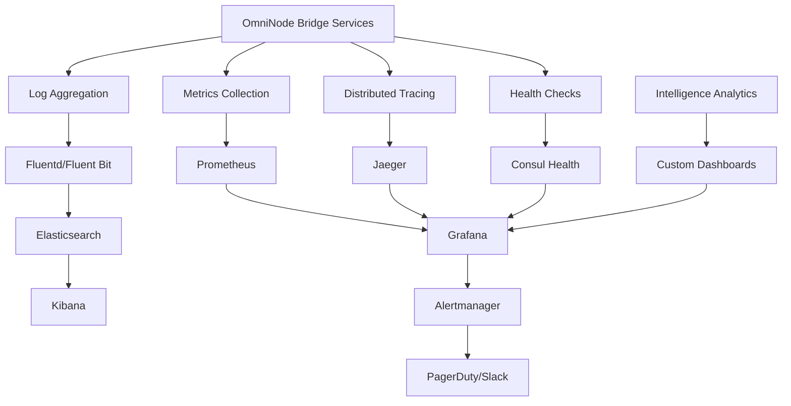

# Monitoring and Observability Guide

## Overview

This guide covers comprehensive monitoring, observability, alerting, and operational insights for OmniNode Bridge services. The monitoring stack provides real-time visibility into service health, performance, and intelligence capture patterns.

## Monitoring Architecture



## Metrics Collection

### Prometheus Configuration

```yaml
# monitoring/prometheus/prometheus.yml
global:
  scrape_interval: 15s
  evaluation_interval: 15s

rule_files:
  - "rules/*.yml"

alerting:
  alertmanagers:
    - static_configs:
        - targets:
          - alertmanager:9093

scrape_configs:
  # Bridge Services
  - job_name: 'hook-receiver'
    static_configs:
      - targets: ['hook-receiver:9090']
    metrics_path: /metrics
    scrape_interval: 15s
    labels:
      service: 'hook-receiver'
      environment: 'production'

  - job_name: 'tool-capture-proxy'
    static_configs:
      - targets: ['tool-capture-proxy:9090']
    metrics_path: /metrics
    scrape_interval: 15s
    labels:
      service: 'tool-capture-proxy'
      environment: 'production'

  - job_name: 'service-registry'
    static_configs:
      - targets: ['service-registry:9090']
    metrics_path: /metrics
    scrape_interval: 15s
    labels:
      service: 'service-registry'
      environment: 'production'

  # Infrastructure Services
  - job_name: 'redpanda'
    static_configs:
      - targets: ['redpanda:9644']
    metrics_path: /metrics
    scrape_interval: 30s

  - job_name: 'consul'
    static_configs:
      - targets: ['consul:8500']
    metrics_path: /v1/agent/metrics
    scrape_interval: 30s

  - job_name: 'postgres'
    static_configs:
      - targets: ['postgres-exporter:9187']

  - job_name: 'redis'
    static_configs:
      - targets: ['redis-exporter:9121']

  # Node/Container Metrics
  - job_name: 'node-exporter'
    static_configs:
      - targets: ['node-exporter:9100']

  - job_name: 'cadvisor'
    static_configs:
      - targets: ['cadvisor:8080']
```

### Service Metrics Implementation

```python
# monitoring/metrics.py
from prometheus_client import Counter, Histogram, Gauge, CollectorRegistry, generate_latest
import time
from functools import wraps
from typing import Dict, Any

class ServiceMetrics:
    def __init__(self, service_name: str):
        self.registry = CollectorRegistry()
        self.service_name = service_name

        # HTTP Metrics
        self.http_requests_total = Counter(
            'http_requests_total',
            'Total HTTP requests',
            ['method', 'endpoint', 'status'],
            registry=self.registry
        )

        self.http_request_duration = Histogram(
            'http_request_duration_seconds',
            'HTTP request duration',
            ['method', 'endpoint'],
            registry=self.registry
        )

        # Business Metrics
        self.hooks_processed_total = Counter(
            'hooks_processed_total',
            'Total hooks processed',
            ['hook_type', 'status'],
            registry=self.registry
        )

        self.intelligence_patterns_discovered = Counter(
            'intelligence_patterns_discovered_total',
            'Intelligence patterns discovered',
            ['pattern_type', 'service'],
            registry=self.registry
        )

        self.proxy_requests_total = Counter(
            'proxy_requests_total',
            'Total proxy requests',
            ['source_service', 'target_service', 'status'],
            registry=self.registry
        )

        self.cache_operations = Counter(
            'cache_operations_total',
            'Cache operations',
            ['operation', 'result'],
            registry=self.registry
        )

        # System Metrics
        self.active_connections = Gauge(
            'active_connections',
            'Active connections',
            ['connection_type'],
            registry=self.registry
        )

        self.processing_queue_size = Gauge(
            'processing_queue_size',
            'Processing queue size',
            ['queue_type'],
            registry=self.registry
        )

        self.circuit_breaker_state = Gauge(
            'circuit_breaker_state',
            'Circuit breaker state (0=closed, 1=open, 2=half-open)',
            ['service'],
            registry=self.registry
        )

    def track_http_request(self, method: str, endpoint: str):
        """Decorator to track HTTP request metrics"""
        def decorator(func):
            @wraps(func)
            async def wrapper(*args, **kwargs):
                start_time = time.time()
                status = "500"

                try:
                    result = await func(*args, **kwargs)
                    status = str(getattr(result, 'status_code', '200'))
                    return result
                except Exception as e:
                    status = "500"
                    raise
                finally:
                    duration = time.time() - start_time
                    self.http_requests_total.labels(
                        method=method,
                        endpoint=endpoint,
                        status=status
                    ).inc()
                    self.http_request_duration.labels(
                        method=method,
                        endpoint=endpoint
                    ).observe(duration)

            return wrapper
        return decorator

    def record_hook_processed(self, hook_type: str, status: str):
        """Record hook processing metrics"""
        self.hooks_processed_total.labels(
            hook_type=hook_type,
            status=status
        ).inc()

    def record_intelligence_pattern(self, pattern_type: str, service: str):
        """Record intelligence pattern discovery"""
        self.intelligence_patterns_discovered.labels(
            pattern_type=pattern_type,
            service=service
        ).inc()

    def record_proxy_request(self, source: str, target: str, status: str):
        """Record proxy request metrics"""
        self.proxy_requests_total.labels(
            source_service=source,
            target_service=target,
            status=status
        ).inc()

    def record_cache_operation(self, operation: str, result: str):
        """Record cache operation metrics"""
        self.cache_operations.labels(
            operation=operation,
            result=result
        ).inc()

    def set_active_connections(self, connection_type: str, count: int):
        """Set active connections gauge"""
        self.active_connections.labels(
            connection_type=connection_type
        ).set(count)

    def set_queue_size(self, queue_type: str, size: int):
        """Set processing queue size"""
        self.processing_queue_size.labels(
            queue_type=queue_type
        ).set(size)

    def set_circuit_breaker_state(self, service: str, state: int):
        """Set circuit breaker state"""
        self.circuit_breaker_state.labels(
            service=service
        ).set(state)

    def generate_metrics(self) -> str:
        """Generate metrics for Prometheus scraping"""
        return generate_latest(self.registry).decode('utf-8')

# Usage in services
from fastapi import FastAPI
from fastapi.responses import PlainTextResponse

app = FastAPI()
metrics = ServiceMetrics('hook-receiver')

@app.get("/metrics")
async def get_metrics():
    return PlainTextResponse(
        content=metrics.generate_metrics(),
        media_type="text/plain"
    )

@app.post("/hooks/{hook_type}")
@metrics.track_http_request("POST", "/hooks/{hook_type}")
async def process_hook(hook_type: str, data: dict):
    try:
        # Process hook
        result = await process_hook_data(hook_type, data)
        metrics.record_hook_processed(hook_type, "success")
        return result
    except Exception as e:
        metrics.record_hook_processed(hook_type, "error")
        raise
```

## Logging and Log Aggregation

### Structured Logging Configuration

```python
# monitoring/logging_config.py
import logging
import json
import sys
from datetime import datetime
from typing import Any, Dict

class StructuredLogger:
    def __init__(self, service_name: str, environment: str):
        self.service_name = service_name
        self.environment = environment
        self.logger = logging.getLogger(service_name)
        self.logger.setLevel(logging.INFO)

        # Configure structured formatter
        formatter = StructuredFormatter(service_name, environment)

        # Console handler
        console_handler = logging.StreamHandler(sys.stdout)
        console_handler.setFormatter(formatter)
        self.logger.addHandler(console_handler)

        # File handler (if enabled)
        import os
        if os.getenv('LOG_FILE_ENABLED', 'false').lower() == 'true':
            file_handler = logging.FileHandler(
                os.getenv('LOG_FILE_PATH', '/app/logs/service.log')
            )
            file_handler.setFormatter(formatter)
            self.logger.addHandler(file_handler)

    def info(self, message: str, extra: Dict[str, Any] = None):
        self.logger.info(message, extra=extra or {})

    def error(self, message: str, error: Exception = None, extra: Dict[str, Any] = None):
        extra = extra or {}
        if error:
            extra.update({
                'error_type': type(error).__name__,
                'error_message': str(error),
                'error_traceback': str(error.__traceback__)
            })
        self.logger.error(message, extra=extra)

    def warning(self, message: str, extra: Dict[str, Any] = None):
        self.logger.warning(message, extra=extra or {})

    def debug(self, message: str, extra: Dict[str, Any] = None):
        self.logger.debug(message, extra=extra or {})

class StructuredFormatter(logging.Formatter):
    def __init__(self, service_name: str, environment: str):
        self.service_name = service_name
        self.environment = environment
        super().__init__()

    def format(self, record: logging.LogRecord) -> str:
        log_entry = {
            'timestamp': datetime.utcnow().isoformat(),
            'service': self.service_name,
            'environment': self.environment,
            'level': record.levelname,
            'message': record.getMessage(),
            'logger': record.name,
            'module': record.module,
            'function': record.funcName,
            'line': record.lineno
        }

        # Add extra fields
        if hasattr(record, 'extra'):
            log_entry.update(record.extra)

        # Add request context if available
        if hasattr(record, 'request_id'):
            log_entry['request_id'] = record.request_id

        if hasattr(record, 'user_id'):
            log_entry['user_id'] = record.user_id

        return json.dumps(log_entry)

# Usage in services
logger = StructuredLogger('hook-receiver', 'production')

async def process_hook(hook_data: dict):
    logger.info("Processing hook", extra={
        'hook_type': hook_data.get('type'),
        'hook_id': hook_data.get('id'),
        'service_name': hook_data.get('service_name')
    })

    try:
        result = await process_hook_logic(hook_data)
        logger.info("Hook processed successfully", extra={
            'hook_id': hook_data.get('id'),
            'processing_time': result.get('processing_time'),
            'patterns_discovered': len(result.get('patterns', []))
        })
        return result
    except Exception as e:
        logger.error("Hook processing failed", error=e, extra={
            'hook_id': hook_data.get('id'),
            'hook_type': hook_data.get('type')
        })
        raise
```

### Fluentd Configuration

```yaml
# monitoring/fluentd/fluent.conf
<system>
  log_level info
</system>

# Input from Docker logs
<source>
  @type forward
  port 24224
  bind 0.0.0.0
</source>

# Parse JSON logs from services
<filter omninode.**>
  @type parser
  key_name log
  reserve_data true
  <parse>
    @type json
  </parse>
</filter>

# Add Kubernetes metadata (if running on K8s)
<filter omninode.**>
  @type kubernetes_metadata
  @id filter_kube_metadata
  kubernetes_url "#{ENV['KUBERNETES_URL']}"
  verify_ssl "#{ENV['KUBERNETES_VERIFY_SSL'] || true}"
  ca_file "#{ENV['KUBERNETES_CA_FILE']}"
</filter>

# Route to different outputs based on log level
<match omninode.**>
  @type copy

  # Send to Elasticsearch
  <store>
    @type elasticsearch
    host elasticsearch
    port 9200
    index_name omninode-bridge
    type_name _doc
    include_tag_key true
    tag_key @log_name
    flush_interval 1s

    <buffer>
      @type file
      path /fluentd/log/buffer/elasticsearch
      flush_mode interval
      flush_interval 5s
      chunk_limit_size 8m
      flush_at_shutdown true
    </buffer>
  </store>

  # Send errors to separate index
  <store>
    @type elasticsearch
    host elasticsearch
    port 9200
    index_name omninode-bridge-errors
    type_name _doc

    <filter>
      @type grep
      <regexp>
        key level
        pattern ^(ERROR|FATAL)$
      </regexp>
    </filter>

    <buffer>
      @type file
      path /fluentd/log/buffer/errors
      flush_mode interval
      flush_interval 1s
    </buffer>
  </store>
</match>
```

## Distributed Tracing

### Jaeger Configuration

```yaml
# monitoring/jaeger/docker-compose.jaeger.yml
version: '3.8'

services:
  jaeger:
    image: jaegertracing/all-in-one:latest
    ports:
      - "5775:5775/udp"
      - "6831:6831/udp"
      - "6832:6832/udp"
      - "5778:5778"
      - "16686:16686"
      - "14268:14268"
      - "14250:14250"
      - "9411:9411"
    environment:
      - COLLECTOR_ZIPKIN_HTTP_PORT=9411
      - SPAN_STORAGE_TYPE=elasticsearch
      - ES_SERVER_URLS=http://elasticsearch:9200
    networks:
      - omninode-network
    depends_on:
      - elasticsearch
```

### Tracing Implementation

```python
# monitoring/tracing.py
import opentelemetry
from opentelemetry import trace
from opentelemetry.exporter.jaeger.thrift import JaegerExporter
from opentelemetry.sdk.trace import TracerProvider
from opentelemetry.sdk.trace.export import BatchSpanProcessor
from opentelemetry.instrumentation.fastapi import FastAPIInstrumentor
from opentelemetry.instrumentation.sqlalchemy import SQLAlchemyInstrumentor
from opentelemetry.instrumentation.redis import RedisInstrumentor
import os

class TracingService:
    def __init__(self, service_name: str):
        self.service_name = service_name
        self.tracer = None
        self.setup_tracing()

    def setup_tracing(self):
        """Initialize distributed tracing"""
        if not os.getenv('TRACING_ENABLED', 'false').lower() == 'true':
            return

        # Set up tracer provider
        trace.set_tracer_provider(TracerProvider())
        self.tracer = trace.get_tracer(self.service_name)

        # Configure Jaeger exporter
        jaeger_exporter = JaegerExporter(
            agent_host_name=os.getenv('JAEGER_AGENT_HOST', 'jaeger'),
            agent_port=int(os.getenv('JAEGER_AGENT_PORT', 6831)),
        )

        # Add span processor
        span_processor = BatchSpanProcessor(jaeger_exporter)
        trace.get_tracer_provider().add_span_processor(span_processor)

    def instrument_app(self, app):
        """Instrument FastAPI application"""
        if self.tracer:
            FastAPIInstrumentor.instrument_app(app)
            SQLAlchemyInstrumentor().instrument()
            RedisInstrumentor().instrument()

    def start_span(self, name: str, attributes: dict = None):
        """Start a new span"""
        if not self.tracer:
            return None

        span = self.tracer.start_span(name)
        if attributes:
            for key, value in attributes.items():
                span.set_attribute(key, value)
        return span

    def record_exception(self, span, exception: Exception):
        """Record exception in span"""
        if span:
            span.record_exception(exception)
            span.set_status(trace.Status(trace.StatusCode.ERROR))

# Usage in services
tracing = TracingService('hook-receiver')

async def process_hook_with_tracing(hook_data: dict):
    with tracing.start_span("process_hook", {
        "hook.type": hook_data.get('type'),
        "hook.id": hook_data.get('id'),
        "service.name": hook_data.get('service_name')
    }) as span:
        try:
            # Intelligence analysis span
            with tracing.start_span("analyze_intelligence") as intel_span:
                intelligence_data = await analyze_hook_intelligence(hook_data)
                intel_span.set_attribute("patterns.discovered", len(intelligence_data.get('patterns', [])))

            # Event publishing span
            with tracing.start_span("publish_event") as publish_span:
                await publish_hook_event(hook_data, intelligence_data)
                publish_span.set_attribute("event.published", True)

            span.set_attribute("processing.success", True)
            return {"status": "success", "intelligence": intelligence_data}

        except Exception as e:
            tracing.record_exception(span, e)
            raise
```

## Health Checks and Alerting

### Health Check Implementation

```python
# monitoring/health_checks.py
from typing import Dict, Any, List
from dataclasses import dataclass
from enum import Enum
import asyncio
import aioredis
import asyncpg
import consul
import aiokafka
import time

class HealthStatus(Enum):
    HEALTHY = "healthy"
    DEGRADED = "degraded"
    UNHEALTHY = "unhealthy"

@dataclass
class HealthCheckResult:
    service: str
    status: HealthStatus
    details: Dict[str, Any]
    response_time_ms: float
    timestamp: float

class HealthChecker:
    def __init__(self):
        self.checks = {
            'database': self.check_database,
            'redis': self.check_redis,
            'kafka': self.check_kafka,
            'consul': self.check_consul,
            'disk_space': self.check_disk_space,
            'memory': self.check_memory
        }

    async def check_all(self) -> Dict[str, HealthCheckResult]:
        """Run all health checks"""
        results = {}

        for name, check_func in self.checks.items():
            try:
                result = await asyncio.wait_for(check_func(), timeout=10.0)
                results[name] = result
            except asyncio.TimeoutError:
                results[name] = HealthCheckResult(
                    service=name,
                    status=HealthStatus.UNHEALTHY,
                    details={"error": "Health check timeout"},
                    response_time_ms=10000,
                    timestamp=time.time()
                )
            except Exception as e:
                results[name] = HealthCheckResult(
                    service=name,
                    status=HealthStatus.UNHEALTHY,
                    details={"error": str(e)},
                    response_time_ms=0,
                    timestamp=time.time()
                )

        return results

    async def check_database(self) -> HealthCheckResult:
        """Check PostgreSQL database connectivity"""
        start_time = time.time()

        try:
            conn = await asyncpg.connect(
                host=os.getenv('POSTGRES_HOST'),
                port=int(os.getenv('POSTGRES_PORT', 5432)),
                database=os.getenv('POSTGRES_DB'),
                user=os.getenv('POSTGRES_USER'),
                password=os.getenv('POSTGRES_PASSWORD')
            )

            # Test query
            result = await conn.fetchval('SELECT 1')
            await conn.close()

            response_time = (time.time() - start_time) * 1000

            return HealthCheckResult(
                service="database",
                status=HealthStatus.HEALTHY,
                details={"query_result": result, "connection": "success"},
                response_time_ms=response_time,
                timestamp=time.time()
            )

        except Exception as e:
            response_time = (time.time() - start_time) * 1000
            return HealthCheckResult(
                service="database",
                status=HealthStatus.UNHEALTHY,
                details={"error": str(e)},
                response_time_ms=response_time,
                timestamp=time.time()
            )

    async def check_redis(self) -> HealthCheckResult:
        """Check Redis connectivity"""
        start_time = time.time()

        try:
            redis = aioredis.from_url(
                f"redis://{os.getenv('REDIS_HOST')}:{os.getenv('REDIS_PORT', 6379)}"
            )

            # Test operation
            await redis.ping()
            info = await redis.info()
            await redis.close()

            response_time = (time.time() - start_time) * 1000

            return HealthCheckResult(
                service="redis",
                status=HealthStatus.HEALTHY,
                details={
                    "connected_clients": info.get('connected_clients', 0),
                    "used_memory": info.get('used_memory', 0),
                    "version": info.get('redis_version', 'unknown')
                },
                response_time_ms=response_time,
                timestamp=time.time()
            )

        except Exception as e:
            response_time = (time.time() - start_time) * 1000
            return HealthCheckResult(
                service="redis",
                status=HealthStatus.UNHEALTHY,
                details={"error": str(e)},
                response_time_ms=response_time,
                timestamp=time.time()
            )

    async def check_kafka(self) -> HealthCheckResult:
        """Check Kafka connectivity"""
        start_time = time.time()

        try:
            producer = aiokafka.AIOKafkaProducer(
                bootstrap_servers=os.getenv('KAFKA_BOOTSTRAP_SERVERS')
            )
            await producer.start()

            # Test metadata fetch
            metadata = await producer.client.fetch_metadata()
            await producer.stop()

            response_time = (time.time() - start_time) * 1000

            return HealthCheckResult(
                service="kafka",
                status=HealthStatus.HEALTHY,
                details={
                    "brokers": len(metadata.brokers),
                    "topics": len(metadata.topics),
                    "cluster_id": metadata.cluster_id
                },
                response_time_ms=response_time,
                timestamp=time.time()
            )

        except Exception as e:
            response_time = (time.time() - start_time) * 1000
            return HealthCheckResult(
                service="kafka",
                status=HealthStatus.UNHEALTHY,
                details={"error": str(e)},
                response_time_ms=response_time,
                timestamp=time.time()
            )

    async def get_overall_status(self) -> HealthStatus:
        """Get overall system health status"""
        results = await self.check_all()

        unhealthy_count = sum(1 for r in results.values() if r.status == HealthStatus.UNHEALTHY)
        degraded_count = sum(1 for r in results.values() if r.status == HealthStatus.DEGRADED)

        if unhealthy_count > 0:
            return HealthStatus.UNHEALTHY
        elif degraded_count > 0:
            return HealthStatus.DEGRADED
        else:
            return HealthStatus.HEALTHY

# Health check endpoint
from fastapi import FastAPI

app = FastAPI()
health_checker = HealthChecker()

@app.get("/health")
async def health_check():
    results = await health_checker.check_all()
    overall_status = await health_checker.get_overall_status()

    return {
        "status": overall_status.value,
        "timestamp": time.time(),
        "checks": {
            name: {
                "status": result.status.value,
                "response_time_ms": result.response_time_ms,
                "details": result.details
            }
            for name, result in results.items()
        }
    }

@app.get("/ready")
async def readiness_check():
    # Critical services only
    critical_checks = ['database', 'kafka', 'consul']
    results = await health_checker.check_all()

    critical_results = {k: v for k, v in results.items() if k in critical_checks}
    all_healthy = all(r.status == HealthStatus.HEALTHY for r in critical_results.values())

    return {
        "ready": all_healthy,
        "checks": critical_results
    }
```

### Alert Rules

```yaml
# monitoring/prometheus/rules/alerts.yml
groups:
- name: omninode_bridge_alerts
  rules:
  # Service availability alerts
  - alert: ServiceDown
    expr: up{job=~"hook-receiver|tool-capture-proxy|service-registry"} == 0
    for: 30s
    labels:
      severity: critical
    annotations:
      summary: "{{ $labels.job }} service is down"
      description: "{{ $labels.job }} has been down for more than 30 seconds"

  - alert: HighErrorRate
    expr: rate(http_requests_total{status=~"5.."}[5m]) > 0.1
    for: 2m
    labels:
      severity: warning
    annotations:
      summary: "High error rate for {{ $labels.job }}"
      description: "Error rate is {{ $value | humanizePercentage }} for {{ $labels.job }}"

  - alert: HighResponseTime
    expr: histogram_quantile(0.95, rate(http_request_duration_seconds_bucket[5m])) > 1
    for: 5m
    labels:
      severity: warning
    annotations:
      summary: "High response time for {{ $labels.job }}"
      description: "95th percentile response time is {{ $value }}s for {{ $labels.job }}"

  # Infrastructure alerts
  - alert: DatabaseConnectionFailure
    expr: up{job="postgres"} == 0
    for: 1m
    labels:
      severity: critical
    annotations:
      summary: "Database connection failure"
      description: "PostgreSQL database is unreachable"

  - alert: KafkaDown
    expr: up{job="redpanda"} == 0
    for: 1m
    labels:
      severity: critical
    annotations:
      summary: "Kafka/RedPanda is down"
      description: "Message broker is unreachable"

  - alert: HighDiskUsage
    expr: (node_filesystem_size_bytes{fstype!="tmpfs"} - node_filesystem_avail_bytes{fstype!="tmpfs"}) / node_filesystem_size_bytes{fstype!="tmpfs"} > 0.85
    for: 5m
    labels:
      severity: warning
    annotations:
      summary: "High disk usage"
      description: "Disk usage is {{ $value | humanizePercentage }} on {{ $labels.instance }}"

  - alert: HighMemoryUsage
    expr: (node_memory_MemTotal_bytes - node_memory_MemAvailable_bytes) / node_memory_MemTotal_bytes > 0.9
    for: 5m
    labels:
      severity: warning
    annotations:
      summary: "High memory usage"
      description: "Memory usage is {{ $value | humanizePercentage }} on {{ $labels.instance }}"

  # Business logic alerts
  - alert: HookProcessingFailureRate
    expr: rate(hooks_processed_total{status="error"}[5m]) / rate(hooks_processed_total[5m]) > 0.1
    for: 3m
    labels:
      severity: warning
    annotations:
      summary: "High hook processing failure rate"
      description: "Hook processing failure rate is {{ $value | humanizePercentage }}"

  - alert: CircuitBreakerOpen
    expr: circuit_breaker_state > 0
    for: 1m
    labels:
      severity: warning
    annotations:
      summary: "Circuit breaker open for {{ $labels.service }}"
      description: "Circuit breaker is {{ if eq $value 1.0 }}open{{ else }}half-open{{ end }} for {{ $labels.service }}"

  - alert: LowIntelligencePatternDiscovery
    expr: rate(intelligence_patterns_discovered_total[1h]) < 1
    for: 30m
    labels:
      severity: info
    annotations:
      summary: "Low intelligence pattern discovery rate"
      description: "Only {{ $value }} patterns discovered per hour"
```

## Grafana Dashboards

### Service Overview Dashboard

```json
{
  "dashboard": {
    "id": null,
    "title": "OmniNode Bridge Overview",
    "tags": ["omninode", "bridge"],
    "timezone": "browser",
    "refresh": "30s",
    "panels": [
      {
        "id": 1,
        "title": "Service Health",
        "type": "stat",
        "targets": [
          {
            "expr": "up{job=~\"hook-receiver|tool-capture-proxy|service-registry\"}",
            "legendFormat": "{{ job }}"
          }
        ],
        "fieldConfig": {
          "defaults": {
            "mappings": [
              {"options": {"0": {"text": "Down", "color": "red"}}, "type": "value"},
              {"options": {"1": {"text": "Up", "color": "green"}}, "type": "value"}
            ]
          }
        }
      },
      {
        "id": 2,
        "title": "Request Rate",
        "type": "graph",
        "targets": [
          {
            "expr": "rate(http_requests_total[5m])",
            "legendFormat": "{{ job }} - {{ method }}"
          }
        ]
      },
      {
        "id": 3,
        "title": "Response Time",
        "type": "graph",
        "targets": [
          {
            "expr": "histogram_quantile(0.95, rate(http_request_duration_seconds_bucket[5m]))",
            "legendFormat": "95th percentile - {{ job }}"
          },
          {
            "expr": "histogram_quantile(0.50, rate(http_request_duration_seconds_bucket[5m]))",
            "legendFormat": "50th percentile - {{ job }}"
          }
        ]
      },
      {
        "id": 4,
        "title": "Hook Processing Rate",
        "type": "graph",
        "targets": [
          {
            "expr": "rate(hooks_processed_total[5m])",
            "legendFormat": "{{ hook_type }} - {{ status }}"
          }
        ]
      },
      {
        "id": 5,
        "title": "Intelligence Patterns Discovered",
        "type": "graph",
        "targets": [
          {
            "expr": "rate(intelligence_patterns_discovered_total[1h])",
            "legendFormat": "{{ pattern_type }}"
          }
        ]
      }
    ]
  }
}
```

## Complete Monitoring Stack

### Docker Compose for Monitoring

```yaml
# monitoring/docker-compose.monitoring.yml
version: '3.8'

services:
  prometheus:
    image: prom/prometheus:latest
    ports:
      - "9090:9090"
    volumes:
      - ./prometheus:/etc/prometheus
      - prometheus-data:/prometheus
    command:
      - '--config.file=/etc/prometheus/prometheus.yml'
      - '--storage.tsdb.path=/prometheus'
      - '--web.console.libraries=/etc/prometheus/console_libraries'
      - '--web.console.templates=/etc/prometheus/consoles'
      - '--storage.tsdb.retention.time=200h'
      - '--web.enable-lifecycle'
    networks:
      - omninode-network

  grafana:
    image: grafana/grafana:latest
    ports:
      - "3000:3000"
    environment:
      - GF_SECURITY_ADMIN_PASSWORD=admin
    volumes:
      - grafana-data:/var/lib/grafana
      - ./grafana/dashboards:/etc/grafana/provisioning/dashboards
      - ./grafana/datasources:/etc/grafana/provisioning/datasources
    networks:
      - omninode-network

  alertmanager:
    image: prom/alertmanager:latest
    ports:
      - "9093:9093"
    volumes:
      - ./alertmanager:/etc/alertmanager
    networks:
      - omninode-network

  elasticsearch:
    image: docker.elastic.co/elasticsearch/elasticsearch:7.14.0
    environment:
      - discovery.type=single-node
      - "ES_JAVA_OPTS=-Xms512m -Xmx512m"
    ports:
      - "9200:9200"
    volumes:
      - elasticsearch-data:/usr/share/elasticsearch/data
    networks:
      - omninode-network

  kibana:
    image: docker.elastic.co/kibana/kibana:7.14.0
    ports:
      - "5601:5601"
    environment:
      - ELASTICSEARCH_HOSTS=http://elasticsearch:9200
    depends_on:
      - elasticsearch
    networks:
      - omninode-network

  fluentd:
    build: ./fluentd
    ports:
      - "24224:24224"
    volumes:
      - ./fluentd:/fluentd/etc
    depends_on:
      - elasticsearch
    networks:
      - omninode-network

volumes:
  prometheus-data:
  grafana-data:
  elasticsearch-data:

networks:
  omninode-network:
    external: true
```

This comprehensive monitoring guide provides complete observability for the OmniNode Bridge, enabling proactive issue detection, performance optimization, and operational excellence.
