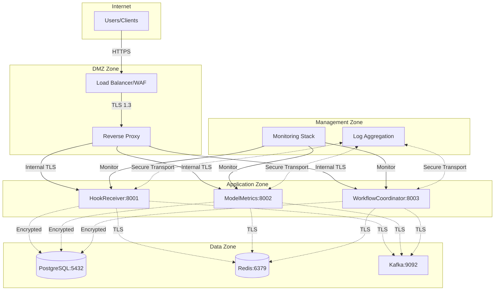

# Secure Deployment Guide

## Overview

This comprehensive guide covers secure deployment strategies for OmniNode Bridge with SSL/TLS encryption, security hardening, monitoring, and production-ready configurations.

## Table of Contents

1. [Security-First Architecture](#security-first-architecture)
2. [SSL/TLS Configuration](#ssltls-configuration)
3. [Production Docker Setup](#production-docker-setup)
4. [Infrastructure Security](#infrastructure-security)
5. [Monitoring and Alerting](#monitoring-and-alerting)
6. [Backup and Recovery](#backup-and-recovery)
7. [Compliance and Auditing](#compliance-and-auditing)

## Security-First Architecture

### Network Security Topology



### Security Zones and Controls

```yaml
Security Zones:
  DMZ:
    - WAF/DDoS Protection
    - Rate Limiting
    - SSL Termination
    - Request Filtering

  Application:
    - API Authentication
    - Input Validation
    - Circuit Breakers
    - Audit Logging

  Data:
    - Encryption at Rest
    - Encryption in Transit
    - Access Controls
    - Data Masking

  Management:
    - Monitoring
    - Alerting
    - Log Analysis
    - Incident Response
```

## SSL/TLS Configuration

### 1. Certificate Management

#### Production Certificate Setup
```bash
#!/bin/bash
# scripts/setup-ssl-production.sh

# Create certificate directory structure
sudo mkdir -p /etc/omninode/{certs,private,ca}
sudo chmod 755 /etc/omninode/certs
sudo chmod 700 /etc/omninode/private
sudo chmod 755 /etc/omninode/ca

# Generate Certificate Authority (for internal services)
openssl genrsa -out /etc/omninode/ca/ca-key.pem 4096
openssl req -new -x509 -key /etc/omninode/ca/ca-key.pem \
    -out /etc/omninode/ca/ca-cert.pem \
    -days 3650 \
    -subj "/C=US/ST=CA/L=San Francisco/O=OmniNode/CN=OmniNode Internal CA"

# Generate server certificates for each service
generate_service_cert() {
    local service=$1
    local domain=$2

    # Generate private key
    openssl genrsa -out /etc/omninode/private/${service}-key.pem 2048

    # Create certificate request
    openssl req -new \
        -key /etc/omninode/private/${service}-key.pem \
        -out /etc/omninode/certs/${service}-csr.pem \
        -subj "/C=US/ST=CA/L=San Francisco/O=OmniNode/CN=${domain}"

    # Create certificate extensions
    cat > /etc/omninode/certs/${service}-ext.cnf << EOF
authorityKeyIdentifier=keyid,issuer
basicConstraints=CA:FALSE
keyUsage = digitalSignature, nonRepudiation, keyEncipherment, dataEncipherment
subjectAltName = @alt_names

[alt_names]
DNS.1 = ${domain}
DNS.2 = ${service}.omninode.local
DNS.3 = localhost
IP.1 = 127.0.0.1
EOF

    # Sign certificate
    openssl x509 -req \
        -in /etc/omninode/certs/${service}-csr.pem \
        -CA /etc/omninode/ca/ca-cert.pem \
        -CAkey /etc/omninode/ca/ca-key.pem \
        -CAcreateserial \
        -out /etc/omninode/certs/${service}-cert.pem \
        -days 365 \
        -extensions v3_req \
        -extfile /etc/omninode/certs/${service}-ext.cnf

    # Clean up
    rm /etc/omninode/certs/${service}-csr.pem
    rm /etc/omninode/certs/${service}-ext.cnf

    echo "Certificate generated for ${service} (${domain})"
}

# Generate certificates for all services
generate_service_cert "hook-receiver" "hooks.omninode.ai"
generate_service_cert "model-metrics" "metrics.omninode.ai"
generate_service_cert "workflow-coordinator" "workflows.omninode.ai"

# Set proper permissions
sudo chown -R root:omninode /etc/omninode
sudo chmod 640 /etc/omninode/private/*
sudo chmod 644 /etc/omninode/certs/*
sudo chmod 600 /etc/omninode/ca/*
```

#### Let's Encrypt for Public Services
```bash
#!/bin/bash
# scripts/setup-letsencrypt.sh

# Install certbot
sudo apt-get update
sudo apt-get install -y certbot python3-certbot-nginx

# Create webroot directory
sudo mkdir -p /var/www/letsencrypt

# Generate certificates for public domains
DOMAINS=(
    "api.omninode.ai"
    "hooks.omninode.ai"
    "metrics.omninode.ai"
    "workflows.omninode.ai"
)

for domain in "${DOMAINS[@]}"; do
    sudo certbot certonly \
        --webroot \
        --webroot-path=/var/www/letsencrypt \
        --email admin@omninode.ai \
        --agree-tos \
        --no-eff-email \
        --force-renewal \
        -d $domain

    echo "Certificate generated for $domain"
done

# Set up automatic renewal
sudo crontab -l | { cat; echo "0 12 * * * /usr/bin/certbot renew --quiet --deploy-hook 'docker-compose -f /opt/omninode_bridge/docker-compose.prod.yml restart nginx'"; } | sudo crontab -

echo "Automatic renewal scheduled"
```

### 2. TLS Configuration

#### Nginx TLS Configuration
```nginx
# /etc/nginx/sites-available/omninode-bridge-secure
upstream hook_receiver {
    server localhost:8001 max_fails=3 fail_timeout=30s;
    keepalive 32;
}

upstream model_metrics {
    server localhost:8002 max_fails=3 fail_timeout=30s;
    keepalive 32;
}

upstream workflow_coordinator {
    server localhost:8003 max_fails=3 fail_timeout=30s;
    keepalive 32;
}

# Security configurations
map $http_user_agent $block_ua {
    ~*sqlmap 1;
    ~*nikto 1;
    ~*dirb 1;
    ~*nmap 1;
    default 0;
}

# Rate limiting zones
limit_req_zone $binary_remote_addr zone=api:10m rate=30r/m;
limit_req_zone $binary_remote_addr zone=hooks:10m rate=100r/m;
limit_req_zone $binary_remote_addr zone=metrics:10m rate=20r/m;

# Redirect HTTP to HTTPS
server {
    listen 80;
    server_name hooks.omninode.ai metrics.omninode.ai workflows.omninode.ai;

    # Allow Let's Encrypt validation
    location /.well-known/acme-challenge/ {
        root /var/www/letsencrypt;
    }

    location / {
        return 301 https://$server_name$request_uri;
    }
}

# HookReceiver Service (hooks.omninode.ai)
server {
    listen 443 ssl http2;
    server_name hooks.omninode.ai;

    # Block malicious user agents
    if ($block_ua) {
        return 403;
    }

    # SSL Configuration
    ssl_certificate /etc/letsencrypt/live/hooks.omninode.ai/fullchain.pem;
    ssl_certificate_key /etc/letsencrypt/live/hooks.omninode.ai/privkey.pem;
    ssl_trusted_certificate /etc/letsencrypt/live/hooks.omninode.ai/chain.pem;

    # Modern SSL configuration
    ssl_protocols TLSv1.2 TLSv1.3;
    ssl_ciphers ECDHE-ECDSA-AES128-GCM-SHA256:ECDHE-RSA-AES128-GCM-SHA256:ECDHE-ECDSA-AES256-GCM-SHA384:ECDHE-RSA-AES256-GCM-SHA384:ECDHE-ECDSA-CHACHA20-POLY1305:ECDHE-RSA-CHACHA20-POLY1305:DHE-RSA-AES128-GCM-SHA256:DHE-RSA-AES256-GCM-SHA384;
    ssl_prefer_server_ciphers off;

    ssl_session_cache shared:SSL:10m;
    ssl_session_timeout 1d;
    ssl_session_tickets off;

    # OCSP Stapling
    ssl_stapling on;
    ssl_stapling_verify on;
    resolver 1.1.1.1 1.0.0.1 8.8.8.8 8.8.4.4 valid=300s;
    resolver_timeout 5s;

    # Security Headers
    add_header Strict-Transport-Security "max-age=63072000; includeSubDomains; preload" always;
    add_header X-Frame-Options DENY always;
    add_header X-Content-Type-Options nosniff always;
    add_header X-XSS-Protection "1; mode=block" always;
    add_header Referrer-Policy "strict-origin-when-cross-origin" always;
    add_header Content-Security-Policy "default-src 'self'; script-src 'self' 'unsafe-inline'; style-src 'self' 'unsafe-inline'; img-src 'self' data:; font-src 'self'; connect-src 'self'; frame-ancestors 'none';" always;

    # Hide server information
    server_tokens off;
    add_header X-Robots-Tag "noindex, nofollow, nosnippet, noarchive" always;

    # Rate limiting
    limit_req zone=hooks burst=50 nodelay;

    # Request size limits
    client_max_body_size 10M;
    client_body_timeout 30s;
    client_header_timeout 30s;

    # Proxy configuration
    location / {
        # Security checks
        if ($request_method !~ ^(GET|POST|PUT|DELETE|OPTIONS)$) {
            return 405;
        }

        proxy_pass http://hook_receiver;
        proxy_http_version 1.1;
        proxy_set_header Connection "";
        proxy_set_header Host $host;
        proxy_set_header X-Real-IP $remote_addr;
        proxy_set_header X-Forwarded-For $proxy_add_x_forwarded_for;
        proxy_set_header X-Forwarded-Proto $scheme;
        proxy_set_header X-Forwarded-Host $host;
        proxy_set_header X-Forwarded-Port $server_port;

        # Timeouts
        proxy_connect_timeout 30s;
        proxy_send_timeout 30s;
        proxy_read_timeout 30s;

        # Buffer settings
        proxy_buffering on;
        proxy_buffer_size 128k;
        proxy_buffers 4 256k;
        proxy_busy_buffers_size 256k;

        # Hide upstream headers
        proxy_hide_header X-Powered-By;
        proxy_hide_header Server;
    }

    # Health check endpoint (no rate limiting)
    location /health {
        proxy_pass http://hook_receiver;
        proxy_set_header Host $host;
        proxy_set_header X-Real-IP $remote_addr;
        proxy_set_header X-Forwarded-For $proxy_add_x_forwarded_for;
        proxy_set_header X-Forwarded-Proto $scheme;

        access_log off;
    }

    # Metrics endpoint (restricted access)
    location /metrics {
        allow 127.0.0.1;
        allow 10.0.0.0/8;
        allow 172.16.0.0/12;
        allow 192.168.0.0/16;
        deny all;

        proxy_pass http://hook_receiver;
        proxy_set_header Host $host;
        proxy_set_header X-Real-IP $remote_addr;
        proxy_set_header X-Forwarded-For $proxy_add_x_forwarded_for;
        proxy_set_header X-Forwarded-Proto $scheme;
    }
}

# ModelMetrics API (metrics.omninode.ai)
server {
    listen 443 ssl http2;
    server_name metrics.omninode.ai;

    # Block malicious user agents
    if ($block_ua) {
        return 403;
    }

    # SSL Configuration (same as above)
    ssl_certificate /etc/letsencrypt/live/metrics.omninode.ai/fullchain.pem;
    ssl_certificate_key /etc/letsencrypt/live/metrics.omninode.ai/privkey.pem;
    ssl_trusted_certificate /etc/letsencrypt/live/metrics.omninode.ai/chain.pem;

    # SSL settings (same as HookReceiver)
    ssl_protocols TLSv1.2 TLSv1.3;
    ssl_ciphers ECDHE-ECDSA-AES128-GCM-SHA256:ECDHE-RSA-AES128-GCM-SHA256:ECDHE-ECDSA-AES256-GCM-SHA384:ECDHE-RSA-AES256-GCM-SHA384:ECDHE-ECDSA-CHACHA20-POLY1305:ECDHE-RSA-CHACHA20-POLY1305:DHE-RSA-AES128-GCM-SHA256:DHE-RSA-AES256-GCM-SHA384;
    ssl_prefer_server_ciphers off;
    ssl_session_cache shared:SSL:10m;
    ssl_session_timeout 1d;
    ssl_session_tickets off;
    ssl_stapling on;
    ssl_stapling_verify on;

    # Security headers (same as HookReceiver)
    add_header Strict-Transport-Security "max-age=63072000; includeSubDomains; preload" always;
    add_header X-Frame-Options DENY always;
    add_header X-Content-Type-Options nosniff always;
    add_header X-XSS-Protection "1; mode=block" always;
    add_header Referrer-Policy "strict-origin-when-cross-origin" always;
    add_header Content-Security-Policy "default-src 'self'; script-src 'self' 'unsafe-inline'; style-src 'self' 'unsafe-inline'; img-src 'self' data:; font-src 'self'; connect-src 'self'; frame-ancestors 'none';" always;

    server_tokens off;

    # Rate limiting for model operations
    limit_req zone=metrics burst=10 nodelay;

    # Proxy configuration
    location / {
        proxy_pass http://model_metrics;
        proxy_http_version 1.1;
        proxy_set_header Connection "";
        proxy_set_header Host $host;
        proxy_set_header X-Real-IP $remote_addr;
        proxy_set_header X-Forwarded-For $proxy_add_x_forwarded_for;
        proxy_set_header X-Forwarded-Proto $scheme;
        proxy_set_header X-Forwarded-Host $host;

        # Extended timeouts for model operations
        proxy_connect_timeout 60s;
        proxy_send_timeout 300s;
        proxy_read_timeout 300s;

        proxy_hide_header X-Powered-By;
        proxy_hide_header Server;
    }

    # Model comparison endpoint (stricter rate limiting)
    location /compare {
        limit_req zone=api burst=2 nodelay;

        proxy_pass http://model_metrics;
        proxy_set_header Host $host;
        proxy_set_header X-Real-IP $remote_addr;
        proxy_set_header X-Forwarded-For $proxy_add_x_forwarded_for;
        proxy_set_header X-Forwarded-Proto $scheme;

        # Very long timeout for comparisons
        proxy_read_timeout 600s;
    }
}
```

### 3. Application-Level TLS

#### Service TLS Configuration
```python
# src/omninode_bridge/security/tls_config.py
import ssl
import os
from pathlib import Path
from typing import Optional

class TLSConfig:
    """TLS configuration for OmniNode Bridge services."""

    def __init__(self, service_name: str):
        self.service_name = service_name
        self.cert_dir = Path("/etc/omninode/certs")
        self.private_dir = Path("/etc/omninode/private")
        self.ca_dir = Path("/etc/omninode/ca")

    def create_server_context(self) -> ssl.SSLContext:
        """Create SSL context for server applications."""
        context = ssl.create_default_context(ssl.Purpose.CLIENT_AUTH)

        # Load certificates
        cert_file = self.cert_dir / f"{self.service_name}-cert.pem"
        key_file = self.private_dir / f"{self.service_name}-key.pem"

        if cert_file.exists() and key_file.exists():
            context.load_cert_chain(str(cert_file), str(key_file))
        else:
            raise FileNotFoundError(f"TLS certificates not found for {self.service_name}")

        # Security settings
        context.minimum_version = ssl.TLSVersion.TLSv1_2
        context.set_ciphers('ECDHE+AESGCM:ECDHE+CHACHA20:DHE+AESGCM:DHE+CHACHA20:!aNULL:!MD5:!DSS')
        context.options |= ssl.OP_NO_COMPRESSION
        context.options |= ssl.OP_CIPHER_SERVER_PREFERENCE
        context.options |= ssl.OP_SINGLE_DH_USE
        context.options |= ssl.OP_SINGLE_ECDH_USE

        # ALPN for HTTP/2 support
        context.set_alpn_protocols(["h2", "http/1.1"])

        return context

    def create_client_context(self) -> ssl.SSLContext:
        """Create SSL context for client connections."""
        context = ssl.create_default_context()

        # Load CA certificate for internal services
        ca_file = self.ca_dir / "ca-cert.pem"
        if ca_file.exists():
            context.load_verify_locations(str(ca_file))

        # Security settings
        context.minimum_version = ssl.TLSVersion.TLSv1_2
        context.check_hostname = True
        context.verify_mode = ssl.CERT_REQUIRED

        return context

# Usage in FastAPI applications
def create_app_with_tls(service_name: str) -> tuple[object, Optional[ssl.SSLContext]]:
    """Create FastAPI app with TLS configuration."""
    from fastapi import FastAPI

    app = FastAPI(
        title=f"OmniNode Bridge - {service_name}",
        version="0.1.0"
    )

    # TLS configuration
    tls_config = TLSConfig(service_name)
    ssl_context = None

    if os.getenv("ENABLE_TLS", "false").lower() == "true":
        try:
            ssl_context = tls_config.create_server_context()
        except FileNotFoundError as e:
            print(f"Warning: {e}. Running without TLS.")

    return app, ssl_context
```

## Production Docker Setup

### 1. Secure Docker Compose Configuration

```yaml
# docker-compose.prod.yml
version: '3.8'

networks:
  frontend:
    driver: bridge
    internal: false
  backend:
    driver: bridge
    internal: true
  monitoring:
    driver: bridge
    internal: true

volumes:
  postgres_data:
    driver: local
    driver_opts:
      type: none
      o: bind
      device: /opt/omninode_bridge/data/postgres
  redis_data:
    driver: local
    driver_opts:
      type: none
      o: bind
      device: /opt/omninode_bridge/data/redis
  kafka_data:
    driver: local
    driver_opts:
      type: none
      o: bind
      device: /opt/omninode_bridge/data/kafka
  certs_volume:
    driver: local
    driver_opts:
      type: none
      o: bind
      device: /etc/omninode/certs
  logs_volume:
    driver: local
    driver_opts:
      type: none
      o: bind
      device: /var/log/omninode

services:
  # Reverse Proxy with SSL Termination
  nginx:
    image: nginx:1.25-alpine
    container_name: omninode-nginx
    restart: unless-stopped
    ports:
      - "80:80"
      - "443:443"
    volumes:
      - ./nginx/nginx.conf:/etc/nginx/nginx.conf:ro
      - ./nginx/sites-available:/etc/nginx/sites-available:ro
      - /etc/letsencrypt:/etc/letsencrypt:ro
      - /var/www/letsencrypt:/var/www/letsencrypt:ro
      - logs_volume:/var/log/nginx
    networks:
      - frontend
      - backend
    depends_on:
      - hook-receiver
      - model-metrics
      - workflow-coordinator
    healthcheck:
      test: ["CMD", "nginx", "-t"]
      interval: 30s
      timeout: 5s
      retries: 3
    security_opt:
      - no-new-privileges:true
    cap_drop:
      - ALL
    cap_add:
      - NET_BIND_SERVICE
      - CHOWN
      - DAC_OVERRIDE

  # HookReceiver Service
  hook-receiver:
    build:
      context: .
      dockerfile: Dockerfile.hook-receiver
      args:
        BUILD_ENV: production
    container_name: omninode-hook-receiver
    restart: unless-stopped
    expose:
      - "8001"
    environment:
      - POSTGRES_HOST=postgres
      - POSTGRES_PORT=5432
      - POSTGRES_DATABASE=omninode_bridge
      - POSTGRES_USER=omninode_bridge
      - POSTGRES_PASSWORD_FILE=/run/secrets/postgres_password
      - KAFKA_BOOTSTRAP_SERVERS=kafka:9092
      - API_KEY_FILE=/run/secrets/api_key
      - ENABLE_TLS=true
      - LOG_LEVEL=INFO
      - PROMETHEUS_MULTIPROC_DIR=/tmp/prometheus
    volumes:
      - certs_volume:/etc/omninode/certs:ro
      - logs_volume:/var/log/omninode
    networks:
      - backend
    depends_on:
      postgres:
        condition: service_healthy
      kafka:
        condition: service_healthy
    secrets:
      - postgres_password
      - api_key
    healthcheck:
      test: ["CMD", "curl", "-f", "http://localhost:8001/health"]
      interval: 30s
      timeout: 10s
      retries: 3
      start_period: 40s
    security_opt:
      - no-new-privileges:true
    read_only: true
    tmpfs:
      - /tmp:noexec,nosuid,size=100m
      - /var/tmp:noexec,nosuid,size=50m
    cap_drop:
      - ALL
    cap_add:
      - NET_BIND_SERVICE
    user: "1001:1001"
    deploy:
      resources:
        limits:
          memory: 512M
          cpus: '0.5'
        reservations:
          memory: 256M
          cpus: '0.25'

  # ModelMetrics API Service
  model-metrics:
    build:
      context: .
      dockerfile: Dockerfile.model-metrics
      args:
        BUILD_ENV: production
    container_name: omninode-model-metrics
    restart: unless-stopped
    expose:
      - "8002"
    environment:
      - API_KEY_FILE=/run/secrets/api_key
      - SMART_RESPONDER_URL=https://smart-responder.omninode.ai
      - ENABLE_TLS=true
      - LOG_LEVEL=INFO
    volumes:
      - certs_volume:/etc/omninode/certs:ro
      - logs_volume:/var/log/omninode
    networks:
      - backend
    secrets:
      - api_key
    healthcheck:
      test: ["CMD", "curl", "-f", "http://localhost:8002/lab/health"]
      interval: 30s
      timeout: 10s
      retries: 3
      start_period: 40s
    security_opt:
      - no-new-privileges:true
    read_only: true
    tmpfs:
      - /tmp:noexec,nosuid,size=100m
    cap_drop:
      - ALL
    cap_add:
      - NET_BIND_SERVICE
    user: "1001:1001"
    deploy:
      resources:
        limits:
          memory: 1G
          cpus: '1.0'
        reservations:
          memory: 512M
          cpus: '0.5'

  # Workflow Coordinator Service
  workflow-coordinator:
    build:
      context: .
      dockerfile: Dockerfile.workflow-coordinator
      args:
        BUILD_ENV: production
    container_name: omninode-workflow-coordinator
    restart: unless-stopped
    expose:
      - "8003"
    environment:
      - POSTGRES_HOST=postgres
      - POSTGRES_PORT=5432
      - POSTGRES_DATABASE=omninode_bridge
      - POSTGRES_USER=omninode_bridge
      - POSTGRES_PASSWORD_FILE=/run/secrets/postgres_password
      - KAFKA_BOOTSTRAP_SERVERS=kafka:9092
      - REDIS_HOST=redis
      - REDIS_PORT=6379
      - API_KEY_FILE=/run/secrets/api_key
      - ENABLE_TLS=true
      - LOG_LEVEL=INFO
    volumes:
      - certs_volume:/etc/omninode/certs:ro
      - logs_volume:/var/log/omninode
    networks:
      - backend
    depends_on:
      postgres:
        condition: service_healthy
      kafka:
        condition: service_healthy
      redis:
        condition: service_healthy
    secrets:
      - postgres_password
      - api_key
    healthcheck:
      test: ["CMD", "curl", "-f", "http://localhost:8003/health"]
      interval: 30s
      timeout: 10s
      retries: 3
      start_period: 40s
    security_opt:
      - no-new-privileges:true
    read_only: true
    tmpfs:
      - /tmp:noexec,nosuid,size=100m
    cap_drop:
      - ALL
    cap_add:
      - NET_BIND_SERVICE
    user: "1001:1001"
    deploy:
      resources:
        limits:
          memory: 1G
          cpus: '1.0'
        reservations:
          memory: 512M
          cpus: '0.5'

  # PostgreSQL Database
  postgres:
    image: postgres:15.4-alpine
    container_name: omninode-postgres
    restart: unless-stopped
    expose:
      - "5432"
    environment:
      - POSTGRES_DB=omninode_bridge
      - POSTGRES_USER=omninode_bridge
      - POSTGRES_PASSWORD_FILE=/run/secrets/postgres_password
      - POSTGRES_INITDB_ARGS=--auth-host=scram-sha-256 --auth-local=scram-sha-256
    volumes:
      - postgres_data:/var/lib/postgresql/data
      - ./database/init:/docker-entrypoint-initdb.d:ro
      - logs_volume:/var/log/postgresql
    networks:
      - backend
    secrets:
      - postgres_password
    command: >
      postgres
      -c ssl=on
      -c ssl_cert_file=/var/lib/postgresql/server.crt
      -c ssl_key_file=/var/lib/postgresql/server.key
      -c ssl_ca_file=/var/lib/postgresql/ca.crt
      -c log_destination=stderr,csvlog
      -c logging_collector=on
      -c log_directory=/var/log/postgresql
      -c log_connections=on
      -c log_disconnections=on
      -c log_statement=all
      -c shared_preload_libraries=pg_stat_statements
    healthcheck:
      test: ["CMD-SHELL", "pg_isready -U omninode_bridge -d omninode_bridge"]
      interval: 30s
      timeout: 5s
      retries: 5
    security_opt:
      - no-new-privileges:true
    cap_drop:
      - ALL
    cap_add:
      - SETUID
      - SETGID
      - DAC_OVERRIDE
    user: "999:999"
    deploy:
      resources:
        limits:
          memory: 2G
          cpus: '1.0'
        reservations:
          memory: 1G
          cpus: '0.5'

  # Redis Cache
  redis:
    image: redis:7.2-alpine
    container_name: omninode-redis
    restart: unless-stopped
    expose:
      - "6379"
    volumes:
      - redis_data:/data
      - ./redis/redis.conf:/etc/redis/redis.conf:ro
      - certs_volume:/etc/ssl/certs:ro
    networks:
      - backend
    command: >
      redis-server /etc/redis/redis.conf
      --requirepass $(cat /run/secrets/redis_password)
      --tls-port 6380
      --tls-cert-file /etc/ssl/certs/redis-cert.pem
      --tls-key-file /etc/ssl/certs/redis-key.pem
      --tls-ca-cert-file /etc/ssl/certs/ca-cert.pem
    secrets:
      - redis_password
    healthcheck:
      test: ["CMD", "redis-cli", "--tls", "--cert", "/etc/ssl/certs/redis-cert.pem", "--key", "/etc/ssl/certs/redis-key.pem", "--cacert", "/etc/ssl/certs/ca-cert.pem", "-p", "6380", "ping"]
      interval: 30s
      timeout: 5s
      retries: 3
    security_opt:
      - no-new-privileges:true
    cap_drop:
      - ALL
    cap_add:
      - SETUID
      - SETGID
    user: "999:999"
    deploy:
      resources:
        limits:
          memory: 512M
          cpus: '0.5'
        reservations:
          memory: 256M
          cpus: '0.25'

  # Kafka Message Broker
  kafka:
    image: confluentinc/cp-kafka:7.4.0
    container_name: omninode-kafka
    restart: unless-stopped
    expose:
      - "9092"
      - "9093"
    environment:
      KAFKA_BROKER_ID: 1
      KAFKA_ZOOKEEPER_CONNECT: zookeeper:2181
      KAFKA_LISTENER_SECURITY_PROTOCOL_MAP: PLAINTEXT:PLAINTEXT,SSL:SSL
      KAFKA_ADVERTISED_LISTENERS: PLAINTEXT://kafka:9092,SSL://kafka:9093
      KAFKA_LISTENERS: PLAINTEXT://0.0.0.0:9092,SSL://0.0.0.0:9093
      KAFKA_SSL_KEYSTORE_LOCATION: /etc/kafka/secrets/kafka.keystore.jks
      KAFKA_SSL_KEYSTORE_PASSWORD_FILE: /run/secrets/kafka_keystore_password
      KAFKA_SSL_KEY_PASSWORD_FILE: /run/secrets/kafka_key_password
      KAFKA_SSL_TRUSTSTORE_LOCATION: /etc/kafka/secrets/kafka.truststore.jks
      KAFKA_SSL_TRUSTSTORE_PASSWORD_FILE: /run/secrets/kafka_truststore_password
      KAFKA_SECURITY_INTER_BROKER_PROTOCOL: SSL
      KAFKA_OFFSETS_TOPIC_REPLICATION_FACTOR: 1
      KAFKA_GROUP_INITIAL_REBALANCE_DELAY_MS: 0
      KAFKA_LOG_RETENTION_HOURS: 168
      KAFKA_LOG_RETENTION_BYTES: 1073741824
      KAFKA_AUTO_CREATE_TOPICS_ENABLE: false
    volumes:
      - kafka_data:/var/lib/kafka/data
      - certs_volume:/etc/kafka/secrets:ro
    networks:
      - backend
    depends_on:
      - zookeeper
    secrets:
      - kafka_keystore_password
      - kafka_key_password
      - kafka_truststore_password
    healthcheck:
      test: ["CMD", "kafka-topics", "--bootstrap-server", "localhost:9093", "--list", "--command-config", "/etc/kafka/secrets/client.properties"]
      interval: 30s
      timeout: 10s
      retries: 3
      start_period: 60s
    security_opt:
      - no-new-privileges:true
    cap_drop:
      - ALL
    cap_add:
      - NET_BIND_SERVICE
    user: "1001:1001"

  # Zookeeper
  zookeeper:
    image: confluentinc/cp-zookeeper:7.4.0
    container_name: omninode-zookeeper
    restart: unless-stopped
    expose:
      - "2181"
    environment:
      ZOOKEEPER_CLIENT_PORT: 2181
      ZOOKEEPER_TICK_TIME: 2000
      ZOOKEEPER_AUTH_PROVIDER_SASL: org.apache.zookeeper.server.auth.SASLAuthenticationProvider
      ZOOKEEPER_REQUIRE_CLIENT_AUTH_SCHEME: sasl
    volumes:
      - ./zookeeper/data:/var/lib/zookeeper/data
      - ./zookeeper/logs:/var/lib/zookeeper/log
    networks:
      - backend
    healthcheck:
      test: ["CMD", "echo", "ruok", "|", "nc", "localhost", "2181"]
      interval: 30s
      timeout: 5s
      retries: 3
    security_opt:
      - no-new-privileges:true
    cap_drop:
      - ALL
    user: "1001:1001"

  # Monitoring Stack
  prometheus:
    image: prom/prometheus:v2.47.0
    container_name: omninode-prometheus
    restart: unless-stopped
    ports:
      - "127.0.0.1:9090:9090"
    volumes:
      - ./monitoring/prometheus.yml:/etc/prometheus/prometheus.yml:ro
      - ./monitoring/alerts:/etc/prometheus/alerts:ro
      - prometheus_data:/prometheus
    networks:
      - monitoring
      - backend
    command:
      - '--config.file=/etc/prometheus/prometheus.yml'
      - '--storage.tsdb.path=/prometheus'
      - '--web.console.libraries=/etc/prometheus/console_libraries'
      - '--web.console.templates=/etc/prometheus/consoles'
      - '--storage.tsdb.retention.time=30d'
      - '--web.enable-lifecycle'
      - '--web.enable-admin-api'
    security_opt:
      - no-new-privileges:true
    cap_drop:
      - ALL
    user: "65534:65534"

  grafana:
    image: grafana/grafana:10.1.2
    container_name: omninode-grafana
    restart: unless-stopped
    ports:
      - "127.0.0.1:3000:3000"
    environment:
      - GF_SECURITY_ADMIN_PASSWORD_FILE=/run/secrets/grafana_admin_password
      - GF_SECURITY_SECRET_KEY_FILE=/run/secrets/grafana_secret_key
      - GF_INSTALL_PLUGINS=grafana-piechart-panel
    volumes:
      - grafana_data:/var/lib/grafana
      - ./monitoring/grafana/dashboards:/etc/grafana/provisioning/dashboards:ro
      - ./monitoring/grafana/datasources:/etc/grafana/provisioning/datasources:ro
    networks:
      - monitoring
    depends_on:
      - prometheus
    secrets:
      - grafana_admin_password
      - grafana_secret_key
    security_opt:
      - no-new-privileges:true
    cap_drop:
      - ALL
    user: "472:472"

secrets:
  postgres_password:
    file: ./secrets/postgres_password.txt
  redis_password:
    file: ./secrets/redis_password.txt
  api_key:
    file: ./secrets/api_key.txt
  kafka_keystore_password:
    file: ./secrets/kafka_keystore_password.txt
  kafka_key_password:
    file: ./secrets/kafka_key_password.txt
  kafka_truststore_password:
    file: ./secrets/kafka_truststore_password.txt
  grafana_admin_password:
    file: ./secrets/grafana_admin_password.txt
  grafana_secret_key:
    file: ./secrets/grafana_secret_key.txt

volumes:
  prometheus_data:
  grafana_data:
```

### 2. Secure Dockerfile Templates

#### Base Security Dockerfile
```dockerfile
# Dockerfile.base-secure
FROM python:3.12.1-slim as base

# Security: Create non-root user
RUN groupadd -r omninode && useradd --no-log-init -r -g omninode omninode

# Security: Install security updates
RUN apt-get update && \
    apt-get upgrade -y && \
    apt-get install -y --no-install-recommends \
        curl \
        ca-certificates \
        && \
    apt-get clean && \
    rm -rf /var/lib/apt/lists/* /tmp/* /var/tmp/*

# Security: Set secure working directory
WORKDIR /app

# Security: Copy and install requirements first (better caching)
COPY requirements.txt requirements-prod.txt ./
RUN pip install --no-cache-dir --upgrade pip && \
    pip install --no-cache-dir -r requirements-prod.txt && \
    rm requirements.txt requirements-prod.txt

# Security: Copy source code with proper ownership
COPY --chown=omninode:omninode . .

# Security: Remove unnecessary files
RUN find . -name "*.pyc" -delete && \
    find . -name "__pycache__" -type d -exec rm -rf {} + || true && \
    rm -rf .git .pytest_cache .coverage tests/

# Security: Set file permissions
RUN chmod -R 755 /app && \
    chmod -R 644 /app/src/ && \
    find /app -name "*.py" -exec chmod 644 {} \;

# Security: Switch to non-root user
USER omninode

# Health check
HEALTHCHECK --interval=30s --timeout=30s --start-period=5s --retries=3 \
    CMD curl -f http://localhost:${PORT:-8001}/health || exit 1

# Default environment
ENV PYTHONPATH=/app/src
ENV PYTHONUNBUFFERED=1
ENV PYTHONDONTWRITEBYTECODE=1
```

#### HookReceiver Secure Dockerfile
```dockerfile
# Dockerfile.hook-receiver
FROM omninode-base:secure as hook-receiver

# Service-specific environment
ENV PORT=8001
ENV SERVICE_NAME=hook-receiver

# Expose port
EXPOSE 8001

# Run with security restrictions
CMD ["python", "-m", "uvicorn", "omninode_bridge.services.hook_receiver:create_app", \
     "--host", "0.0.0.0", \
     "--port", "8001", \
     "--workers", "1", \
     "--access-log", \
     "--no-server-header"]
```

### 3. Secret Management

#### Secret Generation Script
```bash
#!/bin/bash
# scripts/generate-secrets.sh

SECRETS_DIR="./secrets"
mkdir -p "$SECRETS_DIR"
chmod 700 "$SECRETS_DIR"

# Generate secure passwords
generate_password() {
    openssl rand -base64 32
}

generate_api_key() {
    echo "omninode-bridge-$(openssl rand -hex 16)-$(date +%Y)"
}

generate_secret_key() {
    python3 -c 'import secrets; print(secrets.token_urlsafe(32))'
}

# Generate all secrets
echo "Generating production secrets..."

# Database passwords
generate_password > "$SECRETS_DIR/postgres_password.txt"
generate_password > "$SECRETS_DIR/redis_password.txt"

# API keys and secrets (REQUIRED)
generate_api_key > "$SECRETS_DIR/api_key.txt"
generate_secret_key > "$SECRETS_DIR/jwt_secret.txt"
generate_secret_key > "$SECRETS_DIR/auth_secret_key.txt"
generate_secret_key > "$SECRETS_DIR/api_key_encryption_seed.txt"

# Kafka SSL passwords
generate_password > "$SECRETS_DIR/kafka_keystore_password.txt"
generate_password > "$SECRETS_DIR/kafka_key_password.txt"
generate_password > "$SECRETS_DIR/kafka_truststore_password.txt"

# Monitoring passwords
generate_password > "$SECRETS_DIR/grafana_admin_password.txt"
openssl rand -hex 32 > "$SECRETS_DIR/grafana_secret_key.txt"

# Set proper permissions
chmod 600 "$SECRETS_DIR"/*

echo "Secrets generated successfully in $SECRETS_DIR"
echo "Make sure to backup these secrets securely!"

# Display secrets for reference
echo ""
echo "=== REQUIRED SECRETS ==="
echo "API Key: $(cat "$SECRETS_DIR/api_key.txt")"
echo "JWT Secret: $(cat "$SECRETS_DIR/jwt_secret.txt")"
echo "Auth Secret Key: $(cat "$SECRETS_DIR/auth_secret_key.txt")"
echo "API Key Encryption Seed: $(cat "$SECRETS_DIR/api_key_encryption_seed.txt")"
echo ""
echo "Add these to your .env file or Docker secrets:"
echo "  API_KEY=$(cat "$SECRETS_DIR/api_key.txt")"
echo "  JWT_SECRET=$(cat "$SECRETS_DIR/jwt_secret.txt")"
echo "  AUTH_SECRET_KEY=$(cat "$SECRETS_DIR/auth_secret_key.txt")"
echo "  API_KEY_ENCRYPTION_SEED=$(cat "$SECRETS_DIR/api_key_encryption_seed.txt")"
echo ""
```

## Infrastructure Security

### 1. Firewall Configuration

#### UFW Firewall Setup
```bash
#!/bin/bash
# scripts/setup-firewall.sh

# Reset UFW
sudo ufw --force reset

# Default policies
sudo ufw default deny incoming
sudo ufw default allow outgoing

# SSH (change from default port 22)
sudo ufw allow 2222/tcp comment 'SSH'

# Web traffic
sudo ufw allow 80/tcp comment 'HTTP'
sudo ufw allow 443/tcp comment 'HTTPS'

# Monitoring (restrict to specific IPs)
sudo ufw allow from 10.0.0.0/8 to any port 9090 comment 'Prometheus'
sudo ufw allow from 10.0.0.0/8 to any port 3000 comment 'Grafana'

# Internal communication (adjust subnet as needed)
sudo ufw allow from 10.0.0.0/8 to any port 5432 comment 'PostgreSQL'
sudo ufw allow from 10.0.0.0/8 to any port 6379 comment 'Redis'
sudo ufw allow from 10.0.0.0/8 to any port 9092 comment 'Kafka'
sudo ufw allow from 10.0.0.0/8 to any port 2181 comment 'Zookeeper'

# Rate limiting
sudo ufw limit ssh

# Enable firewall
sudo ufw --force enable

echo "Firewall configured successfully"
sudo ufw status verbose
```

### 2. System Hardening

#### System Security Configuration
```bash
#!/bin/bash
# scripts/harden-system.sh

# Disable unnecessary services
sudo systemctl disable avahi-daemon
sudo systemctl disable cups
sudo systemctl disable bluetooth

# Configure sysctl for security
cat << 'EOF' | sudo tee /etc/sysctl.d/99-omninode-security.conf
# Network security
net.ipv4.ip_forward = 0
net.ipv4.conf.all.send_redirects = 0
net.ipv4.conf.default.send_redirects = 0
net.ipv4.conf.all.accept_redirects = 0
net.ipv4.conf.default.accept_redirects = 0
net.ipv4.conf.all.secure_redirects = 0
net.ipv4.conf.default.secure_redirects = 0
net.ipv4.conf.all.accept_source_route = 0
net.ipv4.conf.default.accept_source_route = 0
net.ipv4.conf.all.log_martians = 1
net.ipv4.conf.default.log_martians = 1
net.ipv4.icmp_echo_ignore_broadcasts = 1
net.ipv4.icmp_ignore_bogus_error_responses = 1
net.ipv4.tcp_syncookies = 1

# Memory protection
kernel.dmesg_restrict = 1
kernel.kptr_restrict = 2
kernel.yama.ptrace_scope = 1

# File system protection
fs.suid_dumpable = 0
fs.protected_hardlinks = 1
fs.protected_symlinks = 1
EOF

sudo sysctl -p /etc/sysctl.d/99-omninode-security.conf

# Configure limits
cat << 'EOF' | sudo tee /etc/security/limits.d/99-omninode.conf
# Prevent fork bombs
* hard nproc 65536
* soft nproc 32768

# File descriptor limits
* hard nofile 65536
* soft nofile 32768
EOF

# Install and configure fail2ban
sudo apt-get install -y fail2ban

cat << 'EOF' | sudo tee /etc/fail2ban/jail.local
[DEFAULT]
bantime = 3600
findtime = 600
maxretry = 3
backend = systemd

[sshd]
enabled = true
port = 2222
logpath = %(sshd_log)s

[nginx-http-auth]
enabled = true
filter = nginx-http-auth
logpath = /var/log/nginx/error.log
maxretry = 3

[nginx-noscript]
enabled = true
filter = nginx-noscript
logpath = /var/log/nginx/access.log
maxretry = 6

[nginx-badbots]
enabled = true
filter = nginx-badbots
logpath = /var/log/nginx/access.log
maxretry = 2
EOF

sudo systemctl enable fail2ban
sudo systemctl restart fail2ban

echo "System hardening completed"
```

### 3. Docker Security

#### Docker Daemon Security
```json
# /etc/docker/daemon.json
{
  "log-driver": "json-file",
  "log-opts": {
    "max-size": "10m",
    "max-file": "3"
  },
  "live-restore": true,
  "userland-proxy": false,
  "no-new-privileges": true,
  "seccomp-profile": "/etc/docker/seccomp-profile.json",
  "apparmor-profile": "docker-default",
  "selinux-enabled": false,
  "storage-driver": "overlay2",
  "storage-opts": [
    "overlay2.override_kernel_check=true"
  ],
  "default-ulimits": {
    "nofile": {
      "Hard": 64000,
      "Name": "nofile",
      "Soft": 64000
    }
  },
  "max-concurrent-downloads": 3,
  "max-concurrent-uploads": 5,
  "experimental": false
}
```

## Monitoring and Alerting

### 1. Security Monitoring

#### Prometheus Security Rules
```yaml
# monitoring/alerts/security.yml
groups:
  - name: security_alerts
    rules:
      - alert: HighFailedAuthRate
        expr: rate(failed_auth_attempts_total[5m]) > 0.1
        for: 2m
        labels:
          severity: warning
          service: security
        annotations:
          summary: "High rate of failed authentication attempts"
          description: "{{ $labels.instance }} has {{ $value }} failed auth attempts per second"

      - alert: RateLimitExceeded
        expr: rate(rate_limit_exceeded_total[5m]) > 0.05
        for: 1m
        labels:
          severity: warning
          service: security
        annotations:
          summary: "Rate limit frequently exceeded"
          description: "Rate limit exceeded {{ $value }} times per second on {{ $labels.instance }}"

      - alert: SuspiciousActivity
        expr: rate(security_events_total{event_type="suspicious_pattern"}[5m]) > 0.01
        for: 30s
        labels:
          severity: critical
          service: security
        annotations:
          summary: "Suspicious activity detected"
          description: "Suspicious patterns detected at rate {{ $value }} per second"

      - alert: TLSCertificateExpiry
        expr: (ssl_certificate_expiry_seconds - time()) / 86400 < 30
        for: 0m
        labels:
          severity: warning
          service: security
        annotations:
          summary: "TLS certificate expiring soon"
          description: "Certificate for {{ $labels.instance }} expires in {{ $value }} days"

      - alert: UnauthorizedAccess
        expr: rate(http_requests_total{status=~"401|403"}[5m]) > 0.1
        for: 1m
        labels:
          severity: warning
          service: security
        annotations:
          summary: "High rate of unauthorized access attempts"
          description: "{{ $value }} unauthorized access attempts per second on {{ $labels.instance }}"
```

### 2. Log Monitoring

#### ELK Stack Integration
```yaml
# docker-compose.elk.yml (optional addition)
version: '3.8'

services:
  elasticsearch:
    image: docker.elastic.co/elasticsearch/elasticsearch:8.9.0
    container_name: omninode-elasticsearch
    environment:
      - discovery.type=single-node
      - "ES_JAVA_OPTS=-Xms1g -Xmx1g"
      - xpack.security.enabled=true
      - ELASTIC_PASSWORD=changeme
    volumes:
      - elasticsearch_data:/usr/share/elasticsearch/data
    networks:
      - monitoring
    ports:
      - "127.0.0.1:9200:9200"

  logstash:
    image: docker.elastic.co/logstash/logstash:8.9.0
    container_name: omninode-logstash
    volumes:
      - ./monitoring/logstash/config:/usr/share/logstash/config:ro
      - ./monitoring/logstash/pipeline:/usr/share/logstash/pipeline:ro
    networks:
      - monitoring
    depends_on:
      - elasticsearch

  kibana:
    image: docker.elastic.co/kibana/kibana:8.9.0
    container_name: omninode-kibana
    environment:
      - ELASTICSEARCH_HOSTS=http://elasticsearch:9200
      - ELASTICSEARCH_USERNAME=kibana_system
      - ELASTICSEARCH_PASSWORD=changeme
    ports:
      - "127.0.0.1:5601:5601"
    networks:
      - monitoring
    depends_on:
      - elasticsearch

volumes:
  elasticsearch_data:
```

This secure deployment guide provides comprehensive coverage of security best practices, SSL/TLS configuration, infrastructure hardening, and monitoring for production OmniNode Bridge deployments.
