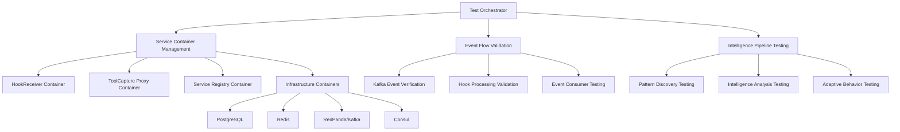

# Integration Testing Patterns

## Overview

This document provides comprehensive integration testing patterns for the OmniNode Bridge, focusing on cross-service communication, event flow validation, intelligence pipeline testing, and end-to-end service coordination scenarios.

## Integration Testing Architecture



## Test Environment Management

### Docker-Based Test Environment

```python
# tests/integration/framework/test_environment.py
import asyncio
import docker
import testcontainers
import aiohttp
import json
from typing import Dict, List, Any, Optional
from dataclasses import dataclass, field
from contextlib import asynccontextmanager

@dataclass
class ServiceInstance:
    """Represents a service instance in the test environment"""
    name: str
    container: Any
    url: str
    port: int
    health_endpoint: str = "/health"
    ready_endpoint: str = "/ready"

@dataclass
class TestEnvironment:
    """Complete test environment configuration"""
    infrastructure: Dict[str, Any] = field(default_factory=dict)
    services: Dict[str, ServiceInstance] = field(default_factory=dict)
    kafka_bootstrap_servers: str = ""
    database_url: str = ""
    redis_url: str = ""
    consul_url: str = ""

class IntegrationTestEnvironment:
    """Manages integration test environment lifecycle"""

    def __init__(self):
        self.docker_client = docker.from_env()
        self.environment: Optional[TestEnvironment] = None
        self._network = None

    async def setup(self) -> TestEnvironment:
        """Setup complete integration test environment"""
        print("Setting up integration test environment...")

        # Create dedicated network for test containers
        self._network = self.docker_client.networks.create(
            "omninode-bridge-test",
            driver="bridge"
        )

        # Setup infrastructure services
        infrastructure = await self._setup_infrastructure()

        # Setup bridge services
        services = await self._setup_bridge_services(infrastructure)

        # Create test environment
        self.environment = TestEnvironment(
            infrastructure=infrastructure,
            services=services,
            kafka_bootstrap_servers=infrastructure["redpanda"].get_bootstrap_server(),
            database_url=infrastructure["postgres"].get_connection_url(),
            redis_url=f"redis://{infrastructure['redis'].get_container_host_ip()}:{infrastructure['redis'].get_exposed_port(6379)}",
            consul_url=f"http://{infrastructure['consul'].get_container_host_ip()}:{infrastructure['consul'].get_exposed_port(8500)}"
        )

        # Initialize test data
        await self._initialize_test_data()

        print("Integration test environment ready")
        return self.environment

    async def teardown(self):
        """Cleanup test environment"""
        if self.environment:
            # Stop all service containers
            for service in self.environment.services.values():
                try:
                    service.container.stop()
                    service.container.remove()
                except:
                    pass

            # Stop infrastructure containers
            for container in self.environment.infrastructure.values():
                try:
                    container.stop()
                except:
                    pass

        # Remove test network
        if self._network:
            try:
                self._network.remove()
            except:
                pass

        print("Integration test environment cleaned up")

    async def _setup_infrastructure(self) -> Dict[str, Any]:
        """Setup infrastructure containers"""
        infrastructure = {}

        # PostgreSQL
        postgres = testcontainers.PostgreSQLContainer("postgres:15")
        postgres.with_env("POSTGRES_DB", "omninode_bridge_test")
        postgres.with_env("POSTGRES_USER", "test_user")
        postgres.with_env("POSTGRES_PASSWORD", "test_password")
        postgres.start()
        infrastructure["postgres"] = postgres

        # Redis
        redis = testcontainers.RedisContainer("redis:7-alpine")
        redis.start()
        infrastructure["redis"] = redis

        # RedPanda (Kafka)
        redpanda = testcontainers.KafkaContainer("docker.redpanda.com/vectorized/redpanda:latest")
        redpanda.start()
        infrastructure["redpanda"] = redpanda

        # Consul
        consul = testcontainers.DockerContainer("consul:latest")
        consul.with_command([
            "consul", "agent", "-server", "-bootstrap-expect=1",
            "-ui", "-bind=0.0.0.0", "-client=0.0.0.0", "-datacenter=test"
        ])
        consul.with_exposed_ports(8500)
        consul.start()
        infrastructure["consul"] = consul

        # Wait for all infrastructure to be ready
        await self._wait_for_infrastructure_ready(infrastructure)

        return infrastructure

    async def _setup_bridge_services(self, infrastructure: Dict[str, Any]) -> Dict[str, ServiceInstance]:
        """Setup bridge service containers"""
        services = {}

        # Common environment variables
        common_env = {
            "ENVIRONMENT": "test",
            "LOG_LEVEL": "debug",
            "KAFKA_BOOTSTRAP_SERVERS": infrastructure["redpanda"].get_bootstrap_server(),
            "POSTGRES_HOST": infrastructure["postgres"].get_container_host_ip(),
            "POSTGRES_PORT": str(infrastructure["postgres"].get_exposed_port(5432)),
            "POSTGRES_DB": "omninode_bridge_test",
            "POSTGRES_USER": "test_user",
            "POSTGRES_PASSWORD": "test_password",
            "REDIS_HOST": infrastructure["redis"].get_container_host_ip(),
            "REDIS_PORT": str(infrastructure["redis"].get_exposed_port(6379)),
            "CONSUL_HOST": infrastructure["consul"].get_container_host_ip(),
            "CONSUL_PORT": str(infrastructure["consul"].get_exposed_port(8500))
        }

        # HookReceiver Service
        hook_receiver = await self._build_and_start_service(
            service_name="hook-receiver",
            build_path="./services/hookReceiver",
            port=8001,
            environment=common_env
        )
        services["hook-receiver"] = hook_receiver

        # ToolCapture Proxy
        tool_proxy = await self._build_and_start_service(
            service_name="tool-capture-proxy",
            build_path="./services/toolCaptureProxy",
            port=8002,
            environment={
                **common_env,
                "CIRCUIT_BREAKER_FAILURE_THRESHOLD": "5",
                "CIRCUIT_BREAKER_TIMEOUT": "30",
                "ADAPTIVE_CACHING_ENABLED": "true"
            }
        )
        services["tool-capture-proxy"] = tool_proxy

        # Service Registry
        service_registry = await self._build_and_start_service(
            service_name="service-registry",
            build_path="./services/serviceRegistry",
            port=8003,
            environment=common_env
        )
        services["service-registry"] = service_registry

        return services

    async def _build_and_start_service(
        self,
        service_name: str,
        build_path: str,
        port: int,
        environment: Dict[str, str]
    ) -> ServiceInstance:
        """Build and start a bridge service container"""

        # Build service image
        print(f"Building {service_name} image...")
        image, logs = self.docker_client.images.build(
            path=build_path,
            tag=f"omninode-bridge-{service_name}:test",
            rm=True,
            forcerm=True
        )

        # Start container
        container = self.docker_client.containers.run(
            image.id,
            name=f"test-{service_name}",
            ports={f'{port}/tcp': None},
            environment=environment,
            network=self._network.name,
            detach=True,
            remove=False  # Keep for debugging
        )

        # Get exposed port
        container.reload()
        exposed_port = container.attrs['NetworkSettings']['Ports'][f'{port}/tcp'][0]['HostPort']
        service_url = f"http://localhost:{exposed_port}"

        # Wait for service to be ready
        await self._wait_for_service_ready(f"{service_url}/health", timeout=120)

        return ServiceInstance(
            name=service_name,
            container=container,
            url=service_url,
            port=int(exposed_port)
        )

    async def _wait_for_service_ready(self, health_url: str, timeout: int = 60):
        """Wait for service to be ready"""
        start_time = asyncio.get_event_loop().time()

        while asyncio.get_event_loop().time() - start_time < timeout:
            try:
                async with aiohttp.ClientSession(
                    timeout=aiohttp.ClientTimeout(total=5)
                ) as session:
                    async with session.get(health_url) as response:
                        if response.status == 200:
                            health_data = await response.json()
                            if health_data.get("data", {}).get("status") == "healthy":
                                return True
            except Exception as e:
                pass

            await asyncio.sleep(2)

        raise Exception(f"Service not ready after {timeout} seconds: {health_url}")

    async def _wait_for_infrastructure_ready(self, infrastructure: Dict[str, Any]):
        """Wait for all infrastructure services to be ready"""
        # Wait for PostgreSQL
        await self._wait_for_postgres_ready(infrastructure["postgres"])

        # Wait for Redis
        await self._wait_for_redis_ready(infrastructure["redis"])

        # Wait for Kafka
        await self._wait_for_kafka_ready(infrastructure["redpanda"])

        # Wait for Consul
        await self._wait_for_consul_ready(infrastructure["consul"])

    async def _wait_for_postgres_ready(self, postgres_container):
        """Wait for PostgreSQL to be ready"""
        import asyncpg
        start_time = asyncio.get_event_loop().time()

        while asyncio.get_event_loop().time() - start_time < 60:
            try:
                conn = await asyncpg.connect(postgres_container.get_connection_url())
                await conn.fetchval('SELECT 1')
                await conn.close()
                return
            except:
                await asyncio.sleep(2)

        raise Exception("PostgreSQL not ready after 60 seconds")

    async def _wait_for_redis_ready(self, redis_container):
        """Wait for Redis to be ready"""
        import aioredis
        start_time = asyncio.get_event_loop().time()

        while asyncio.get_event_loop().time() - start_time < 60:
            try:
                redis = aioredis.from_url(
                    f"redis://{redis_container.get_container_host_ip()}:{redis_container.get_exposed_port(6379)}"
                )
                await redis.ping()
                await redis.close()
                return
            except:
                await asyncio.sleep(2)

        raise Exception("Redis not ready after 60 seconds")

    async def _wait_for_kafka_ready(self, kafka_container):
        """Wait for Kafka to be ready"""
        from aiokafka import AIOKafkaProducer
        start_time = asyncio.get_event_loop().time()

        while asyncio.get_event_loop().time() - start_time < 60:
            try:
                producer = AIOKafkaProducer(
                    bootstrap_servers=kafka_container.get_bootstrap_server()
                )
                await producer.start()
                await producer.stop()
                return
            except:
                await asyncio.sleep(2)

        raise Exception("Kafka not ready after 60 seconds")

    async def _wait_for_consul_ready(self, consul_container):
        """Wait for Consul to be ready"""
        consul_url = f"http://{consul_container.get_container_host_ip()}:{consul_container.get_exposed_port(8500)}"
        start_time = asyncio.get_event_loop().time()

        while asyncio.get_event_loop().time() - start_time < 60:
            try:
                async with aiohttp.ClientSession() as session:
                    async with session.get(f"{consul_url}/v1/status/leader") as response:
                        if response.status == 200:
                            return
            except:
                pass
            await asyncio.sleep(2)

        raise Exception("Consul not ready after 60 seconds")

    async def _initialize_test_data(self):
        """Initialize test data and configurations"""
        # Create Kafka topics
        await self._create_kafka_topics()

        # Initialize database schema
        await self._initialize_database_schema()

        # Setup basic configurations
        await self._setup_test_configurations()

    async def _create_kafka_topics(self):
        """Create required Kafka topics"""
        from aiokafka.admin import AIOKafkaAdminClient, NewTopic

        topics = [
            "hooks.service_lifecycle",
            "hooks.tool_registration",
            "hooks.tool_execution",
            "proxy.requests",
            "proxy.cache",
            "intelligence.patterns",
            "intelligence.performance",
            "configuration.changes",
            "system.errors"
        ]

        admin_client = AIOKafkaAdminClient(
            bootstrap_servers=self.environment.kafka_bootstrap_servers
        )

        try:
            await admin_client.start()

            new_topics = [
                NewTopic(name=topic, num_partitions=1, replication_factor=1)
                for topic in topics
            ]

            await admin_client.create_topics(new_topics, validate_only=False)
        finally:
            await admin_client.close()

    async def _initialize_database_schema(self):
        """Initialize database schema"""
        import asyncpg

        conn = await asyncpg.connect(self.environment.database_url)

        try:
            # Create intelligence tables
            await conn.execute("""
                CREATE TABLE IF NOT EXISTS intelligence_patterns (
                    id SERIAL PRIMARY KEY,
                    pattern_id UUID UNIQUE NOT NULL,
                    pattern_type VARCHAR(100) NOT NULL,
                    confidence_score FLOAT NOT NULL,
                    discovery_time TIMESTAMP DEFAULT CURRENT_TIMESTAMP,
                    pattern_data JSONB NOT NULL,
                    created_at TIMESTAMP DEFAULT CURRENT_TIMESTAMP
                );
            """)

            # Create service registry tables
            await conn.execute("""
                CREATE TABLE IF NOT EXISTS service_registrations (
                    id SERIAL PRIMARY KEY,
                    service_name VARCHAR(100) NOT NULL,
                    instance_id VARCHAR(200) UNIQUE NOT NULL,
                    version VARCHAR(50) NOT NULL,
                    host VARCHAR(255) NOT NULL,
                    port INTEGER NOT NULL,
                    capabilities JSONB DEFAULT '[]',
                    metadata JSONB DEFAULT '{}',
                    health_status VARCHAR(20) DEFAULT 'unknown',
                    last_heartbeat TIMESTAMP DEFAULT CURRENT_TIMESTAMP,
                    created_at TIMESTAMP DEFAULT CURRENT_TIMESTAMP
                );
            """)

            # Create tool registry tables
            await conn.execute("""
                CREATE TABLE IF NOT EXISTS tool_registrations (
                    id SERIAL PRIMARY KEY,
                    tool_id UUID UNIQUE NOT NULL,
                    tool_name VARCHAR(100) NOT NULL,
                    version VARCHAR(50) NOT NULL,
                    service_source VARCHAR(100) NOT NULL,
                    category VARCHAR(100) NOT NULL,
                    input_schema JSONB NOT NULL,
                    output_schema JSONB NOT NULL,
                    execution_requirements JSONB DEFAULT '{}',
                    created_at TIMESTAMP DEFAULT CURRENT_TIMESTAMP
                );
            """)

        finally:
            await conn.close()

    async def _setup_test_configurations(self):
        """Setup test configurations in Consul"""
        import consul.aio

        consul_host = self.environment.consul_url.split("://")[1].split(":")[0]
        consul_port = int(self.environment.consul_url.split(":")[-1])

        consul_client = consul.aio.Consul(host=consul_host, port=consul_port)

        # Basic service configurations
        await consul_client.kv.put(
            "omninode-bridge/test/hook-receiver/workers",
            "2"
        )
        await consul_client.kv.put(
            "omninode-bridge/test/tool-capture-proxy/cache_ttl",
            "300"
        )
        await consul_client.kv.put(
            "omninode-bridge/test/service-registry/health_check_interval",
            "10"
        )

# Context manager for easy test environment management
@asynccontextmanager
async def integration_test_environment():
    """Context manager for integration test environment"""
    env_manager = IntegrationTestEnvironment()
    test_env = None

    try:
        test_env = await env_manager.setup()
        yield test_env
    finally:
        await env_manager.teardown()
```

## Service Communication Testing

### Cross-Service Event Flow Tests

```python
# tests/integration/test_service_communication.py
import pytest
import asyncio
import aiohttp
import json
from aiokafka import AIOKafkaConsumer, AIOKafkaProducer
from tests.integration.framework.test_environment import integration_test_environment

class TestServiceCommunication:
    """Test cross-service communication patterns"""

    @pytest.mark.asyncio
    async def test_hook_to_intelligence_pipeline(self):
        """Test complete hook processing and intelligence pipeline"""
        async with integration_test_environment() as env:
            # Setup event consumer to capture intelligence events
            received_events = []

            async def consume_intelligence_events():
                consumer = AIOKafkaConsumer(
                    "intelligence.patterns",
                    bootstrap_servers=env.kafka_bootstrap_servers,
                    group_id="test-intelligence-consumer",
                    value_deserializer=lambda x: json.loads(x.decode('utf-8'))
                )

                await consumer.start()
                try:
                    async for message in consumer:
                        received_events.append(message.value)
                        if len(received_events) >= 1:
                            break
                finally:
                    await consumer.stop()

            # Start consumer task
            consumer_task = asyncio.create_task(consume_intelligence_events())

            # Send service lifecycle hook
            hook_data = {
                "hook_type": "service_started",
                "service_info": {
                    "name": "test-service",
                    "version": "1.0.0",
                    "instance_id": "test-001",
                    "host": "localhost",
                    "port": 8000,
                    "capabilities": ["test_capability"]
                },
                "startup_info": {
                    "startup_time_ms": 2500,
                    "initialization_steps": [
                        {"step": "load_config", "duration_ms": 200, "status": "success"},
                        {"step": "init_database", "duration_ms": 300, "status": "success"}
                    ]
                }
            }

            async with aiohttp.ClientSession() as session:
                async with session.post(
                    f"{env.services['hook-receiver'].url}/hooks/service/lifecycle",
                    json=hook_data,
                    headers={"Content-Type": "application/json"}
                ) as response:
                    hook_result = await response.json()

            # Wait for intelligence processing
            await asyncio.wait_for(consumer_task, timeout=15)

            # Verify hook processing
            assert response.status == 200
            assert hook_result["success"] == True
            assert "hook_id" in hook_result["data"]
            assert hook_result["data"]["intelligence_analysis"]["patterns_discovered"]

            # Verify intelligence event generation
            assert len(received_events) >= 1
            intelligence_event = received_events[0]
            assert intelligence_event["event_type"] == "intelligence.pattern.discovered"
            assert intelligence_event["payload"]["pattern_info"]["pattern_type"] in [
                "startup_performance", "service_initialization"
            ]

    @pytest.mark.asyncio
    async def test_service_registration_and_discovery_flow(self):
        """Test service registration and discovery coordination"""
        async with integration_test_environment() as env:
            # Step 1: Register a new service
            service_config = {
                "service_name": "test-integration-service",
                "version": "1.0.0",
                "instance_id": "integration-test-001",
                "host": "localhost",
                "port": 9000,
                "health_check_url": "http://localhost:9000/health",
                "capabilities": ["integration_test_capability"],
                "metadata": {
                    "test_type": "integration",
                    "framework": "pytest"
                }
            }

            async with aiohttp.ClientSession() as session:
                async with session.post(
                    f"{env.services['service-registry'].url}/registry/services",
                    json=service_config
                ) as response:
                    registration_result = await response.json()

            assert response.status == 200
            assert registration_result["success"] == True
            registration_id = registration_result["data"]["registration_id"]

            # Step 2: Verify service appears in discovery
            await asyncio.sleep(2)  # Allow time for registration processing

            async with aiohttp.ClientSession() as session:
                async with session.get(
                    f"{env.services['service-registry'].url}/registry/services"
                ) as response:
                    discovery_result = await response.json()

            assert response.status == 200
            assert discovery_result["success"] == True

            # Find our registered service
            registered_services = discovery_result["data"]["services"]
            test_service = next(
                (s for s in registered_services if s["service_name"] == "test-integration-service"),
                None
            )

            assert test_service is not None
            assert len(test_service["instances"]) == 1
            assert test_service["instances"][0]["instance_id"] == "integration-test-001"

            # Step 3: Update service registration
            update_data = {
                "health_status": "healthy",
                "load_factor": 0.45,
                "metadata": {
                    "current_connections": 10,
                    "avg_response_time_ms": 120,
                    "test_update": True
                }
            }

            async with aiohttp.ClientSession() as session:
                async with session.put(
                    f"{env.services['service-registry'].url}/registry/services/{registration_id}",
                    json=update_data
                ) as response:
                    update_result = await response.json()

            assert response.status == 200
            assert update_result["success"] == True

            # Step 4: Verify update reflected in discovery
            async with aiohttp.ClientSession() as session:
                async with session.get(
                    f"{env.services['service-registry'].url}/registry/services?service_name=test-integration-service"
                ) as response:
                    updated_discovery = await response.json()

            test_service_updated = updated_discovery["data"]["services"][0]
            assert test_service_updated["instances"][0]["health_status"] == "healthy"
            assert test_service_updated["instances"][0]["metadata"]["test_update"] == True

            # Step 5: Test service deregistration
            async with aiohttp.ClientSession() as session:
                async with session.delete(
                    f"{env.services['service-registry'].url}/registry/services/{registration_id}"
                ) as response:
                    deregister_result = await response.json()

            assert response.status == 200
            assert deregister_result["success"] == True

    @pytest.mark.asyncio
    async def test_proxy_routing_and_caching_integration(self):
        """Test proxy routing with cache integration"""
        async with integration_test_environment() as env:
            # Step 1: Register a mock target service
            target_service_config = {
                "service_name": "mock-target-service",
                "version": "1.0.0",
                "instance_id": "mock-target-001",
                "host": "localhost",
                "port": 9001,
                "capabilities": ["mock_tool"]
            }

            async with aiohttp.ClientSession() as session:
                async with session.post(
                    f"{env.services['service-registry'].url}/registry/services",
                    json=target_service_config
                ) as response:
                    await response.json()

            # Allow registration to propagate
            await asyncio.sleep(2)

            # Step 2: Test proxy request (cache miss)
            proxy_request = {
                "target_service": "mock-target-service",
                "input_data": {
                    "test_input": "cache_test_data",
                    "request_id": "cache_test_001"
                },
                "execution_options": {
                    "timeout_seconds": 30,
                    "cache_policy": "adaptive",
                    "priority": "normal"
                }
            }

            # Note: This will fail because we don't have a real target service
            # But we can test the proxy routing logic
            async with aiohttp.ClientSession() as session:
                async with session.post(
                    f"{env.services['tool-capture-proxy'].url}/proxy/tool/mock_tool",
                    json=proxy_request
                ) as response:
                    first_result = await response.json()

            # The request should fail because target service isn't real,
            # but we can verify proxy processing
            assert response.status in [200, 404, 500]  # Various expected failure modes

            # Step 3: Test cache statistics
            async with aiohttp.ClientSession() as session:
                async with session.get(
                    f"{env.services['tool-capture-proxy'].url}/cache/stats"
                ) as response:
                    cache_stats = await response.json()

            assert response.status == 200
            assert cache_stats["success"] == True
            assert "cache_statistics" in cache_stats["data"]

    @pytest.mark.asyncio
    async def test_tool_registration_and_execution_flow(self):
        """Test tool registration and execution coordination"""
        async with integration_test_environment() as env:
            # Step 1: Register a tool
            tool_definition = {
                "tool_name": "integration_test_tool",
                "version": "1.0.0",
                "service_source": "integration-test-service",
                "category": "testing",
                "description": "Tool for integration testing",
                "input_schema": {
                    "type": "object",
                    "properties": {
                        "test_data": {"type": "string"},
                        "test_mode": {"type": "string", "enum": ["fast", "thorough"]}
                    },
                    "required": ["test_data"]
                },
                "output_schema": {
                    "type": "object",
                    "properties": {
                        "result": {"type": "string"},
                        "execution_time_ms": {"type": "number"}
                    }
                },
                "execution_requirements": {
                    "max_execution_time_ms": 30000,
                    "memory_limit_mb": 256
                }
            }

            async with aiohttp.ClientSession() as session:
                async with session.post(
                    f"{env.services['service-registry'].url}/registry/tools",
                    json=tool_definition
                ) as response:
                    tool_registration_result = await response.json()

            assert response.status == 200
            assert tool_registration_result["success"] == True
            tool_id = tool_registration_result["data"]["tool_id"]

            # Step 2: Verify tool appears in discovery
            await asyncio.sleep(1)

            async with aiohttp.ClientSession() as session:
                async with session.get(
                    f"{env.services['service-registry'].url}/registry/tools"
                ) as response:
                    tool_discovery_result = await response.json()

            assert response.status == 200
            registered_tools = tool_discovery_result["data"]["tools"]
            integration_tool = next(
                (t for t in registered_tools if t["tool_name"] == "integration_test_tool"),
                None
            )

            assert integration_tool is not None
            assert integration_tool["tool_id"] == tool_id
            assert integration_tool["category"] == "testing"

            # Step 3: Send tool execution hook
            execution_hook = {
                "hook_type": "tool_executed",
                "execution_info": {
                    "tool_name": "integration_test_tool",
                    "tool_version": "1.0.0",
                    "execution_id": "integration_exec_001",
                    "requester_service": "test_client",
                    "executor_service": "integration-test-service"
                },
                "execution_timeline": {
                    "requested_at": "2024-01-15T10:30:00Z",
                    "started_at": "2024-01-15T10:30:00.5Z",
                    "completed_at": "2024-01-15T10:30:02.5Z",
                    "total_duration_ms": 2000,
                    "execution_time_ms": 1500
                },
                "execution_result": {
                    "status": "success",
                    "result_type": "test_result",
                    "output_size_bytes": 1024
                },
                "resource_usage": {
                    "cpu_usage": {"peak_percent": 35.0, "average_percent": 25.0},
                    "memory_usage": {"peak_mb": 128, "average_mb": 96}
                }
            }

            async with aiohttp.ClientSession() as session:
                async with session.post(
                    f"{env.services['hook-receiver'].url}/hooks/tool/execution",
                    json=execution_hook
                ) as response:
                    execution_hook_result = await response.json()

            assert response.status == 200
            assert execution_hook_result["success"] == True
            assert execution_hook_result["data"]["processing_status"] == "completed"
```

## Event Flow Integration Testing

### Kafka Event Flow Validation

```python
# tests/integration/test_event_flows.py
import pytest
import asyncio
import json
from aiokafka import AIOKafkaProducer, AIOKafkaConsumer
from tests.integration.framework.test_environment import integration_test_environment

class TestEventFlows:
    """Test event flow integration across the bridge"""

    @pytest.mark.asyncio
    async def test_complete_event_pipeline(self):
        """Test complete event pipeline from hook to intelligence"""
        async with integration_test_environment() as env:
            # Setup event capture across multiple topics
            captured_events = {
                "hooks.service_lifecycle": [],
                "intelligence.patterns": [],
                "intelligence.performance": []
            }

            async def event_consumer(topic: str):
                consumer = AIOKafkaConsumer(
                    topic,
                    bootstrap_servers=env.kafka_bootstrap_servers,
                    group_id=f"test-consumer-{topic.replace('.', '-')}",
                    value_deserializer=lambda x: json.loads(x.decode('utf-8'))
                )

                await consumer.start()
                try:
                    async for message in consumer:
                        captured_events[topic].append(message.value)
                        if len(captured_events[topic]) >= 2:  # Capture multiple events
                            break
                finally:
                    await consumer.stop()

            # Start consumers for all topics
            consumer_tasks = [
                asyncio.create_task(event_consumer(topic))
                for topic in captured_events.keys()
            ]

            # Send multiple hooks to generate event flow
            hook_data_list = [
                {
                    "hook_type": "service_started",
                    "service_info": {
                        "name": f"test-service-{i}",
                        "version": "1.0.0",
                        "instance_id": f"test-{i:03d}",
                        "startup_time_ms": 2000 + (i * 100)
                    }
                }
                for i in range(3)
            ]

            # Send hooks
            async with aiohttp.ClientSession() as session:
                for hook_data in hook_data_list:
                    async with session.post(
                        f"{env.services['hook-receiver'].url}/hooks/service/lifecycle",
                        json=hook_data
                    ) as response:
                        await response.json()

            # Wait for event processing
            await asyncio.gather(*consumer_tasks, timeout=20)

            # Verify event flow
            assert len(captured_events["hooks.service_lifecycle"]) >= 2
            assert len(captured_events["intelligence.patterns"]) >= 1

            # Verify event structure and content
            lifecycle_event = captured_events["hooks.service_lifecycle"][0]
            assert lifecycle_event["event_type"] == "service.lifecycle.started"
            assert "service_info" in lifecycle_event["payload"]

            pattern_event = captured_events["intelligence.patterns"][0]
            assert pattern_event["event_type"] == "intelligence.pattern.discovered"
            assert "pattern_info" in pattern_event["payload"]

    @pytest.mark.asyncio
    async def test_event_ordering_and_correlation(self):
        """Test event ordering and correlation across services"""
        async with integration_test_environment() as env:
            correlation_id = "test-correlation-123"
            received_events = []

            async def correlated_event_consumer():
                consumer = AIOKafkaConsumer(
                    "hooks.service_lifecycle",
                    "intelligence.patterns",
                    bootstrap_servers=env.kafka_bootstrap_servers,
                    group_id="test-correlation-consumer",
                    value_deserializer=lambda x: json.loads(x.decode('utf-8'))
                )

                await consumer.start()
                try:
                    timeout_time = asyncio.get_event_loop().time() + 15
                    while asyncio.get_event_loop().time() < timeout_time:
                        try:
                            message = await asyncio.wait_for(consumer.getone(), timeout=1.0)
                            event_data = message.value
                            if event_data.get("correlation_id") == correlation_id:
                                received_events.append({
                                    "topic": message.topic,
                                    "event": event_data,
                                    "timestamp": asyncio.get_event_loop().time()
                                })
                        except asyncio.TimeoutError:
                            continue
                finally:
                    await consumer.stop()

            # Start consumer
            consumer_task = asyncio.create_task(correlated_event_consumer())

            # Send correlated hook
            hook_data = {
                "hook_type": "service_started",
                "service_info": {
                    "name": "correlation-test-service",
                    "version": "1.0.0",
                    "instance_id": "correlation-001"
                },
                "correlation_id": correlation_id
            }

            async with aiohttp.ClientSession() as session:
                async with session.post(
                    f"{env.services['hook-receiver'].url}/hooks/service/lifecycle",
                    json=hook_data,
                    headers={"X-Correlation-ID": correlation_id}
                ) as response:
                    await response.json()

            # Wait for event processing
            await consumer_task

            # Verify correlation and ordering
            assert len(received_events) >= 1

            # Check that all events have the same correlation ID
            for event_record in received_events:
                assert event_record["event"]["correlation_id"] == correlation_id

            # Verify chronological ordering
            if len(received_events) > 1:
                timestamps = [e["timestamp"] for e in received_events]
                assert timestamps == sorted(timestamps)

    @pytest.mark.asyncio
    async def test_event_failure_and_retry_patterns(self):
        """Test event processing failure and retry patterns"""
        async with integration_test_environment() as env:
            # Send malformed hook to test error handling
            malformed_hook = {
                "hook_type": "invalid_hook_type",
                "invalid_payload": {
                    "missing_required_fields": True
                }
            }

            async with aiohttp.ClientSession() as session:
                async with session.post(
                    f"{env.services['hook-receiver'].url}/hooks/service/lifecycle",
                    json=malformed_hook
                ) as response:
                    error_result = await response.json()

            # Verify error handling
            assert response.status in [400, 422]  # Bad request or validation error
            assert error_result["success"] == False
            assert "error" in error_result

            # Send valid hook to verify recovery
            valid_hook = {
                "hook_type": "service_started",
                "service_info": {
                    "name": "recovery-test-service",
                    "version": "1.0.0",
                    "instance_id": "recovery-001"
                }
            }

            async with aiohttp.ClientSession() as session:
                async with session.post(
                    f"{env.services['hook-receiver'].url}/hooks/service/lifecycle",
                    json=valid_hook
                ) as response:
                    recovery_result = await response.json()

            # Verify recovery
            assert response.status == 200
            assert recovery_result["success"] == True
```

## Intelligence Pipeline Integration Testing

### Pattern Discovery Integration Tests

```python
# tests/integration/test_intelligence_pipeline.py
import pytest
import asyncio
import aiohttp
from tests.integration.framework.test_environment import integration_test_environment

class TestIntelligencePipeline:
    """Test intelligence processing pipeline integration"""

    @pytest.mark.asyncio
    async def test_pattern_discovery_across_multiple_hooks(self):
        """Test pattern discovery from multiple hook events"""
        async with integration_test_environment() as env:
            # Send multiple related hooks to generate patterns
            service_starts = []
            for i in range(5):
                hook_data = {
                    "hook_type": "service_started",
                    "service_info": {
                        "name": f"pattern-test-service-{i}",
                        "version": "1.0.0",
                        "instance_id": f"pattern-{i:03d}",
                        "startup_time_ms": 2000 + (i * 200)  # Increasing startup times
                    },
                    "startup_info": {
                        "initialization_steps": [
                            {"step": "load_config", "duration_ms": 100 + (i * 20)},
                            {"step": "init_database", "duration_ms": 200 + (i * 30)}
                        ]
                    }
                }

                async with aiohttp.ClientSession() as session:
                    async with session.post(
                        f"{env.services['hook-receiver'].url}/hooks/service/lifecycle",
                        json=hook_data
                    ) as response:
                        result = await response.json()
                        service_starts.append(result)

                # Small delay between hooks
                await asyncio.sleep(0.5)

            # Allow time for pattern analysis
            await asyncio.sleep(5)

            # Retrieve discovered patterns
            async with aiohttp.ClientSession() as session:
                async with session.get(
                    f"{env.services['hook-receiver'].url}/intelligence/patterns?pattern_type=startup_performance"
                ) as response:
                    patterns_result = await response.json()

            # Verify pattern discovery
            assert response.status == 200
            assert patterns_result["success"] == True
            assert len(patterns_result["data"]["patterns"]) >= 1

            # Verify pattern quality
            startup_pattern = patterns_result["data"]["patterns"][0]
            assert startup_pattern["pattern_type"] == "startup_performance"
            assert startup_pattern["confidence_score"] >= 0.7
            assert "affected_services" in startup_pattern
            assert len(startup_pattern["affected_services"]) >= 3

    @pytest.mark.asyncio
    async def test_adaptive_caching_intelligence(self):
        """Test adaptive caching intelligence development"""
        async with integration_test_environment() as env:
            # Register mock service for proxy testing
            mock_service = {
                "service_name": "caching-test-service",
                "version": "1.0.0",
                "instance_id": "caching-001",
                "host": "localhost",
                "port": 9002,
                "capabilities": ["caching_test_tool"]
            }

            async with aiohttp.ClientSession() as session:
                await session.post(
                    f"{env.services['service-registry'].url}/registry/services",
                    json=mock_service
                )

            # Send multiple similar requests to develop caching patterns
            consistent_request = {
                "target_service": "caching-test-service",
                "input_data": {"consistent": "data", "cache_test": True},
                "execution_options": {"cache_policy": "adaptive"}
            }

            cache_responses = []
            for i in range(5):
                async with aiohttp.ClientSession() as session:
                    async with session.post(
                        f"{env.services['tool-capture-proxy'].url}/proxy/tool/caching_test_tool",
                        json=consistent_request
                    ) as response:
                        result = await response.json()
                        cache_responses.append(result)

                await asyncio.sleep(1)

            # Check cache statistics evolution
            async with aiohttp.ClientSession() as session:
                async with session.get(
                    f"{env.services['tool-capture-proxy'].url}/cache/stats"
                ) as response:
                    cache_stats = await response.json()

            # Verify adaptive caching intelligence
            assert response.status == 200
            adaptive_caching = cache_stats["data"]["adaptive_caching"]
            assert adaptive_caching["learning_enabled"] == True
            assert adaptive_caching["confidence_score"] > 0.5

    @pytest.mark.asyncio
    async def test_performance_anomaly_detection(self):
        """Test performance anomaly detection integration"""
        async with integration_test_environment() as env:
            # Send normal performance hooks
            for i in range(3):
                normal_hook = {
                    "hook_type": "tool_executed",
                    "execution_info": {
                        "tool_name": "performance_test_tool",
                        "execution_id": f"normal_exec_{i}",
                        "execution_time_ms": 150 + (i * 10)  # Normal variance
                    },
                    "resource_usage": {
                        "cpu_usage": {"peak_percent": 30 + (i * 2)},
                        "memory_usage": {"peak_mb": 100 + (i * 5)}
                    }
                }

                async with aiohttp.ClientSession() as session:
                    await session.post(
                        f"{env.services['hook-receiver'].url}/hooks/tool/execution",
                        json=normal_hook
                    )

            # Send anomalous performance hook
            anomaly_hook = {
                "hook_type": "tool_executed",
                "execution_info": {
                    "tool_name": "performance_test_tool",
                    "execution_id": "anomaly_exec_001",
                    "execution_time_ms": 2500  # Significant anomaly
                },
                "resource_usage": {
                    "cpu_usage": {"peak_percent": 85},
                    "memory_usage": {"peak_mb": 450}
                }
            }

            async with aiohttp.ClientSession() as session:
                async with session.post(
                    f"{env.services['hook-receiver'].url}/hooks/tool/execution",
                    json=anomaly_hook
                ) as response:
                    anomaly_result = await response.json()

            # Allow time for anomaly detection
            await asyncio.sleep(3)

            # Check for anomaly patterns
            async with aiohttp.ClientSession() as session:
                async with session.get(
                    f"{env.services['hook-receiver'].url}/intelligence/patterns?pattern_type=performance_anomaly"
                ) as response:
                    anomaly_patterns = await response.json()

            # Verify anomaly detection
            if anomaly_patterns["data"]["patterns"]:
                anomaly_pattern = anomaly_patterns["data"]["patterns"][0]
                assert anomaly_pattern["pattern_type"] == "performance_anomaly"
                assert anomaly_pattern["confidence_score"] >= 0.7
```

This comprehensive integration testing framework ensures all cross-service communication, event flows, and intelligence pipelines work correctly together in the OmniNode Bridge ecosystem.
