# Performance Testing Documentation

## Overview

This document provides comprehensive performance testing strategies, tools, and implementation patterns for the OmniNode Bridge ecosystem. Performance testing ensures that all components meet intelligence requirements, scale effectively, and maintain optimal response times under various load conditions.

## Performance Testing Architecture

### Testing Framework

```mermaid
graph TD
    A[Performance Test Suite] --> B[Load Testing]
    A --> C[Stress Testing]
    A --> D[Intelligence Performance]
    A --> E[Scalability Testing]

    B --> B1[HTTP Load Tests]
    B --> B2[Event Stream Load]
    B --> B3[Database Load]
    B --> B4[Cache Performance]

    C --> C1[Service Overload]
    C --> C2[Memory Pressure]
    C --> C3[CPU Saturation]
    C --> C4[Network Saturation]

    D --> D1[Pattern Discovery Speed]
    D --> D2[Event Processing Latency]
    D --> D3[Intelligence Accuracy]
    D --> D4[Learning Rate]

    E --> E1[Horizontal Scaling]
    E --> E2[Vertical Scaling]
    E --> E3[Auto-scaling Triggers]
    E --> E4[Resource Efficiency]

    F[Monitoring] --> F1[Metrics Collection]
    F --> F2[Real-time Dashboards]
    F --> F3[Alert Management]
    F --> F4[Performance Baselines]

    B1 --> F1
    C1 --> F1
    D1 --> F1
    E1 --> F1
```



## Core Performance Testing Framework

### Implementation

```python
from typing import Dict, List, Any, Optional, Callable
from dataclasses import dataclass, field
from enum import Enum
import asyncio
import aiohttp
import time
import psutil
import json
import numpy as np
from datetime import datetime, timedelta
import matplotlib.pyplot as plt
import seaborn as sns

class TestType(Enum):
    LOAD = "load"
    STRESS = "stress"
    SPIKE = "spike"
    VOLUME = "volume"
    ENDURANCE = "endurance"
    INTELLIGENCE = "intelligence"

@dataclass
class PerformanceMetrics:
    """Container for performance metrics"""
    response_times: List[float] = field(default_factory=list)
    throughput: float = 0.0
    error_rate: float = 0.0
    cpu_usage: List[float] = field(default_factory=list)
    memory_usage: List[float] = field(default_factory=list)
    custom_metrics: Dict[str, Any] = field(default_factory=dict)

@dataclass
class TestResult:
    """Performance test result container"""
    test_name: str
    test_type: TestType
    duration: float
    metrics: PerformanceMetrics
    success: bool
    errors: List[str] = field(default_factory=list)
    recommendations: List[str] = field(default_factory=list)

class PerformanceTestFramework:
    """Core performance testing framework for OmniNode Bridge"""

    def __init__(self, config: Dict[str, Any]):
        self.config = config
        self.base_urls = config.get('base_urls', {})
        self.test_data_generators = {}
        self.metrics_collectors = []
        self.results: List[TestResult] = []

    async def run_test_suite(self, test_suite: str) -> List[TestResult]:
        """Run a complete performance test suite"""

        print(f"🚀 Starting Performance Test Suite: {test_suite}")

        # Load test configuration
        suite_config = self.config.get('test_suites', {}).get(test_suite, {})

        if not suite_config:
            raise ValueError(f"Test suite '{test_suite}' not found in configuration")

        test_results = []

        # Run tests in sequence to avoid interference
        for test_config in suite_config.get('tests', []):
            print(f"📊 Running test: {test_config['name']}")

            try:
                result = await self._run_single_test(test_config)
                test_results.append(result)

                # Print immediate results
                self._print_test_summary(result)

                # Wait between tests to allow system recovery
                recovery_time = test_config.get('recovery_time', 30)
                if recovery_time > 0:
                    print(f"⏳ Recovery period: {recovery_time}s")
                    await asyncio.sleep(recovery_time)

            except Exception as e:
                error_result = TestResult(
                    test_name=test_config['name'],
                    test_type=TestType(test_config.get('type', 'load')),
                    duration=0,
                    metrics=PerformanceMetrics(),
                    success=False,
                    errors=[str(e)]
                )
                test_results.append(error_result)
                print(f"❌ Test failed: {e}")

        # Generate comprehensive report
        await self._generate_performance_report(test_results, test_suite)

        return test_results

    async def _run_single_test(self, test_config: Dict[str, Any]) -> TestResult:
        """Run a single performance test"""

        test_name = test_config['name']
        test_type = TestType(test_config['type'])
        duration = test_config.get('duration', 60)

        # Initialize metrics collection
        metrics = PerformanceMetrics()

        # Start system monitoring
        monitoring_task = asyncio.create_task(
            self._monitor_system_resources(metrics, duration)
        )

        start_time = time.time()

        try:
            # Run the specific test type
            if test_type == TestType.LOAD:
                await self._run_load_test(test_config, metrics)
            elif test_type == TestType.STRESS:
                await self._run_stress_test(test_config, metrics)
            elif test_type == TestType.SPIKE:
                await self._run_spike_test(test_config, metrics)
            elif test_type == TestType.INTELLIGENCE:
                await self._run_intelligence_test(test_config, metrics)
            elif test_type == TestType.ENDURANCE:
                await self._run_endurance_test(test_config, metrics)
            else:
                raise ValueError(f"Unknown test type: {test_type}")

        finally:
            # Stop monitoring
            monitoring_task.cancel()
            try:
                await monitoring_task
            except asyncio.CancelledError:
                pass

        actual_duration = time.time() - start_time

        # Calculate final metrics
        self._calculate_final_metrics(metrics)

        # Determine success criteria
        success = self._evaluate_test_success(test_config, metrics)

        # Generate recommendations
        recommendations = self._generate_recommendations(test_config, metrics)

        return TestResult(
            test_name=test_name,
            test_type=test_type,
            duration=actual_duration,
            metrics=metrics,
            success=success,
            recommendations=recommendations
        )

    async def _run_load_test(self, test_config: Dict[str, Any], metrics: PerformanceMetrics):
        """Run sustained load test"""

        target_rps = test_config.get('target_rps', 100)
        duration = test_config.get('duration', 60)
        endpoints = test_config.get('endpoints', [])

        print(f"🔄 Load test: {target_rps} RPS for {duration}s")

        # Calculate request interval
        request_interval = 1.0 / target_rps

        # Create HTTP client session
        connector = aiohttp.TCPConnector(limit=500, limit_per_host=100)
        timeout = aiohttp.ClientTimeout(total=30)

        async with aiohttp.ClientSession(connector=connector, timeout=timeout) as session:

            # Generate requests for duration
            end_time = time.time() + duration
            request_count = 0
            error_count = 0

            while time.time() < end_time:
                # Create batch of concurrent requests
                batch_size = min(10, target_rps)  # Process in batches

                tasks = []
                for _ in range(batch_size):
                    if time.time() >= end_time:
                        break

                    endpoint = endpoints[request_count % len(endpoints)]
                    task = self._make_request(session, endpoint, metrics)
                    tasks.append(task)
                    request_count += 1

                # Execute batch
                if tasks:
                    results = await asyncio.gather(*tasks, return_exceptions=True)

                    # Count errors
                    for result in results:
                        if isinstance(result, Exception):
                            error_count += 1

                # Wait for next batch
                await asyncio.sleep(request_interval * batch_size)

            # Calculate final throughput and error rate
            actual_duration = min(duration, time.time() - (end_time - duration))
            metrics.throughput = request_count / actual_duration
            metrics.error_rate = error_count / max(request_count, 1)

    async def _run_stress_test(self, test_config: Dict[str, Any], metrics: PerformanceMetrics):
        """Run stress test with gradually increasing load"""

        start_rps = test_config.get('start_rps', 10)
        max_rps = test_config.get('max_rps', 1000)
        ramp_duration = test_config.get('ramp_duration', 300)  # 5 minutes
        hold_duration = test_config.get('hold_duration', 60)   # 1 minute
        endpoints = test_config.get('endpoints', [])

        print(f"📈 Stress test: {start_rps} to {max_rps} RPS over {ramp_duration}s")

        connector = aiohttp.TCPConnector(limit=1000, limit_per_host=200)
        timeout = aiohttp.ClientTimeout(total=30)

        async with aiohttp.ClientSession(connector=connector, timeout=timeout) as session:

            start_time = time.time()
            request_count = 0
            error_count = 0

            # Ramp up phase
            ramp_end_time = start_time + ramp_duration

            while time.time() < ramp_end_time:
                current_time = time.time()
                progress = (current_time - start_time) / ramp_duration
                current_rps = start_rps + (max_rps - start_rps) * progress

                # Execute requests for this second
                requests_this_second = int(current_rps)

                if requests_this_second > 0:
                    tasks = []
                    for _ in range(requests_this_second):
                        endpoint = endpoints[request_count % len(endpoints)]
                        task = self._make_request(session, endpoint, metrics)
                        tasks.append(task)
                        request_count += 1

                    # Execute batch with timeout
                    try:
                        results = await asyncio.wait_for(
                            asyncio.gather(*tasks, return_exceptions=True),
                            timeout=1.0
                        )

                        for result in results:
                            if isinstance(result, Exception):
                                error_count += 1

                    except asyncio.TimeoutError:
                        error_count += len(tasks)

                await asyncio.sleep(1.0)  # Wait for next second

            # Hold at max RPS
            print(f"🔥 Holding at max RPS: {max_rps}")

            hold_end_time = time.time() + hold_duration

            while time.time() < hold_end_time:
                tasks = []
                for _ in range(max_rps):
                    endpoint = endpoints[request_count % len(endpoints)]
                    task = self._make_request(session, endpoint, metrics)
                    tasks.append(task)
                    request_count += 1

                try:
                    results = await asyncio.wait_for(
                        asyncio.gather(*tasks, return_exceptions=True),
                        timeout=1.0
                    )

                    for result in results:
                        if isinstance(result, Exception):
                            error_count += 1

                except asyncio.TimeoutError:
                    error_count += len(tasks)

                await asyncio.sleep(1.0)

            # Calculate metrics
            total_duration = time.time() - start_time
            metrics.throughput = request_count / total_duration
            metrics.error_rate = error_count / max(request_count, 1)

    async def _run_intelligence_test(self, test_config: Dict[str, Any], metrics: PerformanceMetrics):
        """Run intelligence-specific performance tests"""

        intelligence_tests = test_config.get('intelligence_tests', [])

        print(f"🧠 Intelligence performance test: {len(intelligence_tests)} test cases")

        intelligence_metrics = {
            'pattern_discovery_times': [],
            'event_processing_times': [],
            'prediction_times': [],
            'learning_update_times': []
        }

        for test_case in intelligence_tests:
            test_type = test_case.get('type')

            if test_type == 'pattern_discovery':
                time_taken = await self._test_pattern_discovery_performance(test_case)
                intelligence_metrics['pattern_discovery_times'].append(time_taken)

            elif test_type == 'event_processing':
                time_taken = await self._test_event_processing_performance(test_case)
                intelligence_metrics['event_processing_times'].append(time_taken)

            elif test_type == 'prediction':
                time_taken = await self._test_prediction_performance(test_case)
                intelligence_metrics['prediction_times'].append(time_taken)

            elif test_type == 'learning_update':
                time_taken = await self._test_learning_update_performance(test_case)
                intelligence_metrics['learning_update_times'].append(time_taken)

        # Calculate intelligence performance metrics
        metrics.custom_metrics['intelligence'] = {
            'avg_pattern_discovery_time': np.mean(intelligence_metrics['pattern_discovery_times']) if intelligence_metrics['pattern_discovery_times'] else 0,
            'avg_event_processing_time': np.mean(intelligence_metrics['event_processing_times']) if intelligence_metrics['event_processing_times'] else 0,
            'avg_prediction_time': np.mean(intelligence_metrics['prediction_times']) if intelligence_metrics['prediction_times'] else 0,
            'avg_learning_update_time': np.mean(intelligence_metrics['learning_update_times']) if intelligence_metrics['learning_update_times'] else 0,
            'p95_pattern_discovery_time': np.percentile(intelligence_metrics['pattern_discovery_times'], 95) if intelligence_metrics['pattern_discovery_times'] else 0,
            'p95_event_processing_time': np.percentile(intelligence_metrics['event_processing_times'], 95) if intelligence_metrics['event_processing_times'] else 0
        }

    async def _test_pattern_discovery_performance(self, test_case: Dict[str, Any]) -> float:
        """Test pattern discovery performance"""

        # Generate test events
        event_count = test_case.get('event_count', 1000)
        test_events = self._generate_test_events(event_count)

        start_time = time.time()

        # Send events to pattern discovery system
        async with aiohttp.ClientSession() as session:
            endpoint = f"{self.base_urls['hook_receiver']}/hooks"

            for event in test_events:
                try:
                    async with session.post(endpoint, json=event) as response:
                        await response.text()
                except:
                    pass  # Ignore individual errors for performance test

        # Wait for pattern discovery to complete
        await asyncio.sleep(2)

        # Check if patterns were discovered
        discovery_time = time.time() - start_time

        return discovery_time * 1000  # Convert to milliseconds

    async def _test_event_processing_performance(self, test_case: Dict[str, Any]) -> float:
        """Test event processing latency"""

        event_count = test_case.get('event_count', 100)

        processing_times = []

        async with aiohttp.ClientSession() as session:
            endpoint = f"{self.base_urls['hook_receiver']}/hooks"

            for _ in range(event_count):
                event = self._generate_single_test_event()
                event['timestamp'] = time.time() * 1000  # Add timestamp for latency measurement

                start_time = time.time()

                try:
                    async with session.post(endpoint, json=event) as response:
                        await response.text()
                        processing_time = (time.time() - start_time) * 1000
                        processing_times.append(processing_time)
                except:
                    pass

                # Small delay between events
                await asyncio.sleep(0.01)

        return np.mean(processing_times) if processing_times else 0

    async def _make_request(self, session: aiohttp.ClientSession,
                          endpoint: Dict[str, Any], metrics: PerformanceMetrics) -> Optional[Dict[str, Any]]:
        """Make a single HTTP request and collect metrics"""

        method = endpoint.get('method', 'GET')
        url = f"{self.base_urls[endpoint['service']]}{endpoint['path']}"
        headers = endpoint.get('headers', {})
        data = endpoint.get('data')

        start_time = time.time()

        try:
            async with session.request(method, url, headers=headers, json=data) as response:
                await response.text()

                response_time = (time.time() - start_time) * 1000  # Convert to milliseconds
                metrics.response_times.append(response_time)

                return {
                    'status_code': response.status,
                    'response_time': response_time,
                    'success': response.status < 400
                }

        except Exception as e:
            response_time = (time.time() - start_time) * 1000
            metrics.response_times.append(response_time)
            raise e

    async def _monitor_system_resources(self, metrics: PerformanceMetrics, duration: float):
        """Monitor system resource usage during test"""

        end_time = time.time() + duration

        while time.time() < end_time:
            try:
                # Collect CPU and memory usage
                cpu_percent = psutil.cpu_percent(interval=1)
                memory_info = psutil.virtual_memory()
                memory_percent = memory_info.percent

                metrics.cpu_usage.append(cpu_percent)
                metrics.memory_usage.append(memory_percent)

                await asyncio.sleep(1)

            except asyncio.CancelledError:
                break
            except Exception as e:
                print(f"Error monitoring resources: {e}")
                await asyncio.sleep(1)

    def _calculate_final_metrics(self, metrics: PerformanceMetrics):
        """Calculate final performance metrics"""

        if metrics.response_times:
            # Response time statistics
            metrics.custom_metrics['response_time_stats'] = {
                'mean': np.mean(metrics.response_times),
                'median': np.median(metrics.response_times),
                'p95': np.percentile(metrics.response_times, 95),
                'p99': np.percentile(metrics.response_times, 99),
                'min': np.min(metrics.response_times),
                'max': np.max(metrics.response_times),
                'std': np.std(metrics.response_times)
            }

        if metrics.cpu_usage:
            # CPU usage statistics
            metrics.custom_metrics['cpu_stats'] = {
                'mean': np.mean(metrics.cpu_usage),
                'max': np.max(metrics.cpu_usage),
                'p95': np.percentile(metrics.cpu_usage, 95)
            }

        if metrics.memory_usage:
            # Memory usage statistics
            metrics.custom_metrics['memory_stats'] = {
                'mean': np.mean(metrics.memory_usage),
                'max': np.max(metrics.memory_usage),
                'p95': np.percentile(metrics.memory_usage, 95)
            }

    def _evaluate_test_success(self, test_config: Dict[str, Any], metrics: PerformanceMetrics) -> bool:
        """Evaluate if test meets success criteria"""

        success_criteria = test_config.get('success_criteria', {})

        # Check response time criteria
        if 'max_response_time_p95' in success_criteria:
            p95_time = metrics.custom_metrics.get('response_time_stats', {}).get('p95', float('inf'))
            if p95_time > success_criteria['max_response_time_p95']:
                return False

        # Check throughput criteria
        if 'min_throughput' in success_criteria:
            if metrics.throughput < success_criteria['min_throughput']:
                return False

        # Check error rate criteria
        if 'max_error_rate' in success_criteria:
            if metrics.error_rate > success_criteria['max_error_rate']:
                return False

        # Check resource usage criteria
        if 'max_cpu_usage' in success_criteria:
            max_cpu = metrics.custom_metrics.get('cpu_stats', {}).get('max', 0)
            if max_cpu > success_criteria['max_cpu_usage']:
                return False

        # Check intelligence criteria
        if 'intelligence' in success_criteria:
            intelligence_criteria = success_criteria['intelligence']
            intelligence_metrics = metrics.custom_metrics.get('intelligence', {})

            if 'max_pattern_discovery_time' in intelligence_criteria:
                discovery_time = intelligence_metrics.get('avg_pattern_discovery_time', float('inf'))
                if discovery_time > intelligence_criteria['max_pattern_discovery_time']:
                    return False

        return True

    def _generate_recommendations(self, test_config: Dict[str, Any], metrics: PerformanceMetrics) -> List[str]:
        """Generate performance recommendations based on test results"""

        recommendations = []

        # Response time recommendations
        response_stats = metrics.custom_metrics.get('response_time_stats', {})
        p95_time = response_stats.get('p95', 0)

        if p95_time > 1000:  # > 1 second
            recommendations.append("Consider implementing caching to reduce response times")
            recommendations.append("Review database query performance and add indexes")

        if p95_time > 500:  # > 500ms
            recommendations.append("Optimize API endpoint performance")
            recommendations.append("Consider connection pooling for external services")

        # Error rate recommendations
        if metrics.error_rate > 0.01:  # > 1%
            recommendations.append("Investigate and fix errors to improve reliability")
            recommendations.append("Implement circuit breakers for external dependencies")

        # Resource usage recommendations
        cpu_stats = metrics.custom_metrics.get('cpu_stats', {})
        memory_stats = metrics.custom_metrics.get('memory_stats', {})

        if cpu_stats.get('max', 0) > 80:
            recommendations.append("High CPU usage detected - consider scaling horizontally")
            recommendations.append("Profile application for CPU bottlenecks")

        if memory_stats.get('max', 0) > 80:
            recommendations.append("High memory usage detected - check for memory leaks")
            recommendations.append("Consider implementing memory-efficient algorithms")

        # Throughput recommendations
        if metrics.throughput < test_config.get('target_rps', 0) * 0.8:  # Less than 80% of target
            recommendations.append("Throughput below target - investigate bottlenecks")
            recommendations.append("Consider async processing for non-critical operations")

        # Intelligence performance recommendations
        intelligence_metrics = metrics.custom_metrics.get('intelligence', {})

        if intelligence_metrics.get('avg_pattern_discovery_time', 0) > 5000:  # > 5 seconds
            recommendations.append("Pattern discovery is slow - optimize algorithms")
            recommendations.append("Consider preprocessing and caching of patterns")

        if intelligence_metrics.get('avg_event_processing_time', 0) > 100:  # > 100ms
            recommendations.append("Event processing latency is high - optimize pipeline")
            recommendations.append("Consider batch processing for non-critical events")

        return recommendations

    def _print_test_summary(self, result: TestResult):
        """Print immediate test summary"""

        status_emoji = "✅" if result.success else "❌"
        print(f"{status_emoji} {result.test_name} ({result.test_type.value})")

        if result.metrics.response_times:
            response_stats = result.metrics.custom_metrics.get('response_time_stats', {})
            print(f"   📊 Response Times: Mean={response_stats.get('mean', 0):.1f}ms, P95={response_stats.get('p95', 0):.1f}ms")

        if result.metrics.throughput > 0:
            print(f"   🚀 Throughput: {result.metrics.throughput:.1f} RPS")

        if result.metrics.error_rate > 0:
            print(f"   ⚠️  Error Rate: {result.metrics.error_rate:.2%}")

        if result.metrics.custom_metrics.get('intelligence'):
            intel_metrics = result.metrics.custom_metrics['intelligence']
            print(f"   🧠 Intelligence: Pattern Discovery={intel_metrics.get('avg_pattern_discovery_time', 0):.1f}ms")

        if result.recommendations:
            print(f"   💡 {len(result.recommendations)} recommendations generated")

    async def _generate_performance_report(self, test_results: List[TestResult], suite_name: str):
        """Generate comprehensive performance report"""

        report_data = {
            'suite_name': suite_name,
            'timestamp': datetime.utcnow().isoformat(),
            'summary': self._generate_summary_stats(test_results),
            'test_results': [self._serialize_test_result(result) for result in test_results],
            'overall_recommendations': self._generate_overall_recommendations(test_results)
        }

        # Save report to file
        report_filename = f"performance_report_{suite_name}_{datetime.now().strftime('%Y%m%d_%H%M%S')}.json"

        with open(report_filename, 'w') as f:
            json.dump(report_data, f, indent=2)

        print(f"📄 Performance report saved: {report_filename}")

        # Generate visualizations
        await self._generate_performance_charts(test_results, suite_name)

    def _generate_summary_stats(self, test_results: List[TestResult]) -> Dict[str, Any]:
        """Generate summary statistics across all tests"""

        successful_tests = [r for r in test_results if r.success]
        failed_tests = [r for r in test_results if not r.success]

        all_response_times = []
        all_throughputs = []

        for result in test_results:
            all_response_times.extend(result.metrics.response_times)
            if result.metrics.throughput > 0:
                all_throughputs.append(result.metrics.throughput)

        return {
            'total_tests': len(test_results),
            'successful_tests': len(successful_tests),
            'failed_tests': len(failed_tests),
            'success_rate': len(successful_tests) / len(test_results) if test_results else 0,
            'overall_response_time_p95': np.percentile(all_response_times, 95) if all_response_times else 0,
            'average_throughput': np.mean(all_throughputs) if all_throughputs else 0,
            'total_duration': sum(r.duration for r in test_results)
        }

    async def _generate_performance_charts(self, test_results: List[TestResult], suite_name: str):
        """Generate performance visualization charts"""

        try:
            # Set up the plotting style
            plt.style.use('seaborn-v0_8')
            fig, axes = plt.subplots(2, 2, figsize=(15, 10))
            fig.suptitle(f'Performance Test Results - {suite_name}', fontsize=16)

            # Chart 1: Response Time Distribution
            all_response_times = []
            for result in test_results:
                all_response_times.extend(result.metrics.response_times)

            if all_response_times:
                axes[0, 0].hist(all_response_times, bins=50, alpha=0.7, color='blue')
                axes[0, 0].set_title('Response Time Distribution')
                axes[0, 0].set_xlabel('Response Time (ms)')
                axes[0, 0].set_ylabel('Frequency')

            # Chart 2: Throughput Comparison
            test_names = [r.test_name for r in test_results if r.metrics.throughput > 0]
            throughputs = [r.metrics.throughput for r in test_results if r.metrics.throughput > 0]

            if throughputs:
                axes[0, 1].bar(range(len(test_names)), throughputs, color='green')
                axes[0, 1].set_title('Throughput by Test')
                axes[0, 1].set_xlabel('Test')
                axes[0, 1].set_ylabel('Requests per Second')
                axes[0, 1].set_xticks(range(len(test_names)))
                axes[0, 1].set_xticklabels(test_names, rotation=45, ha='right')

            # Chart 3: Resource Usage Over Time
            # Combine CPU usage from all tests
            all_cpu_usage = []
            for result in test_results:
                all_cpu_usage.extend(result.metrics.cpu_usage)

            if all_cpu_usage:
                time_points = list(range(len(all_cpu_usage)))
                axes[1, 0].plot(time_points, all_cpu_usage, color='red', alpha=0.7)
                axes[1, 0].set_title('CPU Usage Over Time')
                axes[1, 0].set_xlabel('Time (seconds)')
                axes[1, 0].set_ylabel('CPU Usage (%)')

            # Chart 4: Error Rates
            test_names_errors = [r.test_name for r in test_results]
            error_rates = [r.metrics.error_rate * 100 for r in test_results]

            axes[1, 1].bar(range(len(test_names_errors)), error_rates, color='orange')
            axes[1, 1].set_title('Error Rates by Test')
            axes[1, 1].set_xlabel('Test')
            axes[1, 1].set_ylabel('Error Rate (%)')
            axes[1, 1].set_xticks(range(len(test_names_errors)))
            axes[1, 1].set_xticklabels(test_names_errors, rotation=45, ha='right')

            plt.tight_layout()

            chart_filename = f"performance_charts_{suite_name}_{datetime.now().strftime('%Y%m%d_%H%M%S')}.png"
            plt.savefig(chart_filename, dpi=300, bbox_inches='tight')
            plt.close()

            print(f"📈 Performance charts saved: {chart_filename}")

        except Exception as e:
            print(f"Error generating charts: {e}")

    def _generate_test_events(self, count: int) -> List[Dict[str, Any]]:
        """Generate test events for intelligence testing"""

        events = []

        for i in range(count):
            event = {
                'id': f'test_event_{i}',
                'type': 'service_lifecycle',
                'service': f'test_service_{i % 10}',
                'event': 'startup' if i % 3 == 0 else 'shutdown' if i % 3 == 1 else 'health_check',
                'timestamp': time.time() * 1000,
                'metadata': {
                    'version': '1.0.0',
                    'environment': 'test',
                    'sequence': i
                }
            }
            events.append(event)

        return events

    def _generate_single_test_event(self) -> Dict[str, Any]:
        """Generate a single test event"""

        return {
            'id': f'test_event_{time.time()}',
            'type': 'tool_execution',
            'service': 'test_service',
            'event': 'tool_call',
            'timestamp': time.time() * 1000,
            'metadata': {
                'tool': 'test_tool',
                'duration': 100,
                'success': True
            }
        }

    def _serialize_test_result(self, result: TestResult) -> Dict[str, Any]:
        """Serialize test result for JSON report"""

        return {
            'test_name': result.test_name,
            'test_type': result.test_type.value,
            'duration': result.duration,
            'success': result.success,
            'metrics': {
                'throughput': result.metrics.throughput,
                'error_rate': result.metrics.error_rate,
                'response_time_count': len(result.metrics.response_times),
                'custom_metrics': result.metrics.custom_metrics
            },
            'errors': result.errors,
            'recommendations': result.recommendations
        }

    def _generate_overall_recommendations(self, test_results: List[TestResult]) -> List[str]:
        """Generate overall recommendations across all tests"""

        all_recommendations = []
        for result in test_results:
            all_recommendations.extend(result.recommendations)

        # Count recommendation frequency
        recommendation_counts = {}
        for rec in all_recommendations:
            recommendation_counts[rec] = recommendation_counts.get(rec, 0) + 1

        # Return top recommendations
        sorted_recommendations = sorted(
            recommendation_counts.items(),
            key=lambda x: x[1],
            reverse=True
        )

        return [rec for rec, count in sorted_recommendations[:10]]  # Top 10
```

## Performance Test Configuration

### Test Suite Configuration

```yaml
# performance_test_config.yaml
performance_testing:
  base_urls:
    hook_receiver: "http://localhost:8001"
    tool_proxy: "http://localhost:8002"
    service_registry: "http://localhost:8003"

  test_suites:
    basic_load:
      description: "Basic load testing of all services"
      tests:
        - name: "hook_receiver_load"
          type: "load"
          duration: 120  # 2 minutes
          target_rps: 100
          recovery_time: 30
          endpoints:
            - service: "hook_receiver"
              path: "/hooks"
              method: "POST"
              data:
                type: "service_lifecycle"
                service: "test_service"
                event: "startup"
          success_criteria:
            max_response_time_p95: 200  # 200ms
            min_throughput: 80          # 80 RPS minimum
            max_error_rate: 0.01        # 1% error rate

        - name: "tool_proxy_load"
          type: "load"
          duration: 120
          target_rps: 50
          recovery_time: 30
          endpoints:
            - service: "tool_proxy"
              path: "/proxy/call"
              method: "POST"
              data:
                tool: "test_tool"
                parameters: {"test": "value"}
          success_criteria:
            max_response_time_p95: 500  # 500ms for proxy calls
            min_throughput: 40
            max_error_rate: 0.02

    stress_test:
      description: "Stress testing to find breaking points"
      tests:
        - name: "hook_receiver_stress"
          type: "stress"
          start_rps: 10
          max_rps: 500
          ramp_duration: 300  # 5 minutes ramp
          hold_duration: 120  # 2 minutes hold
          recovery_time: 60
          endpoints:
            - service: "hook_receiver"
              path: "/hooks"
              method: "POST"
              data:
                type: "service_lifecycle"
                service: "stress_test_service"
                event: "startup"
          success_criteria:
            max_response_time_p95: 1000  # 1 second under stress
            max_error_rate: 0.05         # 5% error rate acceptable
            max_cpu_usage: 90            # 90% CPU max

    intelligence_performance:
      description: "Intelligence system performance testing"
      tests:
        - name: "pattern_discovery_performance"
          type: "intelligence"
          duration: 300  # 5 minutes
          recovery_time: 60
          intelligence_tests:
            - type: "pattern_discovery"
              event_count: 1000
            - type: "event_processing"
              event_count: 500
            - type: "prediction"
              prediction_count: 100
          success_criteria:
            intelligence:
              max_pattern_discovery_time: 5000  # 5 seconds
              max_event_processing_time: 100    # 100ms per event

    endurance_test:
      description: "Long-running endurance testing"
      tests:
        - name: "system_endurance"
          type: "endurance"
          duration: 3600  # 1 hour
          target_rps: 20   # Sustained low load
          recovery_time: 300
          endpoints:
            - service: "hook_receiver"
              path: "/hooks"
              method: "POST"
              data:
                type: "service_lifecycle"
                service: "endurance_service"
                event: "health_check"
          success_criteria:
            max_response_time_p95: 200
            max_error_rate: 0.001        # 0.1% error rate
            max_memory_growth: 10        # 10% memory growth max

  monitoring:
    metrics_collection_interval: 1  # seconds
    resource_monitoring: true
    custom_metrics: true

  reporting:
    generate_charts: true
    save_raw_data: true
    export_formats: ["json", "csv", "html"]
```

## Automated Performance Testing

### CI/CD Integration

```yaml
# .github/workflows/performance-tests.yml
name: Performance Tests
on:
  schedule:
    - cron: '0 2 * * *'  # Daily at 2 AM
  workflow_dispatch:
    inputs:
      test_suite:
        description: 'Test suite to run'
        required: true
        default: 'basic_load'
        type: choice
        options:
          - basic_load
          - stress_test
          - intelligence_performance
          - endurance_test

jobs:
  performance-tests:
    runs-on: ubuntu-latest

    steps:
    - uses: actions/checkout@v3

    - name: Set up Python
      uses: actions/setup-python@v4
      with:
        python-version: '3.11'

    - name: Install dependencies
      run: |
        pip install -r requirements.txt
        pip install -r requirements-dev.txt

    - name: Start test environment
      run: |
        docker-compose -f docker-compose.test.yml up -d
        sleep 30  # Wait for services to start

    - name: Wait for services to be ready
      run: |
        ./scripts/wait-for-services.sh

    - name: Run Performance Tests
      run: |
        python -m omninode_bridge.testing.performance \
          --config performance_test_config.yaml \
          --suite ${{ inputs.test_suite || 'basic_load' }} \
          --output-dir ./performance_results

    - name: Generate Performance Report
      run: |
        python -m omninode_bridge.testing.performance_reporter \
          --results-dir ./performance_results \
          --format html \
          --output performance_report.html

    - name: Upload Performance Results
      uses: actions/upload-artifact@v3
      with:
        name: performance-results
        path: |
          ./performance_results/
          performance_report.html

    - name: Performance Regression Check
      run: |
        python -m omninode_bridge.testing.regression_check \
          --current-results ./performance_results \
          --baseline-results ./baselines/performance \
          --threshold 10  # 10% degradation threshold

    - name: Stop test environment
      if: always()
      run: |
        docker-compose -f docker-compose.test.yml down -v
```

## Continuous Performance Monitoring

### Production Performance Monitoring

```python
class ProductionPerformanceMonitor:
    """Continuous performance monitoring in production"""

    def __init__(self, config: Dict[str, Any]):
        self.config = config
        self.metrics_client = PrometheusClient()
        self.alert_manager = AlertManager()
        self.baseline_metrics = self._load_baseline_metrics()

    async def start_monitoring(self):
        """Start continuous performance monitoring"""

        monitoring_tasks = [
            self._monitor_response_times(),
            self._monitor_throughput(),
            self._monitor_error_rates(),
            self._monitor_resource_usage(),
            self._monitor_intelligence_performance(),
            self._detect_performance_regressions()
        ]

        await asyncio.gather(*monitoring_tasks)

    async def _monitor_response_times(self):
        """Monitor API response times continuously"""

        while True:
            try:
                current_metrics = await self.metrics_client.get_response_time_metrics()

                # Check for response time degradation
                for endpoint, metrics in current_metrics.items():
                    p95_time = metrics['p95_response_time']
                    baseline_p95 = self.baseline_metrics.get(endpoint, {}).get('p95_response_time', 0)

                    if baseline_p95 > 0 and p95_time > baseline_p95 * 1.5:  # 50% degradation
                        await self.alert_manager.send_alert(
                            level='WARNING',
                            title='Response Time Degradation',
                            message=f"Endpoint {endpoint} P95 response time increased from {baseline_p95:.1f}ms to {p95_time:.1f}ms",
                            tags=['performance', 'response_time', endpoint]
                        )

                await asyncio.sleep(60)  # Check every minute

            except Exception as e:
                print(f"Error monitoring response times: {e}")
                await asyncio.sleep(60)

    async def _monitor_intelligence_performance(self):
        """Monitor intelligence system performance"""

        while True:
            try:
                intelligence_metrics = await self.metrics_client.get_intelligence_metrics()

                # Check pattern discovery performance
                discovery_time = intelligence_metrics.get('avg_pattern_discovery_time', 0)
                if discovery_time > 10000:  # 10 seconds
                    await self.alert_manager.send_alert(
                        level='WARNING',
                        title='Intelligence Performance Degradation',
                        message=f"Pattern discovery time: {discovery_time:.1f}ms (threshold: 10000ms)",
                        tags=['performance', 'intelligence', 'pattern_discovery']
                    )

                # Check event processing latency
                processing_latency = intelligence_metrics.get('avg_event_processing_latency', 0)
                if processing_latency > 1000:  # 1 second
                    await self.alert_manager.send_alert(
                        level='CRITICAL',
                        title='Intelligence Processing Latency High',
                        message=f"Event processing latency: {processing_latency:.1f}ms (threshold: 1000ms)",
                        tags=['performance', 'intelligence', 'event_processing']
                    )

                await asyncio.sleep(300)  # Check every 5 minutes

            except Exception as e:
                print(f"Error monitoring intelligence performance: {e}")
                await asyncio.sleep(300)

    async def _detect_performance_regressions(self):
        """Detect performance regressions using statistical analysis"""

        while True:
            try:
                # Collect metrics from last 24 hours
                current_period_metrics = await self.metrics_client.get_metrics_for_period(hours=24)
                previous_period_metrics = await self.metrics_client.get_metrics_for_period(hours=24, offset=24)

                # Perform statistical comparison
                regressions = self._detect_statistical_regressions(current_period_metrics, previous_period_metrics)

                for regression in regressions:
                    await self.alert_manager.send_alert(
                        level='WARNING',
                        title='Performance Regression Detected',
                        message=f"Metric {regression['metric']} degraded by {regression['degradation']:.1f}%",
                        tags=['performance', 'regression', regression['metric']]
                    )

                # Update baseline metrics if performance improved
                self._update_baseline_metrics(current_period_metrics)

                await asyncio.sleep(3600)  # Check every hour

            except Exception as e:
                print(f"Error detecting regressions: {e}")
                await asyncio.sleep(3600)

    def _detect_statistical_regressions(self, current_metrics: Dict[str, Any],
                                      previous_metrics: Dict[str, Any]) -> List[Dict[str, Any]]:
        """Detect statistically significant performance regressions"""

        regressions = []

        for metric_name in current_metrics.keys():
            if metric_name not in previous_metrics:
                continue

            current_values = current_metrics[metric_name]
            previous_values = previous_metrics[metric_name]

            # Perform statistical test (Mann-Whitney U test for non-parametric comparison)
            from scipy import stats

            try:
                statistic, p_value = stats.mannwhitneyu(
                    previous_values, current_values, alternative='less'
                )

                # Significant degradation detected
                if p_value < 0.05:  # 95% confidence
                    current_mean = np.mean(current_values)
                    previous_mean = np.mean(previous_values)
                    degradation_percent = ((current_mean - previous_mean) / previous_mean) * 100

                    if degradation_percent > 10:  # 10% threshold
                        regressions.append({
                            'metric': metric_name,
                            'degradation': degradation_percent,
                            'p_value': p_value,
                            'current_mean': current_mean,
                            'previous_mean': previous_mean
                        })

            except Exception as e:
                print(f"Error in statistical test for {metric_name}: {e}")

        return regressions
```

This comprehensive performance testing framework ensures that the OmniNode Bridge maintains optimal performance characteristics across all operational scenarios while providing detailed insights for continuous improvement.
