# Quality Gates Documentation

## Overview

This document defines the comprehensive quality gates for the OmniNode Bridge ecosystem. Quality gates ensure that all components meet intelligence standards, performance requirements, and operational excellence criteria before deployment.

## Quality Gate Framework

### Architecture

```mermaid
graph TD
    A[Code Changes] --> B[Automated Quality Gates]
    B --> C{All Gates Pass?}
    C -->|No| D[Block Deployment]
    C -->|Yes| E[Allow Deployment]

    B --> F[Code Quality Gate]
    B --> G[Security Gate]
    B --> H[Performance Gate]
    B --> I[Intelligence Gate]
    B --> J[Integration Gate]
    B --> K[Documentation Gate]

    F --> F1[SOLID Principles]
    F --> F2[Test Coverage]
    F --> F3[Code Complexity]
    F --> F4[Dependency Analysis]

    G --> G1[Security Scanning]
    G --> G2[Vulnerability Assessment]
    G --> G3[Secret Detection]
    G --> G4[Supply Chain Analysis]

    H --> H1[Response Time]
    H --> H2[Throughput]
    H --> H3[Resource Usage]
    H --> H4[Scalability]

    I --> I1[Pattern Discovery]
    I --> I2[Intelligence Accuracy]
    I --> I3[Learning Effectiveness]
    I --> I4[Prediction Quality]

    J --> J1[Service Integration]
    J --> J2[Event Flow]
    J --> J3[Data Consistency]
    J --> J4[API Compatibility]

    K --> K1[API Documentation]
    K --> K2[Architecture Docs]
    K --> K3[Runbooks]
    K --> K4[Knowledge Base]
```



## Code Quality Gate

### Implementation

```python
from typing import Dict, List, Any, Optional
from dataclasses import dataclass
from enum import Enum
import ast
import subprocess
import json
from pathlib import Path

class QualityStatus(Enum):
    PASS = "pass"
    FAIL = "fail"
    WARNING = "warning"

@dataclass
class QualityResult:
    gate_name: str
    status: QualityStatus
    score: float
    details: Dict[str, Any]
    recommendations: List[str]
    metrics: Dict[str, float]

class CodeQualityGate:
    """Implements SOLID principles and code quality validation"""

    def __init__(self, config: Dict[str, Any]):
        self.config = config
        self.thresholds = config.get('thresholds', {})

    async def evaluate(self, project_path: str) -> QualityResult:
        """Evaluate code quality across all dimensions"""

        results = {
            'test_coverage': await self._check_test_coverage(project_path),
            'complexity': await self._analyze_complexity(project_path),
            'dependencies': await self._analyze_dependencies(project_path),
            'solid_principles': await self._evaluate_solid_principles(project_path),
            'code_style': await self._check_code_style(project_path),
            'documentation': await self._check_code_documentation(project_path)
        }

        # Calculate overall score
        weights = self.config.get('weights', {
            'test_coverage': 0.25,
            'complexity': 0.20,
            'dependencies': 0.15,
            'solid_principles': 0.20,
            'code_style': 0.10,
            'documentation': 0.10
        })

        overall_score = sum(
            results[metric]['score'] * weights[metric]
            for metric in results.keys()
        )

        status = self._determine_status(overall_score, results)
        recommendations = self._generate_recommendations(results)

        return QualityResult(
            gate_name="code_quality",
            status=status,
            score=overall_score,
            details=results,
            recommendations=recommendations,
            metrics=self._extract_metrics(results)
        )

    async def _check_test_coverage(self, project_path: str) -> Dict[str, Any]:
        """Check test coverage across the codebase"""
        try:
            # Run coverage analysis
            result = subprocess.run([
                'python', '-m', 'pytest', '--cov=omninode_bridge',
                '--cov-report=json', '--cov-report=term-missing'
            ], cwd=project_path, capture_output=True, text=True)

            if result.returncode == 0:
                # Parse coverage report
                coverage_file = Path(project_path) / 'coverage.json'
                if coverage_file.exists():
                    with open(coverage_file) as f:
                        coverage_data = json.load(f)

                    total_coverage = coverage_data['totals']['percent_covered']

                    return {
                        'score': min(total_coverage / 85.0, 1.0),  # 85% target
                        'coverage_percent': total_coverage,
                        'missing_lines': coverage_data['totals']['missing_lines'],
                        'files_below_threshold': [
                            f for f, data in coverage_data['files'].items()
                            if data['summary']['percent_covered'] < 80
                        ]
                    }

            return {'score': 0.0, 'error': 'Coverage analysis failed'}

        except Exception as e:
            return {'score': 0.0, 'error': str(e)}

    async def _analyze_complexity(self, project_path: str) -> Dict[str, Any]:
        """Analyze code complexity using multiple metrics"""
        try:
            # Use radon for complexity analysis
            result = subprocess.run([
                'radon', 'cc', project_path, '--json'
            ], capture_output=True, text=True)

            if result.returncode == 0:
                complexity_data = json.loads(result.stdout)

                # Calculate average complexity
                total_complexity = 0
                total_functions = 0
                high_complexity_functions = []

                for file_path, functions in complexity_data.items():
                    for func in functions:
                        complexity = func['complexity']
                        total_complexity += complexity
                        total_functions += 1

                        if complexity > 10:  # High complexity threshold
                            high_complexity_functions.append({
                                'file': file_path,
                                'function': func['name'],
                                'complexity': complexity
                            })

                avg_complexity = total_complexity / max(total_functions, 1)

                # Score based on average complexity (lower is better)
                score = max(0.0, 1.0 - (avg_complexity - 5) / 10)

                return {
                    'score': score,
                    'average_complexity': avg_complexity,
                    'high_complexity_functions': high_complexity_functions,
                    'total_functions': total_functions
                }

            return {'score': 0.5, 'error': 'Complexity analysis failed'}

        except Exception as e:
            return {'score': 0.5, 'error': str(e)}

    async def _evaluate_solid_principles(self, project_path: str) -> Dict[str, Any]:
        """Evaluate adherence to SOLID principles"""

        violations = {
            'single_responsibility': [],
            'open_closed': [],
            'liskov_substitution': [],
            'interface_segregation': [],
            'dependency_inversion': []
        }

        # Analyze Python files for SOLID violations
        for py_file in Path(project_path).rglob('*.py'):
            if 'test' in str(py_file) or '__pycache__' in str(py_file):
                continue

            try:
                with open(py_file) as f:
                    tree = ast.parse(f.read())

                for node in ast.walk(tree):
                    if isinstance(node, ast.ClassDef):
                        # Check Single Responsibility Principle
                        methods = [n for n in node.body if isinstance(n, ast.FunctionDef)]
                        if len(methods) > 15:  # Too many methods suggests multiple responsibilities
                            violations['single_responsibility'].append({
                                'file': str(py_file),
                                'class': node.name,
                                'method_count': len(methods)
                            })

                        # Check for large methods (SRP violation)
                        for method in methods:
                            if len(method.body) > 50:  # Large method threshold
                                violations['single_responsibility'].append({
                                    'file': str(py_file),
                                    'class': node.name,
                                    'method': method.name,
                                    'lines': len(method.body)
                                })

            except Exception:
                continue  # Skip files that can't be parsed

        # Calculate score based on violations
        total_violations = sum(len(v) for v in violations.values())
        score = max(0.0, 1.0 - total_violations / 20)  # Penalty for violations

        return {
            'score': score,
            'violations': violations,
            'total_violations': total_violations
        }

    def _determine_status(self, overall_score: float, results: Dict[str, Any]) -> QualityStatus:
        """Determine overall quality gate status"""

        # Check critical failures
        critical_failures = [
            results['test_coverage']['score'] < 0.6,  # Below 60% coverage
            results['complexity']['score'] < 0.4,     # Very high complexity
            any('error' in result for result in results.values())
        ]

        if any(critical_failures):
            return QualityStatus.FAIL

        if overall_score >= 0.8:
            return QualityStatus.PASS
        elif overall_score >= 0.6:
            return QualityStatus.WARNING
        else:
            return QualityStatus.FAIL
```

## Security Quality Gate

### Implementation

```python
class SecurityQualityGate:
    """Implements comprehensive security validation"""

    def __init__(self, config: Dict[str, Any]):
        self.config = config
        self.security_tools = config.get('tools', ['bandit', 'safety', 'semgrep'])

    async def evaluate(self, project_path: str) -> QualityResult:
        """Evaluate security posture"""

        results = {
            'vulnerability_scan': await self._scan_vulnerabilities(project_path),
            'secret_detection': await self._detect_secrets(project_path),
            'dependency_check': await self._check_dependencies(project_path),
            'code_analysis': await self._analyze_security_patterns(project_path),
            'configuration_audit': await self._audit_configurations(project_path)
        }

        # Calculate security score
        weights = {
            'vulnerability_scan': 0.30,
            'secret_detection': 0.25,
            'dependency_check': 0.20,
            'code_analysis': 0.15,
            'configuration_audit': 0.10
        }

        overall_score = sum(
            results[metric]['score'] * weights[metric]
            for metric in results.keys()
        )

        status = self._determine_security_status(overall_score, results)
        recommendations = self._generate_security_recommendations(results)

        return QualityResult(
            gate_name="security",
            status=status,
            score=overall_score,
            details=results,
            recommendations=recommendations,
            metrics=self._extract_security_metrics(results)
        )

    async def _scan_vulnerabilities(self, project_path: str) -> Dict[str, Any]:
        """Scan for security vulnerabilities using bandit"""
        try:
            result = subprocess.run([
                'bandit', '-r', project_path, '-f', 'json', '-x', 'tests/'
            ], capture_output=True, text=True)

            if result.returncode in [0, 1]:  # 0 = no issues, 1 = issues found
                bandit_data = json.loads(result.stdout)

                high_severity = len([r for r in bandit_data['results']
                                   if r['issue_severity'] == 'HIGH'])
                medium_severity = len([r for r in bandit_data['results']
                                     if r['issue_severity'] == 'MEDIUM'])
                low_severity = len([r for r in bandit_data['results']
                                  if r['issue_severity'] == 'LOW'])

                # Score based on severity and count
                score = max(0.0, 1.0 - (high_severity * 0.3 + medium_severity * 0.1 + low_severity * 0.05))

                return {
                    'score': score,
                    'high_severity': high_severity,
                    'medium_severity': medium_severity,
                    'low_severity': low_severity,
                    'total_issues': len(bandit_data['results']),
                    'details': bandit_data['results'][:10]  # Top 10 issues
                }

            return {'score': 0.0, 'error': 'Vulnerability scan failed'}

        except Exception as e:
            return {'score': 0.0, 'error': str(e)}

    async def _detect_secrets(self, project_path: str) -> Dict[str, Any]:
        """Detect hardcoded secrets and credentials"""
        try:
            # Use detect-secrets or custom pattern matching
            result = subprocess.run([
                'detect-secrets', 'scan', project_path, '--baseline', '.secrets.baseline'
            ], capture_output=True, text=True)

            if result.returncode == 0:
                secrets_data = json.loads(result.stdout)

                secret_count = len(secrets_data.get('results', {}))

                # Any secrets detected is a failure
                score = 1.0 if secret_count == 0 else 0.0

                return {
                    'score': score,
                    'secrets_detected': secret_count,
                    'files_with_secrets': list(secrets_data.get('results', {}).keys())
                }

            return {'score': 0.5, 'error': 'Secret detection failed'}

        except Exception as e:
            return {'score': 0.5, 'error': str(e)}
```

## Performance Quality Gate

### Implementation

```python
class PerformanceQualityGate:
    """Implements performance benchmarking and validation"""

    def __init__(self, config: Dict[str, Any]):
        self.config = config
        self.benchmarks = config.get('benchmarks', {})

    async def evaluate(self, project_path: str) -> QualityResult:
        """Evaluate performance characteristics"""

        results = {
            'response_time': await self._measure_response_times(),
            'throughput': await self._measure_throughput(),
            'resource_usage': await self._measure_resource_usage(),
            'scalability': await self._test_scalability(),
            'intelligence_performance': await self._measure_intelligence_performance()
        }

        # Calculate performance score
        weights = {
            'response_time': 0.25,
            'throughput': 0.25,
            'resource_usage': 0.20,
            'scalability': 0.15,
            'intelligence_performance': 0.15
        }

        overall_score = sum(
            results[metric]['score'] * weights[metric]
            for metric in results.keys()
        )

        status = self._determine_performance_status(overall_score, results)
        recommendations = self._generate_performance_recommendations(results)

        return QualityResult(
            gate_name="performance",
            status=status,
            score=overall_score,
            details=results,
            recommendations=recommendations,
            metrics=self._extract_performance_metrics(results)
        )

    async def _measure_response_times(self) -> Dict[str, Any]:
        """Measure API response times across all services"""

        test_endpoints = [
            {'service': 'hook_receiver', 'endpoint': '/health', 'method': 'GET'},
            {'service': 'hook_receiver', 'endpoint': '/hooks', 'method': 'POST'},
            {'service': 'tool_proxy', 'endpoint': '/health', 'method': 'GET'},
            {'service': 'tool_proxy', 'endpoint': '/proxy/call', 'method': 'POST'},
            {'service': 'service_registry', 'endpoint': '/health', 'method': 'GET'},
            {'service': 'service_registry', 'endpoint': '/services', 'method': 'GET'}
        ]

        response_times = {}

        for endpoint in test_endpoints:
            times = await self._measure_endpoint_response_time(endpoint)
            response_times[f"{endpoint['service']}_{endpoint['endpoint']}"] = times

        # Calculate average response time
        all_times = [times['p95'] for times in response_times.values()]
        avg_p95 = sum(all_times) / len(all_times)

        # Score based on p95 response time (target: 100ms)
        score = max(0.0, 1.0 - (avg_p95 - 100) / 500)  # Linear decay from 100ms to 600ms

        return {
            'score': score,
            'average_p95': avg_p95,
            'endpoint_times': response_times,
            'target_p95': 100
        }

    async def _measure_intelligence_performance(self) -> Dict[str, Any]:
        """Measure intelligence processing performance"""

        intelligence_metrics = {
            'pattern_discovery_time': await self._measure_pattern_discovery(),
            'event_processing_latency': await self._measure_event_processing(),
            'cache_hit_rate': await self._measure_cache_performance(),
            'prediction_accuracy': await self._measure_prediction_accuracy()
        }

        # Calculate intelligence performance score
        weights = {
            'pattern_discovery_time': 0.3,
            'event_processing_latency': 0.3,
            'cache_hit_rate': 0.2,
            'prediction_accuracy': 0.2
        }

        score = sum(
            intelligence_metrics[metric]['score'] * weights[metric]
            for metric in intelligence_metrics.keys()
        )

        return {
            'score': score,
            'metrics': intelligence_metrics
        }
```

## Intelligence Quality Gate

### Implementation

```python
class IntelligenceQualityGate:
    """Validates intelligence system effectiveness"""

    def __init__(self, config: Dict[str, Any]):
        self.config = config
        self.intelligence_thresholds = config.get('intelligence', {})

    async def evaluate(self, project_path: str) -> QualityResult:
        """Evaluate intelligence system quality"""

        results = {
            'pattern_accuracy': await self._validate_pattern_accuracy(),
            'learning_effectiveness': await self._measure_learning_rate(),
            'prediction_quality': await self._validate_predictions(),
            'knowledge_coverage': await self._assess_knowledge_coverage(),
            'adaptation_speed': await self._measure_adaptation_speed()
        }

        overall_score = sum(results[metric]['score'] for metric in results.keys()) / len(results)

        status = self._determine_intelligence_status(overall_score, results)
        recommendations = self._generate_intelligence_recommendations(results)

        return QualityResult(
            gate_name="intelligence",
            status=status,
            score=overall_score,
            details=results,
            recommendations=recommendations,
            metrics=self._extract_intelligence_metrics(results)
        )

    async def _validate_pattern_accuracy(self) -> Dict[str, Any]:
        """Validate accuracy of discovered patterns"""

        # Test pattern discovery with known patterns
        test_cases = [
            {
                'name': 'service_startup_pattern',
                'expected_pattern': 'service_registration -> health_check -> ready_state',
                'test_data': 'sample_service_startup_events.json'
            },
            {
                'name': 'error_pattern',
                'expected_pattern': 'timeout -> retry -> circuit_breaker',
                'test_data': 'sample_error_events.json'
            }
        ]

        correct_predictions = 0
        total_predictions = len(test_cases)

        for test_case in test_cases:
            discovered_pattern = await self._run_pattern_discovery(test_case['test_data'])
            if self._patterns_match(discovered_pattern, test_case['expected_pattern']):
                correct_predictions += 1

        accuracy = correct_predictions / total_predictions

        return {
            'score': accuracy,
            'accuracy_percentage': accuracy * 100,
            'correct_predictions': correct_predictions,
            'total_predictions': total_predictions
        }
```

## Quality Gate Orchestration

### Implementation

```python
class QualityGateOrchestrator:
    """Orchestrates all quality gates and generates final assessment"""

    def __init__(self, config: Dict[str, Any]):
        self.config = config
        self.gates = {
            'code_quality': CodeQualityGate(config.get('code_quality', {})),
            'security': SecurityQualityGate(config.get('security', {})),
            'performance': PerformanceQualityGate(config.get('performance', {})),
            'intelligence': IntelligenceQualityGate(config.get('intelligence', {}))
        }

    async def run_all_gates(self, project_path: str) -> Dict[str, Any]:
        """Run all quality gates and generate comprehensive report"""

        print("🔍 Running Quality Gate Assessment...")

        gate_results = {}

        # Run gates in parallel for efficiency
        import asyncio
        tasks = [
            (gate_name, gate.evaluate(project_path))
            for gate_name, gate in self.gates.items()
        ]

        results = await asyncio.gather(*[task[1] for task in tasks])

        for (gate_name, _), result in zip(tasks, results):
            gate_results[gate_name] = result

            # Print gate result
            status_emoji = "✅" if result.status == QualityStatus.PASS else "⚠️" if result.status == QualityStatus.WARNING else "❌"
            print(f"{status_emoji} {gate_name.replace('_', ' ').title()}: {result.score:.2f} ({result.status.value})")

        # Calculate overall assessment
        overall_assessment = self._calculate_overall_assessment(gate_results)

        # Generate deployment recommendation
        deployment_decision = self._make_deployment_decision(gate_results, overall_assessment)

        return {
            'gate_results': gate_results,
            'overall_assessment': overall_assessment,
            'deployment_decision': deployment_decision,
            'timestamp': datetime.utcnow().isoformat(),
            'summary': self._generate_summary(gate_results, overall_assessment)
        }

    def _calculate_overall_assessment(self, gate_results: Dict[str, QualityResult]) -> Dict[str, Any]:
        """Calculate overall quality assessment"""

        # Weight gates by importance
        gate_weights = self.config.get('gate_weights', {
            'security': 0.30,      # Security is highest priority
            'intelligence': 0.25,  # Intelligence effectiveness is key
            'code_quality': 0.25,  # Code quality ensures maintainability
            'performance': 0.20    # Performance within acceptable bounds
        })

        weighted_score = sum(
            gate_results[gate_name].score * gate_weights[gate_name]
            for gate_name in gate_results.keys()
        )

        # Determine overall status
        failed_gates = [gate for gate, result in gate_results.items()
                       if result.status == QualityStatus.FAIL]
        warning_gates = [gate for gate, result in gate_results.items()
                        if result.status == QualityStatus.WARNING]

        if failed_gates:
            overall_status = QualityStatus.FAIL
        elif warning_gates:
            overall_status = QualityStatus.WARNING
        else:
            overall_status = QualityStatus.PASS

        return {
            'weighted_score': weighted_score,
            'overall_status': overall_status,
            'failed_gates': failed_gates,
            'warning_gates': warning_gates,
            'passed_gates': [gate for gate in gate_results.keys()
                           if gate not in failed_gates and gate not in warning_gates]
        }

    def _make_deployment_decision(self, gate_results: Dict[str, QualityResult],
                                 overall_assessment: Dict[str, Any]) -> Dict[str, Any]:
        """Make final deployment decision based on gate results"""

        # Critical gate failures that block deployment
        critical_failures = []

        # Security failures are always critical
        if gate_results['security'].status == QualityStatus.FAIL:
            critical_failures.append('security_failure')

        # Intelligence failures in production are critical
        if (gate_results['intelligence'].status == QualityStatus.FAIL and
            self.config.get('environment') == 'production'):
            critical_failures.append('intelligence_failure')

        # Performance failures below threshold are critical
        if (gate_results['performance'].score < 0.5):
            critical_failures.append('performance_failure')

        # Make decision
        if critical_failures:
            decision = 'BLOCK_DEPLOYMENT'
            reason = f"Critical failures detected: {', '.join(critical_failures)}"
        elif overall_assessment['overall_status'] == QualityStatus.FAIL:
            decision = 'BLOCK_DEPLOYMENT'
            reason = f"Quality gates failed: {', '.join(overall_assessment['failed_gates'])}"
        elif overall_assessment['overall_status'] == QualityStatus.WARNING:
            decision = 'ALLOW_WITH_MONITORING'
            reason = f"Quality warnings detected: {', '.join(overall_assessment['warning_gates'])}"
        else:
            decision = 'ALLOW_DEPLOYMENT'
            reason = "All quality gates passed"

        return {
            'decision': decision,
            'reason': reason,
            'critical_failures': critical_failures,
            'requires_manual_approval': len(critical_failures) > 0 or overall_assessment['overall_status'] == QualityStatus.FAIL
        }
```

## Configuration

### Quality Gate Configuration

```yaml
# quality_gates.yaml
quality_gates:
  environment: "production"  # development, staging, production

  gate_weights:
    security: 0.30
    intelligence: 0.25
    code_quality: 0.25
    performance: 0.20

  code_quality:
    thresholds:
      test_coverage: 85.0      # Minimum test coverage percentage
      complexity_max: 10       # Maximum cyclomatic complexity
      method_lines_max: 50     # Maximum lines per method
      class_methods_max: 15    # Maximum methods per class

    weights:
      test_coverage: 0.25
      complexity: 0.20
      dependencies: 0.15
      solid_principles: 0.20
      code_style: 0.10
      documentation: 0.10

  security:
    tools:
      - bandit
      - safety
      - semgrep
      - detect-secrets

    thresholds:
      high_severity_max: 0     # No high severity vulnerabilities allowed
      medium_severity_max: 2   # Maximum medium severity issues
      secrets_allowed: 0       # No secrets allowed

  performance:
    benchmarks:
      response_time_p95: 100   # Target p95 response time in ms
      throughput_min: 1000     # Minimum requests per second
      cpu_usage_max: 70       # Maximum CPU usage percentage
      memory_usage_max: 80     # Maximum memory usage percentage

    intelligence:
      pattern_discovery_max: 5000    # Maximum pattern discovery time in ms
      event_processing_max: 1000     # Maximum event processing time in ms
      cache_hit_rate_min: 80         # Minimum cache hit rate percentage
      prediction_accuracy_min: 85    # Minimum prediction accuracy percentage

  intelligence:
    thresholds:
      pattern_accuracy_min: 90       # Minimum pattern accuracy percentage
      learning_rate_min: 0.1         # Minimum learning effectiveness
      knowledge_coverage_min: 80     # Minimum knowledge coverage percentage
      adaptation_speed_max: 10000    # Maximum adaptation time in ms
```

## Continuous Quality Monitoring

### Implementation

```python
class ContinuousQualityMonitor:
    """Monitors quality metrics continuously in production"""

    def __init__(self, config: Dict[str, Any]):
        self.config = config
        self.metrics_collector = MetricsCollector()
        self.alert_manager = AlertManager()

    async def start_monitoring(self):
        """Start continuous quality monitoring"""

        monitoring_tasks = [
            self._monitor_performance_degradation(),
            self._monitor_intelligence_accuracy(),
            self._monitor_security_events(),
            self._monitor_error_rates()
        ]

        await asyncio.gather(*monitoring_tasks)

    async def _monitor_performance_degradation(self):
        """Monitor for performance degradation in real-time"""

        while True:
            try:
                current_metrics = await self.metrics_collector.collect_performance_metrics()

                # Check for degradation
                if current_metrics['response_time_p95'] > self.config['performance']['response_time_p95'] * 1.5:
                    await self.alert_manager.send_alert(
                        level='WARNING',
                        message=f"Performance degradation detected: P95 response time {current_metrics['response_time_p95']}ms",
                        context=current_metrics
                    )

                if current_metrics['error_rate'] > 0.01:  # 1% error rate
                    await self.alert_manager.send_alert(
                        level='CRITICAL',
                        message=f"High error rate detected: {current_metrics['error_rate']:.2%}",
                        context=current_metrics
                    )

                await asyncio.sleep(30)  # Check every 30 seconds

            except Exception as e:
                print(f"Error in performance monitoring: {e}")
                await asyncio.sleep(60)

    async def _monitor_intelligence_accuracy(self):
        """Monitor intelligence system accuracy in real-time"""

        while True:
            try:
                accuracy_metrics = await self.metrics_collector.collect_intelligence_metrics()

                if accuracy_metrics['pattern_accuracy'] < self.config['intelligence']['pattern_accuracy_min']:
                    await self.alert_manager.send_alert(
                        level='WARNING',
                        message=f"Intelligence accuracy degraded: {accuracy_metrics['pattern_accuracy']:.1f}%",
                        context=accuracy_metrics
                    )

                await asyncio.sleep(300)  # Check every 5 minutes

            except Exception as e:
                print(f"Error in intelligence monitoring: {e}")
                await asyncio.sleep(300)
```

## Quality Gate Pipeline Integration

### CI/CD Integration

```yaml
# .github/workflows/quality-gates.yml
name: Quality Gates
on:
  push:
    branches: [main, develop]
  pull_request:
    branches: [main]

jobs:
  quality-gates:
    runs-on: ubuntu-latest

    steps:
    - uses: actions/checkout@v3

    - name: Set up Python
      uses: actions/setup-python@v4
      with:
        python-version: '3.11'

    - name: Install dependencies
      run: |
        pip install -r requirements.txt
        pip install -r requirements-dev.txt

    - name: Run Quality Gates
      run: |
        python -m omninode_bridge.quality_gates.orchestrator \
          --config quality_gates.yaml \
          --project-path . \
          --output-format json \
          --output-file quality_report.json

    - name: Upload Quality Report
      uses: actions/upload-artifact@v3
      with:
        name: quality-report
        path: quality_report.json

    - name: Check Deployment Decision
      run: |
        deployment_decision=$(jq -r '.deployment_decision.decision' quality_report.json)
        if [ "$deployment_decision" = "BLOCK_DEPLOYMENT" ]; then
          echo "❌ Deployment blocked by quality gates"
          exit 1
        elif [ "$deployment_decision" = "ALLOW_WITH_MONITORING" ]; then
          echo "⚠️ Deployment allowed with monitoring"
        else
          echo "✅ Deployment approved"
        fi
```

This comprehensive quality gates system ensures that the OmniNode Bridge maintains the highest standards of code quality, security, performance, and intelligence effectiveness throughout its lifecycle.
