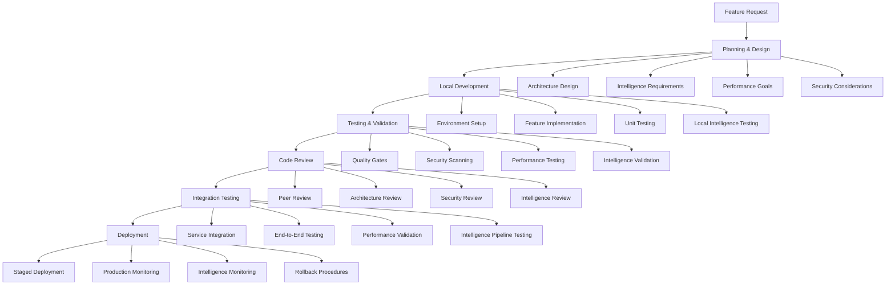

# Development Workflow Documentation

## Overview

This document defines the comprehensive development workflow for the OmniNode Bridge ecosystem. It provides guidelines, processes, and best practices for efficient and quality-driven development that maintains intelligence standards and operational excellence.

## Development Architecture

### Workflow Overview



## Development Environment Setup

### Prerequisites

```bash
# System Requirements
python >= 3.11
docker >= 20.10
docker-compose >= 2.0
git >= 2.30
node >= 18.0 (for some tooling)

# Required Tools
poetry >= 1.4.0
pytest >= 7.0
black >= 22.0
ruff >= 0.0.254
mypy >= 1.0
pre-commit >= 3.0
```

### Local Environment Setup

```python
#!/usr/bin/env python3
"""
Development environment setup script for OmniNode Bridge
"""

import subprocess
import sys
import os
from pathlib import Path
from typing import List, Dict, Any

class DevelopmentEnvironment:
    """Manages local development environment setup and configuration"""

    def __init__(self, project_root: str):
        self.project_root = Path(project_root)
        self.config = self._load_development_config()

    def setup_complete_environment(self) -> bool:
        """Setup complete development environment"""

        print("🚀 Setting up OmniNode Bridge Development Environment")

        setup_steps = [
            ("Validating system prerequisites", self._validate_prerequisites),
            ("Setting up Python environment", self._setup_python_environment),
            ("Installing dependencies", self._install_dependencies),
            ("Configuring development tools", self._configure_development_tools),
            ("Setting up Docker environment", self._setup_docker_environment),
            ("Initializing databases", self._initialize_databases),
            ("Setting up intelligence services", self._setup_intelligence_services),
            ("Configuring pre-commit hooks", self._setup_pre_commit_hooks),
            ("Running environment validation", self._validate_environment)
        ]

        for step_name, step_function in setup_steps:
            print(f"📋 {step_name}...")
            try:
                success = step_function()
                if not success:
                    print(f"❌ Failed: {step_name}")
                    return False
                print(f"✅ Completed: {step_name}")
            except Exception as e:
                print(f"❌ Error in {step_name}: {e}")
                return False

        print("🎉 Development environment setup completed successfully!")
        self._print_environment_summary()
        return True

    def _validate_prerequisites(self) -> bool:
        """Validate system prerequisites"""

        required_tools = {
            'python': '3.11',
            'docker': '20.10',
            'docker-compose': '2.0',
            'git': '2.30',
            'poetry': '1.4.0'
        }

        for tool, min_version in required_tools.items():
            if not self._check_tool_version(tool, min_version):
                print(f"❌ {tool} version {min_version}+ required")
                return False

        return True

    def _setup_python_environment(self) -> bool:
        """Setup Python virtual environment with Poetry"""

        try:
            # Initialize Poetry project if not exists
            if not (self.project_root / 'pyproject.toml').exists():
                subprocess.run(['poetry', 'init'], cwd=self.project_root, check=True)

            # Install Python dependencies
            subprocess.run(['poetry', 'install'], cwd=self.project_root, check=True)

            # Install development dependencies
            subprocess.run(['poetry', 'install', '--with', 'dev'], cwd=self.project_root, check=True)

            return True

        except subprocess.CalledProcessError as e:
            print(f"Poetry setup failed: {e}")
            return False

    def _setup_docker_environment(self) -> bool:
        """Setup Docker development environment"""

        try:
            # Create development Docker network
            subprocess.run([
                'docker', 'network', 'create', 'omninode-bridge-dev'
            ], capture_output=True)  # Ignore if already exists

            # Pull required base images
            base_images = [
                'python:3.11-slim',
                'postgres:15',
                'redis:7-alpine',
                'confluentinc/cp-kafka:latest',
                'confluentinc/cp-zookeeper:latest'
            ]

            for image in base_images:
                print(f"  📦 Pulling {image}")
                subprocess.run(['docker', 'pull', image], check=True, capture_output=True)

            # Build development images
            subprocess.run([
                'docker-compose', '-f', 'docker-compose.dev.yml', 'build'
            ], cwd=self.project_root, check=True)

            return True

        except subprocess.CalledProcessError as e:
            print(f"Docker setup failed: {e}")
            return False

    def _setup_intelligence_services(self) -> bool:
        """Setup intelligence and monitoring services"""

        try:
            # Start intelligence infrastructure
            subprocess.run([
                'docker-compose', '-f', 'docker-compose.dev.yml', 'up', '-d',
                'postgres', 'redis', 'kafka', 'zookeeper'
            ], cwd=self.project_root, check=True)

            # Wait for services to be ready
            self._wait_for_service('postgres', 'localhost', 5432, timeout=60)
            self._wait_for_service('redis', 'localhost', 6379, timeout=60)
            self._wait_for_service('kafka', 'localhost', 9092, timeout=120)

            # Initialize intelligence database schema
            subprocess.run([
                'poetry', 'run', 'python', '-m', 'omninode_bridge.intelligence.schema_manager',
                '--action', 'create'
            ], cwd=self.project_root, check=True)

            # Initialize intelligence patterns
            subprocess.run([
                'poetry', 'run', 'python', '-m', 'omninode_bridge.intelligence.pattern_initializer',
                '--load-base-patterns'
            ], cwd=self.project_root, check=True)

            return True

        except subprocess.CalledProcessError as e:
            print(f"Intelligence services setup failed: {e}")
            return False

    def _setup_pre_commit_hooks(self) -> bool:
        """Setup pre-commit hooks for code quality"""

        try:
            # Install pre-commit hooks
            subprocess.run(['poetry', 'run', 'pre-commit', 'install'],
                         cwd=self.project_root, check=True)

            # Run initial pre-commit check
            subprocess.run(['poetry', 'run', 'pre-commit', 'run', '--all-files'],
                         cwd=self.project_root, check=True)

            return True

        except subprocess.CalledProcessError as e:
            print(f"Pre-commit setup failed: {e}")
            return False

    def _validate_environment(self) -> bool:
        """Validate complete development environment"""

        validation_tests = [
            ("Python environment", self._test_python_environment),
            ("Docker services", self._test_docker_services),
            ("Intelligence services", self._test_intelligence_services),
            ("Database connectivity", self._test_database_connectivity),
            ("Code quality tools", self._test_code_quality_tools)
        ]

        all_passed = True

        for test_name, test_function in validation_tests:
            try:
                if test_function():
                    print(f"  ✅ {test_name}")
                else:
                    print(f"  ❌ {test_name}")
                    all_passed = False
            except Exception as e:
                print(f"  ❌ {test_name}: {e}")
                all_passed = False

        return all_passed

    def _wait_for_service(self, service_name: str, host: str, port: int, timeout: int = 60):
        """Wait for service to become available"""
        import socket
        import time

        start_time = time.time()
        while time.time() - start_time < timeout:
            try:
                sock = socket.socket(socket.AF_INET, socket.SOCK_STREAM)
                sock.settimeout(1)
                result = sock.connect_ex((host, port))
                sock.close()
                if result == 0:
                    return True
            except:
                pass
            time.sleep(2)

        raise TimeoutError(f"Service {service_name} not available after {timeout}s")

    def _print_environment_summary(self):
        """Print development environment summary"""

        print("\n🎯 Development Environment Summary")
        print("=" * 50)
        print(f"📁 Project Root: {self.project_root}")
        print(f"🐍 Python: {sys.version}")
        print(f"📦 Poetry: {self._get_tool_version('poetry')}")
        print(f"🐳 Docker: {self._get_tool_version('docker')}")
        print("\n📋 Available Commands:")
        print("  poetry run pytest                    # Run tests")
        print("  poetry run black .                   # Format code")
        print("  poetry run ruff check                # Lint code")
        print("  poetry run mypy                      # Type checking")
        print("  docker-compose -f docker-compose.dev.yml up  # Start services")
        print("  poetry run python -m omninode_bridge.cli     # CLI tool")
        print("\n🚀 Ready for development!")
```

## Feature Development Process

### Planning Phase

```python
class FeaturePlanner:
    """Feature planning and design coordination"""

    def __init__(self, feature_request: Dict[str, Any]):
        self.feature_request = feature_request
        self.intelligence_requirements = []
        self.performance_requirements = []
        self.security_requirements = []

    def create_feature_plan(self) -> Dict[str, Any]:
        """Create comprehensive feature development plan"""

        plan = {
            'feature_overview': self._analyze_feature_requirements(),
            'architecture_design': self._design_architecture(),
            'intelligence_integration': self._plan_intelligence_integration(),
            'performance_targets': self._define_performance_targets(),
            'security_considerations': self._identify_security_requirements(),
            'testing_strategy': self._plan_testing_strategy(),
            'implementation_phases': self._break_down_implementation(),
            'risk_assessment': self._assess_risks(),
            'timeline_estimation': self._estimate_timeline()
        }

        return plan

    def _analyze_feature_requirements(self) -> Dict[str, Any]:
        """Analyze and clarify feature requirements"""

        requirements = {
            'functional_requirements': [],
            'non_functional_requirements': [],
            'intelligence_requirements': [],
            'integration_requirements': [],
            'user_stories': []
        }

        # Extract functional requirements
        description = self.feature_request.get('description', '')
        requirements['functional_requirements'] = self._extract_functional_requirements(description)

        # Define intelligence requirements
        if self._requires_intelligence_integration():
            requirements['intelligence_requirements'] = [
                'Pattern discovery and analysis',
                'Event correlation and learning',
                'Adaptive behavior based on usage patterns',
                'Performance optimization through intelligence'
            ]

        # Define integration requirements
        requirements['integration_requirements'] = [
            'HookReceiver integration for event capture',
            'ToolCapture Proxy for adaptive caching',
            'Service Registry for discovery',
            'Intelligence pipeline integration'
        ]

        return requirements

    def _design_architecture(self) -> Dict[str, Any]:
        """Design feature architecture"""

        architecture = {
            'service_components': self._identify_service_components(),
            'data_flow': self._design_data_flow(),
            'intelligence_integration': self._design_intelligence_integration(),
            'external_dependencies': self._identify_external_dependencies(),
            'api_design': self._design_api_interfaces()
        }

        return architecture

    def _plan_intelligence_integration(self) -> Dict[str, Any]:
        """Plan intelligence system integration"""

        intelligence_plan = {
            'pattern_types': [
                'Usage patterns for adaptive caching',
                'Performance patterns for optimization',
                'Error patterns for proactive handling',
                'Integration patterns for service coordination'
            ],
            'learning_objectives': [
                'Optimize caching strategies based on usage',
                'Predict and prevent common errors',
                'Adapt service behavior to load patterns',
                'Improve response times through intelligence'
            ],
            'event_generation': [
                'Service lifecycle events',
                'Tool execution events',
                'Performance metric events',
                'Error and recovery events'
            ],
            'intelligence_metrics': [
                'Pattern discovery accuracy',
                'Prediction effectiveness',
                'Adaptation speed',
                'Learning convergence rate'
            ]
        }

        return intelligence_plan

    def _plan_testing_strategy(self) -> Dict[str, Any]:
        """Plan comprehensive testing strategy"""

        testing_strategy = {
            'unit_testing': {
                'coverage_target': 90,
                'test_types': ['functionality', 'edge_cases', 'error_handling'],
                'intelligence_testing': ['pattern_recognition', 'learning_algorithms']
            },
            'integration_testing': {
                'service_integration': 'Test with all bridge services',
                'intelligence_integration': 'Test pattern discovery and learning',
                'external_integration': 'Test with external services'
            },
            'performance_testing': {
                'load_testing': 'Sustained load scenarios',
                'stress_testing': 'Breaking point identification',
                'intelligence_performance': 'Pattern discovery and processing speed'
            },
            'security_testing': {
                'vulnerability_scanning': 'Automated security scans',
                'penetration_testing': 'Manual security assessment',
                'intelligence_security': 'Data privacy and pattern security'
            }
        }

        return testing_strategy
```

### Implementation Phase

#### Code Quality Standards

```python
# .pre-commit-config.yaml
repos:
  - repo: https://github.com/pre-commit/pre-commit-hooks
    rev: v4.4.0
    hooks:
      - id: trailing-whitespace
      - id: end-of-file-fixer
      - id: check-yaml
      - id: check-added-large-files
      - id: check-merge-conflict
      - id: debug-statements

  - repo: https://github.com/psf/black
    rev: 23.1.0
    hooks:
      - id: black
        language_version: python3.11

  - repo: https://github.com/charliermarsh/ruff-pre-commit
    rev: v0.0.254
    hooks:
      - id: ruff
        args: [--fix, --exit-non-zero-on-fix]

  - repo: https://github.com/pre-commit/mirrors-mypy
    rev: v1.0.1
    hooks:
      - id: mypy
        additional_dependencies: [types-all]

  - repo: local
    hooks:
      - id: intelligence-validation
        name: Intelligence System Validation
        entry: poetry run python -m omninode_bridge.testing.intelligence_validator
        language: system
        files: ^omninode_bridge/intelligence/

      - id: performance-validation
        name: Performance Validation
        entry: poetry run python -m omninode_bridge.testing.performance_validator
        language: system
        files: ^omninode_bridge/(hooks|proxy|registry)/

      - id: security-scan
        name: Security Scan
        entry: poetry run bandit -r omninode_bridge/
        language: system
        files: \.py$
```

#### Development Guidelines

```python
class DevelopmentGuidelines:
    """Comprehensive development guidelines for OmniNode Bridge"""

    CODING_STANDARDS = {
        'naming_conventions': {
            'classes': 'PascalCase (e.g., HookReceiver)',
            'functions': 'snake_case (e.g., process_hook_event)',
            'variables': 'snake_case (e.g., service_name)',
            'constants': 'UPPER_SNAKE_CASE (e.g., MAX_RETRY_ATTEMPTS)',
            'files': 'snake_case (e.g., hook_receiver.py)',
            'modules': 'snake_case with descriptive names'
        },
        'documentation': {
            'docstring_style': 'Google style docstrings',
            'type_hints': 'Required for all public functions',
            'inline_comments': 'Explain complex logic and intelligence decisions',
            'architecture_docs': 'Update when adding new patterns or services'
        },
        'error_handling': {
            'exceptions': 'Use specific exception types',
            'logging': 'Structured logging with context',
            'recovery': 'Implement graceful degradation',
            'intelligence_errors': 'Log pattern discovery failures for learning'
        }
    }

    INTELLIGENCE_PATTERNS = {
        'event_generation': {
            'service_lifecycle': 'Generate events for service start/stop/health',
            'tool_execution': 'Generate events for tool calls and results',
            'performance_events': 'Generate events for performance metrics',
            'error_events': 'Generate events for errors and recovery'
        },
        'pattern_discovery': {
            'usage_patterns': 'Identify tool and service usage patterns',
            'performance_patterns': 'Identify performance optimization opportunities',
            'error_patterns': 'Identify common error scenarios and solutions',
            'integration_patterns': 'Identify effective service integration patterns'
        },
        'adaptive_behavior': {
            'caching_strategies': 'Adapt caching based on usage patterns',
            'load_balancing': 'Adapt routing based on performance patterns',
            'error_prevention': 'Proactively prevent known error patterns',
            'resource_optimization': 'Optimize resource usage based on patterns'
        }
    }

    @staticmethod
    def validate_implementation(code_path: str) -> Dict[str, Any]:
        """Validate implementation against guidelines"""

        validation_results = {
            'code_quality': DevelopmentGuidelines._validate_code_quality(code_path),
            'intelligence_integration': DevelopmentGuidelines._validate_intelligence_integration(code_path),
            'performance_compliance': DevelopmentGuidelines._validate_performance_compliance(code_path),
            'security_compliance': DevelopmentGuidelines._validate_security_compliance(code_path)
        }

        return validation_results

    @staticmethod
    def _validate_intelligence_integration(code_path: str) -> Dict[str, Any]:
        """Validate proper intelligence integration"""

        # Check for event generation
        has_event_generation = DevelopmentGuidelines._check_event_generation(code_path)

        # Check for pattern integration
        has_pattern_integration = DevelopmentGuidelines._check_pattern_integration(code_path)

        # Check for adaptive behavior
        has_adaptive_behavior = DevelopmentGuidelines._check_adaptive_behavior(code_path)

        return {
            'event_generation': has_event_generation,
            'pattern_integration': has_pattern_integration,
            'adaptive_behavior': has_adaptive_behavior,
            'overall_score': (has_event_generation + has_pattern_integration + has_adaptive_behavior) / 3
        }
```

## Local Development Commands

### Essential Development Commands

```bash
#!/bin/bash
# Development command reference for OmniNode Bridge

# Environment Management
alias bridge-setup="poetry run python scripts/setup_dev_environment.py"
alias bridge-start="docker-compose -f docker-compose.dev.yml up -d"
alias bridge-stop="docker-compose -f docker-compose.dev.yml down"
alias bridge-restart="bridge-stop && bridge-start"
alias bridge-logs="docker-compose -f docker-compose.dev.yml logs -f"

# Code Quality
alias bridge-format="poetry run black . && poetry run ruff check --fix ."
alias bridge-lint="poetry run ruff check ."
alias bridge-type="poetry run mypy omninode_bridge/"
alias bridge-security="poetry run bandit -r omninode_bridge/"
alias bridge-quality="bridge-format && bridge-lint && bridge-type && bridge-security"

# Testing
alias bridge-test="poetry run pytest"
alias bridge-test-unit="poetry run pytest tests/unit/"
alias bridge-test-integration="poetry run pytest tests/integration/"
alias bridge-test-performance="poetry run pytest tests/performance/"
alias bridge-test-intelligence="poetry run pytest tests/intelligence/"
alias bridge-test-coverage="poetry run pytest --cov=omninode_bridge --cov-report=html"
alias bridge-test-all="bridge-test-unit && bridge-test-integration && bridge-test-performance"

# Intelligence System
alias bridge-patterns="poetry run python -m omninode_bridge.intelligence.pattern_viewer"
alias bridge-intelligence-status="poetry run python -m omninode_bridge.intelligence.status_checker"
alias bridge-intelligence-reset="poetry run python -m omninode_bridge.intelligence.pattern_manager --reset"
alias bridge-intelligence-export="poetry run python -m omninode_bridge.intelligence.exporter"

# Service Management
alias bridge-hook-receiver="poetry run python -m omninode_bridge.services.hook_receiver"
alias bridge-tool-proxy="poetry run python -m omninode_bridge.services.tool_proxy"
alias bridge-service-registry="poetry run python -m omninode_bridge.services.service_registry"
alias bridge-intelligence-engine="poetry run python -m omninode_bridge.intelligence.engine"

# Database Management
alias bridge-db-migrate="poetry run alembic upgrade head"
alias bridge-db-reset="poetry run python -m omninode_bridge.database.reset_db"
alias bridge-db-seed="poetry run python -m omninode_bridge.database.seed_data"
alias bridge-db-backup="poetry run python -m omninode_bridge.database.backup"

# Monitoring and Debugging
alias bridge-health="curl -s localhost:8001/health && curl -s localhost:8002/health && curl -s localhost:8003/health"
alias bridge-metrics="curl -s localhost:8001/metrics"
alias bridge-debug="poetry run python -m omninode_bridge.debugging.interactive_debugger"
alias bridge-trace="poetry run python -m omninode_bridge.debugging.request_tracer"

# Development Utilities
function bridge-new-service() {
    poetry run python -m omninode_bridge.cli.service_generator --name "$1" --type "$2"
}

function bridge-new-test() {
    poetry run python -m omninode_bridge.cli.test_generator --service "$1" --type "$2"
}

function bridge-analyze-patterns() {
    poetry run python -m omninode_bridge.intelligence.pattern_analyzer --timeframe "$1"
}

function bridge-performance-profile() {
    poetry run python -m omninode_bridge.profiling.performance_profiler --service "$1" --duration "$2"
}

# Git Workflow
function bridge-feature() {
    git checkout -b "feature/$1"
    echo "Created feature branch: feature/$1"
}

function bridge-hotfix() {
    git checkout -b "hotfix/$1"
    echo "Created hotfix branch: hotfix/$1"
}

function bridge-pr-ready() {
    echo "🔍 Running pre-PR checks..."
    bridge-quality && bridge-test-all && echo "✅ Ready for PR!"
}
```

### Development Workflow Scripts

```python
#!/usr/bin/env python3
"""
Development workflow automation scripts
"""

import click
import subprocess
import json
from pathlib import Path
from typing import Dict, List, Any

@click.group()
def cli():
    """OmniNode Bridge Development CLI"""
    pass

@cli.command()
@click.option('--service', required=True, help='Service name to create')
@click.option('--type', default='microservice', help='Service type')
def new_service(service: str, type: str):
    """Create a new service with intelligence integration"""

    print(f"🚀 Creating new {type} service: {service}")

    # Create service directory structure
    service_path = Path(f"omninode_bridge/services/{service}")
    service_path.mkdir(parents=True, exist_ok=True)

    # Generate service files
    templates = {
        'main.py': generate_service_main_template(service),
        'api.py': generate_service_api_template(service),
        'intelligence.py': generate_intelligence_integration_template(service),
        'config.py': generate_service_config_template(service),
        '__init__.py': ''
    }

    for filename, content in templates.items():
        (service_path / filename).write_text(content)

    # Generate tests
    test_path = Path(f"tests/unit/services/{service}")
    test_path.mkdir(parents=True, exist_ok=True)

    test_templates = {
        'test_main.py': generate_service_test_template(service),
        'test_api.py': generate_api_test_template(service),
        'test_intelligence.py': generate_intelligence_test_template(service),
        '__init__.py': ''
    }

    for filename, content in test_templates.items():
        (test_path / filename).write_text(content)

    print(f"✅ Service {service} created successfully!")
    print(f"📁 Service files: {service_path}")
    print(f"🧪 Test files: {test_path}")
    print(f"📋 Next steps:")
    print(f"  1. Implement service logic in {service_path}/main.py")
    print(f"  2. Define API endpoints in {service_path}/api.py")
    print(f"  3. Configure intelligence integration in {service_path}/intelligence.py")
    print(f"  4. Run tests: bridge-test-unit tests/unit/services/{service}/")

@cli.command()
@click.option('--pattern-type', required=True, help='Pattern type to analyze')
@click.option('--timeframe', default='24h', help='Analysis timeframe')
def analyze_patterns(pattern_type: str, timeframe: str):
    """Analyze intelligence patterns"""

    print(f"🧠 Analyzing {pattern_type} patterns for {timeframe}")

    # Run pattern analysis
    result = subprocess.run([
        'poetry', 'run', 'python', '-m',
        'omninode_bridge.intelligence.pattern_analyzer',
        '--pattern-type', pattern_type,
        '--timeframe', timeframe,
        '--output', 'json'
    ], capture_output=True, text=True)

    if result.returncode == 0:
        patterns = json.loads(result.stdout)

        print(f"📊 Found {len(patterns.get('patterns', []))} patterns:")
        for pattern in patterns.get('patterns', [])[:5]:  # Show top 5
            print(f"  • {pattern.get('name', 'Unknown')}: {pattern.get('frequency', 0)} occurrences")
            print(f"    Confidence: {pattern.get('confidence', 0):.2f}")
            print(f"    Impact: {pattern.get('impact', 'Unknown')}")

        if patterns.get('recommendations'):
            print(f"\n💡 Recommendations:")
            for rec in patterns['recommendations'][:3]:  # Show top 3
                print(f"  • {rec}")
    else:
        print(f"❌ Pattern analysis failed: {result.stderr}")

@cli.command()
@click.option('--component', required=True, help='Component to profile')
@click.option('--duration', default=60, help='Profiling duration in seconds')
def performance_profile(component: str, duration: int):
    """Profile component performance"""

    print(f"📈 Profiling {component} for {duration} seconds")

    # Start profiling
    result = subprocess.run([
        'poetry', 'run', 'python', '-m',
        'omninode_bridge.profiling.performance_profiler',
        '--component', component,
        '--duration', str(duration),
        '--output-format', 'json'
    ], capture_output=True, text=True)

    if result.returncode == 0:
        profile_data = json.loads(result.stdout)

        print(f"📊 Performance Profile Results:")
        print(f"  ⏱️  Average Response Time: {profile_data.get('avg_response_time', 0):.2f}ms")
        print(f"  🚀 Throughput: {profile_data.get('throughput', 0):.1f} req/sec")
        print(f"  💾 Memory Usage: {profile_data.get('memory_usage', 0):.1f}MB")
        print(f"  🔥 CPU Usage: {profile_data.get('cpu_usage', 0):.1f}%")

        bottlenecks = profile_data.get('bottlenecks', [])
        if bottlenecks:
            print(f"\n🎯 Identified Bottlenecks:")
            for bottleneck in bottlenecks[:3]:
                print(f"  • {bottleneck.get('function', 'Unknown')}: {bottleneck.get('time_percent', 0):.1f}% of execution time")
    else:
        print(f"❌ Profiling failed: {result.stderr}")

def generate_service_main_template(service_name: str) -> str:
    """Generate main service template with intelligence integration"""

    return f'''"""
{service_name.title()} Service - OmniNode Bridge
Intelligence-driven service implementation
"""

import asyncio
import logging
from typing import Dict, Any, Optional
from fastapi import FastAPI, HTTPException
from omninode_bridge.core.base_service import BaseService
from omninode_bridge.intelligence.event_generator import EventGenerator
from omninode_bridge.intelligence.pattern_matcher import PatternMatcher
from .intelligence import {service_name.title()}IntelligenceIntegration
from .api import create_api_router

logger = logging.getLogger(__name__)

class {service_name.title()}Service(BaseService):
    """Intelligence-driven {service_name} service"""

    def __init__(self, config: Dict[str, Any]):
        super().__init__(config)
        self.service_name = "{service_name}"
        self.event_generator = EventGenerator(self.service_name)
        self.pattern_matcher = PatternMatcher()
        self.intelligence = {service_name.title()}IntelligenceIntegration(config)

    async def initialize(self) -> bool:
        """Initialize service with intelligence integration"""

        try:
            # Initialize base service
            await super().initialize()

            # Initialize intelligence integration
            await self.intelligence.initialize()

            # Generate service startup event
            await self.event_generator.generate_service_event(
                event_type="service_startup",
                metadata={{
                    "service": self.service_name,
                    "version": self.config.get("version", "unknown"),
                    "environment": self.config.get("environment", "development")
                }}
            )

            logger.info(f"{service_name.title()} service initialized successfully")
            return True

        except Exception as e:
            logger.error(f"Failed to initialize {service_name} service: {{e}}")
            return False

    async def process_request(self, request_data: Dict[str, Any]) -> Dict[str, Any]:
        """Process request with intelligence integration"""

        request_id = request_data.get("id", "unknown")

        try:
            # Generate request start event
            await self.event_generator.generate_request_event(
                event_type="request_start",
                request_id=request_id,
                metadata=request_data
            )

            # Check for known patterns
            patterns = await self.pattern_matcher.find_matching_patterns(
                service=self.service_name,
                request_type=request_data.get("type", "unknown"),
                context=request_data
            )

            # Apply intelligence-driven optimizations
            optimized_processing = await self.intelligence.optimize_processing(
                request_data, patterns
            )

            # Process the request
            result = await self._execute_core_logic(request_data, optimized_processing)

            # Generate request completion event
            await self.event_generator.generate_request_event(
                event_type="request_completed",
                request_id=request_id,
                metadata={{
                    "success": True,
                    "processing_time": optimized_processing.get("processing_time", 0),
                    "patterns_applied": len(patterns)
                }}
            )

            return result

        except Exception as e:
            # Generate error event
            await self.event_generator.generate_error_event(
                error_type="request_processing_error",
                error_message=str(e),
                context={{
                    "request_id": request_id,
                    "service": self.service_name
                }}
            )

            logger.error(f"Request processing failed: {{e}}")
            raise HTTPException(status_code=500, detail=str(e))

    async def _execute_core_logic(self, request_data: Dict[str, Any],
                                optimized_processing: Dict[str, Any]) -> Dict[str, Any]:
        """Execute core service logic"""

        # TODO: Implement core service logic
        # This is where the main service functionality should be implemented

        return {{
            "status": "success",
            "message": f"{service_name.title()} service processed request successfully",
            "data": request_data,
            "optimizations": optimized_processing
        }}

    async def shutdown(self):
        """Shutdown service with cleanup"""

        try:
            # Generate shutdown event
            await self.event_generator.generate_service_event(
                event_type="service_shutdown",
                metadata={{"service": self.service_name}}
            )

            # Cleanup intelligence integration
            await self.intelligence.cleanup()

            # Shutdown base service
            await super().shutdown()

            logger.info(f"{service_name.title()} service shutdown completed")

        except Exception as e:
            logger.error(f"Error during service shutdown: {{e}}")

def create_app() -> FastAPI:
    """Create FastAPI application"""

    app = FastAPI(
        title="{service_name.title()} Service",
        description="Intelligence-driven {service_name} service for OmniNode Bridge",
        version="1.0.0"
    )

    # Include API router
    app.include_router(create_api_router(), prefix="/api/v1")

    return app

if __name__ == "__main__":
    import uvicorn

    app = create_app()
    uvicorn.run(app, host="0.0.0.0", port=8000)
'''

if __name__ == "__main__":
    cli()
```

This comprehensive development workflow documentation provides the foundation for efficient, quality-driven development of the OmniNode Bridge ecosystem with full intelligence integration.
