# Maintenance Workflow Documentation

## Overview

This document defines comprehensive maintenance workflows for the OmniNode Bridge ecosystem. It covers preventive maintenance, system optimization, intelligence system upkeep, security maintenance, and operational procedures to ensure long-term system health and performance.

## Maintenance Architecture

### Maintenance Framework Overview

```mermaid
graph TD
    A[Maintenance Planning] --> B[Preventive Maintenance]
    A --> C[Corrective Maintenance]
    A --> D[Adaptive Maintenance]
    A --> E[Perfective Maintenance]

    B --> B1[Scheduled Health Checks]
    B --> B2[Intelligence Model Updates]
    B --> B3[Security Updates]
    B --> B4[Performance Optimization]

    C --> C1[Issue Resolution]
    C --> C2[Bug Fixes]
    C --> C3[Emergency Patches]
    C --> C4[Recovery Procedures]

    D --> D1[Technology Updates]
    D --> D2[Environment Changes]
    D --> D3[Requirement Changes]
    D --> D4[Intelligence Evolution]

    E --> E1[Feature Enhancement]
    E --> E2[Performance Improvement]
    E --> E3[Intelligence Refinement]
    E --> E4[User Experience]

    F[Maintenance Monitoring] --> F1[Health Metrics]
    F --> F2[Performance Metrics]
    F --> F3[Intelligence Metrics]
    F --> F4[Security Metrics]

    G[Intelligence Maintenance] --> G1[Model Retraining]
    G --> G2[Pattern Validation]
    G --> G3[Learning Optimization]
    G --> G4[Data Quality Assurance]
```



## Preventive Maintenance Framework

### Automated Maintenance System

```python
#!/usr/bin/env python3
"""
Comprehensive maintenance automation system for OmniNode Bridge
"""

import asyncio
import logging
import json
import schedule
import time
from typing import Dict, List, Any, Optional
from dataclasses import dataclass, field
from datetime import datetime, timedelta
from enum import Enum

class MaintenanceType(Enum):
    PREVENTIVE = "preventive"
    CORRECTIVE = "corrective"
    ADAPTIVE = "adaptive"
    PERFECTIVE = "perfective"
    EMERGENCY = "emergency"

class MaintenancePriority(Enum):
    CRITICAL = "critical"
    HIGH = "high"
    MEDIUM = "medium"
    LOW = "low"

@dataclass
class MaintenanceTask:
    task_id: str
    name: str
    description: str
    maintenance_type: MaintenanceType
    priority: MaintenancePriority
    schedule: str  # Cron-like schedule
    estimated_duration: int  # Minutes
    affected_components: List[str] = field(default_factory=list)
    prerequisites: List[str] = field(default_factory=list)
    automation_script: Optional[str] = None
    rollback_procedure: Optional[str] = None
    success_criteria: List[str] = field(default_factory=list)

@dataclass
class MaintenanceExecution:
    task_id: str
    execution_id: str
    start_time: datetime
    end_time: Optional[datetime] = None
    status: str = "running"
    logs: List[str] = field(default_factory=list)
    metrics: Dict[str, Any] = field(default_factory=dict)
    success: bool = False

class ComprehensiveMaintenanceSystem:
    """Automated maintenance system for OmniNode Bridge"""

    def __init__(self, config: Dict[str, Any]):
        self.config = config
        self.logger = logging.getLogger(__name__)
        self.maintenance_tasks = self._load_maintenance_tasks()
        self.execution_history: List[MaintenanceExecution] = []
        self.metrics_collector = self._create_metrics_collector()
        self.alert_manager = self._create_alert_manager()

    def _load_maintenance_tasks(self) -> List[MaintenanceTask]:
        """Load predefined maintenance tasks"""

        return [
            # Daily Health Checks
            MaintenanceTask(
                task_id="daily_health_check",
                name="Daily System Health Check",
                description="Comprehensive daily health assessment of all components",
                maintenance_type=MaintenanceType.PREVENTIVE,
                priority=MaintenancePriority.HIGH,
                schedule="0 6 * * *",  # 6 AM daily
                estimated_duration=30,
                affected_components=["all"],
                automation_script="scripts/daily_health_check.py",
                success_criteria=[
                    "All services responding",
                    "Performance within thresholds",
                    "Intelligence system operational",
                    "No critical alerts"
                ]
            ),

            # Weekly Intelligence Model Updates
            MaintenanceTask(
                task_id="weekly_intelligence_update",
                name="Weekly Intelligence Model Update",
                description="Update and retrain intelligence models with recent data",
                maintenance_type=MaintenanceType.PREVENTIVE,
                priority=MaintenancePriority.MEDIUM,
                schedule="0 2 * * 1",  # 2 AM on Mondays
                estimated_duration=120,
                affected_components=["intelligence_engine"],
                automation_script="scripts/intelligence_model_update.py",
                rollback_procedure="scripts/rollback_intelligence_models.py",
                success_criteria=[
                    "Model training completed successfully",
                    "Prediction accuracy maintained or improved",
                    "No degradation in response times",
                    "Intelligence health score > 8.0"
                ]
            ),

            # Monthly Security Updates
            MaintenanceTask(
                task_id="monthly_security_update",
                name="Monthly Security Updates",
                description="Apply security patches and vulnerability fixes",
                maintenance_type=MaintenanceType.PREVENTIVE,
                priority=MaintenancePriority.CRITICAL,
                schedule="0 1 1 * *",  # 1 AM on the 1st of each month
                estimated_duration=180,
                affected_components=["all"],
                prerequisites=["backup_system_state"],
                automation_script="scripts/security_updates.py",
                rollback_procedure="scripts/rollback_security_updates.py",
                success_criteria=[
                    "All security patches applied",
                    "No new vulnerabilities introduced",
                    "All services functional after updates",
                    "Security scan shows improved posture"
                ]
            ),

            # Weekly Performance Optimization
            MaintenanceTask(
                task_id="weekly_performance_optimization",
                name="Weekly Performance Optimization",
                description="Analyze and optimize system performance",
                maintenance_type=MaintenanceType.PERFECTIVE,
                priority=MaintenancePriority.MEDIUM,
                schedule="0 3 * * 0",  # 3 AM on Sundays
                estimated_duration=90,
                affected_components=["all"],
                automation_script="scripts/performance_optimization.py",
                success_criteria=[
                    "Performance metrics analyzed",
                    "Optimization recommendations generated",
                    "Applicable optimizations implemented",
                    "Performance improved or maintained"
                ]
            ),

            # Daily Intelligence Data Quality Check
            MaintenanceTask(
                task_id="daily_intelligence_data_quality",
                name="Daily Intelligence Data Quality Check",
                description="Validate and clean intelligence training data",
                maintenance_type=MaintenanceType.PREVENTIVE,
                priority=MaintenancePriority.MEDIUM,
                schedule="0 4 * * *",  # 4 AM daily
                estimated_duration=45,
                affected_components=["intelligence_engine", "database"],
                automation_script="scripts/intelligence_data_quality.py",
                success_criteria=[
                    "Data quality score > 95%",
                    "No data corruption detected",
                    "Training data consistency verified",
                    "Outliers identified and handled"
                ]
            ),

            # Weekly Database Maintenance
            MaintenanceTask(
                task_id="weekly_database_maintenance",
                name="Weekly Database Maintenance",
                description="Database optimization, cleanup, and health checks",
                maintenance_type=MaintenanceType.PREVENTIVE,
                priority=MaintenancePriority.HIGH,
                schedule="0 1 * * 6",  # 1 AM on Saturdays
                estimated_duration=120,
                affected_components=["database"],
                prerequisites=["backup_database"],
                automation_script="scripts/database_maintenance.py",
                success_criteria=[
                    "Database vacuum completed",
                    "Index optimization completed",
                    "Query performance improved",
                    "Storage usage optimized"
                ]
            )
        ]

    async def start_maintenance_scheduler(self):
        """Start the automated maintenance scheduler"""

        print("🔧 Starting OmniNode Bridge Maintenance Scheduler")
        print("================================================")

        # Schedule all maintenance tasks
        for task in self.maintenance_tasks:
            self._schedule_task(task)
            print(f"📅 Scheduled: {task.name} ({task.schedule})")

        print(f"✅ {len(self.maintenance_tasks)} maintenance tasks scheduled")

        # Start scheduler loop
        while True:
            schedule.run_pending()
            await asyncio.sleep(60)  # Check every minute

    def _schedule_task(self, task: MaintenanceTask):
        """Schedule a maintenance task"""

        def task_wrapper():
            asyncio.create_task(self.execute_maintenance_task(task))

        # Parse schedule and create job
        if task.schedule == "0 6 * * *":  # Daily at 6 AM
            schedule.every().day.at("06:00").do(task_wrapper)
        elif task.schedule == "0 2 * * 1":  # Weekly on Monday at 2 AM
            schedule.every().monday.at("02:00").do(task_wrapper)
        elif task.schedule == "0 1 1 * *":  # Monthly on 1st at 1 AM
            schedule.every().month.do(task_wrapper)
        # Add more schedule patterns as needed

    async def execute_maintenance_task(self, task: MaintenanceTask) -> MaintenanceExecution:
        """Execute a maintenance task"""

        execution_id = f"{task.task_id}_{int(time.time())}"
        execution = MaintenanceExecution(
            task_id=task.task_id,
            execution_id=execution_id,
            start_time=datetime.utcnow()
        )

        print(f"🔧 Starting maintenance: {task.name}")

        try:
            # Check prerequisites
            if task.prerequisites:
                prerequisite_check = await self._check_prerequisites(task.prerequisites)
                if not prerequisite_check:
                    execution.status = "failed"
                    execution.logs.append("Prerequisites not met")
                    return execution

            # Execute maintenance downtime window if needed
            if task.priority == MaintenancePriority.CRITICAL:
                await self._enter_maintenance_mode()

            # Run automation script or manual procedure
            if task.automation_script:
                result = await self._run_automation_script(task.automation_script)
                execution.logs.extend(result.get('logs', []))
                execution.metrics.update(result.get('metrics', {}))
            else:
                result = await self._execute_manual_procedure(task)

            # Validate success criteria
            success = await self._validate_success_criteria(task.success_criteria)

            execution.success = success
            execution.status = "completed" if success else "failed"

            # Exit maintenance mode
            if task.priority == MaintenancePriority.CRITICAL:
                await self._exit_maintenance_mode()

            # Generate maintenance report
            await self._generate_maintenance_report(task, execution)

            print(f"✅ Maintenance completed: {task.name} ({'Success' if success else 'Failed'})")

        except Exception as e:
            execution.status = "error"
            execution.logs.append(f"Error: {str(e)}")
            self.logger.error(f"Maintenance task {task.task_id} failed: {e}")

            # Attempt rollback if available
            if task.rollback_procedure:
                await self._execute_rollback(task.rollback_procedure)

            print(f"❌ Maintenance failed: {task.name} - {str(e)}")

        finally:
            execution.end_time = datetime.utcnow()
            self.execution_history.append(execution)

        return execution

    async def _run_automation_script(self, script_path: str) -> Dict[str, Any]:
        """Run maintenance automation script"""

        try:
            # Execute the automation script
            import subprocess
            result = subprocess.run([
                'python', script_path
            ], capture_output=True, text=True, timeout=3600)  # 1 hour timeout

            if result.returncode == 0:
                # Parse script output for logs and metrics
                output_lines = result.stdout.split('\n')
                logs = [line for line in output_lines if line.strip()]

                # Try to parse metrics from JSON output
                metrics = {}
                for line in output_lines:
                    if line.startswith('METRICS:'):
                        try:
                            metrics = json.loads(line[8:])
                        except json.JSONDecodeError:
                            pass

                return {
                    'success': True,
                    'logs': logs,
                    'metrics': metrics
                }
            else:
                return {
                    'success': False,
                    'logs': [f"Script failed: {result.stderr}"],
                    'metrics': {}
                }

        except subprocess.TimeoutExpired:
            return {
                'success': False,
                'logs': ["Script execution timed out"],
                'metrics': {}
            }
        except Exception as e:
            return {
                'success': False,
                'logs': [f"Script execution error: {str(e)}"],
                'metrics': {}
            }

    async def _validate_success_criteria(self, criteria: List[str]) -> bool:
        """Validate maintenance success criteria"""

        validation_results = []

        for criterion in criteria:
            if "services responding" in criterion.lower():
                result = await self._check_all_services_responding()
                validation_results.append(result)

            elif "performance within thresholds" in criterion.lower():
                result = await self._check_performance_thresholds()
                validation_results.append(result)

            elif "intelligence system operational" in criterion.lower():
                result = await self._check_intelligence_system()
                validation_results.append(result)

            elif "no critical alerts" in criterion.lower():
                result = await self._check_no_critical_alerts()
                validation_results.append(result)

            elif "prediction accuracy" in criterion.lower():
                result = await self._check_prediction_accuracy()
                validation_results.append(result)

            elif "intelligence health score" in criterion.lower():
                result = await self._check_intelligence_health_score()
                validation_results.append(result)

            else:
                # Generic criterion check
                validation_results.append(True)

        return all(validation_results)

    async def _enter_maintenance_mode(self):
        """Enter maintenance mode"""

        print("🚧 Entering maintenance mode...")

        # Set maintenance mode flag
        await self._set_maintenance_flag(True)

        # Send maintenance notifications
        await self.alert_manager.send_alert(
            level='INFO',
            title='Maintenance Mode Activated',
            message='OmniNode Bridge entering maintenance mode',
            tags=['maintenance', 'system']
        )

        # Gracefully drain traffic
        await self._drain_traffic()

    async def _exit_maintenance_mode(self):
        """Exit maintenance mode"""

        print("✅ Exiting maintenance mode...")

        # Remove maintenance mode flag
        await self._set_maintenance_flag(False)

        # Restore traffic
        await self._restore_traffic()

        # Send maintenance completion notification
        await self.alert_manager.send_alert(
            level='INFO',
            title='Maintenance Mode Completed',
            message='OmniNode Bridge maintenance completed successfully',
            tags=['maintenance', 'system']
        )

    async def run_on_demand_maintenance(self, maintenance_type: str,
                                      components: List[str] = None) -> Dict[str, Any]:
        """Run on-demand maintenance for specific components or issues"""

        print(f"🔧 Running on-demand maintenance: {maintenance_type}")

        if maintenance_type == "intelligence_reset":
            return await self._reset_intelligence_system()
        elif maintenance_type == "cache_cleanup":
            return await self._cleanup_system_caches()
        elif maintenance_type == "database_optimization":
            return await self._optimize_database()
        elif maintenance_type == "performance_tuning":
            return await self._tune_performance(components)
        elif maintenance_type == "security_scan":
            return await self._run_security_scan()
        else:
            return {"success": False, "error": f"Unknown maintenance type: {maintenance_type}"}

    async def _reset_intelligence_system(self) -> Dict[str, Any]:
        """Reset and reinitialize intelligence system"""

        print("🧠 Resetting intelligence system...")

        try:
            # Stop intelligence processing
            await self._stop_intelligence_processing()

            # Clear intelligence caches
            await self._clear_intelligence_caches()

            # Reinitialize intelligence models
            await self._reinitialize_intelligence_models()

            # Restart intelligence processing
            await self._start_intelligence_processing()

            # Validate intelligence system
            validation_result = await self._validate_intelligence_system()

            return {
                "success": validation_result,
                "actions_taken": [
                    "Stopped intelligence processing",
                    "Cleared intelligence caches",
                    "Reinitialized intelligence models",
                    "Restarted intelligence processing",
                    "Validated intelligence system"
                ]
            }

        except Exception as e:
            return {
                "success": False,
                "error": str(e),
                "actions_taken": ["Intelligence reset failed"]
            }

    async def _cleanup_system_caches(self) -> Dict[str, Any]:
        """Cleanup system caches"""

        print("🧹 Cleaning up system caches...")

        try:
            cleanup_results = {}

            # Clear Redis caches
            redis_result = await self._clear_redis_caches()
            cleanup_results['redis'] = redis_result

            # Clear application caches
            app_cache_result = await self._clear_application_caches()
            cleanup_results['application'] = app_cache_result

            # Clear intelligence caches
            intelligence_cache_result = await self._clear_intelligence_caches()
            cleanup_results['intelligence'] = intelligence_cache_result

            # Clear proxy caches
            proxy_cache_result = await self._clear_proxy_caches()
            cleanup_results['proxy'] = proxy_cache_result

            success = all(result.get('success', False) for result in cleanup_results.values())

            return {
                "success": success,
                "cleanup_results": cleanup_results,
                "actions_taken": [
                    "Cleared Redis caches",
                    "Cleared application caches",
                    "Cleared intelligence caches",
                    "Cleared proxy caches"
                ]
            }

        except Exception as e:
            return {
                "success": False,
                "error": str(e),
                "actions_taken": ["Cache cleanup failed"]
            }

    async def generate_maintenance_schedule(self, timeframe_days: int = 30) -> Dict[str, Any]:
        """Generate maintenance schedule for upcoming period"""

        print(f"📅 Generating maintenance schedule for next {timeframe_days} days")

        schedule_items = []
        current_date = datetime.utcnow()
        end_date = current_date + timedelta(days=timeframe_days)

        for task in self.maintenance_tasks:
            # Calculate next execution times for each task
            next_executions = self._calculate_next_executions(task, current_date, end_date)

            for execution_time in next_executions:
                schedule_items.append({
                    "task_id": task.task_id,
                    "task_name": task.name,
                    "scheduled_time": execution_time.isoformat(),
                    "estimated_duration": task.estimated_duration,
                    "priority": task.priority.value,
                    "affected_components": task.affected_components,
                    "maintenance_type": task.maintenance_type.value
                })

        # Sort by scheduled time
        schedule_items.sort(key=lambda x: x["scheduled_time"])

        return {
            "schedule_period": {
                "start": current_date.isoformat(),
                "end": end_date.isoformat(),
                "days": timeframe_days
            },
            "total_maintenance_tasks": len(schedule_items),
            "schedule": schedule_items,
            "summary": self._generate_schedule_summary(schedule_items)
        }

    def _generate_schedule_summary(self, schedule_items: List[Dict[str, Any]]) -> Dict[str, Any]:
        """Generate summary of maintenance schedule"""

        total_duration = sum(item["estimated_duration"] for item in schedule_items)

        priority_counts = {}
        for item in schedule_items:
            priority = item["priority"]
            priority_counts[priority] = priority_counts.get(priority, 0) + 1

        maintenance_type_counts = {}
        for item in schedule_items:
            mtype = item["maintenance_type"]
            maintenance_type_counts[mtype] = maintenance_type_counts.get(mtype, 0) + 1

        return {
            "total_maintenance_events": len(schedule_items),
            "total_estimated_duration_minutes": total_duration,
            "total_estimated_duration_hours": total_duration / 60,
            "priority_breakdown": priority_counts,
            "maintenance_type_breakdown": maintenance_type_counts,
            "average_duration_minutes": total_duration / len(schedule_items) if schedule_items else 0
        }

    async def generate_maintenance_report(self, timeframe_days: int = 7) -> Dict[str, Any]:
        """Generate maintenance report for recent period"""

        print(f"📊 Generating maintenance report for last {timeframe_days} days")

        cutoff_date = datetime.utcnow() - timedelta(days=timeframe_days)
        recent_executions = [
            exec for exec in self.execution_history
            if exec.start_time >= cutoff_date
        ]

        successful_executions = [exec for exec in recent_executions if exec.success]
        failed_executions = [exec for exec in recent_executions if not exec.success]

        return {
            "report_period": {
                "start": cutoff_date.isoformat(),
                "end": datetime.utcnow().isoformat(),
                "days": timeframe_days
            },
            "summary": {
                "total_maintenance_executions": len(recent_executions),
                "successful_executions": len(successful_executions),
                "failed_executions": len(failed_executions),
                "success_rate": len(successful_executions) / len(recent_executions) if recent_executions else 0
            },
            "execution_details": [
                {
                    "task_id": exec.task_id,
                    "execution_id": exec.execution_id,
                    "start_time": exec.start_time.isoformat(),
                    "end_time": exec.end_time.isoformat() if exec.end_time else None,
                    "duration_minutes": (exec.end_time - exec.start_time).total_seconds() / 60 if exec.end_time else None,
                    "status": exec.status,
                    "success": exec.success,
                    "metrics": exec.metrics
                }
                for exec in recent_executions
            ],
            "recommendations": self._generate_maintenance_recommendations(recent_executions)
        }

    def _generate_maintenance_recommendations(self, executions: List[MaintenanceExecution]) -> List[str]:
        """Generate maintenance recommendations based on execution history"""

        recommendations = []

        failed_executions = [exec for exec in executions if not exec.success]
        if failed_executions:
            failed_tasks = set(exec.task_id for exec in failed_executions)
            recommendations.append(f"Review failed maintenance tasks: {', '.join(failed_tasks)}")

        # Check for consistently slow executions
        slow_executions = []
        for exec in executions:
            if exec.end_time and exec.start_time:
                duration = (exec.end_time - exec.start_time).total_seconds() / 60
                # Find the expected duration for this task
                task = next((t for t in self.maintenance_tasks if t.task_id == exec.task_id), None)
                if task and duration > task.estimated_duration * 1.5:  # 50% longer than expected
                    slow_executions.append(exec)

        if slow_executions:
            recommendations.append("Some maintenance tasks taking longer than expected - optimize procedures")

        # Check success rate
        if executions:
            success_rate = len([e for e in executions if e.success]) / len(executions)
            if success_rate < 0.9:  # Less than 90% success rate
                recommendations.append("Maintenance success rate below 90% - review procedures and automation")

        return recommendations or ["Maintenance operations performing well"]
```

## Intelligence System Maintenance

### Model Lifecycle Management

```python
#!/usr/bin/env python3
"""
Intelligence model lifecycle management and maintenance
"""

import asyncio
import logging
import numpy as np
from typing import Dict, List, Any, Optional
from datetime import datetime, timedelta
from dataclasses import dataclass

@dataclass
class ModelMetrics:
    accuracy: float
    precision: float
    recall: float
    f1_score: float
    response_time: float
    prediction_confidence: float

class IntelligenceMaintenanceSystem:
    """Comprehensive intelligence system maintenance"""

    def __init__(self, config: Dict[str, Any]):
        self.config = config
        self.logger = logging.getLogger(__name__)

    async def perform_model_health_check(self) -> Dict[str, Any]:
        """Perform comprehensive model health assessment"""

        print("🧠 Intelligence Model Health Check")
        print("==================================")

        health_results = {
            "pattern_discovery_models": await self._check_pattern_discovery_models(),
            "prediction_models": await self._check_prediction_models(),
            "learning_algorithms": await self._check_learning_algorithms(),
            "data_quality": await self._check_training_data_quality()
        }

        overall_health = self._calculate_overall_intelligence_health(health_results)

        return {
            "overall_health_score": overall_health,
            "component_health": health_results,
            "recommendations": self._generate_intelligence_recommendations(health_results),
            "maintenance_required": overall_health < 8.0
        }

    async def _check_pattern_discovery_models(self) -> Dict[str, Any]:
        """Check pattern discovery model health"""

        try:
            # Test pattern discovery with sample data
            test_patterns = await self._test_pattern_discovery_accuracy()

            # Check model performance metrics
            performance_metrics = await self._get_pattern_discovery_metrics()

            health_score = self._calculate_pattern_discovery_health(test_patterns, performance_metrics)

            return {
                "health_score": health_score,
                "accuracy": test_patterns.get("accuracy", 0),
                "response_time": performance_metrics.get("avg_response_time", 0),
                "patterns_discovered": test_patterns.get("patterns_count", 0),
                "status": "healthy" if health_score > 7.0 else "degraded" if health_score > 5.0 else "unhealthy"
            }

        except Exception as e:
            return {
                "health_score": 0,
                "status": "error",
                "error": str(e)
            }

    async def perform_model_retraining(self, models: List[str] = None) -> Dict[str, Any]:
        """Retrain intelligence models with recent data"""

        print("🔄 Retraining Intelligence Models")
        print("=================================")

        if not models:
            models = ["pattern_discovery", "prediction", "adaptation"]

        retraining_results = {}

        for model_name in models:
            print(f"  📚 Retraining {model_name} model...")

            try:
                result = await self._retrain_model(model_name)
                retraining_results[model_name] = result

                if result["success"]:
                    print(f"  ✅ {model_name} retrained successfully")
                    print(f"     Accuracy: {result.get('new_accuracy', 0):.2f}")
                    print(f"     Improvement: {result.get('improvement', 0):.2f}")
                else:
                    print(f"  ❌ {model_name} retraining failed: {result.get('error', 'Unknown')}")

            except Exception as e:
                retraining_results[model_name] = {
                    "success": False,
                    "error": str(e)
                }
                print(f"  ❌ {model_name} retraining error: {e}")

        return {
            "retraining_results": retraining_results,
            "overall_success": all(r.get("success", False) for r in retraining_results.values()),
            "models_retrained": len([r for r in retraining_results.values() if r.get("success", False)])
        }

    async def _retrain_model(self, model_name: str) -> Dict[str, Any]:
        """Retrain a specific intelligence model"""

        try:
            # Get recent training data
            training_data = await self._collect_recent_training_data(model_name)

            if not training_data or len(training_data) < 100:  # Minimum data requirement
                return {
                    "success": False,
                    "error": "Insufficient training data"
                }

            # Get current model performance baseline
            baseline_metrics = await self._get_current_model_metrics(model_name)

            # Retrain model
            retraining_start = datetime.utcnow()
            new_model = await self._train_model(model_name, training_data)
            retraining_duration = (datetime.utcnow() - retraining_start).total_seconds()

            # Evaluate new model
            new_metrics = await self._evaluate_model(model_name, new_model)

            # Compare with baseline
            improvement = new_metrics.accuracy - baseline_metrics.accuracy

            # Deploy new model if improved
            if improvement > 0.01:  # At least 1% improvement
                await self._deploy_model(model_name, new_model)
                deployment_success = True
            else:
                deployment_success = False

            return {
                "success": True,
                "baseline_accuracy": baseline_metrics.accuracy,
                "new_accuracy": new_metrics.accuracy,
                "improvement": improvement,
                "retraining_duration": retraining_duration,
                "deployed": deployment_success,
                "metrics": {
                    "precision": new_metrics.precision,
                    "recall": new_metrics.recall,
                    "f1_score": new_metrics.f1_score,
                    "response_time": new_metrics.response_time
                }
            }

        except Exception as e:
            return {
                "success": False,
                "error": str(e)
            }

    async def optimize_intelligence_performance(self) -> Dict[str, Any]:
        """Optimize intelligence system performance"""

        print("⚡ Optimizing Intelligence Performance")
        print("====================================")

        optimization_results = {
            "cache_optimization": await self._optimize_intelligence_caches(),
            "algorithm_tuning": await self._tune_algorithms(),
            "resource_optimization": await self._optimize_resources(),
            "data_pipeline_optimization": await self._optimize_data_pipeline()
        }

        overall_improvement = self._calculate_overall_performance_improvement(optimization_results)

        return {
            "optimization_results": optimization_results,
            "overall_improvement": overall_improvement,
            "performance_gains": {
                "response_time_improvement": optimization_results["cache_optimization"].get("response_time_improvement", 0),
                "accuracy_improvement": optimization_results["algorithm_tuning"].get("accuracy_improvement", 0),
                "resource_efficiency_improvement": optimization_results["resource_optimization"].get("efficiency_improvement", 0)
            }
        }

    async def _optimize_intelligence_caches(self) -> Dict[str, Any]:
        """Optimize intelligence system caches"""

        try:
            # Analyze cache hit rates
            cache_metrics = await self._analyze_cache_performance()

            # Optimize cache sizes based on usage patterns
            cache_optimizations = await self._adjust_cache_sizes(cache_metrics)

            # Clear stale cache entries
            stale_entries_cleared = await self._clear_stale_cache_entries()

            # Preload frequently accessed patterns
            preload_results = await self._preload_frequent_patterns()

            response_time_before = cache_metrics.get("avg_response_time", 0)
            response_time_after = await self._measure_post_optimization_response_time()
            response_time_improvement = (response_time_before - response_time_after) / response_time_before if response_time_before > 0 else 0

            return {
                "success": True,
                "cache_hit_rate_improvement": cache_optimizations.get("hit_rate_improvement", 0),
                "stale_entries_cleared": stale_entries_cleared,
                "patterns_preloaded": preload_results.get("patterns_loaded", 0),
                "response_time_improvement": response_time_improvement
            }

        except Exception as e:
            return {
                "success": False,
                "error": str(e)
            }

    async def cleanup_intelligence_data(self) -> Dict[str, Any]:
        """Clean up intelligence system data"""

        print("🧹 Cleaning Intelligence Data")
        print("=============================")

        cleanup_results = {
            "old_patterns_cleaned": await self._cleanup_old_patterns(),
            "outdated_models_removed": await self._remove_outdated_models(),
            "training_data_optimized": await self._optimize_training_data(),
            "logs_archived": await self._archive_old_logs()
        }

        total_space_freed = sum(
            result.get("space_freed_mb", 0)
            for result in cleanup_results.values()
        )

        return {
            "cleanup_results": cleanup_results,
            "total_space_freed_mb": total_space_freed,
            "cleanup_summary": self._generate_cleanup_summary(cleanup_results)
        }

    async def _cleanup_old_patterns(self) -> Dict[str, Any]:
        """Clean up old and unused patterns"""

        try:
            # Find patterns older than retention period
            retention_days = self.config.get("pattern_retention_days", 90)
            cutoff_date = datetime.utcnow() - timedelta(days=retention_days)

            old_patterns = await self._find_patterns_before_date(cutoff_date)

            # Remove patterns with low usage and confidence
            patterns_to_remove = [
                p for p in old_patterns
                if p.get("usage_count", 0) < 5 and p.get("confidence", 0) < 0.5
            ]

            # Archive high-value old patterns instead of deleting
            patterns_to_archive = [
                p for p in old_patterns
                if p not in patterns_to_remove and p.get("confidence", 0) > 0.8
            ]

            # Execute cleanup
            removed_count = await self._remove_patterns(patterns_to_remove)
            archived_count = await self._archive_patterns(patterns_to_archive)

            space_freed = len(patterns_to_remove) * 0.1  # Estimate 0.1 MB per pattern

            return {
                "success": True,
                "patterns_removed": removed_count,
                "patterns_archived": archived_count,
                "space_freed_mb": space_freed
            }

        except Exception as e:
            return {
                "success": False,
                "error": str(e),
                "space_freed_mb": 0
            }
```

## Security Maintenance

### Security Update Pipeline

```bash
#!/bin/bash
# Security maintenance automation script

echo "🔒 OmniNode Bridge Security Maintenance"
echo "========================================"

# Function to check for security updates
check_security_updates() {
    echo "🔍 Checking for security updates..."

    # Check for Python package vulnerabilities
    echo "  📦 Checking Python packages..."
    if command -v safety &> /dev/null; then
        safety check --json > security_report.json
        vulnerabilities=$(jq '.[] | length' security_report.json 2>/dev/null || echo "0")
        echo "    Found $vulnerabilities vulnerabilities"
    fi

    # Check for Docker image vulnerabilities
    echo "  🐳 Checking Docker images..."
    if command -v trivy &> /dev/null; then
        trivy image --format json omninode-bridge:latest > docker_security_report.json
        docker_vulns=$(jq '.Results[] | .Vulnerabilities | length' docker_security_report.json 2>/dev/null || echo "0")
        echo "    Found $docker_vulns Docker vulnerabilities"
    fi

    # Check for system package updates
    echo "  🖥️  Checking system packages..."
    if command -v apt &> /dev/null; then
        apt list --upgradable 2>/dev/null | grep -i security | wc -l > system_updates.txt
        system_updates=$(cat system_updates.txt)
        echo "    Found $system_updates system security updates"
    fi
}

# Function to apply security updates
apply_security_updates() {
    echo "🔧 Applying security updates..."

    # Backup current state
    echo "  💾 Creating system backup..."
    backup_dir="/opt/omninode-bridge/backups/$(date +%Y%m%d_%H%M%S)"
    mkdir -p "$backup_dir"

    # Backup configuration
    cp -r /opt/omninode-bridge/config "$backup_dir/"

    # Backup database
    if command -v pg_dump &> /dev/null; then
        pg_dump omninode_bridge > "$backup_dir/database_backup.sql"
    fi

    # Update Python packages
    echo "  📦 Updating Python packages..."
    poetry update
    poetry install

    # Rebuild Docker images with security updates
    echo "  🐳 Rebuilding Docker images..."
    docker-compose build --no-cache

    # Apply system updates
    if command -v apt &> /dev/null; then
        echo "  🖥️  Applying system updates..."
        apt update && apt upgrade -y
    fi

    echo "  ✅ Security updates applied successfully"
}

# Function to validate security updates
validate_security_updates() {
    echo "🔍 Validating security updates..."

    # Test service functionality
    echo "  🧪 Testing service functionality..."

    services=("hook_receiver:8001" "tool_proxy:8002" "service_registry:8003")

    for service_port in "${services[@]}"; do
        IFS=':' read -r service port <<< "$service_port"

        if curl -f -s "http://localhost:$port/health" > /dev/null; then
            echo "    ✅ $service is healthy"
        else
            echo "    ❌ $service health check failed"
            return 1
        fi
    done

    # Verify security improvements
    echo "  🔒 Verifying security improvements..."

    # Re-run security scans
    check_security_updates

    # Compare with baseline
    if [ -f "security_baseline.json" ]; then
        # Compare vulnerability counts
        echo "    📊 Comparing with security baseline..."
    fi

    echo "  ✅ Security validation completed"
    return 0
}

# Main execution
main() {
    echo "Starting security maintenance routine..."

    # Create maintenance mode
    echo "🚧 Entering maintenance mode..."
    touch /tmp/omninode_bridge_maintenance

    # Check current security status
    check_security_updates

    # Apply updates if needed
    read -p "🤖 Apply security updates? (y/n): " -n 1 -r
    echo

    if [[ $REPLY =~ ^[Yy]$ ]]; then
        apply_security_updates

        # Validate updates
        if validate_security_updates; then
            echo "✅ Security maintenance completed successfully"
        else
            echo "❌ Security validation failed - consider rollback"
            exit 1
        fi
    else
        echo "⏭️  Security updates skipped"
    fi

    # Exit maintenance mode
    echo "🟢 Exiting maintenance mode..."
    rm -f /tmp/omninode_bridge_maintenance

    echo "🎯 Security maintenance routine completed!"
}

# Execute main function
main "$@"
```

This comprehensive maintenance workflow documentation provides systematic approaches to keeping the OmniNode Bridge ecosystem healthy, secure, and optimally performing over its operational lifetime.
