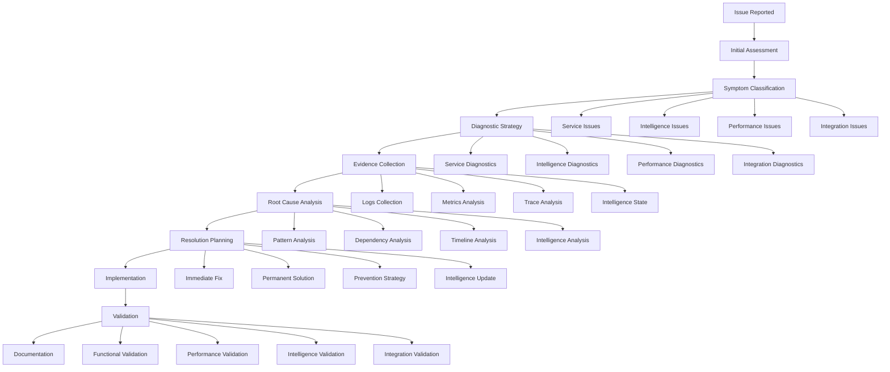

# Troubleshooting Workflow Documentation

## Overview

This document provides comprehensive troubleshooting workflows, diagnostic procedures, and resolution strategies for the OmniNode Bridge ecosystem. It includes systematic approaches to identifying, diagnosing, and resolving issues across all system components.

## Troubleshooting Architecture

### Systematic Troubleshooting Framework



## Diagnostic Framework

### Comprehensive Diagnostic System

```python
#!/usr/bin/env python3
"""
Comprehensive diagnostic system for OmniNode Bridge
"""

import asyncio
import logging
import json
import time
from typing import Dict, List, Any, Optional, Tuple
from dataclasses import dataclass, field
from enum import Enum
from datetime import datetime, timedelta

class IssueCategory(Enum):
    SERVICE_UNAVAILABLE = "service_unavailable"
    PERFORMANCE_DEGRADATION = "performance_degradation"
    INTELLIGENCE_FAILURE = "intelligence_failure"
    INTEGRATION_ERROR = "integration_error"
    DATA_INCONSISTENCY = "data_inconsistency"
    SECURITY_INCIDENT = "security_incident"

class Severity(Enum):
    CRITICAL = "critical"
    HIGH = "high"
    MEDIUM = "medium"
    LOW = "low"

@dataclass
class DiagnosticResult:
    component: str
    status: str
    details: Dict[str, Any] = field(default_factory=dict)
    recommendations: List[str] = field(default_factory=list)
    metrics: Dict[str, float] = field(default_factory=dict)

@dataclass
class TroubleshootingSession:
    session_id: str
    issue_category: IssueCategory
    severity: Severity
    start_time: datetime
    description: str
    affected_components: List[str] = field(default_factory=list)
    diagnostic_results: List[DiagnosticResult] = field(default_factory=list)
    resolution_steps: List[str] = field(default_factory=list)
    status: str = "active"

class ComprehensiveDiagnosticSystem:
    """Systematic diagnostic system for all OmniNode Bridge components"""

    def __init__(self, config: Dict[str, Any]):
        self.config = config
        self.logger = logging.getLogger(__name__)
        self.metrics_client = self._create_metrics_client()
        self.log_aggregator = self._create_log_aggregator()
        self.intelligence_monitor = self._create_intelligence_monitor()

    async def start_troubleshooting_session(self, issue_description: str,
                                          severity: Severity = Severity.MEDIUM) -> TroubleshootingSession:
        """Start comprehensive troubleshooting session"""

        session_id = f"ts_{int(time.time())}"

        print(f"🔍 Starting troubleshooting session: {session_id}")
        print(f"📝 Issue: {issue_description}")
        print(f"⚡ Severity: {severity.value}")

        # Classify the issue
        issue_category = await self._classify_issue(issue_description)

        session = TroubleshootingSession(
            session_id=session_id,
            issue_category=issue_category,
            severity=severity,
            start_time=datetime.utcnow(),
            description=issue_description
        )

        # Run initial system health check
        print(f"🏥 Running initial system health check...")
        health_results = await self._run_system_health_check()
        session.diagnostic_results.extend(health_results)

        # Identify affected components
        session.affected_components = await self._identify_affected_components(
            issue_category, health_results
        )

        print(f"🎯 Affected components: {', '.join(session.affected_components)}")

        return session

    async def run_comprehensive_diagnostics(self, session: TroubleshootingSession) -> TroubleshootingSession:
        """Run comprehensive diagnostics based on issue category"""

        print(f"🔬 Running comprehensive diagnostics for {session.issue_category.value}")

        # Select diagnostic strategy based on issue category
        diagnostic_strategies = {
            IssueCategory.SERVICE_UNAVAILABLE: self._diagnose_service_issues,
            IssueCategory.PERFORMANCE_DEGRADATION: self._diagnose_performance_issues,
            IssueCategory.INTELLIGENCE_FAILURE: self._diagnose_intelligence_issues,
            IssueCategory.INTEGRATION_ERROR: self._diagnose_integration_issues,
            IssueCategory.DATA_INCONSISTENCY: self._diagnose_data_issues,
            IssueCategory.SECURITY_INCIDENT: self._diagnose_security_issues
        }

        diagnostic_function = diagnostic_strategies.get(session.issue_category)

        if diagnostic_function:
            diagnostic_results = await diagnostic_function(session)
            session.diagnostic_results.extend(diagnostic_results)
        else:
            print(f"⚠️ No specific diagnostic strategy for {session.issue_category.value}")

        # Run cross-component analysis
        cross_component_results = await self._run_cross_component_analysis(session)
        session.diagnostic_results.extend(cross_component_results)

        return session

    async def _diagnose_service_issues(self, session: TroubleshootingSession) -> List[DiagnosticResult]:
        """Diagnose service availability and connectivity issues"""

        print(f"🔧 Diagnosing service issues...")

        results = []
        services = ["hook_receiver", "tool_proxy", "service_registry", "intelligence_engine"]

        for service in services:
            print(f"  📋 Checking {service}...")

            # Check service health
            health_result = await self._check_service_health(service)

            # Check service connectivity
            connectivity_result = await self._check_service_connectivity(service)

            # Check service resources
            resource_result = await self._check_service_resources(service)

            # Check service configuration
            config_result = await self._check_service_configuration(service)

            # Aggregate service diagnostics
            service_status = "healthy"
            service_details = {}
            service_recommendations = []

            if not health_result.get('healthy', False):
                service_status = "unhealthy"
                service_recommendations.append(f"Restart {service} service")
                service_details['health_issue'] = health_result.get('error', 'Unknown health issue')

            if not connectivity_result.get('connected', False):
                service_status = "disconnected"
                service_recommendations.append(f"Check network connectivity for {service}")
                service_details['connectivity_issue'] = connectivity_result.get('error', 'Connection failed')

            if resource_result.get('resource_issues', []):
                service_recommendations.extend([
                    f"Address resource constraints: {', '.join(resource_result['resource_issues'])}"
                ])

            results.append(DiagnosticResult(
                component=service,
                status=service_status,
                details=service_details,
                recommendations=service_recommendations,
                metrics={
                    'response_time': health_result.get('response_time', 0),
                    'cpu_usage': resource_result.get('cpu_usage', 0),
                    'memory_usage': resource_result.get('memory_usage', 0)
                }
            ))

        return results

    async def _diagnose_performance_issues(self, session: TroubleshootingSession) -> List[DiagnosticResult]:
        """Diagnose performance degradation issues"""

        print(f"📈 Diagnosing performance issues...")

        results = []

        # Check response time performance
        response_time_result = await self._analyze_response_times()
        results.append(DiagnosticResult(
            component="response_times",
            status=response_time_result.get('status', 'unknown'),
            details=response_time_result,
            recommendations=response_time_result.get('recommendations', [])
        ))

        # Check throughput performance
        throughput_result = await self._analyze_throughput()
        results.append(DiagnosticResult(
            component="throughput",
            status=throughput_result.get('status', 'unknown'),
            details=throughput_result,
            recommendations=throughput_result.get('recommendations', [])
        ))

        # Check resource utilization
        resource_result = await self._analyze_resource_utilization()
        results.append(DiagnosticResult(
            component="resource_utilization",
            status=resource_result.get('status', 'unknown'),
            details=resource_result,
            recommendations=resource_result.get('recommendations', [])
        ))

        # Check intelligence performance
        intelligence_perf_result = await self._analyze_intelligence_performance()
        results.append(DiagnosticResult(
            component="intelligence_performance",
            status=intelligence_perf_result.get('status', 'unknown'),
            details=intelligence_perf_result,
            recommendations=intelligence_perf_result.get('recommendations', [])
        ))

        return results

    async def _diagnose_intelligence_issues(self, session: TroubleshootingSession) -> List[DiagnosticResult]:
        """Diagnose intelligence system issues"""

        print(f"🧠 Diagnosing intelligence issues...")

        results = []

        # Check pattern discovery functionality
        pattern_discovery_result = await self._test_pattern_discovery()
        results.append(DiagnosticResult(
            component="pattern_discovery",
            status="working" if pattern_discovery_result.get('success', False) else "failed",
            details=pattern_discovery_result,
            recommendations=pattern_discovery_result.get('recommendations', [])
        ))

        # Check learning capabilities
        learning_result = await self._test_learning_capabilities()
        results.append(DiagnosticResult(
            component="learning_system",
            status="working" if learning_result.get('success', False) else "failed",
            details=learning_result,
            recommendations=learning_result.get('recommendations', [])
        ))

        # Check prediction accuracy
        prediction_result = await self._test_prediction_accuracy()
        results.append(DiagnosticResult(
            component="prediction_system",
            status="accurate" if prediction_result.get('accuracy', 0) > 0.8 else "inaccurate",
            details=prediction_result,
            recommendations=prediction_result.get('recommendations', [])
        ))

        # Check intelligence data integrity
        data_integrity_result = await self._check_intelligence_data_integrity()
        results.append(DiagnosticResult(
            component="intelligence_data",
            status="consistent" if data_integrity_result.get('consistent', False) else "inconsistent",
            details=data_integrity_result,
            recommendations=data_integrity_result.get('recommendations', [])
        ))

        return results

    async def _diagnose_integration_issues(self, session: TroubleshootingSession) -> List[DiagnosticResult]:
        """Diagnose service integration issues"""

        print(f"🔗 Diagnosing integration issues...")

        results = []

        # Test service-to-service communication
        service_comm_result = await self._test_service_communication()
        results.append(DiagnosticResult(
            component="service_communication",
            status="working" if service_comm_result.get('success', False) else "failed",
            details=service_comm_result,
            recommendations=service_comm_result.get('recommendations', [])
        ))

        # Test event flow
        event_flow_result = await self._test_event_flow()
        results.append(DiagnosticResult(
            component="event_flow",
            status="flowing" if event_flow_result.get('success', False) else "blocked",
            details=event_flow_result,
            recommendations=event_flow_result.get('recommendations', [])
        ))

        # Test external integrations
        external_integration_result = await self._test_external_integrations()
        results.append(DiagnosticResult(
            component="external_integrations",
            status="connected" if external_integration_result.get('success', False) else "disconnected",
            details=external_integration_result,
            recommendations=external_integration_result.get('recommendations', [])
        ))

        return results

    async def _test_pattern_discovery(self) -> Dict[str, Any]:
        """Test pattern discovery functionality"""

        try:
            # Generate test events
            test_events = [
                {
                    "type": "service_lifecycle",
                    "service": "test_service",
                    "event": "startup",
                    "timestamp": time.time() * 1000
                },
                {
                    "type": "service_lifecycle",
                    "service": "test_service",
                    "event": "health_check",
                    "timestamp": time.time() * 1000 + 1000
                },
                {
                    "type": "service_lifecycle",
                    "service": "test_service",
                    "event": "shutdown",
                    "timestamp": time.time() * 1000 + 2000
                }
            ]

            # Send events to intelligence system
            for event in test_events:
                await self.intelligence_monitor.send_test_event(event)

            # Wait for pattern discovery
            await asyncio.sleep(5)

            # Check if patterns were discovered
            discovered_patterns = await self.intelligence_monitor.get_discovered_patterns("test_service")

            success = len(discovered_patterns) > 0

            return {
                "success": success,
                "patterns_discovered": len(discovered_patterns),
                "patterns": discovered_patterns[:3],  # First 3 patterns
                "recommendations": [
                    "Pattern discovery working normally"
                ] if success else [
                    "Pattern discovery not working - check intelligence engine",
                    "Verify event ingestion pipeline",
                    "Check pattern discovery algorithms"
                ]
            }

        except Exception as e:
            return {
                "success": False,
                "error": str(e),
                "recommendations": [
                    "Intelligence system error - check logs",
                    "Verify intelligence engine connectivity",
                    "Check pattern discovery service health"
                ]
            }

    async def _analyze_response_times(self) -> Dict[str, Any]:
        """Analyze system response times"""

        try:
            # Get response time metrics from the last hour
            metrics = await self.metrics_client.get_response_time_metrics(hours=1)

            avg_response_time = metrics.get('avg_response_time', 0)
            p95_response_time = metrics.get('p95_response_time', 0)
            p99_response_time = metrics.get('p99_response_time', 0)

            status = "good"
            recommendations = []

            if p95_response_time > 1000:  # 1 second
                status = "degraded"
                recommendations.append("P95 response time above 1 second - investigate bottlenecks")

            if p99_response_time > 5000:  # 5 seconds
                status = "poor"
                recommendations.append("P99 response time above 5 seconds - critical performance issue")

            if avg_response_time > 500:  # 500ms
                recommendations.append("Average response time elevated - check system load")

            return {
                "status": status,
                "avg_response_time": avg_response_time,
                "p95_response_time": p95_response_time,
                "p99_response_time": p99_response_time,
                "recommendations": recommendations or ["Response times within acceptable limits"]
            }

        except Exception as e:
            return {
                "status": "unknown",
                "error": str(e),
                "recommendations": ["Unable to retrieve response time metrics"]
            }

    async def generate_resolution_plan(self, session: TroubleshootingSession) -> List[str]:
        """Generate comprehensive resolution plan"""

        print(f"📋 Generating resolution plan...")

        resolution_steps = []

        # Categorize issues by severity and component
        critical_issues = [r for r in session.diagnostic_results if r.status in ['failed', 'unhealthy', 'critical']]
        performance_issues = [r for r in session.diagnostic_results if 'degraded' in r.status or 'poor' in r.status]
        intelligence_issues = [r for r in session.diagnostic_results if 'intelligence' in r.component]

        # Priority 1: Critical service issues
        if critical_issues:
            resolution_steps.append("🚨 CRITICAL: Address service failures immediately")
            for issue in critical_issues:
                resolution_steps.extend([f"  - {rec}" for rec in issue.recommendations])

        # Priority 2: Intelligence system issues
        if intelligence_issues:
            resolution_steps.append("🧠 HIGH: Fix intelligence system issues")
            for issue in intelligence_issues:
                resolution_steps.extend([f"  - {rec}" for rec in issue.recommendations])

        # Priority 3: Performance issues
        if performance_issues:
            resolution_steps.append("📈 MEDIUM: Address performance degradation")
            for issue in performance_issues:
                resolution_steps.extend([f"  - {rec}" for rec in issue.recommendations])

        # Add general recommendations
        resolution_steps.extend([
            "🔍 ONGOING: Monitor system health during resolution",
            "📊 ONGOING: Track metrics to validate fixes",
            "📝 FINAL: Document resolution for future reference"
        ])

        session.resolution_steps = resolution_steps
        return resolution_steps

    async def execute_automated_fixes(self, session: TroubleshootingSession) -> Dict[str, Any]:
        """Execute automated fixes for known issues"""

        print(f"🤖 Executing automated fixes...")

        fix_results = {}

        # Automated fixes for common issues
        automated_fixes = {
            "service_restart": self._restart_unhealthy_services,
            "cache_clear": self._clear_system_caches,
            "connection_reset": self._reset_service_connections,
            "intelligence_recalibration": self._recalibrate_intelligence_system
        }

        # Determine which fixes to apply
        applicable_fixes = self._determine_applicable_fixes(session)

        for fix_name in applicable_fixes:
            if fix_name in automated_fixes:
                print(f"  🔧 Applying {fix_name}...")
                try:
                    result = await automated_fixes[fix_name](session)
                    fix_results[fix_name] = result
                    print(f"  ✅ {fix_name} completed: {result.get('status', 'unknown')}")
                except Exception as e:
                    fix_results[fix_name] = {"status": "failed", "error": str(e)}
                    print(f"  ❌ {fix_name} failed: {e}")

        return fix_results

    def _determine_applicable_fixes(self, session: TroubleshootingSession) -> List[str]:
        """Determine which automated fixes are applicable"""

        applicable_fixes = []

        # Check for services that need restart
        unhealthy_services = [r for r in session.diagnostic_results
                            if r.status in ['unhealthy', 'failed'] and 'service' in r.component]
        if unhealthy_services:
            applicable_fixes.append("service_restart")

        # Check for performance issues that might benefit from cache clearing
        performance_issues = [r for r in session.diagnostic_results
                            if 'degraded' in r.status or 'poor' in r.status]
        if performance_issues:
            applicable_fixes.append("cache_clear")

        # Check for connectivity issues
        connectivity_issues = [r for r in session.diagnostic_results
                             if 'disconnected' in r.status or 'connection' in str(r.details)]
        if connectivity_issues:
            applicable_fixes.append("connection_reset")

        # Check for intelligence issues
        intelligence_issues = [r for r in session.diagnostic_results
                             if 'intelligence' in r.component and r.status in ['failed', 'inaccurate']]
        if intelligence_issues:
            applicable_fixes.append("intelligence_recalibration")

        return applicable_fixes

    async def _restart_unhealthy_services(self, session: TroubleshootingSession) -> Dict[str, Any]:
        """Restart unhealthy services"""

        unhealthy_services = [r.component for r in session.diagnostic_results
                            if r.status in ['unhealthy', 'failed'] and 'service' in r.component]

        restart_results = {}

        for service in unhealthy_services:
            try:
                # Restart service (this would depend on your deployment method)
                result = await self._restart_service(service)
                restart_results[service] = result
            except Exception as e:
                restart_results[service] = {"status": "failed", "error": str(e)}

        return {
            "status": "completed",
            "services_restarted": list(restart_results.keys()),
            "results": restart_results
        }

    async def validate_resolution(self, session: TroubleshootingSession) -> Dict[str, Any]:
        """Validate that the resolution was successful"""

        print(f"✅ Validating resolution...")

        # Re-run diagnostics on affected components
        validation_results = {}

        for component in session.affected_components:
            print(f"  🔍 Validating {component}...")

            if 'service' in component:
                health_check = await self._check_service_health(component)
                validation_results[component] = {
                    "status": "healthy" if health_check.get('healthy', False) else "unhealthy",
                    "details": health_check
                }
            elif 'intelligence' in component:
                intelligence_check = await self._test_pattern_discovery()
                validation_results[component] = {
                    "status": "working" if intelligence_check.get('success', False) else "failed",
                    "details": intelligence_check
                }

        # Calculate overall resolution success
        successful_validations = [r for r in validation_results.values()
                                if r['status'] in ['healthy', 'working', 'good']]

        resolution_success_rate = len(successful_validations) / len(validation_results) if validation_results else 0

        return {
            "resolution_success_rate": resolution_success_rate,
            "validation_results": validation_results,
            "overall_status": "resolved" if resolution_success_rate >= 0.8 else "partially_resolved"
        }
```

## Common Issue Resolution Procedures

### Service Availability Issues

```bash
#!/bin/bash
# Service availability troubleshooting script

echo "🔍 OmniNode Bridge Service Availability Diagnostics"
echo "=================================================="

# Function to check service health
check_service_health() {
    local service_name=$1
    local port=$2

    echo "📋 Checking $service_name (port $port)..."

    # Check if service is responding
    if curl -f -s "http://localhost:$port/health" > /dev/null; then
        echo "  ✅ $service_name is responding"

        # Get detailed health info
        health_info=$(curl -s "http://localhost:$port/health" | jq .)
        echo "  📊 Health details: $health_info"
    else
        echo "  ❌ $service_name is not responding"

        # Check if process is running
        if pgrep -f "$service_name" > /dev/null; then
            echo "  🔄 Process is running but not responding"
            echo "  💡 Recommendation: Restart the service"
        else
            echo "  💀 Process is not running"
            echo "  💡 Recommendation: Start the service"
        fi

        # Check logs for errors
        echo "  📋 Recent logs:"
        docker logs "omninode-bridge-$service_name" --tail 10 2>/dev/null || \
        journalctl -u "omninode-bridge-$service_name" --lines 10 --no-pager 2>/dev/null || \
        echo "    No logs available"
    fi
    echo ""
}

# Function to check dependencies
check_dependencies() {
    echo "🔗 Checking Dependencies"
    echo "========================"

    # Check PostgreSQL
    echo "📋 Checking PostgreSQL..."
    if pg_isready -h localhost -p 5432 > /dev/null 2>&1; then
        echo "  ✅ PostgreSQL is available"
    else
        echo "  ❌ PostgreSQL is not available"
        echo "  💡 Start PostgreSQL: docker-compose up -d postgres"
    fi

    # Check Redis
    echo "📋 Checking Redis..."
    if redis-cli -h localhost -p 6379 ping > /dev/null 2>&1; then
        echo "  ✅ Redis is available"
    else
        echo "  ❌ Redis is not available"
        echo "  💡 Start Redis: docker-compose up -d redis"
    fi

    # Check Kafka
    echo "📋 Checking Kafka..."
    if nc -z localhost 9092 > /dev/null 2>&1; then
        echo "  ✅ Kafka is available"
    else
        echo "  ❌ Kafka is not available"
        echo "  💡 Start Kafka: docker-compose up -d kafka zookeeper"
    fi
    echo ""
}

# Function to check resource usage
check_resources() {
    echo "💻 Checking System Resources"
    echo "============================"

    # Check CPU usage
    cpu_usage=$(top -bn1 | grep "Cpu(s)" | awk '{print $2}' | cut -d'%' -f1)
    echo "📊 CPU Usage: ${cpu_usage}%"

    # Check memory usage
    memory_usage=$(free | grep Mem | awk '{printf "%.1f", $3/$2 * 100}')
    echo "📊 Memory Usage: ${memory_usage}%"

    # Check disk usage
    disk_usage=$(df -h . | awk 'NR==2{print $5}' | cut -d'%' -f1)
    echo "📊 Disk Usage: ${disk_usage}%"

    # Check for resource constraints
    if (( $(echo "$cpu_usage > 80" | bc -l) )); then
        echo "  ⚠️ High CPU usage detected"
    fi

    if (( $(echo "$memory_usage > 80" | bc -l) )); then
        echo "  ⚠️ High memory usage detected"
    fi

    if (( disk_usage > 80 )); then
        echo "  ⚠️ High disk usage detected"
    fi
    echo ""
}

# Function to run quick fixes
run_quick_fixes() {
    echo "🔧 Quick Fix Procedures"
    echo "======================="

    read -p "🤖 Run automated health recovery? (y/n): " -n 1 -r
    echo

    if [[ $REPLY =~ ^[Yy]$ ]]; then
        echo "🔄 Restarting unhealthy services..."

        # Restart services that are not responding
        services=("hook_receiver:8001" "tool_proxy:8002" "service_registry:8003" "intelligence_engine:8004")

        for service_port in "${services[@]}"; do
            IFS=':' read -r service port <<< "$service_port"

            if ! curl -f -s "http://localhost:$port/health" > /dev/null; then
                echo "  🔄 Restarting $service..."
                docker-compose restart "$service" || systemctl restart "omninode-bridge-$service"
                sleep 5

                # Verify restart
                if curl -f -s "http://localhost:$port/health" > /dev/null; then
                    echo "  ✅ $service restarted successfully"
                else
                    echo "  ❌ $service restart failed"
                fi
            fi
        done

        echo "🧹 Clearing system caches..."
        redis-cli -h localhost -p 6379 FLUSHALL > /dev/null 2>&1

        echo "✅ Quick fixes completed"
    fi
    echo ""
}

# Main execution
main() {
    echo "Starting OmniNode Bridge diagnostics..."
    echo ""

    # Check dependencies first
    check_dependencies

    # Check each service
    check_service_health "hook_receiver" "8001"
    check_service_health "tool_proxy" "8002"
    check_service_health "service_registry" "8003"
    check_service_health "intelligence_engine" "8004"

    # Check system resources
    check_resources

    # Offer quick fixes
    run_quick_fixes

    echo "🎯 Diagnostics completed!"
    echo "📋 For detailed troubleshooting, check logs: docker-compose logs -f"
}

# Run main function
main "$@"
```

### Intelligence System Troubleshooting

```python
#!/usr/bin/env python3
"""
Intelligence system troubleshooting utilities
"""

import asyncio
import json
import logging
from typing import Dict, List, Any
from datetime import datetime, timedelta

class IntelligenceTroubleshooter:
    """Specialized troubleshooting for intelligence system issues"""

    def __init__(self, config: Dict[str, Any]):
        self.config = config
        self.logger = logging.getLogger(__name__)

    async def diagnose_intelligence_system(self) -> Dict[str, Any]:
        """Comprehensive intelligence system diagnostics"""

        print("🧠 Intelligence System Diagnostics")
        print("==================================")

        diagnostics = {
            "pattern_discovery": await self._diagnose_pattern_discovery(),
            "learning_system": await self._diagnose_learning_system(),
            "prediction_accuracy": await self._diagnose_prediction_accuracy(),
            "data_integrity": await self._diagnose_data_integrity(),
            "performance": await self._diagnose_intelligence_performance()
        }

        # Generate overall health score
        health_scores = [d.get('health_score', 0) for d in diagnostics.values()]
        overall_health = sum(health_scores) / len(health_scores) if health_scores else 0

        print(f"\n📊 Overall Intelligence Health: {overall_health:.1f}/10")

        return {
            "overall_health": overall_health,
            "detailed_diagnostics": diagnostics,
            "recommendations": self._generate_intelligence_recommendations(diagnostics)
        }

    async def _diagnose_pattern_discovery(self) -> Dict[str, Any]:
        """Diagnose pattern discovery functionality"""

        print("  🔍 Testing pattern discovery...")

        try:
            # Test with known pattern sequence
            test_events = [
                {"type": "service_startup", "service": "test", "timestamp": 1000},
                {"type": "health_check", "service": "test", "timestamp": 2000},
                {"type": "service_ready", "service": "test", "timestamp": 3000}
            ]

            # Send test events
            for event in test_events:
                await self._send_test_event(event)

            # Wait for processing
            await asyncio.sleep(3)

            # Check if pattern was discovered
            patterns = await self._get_discovered_patterns("test")

            success = len(patterns) > 0
            health_score = 10 if success else 0

            return {
                "success": success,
                "patterns_found": len(patterns),
                "health_score": health_score,
                "details": patterns[:3] if patterns else [],
                "recommendations": [] if success else [
                    "Pattern discovery not working",
                    "Check event ingestion pipeline",
                    "Verify pattern detection algorithms"
                ]
            }

        except Exception as e:
            return {
                "success": False,
                "error": str(e),
                "health_score": 0,
                "recommendations": [
                    "Pattern discovery system error",
                    "Check intelligence engine connectivity",
                    "Verify database connections"
                ]
            }

    async def _diagnose_learning_system(self) -> Dict[str, Any]:
        """Diagnose learning capabilities"""

        print("  📚 Testing learning system...")

        try:
            # Test learning with feedback
            learning_test_result = await self._test_learning_capability()

            success = learning_test_result.get('learning_detected', False)
            improvement_rate = learning_test_result.get('improvement_rate', 0)
            health_score = min(10, improvement_rate * 20)  # Scale to 0-10

            return {
                "success": success,
                "improvement_rate": improvement_rate,
                "health_score": health_score,
                "details": learning_test_result,
                "recommendations": [] if success else [
                    "Learning system not adapting",
                    "Check learning algorithms",
                    "Verify feedback mechanisms"
                ]
            }

        except Exception as e:
            return {
                "success": False,
                "error": str(e),
                "health_score": 0,
                "recommendations": [
                    "Learning system error",
                    "Check machine learning components",
                    "Verify training data pipeline"
                ]
            }

    async def _diagnose_prediction_accuracy(self) -> Dict[str, Any]:
        """Diagnose prediction system accuracy"""

        print("  🎯 Testing prediction accuracy...")

        try:
            # Run prediction accuracy test
            accuracy_test = await self._test_prediction_accuracy()

            accuracy = accuracy_test.get('accuracy', 0)
            health_score = accuracy * 10  # Scale to 0-10

            recommendations = []
            if accuracy < 0.7:
                recommendations.extend([
                    "Prediction accuracy below 70%",
                    "Retrain prediction models",
                    "Increase training data quality"
                ])
            elif accuracy < 0.85:
                recommendations.append("Prediction accuracy could be improved")

            return {
                "success": accuracy > 0.5,
                "accuracy": accuracy,
                "health_score": health_score,
                "details": accuracy_test,
                "recommendations": recommendations
            }

        except Exception as e:
            return {
                "success": False,
                "error": str(e),
                "health_score": 0,
                "recommendations": [
                    "Prediction system error",
                    "Check prediction models",
                    "Verify inference pipeline"
                ]
            }

    async def fix_intelligence_issues(self, diagnostics: Dict[str, Any]) -> Dict[str, Any]:
        """Apply automated fixes for intelligence issues"""

        print("🔧 Applying Intelligence Fixes")
        print("==============================")

        fix_results = {}

        # Pattern discovery fixes
        if not diagnostics["pattern_discovery"]["success"]:
            print("  🔄 Fixing pattern discovery...")
            fix_results["pattern_discovery"] = await self._fix_pattern_discovery()

        # Learning system fixes
        if not diagnostics["learning_system"]["success"]:
            print("  🔄 Fixing learning system...")
            fix_results["learning_system"] = await self._fix_learning_system()

        # Prediction accuracy fixes
        if diagnostics["prediction_accuracy"]["accuracy"] < 0.7:
            print("  🔄 Improving prediction accuracy...")
            fix_results["prediction_accuracy"] = await self._improve_prediction_accuracy()

        # Data integrity fixes
        if not diagnostics["data_integrity"]["success"]:
            print("  🔄 Fixing data integrity...")
            fix_results["data_integrity"] = await self._fix_data_integrity()

        return fix_results

    async def _fix_pattern_discovery(self) -> Dict[str, Any]:
        """Fix pattern discovery issues"""

        try:
            # Reset pattern discovery state
            await self._reset_pattern_discovery()

            # Reinitialize with base patterns
            await self._initialize_base_patterns()

            # Test pattern discovery again
            test_result = await self._diagnose_pattern_discovery()

            return {
                "success": test_result["success"],
                "actions_taken": [
                    "Reset pattern discovery state",
                    "Reinitialized base patterns",
                    "Verified pattern discovery functionality"
                ]
            }

        except Exception as e:
            return {
                "success": False,
                "error": str(e),
                "actions_taken": ["Failed to fix pattern discovery"]
            }

    async def _improve_prediction_accuracy(self) -> Dict[str, Any]:
        """Improve prediction accuracy"""

        try:
            # Retrain prediction models with recent data
            await self._retrain_prediction_models()

            # Clear prediction cache to force fresh predictions
            await self._clear_prediction_cache()

            # Test prediction accuracy again
            test_result = await self._diagnose_prediction_accuracy()

            return {
                "success": test_result["accuracy"] > 0.7,
                "new_accuracy": test_result["accuracy"],
                "actions_taken": [
                    "Retrained prediction models",
                    "Cleared prediction cache",
                    "Verified improved accuracy"
                ]
            }

        except Exception as e:
            return {
                "success": False,
                "error": str(e),
                "actions_taken": ["Failed to improve prediction accuracy"]
            }

    def generate_intelligence_health_report(self, diagnostics: Dict[str, Any]) -> str:
        """Generate comprehensive intelligence health report"""

        report = f"""
🧠 Intelligence System Health Report
=====================================
Generated: {datetime.utcnow().isoformat()}

Overall Health Score: {diagnostics['overall_health']:.1f}/10

Component Status:
"""

        for component, details in diagnostics['detailed_diagnostics'].items():
            status = "✅ HEALTHY" if details.get('success', False) else "❌ UNHEALTHY"
            score = details.get('health_score', 0)
            report += f"  {component}: {status} (Score: {score:.1f}/10)\n"

        if diagnostics.get('recommendations'):
            report += "\nRecommendations:\n"
            for rec in diagnostics['recommendations']:
                report += f"  • {rec}\n"

        return report
```

## Escalation Procedures

### Issue Escalation Matrix

```yaml
# escalation_matrix.yaml
escalation_procedures:
  severity_levels:
    critical:
      response_time: "15 minutes"
      escalation_time: "30 minutes"
      notification_channels: ["slack", "pagerduty", "email", "sms"]
      escalation_chain:
        - primary: "on_call_engineer"
        - secondary: "team_lead"
        - tertiary: "engineering_manager"
        - final: "cto"

    high:
      response_time: "1 hour"
      escalation_time: "2 hours"
      notification_channels: ["slack", "email"]
      escalation_chain:
        - primary: "assigned_engineer"
        - secondary: "team_lead"
        - tertiary: "engineering_manager"

    medium:
      response_time: "4 hours"
      escalation_time: "8 hours"
      notification_channels: ["slack"]
      escalation_chain:
        - primary: "assigned_engineer"
        - secondary: "team_lead"

    low:
      response_time: "24 hours"
      escalation_time: "48 hours"
      notification_channels: ["slack"]
      escalation_chain:
        - primary: "assigned_engineer"

  issue_categories:
    service_unavailable:
      default_severity: "critical"
      auto_escalate: true
      required_actions:
        - "Immediate service restart attempt"
        - "Fallback to backup systems if available"
        - "Customer communication within 30 minutes"

    intelligence_failure:
      default_severity: "high"
      auto_escalate: false
      required_actions:
        - "Assess impact on service quality"
        - "Switch to fallback decision making if needed"
        - "Begin intelligence system diagnostics"

    performance_degradation:
      default_severity: "medium"
      auto_escalate: false
      required_actions:
        - "Monitor performance trends"
        - "Identify performance bottlenecks"
        - "Implement performance optimizations"

    security_incident:
      default_severity: "critical"
      auto_escalate: true
      required_actions:
        - "Isolate affected systems immediately"
        - "Preserve forensic evidence"
        - "Notify security team within 15 minutes"
        - "Begin incident response procedures"
```

This comprehensive troubleshooting workflow documentation provides systematic approaches to identifying, diagnosing, and resolving issues across the entire OmniNode Bridge ecosystem.
